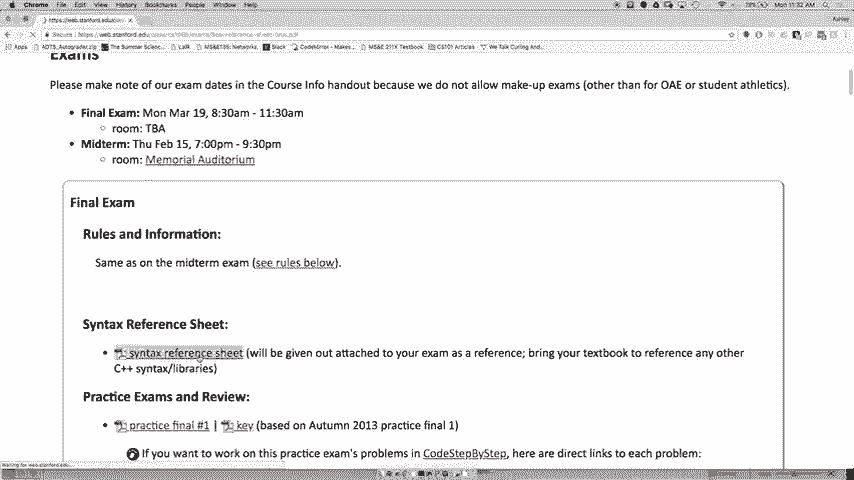
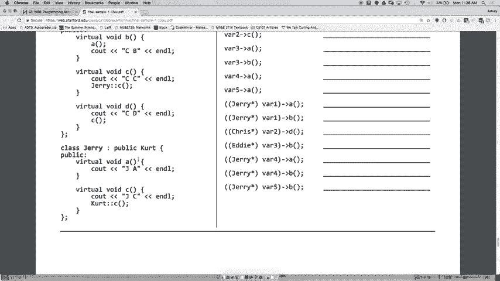
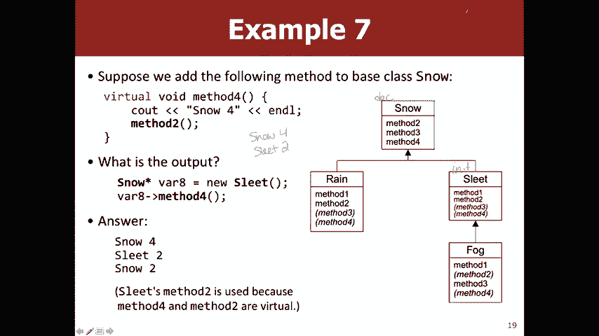

# 【斯坦福大学】CS106B C++中的抽象编程 · 2018年冬（完结·中英字幕·机翻） - P25：【Lecture 25】CS106B Programming Abstractions in C++ Win 2018 - 鬼谷良师 - BV1G7411k7jG

好的，大家好，星期一快乐，星期十，所以通常我，从狗的图片开始，但今天我想我会尝试给你一些，最终的有用提示可能不像狗那么酷，但是嗯，第一部分是将从本周四开始的最终审核会议，在370370中，晚上7点至8：

30，我们不会录制下来，但是幻灯片会，在线，我将由SL Zack和Nolan离开，所以一定会出来，好的，另外，我们发布了一堆，练习期末考试与中期练习非常相似，建议您尝试做尽可能多的事情。

并且实际上喜欢坐着，做下来，因为它们与您将要进行的考试非常相似，您将看到的这些考试只是上一季度的期末考试，所以最好的学习方法是参加一些考试，然后尝试写作，找出问题，而不是仅仅编码并逐步编码，因为。

这是一种不同的经历，好吧，所以你会得到一个。

语法参考表看起来像这样，所以它与期中考试非常相似，参考表的两个主要区别是没有太大的区别哦，但您不会，询问有关它们的问题，即使您担心，您也知道所有这些，事情已经实现了，所以您应该能够弄清楚。

然后第二部分是我们已经添加了所有这些图形内容，因此您拥有了。

关于顶点边缘和一些伪代码，因此，我们为您提供了很多信息，就像上次考试一样，考试是公开的，时间，我们将让您知道我们上次可获得的20本书，如果您没有自己的书，就不用担心。

所以这是实际考试的样子，大概是十点，混合了阅读代码和编写代码的问题，因此您可能会看到，像这样的事情，您必须像进行二进制搜索那样记住，您希望在每次搜索时将数组分成两半，然后您可能会。

必须做一些选择选择排序合并合并排序的事情，您不必为此编写代码，但是您必须知道，了解其效果如何，以便您可以通过什么来追踪，发生，另外，是的，您可能需要做更多的合并排序操作，例如，链表读取问题。

因此请了解一段代码正在处理，链表，您还必须编写链表代码，可能，另一方面，请确保您知道练习过的，指针之类的东西，因为那肯定会在考试中，二进制搜索树希望您能记住它们，刺激将您从二分搜索树移至二分搜索树。

就像看那些幻灯片，如果您忘记了它的工作原理，然后，您可能需要做一些不必为二进制文件写的事情，搜索树，但通常是二叉树，因此请确保您，了解两次冲销的工作原理，并了解使用哪种冲销，因为几乎像大多数二叉树一样。

某些问题可以解决，遍历然后查看堆，所以您必须实现一个4pq堆，因此，请了解如何插入到堆中从堆中删除，整个冒泡冒着冒泡的东西图正确，然后去，通过了解图形的一些术语，例如什么是，连通图什么是有向图。

确保您可以遍历我们讨论的各种算法，船员学校将如何在这个老船员学校中工作，他分心，但就像BFS如何在这张图表上工作一样，Dijkstra的，在这张图上工作，然后您可能必须编写一个具有。

它需要某种图形并对其执行某些操作，因此请确保您，了解如何遍历边缘如何遍历顶点如何，您知道要写出您选择的搜索算法是因为您，可能会看到考试中的任何内容，然后是最后一部分，或者最后一次看到。

零件是具有继承性和多态性的面食，所以这可能是，看起来像这样，我们今天晚些时候会看到它的示例，所以，如果您还不知道如何解决这个问题，请不要担心，因为今天就是这样。

演讲是为了然后您可能需要做一些自己喜欢的事情，编写类的东西，以便了解继承的工作原理，作为像这样使用继承的客户，以及作为写作者。

在设计课程时，一些您将无法理解的事情包括，绘制分形时，您可能仍会看到递归或递归回溯，因此，为整个过程做好准备，就像多重继承的事物和私有的一样，我们上周谈到的继承不会在正常的决赛中。

公共继承可能会给运营商带来不小的负担，斯坦福图书馆的图书馆，直到今天，您在课堂上所看到的所有东西都是决赛的公平游戏，重点将放在中期之后的内容上，尽管这很困难，在不使用例如递归权限的情况下写树型问题。

因为，基本上，树从根本上是递归的，所以该类是按其性质，累积的，因此希望在链接列表树图继承中看到更多内容，这类事情，您对最终主题可能有什么疑问，在上面，你就像该死的，不到一个星期就对不起，我毁了你的。

星期一好的好的嗯是的，请务必参加审核会议。

很多练习题之类的东西，然后真的要花一些时间，艾米（Amy）也要参加一些实践考试，我将继续参加，办公时间本周正常，这意味着会有办公时间，星期四和星期五仅用于考试问题，因为，您的作业应在星期三完成，因此。

如果您有任何类型的，考试问题，甚至就像在外面闲逛一样，进行最后的练习，嗯，问题是，以前会不会有任何明确的东西，中期就像文件读取一样，所以文件读取不是像这样中期，被明确排除在外，所以我认为那是不好的。

最后，四分之一抱歉，所以您可能需要读取文件等内容，但是，不会像这样设置问题的方式不是吗，演示您可以读取文件，这更像是您需要使用文件，阅读图表或其他内容，是的，所以我不能这样做，您肯定会，需要知道ADT。

您肯定仍然需要过电流破坏，操纵那种东西，还有其他问题，好吧，让我们谈谈多态性，因此背后的想法。

这堂课是记住的，星期五我说有两种用途，继承是从类编写者的代码角度来看的，您获得了所有这些可重用的代码，因此您不必编写太多的代码，您自己的代码，因为继承时您只是免费获得所有这些方法，这是另一个很好的原因。

并且可能想要更好的原因之一，继承是客户端可以处理两个对象，以相同的方式不同，所以基本上这意味着你可以有一堆，举例来说，您可以说可以订购其中的每一种，会说话的动物，而每个动物可能会以不同的方式说话。

像其中一些可能会发出嘎嘎声或呐喊声，或者基于它们的鸭子或鸭嘴，狗，但您仍然可以打电话讲所有这些，因此客户不需要，知道好吗，我目前正在与狗打交道，或者我正在与鸭子打交道，只是知道这是某种动物。

因为它是一种动物， ，说话的能力，因此客户实际上可以在所有，这些不同的动物或更笼统地说，它可以在，一些基本类的子类，所以基本上就是多态，所以像这样的鞭子来自希腊语like poly，这意味着很多。

更合身和变形，这意味着形式，所以就像许多形式，这意味着，您可以在不同的对象上运行相同的代码并获得不同的结果，像这样的行为还可以，所以你可以这样称呼，在椭圆形的gee上绘制，在I和G rect上绘制。

它们都将绘制一些东西，即使如此绘制的婚礼有所不同，所以在C ++中看起来像是你有某种指针，这样指针将是超类，实际的装饰是，该示例的子类是第三个，因此前两个是从星期五开始的， ，我们看到了员工阶级。

就像员工，律师， ，专利律师和程序员，所以第三个实际上是开拓者，因此继承是在现实世界中使用的，在该世界中，所有不同种类的地图，例如地形和迷宫，以及所有这些不同的地图，世界的子类。

因此您可以使用它们中的任何一个，并以任何形式调用EMS ，这就是为什么整个虚拟事物如此重要的原因，如果您还记得的话，谈到我，我知道基本上有一些问题，虚拟允许我们做的是。

如果我们确实有像Edna这样的东西， ，当我们称Edna点薪时等于新律师，得到律师的工资定义而不是雇员的工资定义，这就是为什么我们将虚拟技术用于一切的缺点之一，继承是你不能打电话给任何律师。

是Aetna上的唯一成员函数，因为Edna喜欢编译器，知道埃德娜（Edna）是一名员工，只有在它实际运行时，会意识到这是一名律师，而不仅仅是一名员工，所以您不会，感觉这种情况太频繁了。

您会在我们的一些示例中看到这一点，对继承进行测试，但这并不是人们使用继承的真正方式，在现实世界中，有两种主要方法，现实世界是第一个拥有吸引员工的方法的世界，但您可以通过聘用律师，程序或专利律师来代替。

如果您知道这实际上是星期五的代码，您还记得我吗，指出了薪水和休假表格等所有内容，有点东西，所以这就是我用来做的方法，所以我没有，需要为律师和专利律师写一篇，程序员，我可以只雇用一个雇员，所以这是。

为什么您不能像这样的仅限律师的特定会议方式打电话，函数，因为如果您要尝试执行此操作，则必须，能够与任何类型的员工打交道，而不仅仅是律师，所以这就是为什么，即使您知道我们是否要聘请律师，就像我们知道那是。

律师，但该程序必须能够在任何员工上运行此功能，然后另一个常见的用途是您可能有一组员工，但是，该集合的每个元素都可能像一个更具体的子类，因此您可以，想象一下，这实际上可能类似于真正的劳动力。

看起来您的劳动力是由律师和程序员组成的，但是您，只会将它们放在一组员工中，所以如果您想做，像找到所有这些人的预算之类的，您可以称薪水， ，它会使用特定的薪酬实施方式，而不仅仅是通用员工。

薪水您对遗传有什么疑问或对多态感到抱歉，为什么我们要使用它为什么像我们通常使用它那样，好的，很酷，我是说你不能打电话通知你知道在垃圾上起诉，一个普通的员工，所以您可以回避的方式就是可以回去。

通过投射实现这种额外的功能，因此投射暂时是做什么的，改变，就像它暂时说这个变量的类型是什么，我将其投射到，编译器只会信任您，即使不是，实际上就像那样，它将相信你，所以那，对于那一行代码。

您可以将变量视为，随便你怎么做，在这种情况下，埃德娜都是真正的专利律师，但是如果，我们称您知道文件专利不是编译器也不知道。

埃德娜（Edna）真的是一名专利律师凯勒（Kyler）就像是我刚刚聘请的劳拉（Laura） ，埃德娜（Edna）只是一名普通律师，普通律师不知道如何申请专利，所以我认为Edna不知道如何申请专利。

但是如果我们告诉编译器，就像哦，埃德娜（Edna）实际上是一名专利律师，那么您就可以调用文件，专利，但您知道Edna的下一行代码不再，被认为是专利律师了，我知道它被认为是律师，好的，是的，是的。

所以问题就像你为什么不只将Edna称为专利，律师从一开始就与权利有关，所以这些都是，在我们显式创建这些指针的地方做了一些设计，可能会认为这是因为埃德娜（Edna）是的，就像实际上是一群员工一样。

所以您可能会有某种if语句，例如，如果Edna Edna是，真的就像您在Edna上调用一些函数以获取Edna的子类， ，那么您会说，如果Edna的子类是专利律师，则调用文件。

如果Edna子类就像律师或其他正确的东西，则该专利，情况会更多，您会看到它，而您不会真正看到它，像这样的代码是一个很好的问题，是的，所以问题就像你，检查什么是子类，我不太确定C ++中的硬汉，像我一样。

我确定有一种方法可以解决，在Java中我知道，就像是或的实例，然后您将其放在类中，然后在，对象本身，您也可以做一些事情，例如员工有一个，就像这样的方法会返回一个字符串，说明它是哪种类型的员工，以及所有。

子类的雇员将覆盖它，所以这是做到这一点的一种方法，以为还有另一个问题好吗，很好，所以请记住我是怎么说的，如果，你说一个对象，就像你说一个对象是什么类型一样，相信你，那是因为它假设你比，编译器的问题是。

如果您尝试将对象转换为某种对象，它本身不是某种东西，或者不是当时的子类，您会遇到意想不到的行为或崩溃，所以可能您的程序可能不会崩溃也许我只是做错了事，但您绝对想避免这样的事情，因为它会导致。

难以预测的非常难以预测的行为，因此，如果，您向一名程序员投了律师或一个律师对象，或者如果您投了一名律师， ，专利律师的律师，而实际上不是幕后的专利律师，两种类型的Rick都会这样，好吧。

我们是说埃德娜（Edna）是一名员工，好吧，然后是的，所以你可以说像这样，这很好，你可以，说这样的话，那完全没问题，因为所有专利律师，是律师，所以这有点像如果您还记得我在谈论这双嘴唇，咳嗽替代原则。

这就是为什么，因为你需要能够治疗，这些对象是的，它们是超类的，所以，如果我们不投，我们可以使用起诉栏吗？我们可以让员工留在这里好吧，好吧，如果它看起来像，你能打电话给苏，答案是肯定的，因为埃德娜就像。

编译器知道Edna是律师类型，因此您可以起诉，因为所有，律师们提出了一个很大的问题，好吧，我知道选角有些棘手，所以，还有其他问题吗，所以，我们将要做的其中一个例子。

跟踪如果在不同的位置调用不同的方法会发生什么，超类中类似子类的组合，所以我将其复制到，白板，我希望您能看到它不是很大，所以大，这里的要点是，每种方法都将始终被声明为虚拟方法，而我们不会。

在非虚拟和继承上对您进行测试，因为它很棘手，永远都不会，无论如何都要完成，然后我们不会尝试用输出来欺骗您，所以我们不会有像大雪一样的方法来打印泄漏三，或类似的东西不是我们真的试图测试您是否知道。

哪些方法被调用说我们可能在这里有类似的东西，我们在该方法内调用另一个函数的地方，在这种情况下，您，可能会得到一些不同的输出，但这是因为我们称此为其他，功能，就像这些规则适用于这些继承中的任何一个。

你会遇到的问题对考试来说是公平的，所以希望如此，您会看到，唯一棘手的就是我圈出的那个，因为它，调用snows方法可以，所以当您遇到类似问题时，这是一个很好的方法。

这是通过只写出像这样来查找层次结构开始的，继承，那么什么从什么继承而来，还要写下每个人拥有的方法以及它们是否被继承，来自超类还是不正确，在这种情况下，什么是顶级，超类雪权，这是不会继承任何东西的一种。

所以我们要下雪什么方法只是下雪帽，是的，两个和三个好吧，那是什么呢？ ，工作人员睡得好，所以什么方法只是套件显式地编写自己，是的，对不起，这是它是否从雪继承了任何方法，是的，所以我将3放在括号中。

以便我们知道它是继承的，好吧，雪的另一个子类是雾吧，不对不起是雨，那是什么，明确写出了雨季的方法一和三，它继承了两种方法，下雪好了，然后雾是睡眠的一个子类，就像那样，方法一和方法二。

因此它继承了三个有关您的问题，是的，我不这么认为，除非我在黑板上写下了错误的内容，好吗，抱歉，还可以，方法3 ，而不是方法2对不起，让我更改，是的，明确的妈妈，我正在录制好电话，是的，我的。

漂亮的图表消失了，但是看起来像这样，第一次就可以了，你要做的是弄清楚班级是什么样的，层次结构是这样，我们知道它是父类，因为它是父类，那不是不是从任何东西继承而来，然后是snow的子类，雨夹雪。

我的意思是说，然后福格是雨夹雪的子类，然后你会怎样，从这里要做的是尝试找出每个方法明确使用的方法，所以下雪明确地写了两个和三个雨夹雪明确地写了一个和，二，雾明确地写出一和三，而雨水明确地写出一和三。

两个，然后您想弄清楚哪些是正确继承的，那么哪个，它可以访问，但没有明确地写，所以在这种情况下，每个，雪的子类将具有两个和三个，因此意味着雨夹雪必须，继承三个雨必须继承三个，雾必须继承两个我们都可以。

是个好问题，是的，所以问题是雾气何时传承-什么- ，是雾的继承者，所以它是从最多或最近的继承，会下雨夹雪而不是下雪的超类你有什么疑问，只是制作这张图，因此，让我们在如何解决这些问题的背景下讨论这类问题。

继承问题，所以如果您得到像您这样的东西，可能会在考试中，您必须弄清楚产生了什么输出，所以，你想做的那种方式是你要开始并看一下，声明哪个是等号左侧所有的蓝色类型，等号右边然后右边是初始化的类型。

这是一种水果，所以如果您看向左侧，您想看看该变量，有这种类型的成员，雨夹雪也有一种方法，这种情况下确实如此，所以不会出现编译器错误，然后您就关闭了，看起来不错，那么初始化类型是什么，等号。

在这种情况下是雾，所以你去看雾方法一，好吧，好吧，现在回到您的问题，如果您有问题该怎么办，像其他函数调用和符号一样，这有两种，您可以拥有的函数调用，因此第一个是您喜欢的地方，此处的类名称，在这种情况下。

请转到该类并执行该类的代码，如果该类没有这样的代码，比如说我们叫yeah，比如，我们称之为下雨或抱歉，让我们称之为雨夹雪的方法3，因为，我们继承了没有积雪的方法，就像积雪方法3一样使用。

因为那和sleeps方法3一样，因为sleet继承了它，如果只是说方法3您使用初始化的类型，则没有类名，方法，所以我们从哪个类调用它并不重要，您决定，所以您要么让库蒂斯喜欢这样的问题，例如，您可以跳出。

像你这样的继承人可以像雨夹雪一样叫这里，答案是否定的，因为它们彼此之间没有直接关系，所以打电话无效，如果你有点像你的话，那似乎并不正确，可能像geo Ville这样称呼它，可能是一个round函数。

或者是，如果宽度和高度相同，则圆形功能就正确了，从矩形中调用它，因为那没有意义哦，是的，所以问题是这是我们之前所做工作的延续，并不重要，这就像是一种方法，这些类还可以，所以问题是如果我们试图调用方法。

三个和正在编写的类或类循环这是一个方法，没有方法三会发生什么，所以在这种情况下，您将使用，这个超级类方法三，就像您说的那样，它会自动，值得，因为像子类这样的吸气具有所有，超类确实知道。

所以它不必调用snow：或其他任何东西，使用那个um之一，那么问题就像我们为什么要这样称呼， snow：而且我们这样做的原因是有点像我们在做什么，上周我们希望律师的薪水是律师薪水的两倍。

像我们这样的员工，我们可能会尝试调用一种特定的方法，因此，你是从哪里来的，所以有一个问题，当您调用方法二时，您仍然调用虚拟语句吗？ ，在这种情况下，您将始终执行snows方法2，无论是否。

 snows方法2是虚拟的还是不是虚拟的？ ，在方法三的情况下，您总是调用初始化类型的方法三，所以等号右边是什么，你只会，在该类中具有虚拟继承，因此您不必担心跳，非虚拟是，好吧，对不起。

所以你说甜蜜的星星B等于新雾好了，然后你，说一种方法好吧好吧所以在这种情况下， [音乐] ，除了您已经在乎之外，您是否已经从中继承了所有方法，您的超类中的方法像雪一样调用的唯一原因是：电话是否。

您想专门在雪中像这样的代码进行调用，我们认为，可能在您想要的任何时候都被覆盖了，实际上是snow的方法三，而不仅仅是通用方法三，会叫雪：方法3是的，问题是你能给一些吗，发生编译器错误的示例，如果您有。

像v2​​之类的雪星等于新雨夹雪，然后如果我们想，像方法2一样调用v2箭头，这将无法正常工作，因为没有积雪，一个正确的方法，所以编译器会像哦，大雪没有方法，一个，所以我不会让它编译。

因为我对这个变量的了解，是雪的类型吗，是的，问题是这样，那么读到的情况就是睡着了， ，完全可以，所以这个问题让我们假设雨夹雪像这样，其他如何解决编译器错误的方法，这样您就可以。

围绕它进行铸造或与您永远不要调用对象的方法，被声明为snap类型，因此，如果您要使用方法，则可以，您将变量的类型设置为sleet，而不是，左侧，是的，那就是我完全一样。

我们就像您不能以非权利和雇员权利要求提起诉讼，起诉被宣告为类型律师的事物，是的，完全相同，是的，是的，所以您不能在B 2上调用方法1，因为编译器将执行，对，所以问题就像一个已经准备好的问题。

它将写成相反的意思，其实，所以问题是一个类可以从C ++中的两个不同类继承吗，但这很罕见，是的，很酷，因为它进入了非常奇怪的行为，就像两个类都有一个方法一样，哪个方法要您使用，我也要做一些例子。

所以我们谈了一些有关类型转换的内容，但是如果您有一个类型路径，那么发生的事情是声明的类型变为，不管您放弃了什么，所以如果您知道是否仍然没有强制类型，该方法，如果将其强制转换为。

这实际上不像是如果您将一名程序员投给律师，那么您会得到，然后像这样的编译器会崩溃，所以唯一的方法就是崩溃，是通过强制转换，然后假设您不崩溃就不会得到编译器，错误，您仍然执行对象初始化类型，因此如果您。

将专利律师投给律师，然后提起诉讼将其称为，专利律师起诉而不是律师起诉，好吧，是的，基本上这只会防止编译器错误，不会改变，输出，除非类似它可能会导致崩溃，可以总结一下。

我们一直在谈论如果您看到这些代码行之一， ，您要说的第一件事是变量强制转换-如果是，如果强制类型是超类或与初始化类型相同的类，所以等号右边的东西，就像我们刚才说的那样，现在。

如果声明类型不是Casta类型，它将立即崩溃，所以如果，我们试图将睡眠蒙上一层雾，然后它会崩溃，然后我们说，声明的类型或超类定义了我们正在查看的方法，所以您知道，如果我们想给睡眠打ack 3。

我们会说只是下雪或雨夹雪，方法3，如果有，那么我们使用右侧的初始化类型，等号的一侧，我们运行该类型3的方法，否则我们有一个，编译器错误，所以它只是总结什么总结就是为什么我。

在上一张幻灯片中一直在说您对此有什么疑问，是的，如果您使用xavie方法-在这种情况下，我们会说雪有没有，因此V不会下雪吗？ ，然后我们会让我下去雾气，说什么是雾气方法-是的，问题是这样的。

所以我们有一个雪和数组，然后我们将其投射，雨夹雪，雨夹雪不是我们继承树的另一个分支，等级然后下雨是为什么为什么这个工作它实际上不起作用它是，就像一个例子，你会看到这样的事情，所以输出，实际上是会崩溃的。

所以初始化的类型是rain ，类型是雪，转换类型是雨夹雪，所以您可以将雨夹雪和，雨呀，所以问题是，这只会崩溃而没有编译器错误，所以您，首先会检查编译器错误，就像我们有一个方法，这样做会导致崩溃。

所以我们还要做一些例子，好吧，假设我们有这样的事情，那里有雪和雨，我们，要调用方法一，那么声明的类型是什么，所以我们的声明类型，是下雪了什么是我们的初始化类型是是好吧好吧，雪有一个方法没有。

那么会发生什么是的编译器错误好吧，让我们，说我们有这个VAR 3，所以我们的声明类型是什么，好，我们的类型是什么，初始化类型好，斯诺有两种方法吗，好吧，我们要调用方法二。

所以我们在这里讲到范围方法是什么，二，它会打印出雨水，好吧，好吧，如果我们要，这样的东西，所以我们的声明类型是什么，我们初始化的是什么，输入OK，所以现在我们说OK，方法一，二。

雪有一种方法-所以我们继续使用冰夹雪的方法-这样就可以了，一，您对那三个到目前为止有什么疑问，是的，所以这个问题，是当您调用方法2时，它只是知道要入睡，是的，这完全是morkul ，禅宗就这样，好吧。

现在让我们进入一个铸造示例，因为我们下雪了，所以我们声明，类型是下雪吧，我们的初始化类型是下雨，我们的班级类型好吗，所以下雨好吗，所以首先要这样做，谷物有一种方法是可以的，所以不会是编译器错误。

一个子类或与rain相同的类是好的，然后让我们将方法称为，因此，所谓的“是下雨”方法会打印出来，下雨一个好吧，所以初始化初始化就可以了，我们的种姓是什么？ ，然后是雾是雨夹雪的子类或同一个类。

有一个好的方法，所以这不是崩溃，也不是编译器错误，所以，当我们调用方法一时，我们将雾方法称为一，所以打印出来的是什么，是的，这个问题好吗，所以问题是，就像为什么为什么打印出雾而不是雨夹雪，所以铸造不会。

更改初始化类型，它仅更改声明的类型，因此没有，喜欢使之称为雨夹雪而不是雾的方法，这样做是为了像实际制作一个类型为sleep而不是a的新对象。 ，输入fog，这样投射不会改变实际的输出，它只会像。

所谓的合法通话基本上就是不更改该对象，在幕后只是说这是一种什么样的做，如果对不起，哦，如果是这样，就像甜蜜，那么我们可以做这个吗，下雪了，是的，你可以做到的，知道的是正确的，所以问题就像你可以。

这样做是的，因为您仍然会问，喜欢的问题是雾是子类还是雪，是的，snow实际上没有方法一，所以这将是一个编译器，但它将，是编译器错误，因为方法一件事不是因为下雪和。

 sleet ding有意义吗是的对不起，清除初始化的Sarika缓存是的，所以有问题吗，使该对象执行sleet方法的任何方法我都不认为，我很确定没有办法让这个对象执行。

请一种使雾气消失的方法一叫睡眠方法一，还有几个问题，所以真的很简单，这个很抱歉，一个声明了初始化的演员表，所以是因为初始化传递了初始化类，与铸造班级在树的不同分支中，这将是一个迷恋，然后在这个例子中。

如果我们要有一个方法称为何时，我们调用方法，因此在调用时这里声明为已初始化，八号酒吧的方法，您将去睡觉史密斯和财富希律王，下雪，这样就可以打印出雪，之前下雪，然后它将调用方法二，并且将调用糖果，方法二。

因为在后台该对象是一个雨夹雪对象，所以它是，如果您有任何疑问要见我，请不要下雪，多谢您，下课后是的问题是，如果雨夹雪没有方法-那将是。

