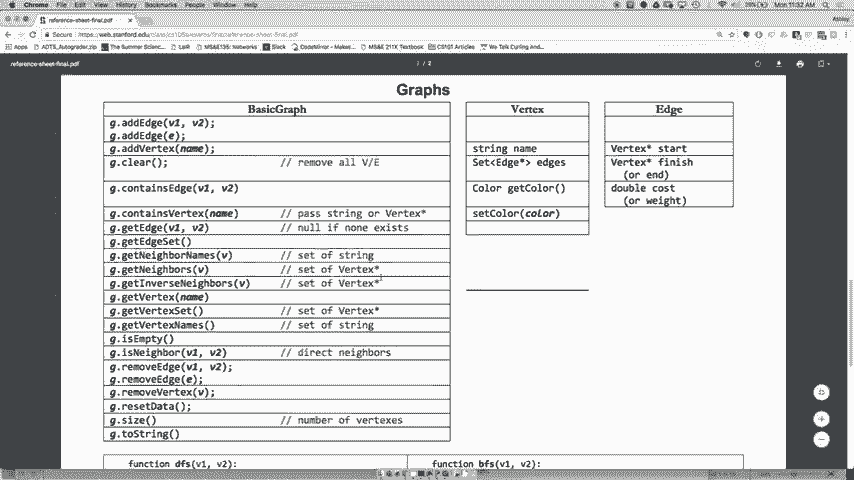
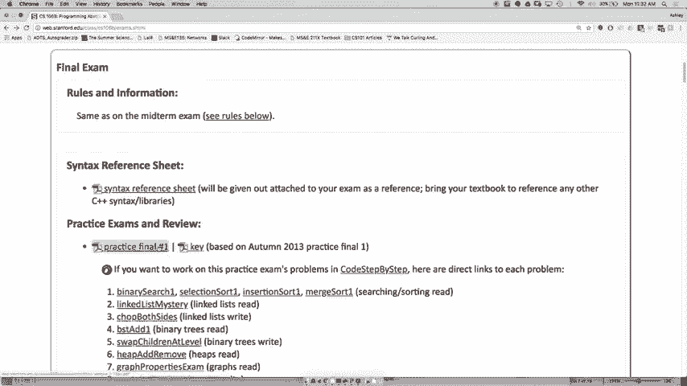
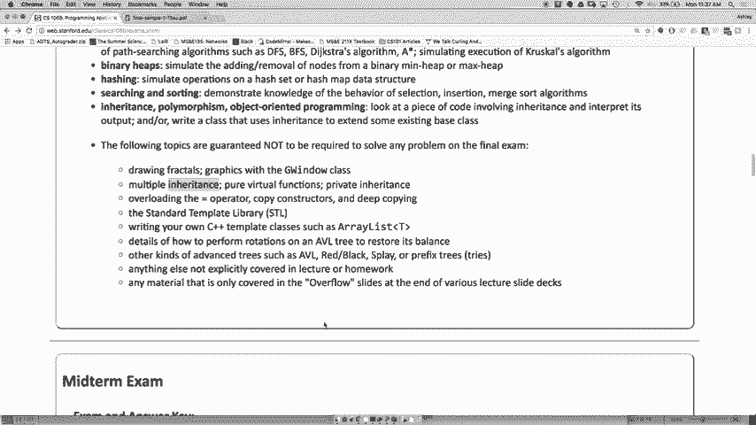
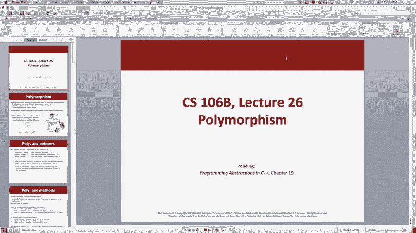
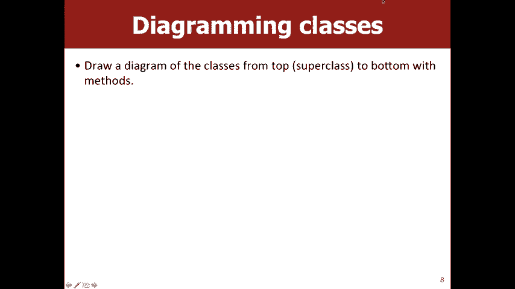
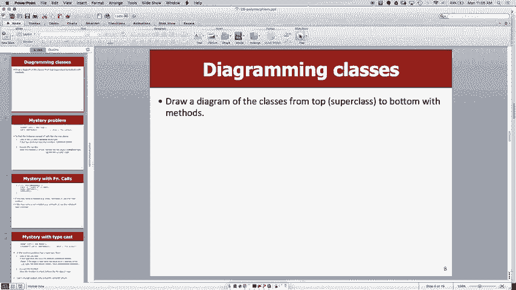

# 课程名称：CS106B C++中的抽象编程 · 第25讲：多态性与继承复习 🧩


## 概述
在本节课中，我们将学习C++中多态性与继承的核心概念，并复习期末考试的相关准备事项。课程内容包括理解多态性的工作原理、如何分析涉及继承的代码问题，以及期末考试的形式和重点。





---

## 期末考试信息与复习建议 📝

期末考试将于近期举行。为了帮助大家准备，我们安排了复习会议，并发布了练习题。


复习会议将于本周四晚上7点至8点30分在370教室举行。会议内容不会被录制，但相关幻灯片会在线发布。主讲人是助教Zack和Nolan。

我们发布了一系列练习题，其形式与期中考试的练习题非常相似。建议尽可能多地练习，并模拟真实考试环境进行答题，因为这是最有效的备考方式。



以下是关于期末考试的一些具体信息：



*   **考试形式**：考试是开卷的，允许携带参考材料。考试时长等信息将另行通知。
*   **参考表**：考试时会提供语法参考表。与期中考试的主要区别在于，不会考察标准库容器的具体实现细节，但你需要理解其用法。此外，参考表会包含本学期新学的图形（Graph）相关内容，例如顶点（Vertex）、边（Edge）的定义和一些算法的伪代码。
*   **考试内容**：考试包含阅读代码和编写代码的题目。可能涉及以下主题：
    *   二分搜索、选择排序、归并排序等算法的原理和追踪。
    *   链表操作。
    *   指针的使用。
    *   二叉搜索树（BST）和二叉树遍历。
    *   堆（Heap）的插入与删除操作。
    *   图（Graph）的基本术语（如连通图、有向图）和遍历算法（如BFS广度优先搜索、Dijkstra算法）。
    *   继承与多态性。
    *   递归与递归回溯（如绘制分形图）。
*   **考试重点**：重点将放在期中考试之后学习的内容上，特别是链表、树、图、继承和多态性。虽然递归是树结构的基础，但考试可能侧重于这些数据结构的应用。
*   **不考察的内容**：多重继承、私有继承、运算符重载以及斯坦福特定库的深入细节将不在考试范围内。

对于期末主题有任何疑问，请务必参加复习会议、完成练习题，并参加本周的常规办公时间进行咨询。

---

## 多态性（Polymorphism）的核心概念 🔄

上一节我们介绍了期末考试的概况，本节中我们来看看一个核心考点：多态性。

多态性允许我们以统一的方式处理不同类型的对象。从客户（使用类的代码）的角度来看，多态性的主要优点是：客户可以用相同的方式处理不同的对象，而无需关心对象的具体类型。

例如，可以定义一个“动物”基类，它有`speak()`方法。然后，“狗”和“鸭”子类各自以不同的方式（汪汪叫或嘎嘎叫）重写`speak()`方法。客户代码只需要知道它在处理一个“动物”对象，并调用`speak()`方法，具体发出什么声音由对象的实际类型决定。

在C++中，这通常通过基类（超类）指针或引用来实现。这个指针可以指向任何派生类（子类）的对象。当通过基类指针调用一个被声明为`virtual`（虚函数）的方法时，程序会在运行时决定调用哪个类（基类或子类）的实现。这就是**动态绑定**。

**关键公式/代码描述**：
```cpp
class Animal {
public:
    virtual void speak() { cout << "Some sound" << endl; }
};

class Dog : public Animal {
public:
    void speak() override { cout << "Woof!" << endl; } // 重写基类方法
};

class Duck : public Animal {
public:
    void speak() override { cout << "Quack!" << endl; } // 重写基类方法
};

// 客户端代码
Animal* myPet = new Dog();
myPet->speak(); // 输出 "Woof!"，尽管 myPet 是 Animal* 类型

myPet = new Duck();
myPet->speak(); // 输出 "Quack!"
```
`virtual`关键字使得`speak()`函数的行为是多态的。`override`关键字（C++11）明确表示此函数是重写基类的虚函数。





---

## 类型转换（Casting）与继承 ⚙️

有时，你可能需要将基类指针转换为其派生类类型，以访问派生类特有的方法。这通过**类型转换**实现。

类型转换会暂时改变编译器对变量类型的认知。但是，它**不会改变对象的实际类型**。如果转换是不安全的（例如，试图将一个`Employee`对象转换为`Lawyer`，而该对象实际上并不是`Lawyer`），可能导致程序崩溃或未定义行为。

安全转换的前提是：转换的目标类型必须是对象实际类型的基类或相同类型（即“向上转换”或“平级转换”）。

**关键代码描述**：
```cpp
Employee* e = new PatentLawyer(); // e 静态类型是 Employee*，动态类型是 PatentLawyer*
// e->filePatent(); // 错误！编译器只知道 e 是 Employee，而 Employee 没有 filePatent 方法

PatentLawyer* pl = static_cast<PatentLawyer*>(e); // 显式类型转换
pl->filePatent(); // 正确，因为 pl 是 PatentLawyer* 类型
```
需要注意的是，在上面的例子中，转换之所以安全，是因为我们知道`e`实际指向一个`PatentLawyer`对象。如果`e`指向的是一个普通的`Employee`，那么转换就是错误的。

---

## 如何分析继承与多态代码题 📊

在考试中，你可能会遇到需要分析类继承层次和判断程序输出的题目。以下是解决这类问题的系统方法：

1.  **绘制继承图**：首先，根据代码理清类之间的继承关系。标出哪个是基类，哪个是派生类。
2.  **列出方法**：为每个类列出它**显式定义**的方法。同时，标出它从基类**继承**的方法（即未重写的方法）。
3.  **分析调用**：对于每一行函数调用代码，确定：
    *   **声明类型**：等号左侧的变量类型。它决定了编译器在编译时认为可以调用哪些方法。
    *   **初始化/实际类型**：`new`关键字后面创建的对象类型（等号右侧）。它决定了在运行时，虚函数（`virtual`）会调用哪个版本。
    *   **转换类型**（如果存在）：在类型转换操作中指定的目标类型。
4.  **应用规则**：
    *   如果要调用的方法在**声明类型**中不存在 → **编译错误**。
    *   如果存在类型转换，且**转换类型**不是**实际类型**的基类或相同类 → **运行时崩溃**（不安全的转换）。
    *   对于虚函数的调用（普通调用，如 `obj->method()`），使用**实际类型**来决定执行哪个版本的方法。
    *   对于非虚函数的调用，或使用了作用域解析运算符的调用（如 `BaseClass::method()`），使用**声明类型**或指定的类来决定执行哪个版本的方法。

**示例分析框架**：
假设有类 `Snow`、`Sleet` (继承自 `Snow`)、`Fog` (继承自 `Sleet`)、`Rain` (继承自 `Snow`)。
对于代码 `Snow* var = new Fog(); var->method1();`
*   声明类型：`Snow*`
*   实际类型：`Fog*`
*   检查：`Snow` 是否有 `method1`？如果有，则编译通过。
*   调用：因为 `method1` 是虚函数，所以调用 `Fog` 类中定义的 `method1`。

---

## 总结

本节课中我们一起学习了多态性的核心思想，即“同一接口，不同实现”。我们深入探讨了`virtual`关键字如何实现动态绑定，使得通过基类指针调用方法时能执行正确的派生类版本。我们还学习了类型转换在继承体系中的用法与风险，并掌握了一套系统的方法来分析涉及继承和多态的复杂代码，以判断其输出或错误。这些概念和技巧是理解面向对象编程高级特性的基础，也是应对期末考试相关题目的关键。


祝大家复习顺利！