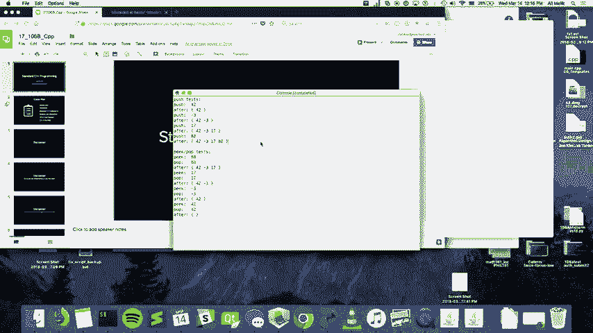
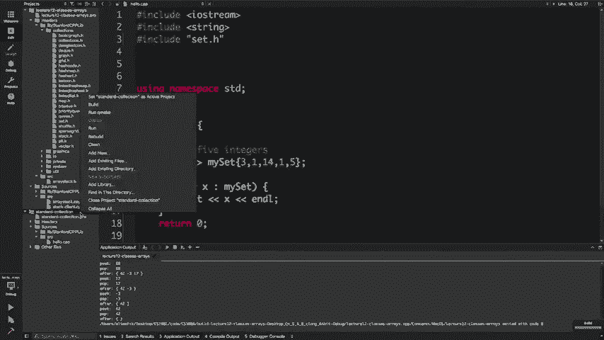

# 课程名称：CS106B C++中的抽象编程 · 第26讲：现实世界中的C++ 🚀

在本节课中，我们将学习C++在实际工业环境中的应用。我们将探讨一些高级C++特性，如模板、标准库容器、迭代器和算法，并了解它们如何使代码更强大、更通用。课程旨在为你提供一个从学术C++到工业C++的过渡视角。

## 概述：为什么学习C++？ 💡

C++是一门功能强大且非常流行的编程语言。它允许你以多种范式进行编程，例如面向对象编程和函数式编程。在行业标准索引中，C++始终位列最受欢迎语言的前五名。它被广泛应用于浏览器、游戏开发、高性能系统，甚至用于实现Java运行时环境。学习C++能让你掌握一门在现实世界中极具价值的工具。

## 模板：编写通用代码的蓝图 📐

上一节我们介绍了学习C++的动机，本节中我们来看看如何编写更通用、可复用的代码。模板是C++中实现泛型编程的核心特性。


### 模板的动机

假设你需要一个函数来返回两个整数中的较小值。你可能会这样写：
```cpp
int min(int a, int b) {
    return (a < b) ? a : b;
}
```
但如果你还需要处理`double`、`float`或`string`类型呢？为每种类型都重写一个几乎相同的函数会导致代码冗余和维护困难。

模板解决了这个问题。它允许你编写一个函数或类的“蓝图”，编译器会根据你使用的具体类型来生成相应的代码。

### 函数模板

以下是如何将`min`函数改写为模板函数：
```cpp
template <typename T>
T min(T a, T b) {
    return (a < b) ? a : b;
}
```
这里，`typename T`（或`class T`）声明了一个通用类型`T`。当你调用`min(3, 5)`时，编译器会推断`T`为`int`并生成对应的函数。调用`min(3.14, 2.71)`时，`T`则为`double`。

**核心概念**：模板函数依赖于类型的“隐式接口”。只有当传入的类型支持模板函数内部的所有操作（例如比较运算符`<`）时，代码才能编译通过。

### 类模板

模板同样适用于类。例如，你之前可能实现过一个仅支持整数的`ArrayStack`类。使用模板，可以使其适用于任何类型。

以下是修改`ArrayStack`类头文件（`.h`）的关键步骤：
1.  在类声明前添加`template <typename ValueType>`。
2.  将类内部所有特定的`int`类型替换为通用的`ValueType`。

在实现文件（`.cpp`）中，每个成员函数定义前也需要添加`template <typename ValueType>`，并且类名需要改为`ArrayStack<ValueType>`。

**重要细节**：在C++中，模板的声明和实现通常必须放在同一个头文件（`.h`）中，不能分离到`.cpp`文件。这就是为什么斯坦福库（如`Vector`、`Map`）的代码都直接写在头文件里。

## 标准库容器：从“斯坦福库”到“标准库” 📦

在课程中，你一直使用的是斯坦福大学提供的简化版容器库（如`Vector`、`Map`）。本节我们将了解它们在C++标准库（STL）中的对应物。


斯坦福库的设计初衷是提供更好的错误信息和更简单的接口，以帮助你专注于核心概念的学习。然而，在现实世界的C++编程中，使用的是标准库。

以下是主要容器的对应关系：

*   **斯坦福库**：`Vector`, `Map`, `Set`, `Stack`, `Queue`, `PriorityQueue`
*   **C++标准库**：`vector`, `map` / `unordered_map`, `set` / `unordered_set`, `stack`, `queue`, `priority_queue`

标准库容器的方法名称略有不同。例如，向`vector`末尾添加元素是`push_back`，而不是斯坦福`Vector`的`add`。在索引处插入元素需使用`insert`方法并配合迭代器。


## 迭代器：遍历容器的通用指针 🧭


我们已经了解了标准库容器，但如何遍历像`set`或`map`这样没有天然索引的非顺序容器呢？本节引入迭代器的概念。

迭代器是抽象了“位置”概念的对象，它提供了一种统一的方式来遍历和访问任何容器中的元素，无论其内部结构如何。你可以将迭代器想象成一个智能指针，它知道如何在特定容器中移动。


### 使用迭代器


以下是使用迭代器遍历一个`set<int>`的基本模式：

```cpp
std::set<int> mySet = {1, 2, 3};
// 获取指向第一个元素的迭代器
std::set<int>::iterator it = mySet.begin();
// 获取尾后迭代器（最后一个元素之后的位置）
std::set<int>::iterator end = mySet.end();

while (it != end) {
    std::cout << *it << std::endl; // 解引用迭代器以访问元素
    ++it; // 将迭代器前进到下一个位置
}
```
*   `.begin()`：返回指向容器第一个元素的迭代器。
*   `.end()`：返回指向容器“尾后”位置的迭代器，这是一个哨兵值，用于判断循环结束。
*   `*it`：解引用迭代器，获取它当前指向的元素。
*   `++it`：将迭代器向前移动一位。

**基于范围的for循环**：你熟悉的`for (int x : mySet)`语法实际上是迭代器遍历的语法糖，编译器会将其转换为上述形式的代码。

## 算法：搭配迭代器的强大工具 ⚙️

既然我们已经掌握了迭代器，本节来看看如何将它们与标准库算法结合使用。标准库提供了一系列通用算法（如排序、查找），它们通过迭代器操作容器，从而与容器类型解耦。

这些算法定义在`<algorithm>`头文件中。它们之所以能处理各种容器，正是因为它们只依赖于迭代器提供的通用接口（如`++`、`*`、`!=`），而不关心底层是`vector`、`list`还是`set`。

以下是一些常用算法的例子：

*   `std::sort(vec.begin(), vec.end())`：对`vector`进行排序。
*   `auto maxIt = std::max_element(vec.begin(), vec.end())`：查找范围内的最大元素，返回指向它的迭代器。
*   `std::copy(source.begin(), source.end(), dest.begin())`：将一个范围复制到另一个位置。

使用这些预定义的算法可以极大提高开发效率，并减少自己实现时可能出现的错误。

## 其他实用特性：auto 与 Lambda 表达式 ✨

最后，我们来快速了解两个在现代C++中非常实用的特性，它们能让代码更简洁、更清晰。

### auto 类型推导

`auto`关键字让编译器自动推导变量的类型。这在类型名称很长或很复杂时特别有用，尤其是在使用迭代器时。




```cpp
std::vector<std::string> names = {"Alice", "Bob"};
// 无需写出冗长的类型
for (auto it = names.begin(); it != names.end(); ++it) {
    std::cout << *it << std::endl;
}
// 或者更简洁的基于范围的for循环
for (const auto& name : names) {
    std::cout << name << std::endl;
}
```




### Lambda 表达式


Lambda表达式允许你内联定义一个匿名函数对象，常用于需要向算法传递简短逻辑的场景，例如自定义排序规则。

```cpp
std::vector<int> numbers = {3, 1, 4, 1, 5};
// 使用lambda表达式按降序排序
std::sort(numbers.begin(), numbers.end(),
          [](int a, int b) { return a > b; });
```
`[](int a, int b) { return a > b; }`就是一个lambda表达式，它定义了一个接受两个整数并返回比较结果的函数。


## 总结 🎯

本节课我们一起学习了如何将学术C++知识过渡到工业实践。我们探讨了**模板**如何帮助我们编写通用代码，认识了C++**标准库容器**与其斯坦福版本的对应关系。我们深入了解了**迭代器**作为遍历容器通用抽象的重要性，并看到了标准库**算法**如何与迭代器配合提供强大功能。最后，我们简要介绍了`auto`**类型推导**和**Lambda表达式**这两个现代C++的实用特性。


记住，这些高级特性的目标是编写更健壮、更可复用和更高效的代码。鼓励你在未来的项目和深入学习中探索这些强大的工具。