# 【斯坦福大学】CS106B C++中的抽象编程 · 2018年冬（完结·中英字幕·机翻） - P27：【Lecture 27】CS106B Programming Abstractions in C++ Win 2018 - 鬼谷良师 - BV1G7411k7jG

所以看，我知道您在想什么是周一的期末考试。 ，我们都知道我希望，这是我需要你去的地方，来到这里，你们中的一些人会去Dinkelspiel礼堂的，在那边，我想，如果您的姓氏以一个姓氏开头。

通过GI希望您来到这里，如果它以Hmm Z开头，则转到， Dinkelspiel好吧，它将在星期一上午8：30 ，正确和早期，我强烈建议您设置几个警报，如果你睡过头，你基本上只是在吃自己的考试时间。

我不会，如果您迟到了，请给您额外的时间，所以请务必设置，即将到来的星期一没有警报，这将是真正的早期，非常抱歉，就像他们每个季度都给我们的时间，在大学办公室里不喜欢这个新的部门。

他们不喜欢安排考试或其他事情，所以他们总是在星期一给我们，早上8：30，总会有一个男人出现一个半小时，抱歉，我睡过头了，不要被那个家伙检查过，就像四个警报一样。

邻居警报设置您的室友警报告诉您妈妈八点钟给您打电话，就像准时起床一样，现在就去考试吧，所以我想要，今天要做的是我想谈谈考试，我的意思是你们有，可能已经在看一些练习材料，但是。

提出一些问题或回答有关考试的一些问题，周一要来，我想总结一下这个季度，聊一点，关于我们学到的一些东西的摘要，例如，那是计划，所以让我跳到考试的一部分，网页，所以我们在这里发布了三门练习考试，我要在。

这个周末可能至少要在今周末再进行一次实践考试，因为，希望从中研究更多问题在代码中还有更多问题，一步一步的站点，如果您仍然需要更多练习，好吧，如果您查看，所有这些实践考试，我都会问你一些实际的问题。

测试将是这些类型的问题，我不会丢球，问你一个完全不同的问题，你从未见过，在此之前，如果您看这些练习考试，我认为那会让您，为您要面对的事情做好了准备，这里有一个主题列表，您可以，您需要学习考试吗？

您知道人们已经问过考试是累积考试还是，如果它是自期中以来的材料，我的意思是肯定是在，自期中以来的材料，但您在期中之前学到的很多东西是，仍然需要，因为您仍然需要了解递归，您仍然需要。

了解您仍然需要了解指针和ATP的指针，我们了解到的，但是您正在使用它们来解决这些新问题，我们在期中考试之后看到的，所以这些是我要测试的主要主题，在链表上的二叉树回溯实现集合。

图哈希和火鸡以及排序和继承很多东西，底部是过去一个半星期我们讨论的内容，像是作业七之后在本季度末在这里出来的，所以，这基本上是主题集，我们可以保证某些事情，不会在这里经受考验我一直想奖励那些来的人。

上课，所以我会在今天的演讲中的某个时候回答，几个问题，以及他们是否会接受测试，我将转向，这段时间关闭了视频，所以不在这里的人会，不知道，否则我猜他们不会知道，除非您告诉他们，否则不要告诉他们。

这是一组主题，我的意思是说，如果您通过这些考试， ，了解我可能会问你的那种锻炼方式，我的意思是如果你，只看第一个，我该怎么办， 6b考试，我知道我最近一直在教书，我有点忘了自己，就像你要去哪里，哦。

你站在房间的前面哦，好的，好的，所以嗯，练习最后一个，就像你知道这是一个不错的例子，搜索和排序问题在这里，我问你有关二进制搜索的问题，选择排序插入排序合并排序这是三种排序算法。

我可能会问你关于我不会问你关于quicksort或Pogo ，排序或其他任何一个链接列表神秘问题，给你一个链接的数据列表，我给你一段代码，我说什么，它是否对列表起作用，所以我希望您遍历代码并查看。

它确实存在一个链接列表代码编写问题，在此您得到了正面的评价，链表以及您应该执行的某种操作，执行清单上的操作，这样很可能会在，真正的最终正确的二进制二叉树我有二叉树阅读问题， 。

二叉树写作问题我们当然要小心区分，在常规二叉树和二叉搜索树之间，对二叉搜索树，从左到右排序的那些，所以如果我告诉你我，要将这些节点添加到二叉搜索树中，我希望您向我展示。

您将在这种情况下将较小的值放在左侧，我在左侧字母的前面，然后在右侧字母的后面，曾经有过在考试期间非常紧张的学生，他们不能，记住一些字母的顺序，你会笑，但是星期一可能会发生在你们当中，所以，因为我爱你们。

我会把字母放在这里，我会为你写出来，不要说我不在那儿，是的，您需要我，所以不区分大小写的字母顺序排序，所以我会问，您将内容添加到二叉搜索树中，我可能会要求您遍历，我有时可能会要求您从树中删除一些元素。

问你树是否平衡，左右边是否平衡，大小大致相等，所以我想问一下有关的问题，进行不同的练习考试，以了解我所要做的事情，可能会问有人举手在任何时候打断你，您无需了解有关如何编写AVL代码的问题。

重新平衡旋转树或任何此类东西的树，不，我，希望您了解什么平衡我希望您能够看一棵树，告诉我它是否平衡，为什么，但是那是我不希望你，必须修复它，以使其平衡到目前为止有关链接的任何其他问题。

列出有关二叉树的内容到目前为止我还没有说过的其他内容，是的，我，并不意味着完整，我的意思是平衡，我们就像左边的高度，相对于右侧的高度（如果两者彼此在同一范围内） ，平衡，并且同一属性必须一直保持正确。

背部，是的，二叉树和二叉搜索树之间的区别基本上是二叉树，树只是二叉树，该树中的值可以是任何顺序，也可以是，排列左侧的值不必小于的值，右边的值不必小于的值，底部，我可以随意整理数据。

然后将任何东西放在我想要的任何地方，一棵树怎么办，它们必须从左到右排序，所以很多，当我要求您读取二叉树的代码时，我会执行二叉搜索，像这样的树，我这样做的原因是因为有一个明确的答案。

如果我告诉您将这些值添加到常规二叉树中，则可以添加它们，任何地方，所以只有二叉搜索树时，它只有一个明确的答案，我要你写代码，很可能是一个普通的二叉树，不是像本例中的二叉搜索树，这里没有特别。

按树中的数字排序左侧的数字不是最小的，不一定，右边的不是最大的，它们只是一堆，我希望您在树中搜索一些交换或删除的数字，叶子或类似的东西，你知道，是的，所以我可能会问你一个。

您在哪里编写处理二进制树的代码的问题，事件字符串的二进制树，类似于某种简单的数据， ，我会给你一棵树的根，然后告诉你做点好事，通常这些都是递归函数，因为我们递归处理树，如果您遇到这些问题。

请确保正在调用自己的函数，在您的代码中的某个点递归，我可能会问你有关程序堆的二叉树的写法，所以你应该，知道堆具有从上到下的垂直排序，否则父级是，小于子项，或者如果您将其视为数组，则，索引小于后来的索引。

所以我想让你看看，您可以在添加和删除元素时使气泡起伏，基本上，我只会问你有关添加和删除堆的问题，在测试中堆积我不会要求您为，我只想问你阅读堆图的代码，我可能会问你，看一下图并回答一些有关图的问题。

问题有时我给你看一张图表的图片，我问你一些问题，这些是直接循环的吗？是加权的吗？是连接的吗？ ，东西只是图的一般属性有时我要你告诉我，像F部分那样的图形表示，表示写一个邻接表，如果您不记得那些图。

则在图上写图的邻接矩阵，看一下我们有时谈论图形实现的讲座，我会请您追踪一下如果在图表上进行搜索会发生什么情况，使用Dijkstra或BFS或HR或类似的东西，哦，在其中一个实践问题上。

它使用了一种称为“弱”的术语，连接或牢固连接我不会在决赛上询问您，想知道这些术语的含义基本上是弱连接意味着，您有一个有向图，其箭头在边缘，并且如果，它是无向的，因此，边沿都是双向的，则图形将变为。

如果是这种情况，那么您有一个弱连接图，紧密连接的图表示它已经按照其连接方式连接了，但是，我不会问你，我只会问它是否已连接，所以基本上，如果是这些连接中的any一种，您基本上可以在后面说是，是的。

这是一个很好的问题，是的，通常对于一颗星星，您知道自己是否记得，开拓者中的一位您知道启发式功能很重要，是算法的一部分，所以如果我要问你通过恒星追踪，必须告诉您启发式功能是什么，以便您知道是否要。

必须追踪一颗星星，我必须说些启发式的话，就是这个时候，或者这个加号，我必须给你一些，如果您说我不太明白现在的启发式价值将是什么，记住一颗星星是如何工作的一颗星星的整个算法将提供给您。

作为参考表上的伪代码，您可以立即在考试中查看，页面上，您可以看到参考表上的内容确实包含所有，如果有用的话，可以从开拓者那里获取图形算法伪代码，对你，是的，我的意思是。

事情然后是a可以到达B但B不能到达右边，所以如果我想问你关于连通性的问题，我会尽力弄清楚我的意思。 ，您考虑边缘的方向，我会这样说，如果是这样，那么，那样的弱连接图不会被连接，但是如果我不这样做。

小心我会说你知道这是假设图是无向的，你会说，它是否已连接，然后您可以回答然后将一个连接，在那种情况下是的，是的，那是图读，图形编写将是一种功能，我可以通过它传递基本图形，作为参数。

您可以对其进行搜索或修改，以某种方式绘制图形或计算某些东西我有时不知道，最终并非总是递归的，但有时我的意思是如果您正在这样做，对给定的顶点进行操作，然后您要执行相同的操作。

所有的邻居或您经常想拥有的其他某个顶点，包含图和顶点的递归函数，也许其中一些问题对他们来说有些回溯，您在哪里进行搜索，选择，探索和选择，直到找到解决方案，所以我的意思是这些问题有时有点。

我可以同时询问递归回溯的特洛伊木马，您知道您可能不需要在这里递归，但是您可能会，解决问题的最佳方法，您可以告诉我是否要您做，回溯，因为在问题描述中我会说类似，您需要尝试所有可能的方法才能找到答案。

这并不需要有效，如果我说这样的话，这就是回溯尝试所有事情的方法，然后看看它们中的任何一个是否有效，我可能基本上是想告诉您您应该使用该技术，但我不想完全放弃游戏，所以你可以解码，我的神秘指令就可以了。

所以用图写的将使用，基本图表来自作业的七个相同的开拓者参考表，具有基本图表中的所有方法和所有内容，因此您不必，记住那些参考表通常不完整，它们通常都有，最常见的方法，但是如果您碰巧知道其他方法。

在工作表上，但您知道该方法在那里，您可以调用它，好吧，只要我列出了每个集合的每个方法，将不得不给您参考手册，而不是工作表之类的东西，纸质太多了，所以该图写了另外两个主题。

有时候我们有继承问题这些可恶的东西这些荒谬的，您必须走过的糟糕代码的迷宫，您知道你们看到过，几天前与阿什利（Ashley）在一起的人，你知道如果我问你其中之一， ，像这样的事情，我有几个班级，他们有。

声明了一些方法，其中一些方法彼此扩展，其中一些方法覆盖，其他事情，我声明一些变量，我请你做一些，函数调用，看看它们做什么，然后一些函数调用，还要对他们进行投射，所以您知道我不会再教导您。

您应该看一下她的演讲视频中的Ashley幻灯片材料，但是我，意味着如果您要执行这些操作，则必须查看变​​量的类型，看看代码是否可以编译，您必须查看对象的类型。

存储以查看代码在运行时的功能以及是否进行强制转换，需要查看转换类型以查看其是否具有正确的方法，因此，你知道她教了你一系列步骤，这些步骤将引导你，在这些答案上，我们肯定会收到很多有关。

测试前几天在广场上出现这些问题，如果您，浏览其中之一，您就像在广场，我们会聊聊您，通过它，我们将尝试向您解释它，这不是问题，我们很高兴为您提供帮助，一旦完成了其中的一些操作，就可以帮助您解决这类问题。

我不会在真正的测试中有任何新的技巧，所以如果可以的话，在实践测试中，您将准备好进行实际测试，并且，最后一个实际上不是最后一个，但下一个是继承写作，那就是我想要的已经存在的现有类的地方。

你写一个扩展它的子类，我会说一些你知道的事情，你掷骰子，大于区域，所以我想告诉您的是我希望您，覆盖您知道的角色方法，我正在尝试用英语告诉您，我希望您在解决方案中覆盖或实现某些方法，减少某些行为，因此。

如果从以下一种情况看不清楚， ，我想要的是您可能想窥探以下问题之一的答案，他们只是为了看看马蒂到底想让我写什么，在这里，我有几个学生问我这个问题，所以只是测试您的，使用继承类语法。

我认为这是一个特殊的练习考试，没有哈希问题，但我也可能会问你，散列我忘记了这个数字有散列，而我没有散列，给你一个哈希值我最好给你一个哈希值搜索树哈希好所以， test3有一个哈希问题的例子。

您的计算机上有一个类似的例子，部分讲义我肯定会问你这样的事情，我在哈希表中放了一些东西，绘制了raid的样子，绘制小链接列表，以及每个元素中将包含哪些元素，存放在哪里，如果我做了重新哈希处理。

他们会转移到那种地方，好的，是的，您想知道我是否要对您进行哈希测试，写作和阅读我很乐意回答这个问题好吧，是的，您还有其他关于考试的疑问，问题是如果有一个继承阅读问题，将无法编译，这将导致崩溃。

哪一个是正确的答案？ ，答案是，如果不进行编译，那么它将永远无法开始运行，崩溃，直到您运行它才崩溃，所以您只能说崩溃了，编译成功，因此编译器错误优先于崩溃人员，其他其他考试题，是的。

所以如果您对此子弹有一些困惑， ，询问它说我们不会要您重载equals运算符，但是某些实践测试会使其他运算符超载，因此equals运算符，是赋值运算符，例如如果您说2x等于5，则可以覆盖。

我没有谈论过那个操作员，以及为什么要这么做，它与指针，内存泄漏和垃圾内存有关， ，有时，由于各种原因而编写类时，您需要重载，那个运营商和我所需要了解的一些方面，我都做了讨论，但是，我不是这个季度。

即使有，我也不会问你一个问题，所以我，我可能会要求您重载运算符，但这会更像是，小于小于小于等于打印一个对象，或者等于等于比较一个对象，它会更像是您看到之前所见过的那种东西。

你们觉得还有其他准备做的事情了，是的，有一个问题是的，可以继续写点H和点CPP文件，我想问你这些继承写作问题之一，您编写将在这两个文件中保存的内容，但是，基本上把它们全部写在一张纸上。

所以我的意思是你通常，是的，但是只有在这种问题上，这是我唯一要问的问题，你写一个完整的类好吧，是的，你必须像include那样写，现在，您只要拥有合适的权限，就不必再写这些东西，所有的代码和声明。

如果然后def并包括结束，如果和，所有您可以省去的部分，都会有一个文件I / O ，问题嗯，也许不是我的意思是我想我应该说应该有更多，具体我不认为，所以不，我希望你，处理数据。

但我会将数据作为矢量或ADT或其他形式传递给您，这样，所以我希望我不会让你使用if' ，在测试中流是的是的，所有图，哦，对，对，对，对，嗯，让我快速单击此按钮， ，总结了我的宗教和政治信仰，好吧。

我不知道，录象带的那部分哦，很好哦，是的，继续，你的意思是我们吃的图或图对我认为的问题，他们一步一步地在代码中，不是吗？ ，想要添加它们，我认为它们是对写作图形的仔细检查，认为他们不是图形阅读者。

但那只是一支铅笔，和纸，我的意思是我的建议是去那里尝试，或者如果您在那里没有它们，您可以进行一个空项目，然后，提示创建器并制作图形，您知道尝试在其上调用函数，想说几件事，如果有的话。

您还剩下大约一半的课程，有关您知道如何在TAS和本节中找到我的考试的其他问题，广场上的领导者，我尽量避免过分地咬你的头，所以我想在这里谈谈最后几件事，有点像接下来的事情。

你知道下一步你会做什么或拥有什么。

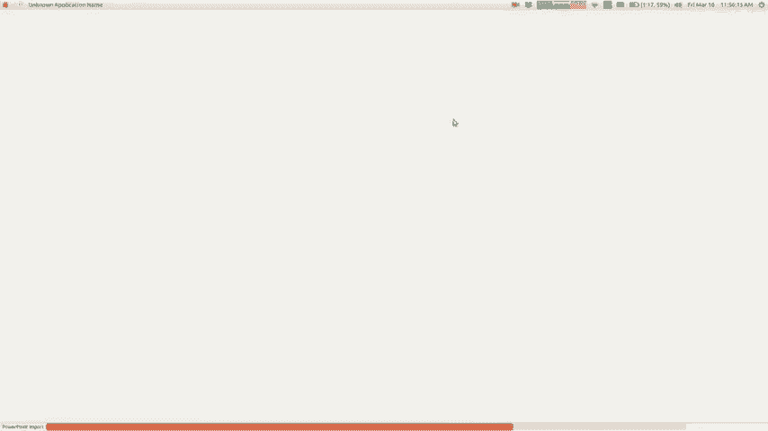

我们学到了类似的东西，所以这里的前几张幻灯片我想我会，只是在经历比赛，就像嘿，我们该怎么做，我不知道我们了解了C ++ ，我想除非你做了106公升，否则我们并不会真正完全学习这门语言，但是。

您学习了很多C ++，所以我想如果一些公司问您，您知道的编程语言我想您可以说我已经学习过C ++我编码了c ++ ，在106节拍的CS2课程中，我们学到了很多有关数据和收集的知识，这是很重要的知识。

您知道很多课程，而继续上课，而且您再也不会使用这些东西了，但是如果您要编写代码，那么您将成为，大量使用所有这些数据，每个程序都充满了数据，因此您，永远不会停止使用列表或向量，而你永远不会停止使用。

散列图，您经常会拥有遍历的递归结构，通过您将要做很多这样的事情，我们将学习数据，在我们了解树和节点以及所有这些的内部实现了结构，我会说，对于很多人来说，当你真正地出去时，在代码的世界中。

您不会像我们一样从头实现那么多的结构，试图做，但有时你做，如果你不知道自己到底是怎么，卡住了，所以你想知道事情如何运作，我认为其中很大一部分是，您必须了解一些有关事物构建的方式，以便。

您会知道您知道运行时的权衡，为什么在我打印输出时会如此？ ，散列的哈希表，它按您想要的混乱顺序打印出来，了解这些东西，这样您就真正知道自己在做什么，使用所有这些库，所以我们学到了很多东西。

不同的算法图搜索排序排列遍历，有趣的是，这些算法非常基础，还会带来许多其他问题，直到嘿，我需要所有排列，我为之编写的代码在哪里，你知道排列，嘿，我需要做一个遍历遍历，我想我已经，在二叉树上做到这一点。

我们学会了递归递归非常重要，某些编码您不需要做很多递归我有一些人告诉我，他们一生中并没有真正使用递归，但这只是其中之一，那些事情，当它是完成工作的正确工具时， ，正确的工具，在需要时就需要。

而且我有时在编写网络应用程序时发现自己正在使用它，因为网页，实现为文档对象模型，它是一棵树，因此您通常必须，就像递归地在那棵树上寻找东西，所以我发现自己在。

您知道的Web我正在编写JavaScript Web代码我在最后一次进行递归，我认为我会需要的地方，以便您了解递归和回溯，我会说一些有关oo P面向对象编程的知识，这是非常不完整的事情。

您知道我们并没有真正深入，以后还有其他课程，您会做更多我想这不只是，关于学习什么是类的语法什么是继承它也很像，学习如何解决大问题，如何将其分解为课堂，和层次结构来解决问题，我们根本没有真正了解到这一点。

而我，认为以后还会有其他课程，例如CS 108，您可以在那里学习如何做，这可能是您真正需要的技能，所以我想要。

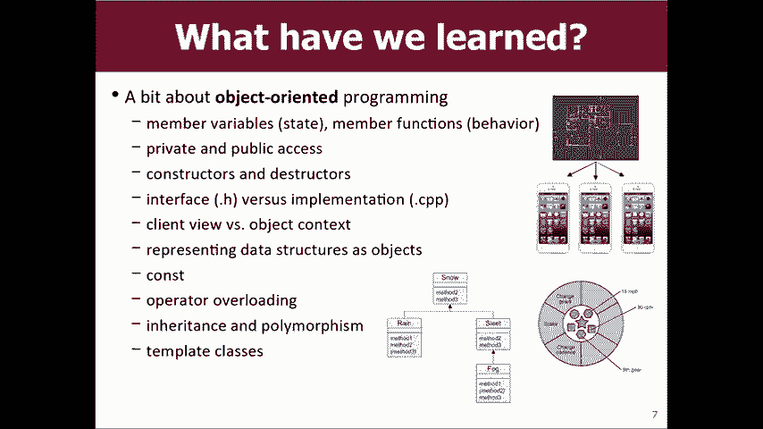

简短地谈论一些您可以做的事情，如果，您想这样做，其中一些人可能已经注册了，因为，我是里诺（Reno），因为注册开放后，接下来的几节课大多数学生，可能参加CS的可能是CS 103或CS 107。

并且您知道您是否喜欢此课程，如果有的话，您可以向我和员工支付最高的赞美，你参加了另一场CS课，这会让我开心，我会觉得我成功了，或者至少我没有打败你，我知道你，可能要等到决赛之后才能决定，但接下来的决定。

大多数人参加107是我们的下一门编程课程103是我们的第一门课程，理论计算机科学课程和CS的这两个领域都非常，重要的是，我们会对每个您要。

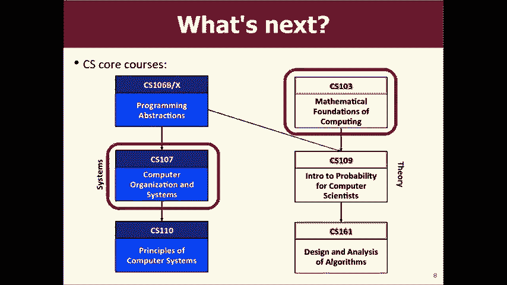

因此，我想简要地谈谈这些课程，我看到您实际上在，我想知道你是否可以跟我走到这里，因为你，知道我要向您介绍这些课程，但实际上，接受了他们，她可以说莱昂比我更有权威，可以以某种方式提供。

所以也许我会给您快速评估一下我的想法，这些课是，然后我要你纠正我，告诉我我怎么样，完全错误的是，很酷，嘿，看看S107是我们的计算机组织系统，上课，您会更深入地了解硬件，从而进一步了解如何。

处理器如何工作，内存如何工作，如何知道编写的代码如何获得，编译并组装成一个工作程序，您可以了解有关操作的信息，更深层次的系统，您会学到一些叫做汇编代码的东西。

就像给处理器的指令说明您的C代码或C ++代码，或将Java代码编译进去，这样您就可以将其深入，像梦中的开始梦之类的东西，那就是107在纸上的意思，我知道有些人认为107是。

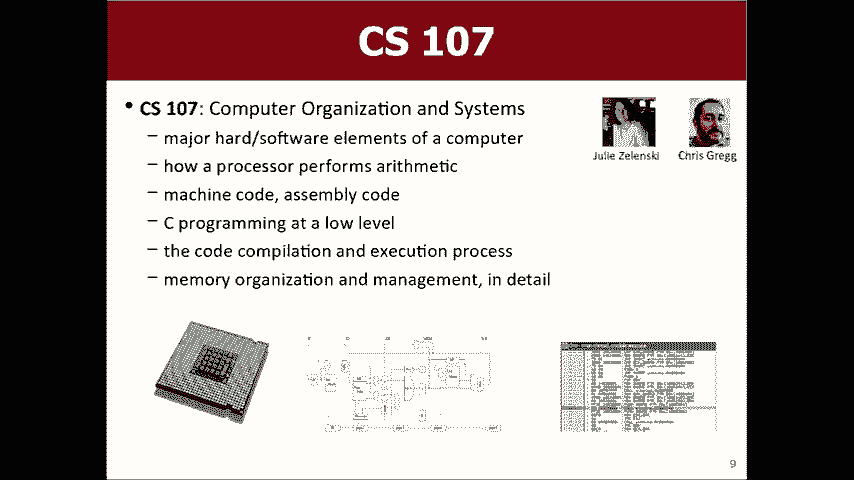

吓人的课程，如果你们有朋友或认识的人，我有您，哦，亲爱的上帝，我在107年帮我写了它，它以，我听到的具有挑战性的课是，最大的区别之一不是，它的强度是C s106 B的十倍，只是没有层而且。

您可能知道该图层是有帮助的，他们仍然有助手，他们有TAS ，他们有办公时间，但根本没有部门领导的暴民，一整夜的时间都在等待回答问题，所以你必须有点，更独立地找到问题和答案的答案，这样可以。

对一些学生来说充满挑战，但是我的感觉是，如果你在， 106 B或X，并且您努力工作，现在在107中也可以表现出色，从未在这里上过课，所以我上过与其他地方相同的课程。

我想问一下您实际上告诉我有关CS 107的情况，差不多是七个，七个吓人他们应该参加CS 107吗？首先对我来说是107 ，我真的开始理解指针，就像我通过106英尺的距离，就像我不太了解这些。

我在整个过程中都捏造了自己的样子，指针痕迹我们被允许放在便条纸中，我知道最便宜的最佳指针，跟踪，因为我找不到指针，所以107您将学习，如果进行多态性讲座，指针真的非常好，您就像在等待。

为什么C plus总线只能让您将某物传递给某物，否则，即使它崩溃，即使不是，就像107都是关于，传递变量以为他们不是真的为了喜欢弄清楚，内存布置在下面，非常酷，因此您可以学到很多东西。

关于内存的工作原理，您将学到很多有关如何调试所需的知识107 ，知道如何反馈，这真的很酷，因为它使所有，未来您的编程漏洞会变得越来越难，杀手不是，所以我知道自从我以来家庭作业已经发生了很大变化，拿走了。

所以我觉得我所说的话都不正确，因为至少，我认为其中三个作业已更改或更改了顺序，但您可以，了解他们仍然如何进行C矢量和C映射我想，所以我想，因此，如果您喜欢我在谈论地图而Marty在谈论。

房屋警察就像你一样，我真的很想实现，在107中实现一个哈希映射，这确实很棒，但是，很难，但主要是因为调试困难，所以如果您喜欢，不知道如何调试，从概念上讲，这使我很难，认为这是非常困难的。

只是C不是一种具有友好错误的语言，消息，例如，如果您记得从2006年开始，那就像Java在给您，像数组索引越界异常，例如库仑指南和C ，就像基本上他们什么都不给你，只是崩溃而已，没有。

有关其崩溃原因的信息，这就是107的组成部分，但实际上，从概念上讲，这不是一个超级难的课程，而是一个有趣的课程，但是，不像106辆汽车中的许多概念比这些概念更难，当我说我的意思是调试只是很抱歉。

我们俩都应该进入市场，应该看一下，并确定您是否有想要做的事情的目标，您想在CS部门这里学习我们的课程的事情107 ，是所有事物的先决条件，因此您至少应该知道， 107确实可以解锁一大堆您可能会赞叹的类。

我想在107之后服用107 ，有趣的是，我认为正如您所说的，这确实释放了，就像我执行此操作时实际发生的情况或此代码下发生的情况，我写给你的感觉让你更深刻地了解到底发生了什么，所有这一切都没有那么神奇。

而作为基础，那么您就准备好了，一整堆的东西，如果我可以弹出的话，我就不会看到它，但是如果我能在107后弹出课程图，那有一百万，指向所有其他东西的箭头是的问题，好吧107在实习之前，你可以跟那个人说话。

好吧，所以，我第一次实习之前没有拿107，所以我第一次实习是，基本上像107中需要的一堆不同工具一样学习，在我介绍它之前，他们在107年教过你，所以基本上，意味着我在实习的第一周就试图像。

 107的前几周，还有我的实习期，所以我强烈建议，当我说要容易得多时，学习大东西虽然这是优势，但我，如果您有实习机会，强烈建议您在实习之前尝试1：07 ，在您的日程安排中留出足够的空间。

因为它最终会引起您的兴趣，这样比较容易，因为您会更好地掌握技巧，而且您只会知道，您可能会在不特别的太监中使用的工具，最大的一个喜欢学习如何使用终端mm-hmm是的，Ashley提到。

另一件事是在过去一两年中，他们一直在寻找，上课，并尝试使某些作业更易于访问，意识到有些学生认为这确实具有挑战性，我认为他们已经，试图增加更多支持，更多帮助，使规格说明更加清晰，重新设计了一些家庭作业。

使它们更加实用，可以理解或具有更多里程碑，因此我认为，这个东西是你知道有点过时了，所以关于， 1：07我希望你们中的一些人会考虑把它也有变化。

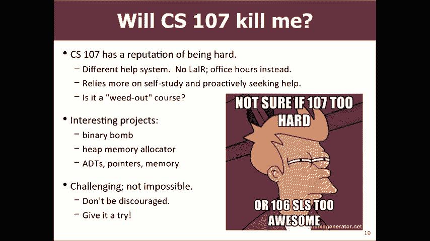

 107被称为107 e e是嵌入式的，您知道您将学习如何，为一台名为Raspberry Pi的小型微型计算机编程，所以您，实际编写在该计算机上运行的代码，这很有趣。

因为您知道代码是在整个计算机上运行的唯一内容，就像您打开它，它立即运行您的程序，就像没有，操作系统，没有终端，没有GUI，它可以立即运行，您的代码，这很有趣，因为当您使，就像三盏灯打开并闪烁一样。

就像是是的，灯闪烁了，确实做到了，这使您了解了这些简单的事情，就像您知道我一样，怀疑我会像我第一次那样和婴儿一起经历这种情况，就像捡起一块食物放在她的脸上，我会像是，当您在107 E处闪烁时会是您。

它会小一点，当然是因为他们必须在每个人都坐在那里的地方做这些实验室，他们的小型设备，因此它们的扩展速度不如107 ，所以你必须申请参加，如果你是，有兴趣的你可以申请参加，他们都是学生都要求的好班级。

我应该带哪一个知道常规107的寿命更长，可能多了一些打油的机器，多了一点点抛光107 ，有时，代码中包含您知道的入门代码有错误，或者规范中包含，错字或其他东西在边缘或其他地方有点粗糙，因为它比较新。

但是嘿，这是很多学生都在学习的新领域，对这些设备感兴趣的只是学习很多，同样的，你学到的东西基本上很相似，所以它们都是等效的，就您所学到的东西可以做什么而言，您知道有，当您使用嵌入式设备时。

会发生一些有趣的事情，代码不起作用，这是因为实际上是将Raspberry Pi塞入其中，你的背包，你弯曲了别针之一或类似你的东西，实际上损坏了硬件，您知道我的意思是您可以拥有它或。

可能有一个有故障的芯片，例如，所以您的代码无法运行，并且，因为芯片或其他原因，这很有趣，但是无论如何， ，这里有两个选择，所以您知道您是否认为我的描述或阿什利的。

对107的描述听起来不像是您知道令人兴奋的170可能会使您发痒，看中了，但是正如我说的，我真的认为这里的吸引力在于，如果您掌握了这一知识基础，那么可以做很多事情，最令人着迷的是我要再上的一堂课。

您的意见是CS 103，这是我们专业的理论介绍，这是计算的数学基础这门课程有一点点，编写一些编程代码，但是它更像是一门数学课程，用铅笔和纸样证明算法，这类事情及其原因，我们研究的原因是。

这确实是计算机科学的核心，计算机科学不是真的与您有关吗？ ，它更像是计算机可以计算的限制以及，计算，所以您会学到一些真正令人着迷的知识，他们知道逻辑，然后您会学习一个理论轨道，从而了解您所了解的概率。

计算模型以及它们可以做什么和不能做什么，您将学习如何，作证明，以便如果我可以做到，那么我可以做到，如果我不能做到，我，无法做到，您将了解计算机程序可以提供的种类的限制，有各种各样非常有趣的事情吗？ 。

引人入胜的问题，在我们的领域和有关的很酷的事情之一，计算机科学是一个非常年轻的领域，所以我们还没有想到，一切都解决了，但是在这个领域有很多大问题，我们不知道答案，如果您弄清楚了，您将会很富有， ，著名。

每个人都会因您的工作而受到您的影响，不要大笑，可能会发生，可能是您来自这样的地方，如果， HAP，所以我现在要说的就是103 ，你用不正确的手像这样的课程可能很枯燥，和类似的证据和东西，但好消息是。

我们已经有了一些，最好的人教这节课基思·施瓦兹（Keith Schwartz）很棒，这个课程很多，我不知道他的血液中有什么，我想要一个，从这个家伙那里输血，他精力充沛，是一位出色的老师，他很出色。

辛西娅·李（Cynthia Lee）是我们另一位出色的讲师，部门一直在和他一起工作，她也在教书，他们俩，伟大的辛西娅是这所大学中最优秀的人之一，你知道，她会照顾你，当你需要帮助时她会帮助你，所以这节课。

我认为我们部门的优势之一就是我们投入了一些，这是班上最好的，因为学生需要它，所以我实际上对您有任何帮助，想增加约103，所以我专注于理论学习，因为我参加了103 ，大一新生，我非常喜欢它。

所以在上编程之前我就喜欢它，在这里上课就像我进来，并在UCS专业内修了103就是我，很喜欢这堂课，所以我进来有点想你是否足够好，程序员，您可以让计算机在本节课中做任何您想做的事情，数学上证明那是不对的。

这真的很酷，您会收到类似的问题，这大概需要花费一个问题，您可能以前曾遇到过几个不同的问题，您编写了一个计算机程序来解决Sudoku网格问题，就像，很难仅仅按照Doku来编写答案。

因为它只是为了验证给定的，数独板有效还是类似，很难找到炸弹和，扫雷，因为要验证这些位置是否有效，所以这是一个非常酷的盒子，因为您会遇到很多不同的地方，问题，使您可以采取其他非常酷的数据结构课程，和算法。

因此，如果您认为图表非常酷，或者其中的一些，我们谈论的树内容很酷或其他一些数据，我们在课堂上讨论的结构，以及这些数据结构的方式，在幕后和他们的Big O工作，以及我们如何获得这样的Big O 。

这堂课讨论的不多，但是让您准备了其他的课程，谈论很多，所以我是103的忠实粉丝，辛西娅和基思都很棒，人和精彩的讲座，因此我强烈建议您参加其中一项，斯坦福大学迄今为止最便宜的成本。

令人着迷的东西我也认为这堂课有趣的事情之一是，您会了解到在难度和难度上彼此相似的问题，这样您就可以学习，如果我可以对此问题进行映射，那么我所知道的关于这个问题的一切我也知道关于这个问题的那个。

帮助您证明无法合理解决此问题，时间量，因为无法在合理的时间内解决，这个基本上和那个相同，或者可以转换成，那一个，所以你可以通过谈论自然来做这些真正酷的事情，问题的性质算法和计算，所以它真的很有趣。

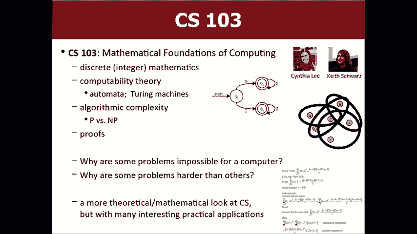

他们会变得有趣和有趣的东西，所以我想你可以为它定价，一分钟，我想我认为我们很好，谢谢，嗯，所以还有很多其他的，很棒的CS课程CS 9是一个很棒的课程，您可能想在这个秋天，秋天。

我们提供的这门课程全是为技术面试做准备，我敢肯定，你们中的一些人希望对此权利有所帮助，以便他们找到合适的人选，进来给你提示，他们会恢复工作坊他们有实习面试，他们有练习练习，您可以进行cs9很棒的检查。

因为它只是，在秋天提供是因为正确的招聘季节，该课程的授课时间有很多CS课程， ，少于100，这些通常是学生开设的课程，现在您可能，说听起来像是同盟，我想上真正的课，但是不，但是其中很多是，相当不错。

他们中的许多人教授一些我们没有的实用知识，我想学习如何使用Python进行编码的课程， javascript或我想学习如何使用MapReduce框架进行计算，规模或类似的东西，你知道很多这类的课程教你。

这些您可能想学习CS50的小实用技巧令人着迷，这是CS4的社交产品，还有其他50门课程，如果您正在寻找类似的东西，我该如何处理，对东西和CS东西进行编码，并将其用于实际的东西，以帮助人们，更好的世界。

那就是您想要开始的地方。 ，他们在做什么，他们有一些有趣的项目，实际上是直接，影响很多真实的人，这里的一些课程，我觉得很有趣的课程我想稍微小心一点，不要过度，推荐任何东西，因为每个人的兴趣都不一样。

所以你知道我，编码员和黑客，所以我对编码，Web应用程序和Android应用程序感兴趣， ， iPhone应用程序，因此，如果您想学习这些种类的话，这里有很多课程，如果要构建更大的东西。

HCI课程147很棒，希望整个季度都在设计和构建更大的系统，而且您知道您可以大致了解其他课程号，您可能要注意的是193，这对于，每当我们有一个不适合的特殊主题时， ，另一个类别。

例如我们在该类别下的移动应用课程，如果我们知道，有时只是一些随机的教授会说我想深入学习一堂课，学习好吧，我们将其称为193 K或类似的东西，所以您每个季度都知道，每年也许看那个课程号。

看看是否有什么很酷的，在那里列出，所以这是我们的一些课程，我只剩下几分钟了，所以我有点想跳过一些事情，如果您喜欢这堂课，嘿，也许你能付给我的另一个最好的赞美会被认为。

主修CS或辅修CS是很多人关心的很好的专业，这个专业的教学会照顾你，我们基本上是第一，在CS的全国学校学习，如果您愿意的话，您将获得良好的教育，我们的专业，你可以辅修，如果你想看看辅修，你可以看看。

在同一网页上，您基本上会选择103107我提到的内容，再加上两个或，您可以在CS中修读三门以上的课程，这是对您所学内容的一个很好的补充，如果你是大二，大三或其他，那你就说我不。

知道我是否有时间改读我的专业或任何你知道的很好的未成年人，生一个未成年人，如果您拥有生物+科技或经济+科技等，不管您从事后期技术工作，我敢打赌，我们的履历会很好，如果您想在毕业学校学习。

可以得到一名教练，例如您是大四学生， ，你好像对我来说太迟了，也许不是，也许我们没有，这些其他专业我没有很多时间，但是这些其他专业，基本上是您知道的技术，它将技术与其他事物融合在一起。

加上逻辑和人工智能技术，商业技术，数学技术和电气，工程或硬件，就像我们一样，还有各种各样的东西，你知道巧克力加花生酱会更好，所以如果你喜欢这个，但是，您还有其他想做的事情，我们可能会为您准备一对专业。

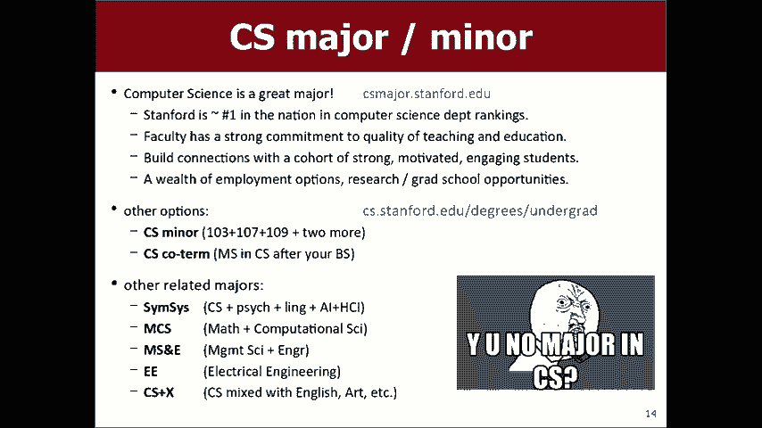

快捷的东西，如果您愿意，我会通过它，要学习更多东西，在线上有很多好东西，课程，有在线教程，有在线实践，这是一个很棒的领域，只教自己一些东西，我想知道您如何编写iPhone应用程序，您会发现。

如果要获得一个，您可能已经可以实习了，可以和公司谈很多，的公司希望只有您真正具备专业知识水平的人员，因为他们想与您建立关系，以便当您，毕业后，您将为他们工作，因为吸引人如此竞争，他们对他们很辛苦。

他们希望你们如此糟糕，以至于他们想尽快与您交谈，他们可以，如果您想了解有关实习的信息，请访问斯坦福论坛，注册他们的邮件列表，并在其中发送有关以下内容的行业公告： ，职位和广告以及技术讲座之类的东西。

我在这些上有一些链接，您可以稍后查看的幻灯片这些是一堆拥有实习机会的公司，特别适合新生和没有上过很多课的人，他们不会和你竞争一些大三或小辈，为您服务，这些幻灯片中有几页，您可以查看，在此之后。

也许是在春假期间，他们正在申请夏季，如果你想看看这些大公司和小公司都是，寻找您，请查看这张幻灯片上还有更多内容，我想说的最后几件事你可以教自己很多有趣的东西。

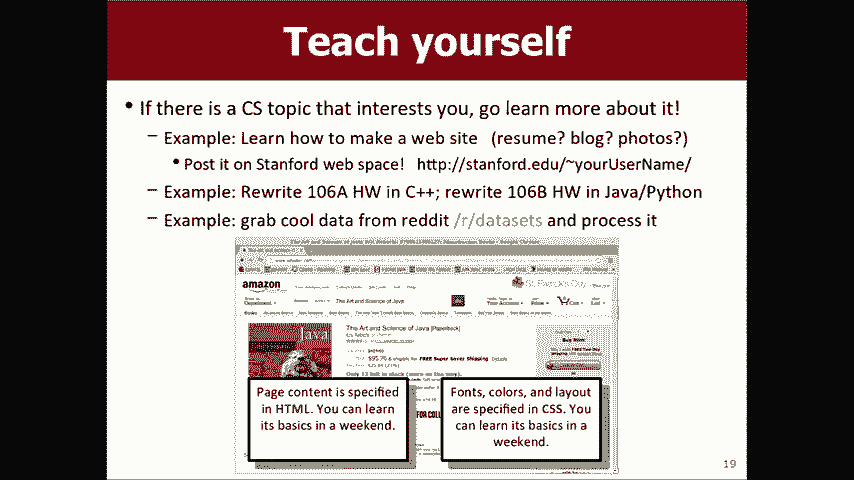

您想去做的事情去尝试教给自己关于它的知识，学习如何，让网站或移动应用尝试学习以106 P重写的新语言，使用Python进行作业，看看是否可以做，让我在这里前进一点，以便，另一件事是。

我希望你们中的一些人将来会考虑将，成为部门负责人，我们需要更多的人，而您已经具备了我们想要的资格，如果您喜欢这门课，就会喜欢您，并且您想帮助其他人，你帮助了宿舍里的人你帮助了巢穴里的人，太棒了。

我们希望我们希望您做到这一点，并为此支付您一周的费用，好吧，我们谈论了几周前，也许您可​​以注册，我想花点时间说你的秋天，知道这个季度对我来说是一个独特的季度，因为您知道我的小宝贝和，很难。

你知道我必须走了很多路，很难做到这一点， ，这个，我不希望你们为此受苦，那只是，真的因为工作量巨大而屈服，其实我办公室里有东西要送给你，我想送一点礼物，以后给你，我没带，因为我要丢了，我很笨拙，但我。

也想认为部门负责人的所有帮助他们不在这里，所以您，我想必须为他们鼓掌，但对于他们给予您的巨大帮助， ，莱尔和其他部门的负责人非常出色，非常感谢。

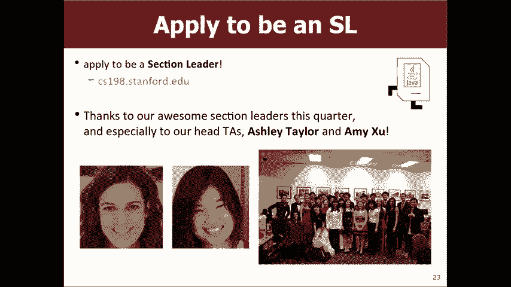

祝你学习顺利，见星期一， [掌声] 。

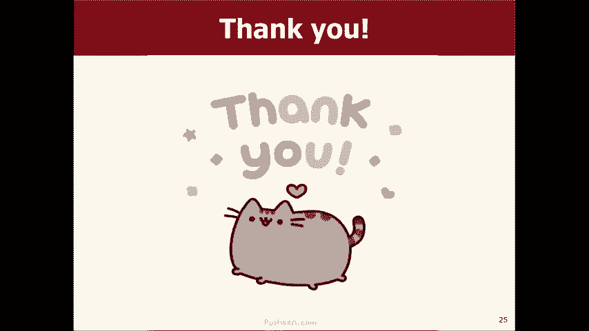

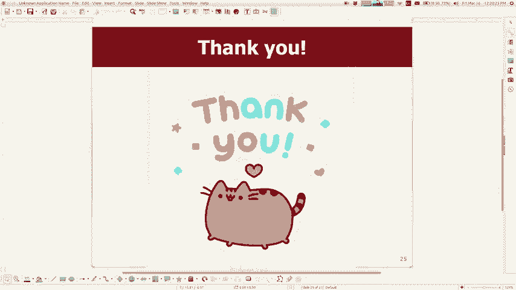