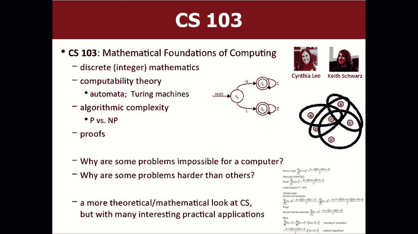
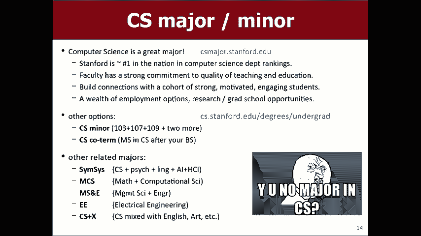
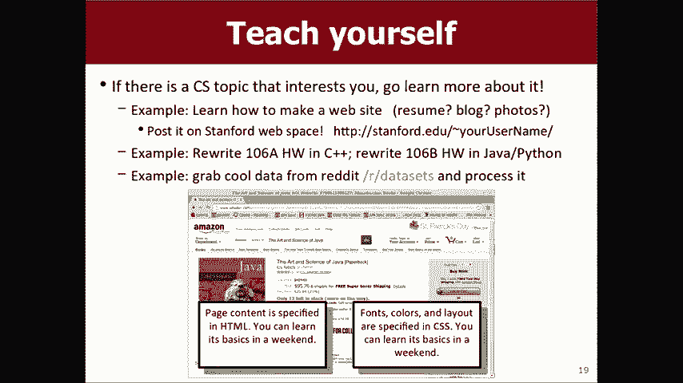
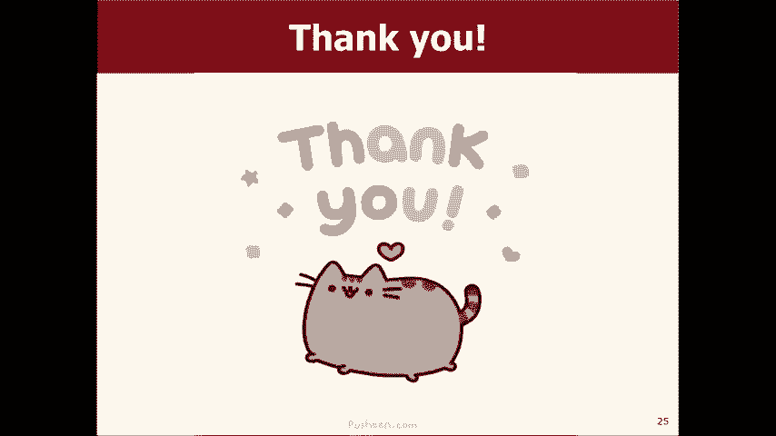
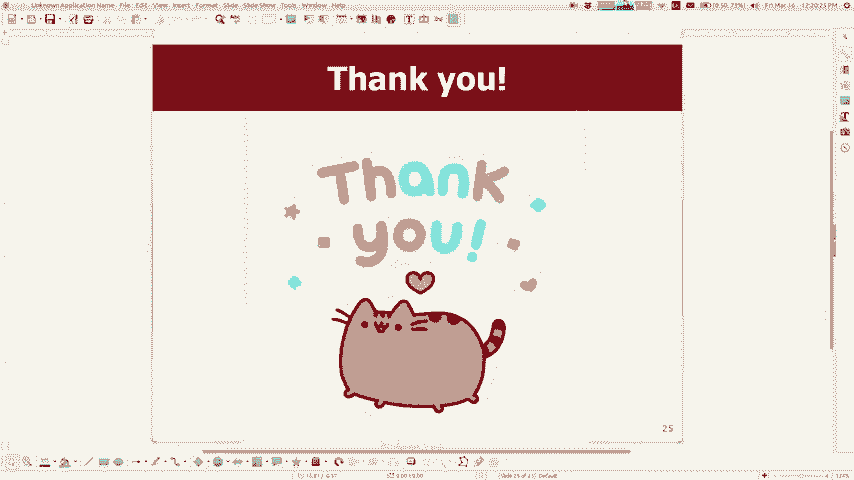

# 课程名称：CS106B C++中的抽象编程 · 第27讲：课程总结与考试指南 📚

在本节课中，我们将回顾整个季度的学习内容，并详细说明期末考试的形式、范围以及备考策略。我们还将探讨完成本课程后，在计算机科学领域的后续学习路径和发展机会。

## 期末考试安排与概述 📝

期末考试将于周一上午8:30举行。考试地点根据学生姓氏的首字母进行分配。请务必准时到场，迟到者不会获得额外考试时间。强烈建议设置多个闹钟以确保准时起床。

## 考试内容与主题 📖

期末考试将涵盖本学期所学的核心主题。虽然考试重点在于期中考试之后的新材料，但期中之前的基础知识（如递归、指针）仍然是解决新问题的必备工具，因此同样需要掌握。

以下是期末考试的主要主题列表：
*   **链表**：包括链表代码阅读与编写问题。
*   **二叉树与二叉搜索树**：包括树的构建、遍历、节点操作以及平衡性判断。
*   **回溯算法**：用于尝试所有可能解决方案的问题。
*   **图**：包括图的属性（如有向/无向、连通性）、表示方法（邻接表/矩阵）以及搜索算法（如BFS, DFS, Dijkstra）的追踪。A*算法若涉及，会提供启发式函数。
*   **哈希表**：包括插入元素、处理冲突以及重新哈希后的结构变化。
*   **集合**
*   **排序算法**：如选择排序、插入排序、归并排序。不涉及快速排序。
*   **继承**：包括代码阅读（分析类层次结构、方法覆盖与调用）和代码编写（扩展现有类）。

考试将提供参考手册，其中包含基本ADT（如图、集合）的常用方法以及部分算法（如A*）的伪代码。

## 具体题型与备考策略 🎯

上一节我们介绍了考试的整体范围，本节中我们来看看各类主题可能出现的具体题型以及备考建议。

以下是各类主题的典型考查方式：
*   **链表**：可能会提供一段操作链表的代码，要求你分析其功能或结果。也可能要求你编写一个函数来执行特定的链表操作。
*   **二叉树**：对于**二叉搜索树**，可能会要求你根据给定序列构建一棵树，或进行遍历、删除节点等操作。对于普通**二叉树**，可能会要求你编写递归函数进行搜索或修改。
*   **图**：问题可能包括：判断图的性质、写出图的某种表示、或者追踪图搜索算法的执行步骤。
*   **继承（阅读）**：会给出具有继承关系的类定义和一段客户端代码，要求你分析哪些调用能通过编译，以及运行时实际执行的是哪个类的方法。
*   **继承（写作）**：要求你扩展现有类，通过重写或添加方法来改变或增加其行为。
*   **哈希**：要求你展示向哈希表中插入一系列元素后，哈希表（包括可能的链式桶）的状态。

备考的最佳方式是仔细研究发布的所有**模拟考试题**。实际考试题型将与模拟题类似。务必动手练习代码编写和追踪。

## 本季度核心概念总结 💡

在深入考试细节后，让我们退一步，回顾一下本季度我们共同学习的核心编程概念。

我们学习了C++编程语言的基础，并深入理解了多种**数据结构和算法**。这些是计算领域的基石，未来在任何编程工作中都会频繁使用。

以下是本季度涵盖的核心知识领域：
*   **数据结构**：我们不仅学习了如何使用向量、网格、栈、队列、集合、映射，还深入理解了链表、二叉树、堆、图、哈希表等结构的内部实现原理。理解这些有助于你权衡不同结构的性能（时间复杂度）。
*   **算法**：我们学习了递归、回溯、多种搜索（如图搜索）、排序算法以及排列生成算法。递归是解决特定类型问题（如树形结构处理）的强大工具。
*   **面向对象编程**：我们初步接触了类、对象和继承的概念。这为将来学习如何将大型问题分解为类与对象的系统奠定了基础。

## 后续课程与学习路径 🚀

掌握了CS106B的内容后，你为学习更高级的计算机科学课程做好了准备。接下来常见的两门课程是CS107和CS103。

**CS107: 计算机组成与系统**
这门课程深入研究计算机底层工作原理，包括处理器、内存、数据表示以及C/C++程序如何被编译和执行为机器指令。它将强化你对指针和内存管理的理解。虽然课程挑战性较大，需要更强的独立调试能力，但它为后续众多高级课程（如操作系统、编译原理）奠定了基础。此外，还有**CS107E（嵌入式系统）**版本，专注于为树莓派等微型计算机编程。

**CS103: 计算理论基础**
这是一门偏重数学的课程，探讨计算的数学基础。内容包括形式化逻辑、可计算性、算法复杂性以及证明技术。它帮助你理解计算机能力的根本极限，以及不同计算模型之间的关系。这门课由多位优秀的讲师任教，能培养严谨的计算思维。

## 其他机会与资源 🌟

除了核心课程，斯坦福大学还提供丰富的资源来支持你的成长。

以下是一些值得探索的方向：
*   **CS9: 编程面试准备课程**：在秋季学期开设，专门帮助学生准备技术面试，提供简历修改、模拟面试和算法练习。
*   **CS课程目录**：可以关注CS109（概率论）、CS110（操作系统）、CS193系列（专题课程，如移动应用开发）等课程。
*   **专业与辅修**：可以考虑主修或辅修计算机科学。结合其他领域的“CS+X”联合专业也极具价值。
*   **自学与在线资源**：互联网上有大量优质的编程教程和实践平台，你可以自学Web开发、移动应用开发等特定技能。
*   **实习**：许多公司提供针对低年级学生的实习机会。可以关注斯坦福的职业发展平台和邮件列表。
*   **成为课程助教**：如果你热爱这门课程并乐于助人，未来可以考虑申请成为课程助教，这是一个非常有价值的经历。

## 课程总结与祝福 ✨

本节课中，我们一起回顾了期末考试的详细安排、核心考点以及备考策略。我们也总结了本季度在数据结构、算法和面向对象编程方面取得的主要成果，并展望了后续在CS107、CS103等课程中的学习路径，以及通过实习、自学和参与教学来深化计算机科学技能的各种机会。

感谢大家本季度的努力与参与。祝愿各位在期末考试中取得优异成绩，并在计算机科学的道路上继续探索前行。我们周一考场见！