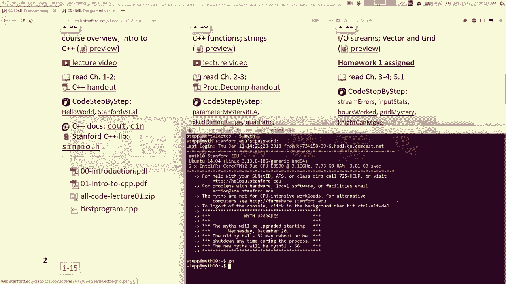
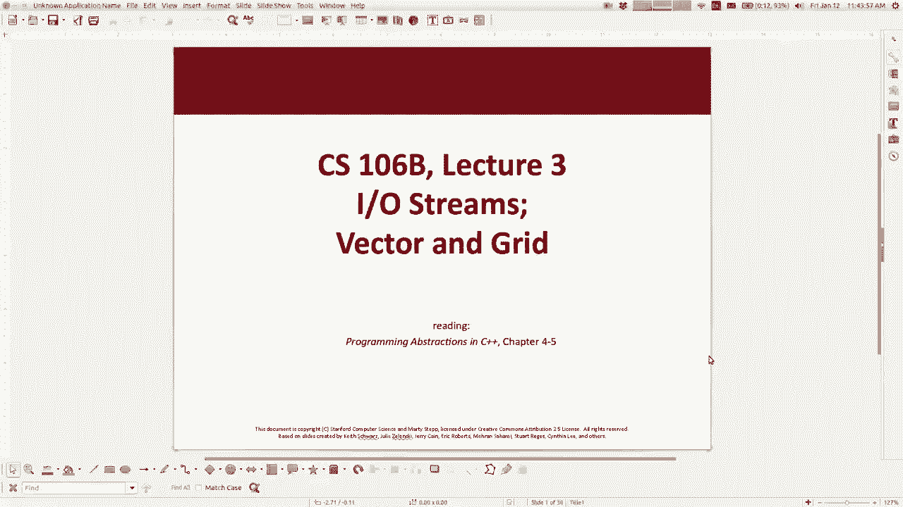

# 课程03：C++中的文件读取与集合基础 📚


在本节课中，我们将学习如何在C++中读取文件，并初步了解两种重要的数据结构：向量（Vector）和网格（Grid）。这些是构建更复杂程序的基础工具。




## 文件读取 📄

上一节我们讨论了字符串，本节中我们来看看如何从外部文件读取数据。在C++中，文件读取是通过称为“流”（stream）的对象完成的。


### 文件读取的基本模式




以下是使用`ifstream`库读取文件的典型示例。您需要声明一个`ifstream`类型的变量，打开文件，然后从中读取数据。

```cpp
#include <fstream>
#include <iostream>
#include <string>
using namespace std;

int main() {
    ifstream input;
    input.open("filename.txt");
    string line;
    while (getline(input, line)) {
        cout << line << endl;
    }
    input.close();
    return 0;
}
```

在这段代码中，`getline`函数会尝试从输入流中读取一行。如果成功读取，则返回`true`，循环继续；如果到达文件末尾或读取失败，则返回`false`，循环停止。

### 检查文件是否成功打开


如果您尝试打开一个不存在的文件，程序不会崩溃，但读取操作会立即失败。您可以使用`.fail()`方法来检查最后一次操作是否失败。

```cpp
if (input.fail()) {
    cout << "无法打开文件。" << endl;
} else {
    // 正常读取文件
}
```

### 按单词（令牌）读取


有时您需要按单词而不是按行读取文件。这可以通过流提取运算符`>>`来实现，它会自动按空白字符（空格、制表符、换行符）分割输入。


```cpp
string token;
while (input >> token) {
    cout << token << endl;
}
```

这段代码会逐个读取文件中的单词并打印出来。`while (input >> token)`这个条件本身就在尝试读取并将结果存入`token`，如果读取成功则循环继续。

### 处理混合数据类型


如果文件中混合了字符串和整数，而您尝试将非数字内容作为整数读取，操作会失败。一种策略是先以字符串形式读取所有内容，然后判断哪些可以转换为整数。

```cpp
#include "strlib.h" // 假设有字符串转换工具库
string token;
while (input >> token) {
    if (stringIsInteger(token)) {
        int num = stringToInteger(token);
        cout << "找到整数: " << num << endl;
    }
}
```


## 集合简介：向量（Vector） 📦


现在，我们转向用于存储多个数据元素的数据结构，即“集合”。首先介绍的是向量（Vector）。


向量是一个可以动态改变大小的元素序列，类似于其他语言中的`ArrayList`。在C++中，原生数组功能有限且不安全，因此我们主要使用向量。

### 向量的声明与基本操作

要使用向量，需要包含头文件`#include "vector.h"`。


```cpp
Vector<int> numbers; // 声明一个整数向量
numbers.add(42);     // 在末尾添加元素
numbers.insert(2, 99); // 在索引2处插入99
int val = numbers[1]; // 获取索引1处的元素
numbers.remove(0);   // 删除索引0处的元素
```

### 遍历向量

有多种方法可以遍历向量中的所有元素。

1.  **使用传统的for循环和索引：**
    ```cpp
    for (int i = 0; i < numbers.size(); i++) {
        cout << numbers[i] << endl;
    }
    ```

2.  **使用“增强型for循环”（范围for循环）：**
    ```cpp
    for (int num : numbers) {
        cout << num << endl;
    }
    ```
    这种语法更简洁，适用于只需从头到尾顺序访问元素的情况。

向量的`insert`和`remove`操作可能会导致元素移位，如果向量很大，这可能影响效率，我们将在后续课程中讨论这一点。

## 集合简介：网格（Grid） 🗺️


接下来，我们看看另一种集合——网格（Grid）。网格是一个二维数据结构，非常适合表示棋盘、图像像素或电子表格等矩形数据。


### 网格的声明与基本操作

要使用网格，需要包含头文件`#include "grid.h"`。

```cpp
Grid<int> matrix(3, 4); // 声明一个3行4列的整数网格
matrix[0][1] = 5;       // 在第0行、第1列设置值
int value = matrix[2][3]; // 获取第2行、第3列的值
int rows = matrix.numRows(); // 获取行数
int cols = matrix.numCols(); // 获取列数
```
访问元素时，第一组方括号是行索引，第二组是列索引。

### 遍历网格

遍历网格通常需要嵌套循环。

1.  **按行主序遍历（逐行遍历）：**
    ```cpp
    for (int r = 0; r < grid.numRows(); r++) {
        for (int c = 0; c < grid.numCols(); c++) {
            cout << grid[r][c] << " ";
        }
        cout << endl;
    }
    ```

2.  **使用增强型for循环遍历所有元素：**
    ```cpp
    for (int value : grid) {
        cout << value << endl;
    }
    ```
    这种遍历方式不关心行列位置，只是按存储顺序访问每个元素。

### 向函数传递集合

集合可能包含大量数据，按值传递会导致完整的复制，效率低下。因此，我们通常通过**引用**来传递集合。如果函数不需要修改集合的内容，可以加上`const`关键字将其声明为常量引用，这样更安全且能表达意图。

```cpp
// 计算网格中所有元素之和，不需要修改网格，所以使用const引用
int sumGrid(const Grid<int>& grid) {
    int total = 0;
    for (int value : grid) {
        total += value;
    }
    return total;
}


// 反转网格的内容，需要修改原网格，所以使用普通引用
void invertGrid(Grid<int>& grid) {
    // ... 反转逻辑
}
```


## 本节课总结 🎯

本节课中我们一起学习了：
1.  **文件读取**：如何使用`ifstream`打开文件，按行或按单词读取内容，并处理可能的错误。
2.  **向量（Vector）**：一种动态的一维数组，学习了其基本操作和遍历方法。
3.  **网格（Grid）**：一种二维数据结构，适用于存储矩形数据，学习了其声明、访问和遍历方式。


这些知识是完成后续作业（如“生命游戏”）的基础，在该作业中，您将需要从文件读取数据到网格中，并对其进行处理。请利用这些工具开始您的编程实践。