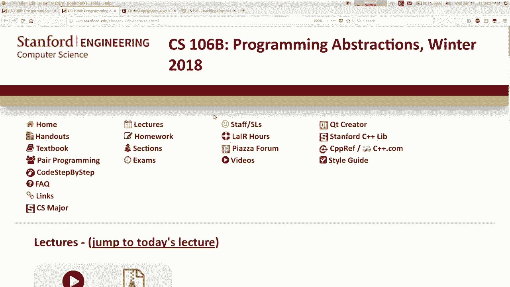

# 【斯坦福大学】CS106B C++中的抽象编程 · 2018年冬（完结·中英字幕·机翻） - P4：【Lecture 04】CS106B Programming Abstractions in C++ Win 2018 - 鬼谷良师 - BV1G7411k7jG

所以今天的计划是，我们将学习一堆藏品，称它们为DTS抽象数据类型调用，稍后解释该术语的含义，但本周将学习有关我们拥有的所有不同系列的所有信息，在我们周五上映的剧院收藏图书馆家庭作业2中， 。

将要使用这些库来解决不同的编程问题，而您，不幸的是，我们这个星期只有两次讲座，资料，我们在星期一度过了重要的假期，所以我们丢了课，所以我，今天要快一点，这里是一些内容，但希望我们会。

赶上我想发布的一门课程公告是，我们有一个论坛，关于我们的考试，这样您就不必来了，我希望您一周前完成，从星期五起，我会提醒您距离该日期更多的时间，但无论如何，同时，您也将在本周开始您的部分。

你们得到了关于您分配给哪个部分的消息否是，哇，好吧，嘿，这周您有节，有人将您分配给了，房间，虽然也许您不知何故没有收到有关它的消息，部分是今天，所以您应该检查一下，看看您应该已经收到了。

提示您应该做的是，如果您没有该信息，则转到， CS 198网站CS 198点印Verde D u该站点已登录，如果，您在那里登录，应该为您提供有关哪个部分的信息，您要包括日期，时间和房间。

以及部门负责人。

名称是这样，如果您在该网站上找不到该信息，请。

通过网页上的电子邮件联系信息与我和TAS联系，我们会帮助您的，但是如果您不这样做，请今天再次检查，知道，因为你们中的一些人今天晚些时候有一节，好吧，所以，无论如何，就像我说的那样，我们今天将要了解藏品。

所以让我打开。

幻灯片，如果需要的话，这些全部来自教科书第五章，继续阅读我们上次我不打算花时间谈论向量，在向量上花费了大量时间，因为我认为每种语言都有类似的集合，你们这些我希望您在您的书中看到了类似的东西。

自己以前的编程经验，例如Java中的ArrayList ，与JavaScript中的东西几乎相同，您拥有一个数组或一个列表，基本相同的结构大多数语言都具有这种结构，索引以0开头的元素列表。

因此您可以声明一个，向量，您可以在不同的索引处添加元素，成长为适合其中的元素，您可以访问元素，使用方括号，所以我们已经讨论过了，这是我已经向您展示的方法，我不会再拖延了。

滑动我们在这类结构中看到的一件事就是，从结构的不同点插入或删除元素，但是如果您开始，或在中间，如果您删除，它会将内容移到类似的位置以腾出空间，如果您要删除，它会将所有内容移到其他位置以腾出空间。

没有变化的东西，例如，如果我不希望这只脚，在这里，但我想留空，实际上没有办法说，我的意思是我想你可以用零或类似的东西代替八，但您知道您不喜欢删除艾滋病病毒而无处可去，即使在那里被称为零或或。

也必须具有某种价值，像这样的一些人听说过一个特殊的值称为null但为null ，不是int，因此在这种情况下您不能放置null，但是无论如何我们，星期五将要讨论的更多是其中一些的效率，行动。

我在上周五简要提到了这一点，移位需要时间，就像删除向量的第一个元素一样，它必须将所有其他元素移过来，并且您移入的每个元素都需要一个，一定的时间要做，所以向量越大，越多。

您要转移的元素需要花费更多的时间来进行单个插入，或删除权，因此有时会影响您应如何编写代码，您知道，如果可能的话，您主要想从，向量的结尾而不是从前面开始，但是您不能总是写出，这样编码，但是如果可以的话。

您想这样做吗？ ，关于那确实有意义，哦，不，不，我在做，它知道向量如何工作，移位如何工作，您可以有嵌套的收藏集，也可以有诸如，向量的向量，所以我在这里有intz向量的向量，然后我添加。

三个向量到我的向量中，所以我称各个向量，行，然后我把它称为BD，所以有点像网格，因为您可以使用两个方括号访问其中的元素，看起来很像访问网格，您会说什么是主要。

网格与网格在可以做什么或不能做什么方面的区别，是的，是的，网格必须是矩形的，所有行的数量必须相同，列，这东西可能是非矩形的，我猜这是一个特殊的东西，您认为三角形可能会多排不同的链接，所以您知道一些。

优点和缺点我会说另一个区别，那就是更多， nitpicky是您知道的语法，您必须编写更多代码行来，声明这个东西初始化它，但是是的，我认为你的答案是最好的，这个允许一个非矩形的形状，但是我只是想做这个。

总的来说，您可以在一个集合中拥有一个集合，可能有C ++允许的集合的集合，谢谢，好的，所以我实际上不会只因为时间而谈论矢量，因为我们失去了周一的讲座，但是现在叫了一个链表，我会。

我很难激发您对这个系列感兴趣的原因，而您，可以插入它，您可以在前面或后面或中间添加内容，诸如您将要使用的解决方案之类的术语，它在某种意义上与向量相同，它可以让您做相同的事情，但不同之处在于内部。

当向量有很大的积木时，列表存储的数据是不同的，内存，基本上是一个数组，用于存储您拥有的所有元素，加上链接列表，它实际上使这些称为对象的小对象，这种相互连接或链接以形成链条的方式，我们将谈论。

在本课程的稍后部分将有更多关于它的内容，这将是您最喜欢的东西，指针喜欢它，问您宿舍中的朋友是否喜欢指针并看到，无论如何，他们说的内部结构不同，存储数据，也许您现在不必为此担心很多，但是。

内部差异会影响您的工作，代码，如果您使用此东西，那么如果您想在其中插入或添加一些东西，这种结构，你知道我在一分​​钟前刚刚谈到过一个向量，插入一些内容，您必须将元素移至上方以腾出空间。

如果您决定要插入一个结构，则不必这样做，值42，它是列表中的X 3点，您只需加入即可，你知道链表有很多不同的类比，就像每个小盒子都是一个人的电话，而下一个盒子的箭头就像。

您的电话中已经有下一个人的电话号码或类似的信息，因此，如果您想告诉所有人，将会有一个，派对，您都将去角色删除，所以您必须互相呼叫，因为您知道现在是2009年2018年，只是打电话给人们告诉他们。

政党权利，因此第一人称第二人，他们称，第三人称，依此类推，如果您想再介绍一个人，社交圈中，您可以让其中一个人打电话给他们，然后让他们，打电话给下一个人，您不需要做更多的工作，所以，有趣的是。

这意味着该结构可以执行更多操作，效率比向量可以做到的要好，但是要权衡，这件事在，其他某些操作，例如，使用更多的整体内存，比矢量要好，跳到随机元素上不是很好，只是看一下他们的价值观，这种结构并不是很好。

因为，它查找值是它必须从头开始，并且需要步行，直到找到一个值为止，所以如果您的清单很大，那要花一些时间，无论如何，我向您展示这种结构的观点我认为您不需要使用，本课程中链接列表库非常多，但我想谈一谈。

这个想法有时可以用，不同的内部存储空间，它们各有优缺点，因此，实现相同操作的不同方式也称为“ ，简称为ATT的抽象数据类型，因此ATT基本上只需要一组，您希望能够执行的操作我希望能够添加并。

插入并移除并询问尺寸，然后清除您想要的这些不同，方法的基础，因此任何支持这些方法的对象，您可以说它实现了实现该操作集的方法，该抽象数据类型，因此向量和链接提升均支持相同。

我们可以选择将抽象操作集称为该操作集，列表操作，这很有趣，我们将回到这个主题，在这个课程中，这个想法很多，我们会知道我们在，会用它，我们会说哇，这真的很有帮助，我喜欢它如何，运作良好。

也许我们会学习一种或两种或三种不同的方式，在内部工作，看看他们的利弊常常与效率有关，权衡内存使用情况的权衡可以，所以ADC就是这样，我想向您展示我们的图书馆随附的更多收藏吗，有一阵子。

我想把剩下的大部分时间都花在谈论两个，结构称为堆栈和队列，所以它们是有趣的结构，因为，所以我想有一个销售人员，我很难把这个卖给你，产品，如果您要说我不需要我已经拥有的产品，向量我很好。

所以音高对我来说很难，但我想销量，音调如下所示，就像这些结构没有做很多事情，但是，他们所做的事情他们做得很好，他们有效地做到了， ，所以有时候你知道我们会和其他一些结构一起看到这个，一周。

有时灵活性降低意味着更高的效率或更多的动力，其他方式还可以，所以这些结构到底能做什么，让我们来谈谈堆栈，首先，堆栈是一个概念上的集合，您将其视为元素，在集合中以及添加东西时彼此重担，到堆栈中。

您总是在其顶部添加内容，因此，如果您添加像1 2 3 4这样的值，您就会知道穷人添加了最后一个，所以，现在，如果要查看它，它位于堆栈的顶部，元素或或删除元素或类似堆栈的东西，我认为在许多现实世界中。

您都可以访问自己的顶部，像是自助餐厅的盘子，当您拿起盘子或托盘时，拿起盘子里的食物，你通常不去那里，抓住第十个就可以绑上一个，因为很难进入那里，你得到了另一个正确的答案，这有点像你总是。

当您添加或添加时，触摸集合顶部的元素，您正在删除，而我们在谈论添加时会使用不同的术语，并从堆栈中删除我们说当您添加到堆栈中时，将新元素推到其上以及从顶部移除元素时，我们看到我们将其全部弹出。

还有一个名为peek的操作，意味着我要查看堆栈顶部的内容，但我不会删除它，只想看一下它的价值，然后将其用于某些东西， ，就是这样，所有这些东西都知道该怎么做，还有其他一些，像这样的方法有一个堆栈类。

您可以将其导入，您的项目，并具有将弹出和高峰时间推送的方法，还有其他方法，例如，是空的还是大小的，我不知道我是否认为我可以在幻灯片上说，但您可以打印出堆栈以查看内容，也可以看到其外观，就像里面一样。

但就是这样，所有这些都支持这些幻灯片。哦，我会，谈论星期五的基本含义是这些方法的简写，就为什么要为什么要这样的结构而言，运行得非常快，当我们已经有了向量和网格并且，比这强大得多的事情还有很多问题。

基本上可以使用这种类型的数据访问方式，例如，如果您要构建一个，您将要编写的编程语言，对很多语言的编译器进行正确处理，涉及到像，算法，例如，如果您要评估表达式，则知道X加y ，乘以Z。

您通常会推东西然后将它们弹出，然后使用该结构，如果正在运行函数调用，也要评估表达式，在函数的程序中，任何调用函数都是因为函数C ，被调用的函数实际上会为每个函数堆积一堆内存，函数，当您返回时。

它将最后一个函数从该堆栈中弹出，因此，堆栈在计算机科学中出现很多，也许是我最喜欢的攻击方法，当您拥有文字处理程序之类的应用程序时，它就是撤消堆栈，撤消功能基本上是如果，有很多动作。

例如您键入一些可以抓住您的文字，然后您，制成粗体颜色或将粗体表示为动作的字体，然后更改，对齐中心，这是一个动作，您现在说，哦，我要撤消，所以它转到，我要清洁的最后一个动作是将其弹出，并撤消了该动作。

你说哦，我不喜欢这个要点，或者我要再次撤销它，所以它会在这里大笑，所以我以undo作为一个堆栈为例，就像堆栈在计算机科学中出现的很多一样，这些方法，和堆栈外的操作支持，所以这是一个快速的示例。

我制作了这个堆栈，我推了三个值，两个字符串有点混乱，因为我们不，喜欢将其绘制为垂直流，因为这样会占用太多线条，你知道，所以我们从左到右画它，左边是底部， ，就在顶部，因为我们只希望它适合一行。

但不管怎么说，当您弹出东西时，它的最后一个在最右边的顶部，删除并返回最高值，因此第一次弹出时返回而没有，删除当前为负三的顶部元素，然后在最后和，负三者消失了，但是现在它实际上已经从，也可以堆叠。

所以学生经常尝试做几件事，对于不起作用的堆栈，您不能做的一件事就是，通过带有方括号运算符的方括号通过索引访问元素，不适用于那种循环从0到size访问元素的堆栈， II加号，它不能编译。

我的意思是它违背了，堆栈堆栈不希望您到达堆栈底部，并且，查看任意元素，它只希望您查看顶部的元素，那种代码行不通，所以如果您想看所有，栈中的元素我们怎么看，是，将它们一一弹出，然后看着它们，继续做直到有。

没有元素，所以下面是一个更常见的习惯用法，当堆栈不为空时，弹出顶部元素或对其进行窥视并执行某些操作，这样做的副作用是，当您完成循环时，您会丢失堆栈中的内容，如果你知道我不知道如果你像真实世界的比喻，说。

嘿，我们今天在美食广场上有几张盘子，你打破了，混蛋，然后你做的很好，我们有12我们有12我的意思是零，因为我，打破了他们，我不知道你这样做会清空堆栈，现在当然要小心，您可能会说很好，请耐心等待。

不要将它们从堆栈中删除，对吧，如果我不空的时候只是说，从表面上看这是个好主意，但是当然堆栈永远不会变空，除非你把事情弹出来，否则循环就不会结束，弹出，所以我们有这个问题，就像我如何看一个没有，销毁堆栈。

我们将进行讨论，但这是一个问题，所以我，想向您展示一些使用堆栈的代码，我只是想让您，在你的头上，纸上或其他东西上追踪它，看看是否可以，弄清楚音调，因此，如果您想与自己的说话，请看一下，伙伴一分钟很酷。

然后我会打电话找人来回答，前进，如果您还没有完成操作，您会看到是否有人想帮助我，他必须让事情继续前进，告诉我我不知道的事，我怎么忘了我没有写下正确的答案是什么，但我相信我们可以，一起弄清楚。

所以我们做一个空的栈，这是我要做的，我是视觉人，所以我们在这里制作一个文本框，然后按7 ，然后在七个的顶部，我们推一个10，然后窥视，因此该输出，将会是7或10，因为如果第二次是7 。

所以你知道他们在本季度末让你们评价我，问题就像您认为这位导演了解多少，课程材料我希望您不要在那一刻想起那一刻，回答这个问题，嗯，是的，所以是十个，所以实际上只是知道，输出从十开始将消除答案a和B 。

说D，所以让我们继续前进，我们偷看了十张，然后弹出，它也可以打印十个，但也可以从堆栈中删除十个，现在堆栈只有7个，现在我们推3个和5个，所以这3个，继续，然后右移五个，然后我们将弹出结果打印出来。

是五个，但现在删除了五个，我们要求提供尺寸应为，是两个，所以我的意思是我认为事情从那里继续进行，但是我认为我已经，足够简短的摘要，我想我同意你的观点，我认为你是对的，所以，答案是D，谢谢，是的。

我的意思是基本上这就是堆栈的工作方式，当您有少量um时，此幻灯片上没有很多循环，堆栈会像while循环之类的东西，也许我们会击中，接下来的一秒钟，让我们一起编写一些代码，我想使用堆栈。

检查一段代码中的括号和方括号是否平衡，您知道您的IDE您的软件会执行此操作，就像您打开错误的操作一样，花括号的数量或花括号的顺序错误或其他原因，可以做一个相同过程的非常简化的版本。

我要做的是给你传递一个字符串，看起来有点丑陋， ，应该代表一段代码，看看我们如何一起工作，因为，我希望它适合幻灯片，但您可以想像它的头部，二进制或其他任何东西，但是通过了，您所关心的只是括号和。

代码中的花括号好了，我想要您做的是，看看它们是否正确匹配，所以花括号匹配正确意味着两个，如果有开括号或桥，则需要，一种匹配，在代码右边和后面的顺序中将其他地方关闭。

它们打开和关闭的位置应该与您打开括号时的镜像相同，然后打开花括号您必须先关闭花括号，右括号正确，否则关闭顺序不正确，所以我希望我们的代码检查该函数的总体行为是否，它应该返回，如果有任何问题，则应返回。

发生错误的字符索引，如果没有错误，则应该，返回负数1表示字符串正确，没有错误，所以，这说明这是一个堆栈练习，堆栈如何帮助我解决这个问题，您认为，是的你怎么看，好吧，我认为这是一个非常好的主意。

当您看到开口时他说，括号或花括号开头，也许我们可以推那些字符，放入堆栈中，以便我们记住它们，以便我们知道以后需要匹配它们， ，然后当我们看到一个圆括号时，也许我们弹出，您知道这听起来像，推是打开。

弹出是关闭，我认为这是一个很好的选择。

算法的一般概念，如果您想尝试，让我去找可爱的创作者，这是网站上的zip文件，或者您可以逐步使用代码，网站，所以我要在这里写这个堆栈文件，所以我有一个主要的测试，用一些不同的代码，它说我想要正确的答案是。

 ，然后我已经准备好我们的函数为空，好吧，好吧，所以你说，推动开场人物，所以我想可以让我们从这里开始，对于字符串中的每个字符，这意味着对于从0到，代码长度字符C是代码括号I，所以我想看一下字符。

 CI认为您说的是C是开括号，还是C是开，大括号，您希望我将其放在堆栈中，这样我就没有堆栈了，所以您，要我创建什么类型的堆栈，就像只将这些字符存储在这里，也许您堆叠的字符堆叠好。

让我仔细检查我是否已包括堆栈库，我可以，所以你想要我，做堆叠点按字符C，所以否则您会说，如果它是一个，关闭一个你想要我的，如果是一个关闭的括号或者是一个，关闭花括号然后你要我怎么做。

流行音乐需要做栈顶流行音乐，似乎我们缺少这种想法，多一些人帮我写一些代码是的，所以首先，所以先来看看，我在想什么，看它是否很好，但我认为他们都将打开某种类型的角色，我只是，会在以后推开需要匹配的东西。

所以哦，如果合适的话，好吧，所以让我们说该堆栈将括号存储为一个卷曲的a ，卷曲和括号，然后在这里，如果我碰巧看到您知道关闭，括号或任何我想检查的内容是否与，堆在这里，所以我认为那是你在说的，好吧。

也许在那种情况下，我将它们分开一分钟，那是因为也许我想做的是稍微不同的，结束括号我想说的是栈顶是否为开口，括号是对的，这意味着它们再次匹配，因此功能是什么，应该做的是应该返回索引的int 。

有一个问题吧，所以也许在这种情况下，写我们的，如果不是堆栈顶部的内容，则用另一种方式编码，打开公主这是一个问题吧，所以我应该返回，这是，问题是我该怎么用泰语返回此字符串的索引错误。

该索引处的字符不正确匹配，如果您，有一个大括号，这不是一个大括号，问题，我认为在两种情况下，您都想像我一样突然流行，猜猜你能做的是，你可以说是否合适，然后弹出，但你知道那很不好，所以我会转身。

我想我可以做点什么，类似，但这里的这个使用大括号代替正确的种类，如果他们，如果他们不匹配，则匹配流行音乐，这表明索引不好，好了， ，如果我们一直走到这里，如果您一直到达字符串的末尾，没问题。

所以您应该只返回负数，这样就可以了，太放在循环底部，在那里尝试一下。我有一些测试用例将尝试运行， ，它很崩溃，我要怪我自己，我对此表示歉意，它通过它说索引14处有一个问题。

即0 1 2 3 4 5 6 7 8 9 ， 10 11 12 13 14这样关闭卷发就不应该出现了，因为打开，括号匹配正确，所以这似乎在起作用，如果出现这种情况，那么它会崩溃。

它表示尝试偷看一个空堆栈，因此，我不知道我早些时候在描述堆栈时是否真的这么说过，但是如果您尝试弹出或窥视并且堆栈中没有任何内容，则会崩溃，您的程序我不能做，您必须先检查一下，然后才能避免这种情况。

检查堆栈是否为空，为什么您认为这段代码是，崩溃的情况可能与第二个测试用例有关，所以让我，去看看主要的，看看主要的外观第二个测试用例是这个，所以看起来这部分字符串是平衡的这部分字符串是，平衡。

但后来到达这里，我想它在那里突然崩溃了吗，了解为什么它是一个右括号右括号，那时候我们的堆栈没什么好用的，它看到了一个大括号，所以让我们开始吧，如果您看到大括号检查峰值是否是，匹配正确。

所以您了解我们拥有的测试用例FN是空的，那时候我们试图偷看一个空栈，那么解决方法是什么，放弃它，但是确定堆栈大小是否大于零，并且具有，我想说的是右上角的内容，如果它不为空，我认为，清洁剂。

但这也是可以的，所以我想说如果它是空的，不为空，并且顶部元素匹配，所以也许我也将其放在这里，我意识到，这有点多余，我们将在一个，第二，但让我们再次运行它，所以现在实际上更多的代码是，运行正常，这是过去。

这是，通过这个失败了那是怎么回事，第三次测试，所以这里有字符串，我们的代码返回负数，它说没有问题，但是我的测试人员认为那是错误的答案，为什么，那是错的吗，休息的不平衡是的，是的，这是一个很好的答案。

谢谢你，她说我会再说一遍，我们只是，检查匹配项以确保没有人匹配不正确的订单权，很好，我们正在检查，但是还有另一件事应该，像你说的那样检查，每个人都必须关闭，在某个时候结束，所以我们编写的这段代码。

到目前为止还没有检查，我认为您所说的是解决此问题的好方法，到此为止，我们已经看完了所有字符，字符串，因此，如果此时字符串是，有效的是每个打开的人都被关闭，这意味着如果字符串是，如果字符串是好堆栈。

那么这里的堆栈内容应该是什么，分享什么应该是空的每个打开的人都应该弹出，那就是你所说的，基本上我想我应该说的是，如果堆栈为空，我将返回负1，因为，字符串是一个很好的字符串，否则它确实会出现我认为的错误。

 Specht希望我们处理的问题是，如果任何花括号从未闭合。

返回字符串的长度，指示问题出在。

结束，所以您知道这很不好，因此实际返回码的长度为，字符串确定，所以现在我们通过所有不同的测试用例，所以无论如何我们都做到了，我只是想和你们一起用堆栈编码，所以我们可以，看到堆栈如何工作，看看它们的行为。

你们有什么，有关我们编写的有关堆栈的代码的一般问题，有关生命的问题，背后的任何东西都是红色的，或者是你扎克，你在做什么，你是我的，部门负责人，哦，等等，这不平衡，等我做错了，我会再运行一次，说了这个哦。

好吧，你是对的，我要继续前进，但是还有一个， bug你来上课纠正我的好事，所以这个字符串是，其实不平衡，对吗？你理解为什么，因为像这部分，一切都很好，但是当我们到达这里时，这是一个括号，那里什么都没有。

我们打开了，您知道我的意思吗，这样不好，所以我们不应该，通过那个，所以，您认为怎么了？为什么我应该怎么做才能修复它？ ，抱歉，谁说你在哪儿，我没受伤，你说你可以，评论是，哦，我确实得到了正确的索引。哦。

对不起，好吧，这就是说，错误在索引20上，我认为它在这里，所以这是说我们通过了，因为我们，正确地识别出索引20处的字符串是错误的，所以实际上他是，只是错误的消失是可以的，不，您知道您必须测试测试仪。

有时您必须检查一下以确保测试正确，然后再执行，相信我和我的测试代码，而不必更仔细地看，是的，所以我，认为如果确实看到大括号，我们确实处理了该问题，但没有任何结果，在堆栈上，我们的代码将其标记为错误。

因为这会导致此错误，会说如果我看到一个封闭的花括号，如果堆栈是空的，它将在这里下降，它会说索引是坏索引，我认为无论如何我们还是可以的，关于堆栈的其他问题，是的问题是，如果您弹出堆栈，它也确实会返回值。

但是我，如果您不存储它，则不将其存储在任何地方，只是将其丢弃，如果我想将其弹出并保存并对其进行处理，我可以说像你，知道托顶等于那，我可以在这个特殊的方面做些事情，例如，我做的是偷看它，然后弹出它，因此。

您知道不必存储从pop返回的内容，但是如果，你想很好，我想覆盖队列，所以堆东西在那里，对他们来说不多，但它们支持推弹式的这些基本操作，偷看是空的，它真的非常有效地快速完成所有这些操作，所以我，谈到向量。

现在它们必须移动，在那里可能要花一些时间，是没有可以调用的堆栈操作，它本身会很慢，很好，它只有几个操作，并不能很快完成，所以让我们来看一下。

另一种称为队列的结构与堆栈队列有点类似，就像排队一样，排队等候的人，例如在餐厅午餐排队或，诸如此类，在其中添加元素，然后将它们放入行中，如果，您在现有元素后面添加另一个元素，然后。

您要从队列中删除某些内容，请删除位于的元素，行的最前面，因此您可以添加到结构的后面并删除，从地带的前面，我的意思是我们画画的方式，但对您来说，我想我的手势是向后的。

真的是因为我们通常在屏幕上显示它的方式是， akyüz支持的操作可以添加一些也称为，排队您可以删除也称为排队的东西，您可以，偷看的是，如果您做了一个， DQ操作，如您所见，这真的很像是堆栈。

主要区别在于堆栈的添加和删除都来自，队列的顶部位于同一侧，而添加在一侧，去除是在另一边，所以它有一点细微的差别，所以为什么，您是否想要一个队列，计算机科学中有很多任务， ，想要这样的例子我想很多例子。

有打印机，其他人将作业发送到打印机，打印机需要，在准备每项工作的同时，它不得不将工作排队，而只是处理这些工作，按照他们进入的顺序有很多这样的事情，知道网络路由器，他们有一组要传输的数据包，因此。

他们必须排队，这样他们才能一次全部发送出去，各种示例，您在亚马逊上订购的所有礼物都会被放入，排队的人排队等等，所以这是一个结构，现在再次有用，我认为这个销售点很难，因为您说等待。

事物的列表事物的队列不仅仅是矢量，就像我为什么不，为此使用一个向量，所以我问你一个问题，我为什么不只使用矢量，如果我想在队列中有人，我将它们添加到，向量的末尾，当我要DQ某人时，我将其从。

向量的开始为什么我不那样做，你觉得他说什么，是的，他说如果我一直在不断地改变速度，那是矢量，从前面移走人，我必须转移所有人，这需要，该向量执行此操作的时间，所以我想我没有明确说过，但是。

队列不必执行以下操作： ，您想对您或某人进行DQ，它可以很快完成，因此实际上是一个向量，对于这类任务来说，一个不好的选择会更好，所以无论如何，这些都是，您可能希望在其中排队的程序的位置。

但让我们来看一下，在带有队列的实际编码中，有一个称为队列类的库，导入包含Q点H，它具有我在n之前列出的那些操作，排队，作为DQ，它已经达到峰值，其大小为空，您可以打印出一个，如果需要，请排队。

这是一个简单的示例，此代码旨在，有点像几张幻灯片中的堆栈代码，好吧，所以我说了，关于如何不使用方括号和，索引也适用于您无法到达行中间的队列，并提取出一个元素并查看它，您知道我谈到了队列如何。

就像排队等候，就像您排队等候午餐，然后我，总是想起你知道我在亚利桑那大学上学， ，我在麦当劳佛罗伦萨排队，然后这个大家伙出现了，他只是，就在我等人的正前方，所以我离他刚才的正前方很近。

就像跳到我面前一样，我就像嘿男人，你认为你是，然后他转身去，我是吉尔伯特·阿雷纳斯，我接下来要去攻读MBA ，年他妈的你，我就像吉尔伯特·阿里纳斯一样，前方，你可以完全切在我的面前，我感到非常兴奋， 。

像你们一样，你们篮球队在我面前排成一列，很酷，我的朋友们都很棒，但是没有吉尔伯特·阿里纳斯的规定，在斯坦福队列中，您无法插队，您必须转到行尾，吉尔伯特（Gilbert）就像其他人一样，因为我在最前面。

所以我先走了，的线没有跳到中间没有插入中间没有我们，从中间移动始终在最后添加从前面删除无论如何，因此，如果您想查看提示的元素，甚至可以遍历它们， DQ前面的人并与他们做一些事情，而你又不能只使用，桃子。

因为除非您要从中移除人员，否则提示永远不会变空，它，但您可能会发现限制性，并说哦，天哪，我不想失去我的，人们会看着他们，但大多数情况下，当您使用提示时， ，因为你想把人们抽出来并处理他们。

然后与他们一起完成，这就是重点，因此您不必保留必要的元素，你知道我的意思是当两个地方实际上你想暗示这并没有结束时，确实是一个很大的问题，在某些情况下，我们将讨论。

您希望将队列的大小视为变量而不是循环的地方，直到它为空，如果要打印所有元素，将是一个示例，但是把它们留在那里，你所能做的就是把它们拔出来打印出来，然后，再像这样添加它们，但无论如何有时您必须保留。

队列的大小作为变量来说明我想跳转到，如果您想练习更多的问题，那就是镜子还有另一个问题，逐步的网站代码中存在一些问题，但是此镜像问题，被修改的提示状态，然后这些东西又以相反的顺序再次出现，就是这样。

我想要的是，如果您今天去可爱的创作者项目，我有一个名为Q的文件。

 CPP，所以我要做的是从这里重命名main，所以它不会，运行那个，我将在这里打开我的提示文件，是的，所以我要写的是，此处的代码不要看该死的，我在文件中有答案哦，我知道，一切顺利，所以我通过了这个Q 。

与“＆”符号的引用意味着如果我在此处修改它，我们将看到，您然后它会改变，所以我们通常通过引用传递这些东西，所以我想，反映内容，您有任何建议如何开始，这是，好的，所以您说过要使用堆栈来帮助我们。

涉及堆栈或队列的问题是有用的结构，另一个通常可以帮助您解决问题的堆栈或队列，你是说我想做一堆叫做stack的字符串，然后做什么，您要我做您要我将队列中的内容移到堆栈中，所以就像当队列不为空时。

从那里拉出一些东西s等于， qdq，然后将其添加到堆栈中如果您想灌入东西，请按push s ，在一起，您可以担负起我的职责，你可以把它剪下来并粘贴成这样，我不知道，撒谎对你来说很难读，但这就像DQ一样。

并推动DQ ，对象放入堆栈中，我将其放回两行版本，但您可以糊涂，一起排成一行就行了，所以在此代码末尾，队列将，里面什么也没有，堆栈将有一个逗号B和C ，右上角的C，我的最终目标是。

如果我只选择ABC CBA， ，该堆栈的内容，然后将它们全部放回到队列中，我将得到什么，就像我在堆栈不为空时那样，字符串s等于堆栈pop，所以在这里，我在这里使用pop的返回值。

然后我做qnq s那里所有代码的最终结果是什么，我认为这听起来不错，您需要打开一些包装， ，说您认为这段代码的作用是产生相反的结果，原始队列让我们真正快速地验证我可以运行它，它应该，哎呀，我没有主队列。

因为我在那里叫它主队列，所以我们，再试一次，所以在美国广播公司之前，在CBA之后，所以你说的完全正确，现在你，建议现在要解决的方法，我稍后会做，但我想，首先要做其他事情，如果我想要转发版本和。

向后版本我以前在开始处有向前版本，所以，一些学生会做的是他们会说嘿我知道Q字符串备份等于Q ，然后像下面一样向下进行备份，然后将Q添加到，现在他们拥有整个东西，有时候还不错，但我想更多。

一个有趣的挑战是我可以解决它而不引入另一个，辅助结构，您已经添加了一个不错的方法来做到这一点，我正在将元素从原始Q中拉出以放入堆栈中，我也可以同时将它们放回原来的Q中，然后放下。

在这里我希望状态是我有ABC，这是这里的正面和背面，这是这里的底部和顶部，所以如果我能使它达到那个状态，那么，第二个while循环将转储C，然后B，然后A ，我将获得理想的结果。

因此是一种幼稚的方式来实现我想要的目标，这将是说好push，但也要说qnq，这也使他重新排队，没错，您已经说过，我会给您一个小问题，第二看，您知道我所知道的这段代码的问题吗，不是你告诉我要做的。

但是你发现这不太正确，这是怎么了，如果我从队列中删除某人，然后将其放回队列中，队列对我来说并不短，所以我永远也不会空着我的循环永远不会，完成，您已经发现了，所以再说一遍对他们有什么解决办法。

正确的您说的是，如果队列中有三个元素，则需要删除，无论这里的人数多少，ADD都会删除三倍的添加房间，那就是我需要这样做的次数，我知道我们将要离开，时间大小等于Q大小，然后对于我等于零的大小。

请执行以下操作： ，很多次，现在在我们的计划结束时，ABC C是一项了不起的工作，所以我会，停在那里检查您的分段时间去。

