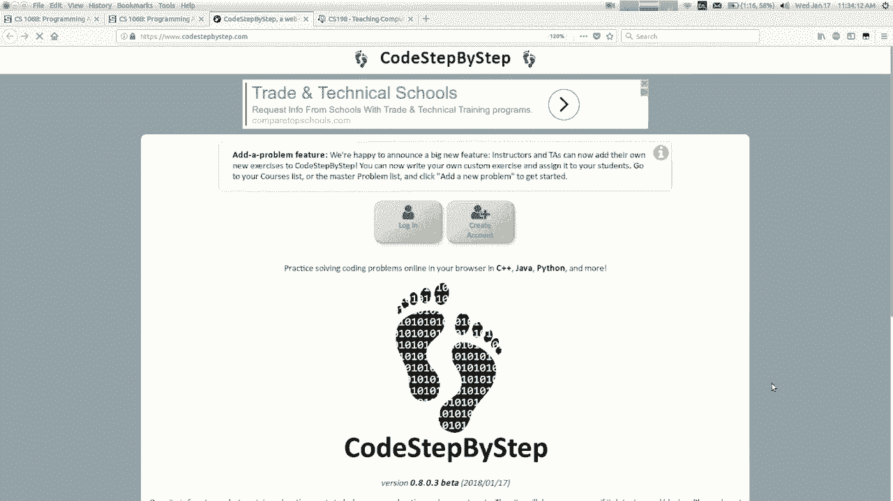
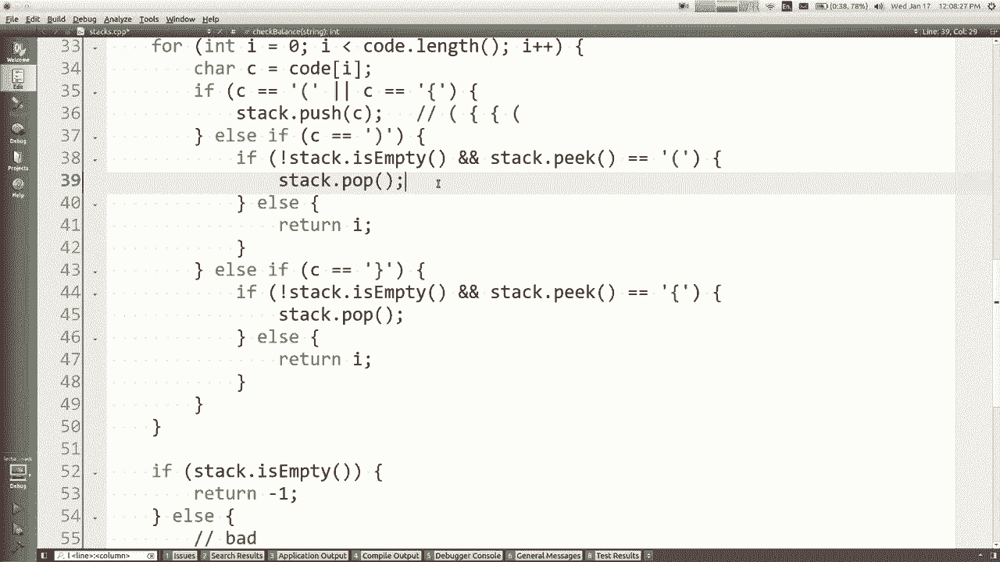
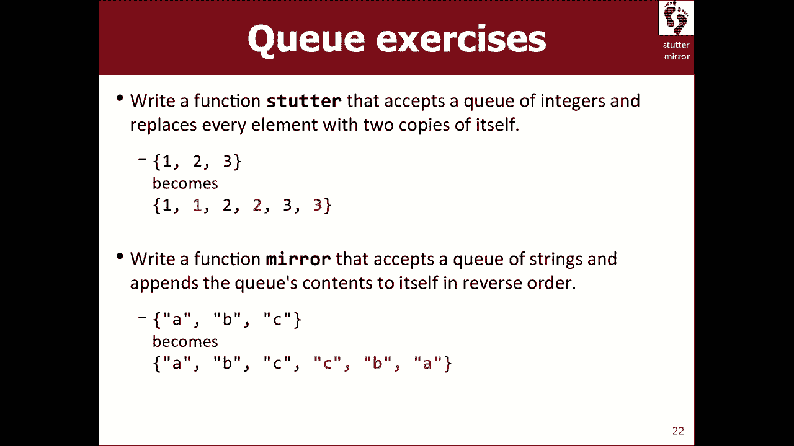

# 课程04：栈与队列 🧱🚶




在本节课中，我们将学习两种重要的数据结构：栈（Stack）和队列（Queue）。它们是抽象数据类型（ADT）的典型代表，虽然功能看似简单，但在特定场景下能提供高效的操作。我们将了解它们的基本概念、操作方法，并通过实际编程问题来掌握其应用。


## 向量回顾与抽象数据类型

上一节我们介绍了向量（Vector），它是一种支持通过索引随机访问元素的动态数组。本节中我们来看看抽象数据类型（ADT）的概念。

抽象数据类型（ADT）指的是一组操作（如添加、删除、查询大小等）的规范，而不关心其内部如何实现。例如，向量和链表（Linked List）都支持相同的“列表操作”ADT，但内部实现不同，这导致了它们在性能上的差异。

*   **向量**：内部通常使用数组存储。在中间插入或删除元素时，需要移动后续元素，时间复杂度可能为 O(n)。
*   **链表**：内部由相互链接的节点组成。插入或删除元素时，只需改变节点间的链接，时间复杂度为 O(1)，但随机访问元素效率较低。

这种“相同的操作，不同的内部实现”正是ADT的核心思想。选择哪种实现，往往需要在操作的灵活性、时间效率和内存使用之间进行权衡。

## 栈（Stack）📚

栈是一种“后进先出”（LIFO）的数据结构，就像一摞盘子。你只能从最顶部（栈顶）放入（推入）或拿走（弹出）盘子。

以下是栈支持的核心操作：
*   `push(value)`：将元素推入栈顶。
*   `pop()`：移除并返回栈顶元素。
*   `peek()`：返回栈顶元素但不移除它。
*   `isEmpty()`：检查栈是否为空。
*   `size()`：返回栈中元素数量。

栈在计算机科学中应用广泛，例如：
*   **函数调用栈**：记录函数调用和返回地址。
*   **表达式求值**：处理运算符优先级。
*   **撤销操作**：文字处理软件中的撤销功能通常使用栈来实现。

使用栈时需要注意，不能通过索引（如 `stack[i]`）访问中间元素。遍历栈的唯一方式是不断弹出元素，但这会清空栈。

```cpp
// 遍历栈（会清空栈）
while (!stack.isEmpty()) {
    string top = stack.pop();
    // 处理 top
}
```

### 栈的应用示例：括号匹配

让我们通过一个编程问题来理解栈的用途：检查一段代码中的圆括号 `()` 和花括号 `{}` 是否匹配正确。

算法思路如下：
1.  遍历字符串中的每个字符。
2.  如果遇到开括号（`(` 或 `{`），将其推入栈中。
3.  如果遇到闭括号（`)` 或 `}`）：
    *   检查栈是否为空。若为空，说明没有对应的开括号，匹配失败。
    *   检查栈顶元素是否是与当前闭括号匹配的开括号。若不匹配，则失败。
    *   若匹配，则将栈顶元素弹出。
4.  遍历结束后，检查栈是否为空。若不为空，说明有开括号未被关闭，匹配失败。


以下是核心代码框架：

```cpp
int checkBalance(string code) {
    Stack<char> s;
    for (int i = 0; i < code.length(); i++) {
        char ch = code[i];
        if (ch == '(' || ch == '{') {
            s.push(ch); // 开括号入栈
        } else if (ch == ')' || ch == '}') {
            if (s.isEmpty()) {
                return i; // 栈空，无匹配开括号
            }
            char top = s.peek();
            if ((ch == ')' && top != '(') || (ch == '}' && top != '{')) {
                return i; // 栈顶括号不匹配
            }
            s.pop(); // 匹配成功，弹出栈顶
        }
    }
    // 遍历结束，检查栈是否为空
    if (s.isEmpty()) {
        return -1; // 完全匹配
    } else {
        return code.length(); // 有未关闭的开括号
    }
}
```

## 队列（Queue）🛒

队列是一种“先进先出”（FIFO）的数据结构，就像排队等待。新来的人排在队尾（入队），服务从队头的人开始（出队）。

以下是队列支持的核心操作：
*   `enqueue(value)`：将元素加入队尾。
*   `dequeue()`：移除并返回队头元素。
*   `peek()`：返回队头元素但不移除它。
*   `isEmpty()`：检查队列是否为空。
*   `size()`：返回队列中元素数量。


队列的典型应用场景包括：
*   **打印任务队列**：管理等待打印的文档。
*   **消息队列**：在网络通信或分布式系统中缓冲消息。
*   **广度优先搜索**：在图算法中常用。

与栈类似，队列也不支持通过索引随机访问元素。遍历队列通常意味着不断出队处理元素。



```cpp
// 遍历队列（会清空队列）
while (!queue.isEmpty()) {
    string front = queue.dequeue();
    // 处理 front
}
```

### 队列与栈的联合应用示例：镜像队列

假设我们有一个队列，内容为 `["A", "B", "C"]`。我们希望修改这个队列，使其内容变为 `["A", "B", "C", "C", "B", "A"]`，即原内容后接其镜像反转。

我们可以借助一个栈来完成这个任务：
1.  首先，我们需要保留原队列的顺序。一种方法是先获取队列的原始大小。
2.  然后，将队列中的每个元素依次出队，同时做两件事：将其重新入队（以保留原序），并将其推入一个栈（以反转顺序）。
3.  此时，队列恢复了原始顺序 `["A", "B", "C"]`，而栈中从顶到底为 `["C", "B", "A"]`。
4.  最后，将栈中的所有元素依次弹出并加入队尾，即可得到最终结果。

以下是实现代码：



```cpp
void mirror(Queue<string>& q) {
    Stack<string> s;
    int originalSize = q.size();

    // 第一遍：出队、重新入队、同时入栈
    for (int i = 0; i < originalSize; i++) {
        string front = q.dequeue();
        q.enqueue(front); // 重新入队，保持原序
        s.push(front);    // 入栈，为反转做准备
    }

    // 第二遍：将栈中元素（反转顺序）加入队尾
    while (!s.isEmpty()) {
        q.enqueue(s.pop());
    }
}
// 操作后，队列 q 变为 ["A", "B", "C", "C", "B", "A"]
```

**注意**：在第一个循环中，我们使用固定的 `originalSize` 来控制循环次数，而不是 `while (!q.isEmpty())`。这是因为我们在循环内部会将元素重新加入队列，如果使用 `isEmpty()` 判断，循环将永远不会结束。

## 总结 🎯


本节课中我们一起学习了两种基础但强大的数据结构：栈和队列。
*   **栈**遵循后进先出（LIFO）原则，核心操作是 `push`、`pop` 和 `peek`，常用于需要“回溯”或“撤销”的场景。
*   **队列**遵循先进先出（FIFO）原则，核心操作是 `enqueue`、`dequeue` 和 `peek`，常用于管理需要按序处理的任务。
*   它们都是抽象数据类型（ADT）的具体实现，提供了受限但高效的操作接口。理解其特性有助于我们在解决特定问题时选择最合适的数据结构，例如用栈检查括号匹配，用队列和栈结合来生成镜像序列。