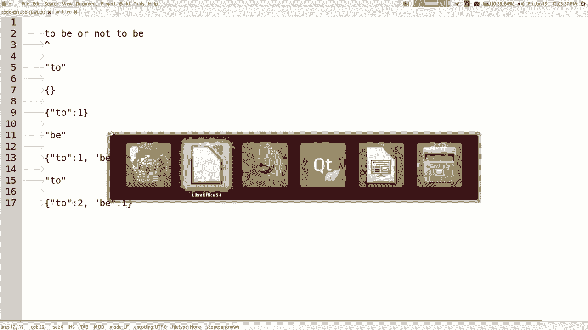

# 【斯坦福大学】CS106B C++中的抽象编程 · 2018年冬（完结·中英字幕·机翻） - P5：【Lecture 05】CS106B Programming Abstractions in C++ Win 2018 - 鬼谷良师 - BV1G7411k7jG

好的，所以在星期三，我们讨论的是抽象类型ADT和，我们还讨论了可以在其中使用的不同种类的收藏，斯坦福图书馆中的c ++，我们讨论过向量和链表，关于堆栈和队列的信息，今天我们要讨论更多的集合。

我叫布景和地图，今天第二项作业分配了，想提几件事，所以你知道昨晚巢穴很漂亮，罂粟，你知道典型的大学是前一天晚上，签下这个花花公子的人将会排长队，等待更多的人，我知道，那对你们来说不是很有趣。

但我有个好消息，您可以去，到其他任何一天的巢穴，我只是说如果您早一点开始或，在不同的日子或不同的时间去的人少，帮助更快的一般建议是，如果您较早开始，则需要但嘿，这取决于您，因此作业2也将是一对。

如果您想与合作伙伴一起工作，可以不必，如果您有一个可以与您同在的部门，您可以，好哥们，您和他们不在同一部分，请告诉我们，我们可以，让您进入同一部分，以便您可以一起工作，我们希望。

您在同一部分中是因为很难管理谁，评分，以及如果您有两个不同的部门负责人，谁会与您见面，这是最主要的原因之一，所以就应该这样，我是否强烈建议我做一个伴侣，我认为这是一件非常好的事。

因为它给了您可以与您交谈的人是帮助您工作的人，一起解决所有问题，您会知道这有帮助，你会得到更大的收益，你就必须帮助每个人，在那里您可以使用它，我认为这对，谈一谈您的一些初始问题，坦白地说， ，对您诚实。

当您在这里工作时，它对我们有很大帮助，因为每个人都在*，问题的数量可能是后来人们的一半，受影响的程序数量减少了一半，但触摸屏却没有，对此轻描淡写我的意思是，这意味着如果单元数减少， 。

需要帮助意味着更多的时间，我们可以给任何人更多的帮助，给每个人，所以如果需要帮助，我强烈鼓励合作伙伴和伴侣，寻找合作伙伴，我将在Piazza论坛上发布主题，您可以在其中，寻找合作伙伴。

只是您知道与部门负责人交谈，如果您需要帮助寻找合作伙伴，请与您所在部门的其他人联系，我们知道，我们将尽力帮助您并找出原因，因为我们希望，鼓励我们，我们当然希望您考虑使用该选项。

关于结对编程策略的任何问题您应该做什么，不应该这样做，或者在我们网站的顶部有一个链接，上面写着，配对编程，您可能想阅读那里的一些详细信息答案，我是说一些常见问题，我认为如果您与合作伙伴一起工作， 。

最好的方法是像一起坐着一起努力，我认为不是一个好的解决方案就是喜欢将其拆分，您对您或其他人做了另一部分，我有点理解为什么有些人认为他们想分裂，这样的事情，但我的意思是看看一天结束时。

在相同的东西上测试过，所以如果您只学了一半的材料，因为只有一半的功课您可能还没有做好准备，所以我，认为您会写出更好的程序，如果一起工作，您会学到更多，所以无论如何，这是我对双打的想法。

您是否对以下问题有任何疑问，在我切换到今天的讲座内容之前，不管怎样，都不要考虑，所以今天我们要谈论一些新的。

收集了新的ATT，它们称为集合和地图，希望我能拥有，我要教你一种谈论算法效率的方法，被称为Big O符号，来自第五章。 ，激励我的例子我想计算单词的数量，例如。

圣经或Moby Dick或字典或诸如此类的东西，有很多单词，它有多少个独特的单词，例如，如果您有单词，出现十次我不想算十次我想算什么，所以你怎么做得好，你知道我的外貌我会告诉你。

这个很酷的收藏集叫作Set，但我们假装我们，从来没有听说过，或者没有这样的东西，我们可以使用一些，我们已经了解的集合可以使用向量。

让我们尝试快速地编写该程序，看看结果如何，所以我，要去提示创建者，我今天有一个项目，我有一个文件，这里叫做set CPP，我将其重命名为main，所以我想写这个，基本上称为字数统计的方法。

您传入文件名即可，单词，它将打印出该文件中有多少个唯一单词，所以我已经有了一些代码，我要做的就是，用这个东西这个库，你不需要知道我在哪里可以说开始，然后停下来，然后我可以问一下绑圈的评论，我想看看。

程序运行cuz越快越好，所以好吧，这是文件，想要阅读它，你们知道如何读取不是真正意义的文件，今天的演讲，所以我要一起写一些或写一些，在我们一起工作之前我自己说，所以我只想说你知道流输入。

输入打开的文件名，如果我想计算单词数，则可以从该文件中读取，想一次从文件中读取一个单词吗？我知道该怎么做吗？ ，意味着我们过去经常使用get行，但这读了我想要的整行，你还记得念字的方法吗。

你说看到纳粹分子是什么，但我想你的意思是我认为，您在说的就像在箭头中看到语法是，权利索引，但我不会说CN，我会说输入，但是那种，箭头语法以读取单个项目的正确方法，所以您要做的就是，可以说一个字符串词。

然后你可以说我能读一个词，用这个词做某事好吧，这就是读取文件所需要做的全部工作，一次一个词，所以如果我要计算一个集合中的唯一词，可能会有所帮助，为什么我不保留我所收集的所有单词，看到。

然后在我阅读每个其他单词时，将其存储在该集合中，但前提是我之前从未见过，所以请保留所有，独特的话语，再说一分钟，我还是尝试使用，我们已经看过的集合，所以我们可以使用向量来做，我会说所有单词的字符串向量。

所以基本上我可以说所有单词，点加词当然不会强制我们想要的唯一性，对，所以如果我想强制执行唯一性，我可能会说，就像您知道该单词是否已在向量中这样的事，然后将其添加，好的，所以让我们检查一下，如果不是全部。

单词点包含单词或东西包含单词可以，好的词，然后添加好的词，我们去了，现在在底部我，想知道我写了多少个独特的单词，但我的意思是我该怎么办，实际上知道所有单词的点大小是多少，唯一单词的数量。

也许只是为了让您知道我不区分大小写，说像单词等于单词的小写字母，大写字母不会使我们困惑，然后我将打印多少，花费了毫秒，所以我将其编译并运行，并且正在读取， Moby Dick书中的那本书的全文。

我们要等几分钟才能完成，好了，花了11 ，秒计算3万个单词是一个好时机，一个不好的时光，似乎有点慢，似乎花了一段时间，但是，也许那只是最快的速度，我不知道你知道我在做什么。

意思是说11秒太多或破坏得不好那不是很好，尤其是性能，如果我尝试使用另一个更大的文件， ，让我们尝试圣经，让我们做圣经文字，我想是国王詹姆斯，圣经，所以我们运行它是一个更大的文件，它有更多的单词。

我看起来，不想坐在这里等它，但是可能要像一个，整个分钟的时间来读取此文件非常慢，好了，所以我将回到这段代码，在一秒钟后，关键是要有一个比矢量更好的数据结构， 。

可以更有效地解决此问题，这称为定， set是一个集合，如果您尝试向其中添加项目，它不会存储重复项，一个已经在集合中找到的集合，只是不添加它的第二个副本，限制第二个副本进入集合，所以关于一个有趣的事情。

设置是它不支持很多操作，但类似于，您在周三了解到的支持它的用途非常支持他们，高效，因此集合可以支持的核心操作正在添加，删除某物并对其进行测试，现在问是否有东西在集合中，这通常被称为。

召集添加/删除包含现在您放弃了很多其他方法，您可能会有一个非常有效的方法，尤其是我们将放弃，向量的索引考生，就像您知道的那样，您遍历索引，每个元素的索引为零一二三，您可以在中引用它们。

使用那些功能强大的索引的任何订单在您没有的集合中都很好，有没有索引就没有反就没有循环，这样的每个元素都无法做到，我们将讨论为什么会这样，但是如果您愿意放手，我知道在这种结构中，剩下的功能确实非常快。

您在想什么，我想知道程序是否已完成运行，希望他能， alt-tab返回，看看程序是否运行良好，好了，我会完成，我猜花了21秒，所以您知道不是最长的时间吗，世界，但很长一段时间后，我们会回到世界上。

因此在我们的图书馆中，两种类型的集合还记得我在星期三谈论过关于向量的情况，和一部举升机，他们支持我做同样的手术，除了他们有一个，内部结构稍有不同，这意味着某些操作，比其他人快或慢的记忆，我称那是。

 ADT的概念以不同的方式实现抽象操作，有一个相似的概念，我们在这里有两个不同的集合，库中集合的类型一种称为集合，另一种称为，半集，它们之间的区别在于哈希集略有不同，更快，所以很好。

但是哈希集不存储任何形式的元素，可预测顺序，而常规集将元素按排序存储，订购，因此取决于您的工作，您可能会更喜欢其中之一，其他如果您愿意牺牲一点速度来进行排序，如果您不关心订单，并且想要，要优化速度。

您应该选择一个哈希集，以便在确定，您需要使用某些操作的一种操作是，评估支持您的问题，问题是剑正确使用的顺序是什么，取决于数据，类型大多数数据类型都有一些自然的排序顺序，例如。

整数按数字顺序从最小数到最大数排序，字符串按字母顺序排序，其中有一些数据，类型实际上没有固有的顺序来排序那些类型，没有命令的订单不能放入常规集合，而必须放入，哈希集，是的，这是一个问题。

但是大多数数据类型，我们将使用常规集在某些情况下对其具有某种顺序，双打，关心，浮标和弦线，它们具有某种自然顺序， ，等于嗯，我一直在这些幻灯片上放这些东西， ，告诉你说“哦”的方法，最后我发誓。

今天的课程与方法的效率有关，但是，支持我在添加/删除之前所说的主要内容，其中包括，核心操作还有其他一些方便之处，但首先，三个是最重要的，还有一些方便的东西，像大小是空的，您可以打印一组以查看该组的内容。

等等，很好看，我想回到我们正在编写的程序，这个程序花了20秒来计算圣经中的单词， 。

回去，我要做的就是更改它，而不是存储向量，在所有单词中，我将使用所有常规单词构成一个集合，或者，哈希集，您认为怎么样，我们可以尝试两者，我认为也许是哈希集，会更好，因为我们并不在乎字符串的存储顺序。

在这里，我只想对它们进行计数，只要它能正确计数它们， ，我所关心的，所以我不会改变其余的，代码，因为散列集具有ADD方法，并且包含method和，所有这些，所以它有一个size方法。

所以我使用它的方式实际上不是，需要更改，我将再次运行它，我们完成了300毫秒， ，快很多，所以您知道百事可乐挑战哈希集赢了，那，常规设置如果您只想要常规位置，一个人花了700毫秒，花了两倍的时间。

但速度仍然更快，比那个向量好吧，现在你可能会说好，我不知道我是否知道订购这些东西-嗯，让我选择一个，较小的输入文件，我不知道该文件是什么，但让我更改一下即可。

像Barney step或D step rah rah rah ，好吧，无论我只是想对这么小的文件重复单词，然后我回到文档，然后将其更改为从小型Moby读取，最初是Moby Dick文件的删节形式。

其原始名称为，该文件不是Moby，但有人指出我应该将其重命名为small ，移动设备，您可能会想到一个um，所以我在这里要做的是，除了发了几个字外，我发誓是一个无辜的错误。

我要花多长时间才能真正打印出这些单词是什么，对于整个Moby Dick文件来说，这样做太大了，但是我可以在这里完成，然后说出所有单词，然后我就打印出收藏集，我发现我找到了Marty和raw。

并对其进行了排序，他们按字母顺序排列，因为我使用了常规集合，而且您知道，只是要确保它确实很清楚让我回到这里说，你知道艾比·克莱德·巴尼·马里亚纳那是我妻子的名字，在其中加上一些其他更好的名称。

现在我想您可以，看到它是按字母顺序从A到Z ，如果您回去，我现在就与您有关集合排序的问题有关，将其切换为哈希集哈希集不将元素存储在任何，特别可预测的顺序，因此如果我使用哈希集重新运行同一程序。

有点像是Abby和Marty混杂在一起，然后是Clyde混杂在一起， ，只是它没有排序，所以如果我在意我应该使用常规集，如果不是，我应该使用散列，所以它说花了零毫秒，所以说了几句话。

它无法检测到运行时间，无论如何，它是如此之快，以至于。

它们提供的这些集合的快速使用方式，因此它们还提供了一些，好的运算符，您可以询问一个集合是否与另一个集合相等，元素彼此之间，您可以做一些长度加倍的事情- ，您可以称之为集合交集和。

区别这些您知道的事情-例如合并两个集合或将它们相交，或从另一个集合中删除一个集合中的所有元素，您可以这样做，你知道可以在一个场景上做一些很好的小操作，如果你想，我将谈论一些你做不到的事情。

带有集合的位置，您无法在I范围从零到大小的范围内循环，好吧，我们看到了每一个都说，您要处理该项目的集合以及执行此操作的原因，那样是因为集合上没有索引操作，就像我想要的那样。

打印出所有我可以回到这里的单词，并为每个字符串单词说出，总而言之，我可以看到这里是一个单词加上单词单词加上Endel， ，它会把它们打印出来吗，那就是如果您要遍历一组，这就是您的操作方式。

并且您知道在遍历矢量时可以，从零开始，到大小，您可以从大小开始，到零，那里，您可以使用很多不同的顺序来遍历元素，您正在遍历一个集，您不应该太在意什么，为了使它们循环遍历。

您实际上无法像这样向后循环遍历集合，容易，我想这个想法是，如果您非常在乎循环顺序和。

的东西，也许你应该使用一个不同的集合，但是无论如何都不能遍历它，与索引设置他们可以做什么，他们不能做什么是的，嗯，问题是我没有保存在幻灯片上的某种东西，嗯，有点像灰色字体，所以从技术上讲，它们是第三种。

称为链接哈希集的集合，它按以下顺序存储元素： ，您添加它们，因此既不是哈希集的随机性，也不是，常规集的肮脏性是插入顺序，但我们不使用它，经常这样，因为它需要更多的内存，并且速度稍慢，但是，完美。

如果您想要一套，但出于某种原因，您非常在意添加它们，以一定的顺序，您希望他们保持该顺序，您可以使用此链接修补集第三个选项的任何其他问题，我认为最主要的是您必须能够弄清楚何时应该使用。

这些不同的结构中的每一个都取决于您遇到的是哪种问题，解决，我的意思是说，在以下情况下，集合非常有用，你真的不想重复你想阻止重复得到，进入代码，或者您想阻止它们，或者您知道自己有一个独特的。

您是否知道是否允许重复或不知道的一套事情，否则您将不会进行大量搜索，我认为核心，集的操作正在搜索其成员资格是，一个集合的集合非常快，向量的contains操作如何。

您认为我以前拥有代码之前在代码中知道的向量吗， vector在这里，我在vector上调用了contains，程序运行正常， ，慢一点，您如何认为向量实际实现包含代码，当我打电话说那里有一百种东西时。

是的，它做了什么，称为顺序搜索，它遍历所有元素，所以当然，您拥有的元素越多，需要的时间就越长，您会遍历更多的东西，您必须搜索更多的东西才能找到一个，回答，如果我们正在处理一个非常大的文件，向量将得到。

每当我们读另一个单词时，我都会看整个向量，再次查看该词是否在其中，您会发现它会很慢，当然，我还没有完全弄清楚的是固定结构和，哈希集结构不需要花太多时间，也不需要做。

他们有很多工作有不同的内部实现方式可以帮助他们，更快地回答这个会员资格问题，我不会教你。

如果您非常好奇，今天将详细介绍如何在内部实施它们，该集合是使用称为二叉树或，二进制搜索树，我们将在后面学习使用以下方式实现哈希集，内部或称为哈希表的结构，我们还将了解，如果您想用谷歌搜索课程。

请稍后再试，您可以设置有关其他任何问题，专门的词汇集，我不认为您真的需要，立即使用它，但它是一个集合，但只存储您知道的字符串，您可以说的in集合，用于设置完整的护理字符串集，词典不要求值类型的任何内容。

因为词典是，如果您不知道在哪里，则隐式地知道墨西哥的字符串，基本上它只是意味着没有定义的字典， ，构成语言一部分的单词列表，我们将回来，稍后在课堂上介绍到此结构，但如果您存储的内容有时会很有用。

是字串或类似的字串，但一组字串是完美的，也足够，所以我不会花任何时间在这个词典上，我想谈的是我想谈的另一种，我们今天要做的收藏，所以我们将学习的最后一个主要的是，称为max。

因此地图有时也称为字典106a不要，记住他们在那里向您介绍了哪些确切的收藏，但是您可以，在JavaScript中使用对象来存储该语言的键值对，如果，您在Java中花了106磅在这里。

您可能已经了解了一种称为哈希的结构，基本上就是地图的地图地图是商店对最多的收藏，我们了解的集合存储了各个数据元素，因此，它们之间的区别是您可以执行的顺序或操作，或者，是否有重复项，但它们存储单个项目。

地图则没有，存储它存储的单个项目，因此您一次添加两件事， ，对有两个部分，一个部分称为键，另一部分称为键，值，所以您先添加头发，然后再提供（如果有） ，部分键，它将查找第二部分的值，所以这是原因。

有时被称为字典，实际上是非常好的，如果已经存储了成对的示例，则可以使用此结构端口，带有定义的单词，然后如果您仅有一个单词，它将查找，与该作品相关联的定义，即地图的用途，可以将数据对关联在一起。

并且隐式地可以做到这一点，很快，您可以快速查找事物，所以我很快就举了一个例子，您将所有这些对添加到自己构建的电话簿中，然后在以后，您想要某人的电话号码，并且您说嘿地图查找该电话号码。

电话号码基本上有很多编程问题的例子，您想基于其他通常是映射的内容查找内容，问题图是非常有用的结构，这里是核心操作的一种，地图基本上与集合有点相似，实际上基本上，添加，删除和搜索。

尽管我在添加这些东西时使用了不同的动词，地图上的东西称为放置，因此如果您将一对添加到，地图，如果他们已经不是那个热配对，它会取代那对，所以你，不能有两对具有相同密钥的密钥，它们必须是唯一密钥。

可以通过调用get来查找与给定键关联的值，就像我叫Marty的名字一样，他的电话号码是什么，请查询，如果您尝试获取该电话的号码，请获取我们的图书馆，不在地图中的键的值，它将返回默认的空值。

零或空字符串或类似我的示例中的内容，一二三四五五六七尖叫如果你说让你认识我或，不在那的人会返回一个空字符串好，最后一个是，删除您传递的密钥，它不仅会删除该密钥，还会删除，与键关联的值，因此。

如果我说要删除Marty，它将删除，马蒂和685对任何人都可以的问题是，确实删除了返回值I ，忘了我不记得它的语言因图书馆而异。

我应该知道的库，因为我维护这些库，但是我不知道，所以，直播，我会觉得我认为它是无效的，它不会返回，所以如果您想要，抓住它，然后还删除它，你会说得到然后你会说。

删除也许我们应该改变图书馆，我到目前为止还不知道如何，您是否对这些核心操作或我的地图有任何疑问？ ，我的意思是我知道很多人在106a中都看到过地图，所以也许，有人熟悉你们吗。

你们用106 aj的地图做任何事情吗？ ，很酷，所以您说地图对您有意义，我永远也不会厌倦，开个玩笑吧，这就是我们的C ++库中的地图，其中有两种，地图一个称为地图，另一个称为哈希图，因此您了解了哈希。

映射106a（如果您使用Java编写），因此应该是一个熟悉的名称，它具有一个，这两个结构的一组相似的属性紧密地反映了这两种类型，集集和哈希集，您有一个映射和一个哈希映射，它不是。

巧合实际上是因为它们的实现方式非常，同样，我们将在本课程的稍后部分再讨论，地图按键的排列顺序将其对存储在，电话簿示例人们的名字将是排序顺序，而不是，相当快，但是经过排序，散列图甚至更快，但完全。

如果未排序，则会混杂成随机顺序，因此，如果您不关心，为了最大化速度，选择哈希图，我想你问了，关于链接的哈希集，还有一个链接标记匹配，我不认为我把那个，在这里的幻灯片上，但是有一个有趣的事情是当您。

声明地图，如果您来自Java，那么Java会让您编写不同类型的公斤，表示您必须说整数或您写int或double或，一切正常都可以，所以这里是您可以在地图上执行的方法，大小是空的，可以串起所有这类好东西。

我认为我还没有特别强调的一件事是，与其说，得到或放置，您可以只使用方括号使它看起来像一个，向量或数组，而不是说和获取键，您可以说map ，括号键，实际上很像JavaScript。

我想正确的106 aj ，这样做，所以我们也可以这样做，所以这是一个很好的缩写或语法，可能今天在我的一些代码中使用了它，但是任何一种方法都可以，所以，当您想查看地图中的值时，有时您想遍历。

地图并非总是以地图为主要目的，而是用于查找单个事物。 ，时间，但有时您想遍历整个地图，你还开玩笑说伯克利，你可以看看它给出的地图，我的钥匙尖叫着名字，如果您想要助教，也可以使用方括号，查找那些。

就像每个循环在地图上的样子一样，你可以用垫子做的事情是你可以数数你可以计算的东西，这对于您可以走出去很有用，因为您知道我可以通过以下方式将其存储在您的地图中，修改段落这种计数和计数是您的事。

对地图做很多事情，基本上就像是大量的计数器，事实上，让我们现在来看一下，如果您不介意我想回到，从一堆中读取单词并计算文件中的单词，只想计算，很多单词有50，000个单词，或者我想数多少。

出现在文件中的每个唯一单词，所以如果我在做Moby ，迪克然后鲸鱼这个词出现了187次，是556，我想让这些单词中的每一个保持这些计数器不变，所以，我想使用地图来做到这一点。

它的工作方式类似于地图中的商店，配对术语，例如我将要存储在地图中的事物的类型是什么，你怎么看，这些是好的词，是与这些词相关的价值之一，关键伟大伟大整数，单词出现的次数还可以，所以我们必须建立一个。

随着时间的推移，结构会读取文件并使用其数据进行构建，将信息输入到我们的地图中，我该如何处理我认为您拥有的单词，现在该地图应该存储什么的正确想法我该如何阅读每个单词，把它变成那个数据你怎么说，是的。

她有一个正确的主意，他说的是，当我阅读每个字眼时， ，地图中已经有单词，如果没有，我需要将其放入地图中，已经有这个词了，我再看到一个词，所以我需要，增加或增加这个次数，我已经看过这个单词多少次了。

所以我。

认为这个主意会是这样，如果我正在阅读并且发现存在或不存在或，随便什么，如果我看到这个词，我正在阅读这些东西-你知道，本来我的地图上什么都没有，但是在那之后我读了那个词。

认为我想要一个故事就像我已经看过这个词一样-一旦您知道了，那么我，看到B，然后我就很好了，现在我已经看到了-一次，一次我看到了B ，所以你有点那样，我想我有没有，好吧。

不管我们说下一个词是什么-那么我要做的就是我不存储， -的另一份副本：我要存储的副本-：o，你知道B：你知道我的意思，就像把它放在地图上（如果不存在），但如果在地图上，则增加，一个输入就在那里。

这就是您所说的，这就是我想要的，当我使用您提到的结构读取此文件的每个单词时， ，让我们进入我的项目，我有一个名为Maps CPP的文件，我正在阅读。

这里的大文件，我只是从另一个文件中读取了这一部分，一次只写一个，所以现在我只想填写使用，集合，所以您告诉我制作一个从字符串到整数的映射，也许我只是，称它为无数个单词，然后当我阅读您所说的每个单词时。

如果它不在地图中，则该单词不在地图中，如果它在地图中， ，通过一项权利增加其价值，就像您说的那样，如果，它不包含，有一个叫做contains key的方法，所以如果这个键不是，在地图上，关键是什么。

单词是正确的关键字，所以如果这个单词不是，找到添加它，所以单词计数您添加的方式称为放什么我是什么，我应该在这里放入地图中的一对，用逗号隔开，现在我已经看到了，一遍，我以前从未看过它，但是现在，如果它在。

然后将地图存储起来，计数大约为3，我需要去获取，计算并将其更改为4或任何我需要增加1的内容，正确，所以有一个想法你说int count等于word counts不会。

单词go get go查找我已经看过的单词的数量do ，计数加加不会修改地图，我必须将其放回地图，有了新增加的房子，所以单词计数点把单词逗号计数，你知道我的意思吗？ ，祝福它不会修改地图。

我必须把它放回去替换，老了，新的好问题，是的，很好的问题，如果您添加一根头发，我不需要删除“否”这个词吗？ ，该头发的关键已经找到，它将替换现有的头发，这个词和这对新人一起工作，是的，是的。

我可以一起搬一些吗，是的，我可以先得到，摆脱这个，说计数加一而不是加加，所以下降到二，但是我也可以说不是这个变量只是来自这里，所以我，可以这样说，例如，将其旧值加上一，就可以知道它是新值。

但是我可以变得更加隐身，这可以说你知道，说点的话，实际上您可以在说单词的地方使用这种较短的语法，计算括号中的单词等于一个，等于说放置单词，然后等于一个，一对，这样可以正常工作，不会缩短下面的代码，但是。

语法的工作原理你也可以在这里说单词计数，括号词等于单词计数括号词加一个像这样，旧值加一权利，但您可以将其缩短为一或二，加号加号，这样比较短，如果单词在那里，我们要删除内容。

您实际上无论如何都可以加上加号，它会将它从零变成一，所以你可以那样做，之所以有效，是因为如果这个词不存在，而您尝试加号加上它，它将，静默地添加零计数加2：01，这就是您想要的，首先。

我认为简短的版本有点难以理解，一个新的程序员，所以我会把它放回去，但是如果你很酷而且还可以的话，对我来说，这种语法很好，只是缩短了一点点，那里的代码，嘿，我还没有运行过，所以我计算了所有单词，然后算了。

想要，就像我数完他们之后，我想要做到，所以你可以，输入一个单词进行搜索，然后我将打印出计数，这样，就像int count等于单词计数一样，无论您键入什么单词都可以得到单词，然后，我将打印计数时间。

所以让我直接快速运行它，以便运行，错误的文件对不起，所以如果我去设置让我们改变，这完全不是主要的，然后将地图重命名为主要，我的意思是，应用程序好吧，让我们尝试一下，它正在读取内容，因此。

完成我没有做计时器，但您可以看到它非常快，或者我花了，在圣经中搜索大约一秒钟左右很奇怪，让我们输入呃，时代上帝魔鬼约翰（Johan）不管是什么权利，所以我不是很积极，并不是那不是一个很好的测试案例。

就像II不知道那些计数是否正确，我实际上应该使用较小的文件进行测试，以确保其正常工作，但是我，非常确定这是正确的代码，因此地图非常适合查找这些内容，所有这些计数器都有大量数据，我们可以查询一下计数器。

对于任何给定的单词，马丁怎么样？哦，那是我的名字。 ，我太太的玛丽安娜（Mariana）不在那儿，所以对任何疑问，那个考试哦，是的，哦，是的，如果您的人口像，你好逗号，它将在逗号这个范围内包含一个逗号。

和hello分开是很普通的，我要做的是，在我将小写字母小写之后，就像这里一样，我不喜欢仅仅因为我不太在乎而选择不这样做，你可以杀死我，但如果我真的想要一个好的版本，那你是对的。 ，想要标点符号。

您还说了哈希，我想指出一点，我在这里使用了常规地图，使用哈希映射一直很好，因为我并不真正在乎，方式全部按照我想要的结构进行排序，在稍后计算的地方查找个人，因此哈希映射可能，对于此特定示例稍好一些。

因为向上，这里我没有每个都包含哈希映射，但是我现在可以每个都包含哈希映射点，它应该运行，我认为您不会真正注意到很多差异，只是稍微提示了一下，该版本似乎具有相同的速度，我第一次在斯坦福大学上这堂课的时候。

举这个例子，我把东西跑了，我说好，让我们寻找一些，圣经中的单词，我输入了上帝，它说像-我输入了魔鬼，它说像1，我输入耶稣，说零，我就像，圣经的这个版本是我认为耶稣在。

圣经可能是错的取决于我原来是在用白鲸，档案，我就像圣经中有很多鲸鱼一样有趣，无论如何都是有趣的时光，所以我的意思是我认为您可能已经看过地图了，如果可能的话，在某处或某处相当于地图的结构之前， 6aj。

但我的意思是像所有这些结构一样，我认为重要的是，能够确定何时只要给您一个，问题，我说使用很好的向量，但是如果我给你一个开放的问题，而且我不会告诉您什么是结构化用法，您如何知道是什么开始评论和。

我认为您需要练习思维过程和其中一件事，关于地图，正如我们所说的，我需要将每种此类事物相关联，我是否需要将这种东西彼此关联，根据另一个值查找事物使用此值获得该值，那正是应该引起您说的那种关联关系，哦。

我可能需要一张地图，因为那里有一个问题，可以继续，我为什么要更改我的名字，因为，所以我必须重命名其中一个，所以，在任何给定的项目中只有一个称为均值的函数，所以这就是为什么。

仅仅是C ++项目的局限性一个整体项目，您不能拥有两个，具有相同参数和正确权限的名为main的函数，特别重要的是main，因为它是按顺序运行的那个，要知道从哪里开始运行，必须有一个独特的功能。

取名为int me yeah另外一个，所以我不是想做对，您说它就像向量，更像是一组字符串，您可以添加独特的菌株删除并询问它是否包含东西，所以它有那些，一种相同的核心操作，它像存储的集合一样存储各种顺序。

一些不同的操作具有所谓的前缀搜索，因此您，可以说这组词以Mar开头，如果第二件事， Marty或Mariana会返回批准，因此集词典对于那些，各种问题，是的，我要给你一个简短的答案，只是因为我想保持在。

 ADT，选举和他所质疑的东西就像我是否拥有这些，我的项目中有多个文件，它们在其中具有相同的名称，这两个文件都会给我这个错误，例如相同的多个定义，功能，所以在Java或其他语言中，您可能会说出来。

私人的或使他们彼此分开的东西， C ++确实有私有和公共的东西，但是只有在您编写时，类和当前正在编写的类，我们只是在编写一对函数，如果，您有公平的职能，并且希望他们不要冲突，有一个词。

您可以使用称为static的方法，这有点像private，现在它们既可以，具有相似的函数名称，我通常不建议这样做，因为它使，调试器也不了解函数名称是什么以及它是什么，这样做的话，如果发生崩溃。

并不能很好地显示出，函数标题，行和内容，所以我现在要说一下，项目中的文件，只需用不同的函数名命名它们，但是稍后我们将讨论类和对象以及，私人和公共的东西，我想给你看一些。

在完成之前还有更多事情要做，所以我只会花一秒钟，但是，您可以嵌套集合，这样就可以像矢量一样，声明向量事件的元素类型，您可以拥有堆栈映射，你可以有立方体的向量和，正是您想要的。

不需要在这里详细阅读所有这些代码，而是，你想在信使上保留一组人的好友列表我不知道全部，下一张幻灯片，但有一组好友，您如何跟踪每个人的，好友列表或朋友列表，或者说什么好，如果你说嘿，谁是马蒂，朋友。

就像我知道我对Marty感兴趣的人的名字一样，我想要一个，换那个名字，所以就像我想将流的名称与，朋友，所以我想从流中映射两个其他字符串集，以便，这是屏幕通用设置免费地图的地图。

所以您可以添加所有这些朋友，在这里，所以你你知道我一直在教你的所有东西仍在工作，如果您在某个收藏夹或某个收藏夹内有某个收藏夹，则仍然适用，集合语法中的所有这些等式看起来是最奇怪的。

我们的收藏集支持加等于作为点应用程序的同义词，所以它是，基本上与说点应用程序相同，我只剩下几分钟了，所以，我只是想知道您今天开始讲这个话题，但我想谈一谈，所谓的Big O符号算法分析让我给你一个。

简短的版本，我将在星期一继续谈论它，在我的方法表的列上我说的那些小东西，您知道的一些事情可以用不同的方式讨论代码的效率，我想向您展示一个代码示例，请看此示例，现在，其中一些，说语句的一部分，一个语句。

两个语句，三个，我的观点是，如果您查看该代码，并且想要，谈论有多少条语句执行得很好，这里引用了，可以描述总代码的变量，如果您分别查看这两个for循环，则以和作为变量执行，开放是正确的，它们相互嵌套。

所以，总的来说，它将以总速度的n倍n乘以平方，然后，第二个循环好，我们有一个循环，左边和右边有三个语句，所以它有点像是三个的重复，所以n乘以三件事，所以这就像这段代码一样，对任何平方加3并。

 n加1个史蒂夫·梦露（Steve Monroe）并不是完美的描述，因为循环将，是加号和东西，所以这不是一个完美的计数器，但这是一个，想法正确，所以重复越多，循环越长，事情将会发生。

所以当我们查看我们研究过的收藏时，如果您，认为该集合具有一个像n个元素的向量一样的元素，如果，您谈论要在向量上执行的操作，必须移开一个粗略地说是字面意思的元素，可能太少了，但是不是很多。

所以我们有时会谈论，我要像跳一样跳到我们身边，我知道我只剩下一分钟了，在这里，但是mm-hmm ，这是它的简写，还是它的速度慢？ ，慢n，您可能会说我说的是很多，不同的地方，其中大多数会接近n。

所以那些带有，事情正在试图告诉您采用MIT承诺的哪种方法最快，慢，我们作为程序员在乎这一点，所以我将继续谈论。

星期一有更多的一个愉快的周末下次见。

