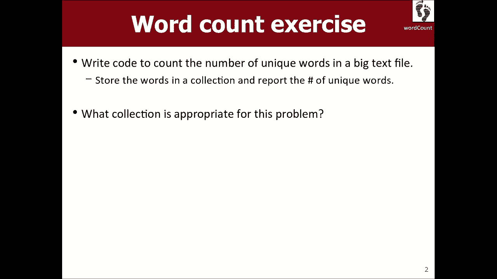
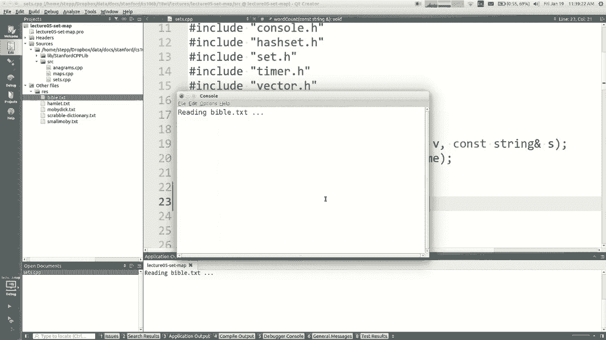
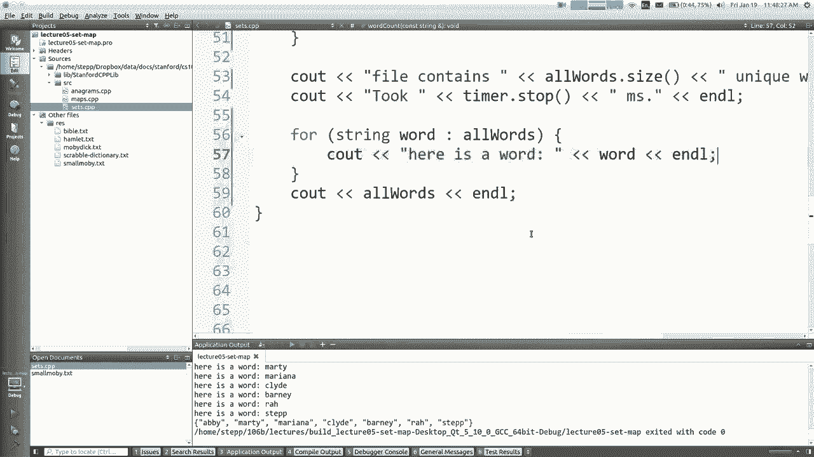
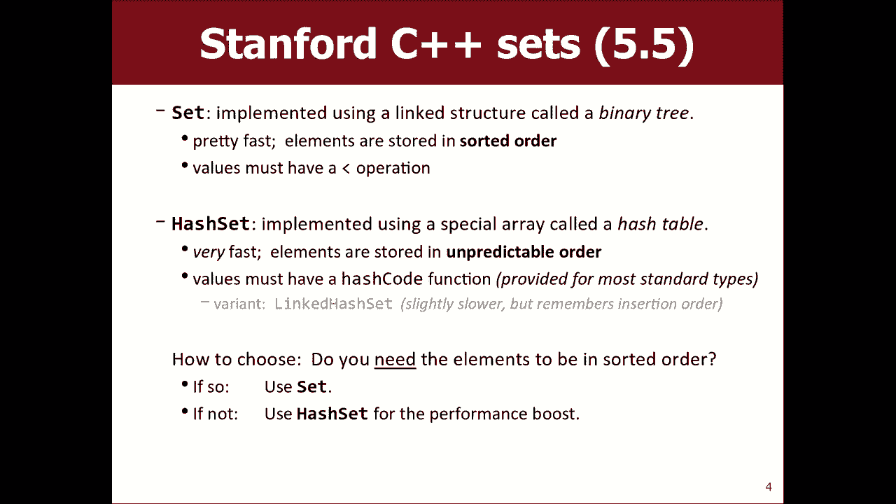
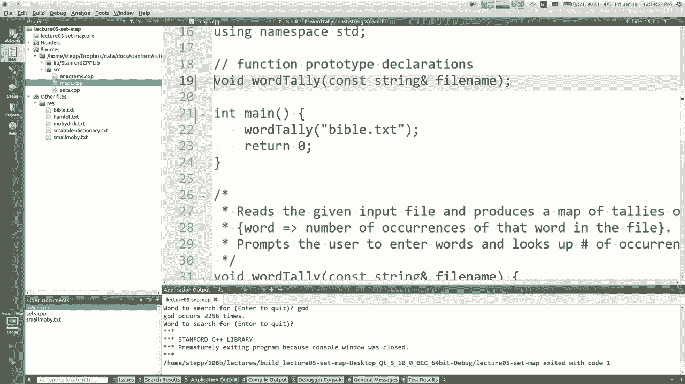
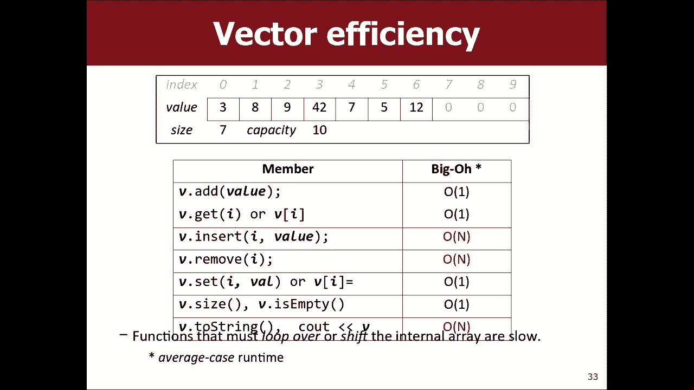
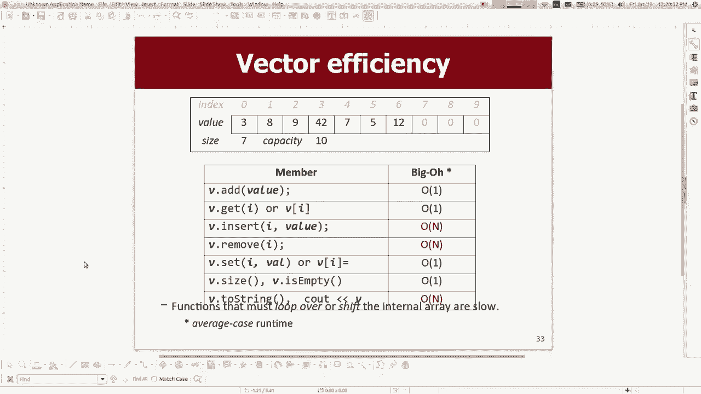

# 课程05：集合与映射 🗂️

在本节课中，我们将学习两种新的抽象数据类型（ADT）：**集合（Set）** 和 **映射（Map）**。我们还将初步了解如何分析算法的效率，即 **大O表示法（Big O Notation）**。这些数据结构能帮助我们更高效地解决编程问题，例如统计文本中不重复的单词数量。

---

## 作业与合作伙伴 👥

在深入课程内容之前，先提一下第二项作业。作业允许两人合作完成。我们强烈建议你找一个合作伙伴。合作编程能帮助你更好地讨论问题、共同解决难题，并且通常能写出更优质的程序，学到更多知识。

如果你需要寻找合作伙伴，可以在课程论坛上发帖，或者向你的课程助教寻求帮助。关于合作编程的具体策略，网站上提供了详细的指南，建议你阅读。


---

## 问题引入：统计唯一单词数 📖



让我们从一个具体问题开始：如何统计一篇文章（例如《白鲸记》或《圣经》）中**不重复的单词数量**？如果一个单词出现了十次，我们只计为一次。

首先，我们可以尝试使用我们已经学过的数据结构——**向量（Vector）**——来解决这个问题。

### 使用向量的方法

思路是：读取文件中的每一个单词，检查它是否已经存在于我们维护的向量中。如果不存在，则将其加入向量。

```cpp
Vector<string> allWords;
// 读取单词
if (!allWords.contains(word)) {
    allWords.add(word);
}
// 最终，allWords.size() 就是唯一单词的数量
```

我们运行这个程序来统计《白鲸记》。程序运行了大约11秒。当我们尝试统计更大的《圣经》文本时，程序运行得非常慢，可能需要近一分钟。这个速度对于实际应用来说是不可接受的。



---

## 解决方案：集合（Set）数据结构 ⚡

为什么向量方案这么慢？因为向量的 `contains` 操作是**顺序搜索**的。随着向量中元素增多，检查一个单词是否存在所需的时间会线性增长。

我们需要一个能更快回答“某物是否存在”这个问题的数据结构，这就是**集合（Set）**。

### 集合的核心特性

*   **不允许重复**：如果你尝试添加一个已经存在于集合中的元素，集合不会存储第二个副本。
*   **高效的核心操作**：`add`（添加）、`remove`（删除）、`contains`（检查包含）。为了换取这些操作的高效性，集合**不支持通过索引访问元素**。

### 集合的类型


在我们的库中，有两种主要的集合：

1.  **Set**：元素按**排序顺序**存储（例如，字符串按字母顺序，整数按数字顺序）。
2.  **HashSet**：元素**不按特定顺序**存储，但操作速度通常比 `Set` 更快。

选择哪种取决于你的需求：如果你需要元素有序，使用 `Set`；如果你只追求最快速度且不关心顺序，使用 `HashSet`。

### 使用集合改进单词统计

让我们将程序中的 `Vector` 替换为 `HashSet`。


```cpp
HashSet<string> allWords;
// 读取单词
allWords.add(word); // 集合会自动处理重复
// 最终，allWords.size() 就是唯一单词的数量
```

再次运行程序，统计《圣经》中的唯一单词。这次，程序在**约300毫秒**内就完成了！速度有了巨大的提升。如果使用常规的 `Set`，大约需要700毫秒，依然远快于向量方案。


### 遍历集合



由于集合没有索引，你不能使用 `for (int i =0; i < set.size(); i++)` 这样的循环。遍历集合的标准方法是使用 **for-each** 循环：

```cpp
for (string word : allWords) {
    cout << word << endl;
}
```

---



上一节我们介绍了用于存储独立元素并确保唯一性的集合。本节中，我们来看看另一种强大的数据结构——映射，它用于存储成对的关联数据。

## 映射（Map）数据结构 🗺️


**映射（Map）**，有时也称为字典（Dictionary），用于存储**键值对（Key-Value Pairs）**。

*   **键（Key）**：用于查找的唯一标识符。
*   **值（Value）**：与键关联的数据。

一个典型的例子是电话簿：将人名（键）与电话号码（值）关联起来。

### 映射的核心操作

1.  **`put(key, value)`**：添加或更新一对键值。如果键已存在，则用新值替换旧值。
2.  **`get(key)`**：查找并返回与给定键关联的值。如果键不存在，则返回该类型的默认值（如0、空字符串等）。
3.  **`remove(key)`**：删除指定的键及其关联的值。
4.  **`containsKey(key)`**：检查映射中是否包含指定的键。

### 映射的类型

与集合类似，映射也有两种主要类型：


1.  **Map**：按键的排序顺序存储键值对。
2.  **HashMap**：不按顺序存储，但操作速度通常更快。


### 映射的便捷语法

除了使用 `get` 和 `put`，你还可以使用类似数组的方括号语法：

```cpp
// 以下两行等价
map.put(“Marty”, “685-2180”);
map[“Marty”] = “685-2180”;

// 以下两行等价
string phone = map.get(“Marty”);
string phone = map[“Marty”];
```

### 应用示例：统计单词频率

现在，我们解决一个更复杂的问题：不仅统计有哪些唯一单词，还要统计**每个单词出现的次数**。

这时映射就派上用场了。我们可以建立一个映射，其中：
*   **键**是单词（`string`）。
*   **值**是该单词出现的次数（`int`）。


算法如下：
1.  读取每个单词。
2.  如果单词不在映射中，则添加它，并将次数设为1。
3.  如果单词已在映射中，则获取其当前次数，加1，再存回映射。

```cpp
HashMap<string, int> wordCounts;
// 读取单词
if (!wordCounts.containsKey(word)) {
    wordCounts[word] = 1; // 第一次出现
} else {
    wordCounts[word] = wordCounts[word] + 1; // 出现次数加1
}
```


一个更简洁的写法是直接递增，因为如果键不存在，`map[key]` 会返回默认值0：
```cpp
wordCounts[word]++; // 无论单词是否存在，这一行都能正确增加计数
```

程序完成后，我们可以快速查询任何单词的出现频率：
```cpp
cout << “The word ‘whale’ appears “ << wordCounts[“whale”] << “ times.” << endl;
```

---

## 数据结构嵌套 🎁

集合和映射的元素类型可以是任何类型，包括另一个集合或映射。这允许你构建复杂的数据结构来模拟现实问题。

例如，如果你想维护一个社交网络中的好友列表：
*   每个人有一组好友。
*   你需要根据人名快速找到他的好友集合。

这可以通过一个 **从字符串到字符串集合的映射** 来实现：

```cpp
Map<string, Set<string>> friendLists;
// 为 Marty 添加好友
friendLists[“Marty”].add(“Mariana”);
friendLists[“Marty”].add(“Clyde”);

// 获取 Marty 的好友列表并遍历
for (string friendName : friendLists[“Marty”]) {
    cout << friendName << endl;
}
```

---

## 算法效率简介：大O表示法 ⏱️

我们注意到，使用向量、集合或映射解决同一个问题，速度差异巨大。我们需要一种方法来描述和比较不同算法或操作的效率。

这就是 **大O表示法（Big O Notation）**。它描述了算法运行时间或所需空间如何随输入数据规模（通常用 `n` 表示）的增长而增长。

### 一个简单例子

观察以下代码：
```cpp
for (int i = 0; i < n; i++) {
    for (int j = 0; j < n; j++) {
        // 执行某些操作（语句1）
    }
}
for (int k = 0; k < n; k++) {
    // 执行某些操作（语句2）
    // 执行某些操作（语句3）
}
```
*   第一个嵌套循环中的操作大约执行了 `n * n = n²` 次。
*   第二个循环中的两个操作大约执行了 `n * 2 = 2n` 次。
*   总的操作次数大致与 `n² + 2n` 成正比。

当 `n` 很大时，`n²` 项起主导作用。因此，我们说这段代码的时间复杂度是 **O(n²)**。



### 应用到我们的数据结构

*   **向量的 `contains` 操作**：在最坏情况下需要检查向量中的每一个元素。如果向量有 `n` 个元素，可能需要 `n` 次比较。我们说它的时间复杂度是 **O(n)**（线性时间）。
*   **集合的 `contains` 操作**：实现方式（如二叉搜索树或哈希表）使其效率高得多。在平均情况下，它可能只需要检查 `log n` 个元素（对于树）或甚至接近常数个元素（对于哈希表）。因此，它的时间复杂度可以是 **O(log n)** 或 **O(1)**（常数时间）。

这就是为什么用集合统计单词比用向量快几个数量级的原因。我们将在后续课程中更深入地探讨大O表示法和不同数据结构的内部实现。

---

## 总结 📝

本节课中我们一起学习了：
1.  **集合（Set）**：一种存储唯一元素的高效数据结构，核心操作是 `add`, `remove`, `contains`。分为有序的 `Set` 和无序但更快的 `HashSet`。
2.  **映射（Map）**：一种存储键值对的数据结构，用于基于键快速查找值。核心操作是 `put`, `get`, `remove`, `containsKey`。同样分为 `Map` 和 `HashMap`。
3.  **应用**：我们使用集合高效统计了文本中的唯一单词，并使用映射统计了每个单词的出现频率。
4.  **嵌套结构**：集合和映射可以嵌套使用，以构建更复杂的数据模型。
5.  **效率概念**：引入了**大O表示法**作为描述算法效率的工具，并解释了为什么集合/映射的操作比向量的类似操作快得多。





理解这些抽象数据类型及其适用场景，对于编写高效、清晰的程序至关重要。