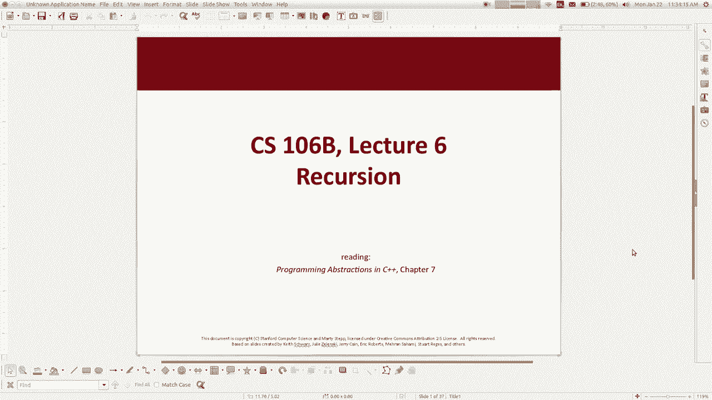
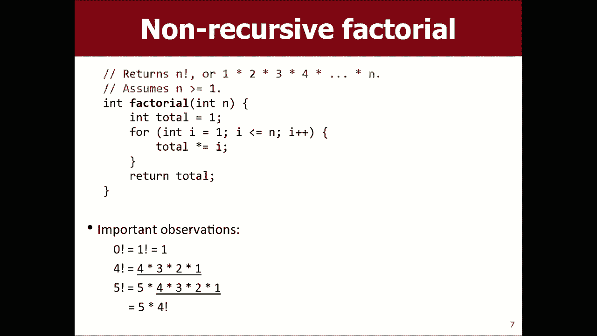
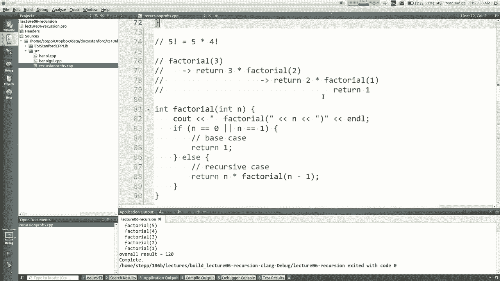
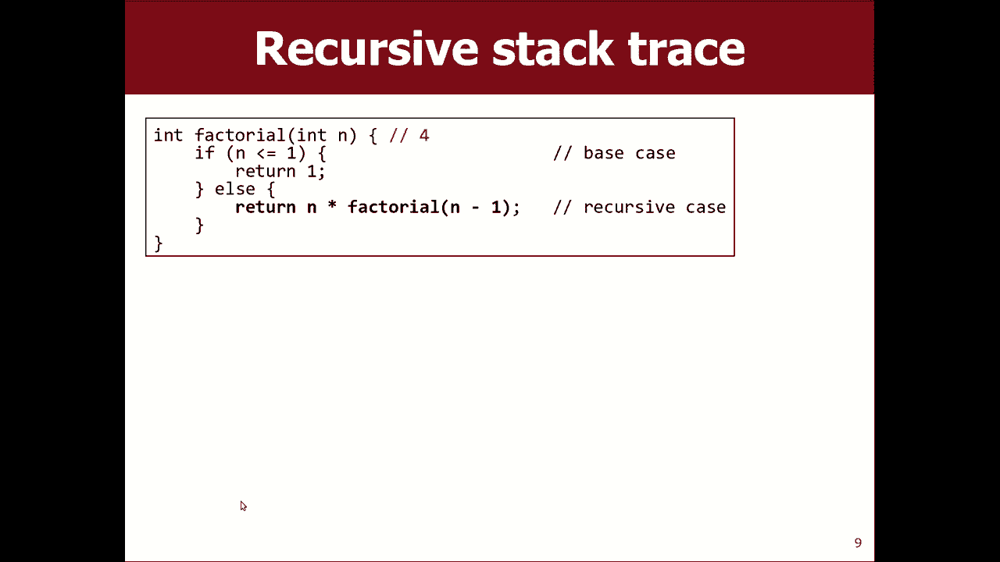
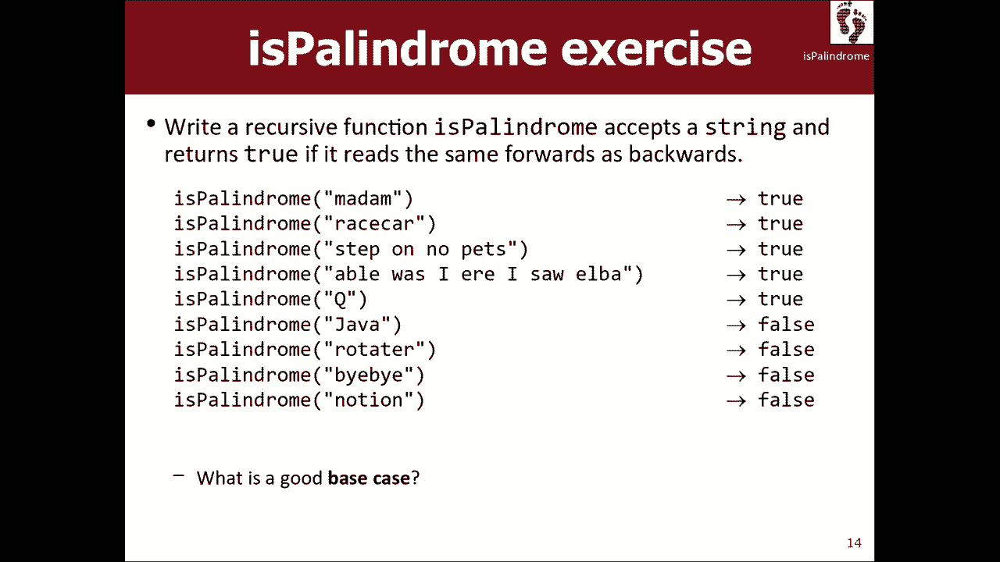
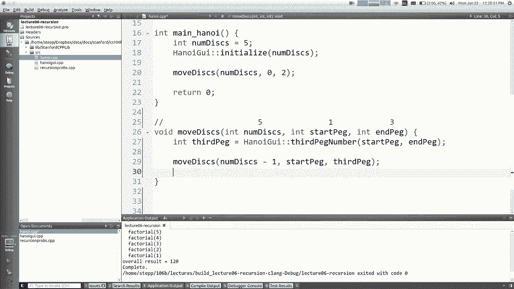
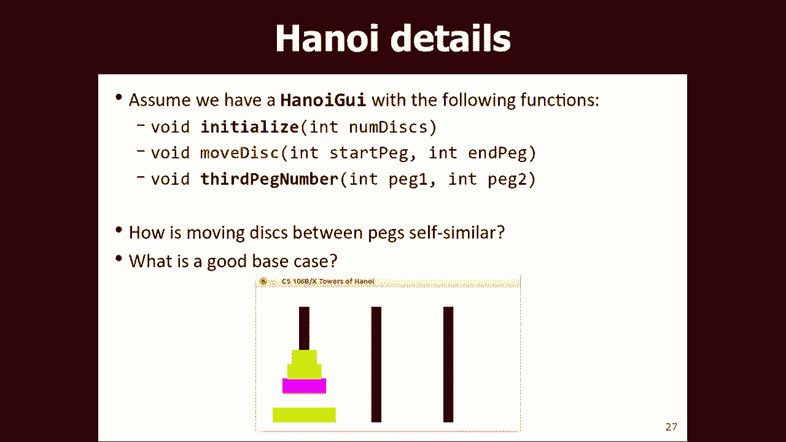
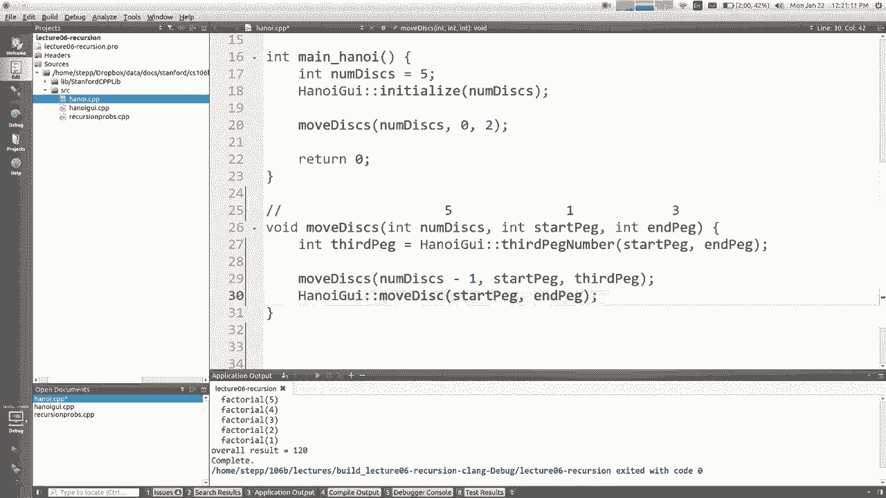
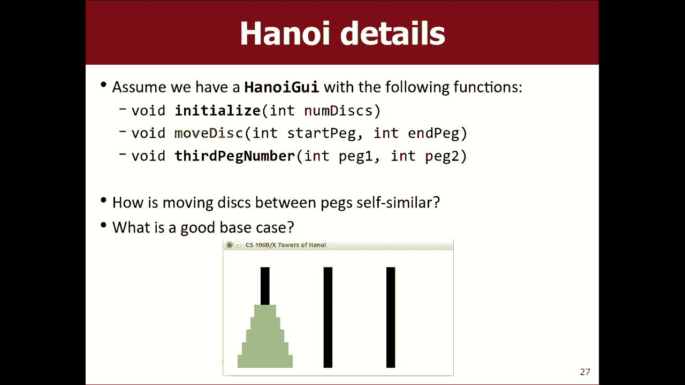

# 【斯坦福大学】CS106B C++中的抽象编程 · 2018年冬（完结·中英字幕·机翻） - P6：【Lecture 06】CS106B Programming Abstractions in C++ Win 2018 - 鬼谷良师 - BV1G7411k7jG

好吧，今天是星期一。我们自由了。我们今天被邀请到这个区域，叫做递归。嗯，让我想想，我提前通知你，我想你本周应该做作业2。我当然想鼓励你和理发师一起工作。如果你没有伴侣，你就在找。

会尽量帮你找到一个离广场很近的品牌叫。找搭档什么的？问问你的部门领导，活跃的费金。我自己，如果你想找搭档，我们很乐意帮你找。我强烈推荐。如果有人能和你谈谈，和你一起工作，这会使事情变得更容易解决。

所以这周，我们要做递归。我想提醒你，这是我们在这段视频中听到的第一个非常棘手的话题。我是说，我觉得所有的材料都很有挑战性和趣味性等等。但是这个。你真的需要学习一种新的程序思考方式的第一个材料吗？

我要说的是，很多学生觉得这很有挑战性。大多数学生需要一段时间去了解，坚持下去。所以我的天，如果你今天离开课堂，离开你的生活。我告诉你的，作为一个聚会的关于。可能，好吧，你可能不是唯一有这种感觉的人。

只是要做大量的练习。我们将成为这方面的一部分，我们将花费所有的时间来讨论这个递归概念。下周大部分时间，我们还将讨论递归的不同应用。所以就好像它不是，它并不总是有意义的。但最终我。你这样想会很舒服的。

我们的节目。所以说了这些，你知道，我认为这是一个必要的，棘手的话题。我认为这是一个特别好的练习话题。自己锻炼他的身体，也许一步一步地解决书上的问题，也许你可以通读这一章。

我在网站的电子日历上贴了一些视频。我不仅会发布我的演讲视频，但我有其他人解释递归的视频，因为有时候我的解释对你来说没有意义，因为你的思维方式或学习方式。来自其他人，来自其他一些导师。

包括斯坦福大学和其他学校。我非常尊敬，钦佩他，我有他们解释递归的视频。所以如果你去看，读，练这些东西，我想你和她在一起的机会会增加。所以无论如何，这是本周的主题。它来自教科书的第七章。

让我们深入研究一下。递归就是用事物本身来描述事物。所以我的意思是你试图解决这个问题，也许你的算法，或者你解决这个问题的过程。包括解决同一问题的更小或更简单的版本。听起来我在说谜语之类的东西。

但像很多算法一样，当你意识到或没有意识到它的时候，就有它的质量。例如，如何在字典中查找单词的算法。算法是你翻到有那个词的页面，然后阅读定义。但有时定义是你不知道会议室的词。那你怎么办？你去查他们。因此。

在字典中查找单词的过程可能涉及到在字典中查找单词。正确的。现在这就带来了一种危险，也许你会一直失控，不停地查单词，不停地查单词，不停地查单词。最终，这个过程。什么时候停下来的。是 啊。是的。

当你查找你想理解的一切的定义时，你知道定义中每个词的意思，那你就不用再查了，对吧？所以在某个时刻，这种自我重复停止了。但这是算法描述的一部分，既有效又优雅。还有很多结构。

当你在编写一些递归的或者类似于它们的代码时，就像硬盘上有文件的目录结构一样。文件持有者包含可以包含文件夹的文件夹。你还可以看到数据之类的东西，比如家谱。你知道有点自我相似。父母和孩子。

孩子可以成为其他孩子的父母等等。科学和自然中也有很多这样的事情，只是，你知道，动物的繁殖模式和云的形成，我们的花椰菜被螺旋状的外壳和各种各样的小东西粘在一起，相同图案的较小出现。

就像自然界中自相似的模式或算法。本周晚些时候。说你可以在重复较小的地方画出图形。同一个模式在其内部的更大引用是非常酷的。可以使用递归的自相似描述来绘制这样的模式。是的，我是说，这是一个概念。

你可以把这个概念应用到编程中。所以我想谈谈一个非编程的例子。第一。如果你有一大碗像M和S这样的糖果怎么办？现在，坦白说，如果我是一个好人，我会从一大堆糖果中长大。我会用糖果做这个。

然后你们就可以吃糖果了。然后大家都喜欢我，但我不是马里恩，我是一个可怕的，无害的。在里面死去的人。我没有给你带任何东西，你自己开始，如果你没有，但让我们谈谈11，40天的午餐时间。假设有人走回印尼。

我们想把人数增加一倍。如果是的话，你知道。然后我们想找乐子。还有。所以，我是说。如果你数一数安曼，你会做什么，然后把他们拉起来。然后无论什么结局在那里都很重要，你就完了，对吧？但我们还是假装去伯克利吧。

所以我们无法计数。我们不知道怎么做。但我们是军团。我们很多人。我们都是。我们所有人。无法计数，伙计们。或许可以结合我们原始的智力力量？来解决这个棘手的问题。那么这和递归有什么关系呢？好。

递归是指当你有一个算法在某种程度上以较小的形式引用它自己。所以，就像画这个图案的算法，你画这个，然后在里面你画这个的小版本，你画这个的小版本，这个想法是一样的，查字典，查其他的单词。

这个问题是不是有一些自相似性的问题？它是M和M的翻倍，类似于其他一些知名人士的翻倍，这是一种思考问题的自相似方式。所以这真的。因为我们很多人。我们假设洞里的杰出人物的数量少于。可以。

如果我们都能讨论并提出一个共同的算法。每个人都将遵循完全相同的规则，尽管算法可以有beef、elphin或其他什么。但是算法涉及到一个，你在做所有的工作。我已经准备好了，我会把新的放进去。

你们每个人都要做少量的工作我们必须一起工作。帮助我们每个人，一点点打来的电话。他把显赫的人数增加了一倍。有点棘手。所以你真的有什么想法。你的建议。好吧，你说的是，每个人都会在凌晨一点起床。然后呢。好吧。

那么，如果我们有一个有趣的球，我们想加倍，然后我们有一个额外的便利设施，我们想用它来加倍，你是说我们每个人都可以遵循从整体上抓取一个的算法。还从大货源里抢了一个。现在我有两只手了。现在，我同意了。

把它放在你的目的地。现在每个人都这么做了。然后，夸张地说。他们基本上是对的。是的，我觉得那很好。就这样。这是一个很好的，像种子的整体方法，对吧？它有正确的心态。就像每个人一样，只是工作的一小部分。

这是一种递归的思维方式，小工人互相帮助，对吧？好吧，随便。我的意思是，我认为这通常是正确的答案。但是。如果我再多做一点呢。小步行街，在你描述这个额外的布尔是倾倒一个地方，然后备用的一个。

我们去把他们在那里。但也许可以减少对问题的限制，比如说我们只有一个碗和无限的供给，以及我们正在投入的任何东西。必须有人进入我们的目标，所以如果我照你说的去做，我拿出一个，把你放进去。

他们会回到我们的碗里，我们要加倍。所以我有点担心，比如，如果有10个人这么做。我不知道在我停下来之前应该有多少人这样做。你知道什么吗？我想你的描述是假设球会空出来，我们会填补另一个洞。

如果你这么做的话那就完全管用了。但我要说的是，没有其他的围棋需要做了这么少的额外想法的工作。在我看来，新版本的。对吧，对吧？干掉你的敌人。带走，供应伙伴。现在还在运作。不想让他回到任何地方，不是吗？

很冷。现在。一半就禁，下一个人，还是让别人轮到自己再犯吧。人们会这么做的。握着我的手，然后你退出2号命令，谢谢你。有人从洞里抢了最后一顿晚餐，他们拿了个汉堡，洞里什么也没留下。

你身边有人拿着两个名人说每个人都退后，现在我们完成了，每个人都做他们的2米和2米，你把洞的数量加倍，把碗里的M和M的数量加倍。完全正确。甚至你，我们都在利用。不要用代码来描述说，如果民意测验有他们。

我认为这是我所看到的正确方法，好像洞是空的或者别的什么。没什么可做的。否则就把他带出去，传下去。等它回来。然后再放两个，这样你就可以了。也许还不太清楚这个问题是如何自我相似的。因为要记住。

递归的整个思想是一个与它自身的另一个版本相似的过程。但你想看到某种方式，你会说。我要加倍他的球，所以我的算法。他出去了。墨西哥煎饼，在我旁边，请你谈谈这个好吗？这和我的走路不一样。

因为这和100分和双倍的足球不一样。等他们说，我现在已经完成了由整个乐队，但我的公司是说，这里是这样，但如果世界上有5个动物，如果这么少，那问题，只有500。我想出去，我有一个完整的。我想。我数不清。

我不知道有几岁，或者你身边有没有人，他们走到外面，一路往下走。你想听什么都行。然后你知道，就好像它在视觉上有税收，被要求加倍玻利瓦尔的人，我不知道怎么翻5倍，但那个人非常乐于助人。

它们的高度是原来的两倍，所以现在我们所关注的双门是球算法中ems数量的两倍。我们正在描述算法。本身。最好的形式部分，几乎就像是一个他们都在运行的函数，他们互相调用函数。做一些工作，你知道。

以身作则是有道理的。无论如何，你可以说约束是人造的。为什么？我只能说，好吧，好吧，如果你能帮我的话。你只需要急切的算法来描述它不需要更大的屏幕。更聪明的人愿意自己做所有的工作，而不是一群不必做的人。

做了你该做的。实际上是很重要的部分。因为喜欢。家从这里开始用一只手，但我想整个晚上，因为我是整个剧院。冷0，没什么好理解的。好长，一个方向。一边喊。我只是回来，把这两种回首放在他们的脚上。

什么也不给同一个人，他们认为，是的，我认为是这样。这是对原始问题的回击，是哪个。所以没用。也许你在担心什么。你拥有它，而其他的地方是某个点，有人提出最初的要求的唯一，而那个人成为一个结果。问题。哦。

什么？好吧，我想这已经不存在了，但我想他们已经检查过了。以及第一笔应收款项，每个人的照片此时此刻。不，好吧，好吧，不管他们开始做什么，他们都想继续走下去，我们就在那里。当欢迎回来的时候。所以我的意思是。

最后锻炼，这是个愚蠢的例子，但我认为这说明了我们在说什么。但让我们看看一些实际的代码。我认为真正的人，加上代码，可能会有助于了解财产计划，就是当你写一个调用自己的函数时。如果你这样做了。

你会得到一个函数，你会发现，我想回到上面，这样你就可以调用你自己的函数了。它又跳了起来。我就是这么说的。有趣的是，递归和循环一样强大，可以做很多事情。所以它们实际上是整个编程语言，叫做函数式编程语言。

他们没有。所有这些函数都可以调用函数。不知怎么的，你可以这样写整个程序。有点有趣。或许你学过函数式编程语言。简单的欲望不是这样一种语言，但那没关系。不管怎样，我们将使用递归和重新调整编程在其他很多。

当然。所以当你写信的时候。递归的。程序和代码。你肯定要担心一些功能。他把你的函数一般化了，但在某个时刻，你必须停止在问题的一部分调用自己。我们必须有这样的逻辑，如果球没有增强，我需要停下来回去。

某种程度上。所以这种停止你自己的情况，通常被称为基本情况。我会告诉你，当我展示具体的例子时，我想会有意义的。但是。但在这种情况下，您的函数不需要调用自己。如果你回答问题的时候已经掌握了信息。复发的病例。

更复杂的病例复查后再打电话给自己。当你写递归函数时。你应该具备的一般哲学是。我会让我的函数多次调用自己。每一个电话都像是一个人在帮助双重需求。从某种意义上说，每个调用都应该是整个工作的一小部分。

并且所有的调用将组合起来完成总的量。所以一个关键的问题是，这个问题和它本身有什么相似之处？对于我来说，得到这个解决方案的其他版本有什么帮助呢？那能帮我做我需要做的事吗？我们来看一个具体的例子。很多递归。

书和例子都是从计算的概念开始的，一个阶乘，它只是从一个到另一个的整数的乘积。这不是，这是一个可怕的，我从1开始，然后乘以慧。对右边最好的冲击，它是一个专有名词。好吧，那不是很有趣。不是很难，但你注意到。

如果你看这个模式。像四个保理是穷国可以看到一个。我想这一天会涨1，2，3，4，你知道的，比如说。5个因素，5乘以4515。保理只有54胜。所以我试着写阶乘函数。我可以利用这种关系。

在我的。那是什么？让我打开。可爱的创造者，我要打开这个文件。我打过电话了。递归专业开始。Cpp在这里有很多不同的功能。但我想写。或者是。我没有。为了它。阶乘。最后，我们刚才说五个阶乘等于五乘以四个阶乘。

对吗？所以你基本上可以在代码中这么说。你可以说，如果我没事，那么你也可以说，及时回来。我的没问题，但那不是一个完整的解决方案。你知道这个解决方案有什么问题吗？怎么了？是 啊。它永远不会结束。

因为阶乘5调用，阶乘。4因子4 3 3 2 1 0 0为负，也有一个阴性。它只是盘旋进入。你可以打电话，这最终会崩溃的。你的程序叫做堆栈溢出，因为你的函数有很多内存。最终会有太多的溢出。你的记忆。

你可能是。听说有一个网站叫做overflow，这是一个关于递归函数调用太多的概念的笑话。所以这就是我们需要一个基本案例的地方。我们必须告诉算法在某个时候停止这种自调用。

所以这个想法是大多数递归代码都有某种，如果你说，如果有的话。否则。一些东西，而这些家伙的区别在于，你有点像通常所说的基本情况。什么叫递归脸？基本情况是，我不需要打电话给我自己，因为这个问题很简单。

你只要回答就行了。所以你想问自己的问题是，什么数字很容易计算阶乘。我听到1和0。这些数字的工厂压力为10，而工厂压力为1。一家工厂要找一根骨头，这样你就可以做一些事情，你知道，如果安妮是0。或者，是1。

那么，返回1。我不需要把简单的东西叫做阶乘。如果你明白的话，我只回答，但对于大于1的数字。这很难，所以我将n-1的结束时间因子称为。所以我想在你脑子里找到这个的简单方法是，如果我叫三的阶乘呢？好吧。

那要做的是它要进入代码的其他部分，对吧？因为三不是0或1，所以这将导致三次返回。两卷，对吧？所以，二的阶乘需要计算它的结果。位于two上的工厂也进入代码的其他部分，它说，返回两倍于1的阶乘。

这就引出了第三个阶乘调用，一个阶乘权。一个。这是基本情况。这就是回归的意义。现在，有一件事想这么做是有麻烦的，嗯，这是什么意思？返回一个返回磨损。好吧，这意味着从两个调用的阶乘返回给打电话给你的人。

所以它会把这个还给你听。所以这东西变成了酒。所以这个工厂，只有两个调用返回两个乘以一。所以这意味着整个电话都回了，对不起，变成了坟墓。然后这个也会返回三次。所以这个返回6来理解。

就像每个呼叫都在等待下一个呼叫结束，这样它就可以返回它的答案。所以整件事就是这样运作的。如果你想看到递归代码，运行一个很好的方法就是在开始处放一个seal语句，然后说。阶乘打印的论文是和加大小加句柄。

只打印参数。刚刚看了函数调用。所以在缅因州。我会说。阶乘。五个。所以。Inf等于这个值，然后我将看到整个结果是如何相等的。好的，这意味着我在这里的文件顶部，它将调用我们写的工厂。如何使用未定义？

我没有听证会的原型，必须有一个。果味的。再试一次。我不清楚，因为上面写的是主沉船。我搞砸了。这是正确的。是的，所以。说阶乘，5因子自身4影响我们的参考阶乘的阶乘。总的结果是120。

所有这些电话都是打给电脑的。总体回答。这个版本比翻版的好吗？你知道，两个都好，只是思维方式不同而已。我只是给你们看，这是一个初步的例子，来理解这个机制。我不是说这个代码比这个品牌好得多。

但是我们今天会有问题的。本周，递归版本可能更容易在非递归中编写。到目前为止关于这个功能的任何问题，关于海外的回归。到目前为止。你能不能总是用一点小恶作剧来代替这个版本？所以基本上，是的。

但这并不意味着真正的版本同样容易写。有时是外观版本，你需要保留一些数据结构有时是递归版本。我们得耍点小把戏来解决这个问题，你总是可以用任何一种方法解决相同的整体问题。

但有些问题用一种方法比另一种方法更容易或更难解决。其他问题。

我们继续走，看看你能到哪里。所以我要跳过这一步。我们写的。所以，是的，你叫工厂，所有维多利亚，三个，叫维多利亚丽都，叫维多利亚一号。然后返回结果，返回两倍的结果，返回三次的结果，回到这里。

哪个返回四次的结果？是什么，后面6号？所以24个这样的调用，我认为学生们有一个很大的误解，可能是当他们看到这些递归调用时。

就像。他们看到这个递归调用是4，然后返回。ami 1的四次阶乘。阿美。1是3。所以当他们看到递归调用时，他们会去，好的，所以它会再次回到顶部。当你给自己打电话的时候，你会回到顶端。那种骑行。

但它遗漏了一些重要的东西。并不是说你的功能回到了顶端。就是你生成了一个新的函数副本。那只小狗在上面吗？这是一个非常重要的区别，在某些情况下。所以，这就是我用这些画这幅画的原因，像不同导演版本的功能期。

因为发生的事情并不仅仅是话题，等待其他版本完成。不管我用的是哪个版本，每个调用都有自己的身份。

所以不管怎样，如果这没什么意义的话，我想更多的例子会有帮助。嗯，让我们。我想，滚开。所以我想再举一个例子。给你，好的。我把这些给代码看，这是一种奇怪的代码。事实上，这一次，它使很少人回复，称自己为神秘。

随着它的发展。有时也是。那它有什么作用呢？我给你一点时间看看，然后我们一起讨论。如果你解决不了，好吧。在他的心里。随便和你的朋友谈谈。好吧，我知道不是每个人都完成了这项工作。我只是，我有。

有人认为他们知道答案是什么，一些你想勇敢分享的答案，你认为呢？看。3，3，4，4，80。我想那是对的。我想通过不同的电话，以帮助确保人们知道，希望将理解为什么这可能是正确的答案。

所以如果你看看最初的电话。这就是密码。所以，是348，对吧。所以不去咖啡馆，但如果是假的，不少于10个。所以它去了另一个。所以它两次称之为神秘。它称之为神秘在结束，除以10和在结束，蒙大拿，除以10。

除了最后一片沙漠，其他都是吗？正确的？那是34分，马丁只是最后一个8分。所以我们从8号线下34号线。所以这是两个从这里打来的电话。我专注于第一个电话。第一。所以第一个是34号。打电话来。也不少于10。

对吧。又是这样，去了另一个。把数字的两部分分开，我想这是四个右边的三部分。所以最后，是要用3，大厅里是要用4，对吧？所以让我们想想这些是怎么做的。所以现在三个高。他高兴地说，如果是在基本情况下。

他的部分，如果返回。钢琴和10乘3加3等于33。正确的。所以这个电话返回33。计算机代表两种形式。我不知道他在这方面是什么，这些事情都回哪里去了？他们一路跳到我面前。不，他们回到了之前打给他们的电话。

所以这个。三十三。就在这里变成了我的老鼠依偎着的哈哈。你知道的，这44变成了这个，在我的房子里盘旋。所以。我要退出这两个电话。情况是a是33，B是44。好吧，现在这家伙的任务是返回100乘以33加44。

正确的。所以这个返回33443，3，4，4。你注意到你过了34关，得到了3，3，4，4。正确的。所以有时候你可以发现一个模式，或者到底发生了什么。也许你找到了模式。所以，这个电话。计算3344的结果。

结果会去哪里？那个号码怎么了？是 啊。它变成了原版。打电话来。伪装ais 3344。现在我们要追查b的另一个电话，b是他的，monte是8。所以我们要计算出年龄的奥秘才能得到他的ab。

所以这里会弹出一个电话，8，小于10，所以它返回10乘以8加8，等于88。所以现在我可以回去听了。所以是3，3，4，4。B是80岁。所以现在我应该取一百次a，也就是3，3，4，4，0，0加。

所以总的结果是3，3，4，4，8，8。所以这看起来很奇怪。口吃的数字图像，所以有两个每个。所以这就是神秘的功能，真的。无论如何。有点像是大脑颠倒了，在所有这些代码中进行跟踪可能没有意义。

但这就是代码的执行方式。关于这个函数，关于这个，关于我们走过的路，你有问题吗？如果你不这样做，那就没有意义。下载今天电子版的zip文件。这个功能在里面。去编辑代码并放置一些seal语句。

然后自己运行它并观察它，看看会发生什么。而且，你知道，这段代码的执行对你来说更有意义。但是，在绘制这些图表的地方，您可以找出有帮助的不同调用。让我们看看能否一起解决另一个问题。

我想写一个名为calendar的函数。我想看看是不是奇怪，前后一样。所以如果你把绳子倒过来，你会有同样的东西吗？当然了。我们可以用一点，你可以移动所有的角色，看这些东西，如果你想这样想问题。

这是有帮助的。你也许能帮我们找到独处的方法，对吧？但我不想用循环来写，用递归来写。所以。我们不仅仅要学习递归。但我们可以问自己一些标准问题。我喜欢思考的事情。我们的。这个问题还有什么相似之处？

怎么问我的银幕，pgm，类似的演技，是否还有其他的东西。这是我们能想到的问题。我们可以考虑的另一个问题是，如果我有一大堆工人的话。每个工人都在做少量的工作。每个人的工作单位是什么。并与工作集体起来。

解决整体问题。这是另一种思考的方式。你能想到的第三件事，我谈到了这些案子，还有第一件。每一个排练问题都有基本情况。这是问题的简单版本。有哪些简单的流可以确定它们是否是回文？我们可以考虑一下。

这些都是有用的，我们应该扪心自问，因为我们正试图想出一个算法。如果你想用循环来解决这个问题。我的意思是，你们能做的就是把街道倒过来，然后你们可以平等地付出代价。但我们不能这么做。

我们可以查看现有的屏幕来找出问题所在。我们可以搬走，你怎么办？使用。一般来说。对。所以，是的。从第一个字母和第一个字母开始，然后继续移动。最后的第二封信是第三封给你看的。看看整个奇怪的事情。

如果你没有看到任何与右翼相反的问题，那就是右翼的一种循环版本。那么，我该如何选择骰子来计算出每个国家可以做的一点工作，如你刚才所述。这里的工作单位是什么？你说什么？

所以如果我想做赛车的话。你这样说，我可以让第一个工人看看这些边上的字母，看看它们是不是现场。然后下一个工人，他们做了什么？所以下一个工人会看a和a，对吧？好吧，然后下一个工人会在某个点上看。

你在这里完成了。所以。我们总是在谈论自我相似，对吧？如果我要做这项工作的一小部分，我要看看他的R。和这里。怎么样，你能用他的回文来形容回文吗？比如，这是怎么回事？就像我检查边缘一样。

然后其他人做类似的事情。我可以查一下除了赛车以外的其他词是否是笔迹。你知道我在说什么。比如，我还想知道它是不是回文？是 啊。他的车，是的，就像，如果我能告诉你。我是回文的先知。我知道他们的一切。

我知道他们向后看，只是说我不向前看。我知道。汽车。你这么问有多不对吗？我可以告诉你。如果你这样做，你的工作就是知道赛车是否是一个回文。你可以做很多，因为你可以说，好吧，我会检查R和R。这些都很好，你。

甲骨文告诉我，那是一辆车是回文。所以这两个事实加在一起，我有我的答案，对吧？这就是递归的思维过程。你没有神谕，但你的下一个电话是要和他的朋友们一起去工作。总的来说，这将回答这个难题。

即这个词的其余部分是否是回文。所以我想我们可以用你给我的想法来写。所以如果我们去找creator，我有一个函数hitter，is。在这里做手工。现在，我对此非常悲观。我只是说，回来。错，那是不对的。

所以。你说，看最后一封信的第一个字母。所以，好吧，我可以帮你。第一个。字母是S括号0，它的类型与强度有关，因为它只是一个字符。最后一封信。最后，他是支架。赖特庄园长度-1。可以。

所以我想知道他们是一样的。所以我想，你知道，每当你返回一个布尔值时，你就会有这样的想法，我应该早点停下来，还是应该继续，如果我知道我的字母不同，我其实不需要问关于这辆车的事情，对吧？因为如果你要求比赛。

仅仅因为这些都是正题，这样做是行不通的。所以我想你可以说，比如，你知道，如果第一个不等于最后一个，那么整个词不可能是一英镑的回报。错误的权利，但如果他们是平等的。我需要知道这个词的其余部分。所以，就像。

你知道，我需要把赛车变成一辆车，我也需要。一、 我该如何让自己变得非常。我把字符的底片切下来。我想我听到你们这么说了，所以我会把弦中间的等号当作潜艇从一开始。然后传递长度和字符数，这是它们的原始长度。

-2个字符，对吗？所以长度是-2。中间。所以现在我只想知道，是回文。中间。这是我的递归调用。正确的。这是算法的一般思想，这是我到目前为止写的两个问题，但这主要是思想。到目前为止，开局不错。正确的。所以。

嗯，让我来。让我稍微改写一下这段代码。因为我想。把所有的事情都当作一个测试来考虑是很有帮助的。真的，我想知道第一个和最后一个是一样的。中间是回文。所以如果你允许的话，我想对这些代码稍作修改。

我想说以下几点。商场，我只是想，先把这三个都申报一下。可以。现在我想说。我想知道第一个是否等于最后一个。我也想知道，其他的也是。回文。这是有道理的。回来了，真的。回答错误，就像，像，好吧。

你们一起推测试，对吧？我做了一些肯定的，肯定的测试，也许是。同样的，虽然，是的。好吧，但这段代码有一个问题，就是遗漏了一些我认为在递归中很重要的东西。这里面少了什么。如果你成功了。一般提示。

如果是递归周，问个问题。不管是什么问题，如果你只是想，基本上，你可能是对的。或者如果你没有，那可能就很近了。是的，基本上是非常重要的，因为没有基站，递归永远不会停止。在这种情况下，我的意思是。

代码会尝试做一些事情，但在某个时候没有东西，把两个字母拼起来。我想如果屏幕上出现非法索引会崩溃，或者类似的事情。所以让我们想想这些案子。通常是我们写的代码。所有这些都是反复出现的。所以说真的。

我们应该说，好吧，如果有的话，那我甚至不需要做我写的所有东西。如果屏幕很容易回答的问题，那么所有的数据库情况，但如果它不容易，那么我会做所有这些工作。点击这里。太好了，什么。

会是一根很容易决定是不是一磅房间的绳子。他们打过电话。当你说是的时候。只是一封信。他确实不清楚怎么处理这根绳子。但是，基本上，我认为这里的测试是，如果你逆转，它就会改变。这个字符串只有一个字母。很长。

答案是不，不会变的，对吧？如果不是的话。根据定义，他只是一个。这是日历。正确的。实际上，是一个空字符串。也不清楚该怎么办。但是让我们把空字符串定义为一磅，如果它是空的，或者是一个字母。

我会写小于或等于一的。它不会随着反转而改变，我称之为一磅。否则，我将进入这个递归的情况。我会把中间所有的字母，第一个字母和最后一个字母都切掉。中间是回文。我会回来的。是的。可以。我们试试吧。

如果我去我的主管道，我有一些测试在这里找到它。如果你再问一次，如果你想看这部作品，但你不太了解这里的流程，我认为，最好的方式，开始对美国，他们看到了。是回文。特许经营人，加上或少于s。处理类似的事情。

当你运行它的时候，它会产生很多输出。但是。它会说，是回文，夫人，它叫ada，它叫d赛车，它叫，它叫。踏上，没有宠物，瀑布，回文，额外的爪哇瀑布，赛车，瀑布，双机器人。这对调侃有用。在这里。

它在这里的操作系统上很有用，但后来它变成了为什么要在中间抢劫，蜜蜂赢了不匹配，所以它停下来了。如果你想看到他，你可以在输出中看到这些调用，这可能有助于看到进程的进展。可以。稍微改进一下这个代码。如果你。

如果你曾经拥有，如果返回真，否则，返回。假的，你可以把它缩短到，基本上，只需返回早期测试的结果，您可以看到return是否该测试为真。这是一种简短的表达方式。这是一个更好的版本。艾伦，我在查。

我想再做一个。我们还有5到6分钟。我想我们能完成这件事。

这是一对夫妇。啊哈。跳过。这个。一个很简单，我今天不打算做。它叫河内塔。这是a。在他们用这些做小玩具之前，我们已经看到了一个问题。你可以。放在你的桌子上，或者别的什么。作为一部分，你可以把这周带到地上。

比如，坐在头上，你可以看到它。这只不过是换了一只。但是有一个规则，你不能把一个大的磁盘放在一个小的上面。第一个没问题，我想第二个没问题，但是所有人都去度假，我想我们得说。然后我有一个小的。

你的手臂自由和关闭，我不能放一个大家伙。想象一下，如果我们要递归地求解河内的塔，我要传递有多少磁盘的参数。从0 1或2开始他们的目标是什么？我要你把它们移到哪一页？可能不是现在的情况。启动。所以。我玩。

这是更容易解决一个诅咒简单地比有人问，就像我总是做这两种方式。是的，但我想是这个。以后再试试，用一个循环。我想你会发现问题出在哪里是令人沮丧的。那我该怎么写呢？好。我有点黏糊糊的。

所以我们可以让我画出来。还有一个使用cli的方法叫做从一台电脑到另一台电脑的谦虚单，我想让我们的算法调用我有很多次要移动的东西。所有这些都是对的，为什么你不坐在我的词隐式删除从开始到任何过程。

那就是白痴。现在，好吧，如果你要递归地解决这个问题，那就意味着。你得考虑单身。如果我离开这里，离开这一页。为了这个。那过去和其他客人有什么相似之处？另一种圆盘运动。知道我在说什么吗，比如。

如何将5个磁盘移到一个磁头上？另一个在什么地方移动？有点棘手，对吧？我想你可以用另一种方式来思考这个问题。他的，我用这种语言来形容一个晚上什么的。你要通知什么。你得去玩，它愿意出来。

但他们不愿意做所有的事。一些被捕的人。我该怎么做？你知道什么样的心态。是 啊。所以你可以。拿第一个。上。是 啊。可以。所以，我想。你有一整套正确的行动，但我认为这将开始导致一个答案。

我认为递归有一个优点。他辩解不止。所以我找到了这个。我一下子就有了这个功能。但我没有功能。我当时5岁，因为那太好了。但我被要求快点。想象一下你一次上升到4。传记，4和移动，功能。

这个功能是如何解决我搬家的任务的？5个？你怎么向我转达？如果你说到点子上。第二件事。在生日那天。受伤了。当然，我没有一个函数是4，我有。好吧，她陷进去了。什么。如果递归是神奇的呢？递归是神奇的。

那会很有趣的。

我只有一两分钟的生命，我不知道我能不能公正地对待这件事。但是。我们试试吧。我要试试。所以，我被感动了。如果我要搬家的话。就像所有正确的价值观来帮助我们理解。如果我把五个磁盘从第一页移到第三页。

一件可能有用的事情是，我想要的是不是其他猪钉的数量。所以写了一个叫河内的助手。第三个标签号，如果你通过，开始，标签和结束标签。就像我三分之一的第一次，它会回到，或者别的什么。你知道我的意思。它。

它只是帮助我，就像我不必写一堆细胞是什么，另一个是什么。如果我有可以移动的魔法功能。四。这个过程看起来像，移动我的磁盘数量的桌子，-1。把他们从我的起薪中调走是暂时的。

我不想结束的地方，把它们从开始标记移到第三个。在那之后，我会做我该做的工作。

所有的，除了我的。会在这里，但我可以用我的，那是我唯一的线路，目的地。

所以，我会的。告诉那家伙。搬一张桌子。从起始页开始。到最后。这是我工作的一部分。

所以现在，在那之后。我有我的人要做，还有其他的。现在它的意思是，和所有其他的。

所以我要说。请递归地移动其余的光盘。第三钉。到最后。这有道理吗？我知道，我知道该走了。有一件事很重要，那就是缺失，对吧。少了什么。他告诉你，他的案子总是正确的答案。基本情况是什么？移动多少盘比较容易。

一个。你们真可爱。斯坦福，你还不够懒。搬桌子更容易。如果磁盘数为0长，请不要另谋高就。做这个。基本情况是你什么都不用做。所以我知道该走了，但我认为这是值得的。如果是密码。价格。

