# 课程06：递归 🌀

在本节课中，我们将要学习编程中的一个核心概念——递归。这是一种通过函数调用自身来解决问题的方法。我们将从基本概念入手，通过多个例子来理解递归的工作原理、如何编写递归函数以及需要注意的关键点。

---

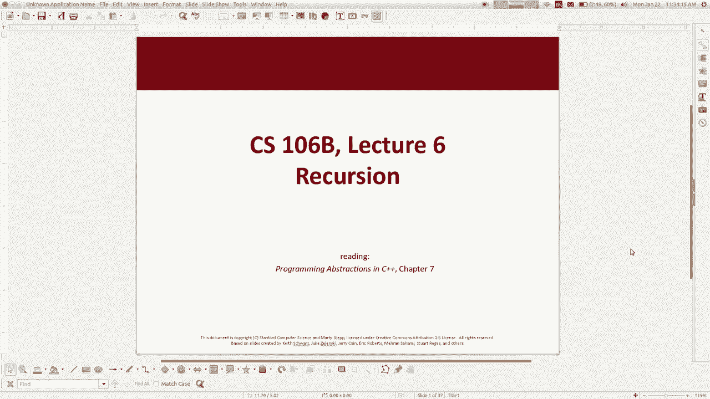

## 概述

递归是一种用事物自身来描述事物的思想。在编程中，这意味着一个函数可以通过调用自身来解决更小或更简单的子问题。理解递归需要掌握两个关键部分：**递归情况**（函数调用自身）和**基本情况**（函数停止调用自身，直接返回结果）。本节课我们将通过具体的编程示例来探索这一概念。

---

## 什么是递归？

递归的核心思想是自我引用。一个过程或算法在其定义中包含了解决同一问题的更小版本。

例如，在字典中查找单词的算法：你翻到那个词所在的页面并阅读定义。如果定义中包含你不认识的词，你就需要再去查找那些词。因此，“在字典中查找单词”这个过程，本身就包含了“在字典中查找（其他）单词”这个步骤。

自然界和计算机科学中有许多自相似的结构，例如文件夹目录、家谱、分形图案等。递归编程就是利用这种自相似性来解决问题。

---

## 一个非编程的例子：分享糖果

假设我们有一大碗糖果（比如M&M‘s），并且我们想在不直接数数的情况下，将碗中糖果的数量“翻倍”。我们有一群人，每个人都可以遵循一个简单的规则来协作完成这个任务。

以下是每个人可以遵循的算法：
1.  如果碗是空的，什么也不做。
2.  否则，从碗中取出**一颗**糖果。
3.  将这颗糖果传递给下一个人，并请他帮忙“翻倍”。
4.  当糖果被传回时，你会得到两颗糖果。
5.  将这两颗糖果都放入目标容器中。

这个过程中，每个人都执行了少量工作（取一颗糖，传递请求，放回两颗糖），并且通过互相调用（请求他人“翻倍”）共同完成了整体任务。这就是递归思维：将一个大问题分解为许多相同的小问题，每个小问题都由一个相同的、更简单的过程来处理，并最终组合出答案。其中，“碗空”就是停止继续调用的**基本情况**。

---

## 编程中的递归：阶乘函数

上一节我们介绍了递归的思维模式，本节中我们来看看如何在代码中实现递归。一个经典的入门例子是计算阶乘。

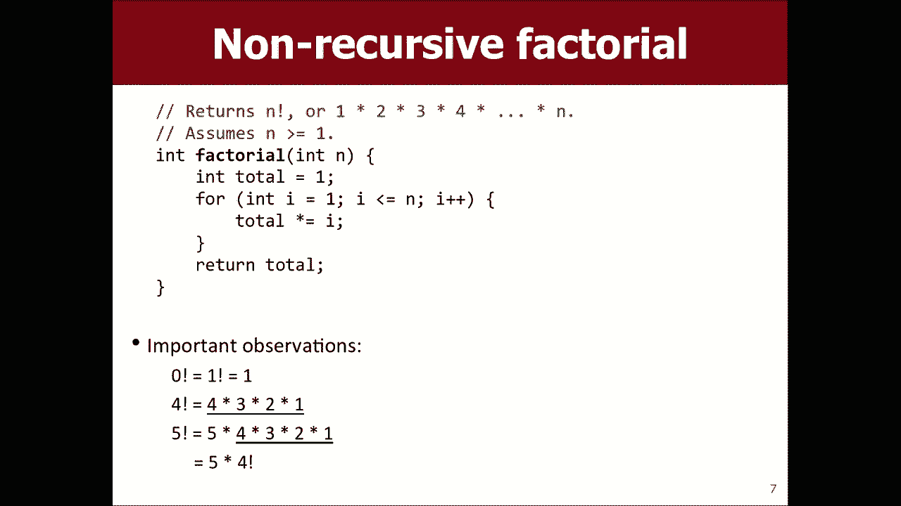

阶乘的数学定义是：`n! = n * (n-1) * ... * 1`。例如，`5! = 5*4*3*2*1 = 120`。我们注意到一个关键关系：`n! = n * (n-1)!`。这正是递归所需要的自相似性：要计算`n`的阶乘，可以先计算`n-1`的阶乘。

让我们尝试编写这个函数：

```cpp
int factorial(int n) {
    return n * factorial(n - 1); // 递归调用
}
```

这段代码有一个严重的问题：它永远不会停止。调用`factorial(5)`会调用`factorial(4)`，接着调用`factorial(3)`，如此下去，没有尽头，最终会导致程序因“栈溢出”而崩溃。

因此，我们需要一个**基本情况**来终止递归。对于阶乘，最简单的情况是`0! = 1`和`1! = 1`。

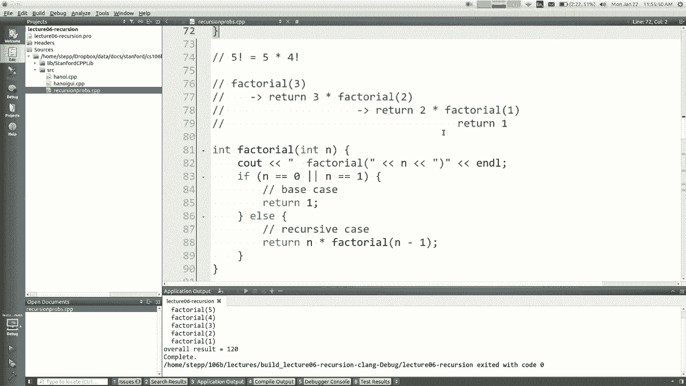

以下是修正后的递归阶乘函数：

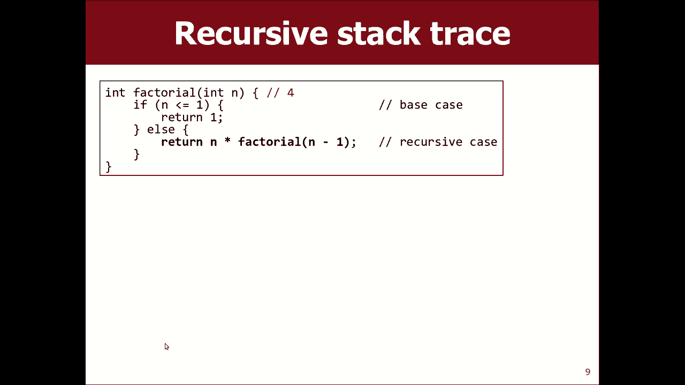

```cpp
int factorial(int n) {
    if (n == 0 || n == 1) { // 基本情况
        return 1;
    } else {                // 递归情况
        return n * factorial(n - 1);
    }
}
```

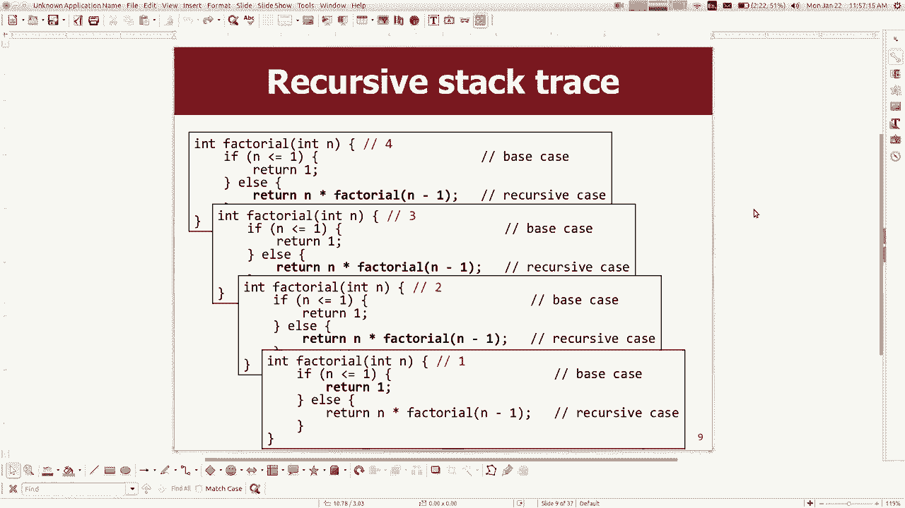

**执行过程解析**：
当我们调用`factorial(3)`时：
1.  `n=3`，不是0或1，进入`else`分支，计算`3 * factorial(2)`。但需要先得到`factorial(2)`的结果。
2.  调用`factorial(2)`。`n=2`，进入`else`分支，计算`2 * factorial(1)`。需要先得到`factorial(1)`的结果。
3.  调用`factorial(1)`。`n=1`，满足基本情况，直接返回`1`。
4.  `factorial(2)`调用收到返回值`1`，计算`2 * 1 = 2`，并返回`2`。
5.  `factorial(3)`调用收到返回值`2`，计算`3 * 2 = 6`，并返回`6`。

每个函数调用都会等待其内部的递归调用返回后，才能计算并返回自己的结果。理解函数调用会创建独立的“副本”并拥有自己的变量空间，这一点非常重要。

---

## 深入递归：一个“神秘”的函数

为了更深入地理解递归的执行流程，我们分析下面这个函数。它接收一个整数，并返回一个“奇怪”的结果。

```cpp
int mystery(int n) {
    if (n < 10) {
        return (10 * n) + n;
    } else {
        int a = mystery(n / 10);
        int b = mystery(n % 10);
        return (100 * a) + b;
    }
}
```

让我们追踪`mystery(348)`的执行：
1.  `n=348`，不小于10，进入`else`分支。
    *   `a = mystery(34)` （因为 `348 / 10 = 34`）
    *   `b = mystery(8)`  （因为 `348 % 10 = 8`）
2.  先计算`a = mystery(34)`：
    *   `n=34`，不小于10，进入`else`分支。
        *   `a1 = mystery(3)` （`34 / 10 = 3`）
        *   `b1 = mystery(4)` （`34 % 10 = 4`）
    *   计算`a1 = mystery(3)`：`n=3<10`，返回 `10*3 + 3 = 33`。
    *   计算`b1 = mystery(4)`：`n=4<10`，返回 `10*4 + 4 = 44`。
    *   `mystery(34)` 返回 `100 * 33 + 44 = 3344`。所以 `a = 3344`。
3.  再计算`b = mystery(8)`：
    *   `n=8<10`，返回 `10*8 + 8 = 88`。所以 `b = 88`。
4.  最后，最初的`mystery(348)`返回 `100 * 3344 + 88 = 334488`。

这个函数的效果是将每个数字“复制”了一遍（3变成33，4变成44，8变成88），然后按原顺序拼接。通过追踪调用，你可以清晰地看到递归如何分解问题以及结果如何组合。

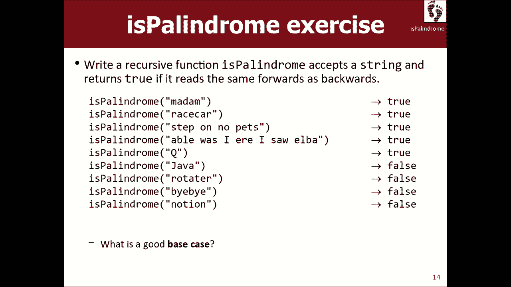

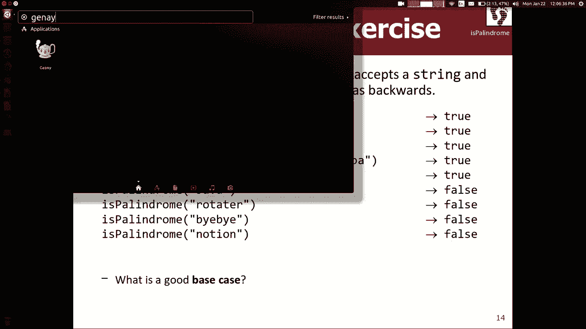

---

## 递归实战：判断回文串

上一节我们分析了现有递归函数的执行，本节中我们来动手编写一个递归函数：判断一个字符串是否是回文（正读反读都一样的字符串，如 “racecar”）。

递归思路：
1.  **自相似性**：一个字符串是回文，如果它的**首尾字符相同**，并且**去掉首尾字符后的子串**也是回文。
2.  **基本情况**：非常短（长度<=1）的字符串自然是回文。
3.  **工作单元**：每个递归调用只负责比较当前字符串的首尾字符，剩余部分交给下一次递归调用。

以下是实现代码：

```cpp
bool isPalindrome(string s) {
    // 基本情况：长度<=1的字符串是回文
    if (s.length() <= 1) {
        return true;
    }
    // 工作单元：比较首尾字符
    char first = s[0];
    char last = s[s.length() - 1];
    // 递归情况：如果首尾相同，则检查去掉首尾后的子串
    if (first == last) {
        string middle = s.substr(1, s.length() - 2);
        return isPalindrome(middle); // 递归调用
    } else {
        return false; // 首尾不同，肯定不是回文
    }
}
```

**代码优化**：可以将多个判断合并，使代码更简洁。
```cpp
bool isPalindrome(string s) {
    if (s.length() <= 1) {
        return true;
    }
    return (s[0] == s[s.length() - 1]) && isPalindrome(s.substr(1, s.length() - 2));
}
```
这个版本直接返回比较结果与递归结果的逻辑与（`&&`）。如果首尾不同，表达式短路，直接返回`false`。

---

## 递归的经典难题：汉诺塔

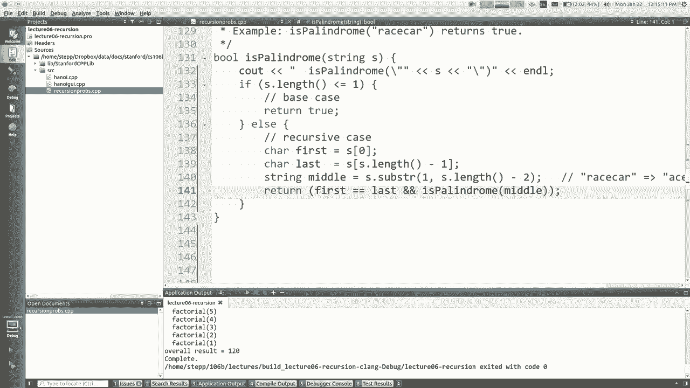

最后，我们来看一个著名的递归问题——汉诺塔。问题描述：有三根柱子，其中一根柱子上有N个从小到大的圆盘。目标是将所有圆盘移动到另一根柱子上，规则是：一次只能移动一个圆盘，且大盘不能放在小盘上。

递归解决方案的思维过程：
1.  **自相似性**：要将N个盘子从“起始柱”移到“目标柱”，可以看作三步：
    *   将上面 **N-1** 个盘子从“起始柱”移到“辅助柱”（这是一个更小的同类问题）。
    *   将最大的第N个盘子从“起始柱”直接移到“目标柱”（这是简单的一步）。
    *   再将那 **N-1** 个盘子从“辅助柱”移到“目标柱”（这又是一个更小的同类问题）。
2.  **基本情况**：当只需要移动0个或1个盘子时，问题非常简单（直接移动或不需移动）。

以下是递归函数框架：

```cpp
void moveTower(int disks, string start, string end, string temp) {
    if (disks == 0) { // 基本情况：没有盘子需要移动
        return;
    }
    // 递归情况
    // 1. 将上面 disks-1 个盘子从 start 移到 temp，使用 end 作为临时柱子
    moveTower(disks - 1, start, temp, end);

    // 2. 移动最大的盘子（第 disks 个）从 start 到 end
    cout << "Move disk from " << start << " to " << end << endl;

    // 3. 将 disks-1 个盘子从 temp 移到 end，使用 start 作为临时柱子
    moveTower(disks - 1, temp, end, start);
}
```
这个算法完美地展示了递归的“分而治之”思想：假设我们已有解决`disks-1`层问题的函数（递归的“魔法”），我们就能轻松解决`disks`层的问题。基本情况确保了递归的终止。

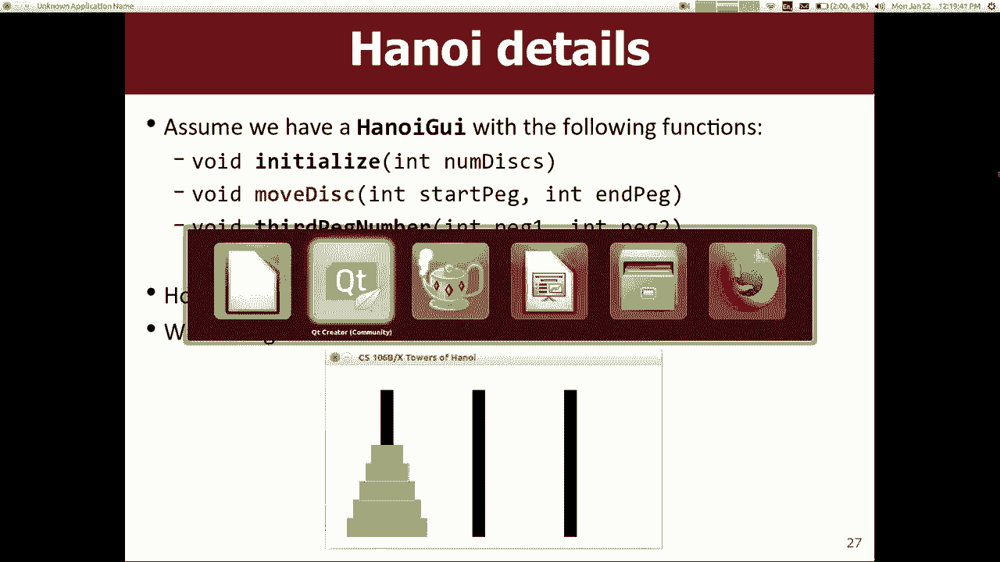

---

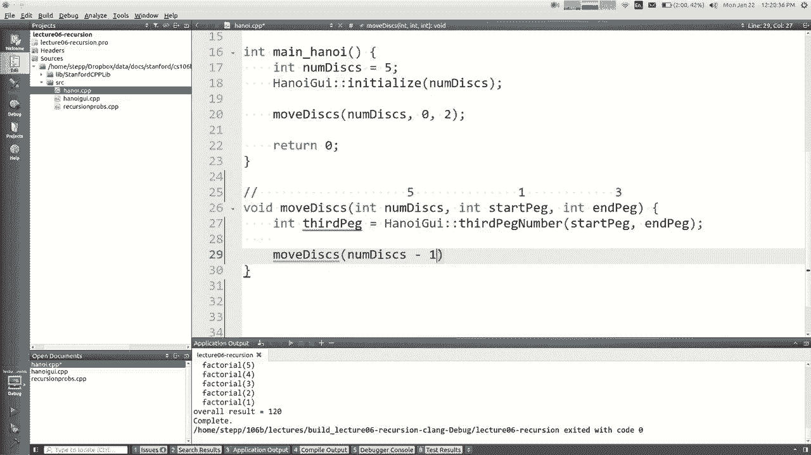


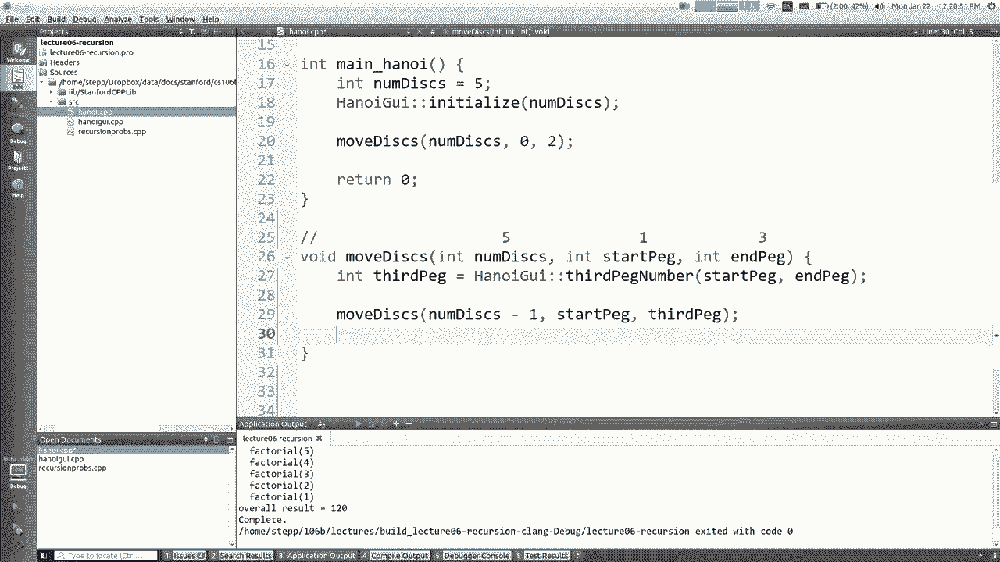

## 总结

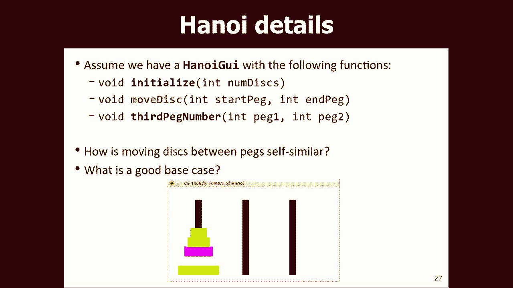

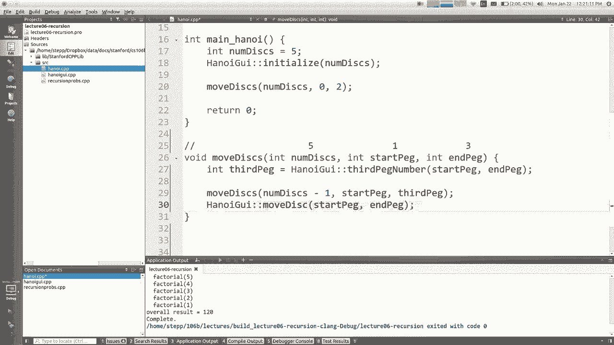

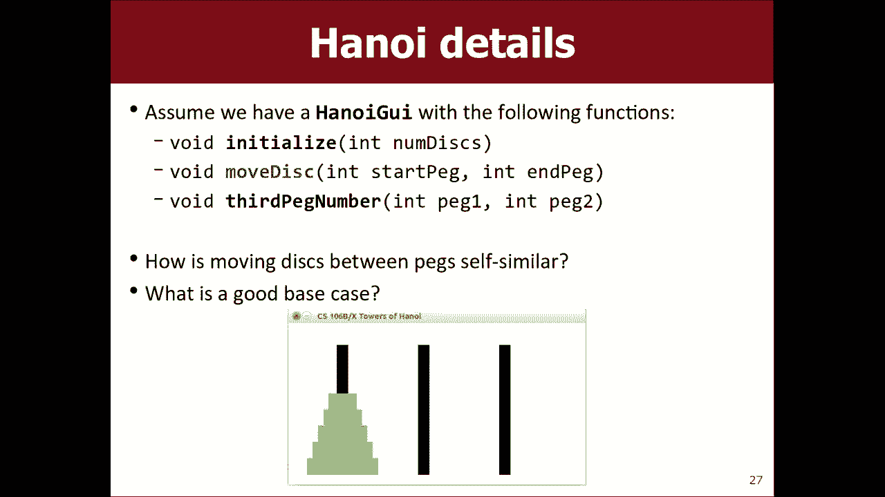

本节课中我们一起学习了递归的核心概念。我们了解到：
*   递归是一种通过函数调用自身来解决问题的方法，关键在于发现问题的**自相似性**。
*   每个递归函数必须包含**基本情况**，以防止无限递归。
*   递归思维通常涉及将大问题分解为更小的、结构相同的子问题，每个递归调用完成一小部分工作。
*   我们通过**阶乘计算**、**字符串回文判断**和**汉诺塔**等例子，实践了如何设计和分析递归函数。

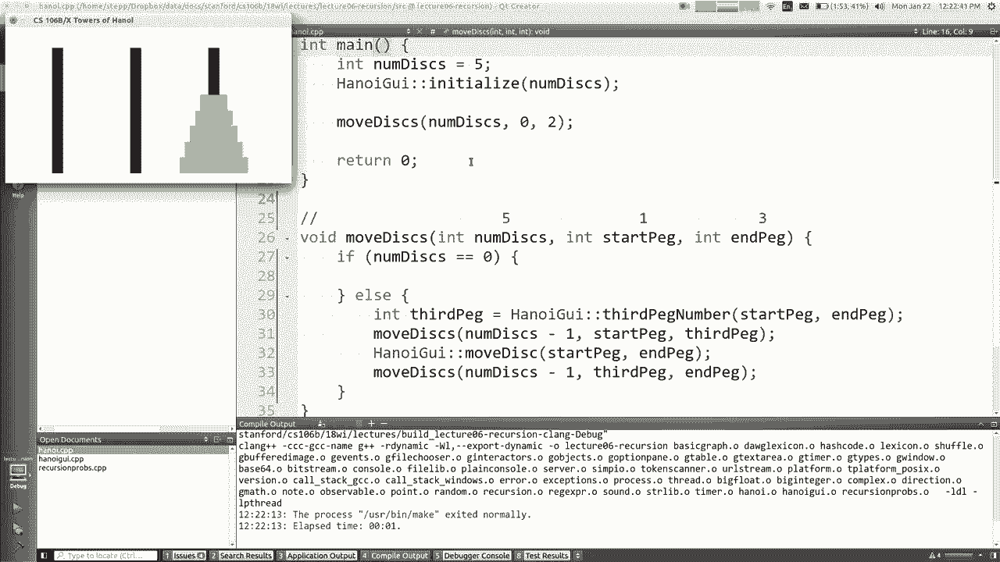

递归是一种强大的编程工具，初学时可能颇具挑战性，但通过持续的练习和追踪代码执行过程，你一定能掌握这种优雅的问题解决方式。