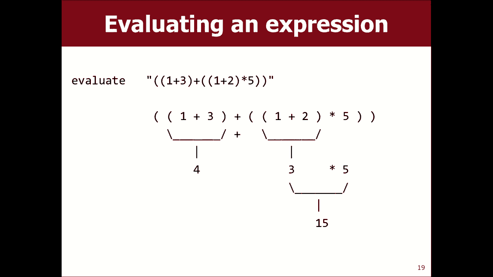

# 【斯坦福大学】CS106B C++中的抽象编程 · 2018年冬（完结·中英字幕·机翻） - P7：【Lecture 07】CS106B Programming Abstractions in C++ Win 2018 - 鬼谷良师 - BV1G7411k7jG

好的，所以我们一直在学习递归，有一些关于，我会说我实际上有几个哦，没关系，我希望我能做到，星期一晴朗，我想重申一点，你知道卡住了还是什么，看起来还不错，这很正常，它会变得更好，所以我想鼓励您。

就像花时间一样，这是一个正确的过程，我们要进行很多递归讲座的原因之一，重申喜欢它可能对您听到其他人有帮助，为我解释递归，您知道您实际上听说过递归，我的班级网页上有一些其他老师更好的视频。

这是朱莉·萨林斯基（Julie szalinski），她是我在斯坦福大学工作的榜样之一，她正在解释递归，这是他在斯图尔特·里吉斯（Stewart Regis）教授的课程，在华盛顿他也是我的导师。

也许他是我见过的最好的老师，这是他在解释递归，他用Java来做，但是概念是，如果在我解释时听不懂的话，可能还是一样，他们以一种对您有意义的方式对其进行解释，之后您的部分也将。

可能会以本周在您的部分中适合您的方式进行解释，听不同的声音可能会递归阅读一些书本内容，也许会练习一些您知道的问题，尽您所能来尝试建立那些，递归肌肉有老笑话写这个问题，递归是为了理解递归，您必须先，明白。

你知道吗，你见过我吗，不确定我是否可以上网，但是您是否看到过，等待着小熊维尼，这不是亲爱的，你在吃递归，像是同一部漫画中的小漫画，无论如何我还是喜欢，顺便说一句，对于那些最终有一天要教书的人。

千万不要使用Google ，您演讲中的图像搜索不执行我刚刚做的事情，因为，我保证您搜索的几乎所有色情内容，我在一次演讲中发生了这种事，当时我在寻找一些东西， ，我对我有些色情，是的。

我们今天要继续进行更多递归，教你一些我认为特别酷的方面，递归就是使用递归绘制图形时，叫做分形，所以让我们做一个分形是一个自相似的数学。

等式或集，您通常可以将其绘制为循环图形模式，因此，然后看到具有相同图形较小版本的图形，基本上，如果您看一下这些图，这些是，分形，你可以freakin分裂成另外两棵树，你可以画出你想出，模式。

您会找到具有相同模式相似版本的方法，一遍又一遍，分形很酷，如果你看着我不知道你是否，可以看到那边的Coach雪花动画小东西，而且您知道模式越自相似，就越复杂，您插入的副本有时很酷。

具体取决于您的操作方式，分形的可视化有时您可以放大和缩小， ，它会显示它几乎就像您可以无限放大一样，因为它可以，无限地制作自己的更多层，非常整洁，所以分形很有趣这里有一些特定的分形。

流行的sierpinski三角形是Triforce，它越来越小，其他三角形里面的三角形我要让你将其编码为作业，问题是科克雪花在那里，三角形的边缘伸出三角形的三角形，然后，开始形成雪花形状。

还有娜娜洞穴套装，圈子很少，圈子与复杂域有关，数字和东西，但无论如何，可爱的小图案非常酷，那是底部，一个上面有颜色的颜色，但是颜色是独立的，你可以画任何，如果您愿意，可以选择黑白或彩色其中的其他颜色。

分形发现它实际上是自然发生的，很多自然，现象具有这种反复出现的视觉模式，然后非常酷，我不会花很多时间在上面，但这不只是一些虚假的。

计算机科学的东西，如果您愿意，您可以在自然界中看到它，分形的程序通常您要做的是编写一个函数，我的意思是，递归权，我们将使用调用自身的递归函数，通常你要做的是传递某种参数，关于在哪里绘制并帮助人们绘制它。

因为在不同的地方，打电话给您可能会绘制同一事物的更大或更小的版本，通常通过分形或，取决于您的书写方式，它可能是零级或最小的，最简单的一级就像一级，然后二级可能是多次出现，继续前进，好吧。

我们将看看如何在，现在，如果我们要画东西，我们必须知道如何画东西，我是，在本课程中，大部分时间对在图形上做很多工作都不感兴趣，我们解决的或有关数据文件，字符串和集合以及Max和。

 Q和类似这样的东西不是图形密集型的，当然，要说的方式是在动画球和类似的东西，这个，但是仅仅为了这种材料，我们想做一点绘图，所以，这是您可以使用的几个函数我们的库中有一个。

斯坦福图书馆称为G窗口图形窗口我想我认为它们是，不言自明地传递坐标，它会画一条线，在这些点和坐标系库之间，因此只需使用这些，简单的功能我想我们可以做所有需要做的事情。

在屏幕上画东西是正方形图案的一个例子，的正方形，所以这是我的问题，我基本上完成了，这里的代码将绘制此图，但想法是您绘制一个正方形， ，然后在其四个角绘制较小的正方形，所以这就是为什么，在我的代码中。

我实际上是在进行彩排电话，这四个电话是，要画四个不同的小方块，我有蓝色的线，上面的蓝线是画一种，大广场，我的问题是，蓝线在哪里，函数在右上角的图片中产生输出，因为，取决于您将代码行放在何处。

它实际上会更改数字，会看起来像这样，以便理解问题，我是否应该将蓝线放入，放置DVD或II，先看一秒钟，然后我打电话给某人，回答您是否愿意与您的好友交谈一分钟，好吧，让我们比较第二个um的音符。

因为它们有一个，我应该将蓝线位置放在哪里的答案，答案可能是正确的，你为什么认为它属于那里，左上角在右下角，我的大方盘放在它们的顶部，表示需要我在其中之后晚于左上方和下方绘制。

正确的是前两个电话人口将流向X＆Y电话， ，右下角将变为正数，因此请在下面绘制第一个，然后在它们上面画一个大的我，然后在左边画右上角的身体，对我来说，我认为这是正确的，如果您仔细查看，将会看到。

同样的订单人也要缩小级别，我认为同一订单，坚持在这里，所以我认为这是选择EEE是的，实际上我不知道。

我应该做的是，您已经知道我有一个可爱的创作者项目，今天，我应该粘贴了这个，我不认为我在这里有这个，等等，想我可以做到这一点，让我们看看我是如此灵活，我将其称为四方分形，所以称为四方分形。

我将尝试快速绘制它，方形的分形窗口，比如说一百个，也许是200，200个， ，以三百个的大小绘制它，并以三个为单位，我认为这是正确的，然后我从没复制过这条线，所以画一个灰色方块。

像这样把它放在这里让我们尝试oops窗口不是哦，是GW Wow ，我的幻灯片无法编译哦，什么，你再也不信任我了，你喜欢它甚至不会遥不可及吗，我说会掉下来哇，好吧，没关系，为什么呢，呵呵。

 XY叹了口气mm-hmm哦，好吧，这不是我的幻灯片，我复制了这张，从别人那里我以后再看，想调试一下，我仍然同意您的看法，代理机构的权利我不确定，想想也许我没有正确设置颜色或某些我没有真正设置的颜色。

仔细地看了看，是的，我认为这些坐标不正确，协调，因为如果您想绘制它，就像真的，是的，我想那是对的，然后这些都是错的，尺寸合适，因为如果尺寸超出尺寸，我会觉得尺寸太大了。

不知道我没有仔细看过我从未运行过此演示，刚刚粘贴了这个，有人帮了我吗，认为一件事是不同的是那上面那是灰色，所以我可以说，窗口点集将颜色设置为灰色，我认为这是我可以做的，但是后来，认为它仍然是。

我认为这只是我认为代码只是错误而已，还是我不知道我没看过你的话是在说，哦，你要我将尺寸超过2y加2以上，我可以确定，看起来像是来自地狱的QR码，好吧，无论您知道什么，我都没有，实际预期运行的东西。

我认为不幸的是，代码是。

集中注意力，但绘制顺序的原则是正确的，让我们来看一下，我认为比我想写的东西虚假的东西，称为Cantor集的东西，稍后我会修复此幻灯片，Cantor集是，也许这是我能找到的最简单的分形。

所以也许这对我们来说会很好，可以找到一个分形我们实际上可以正确编码这只是一条水平线，幸运的是，这就像最简单的雀斑，你可能会有，然后你要做的是，你做的线越来越小，分段，每个分段都是原始分段长度的三分之一。

因此，如果，你要在这里把这个做的更小一些，每个都是三分之一，三分之一，三分之一，三分之一，这样就可以了，想要将与您一起使用的Cantor集编码为C ++函数，并通过，事物的坐标和水平我想要的行数。

例如水平，一是第二级的一行，就像第三级和第三级的命中一样，比该值再下一个，因此传递所有这些参数，如果必须分开，我希望您将每个水平的y坐标向下调整20个像素。

级别好，所以这是Cantor集的一个可爱的创建函数，我们想要对其进行编码，因此我们采用的是一个仅用于窗口的参数，用于绘制并说画一条线或其他我们要获取的XY坐标，这是直线左边缘的XY坐标。

我们还有一个参数，用于指定线的长度和一个参数，我们需要画几级，所以这应该是递归的，这意味着我们的功能可能会，自称是自我相似，我知道艾希莉问你，在星期三，我在星期一问你，这个问题是怎么回事，自相似性对。

因此绘制Cantor集与绘制另一个相似的方式，康托尔设定这个问题的相似性如何，您可以提出这个问题，你自己，你可能会问自己的另一个问题是他的基本情况对不起我，只是以为也许我只是停止讲话而你脱口而出是什么。

良好的基本案例，例如我什至没有的Cantor简易绘画集，需要做任何递归的事情，所以我们可以从那里开始，这真的很容易，康托尔只画一个线肯定可以，所以如果只有一个级别，那么我想要的就是这个。

我不能画一条直线，但是那，那条线是我想要的那条线，想要的只是一个，然后好吧，让他从这个XY画一条线，它应该在水平线上，所以结束坐标是什么，是的，x +长，我向右移动了那么多像素，y值是多少。

它与原始Y值相同，因为它是水平的，是的，所以，让我们尝试一下，我将关闭这个我们永远不会说的四方分形，然后再说一次，画一个等级7也许我会画一个等级，五个Cantor集。

所以您知道要做的第一层是您知道基本情况，这是一个非常简单的案例，我们不必非常了解递归，了解如何绘制，让我们运行它，窗口点将颜色设置为黑色怎么样，哦，对了，所以我看不到，因为如果这是第一级。

我要通过第五级对不起，对，我以为我还是会做一级代码，因为我很傻，等等，是的，看那条线，看那条美丽的线，我，真的感觉我们今天正在进步，它说什么时间了，差不多是上课的一半了，我曾经发生过的最好的事情。

所以在这里我们走吧，你们觉得您的，学费钱完全他妈的浪费在这一刻，你不认为，无论如何，您可以像这样雇用一个能胜任飞行高级学校的人，有一条线我要庆祝那个小小的胜利，我们有一条线好吗，这很容易，但是好吧。

如果它不是一个级别的话，好吧，我认为这是很多学生陷入困境的时候，他们，顺利，我做了简单的部分，但这就是简单的部分，我不知道如何去做困难的部分，我知道那会是某种，递归调用之类的东西。

但我不太了解如何将它们缝合在一起，所以我建议这可能有助于想到最简单的递归案例，这种情况比基础证明要难一点，查看VAD可以帮助您了解模式，如果它是第二级怎么办，如果现在是第二级，请不要考虑递归，尽管。

只是写一些我们不想保留的不好的代码，如果，等级等于两个好吧，所以想象你想象这是一级，如果是水平，则绘制此图像；如果是三级，则绘制此图像，就像没有任何记录一样，您最多只能枚举一百万，这会很愚蠢。

但是这样做可能会帮助我们看到一些好的东西，如果您正在执行第二级，则意味着您正在绘制此图形，并且正在绘制，这些对吧好吧，我们已经有了代码来划清界限，已经知道该怎么做，所以我将其复制并粘贴到此处。

那是第一线的大级别，我们还需要做什么，对于第二级，听我清楚我不知道我在做什么我需要你的帮助，在家举手，但接下来没有递归，只给我，看起来应该是这样的代码，好吧，再画两条较小的线，然后你说第一个。

从相同的XY处开始，然后超过y，再加上20，则更低，我想我说20点就可以了，它结束了吗，是原来长度的三分之一，正确的长度超过3y加20 ，然后还有另一条线在右侧，窗口画一条线。

那条线从X加上长度2的三分之二开始，长度乘以3y加20，然后在这里就像X加整个，长度y加20对，就像三个三行，第二层好吧，让我们去尝试Cantor ，设置让我们画一个级别2嗨，好吧。

我们的非递归递归函数是，到目前为止进展非常顺利，两个级别都还不错，它有助于我们很好地看到一个模式吗，您可能会注意到此代码的一些相似部分适合刚接触初学者的人，这在两个地方都正确，所以mm-hmm很有意思。

我可以尝试删除该冗余，也许如果我做三级，也许我会在那里看到一个模式，我不知道，让我们。

尝试三级三级，我将从中绘制所有这三级，第二级，再加上四行，嗯，听起来很像我的代码，不知道我是否想这样做，也许我们可以再次看这张照片，或者我。

猜我有一张ASCII艺术的图片，这是水平的，四对，所以四级康托集，您看到里面有其他康托集吗，康托集的那个，你看到那里有任何自相似吗，是的，请具体说明您在哪里看到另一种癌症，所以每个，如果我是水平的话。

您也可以将它们视为Cantor集，第四层，第四层，第三层，四个Cantor集，不能绘制，但看起来像这样的三层康托尔设置正确，但是，等待的不是这是什么，也不是这是什么样子。

而不是一遍又一遍地尝试枚举所有这些行，我们不能仅仅注意到四级康托集是一条宽广的线，其中有两个，在其下面的三层Cantor集上，您会看到我们可以编写代码，也代表这种理解，所以这里的一般模式是。

您所在的级别下有两个较小的级别中的两个，向下平移您的下方，因此，如果要对此进行概括，您不仅会说，再画两条线，你会说再画两条康托集，所以我要评论，一秒钟，我将摆脱一些额外的代码，我们，在这里。

我想要一种不仅适用于第二级的模式，如果您是一个人，我想要一种适用于所有事物的模式，在第二级绘制一条线，然后绘制两个第一级康托集（如果您是，第三级，画一条线，第二级，绘制康托尔集，这样理解。

我不应该再两次打电话给抽奖线，我应该再两次打电话给康托，次，但我必须弄清楚将哪些参数传递给其他Cantor ，确定如果这个人是我在第四级，我想画这个家伙在第三级。

我应该让他通过哪些XY位置来绘制自己的XY坐标，圈了一顶帽子，是的，它和我的X相同，距离我20像素，对，好的，它的长度是多少，长度超过三对，他的水平数是多少，比我少一，正确的水平数绘制三级康托集小一点。

当然，只有在我们的函数起作用的情况下才起作用，但是我的意思是，这样的想法好吧，另一位Cantor将其放在，右下角，这是这里的XY坐标， Cantor在同一窗口中设置X是多少，嘿。

有点像这里的坐标Y是y加xx的长度，这是我的长度除以三对，他是我的1/3，他的等级数是等级减去1（如果有帮助的话） ，您可以将其隔开，以便将它们排成一行，这就是两个递归，您相信Cantor集吗？

您相信此代码吗？ ，好吧，你知道为什么会这样是没有错的，因为在缅因州我说，两个级别，这就是我所要求的，所以我说了两个五个级别，现在让我们再试一次，看看那你想看到更多的水平，我的意思是我很少得到代码。

上班，所以我想稍微庆祝一下，胜利在领奖台上绕圈哦，看那个，看看所有这些家伙，没有那么酷的东西变小，甚至不能，看到细线了，好吧，我们现在对此非常好，我认为，快要完成了，我想说几件事。

删除这些我不再需要的行，但我想我的意思是，我暂时将这些台词，当我绘制这些临时行时传递的参数是相同的参数，我在递归调用中使用过，因此可能对我有所帮助，模式并查看关系，这就是为什么我那样做的原因。

关于此代码的另一件事是，我仍然有一点冗余，对，我仍然在两种情况下都出现这行代码，所以当然，我们了解到的是，您始终会知道if和if中是否有东西，在某些代码的else分支中，您应该将其移出代码，这样。

我想我会做的是我会以不同的方式思考，认为它是Cantor设定的基本情况，你们是对的， ，一级康托集是易于绘制的康托集，但是您还不够懒，Cantor的绘制比这更容易，这是一个零级Cantor设置。

所以如果级别为零，则无事可做，否则画一条线，然后画两个较小的康托集，你可能会说，等待远方，我不知道我是否相信代码还能继续工作，我的意思是，首先运行它仍然可以正常工作，我认为那里仍然可以正常工作。

所以仍然可以，可以，但是我想说服您，其原因只是跟踪，如果您用第一级来调用它，它不是基本情况，所以它，到这里画一条线，一级康托尔集是一条线，然后画，零级康托集，它们都什么都不做，所以一级仍然有效。

它在我们不必重复该案例之前的操作方式，因此，大多数人可能会写此代码的方式是，他们会说，级别大于零做到这一点，然后我可能会写其他基本情况做，没什么，实际上在大多数递归中，如果。

如果在此示例中还有一个else，则else是隐式的，它是一个，空的情况下基本情况是空的，所以这就是Cantor集，我们在这里，你可以画一条不同的线，就像我要做的是，线，但我也会在Y加1处画线。

这意味着它会变粗，为2像素厚，这样可能会使分形更容易看到粗线，你知道，但这是相同的原理，所以好的，我们在一分钟前有这个例子，基本上是用这段代码完成的，这里我们在一分钟前有一个例子。

填充矩形的顺序无效的代码，我想谈一谈这个顺序，我觉得这很有趣，如果您在此处暂停一下，因为您不知道50毫秒后，绘制每行，有一个叫做posit的函数，使程序等待片刻，您可以观看程序动画，以便观看细线绘制。

看看如何，你看着他们走，我认为令学生惊讶的是订单，他们认为我会从中画画，否则它会从左向右画出某种东西，好像在走，喜欢上下左右，如果您想的话，我会在一秒钟内再次运行它，该命令使某些人感到惊讶。

我会鼓励您考虑，下课后要做的是您去下载该程序或其他任何方法并尝试，重新排列语句以查看其如何更改动画，例如，我先进行递归调用，然后再画线，好吧，它是从较小的层次中汲取的，这不应该让您感到惊讶。

因为如果您查看代码在做什么，它会绘制较小的Cantor集，首先，然后吸引我，所以如果我是七级，它将吸引六位，在我之前，如果我是三级，它将在画出我之前画出二，它会在绘制之前知道较小的水平和较小的线条。

这就是代码所说的更大的一行，所以它应该不会太令人震惊，可以改变这种有趣的另一件事是什么，如果您更改这两个递归调用的顺序会发生什么，这样就可以从右向左扫一下，而不是从左扫到，就在那边。

所以我的意思是无论我向您展示这个，因为我想了很多，的学生需要练习才能了解递归的原理，在做什么以及何时做，这可能对您玩耍很有帮助，像这样的代码，并尝试更改它的一些小方面，以查看有什么影响，对于我的行为。

我认为观看动画绘制动画就像这样，观察发生这种情况的一种视觉方式，我已经谈到过，有时，在顶部的顶部放一个seeout语句，然后打印出，参数，然后当所有这些行都转储时，您可以查看，通话。

您可以看到发生了什么，这是另一种方法，了解这一过程，所以你们对，康托尔设置代码，好吧，嗯，我想做更多的例子，这里还有另一个分形。

幻灯片如此雪花分形，但我想我要留给，您想自己看看，作为另一个例子，我想跳到，下面是我们评估数学表达式的示例，我认为这是。

有趣，这是字符串，请问我要，向您传递一个代表数学计算的字符串，我希望您进行计算，并找出结果，这里有两个约束条件，使，如果有诸如加号或时间或，然后我保证我会在它们周围加上括号，所以如果我做一个。

加一我不会只写一加一我会加括号1加一，括号，因此从这个意义上讲，该字符串将是您可能会称呼的，当我们尝试处理时，完全用括号括起来，实际上希望看到最大值，所以我们写了一个括号，之前我认为代码在这里没有用。

但是有点相似，概念，我可以假设括号是匹配的，所以不用担心，非法屏幕让事情变得更简单我们还假设所有数字，是个位数，没有空格，唯一的运算符是，很快就会看到加倍或倍增的时间，我想如果可以的话。

与这两个一起工作，您大概可以与其他运营商一起工作八次，因为，好吧，所以我要你递归解决这个问题我要你解决，递归，所以这当然意味着我希望你看起来如此相似，您会考虑如何评估一个大表达式，类似于评估一些。

其他事情对，我也希望您考虑一下基本情况， ，时间我问一个问题好吧，所以我想让你考虑一下，也有基础，但很容易评估，所以也许您可以帮我，有了其中一些问题，您不必告诉我代码，只需给我，从概念上讲。

什么是不带括号的简单表达式？ ，这样分开很容易，好吧，我们是自相似的，如何评估表达式类似于评估其他表达式，所以我认为您说得对，您说过看看每一项中的计算，一对括号我有一张图表，如果您正在评估。

可能会有所帮助，像屏幕上的小块这样复杂的东西，也许我可以，使用该模型评估您知道的整个屏幕，让我们来看您所说的，这就像一个简单的，没有括号，而没有括号，我想我会给你一个我认为有帮助的起点。

为了解决这个问题，我认为解决这个问题的最好方法是，一直在查看的字符串中的索引，当您进行递归调用时，您可能会沿着，方式，这可以告诉您您当前正在寻找的角色，处，但这将有助于您消耗字符串并查看。

不同的角色，所以这是我认为您应该设置的方式，我认为，这有点不明显，所以如果我像测试一样给你，问题或作业问题我想给你一个提示，我想你应该做的就是写这个评估函数，您真正应该做的是写一个像评估助手这样的助手。

 ，接受这个应该是字符串X，然后还接受一个int表示什么索引，您所处的位置，然后在评估字符串时应使用的内容，说是打电话给您的评估助手传递此表达式并从索引开始，将字符串的开头设为零，然后继续进行计算。

街道上的其他地方还可以，所以我想做的所有实际工作，应该在这里我想实际评估故事的不同部分，是的，为什么我要把角色切掉，使用子字符串哦，只需将其更改为int index I ，可以做到这一点。

我想原因是因为也许，练习是我的功能必须具有确切的签名，所以这是一个，我添加我认为需要的其他参数而又不违反内容的方法，问题的作者要求我这样做是一个很好的问题，所以我想，按照您说的做。

您说的没有括号的字符串更容易，过程，所以我为什么不这样做，让我们看一下其中的角色，索引好吧，我可以说这个字符是否是括号，这是一个复杂的情况，否则可能只是一个数字，您可以，测试一个字符是否为数字。

可以说它是否为数字，在C ++中，称为digit的方法还有其他字符，例如is的方法， alpha会告诉您是否是字母之类的东西，如果它是数字，那是，可能很简单，只是一些数字，例如您所知道的字符，七点左右。

所以我想返回七点，所以您可能会说返回CH ，虽然不太正确，但是您知道那是什么错误吗？ ，实际上是一个字符，而不是整数，字符7不是同一件事，作为整数7，有几种方法可以将字符转换为，等价的整数。

你不能只是转换成int ，是的，我认为有一种方法叫做care to integer，您可以将其称为，您可以做的另一件事是，您可以说这个角色-为零，这是骇客，基本上将其转换为等效值，我将把它放回去。

整数好吧，这是一个简单的案例，这就是您告诉我要做的事情，括号，如果是这样的话，这个很好，如果有括号，请记住我是如何谈论的，基本案例，然后像最简单的案例一样从基本案例向上看，递归调用。

我认为我强调的可能是，最简单的递归调用一个括号是加int的，它大约和，你可以没事的，所以如果你要处理括号，我真的想，关于自我相似性，所以也许我要做的是，我可以在括号中看到。

我目前所在的索引可能会超出括号，我会说，索引加号现在转到下一个索引，我应该查看，跟随括号正确，所以我想抓住它，所以现在我想说，像护理CH 2等于x index这样的新索引，即，小插入符号指向哦。

我想将其转换为数字，所以我，想照顾整数，但是你看到我的东西怎么样，开始看起来像在其他情况下的东西，这可能是一个地方，如果我要求函数评估下一步，我可以在哪里进行递归，也要对此进行评估。

它会正确返回我想要的数字2，因此，自我相似之处是您有一个数字或一个括号，后跟一个，表达式，后跟一个运算符，后跟一个表达式，后跟一个，现在关闭括号为什么我叫二元表达式，因为不是， 2可能是4加6或其他。

但最基本的情况是，只是一个数字，所以我认为这里的想法是您具有某种剩余价值， ，您具有某种正确的价值，但您还没有操作过如何获得，离开时，您现在正用一点索引指向它，让我们对其进行评估。

评估在我当前执行的新索引的表达式中找到的内容，我现在了解，我认为为了让此功能正常运行，我们希望所有电话，共享相同的索引，以便它们一起在字符串中移动，所以我，建议将其转换为获取。

在这里初始化int索引等于零，您现在在这里传递索引，这些家伙，其中一个调用增加索引时，它将修改所有，他们，因为他们都一起走过字符串，所以如果我看到一个，括号向前移过去，现在评估值，现在左侧的表情。

完成后，它应该已经读过第二个，并且应该有，把它变成了第二，它应该已经返回了int离开它的结果，还应该将索引增加到下一个字符，因此每次阅读，角色，并与角色做一些事情，如果。

我们从这个递归调用中得到了第二个数字和索引，将指向此处，将指向，为了评估此表达式所需的运算符，什么是下一个护理运算符等于x括号索引，所以现在我们读一下，该字符，或者我不能称它为运算符。 。

我处理过的那个已经消耗掉的角色，所以我要索引，再加上也要经过它，现在我的光标在这里，所以现在我想，知道操作员另一端的情况如何找到，抱歉，嗯，我可以再次称它为评估助手，但是，我要正确地称呼它。

所以现在如果我们正在这样做，在这里的例子中，我这里有一个2，我这里有一个2， ，字符加在这里，所以现在我有了所有需要的信息，我知道了，数字是，我知道我应该对它们执行什么操作，应该获得支持加号和时间。

基本上如果操作员是加号的话，然后返回左+右，否则有时必须返回左时间，现在你可能会说，男孩，这很复杂，我不知道，我认为，可能无法编译，因为递归您必须从所有返回，可能的分支。

所以我认为我需要做的事情是我需要做的几件事，这样做，我将删除此数字，因为我假设，你不是在看括号，而是在看数字，应该处理所有情况，在您之后还有另一件事失踪，读取左括号，运算符和表达式，我也应该。

阅读结束括号，所以在这里我应该说索引+ +移到，关闭括号字符，让我们看看我在哪里评估是不明确的，在这里我从main调用它，让我在main中运行它，在这里我删除main ，在另一个文件中。

我们即将完成这个工作，称为主分形编译，怎么评价是模棱两可的，在值上应该说字符串表达式，然后运行，得到什么，它正在工作，嗯，我认为这看起来像是一种魔术或，令人困惑的我的建议是在类运行后下载此代码。

并在递归函数的开头放置渗出的语句以进行跟踪，通过它，网站上有一个递归分配， ，今天去看看好运士兵，我会看到你们。

