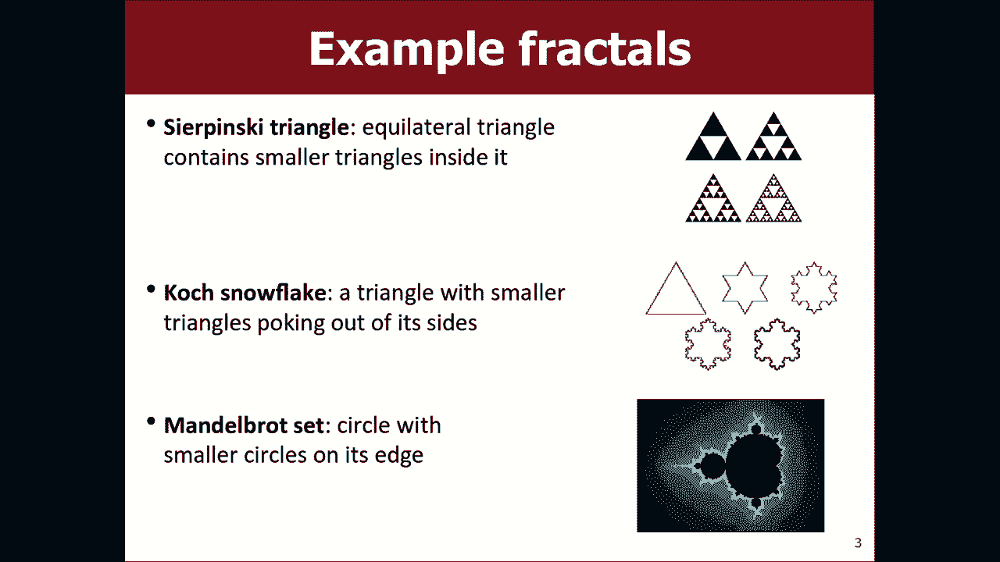
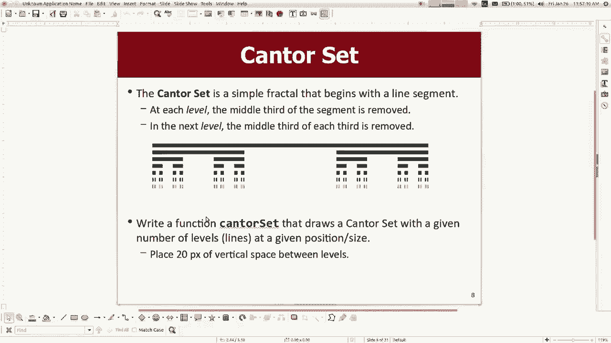
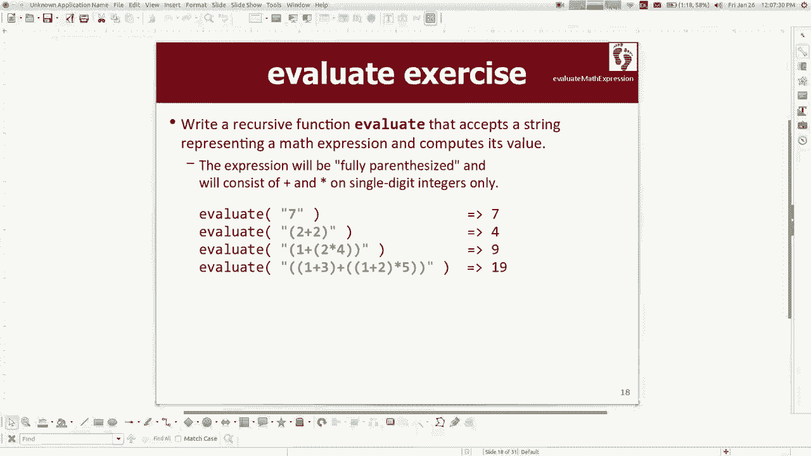

# 课程07：递归绘图与表达式求值 🎨➗


在本节课中，我们将继续深入学习递归，并探索两个特别有趣的应用：使用递归绘制分形图形，以及递归地求值数学表达式。我们将通过具体的代码示例来理解这些概念。




---

## 分形绘图：康托尔集 📏


上一节我们介绍了递归的基本思想。本节中，我们来看看如何使用递归绘制一种称为“分形”的自相似图形。分形是一种数学集合，其图形模式在不同尺度上重复出现。


以下是绘制“康托尔集”分形的步骤。康托尔集从一条水平线段开始，不断移除线段中间的三分之一，并在剩下的两段上重复此过程。


1.  **定义函数参数**：我们的绘图函数需要接收以下参数：图形窗口、线段起点的x和y坐标、线段的长度以及要绘制的层级。
    ```cpp
    void drawCantorSet(GWindow& window, int x, int y, int length, int level)
    ```

2.  **确定基本情况**：当层级为0时，我们不需要绘制任何东西，这是最简单的情况。
    ```cpp
    if (level == 0) {
        return; // 什么都不做
    }
    ```

3.  **实现递归步骤**：如果层级大于0，我们首先在当前位置绘制一条水平线段。然后，我们在当前线段下方、长度三分之一处的左右两个位置，递归地绘制层级减一的康托尔集。
    ```cpp
    // 绘制当前层级的线段
    window.drawLine(x, y, x + length, y);

    // 计算下一层级的参数
    int newY = y + 20; // 向下移动20像素
    int newLength = length / 3;

    // 递归绘制左右两个更小的康托尔集
    drawCantorSet(window, x, newY, newLength, level - 1); // 左边
    drawCantorSet(window, x + 2 * newLength, newY, newLength, level - 1); // 右边
    ```


通过调整递归调用的顺序，你可以改变图形绘制的动画效果，这有助于理解递归的执行流程。



---

## 递归求值数学表达式 🧮

理解了递归绘图后，我们来看看另一个经典问题：如何递归地求值一个完全括号化的数学表达式（例如 `(1+((2+3)*(4*5)))`）。我们假设表达式格式正确，数字均为个位数，运算符只有加号（`+`）和乘号（`*`）。

1.  **定义函数签名**：我们创建一个辅助函数来遍历字符串。它接收表达式字符串和一个表示当前读取位置的索引（通过引用传递，以便所有递归调用共享进度）。
    ```cpp
    int evaluateHelper(const string& expr, int& index)
    ```


2.  **处理基本情况**：最简单的情况是当前字符是一个数字。我们将其转换为整数并返回。
    ```cpp
    if (isdigit(expr[index])) {
        int num = expr[index] - '0'; // 将字符转换为整数
        index++; // 消耗掉这个数字字符
        return num;
    }
    ```



3.  **处理递归情况**：如果遇到左括号 `(`，意味着后面是一个子表达式。我们跳过左括号，递归求值左操作数，然后读取运算符，再递归求值右操作数，最后跳过右括号，并根据运算符计算结果。
    ```cpp
    if (expr[index] == '(') {
        index++; // 跳过左括号
        int left = evaluateHelper(expr, index); // 递归求值左表达式
        char op = expr[index]; // 读取运算符
        index++; // 跳过运算符
        int right = evaluateHelper(expr, index); // 递归求值右表达式
        index++; // 跳过右括号
        if (op == '+') {
            return left + right;
        } else { // 假设是 '*'
            return left * right;
        }
    }
    ```


这个例子展示了递归如何自然地处理嵌套结构。通过在函数开头添加输出语句来跟踪递归调用和参数变化，可以更直观地理解其执行过程。

---

## 总结 📝

本节课中我们一起学习了递归的两个高级应用。
*   我们使用递归绘制了**康托尔集分形**，理解了如何通过递归调用在更小的尺度上重复图形模式。
*   我们实现了**数学表达式求值器**，看到了递归如何优雅地解析和计算嵌套的表达式结构。


递归的核心在于识别问题的自相似性，并定义好清晰的基本情况。通过练习这些例子，你应该能更好地掌握递归思维，并将其应用到更复杂的问题中去。