# 课程08：回溯与穷举搜索 🔍

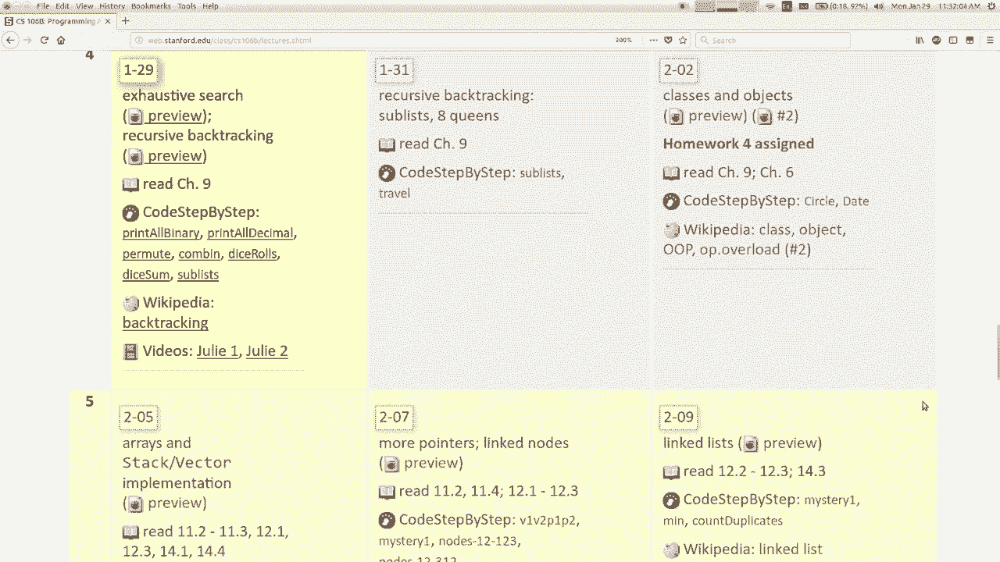

在本节课中，我们将学习递归的一种特殊应用——**回溯**。这是一种用于**穷举搜索**所有可能选项以解决问题的强大技术。我们将通过具体的编程示例，理解其核心思想与实现方法。

---

## 概述 📋

回溯是递归的一种形式，它系统地探索所有可能的“选择”或“路径”，以找到问题的解决方案。当某条路径被证明无效（即进入“坏状态”）时，算法会“回溯”到上一个决策点，尝试其他选项。这就像在迷宫中探索所有岔路，遇到死胡同时就返回上一个路口。

我们将从简单的**打印所有二进制数**问题开始，逐步深入到更典型的回溯问题，例如**寻找骰子组合**。通过这个过程，你将理解如何构建递归函数来探索决策空间。


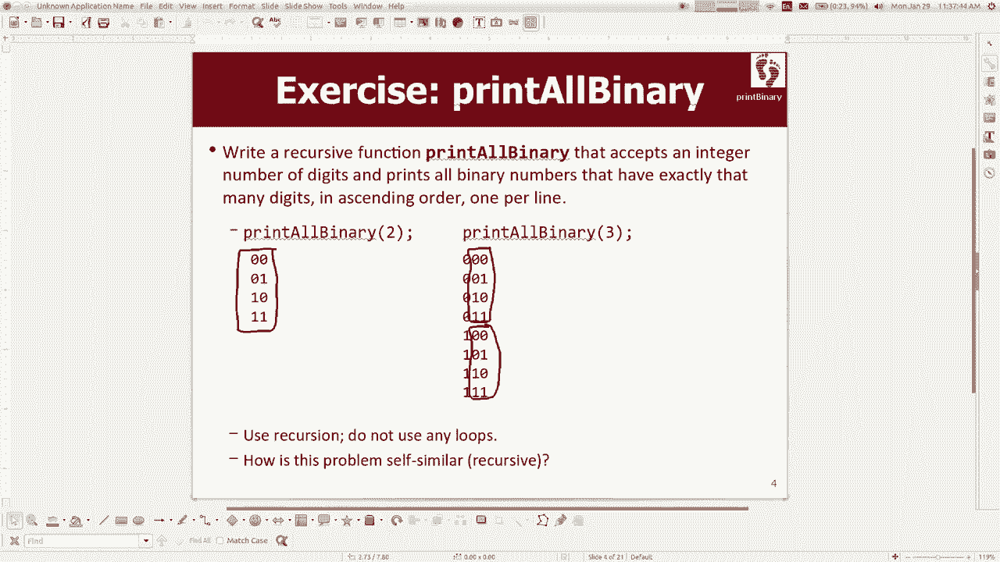

---


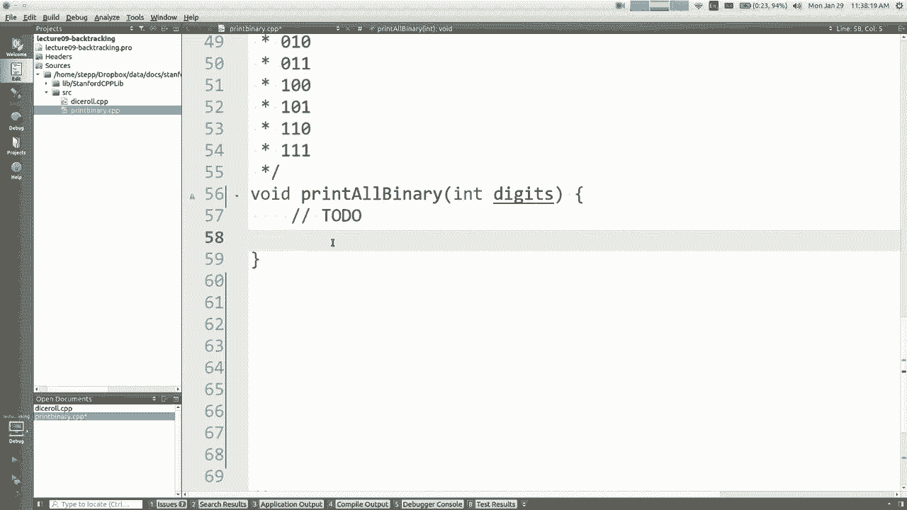

## 穷举搜索与递归 🌳

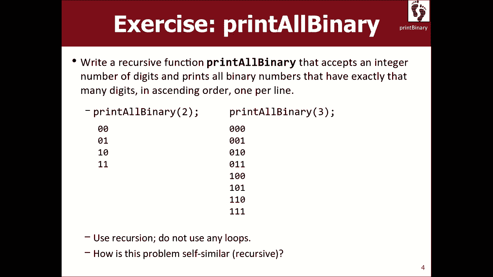

上一节我们介绍了回溯的概念。本节中，我们来看看如何利用递归实现穷举搜索。

穷举搜索的核心是检查所有可能的选择，以确定哪一个能解决问题。递归非常适合这类问题，因为它允许我们优雅地描述“尝试所有可能性”这一过程。

例如，要递归地搜索一个目录中的所有文件，或者生成所有可能的密码组合，都可以使用这种思路。通常，搜索空间由一系列待做的**决策**构成。

以下是解决这类问题的一般策略伪代码：

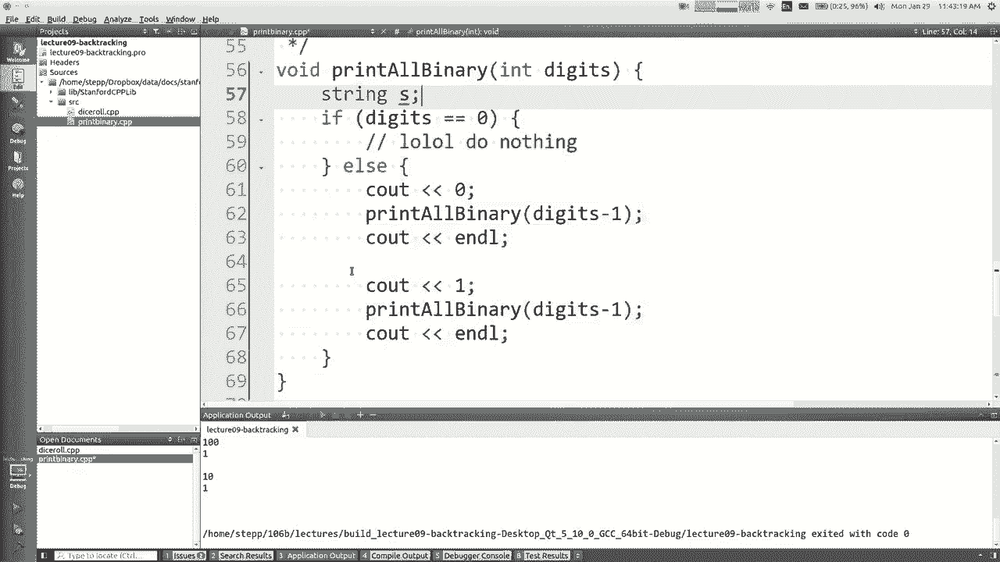

```cpp
void explore(decisions) {
    if (no more decisions to make) {
        // 基础情况：处理结果（例如打印或存储）
    } else {
        // 递归情况：做出一个选择，然后探索后续的所有可能性
        for (each available choice) {
            make(choice);
            explore(remaining decisions); // 递归调用
            unmake(choice); // 回溯：撤销选择，为尝试下一个选项做准备
        }
    }
}
```

这个模式通常被称为 **“选择-探索-取消选择”范式**。

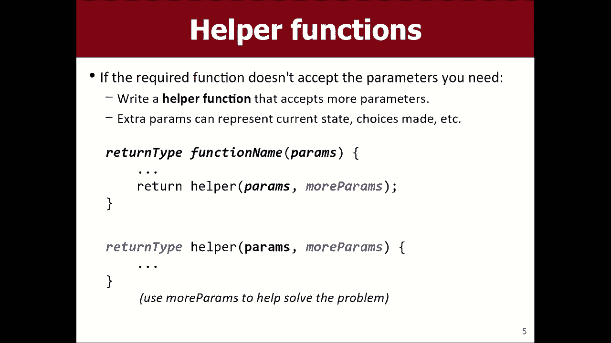

---

## 示例一：打印所有二进制数 💻

为了理解上述范式，让我们先解决一个具体问题：编写一个函数 `printAllBinary`，它接收一个数字 `digits`，并打印出所有具有该位数的二进制数（例如，`digits=2` 时，打印 `00`, `01`, `10`, `11`）。

### 问题分析与初次尝试

我们注意到，所有三位二进制数（如 `000`, `001`...）其实是在所有两位二进制数前面分别加上 `0` 或 `1` 形成的。这揭示了问题的自相似性：**打印 n 位二进制数** 的任务，可以转化为 **先打印一个数字（0或1），然后打印 (n-1) 位二进制数**。

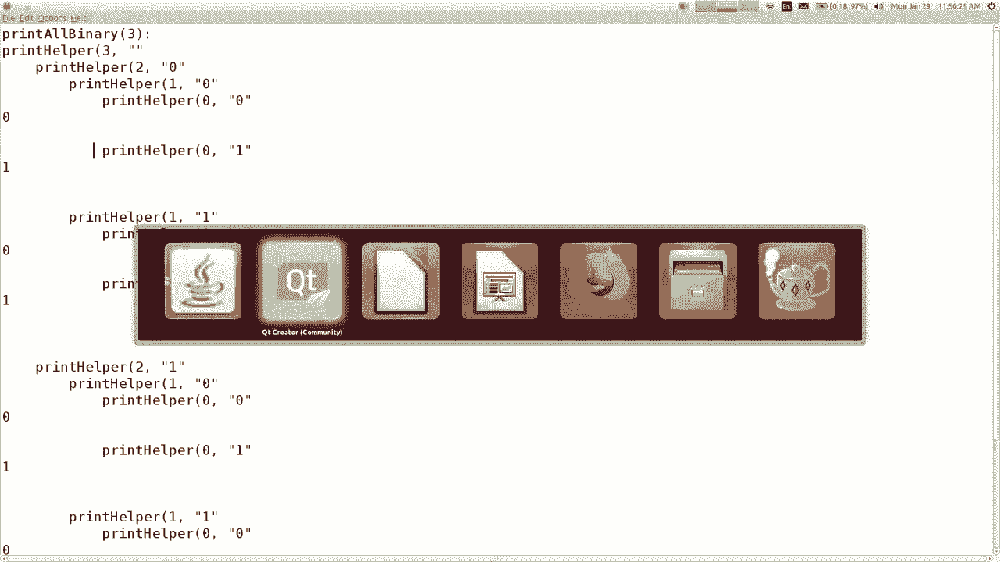

根据这个思路，我们可能写出如下代码框架：

```cpp
void printAllBinary(int digits) {
    if (digits == 0) {
        // 基础情况：打印什么？我们还没有累积数字。
    } else {
        // 尝试前面加0
        cout << 0;
        printAllBinary(digits - 1);
        // 尝试前面加1
        cout << 1;
        printAllBinary(digits - 1);
    }
}
```

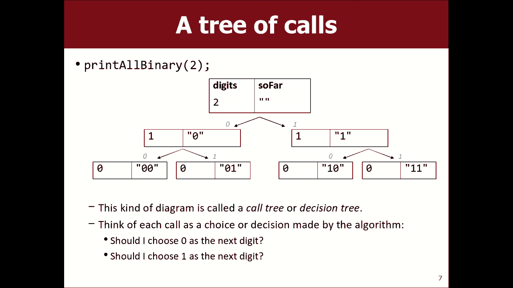

但这段代码有问题：它在递归过程中就打印数字，导致输出混杂，并且无法正确地在数字间换行。关键在于，我们需要在做出所有选择（即确定所有位）之后，再一次性打印整个数字。

### 引入辅助函数与累积路径

我们需要一个方法来**累积**当前正在构建的数字字符串，直到它达到指定长度。为此，我们引入一个**辅助函数**，它接收一个额外的参数——用于累积结果的字符串。

```cpp
// 这是被要求编写的函数
void printAllBinary(int digits) {
    printAllBinaryHelper(digits, "");
}

// 实际完成工作的辅助函数
void printAllBinaryHelper(int digits, string soFar) {
    if (digits == 0) {
        // 基础情况：没有更多位需要决定，打印已累积的字符串
        cout << soFar << endl;
    } else {
        // 递归情况：尝试在当前字符串后添加0，并递归处理剩余位数
        printAllBinaryHelper(digits - 1, soFar + "0");
        // 尝试在当前字符串后添加1，并递归处理剩余位数
        printAllBinaryHelper(digits - 1, soFar + "1");
    }
}
```

**代码解释**：
*   `soFar` 参数记录了从递归起点到当前调用所做的所有选择。
*   在基础情况（`digits == 0`）下，选择已完成，`soFar` 就是一个完整的二进制数，将其打印出来。
*   在递归情况下，函数会**分叉**成两个新的递归调用，分别探索在当前路径后添加 `0` 或 `1` 所形成的两条新路径。

这个过程形成了一棵**递归调用树**。每个函数调用负责处理一位数字，并派生出两个子调用处理后续位。最终，所有从根到叶子的路径就对应了所有可能的二进制数。

---

## 示例二：寻找骰子组合 🎲

理解了打印二进制数后，我们来看一个更典型的回溯问题：编写函数 `diceSum`，接收骰子数量 `dice` 和目标总和 `desiredSum`，找出并打印所有能掷出该总和的骰子组合（每个骰子值为1到6）。

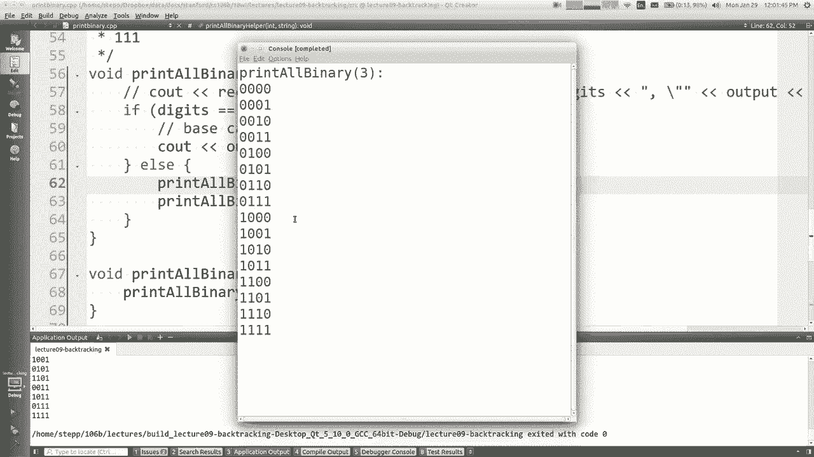

### 应用“选择-探索-取消选择”范式

这个问题与二进制问题类似，但每个决策点的选项从2个（0或1）变成了6个（1到6）。我们同样需要累积当前已选择的骰子值。

以下是实现框架：

```cpp
void diceSum(int dice, int desiredSum) {
    vector<int> chosen; // 用于存储当前选择的骰子值
    diceSumHelper(dice, desiredSum, chosen);
}

void diceSumHelper(int dice, int desiredSum, vector<int>& chosen) {
    if (dice == 0) {
        // 基础情况：没有更多骰子要掷。
        // 只有当当前选择的总和等于目标值时，才打印结果。
        if (sumVector(chosen) == desiredSum) {
            printVector(chosen);
        }
    } else {
        // 递归情况：对于这个骰子，尝试所有可能的值（1到6）
        for (int value = 1; value <= 6; ++value) {
            chosen.push_back(value); // 选择：将当前值加入路径
            diceSumHelper(dice - 1, desiredSum, chosen); // 探索：基于此选择继续递归
            chosen.pop_back(); // 取消选择：回溯，移除最后加入的值，尝试下一个选项
        }
    }
}
```

**关键点**：
1.  **选择 (`chosen.push_back`)**: 在递归调用前，将当前尝试的值加入 `chosen` 向量，记录这条路径。
2.  **探索 (`diceSumHelper`)**: 进行递归调用，处理剩余的骰子和更新后的目标总和（理论上应为 `desiredSum - value`，当前版本稍后优化）。
3.  **取消选择 (`chosen.pop_back`)**: 递归调用返回后，必须将刚才加入的值移除。这是**回溯**的核心步骤，它确保了 `chosen` 向量在尝试同一层的下一个选项时，状态是干净的。

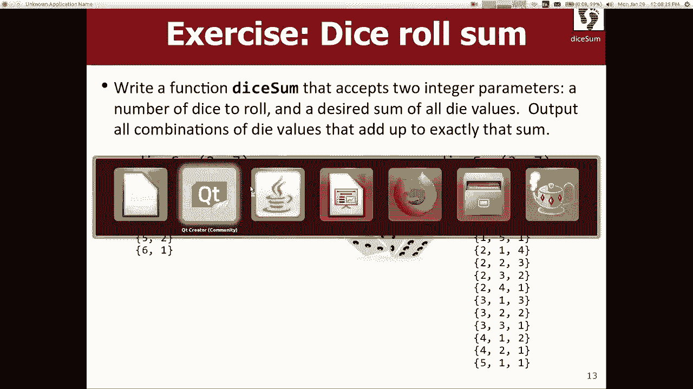

### 优化：提前剪枝

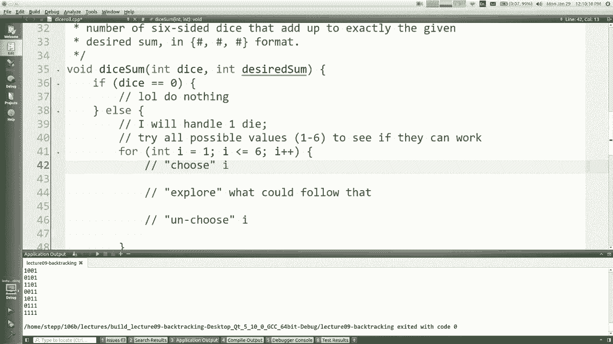

上面的代码有一个效率问题：它探索了**所有**可能的骰子组合（`6^dice` 种），最后才在基础情况检查总和是否匹配。这就像走完了整条死胡同才掉头。

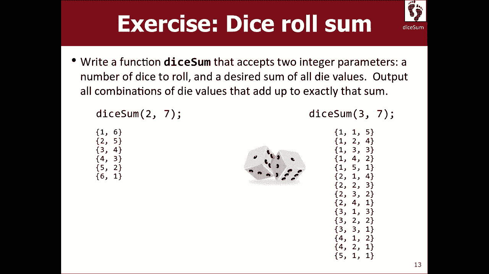

我们可以通过**提前剪枝**来优化：在递归过程中，如果发现当前路径已经不可能达到目标（例如，当前总和已经太大或太小），就立即停止在这条路径上的深入探索（即提前返回）。

优化后的辅助函数逻辑如下：

```cpp
void diceSumHelper(int dice, int desiredSum, vector<int>& chosen) {
    // 提前剪枝条件：如果不可能达到目标，则返回
    if (desiredSum < 0 || desiredSum > dice * 6) { // 简化示例，实际需计算当前最小/最大可能总和
        return;
    }
    if (dice == 0) {
        // 此时 desiredSum 应为 0，因为每次递归我们都减去了已选骰子的值
        if (desiredSum == 0) {
            printVector(chosen); // 找到一组解
        }
    } else {
        for (int value = 1; value <= 6; ++value) {
            chosen.push_back(value);
            // 探索时，目标总和减去当前骰子值
            diceSumHelper(dice - 1, desiredSum - value, chosen);
            chosen.pop_back();
        }
    }
}
```

通过传递更新后的 `desiredSum` 并在递归开始处检查其合理性，我们避免了大量无用的递归调用，极大地提升了算法效率。

---

## 总结 🎯

本节课中我们一起学习了**回溯**算法。

*   **核心思想**：回溯是一种通过递归进行**穷举搜索**的方法，采用 **“选择-探索-取消选择”** 的范式来系统地遍历所有可能解。
*   **关键步骤**：
    1.  **做出一个选择**，记录在当前路径中。
    2.  基于这个选择进行**递归探索**。
    3.  探索完成后**撤销这个选择**（回溯），以便尝试同一层次的其他选项。
*   **实现模式**：通常需要一个**辅助函数**，它包含用于累积当前路径的额外参数（如字符串或向量）。
*   **优化手段**：通过**提前剪枝**，避免在不可能得到解的路径上继续深入，这是编写高效回溯算法的关键。

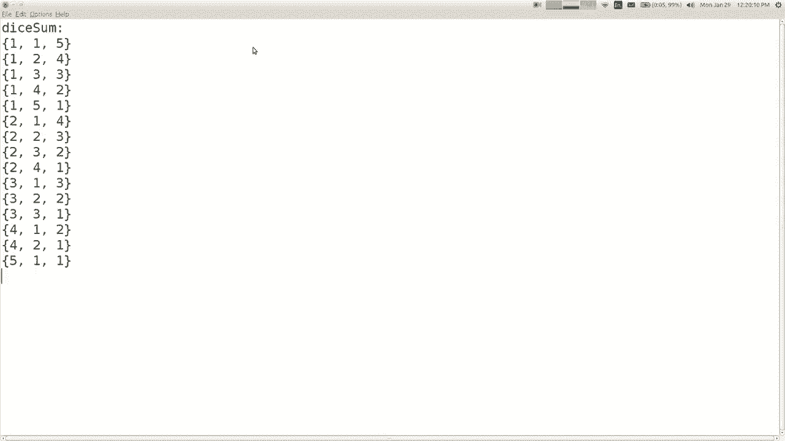

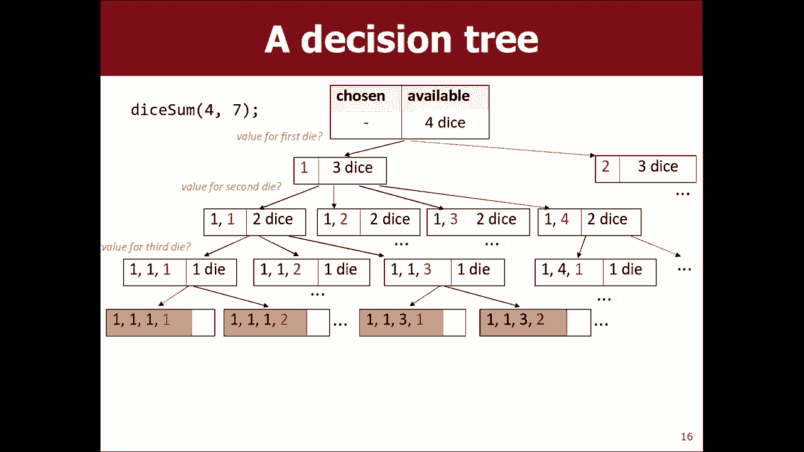

回溯是解决组合问题、约束满足问题（如八皇后、数独）和搜索问题的强大工具。掌握它需要练习，但一旦理解其模式，你就能将其应用于众多场景。