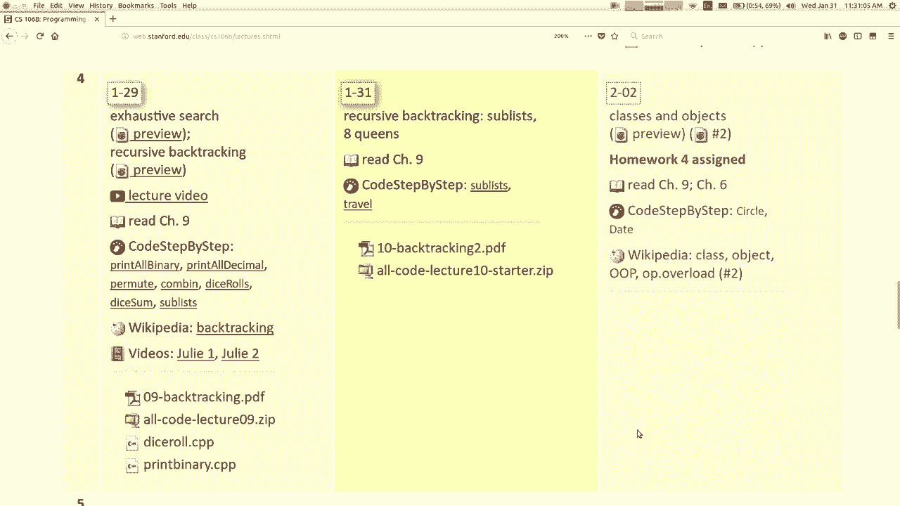

# 课程09：递归回溯（二）与迷宫求解 🧩

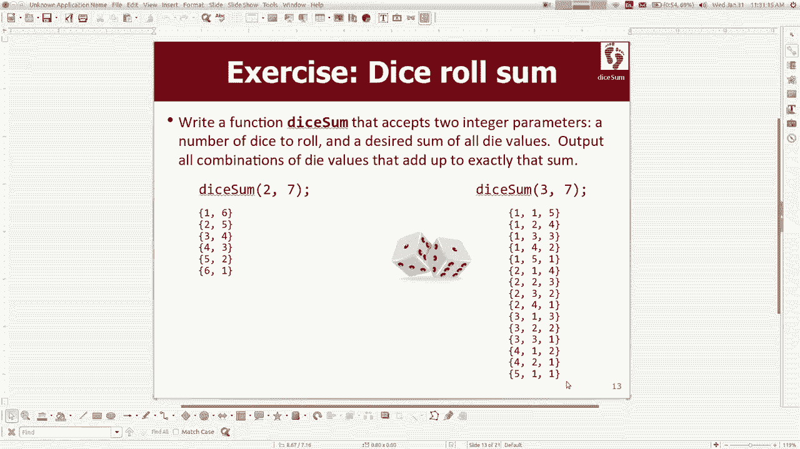

在本节课中，我们将继续深入学习递归回溯算法。我们将通过优化“掷骰子求和”问题来理解“剪枝”的重要性，并探索一个经典的回溯应用——迷宫求解。最后，我们会尝试编写生成所有排列的算法。

---

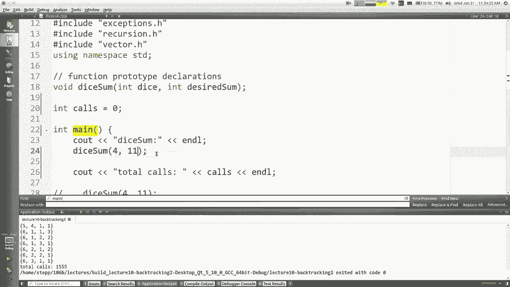

## 回顾与优化：掷骰子求和 🎲

上一节我们介绍了如何使用递归回溯来找出所有能使骰子总和达到目标值的组合。我们以此结束了课堂，并完成了代码使其正常工作。


以下是当时编写的代码核心部分，它通过一个向量 `choices` 来跟踪已做出的选择：

```cpp
void diceSumHelper(int dice, int desiredSum, Vector<int>& choices) {
    if (dice == 0) {
        if (sum(choices) == desiredSum) {
            cout << choices << endl;
        }
    } else {
        for (int i = 1; i <= 6; i++) {
            choices.add(i);           // 选择
            diceSumHelper(dice - 1, desiredSum, choices); // 探索
            choices.remove(choices.size() - 1); // 取消选择
        }
    }
}
```


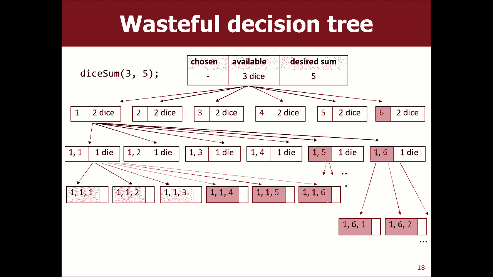

这个解决方案可以正确工作，但它有一个明显的缺点：它会检查每一种可能性，即使某些选择明显不可能导向有效结果。这导致了大量不必要的递归调用。

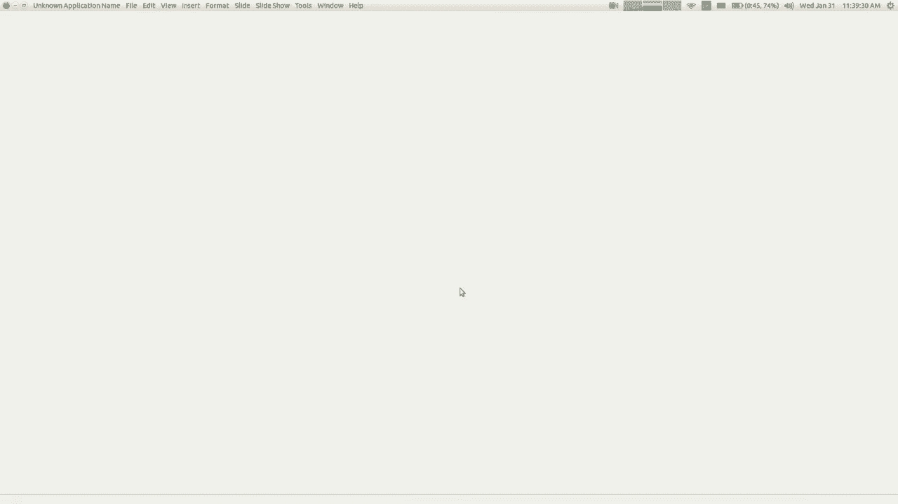

为了量化这个问题，我们引入了一个全局变量来统计函数调用次数。对于“3个骰子总和为7”的情况，需要 **259** 次调用；对于总和为11的情况，则需要 **1555** 次调用。函数调用会产生开销，过多的调用会影响性能。

### 引入剪枝优化 ✂️

问题的关键在于，当我们做出一个选择后，可以立即判断剩余的选择是否有可能达到目标。例如，在掷3个骰子求总和为7的问题中，如果第一个骰子掷出了5，那么即使剩余两个骰子都掷出最小值1，总和也至少是7（5+1+1）。但我们的目标是7，这看起来是可能的。然而，更精确的判断是：**剩余骰子能贡献的最小值和最大值**。

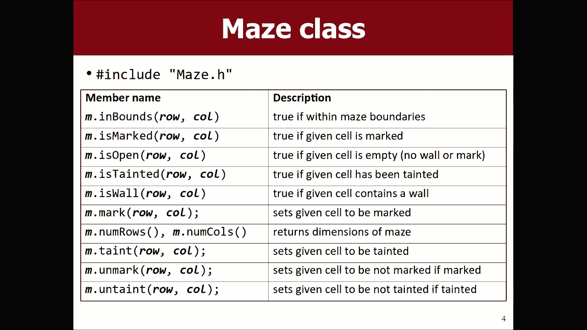

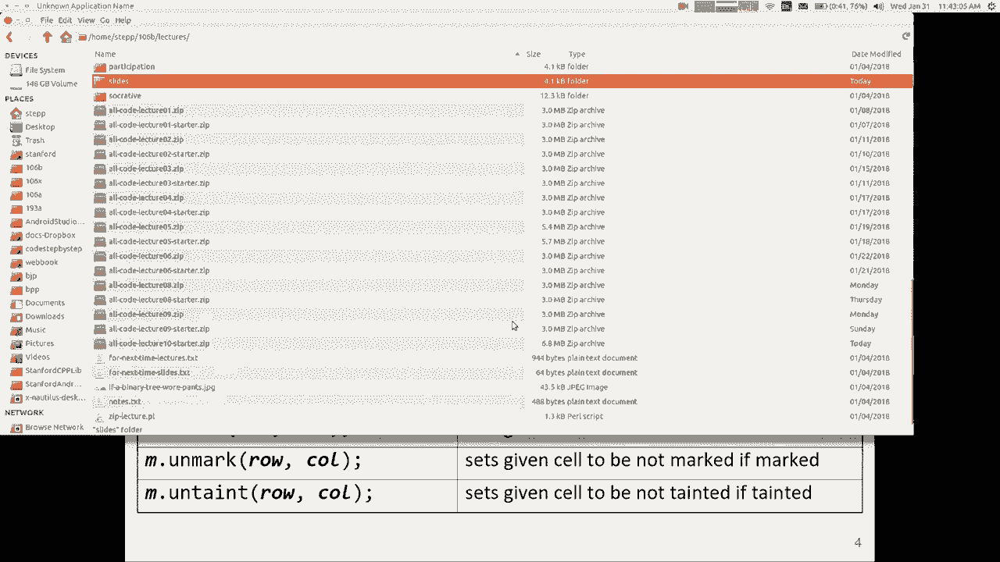

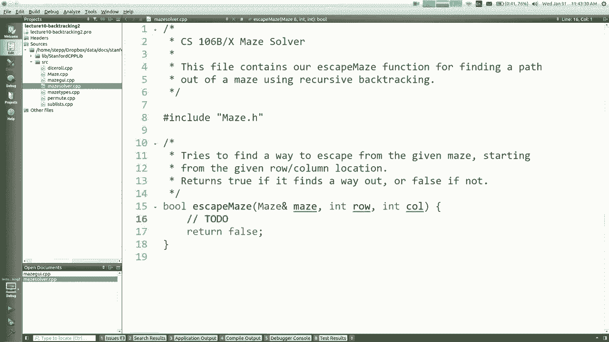

我们可以通过一个条件进行“剪枝”，提前终止无效的搜索路径：

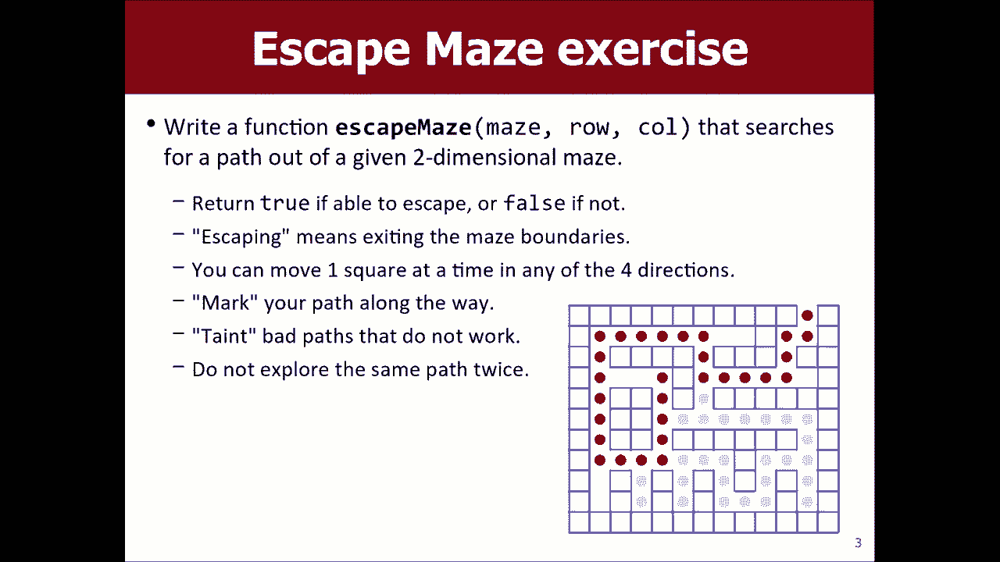

```cpp
void diceSumHelper(int dice, int desiredSum, Vector<int>& choices) {
    if (dice == 0) {
        if (sum(choices) == desiredSum) {
            cout << choices << endl;
        }
    } else {
        for (int i = 1; i <= 6; i++) {
            // 剪枝条件：判断当前选择下，未来是否可能达到目标
            int minFuture = dice * 1; // 剩余骰子全为1时的最小和
            int maxFuture = dice * 6; // 剩余骰子全为6时的最大和
            int currentSum = sum(choices) + i;

            if (currentSum + minFuture <= desiredSum && currentSum + maxFuture >= desiredSum) {
                choices.add(i);
                diceSumHelper(dice - 1, desiredSum, choices);
                choices.remove(choices.size() - 1);
            }
        }
    }
}
```

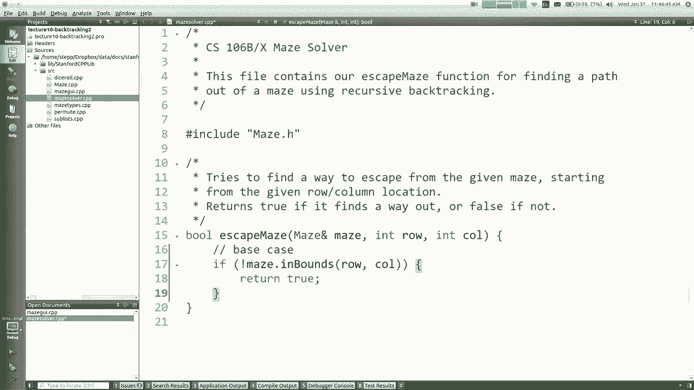

应用此优化后，对于“3个骰子总和为7”的情况，调用次数从259次大幅下降到 **127** 次。这种提前识别无效路径并回溯的技术，被称为 **剪枝**。它通过“修剪”递归调用树中不可能结果的分支，极大地提升了算法效率，在处理更大的搜索空间（例如12个骰子）时尤为重要。

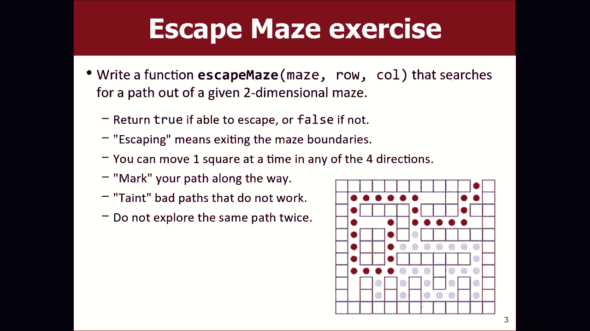

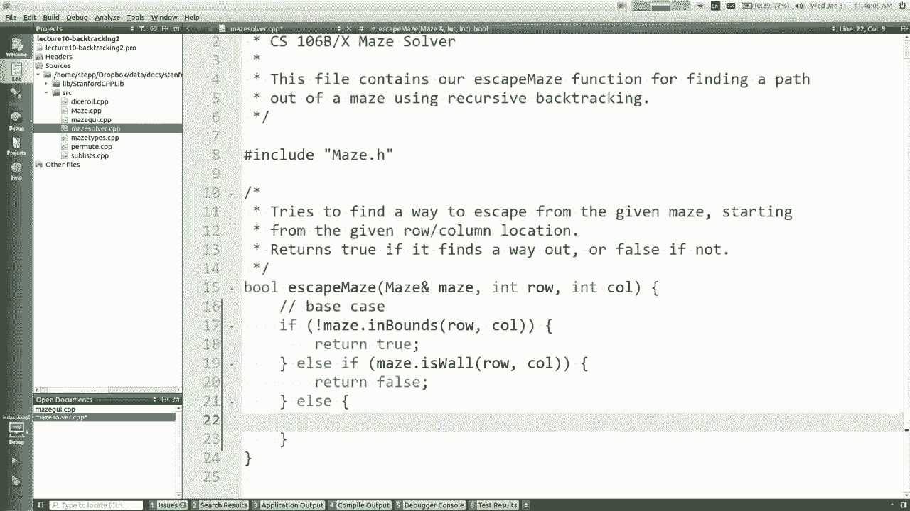

---


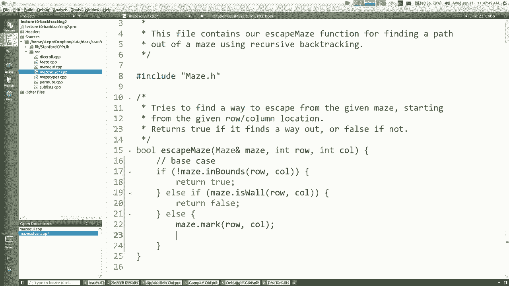

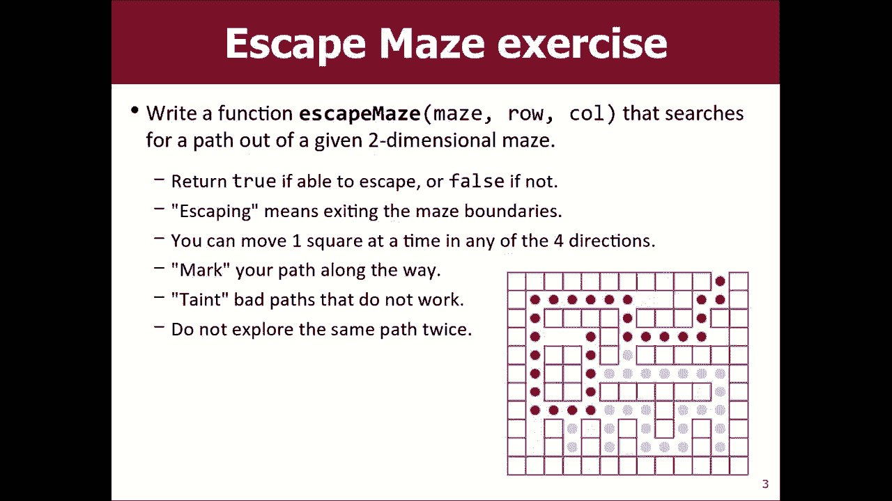

## 迷宫求解：回溯的经典应用 🧱

现在，我们来看一个能直观体现回溯思想的经典问题：迷宫求解。假设我们有一个网格表示的迷宫，可以穿过走廊，但不能穿过墙壁。目标是找到一条从起点到出口的路径。

我们拥有一个封装好的 `Maze` 类，它提供以下方法供我们使用：
*   `getNumRows()`, `getNumCols()`: 获取迷宫尺寸。
*   `isInBounds(row, col)`: 判断位置是否在迷宫内。
*   `isWall(row, col)`: 判断位置是否是墙。
*   `mark(row, col)`: 标记该位置为路径的一部分（留下“面包屑”）。
*   `isMarked(row, col)`: 判断该位置是否已被标记。
*   `taint(row, col)`: 标记该位置为死路（不再探索）。

我们的任务是编写一个函数 `escapeMaze`，它接受一个 `Maze` 对象和当前位置坐标，返回一个布尔值表示是否能从该位置逃脱。

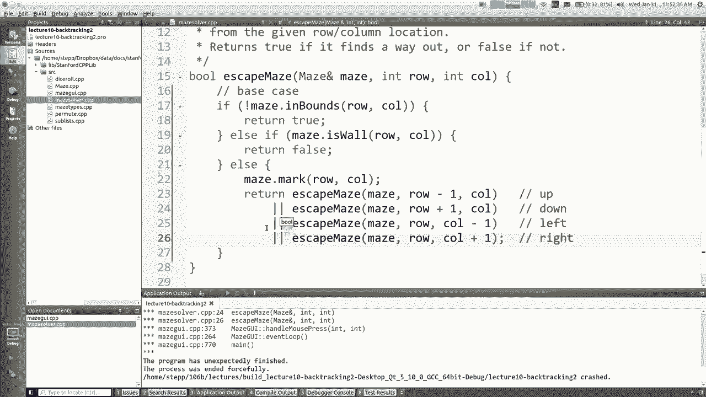

### 算法设计思路


递归回溯的通用策略是：做出选择，探索后果，必要时撤销选择。对于迷宫问题：
*   **选择**：向一个方向移动一步（上、下、左、右）。
*   **探索**：递归地从新位置尝试逃脱。
*   **取消选择**：如果从新位置无法逃脱，则回溯（移除“面包屑”或标记为死路）。

以下是实现步骤：

1.  **基本情况1（成功逃脱）**：如果当前位置超出了迷宫边界，意味着我们已经逃出，返回 `true`。
2.  **基本情况2（无效位置）**：如果当前位置是墙，或者已经被标记为探索过/死路，则返回 `false`。
3.  **做出选择并标记**：将当前位置标记为路径的一部分。
4.  **递归探索所有方向**：依次尝试向上、下、左、右四个方向移动。如果任何一个方向的递归调用返回 `true`，则意味着找到了一条路径，当前函数也应返回 `true`。
5.  **撤销选择**：如果所有方向都探索失败，说明当前格子是死路的一部分。取消其“路径”标记（或标记为“污染”），然后返回 `false`。

以下是核心代码框架：

```cpp
bool escapeMaze(Maze& maze, int row, int col) {
    // 1. 基本情况：成功逃脱
    if (!maze.isInBounds(row, col)) {
        return true;
    }
    // 2. 基本情况：撞墙或已探索
    if (maze.isWall(row, col) || maze.isMarked(row, col)) {
        return false;
    }

    // 3. 选择：标记当前为路径
    maze.mark(row, col);

    // 4. 探索所有可能的方向
    // 利用逻辑运算符的短路特性：任一方向成功则返回true
    if (escapeMaze(maze, row - 1, col) || // 上
        escapeMaze(maze, row + 1, col) || // 下
        escapeMaze(maze, row, col - 1) || // 左
        escapeMaze(maze, row, col + 1)) { // 右
        return true;
    }

    // 5. 取消选择：所有方向都失败，标记为死路并回溯
    maze.taint(row, col);
    return false;
}
```

这个算法生动地演示了“回溯”：它沿着一条路探索到底，如果遇到死胡同，就退回上一个岔路口尝试另一条路。通过标记已访问和死路格子，避免了陷入循环或重复探索。

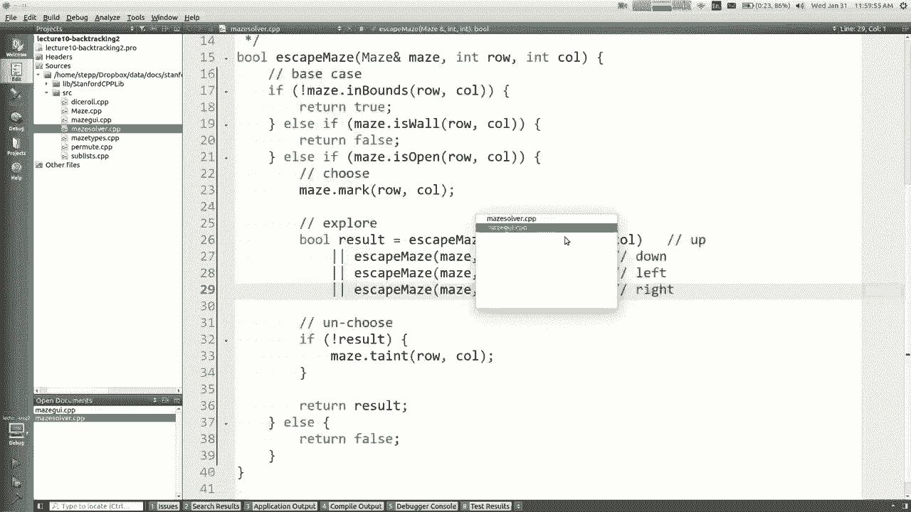

---

## 生成所有排列 🔄

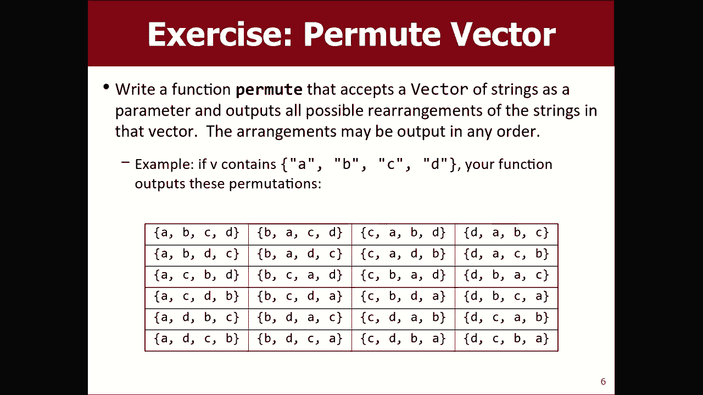

接下来，我们挑战一个不同的问题：给定一个字符串向量（例如 `{"A", "B", "C", "D"}`），打印出所有可能的排列（例如 ABCD, ABDC, ACBD...）。

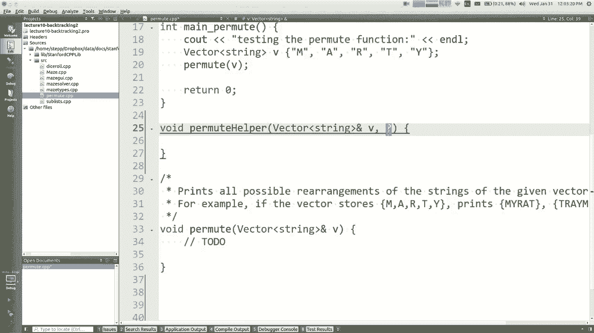

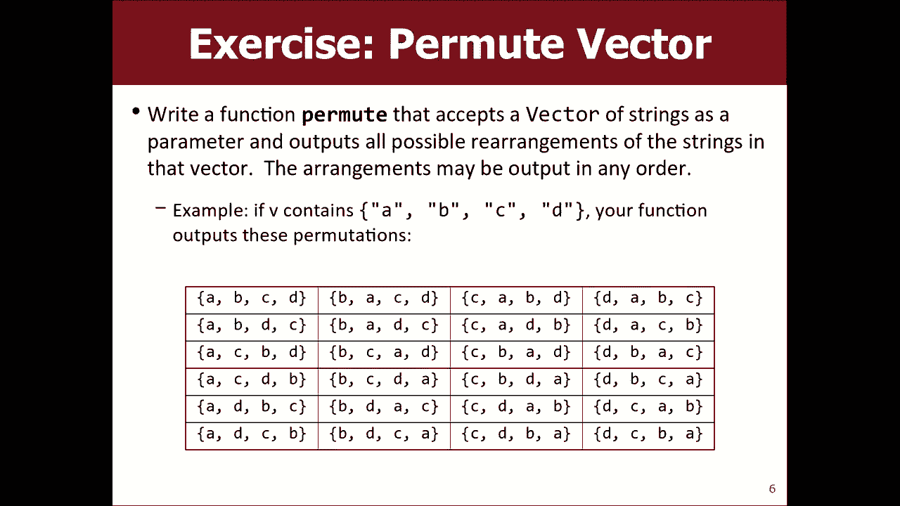

直接通过循环解决这个问题会非常繁琐。递归则提供了优雅的思路：**n个元素的排列 = 依次选择每一个元素作为第一个元素 + 剩余 (n-1) 个元素的所有排列**。

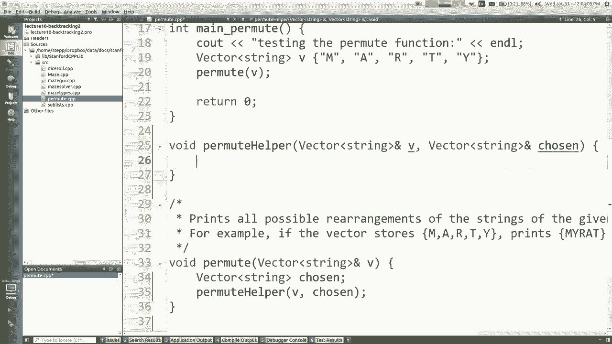

### 递归回溯实现

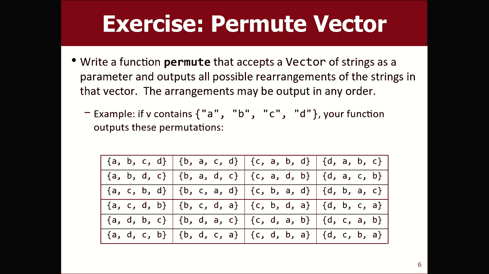

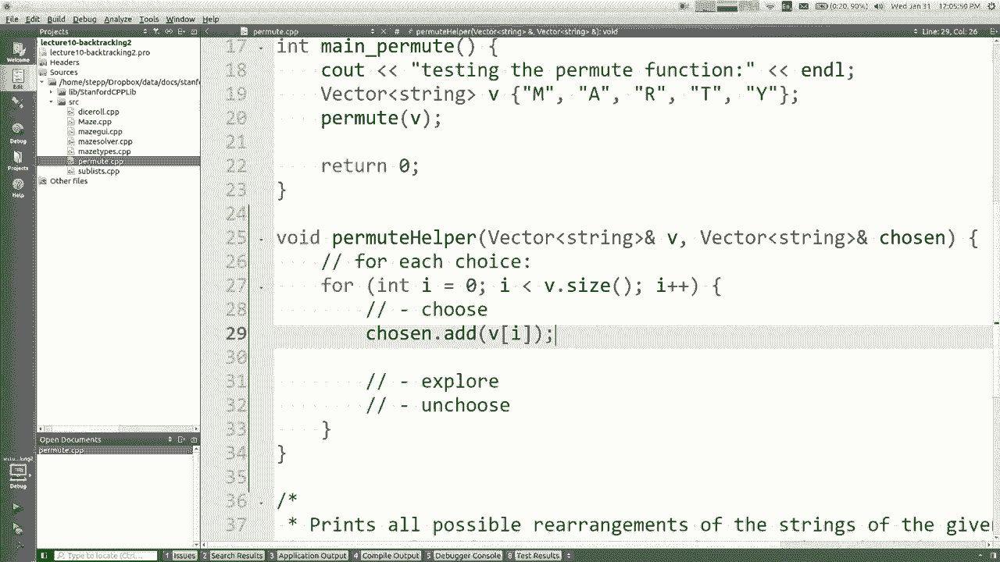

我们需要一个辅助函数来跟踪已做出的选择（当前排列的前缀）和剩余可选的元素。

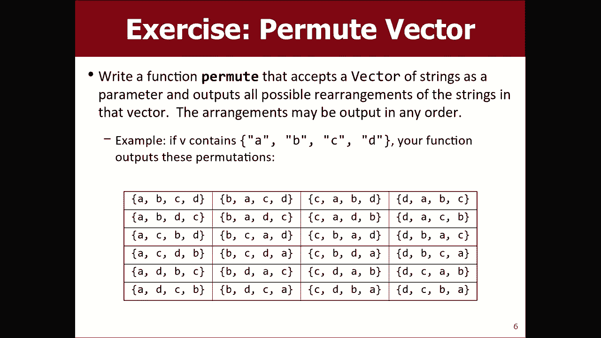

以下是实现步骤：

1.  **基本情况**：当没有剩余元素可选时（`rest` 为空），意味着我们已经完成了一个完整排列，打印 `chosen` 向量。
2.  **递归情况**：对于剩余向量 `rest` 中的每一个元素：
    *   **选择**：将该元素从 `rest` 中移除，并添加到 `chosen` 中。
    *   **探索**：递归调用函数，处理新的 `rest` 和 `chosen`。
    *   **取消选择**：为了尝试下一个元素作为当前位置，需要将刚才选择的元素从 `chosen` 中移除，并重新加回 `rest` 中原来的位置。

以下是核心代码：

```cpp
void permuteHelper(Vector<string>& rest, Vector<string>& chosen) {
    // 基本情况：没有剩余元素，打印当前排列
    if (rest.isEmpty()) {
        cout << chosen << endl;
    } else {
        // 遍历所有剩余元素作为下一个选择
        for (int i = 0; i < rest.size(); i++) {
            string s = rest[i];          // 选择元素
            chosen.add(s);               // 加入已选序列
            rest.remove(i);              // 从剩余中移除

            permuteHelper(rest, chosen); // 递归探索剩余部分

            // 取消选择，为下一次循环做准备
            rest.insert(i, s);           // 将元素插回原位置
            chosen.remove(chosen.size() - 1); // 从已选中移除
        }
    }
}

// 主函数
void permute(Vector<string>& v) {
    Vector<string> chosen;
    permuteHelper(v, chosen);
}
```

### 处理重复元素

如果输入向量包含重复元素（例如 `{"B", "B", "C"}`），上述代码会生成重复的排列（如 BBC 会出现两次）。为了避免重复打印，我们可以使用一个集合来记录已经打印过的排列，在打印前进行检查。

```cpp
void permuteHelper(Vector<string>& rest, Vector<string>& chosen, Set<Vector<string>>& printed) {
    if (rest.isEmpty()) {
        if (!printed.contains(chosen)) { // 检查是否已打印
            cout << chosen << endl;
            printed.add(chosen);         // 记录已打印
        }
    } else {
        for (int i = 0; i < rest.size(); i++) {
            string s = rest[i];
            chosen.add(s);
            rest.remove(i);

            permuteHelper(rest, chosen, printed); // 传递集合

            rest.insert(i, s);
            chosen.remove(chosen.size() - 1);
        }
    }
}
```

---

## 总结 📝

本节课中我们一起深入探索了递归回溯算法：
1.  **优化与剪枝**：我们通过“掷骰子求和”的例子，学习了如何通过提前判断搜索状态的有效性来“剪枝”，从而避免大量不必要的递归调用，显著提升算法效率。
2.  **迷宫求解**：我们实现了一个经典的迷宫回溯算法，直观地展示了选择、探索、撤销选择的过程，并理解了如何通过标记来避免循环和重复搜索。
3.  **生成排列**：我们设计了生成所有排列的递归回溯算法，掌握了在递归过程中动态维护“已选”和“剩余”列表的技巧，并简单探讨了处理重复结果的方法。

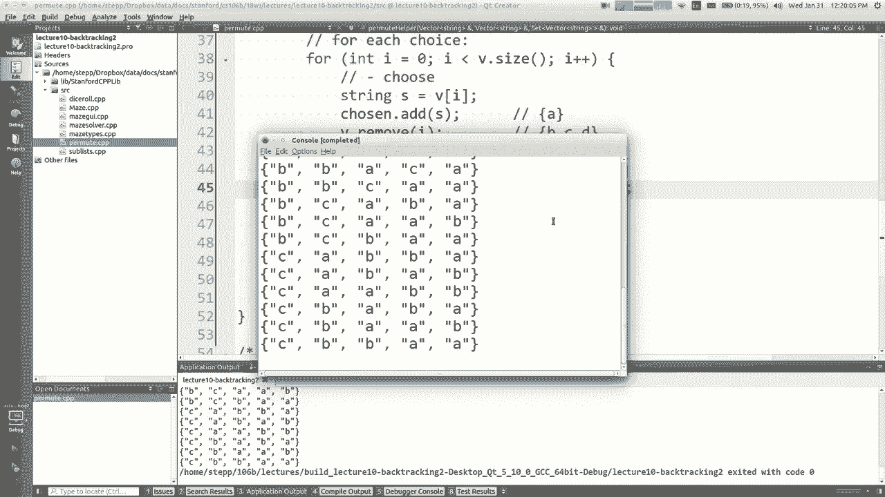

递归回溯是一种强大的问题解决范式，关键在于清晰地定义“选择”，并管理好状态的变化与恢复。多加练习是掌握它的最佳途径。