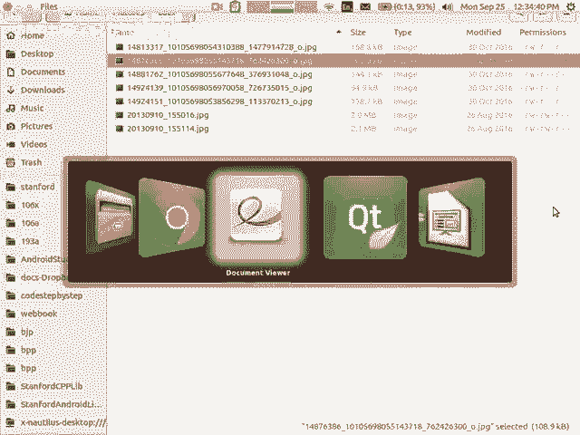
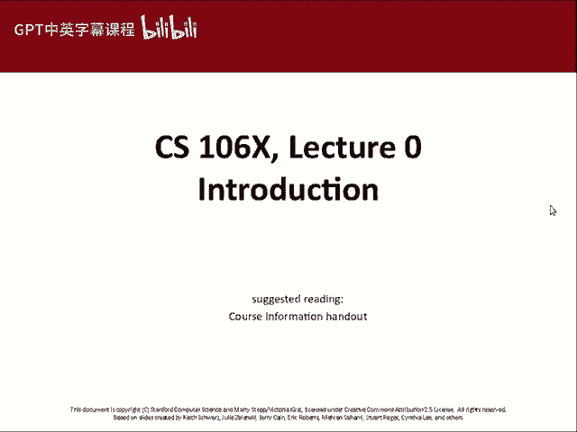
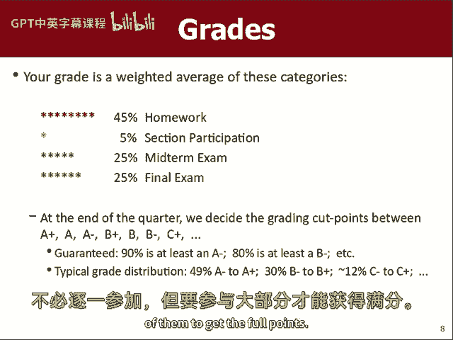
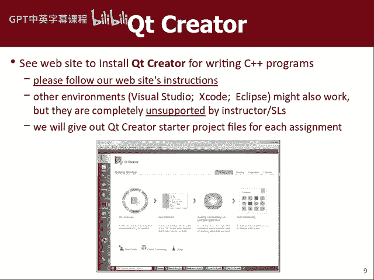
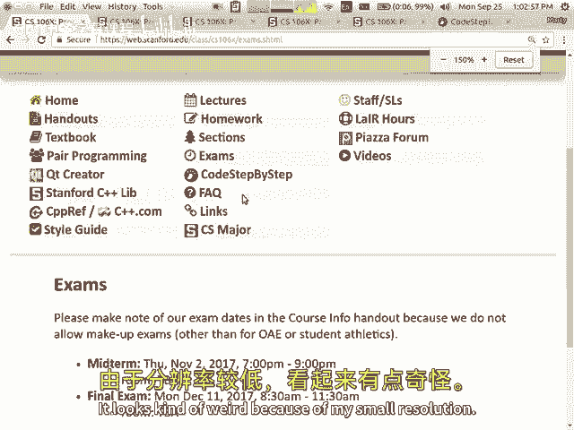
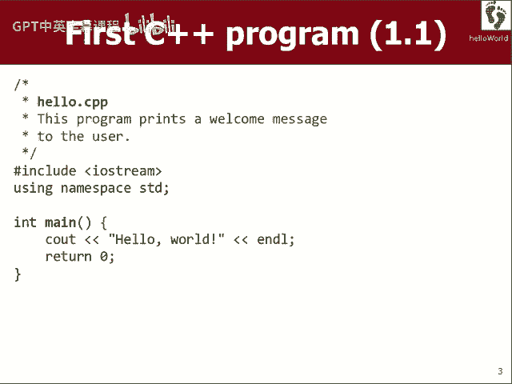
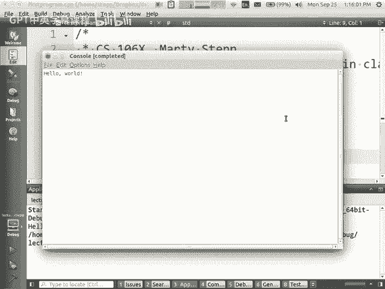
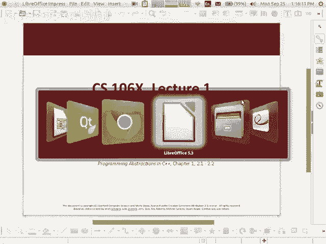
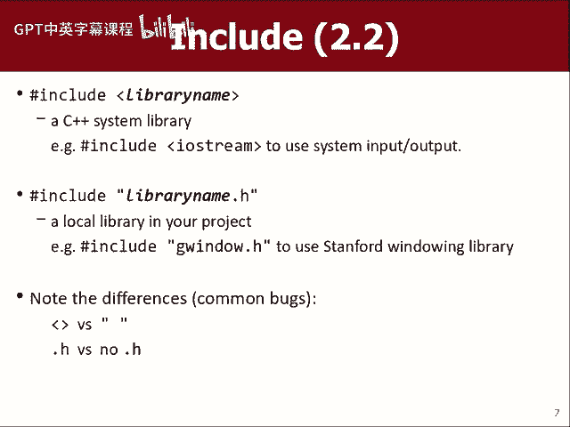

# 课程01：编程抽象方法 CS106X 2017 - 引言 🎯

在本节课中，我们将学习课程的基本信息、课程结构、评分政策以及所需的软件工具。我们将确保你了解这门课的要求，并为你后续的学习做好准备。

## 课程概述与结构 📚

我们在课堂上所做的一切都会被发布在课程网站上，包括常见问题解答。课程内容会被录制，但录制方式仅限于捕捉电脑屏幕和电脑麦克风的声音。这意味着视频中不会出现讲师的面部，并且如果讲师远离麦克风，声音质量可能会受到影响。尽管如此，这些视频仍会提供给你作为学习资源，但我们仍然鼓励你亲自来上课。

### 教学团队介绍

我不是一个人在教这门课。我的助教艾米才华横溢，她坐在教室前面。艾米目前在斯坦福工作，她将和我一起负责这门课程。如果你有任何与课程相关的问题，正确的做法是同时给我们两人发送电子邮件，这样我们可以分工合作，更高效地回复。

### 计算机科学入门课程体系

很多人想知道这门课到底是什么，以及是否应该选择它。让我们先了解一下斯坦福计算机科学的三门主要入门课程：

*   **CS106A**：这是第一门课程，面向广泛的受众。它教授编程基础知识，如变量、if语句、循环、数组、方法参数、基本问题解决和图形绘制。这是一门有趣且不需要预备知识的课程。
*   **CS106B**：这门课在CS106A之后，更侧重于数据处理和算法。你会学习如何存储数据到不同的集合中（如向量、列表、映射、集合、栈和队列），学习递归算法，解决复杂问题，并处理大型数据文件。这门课使用C++语言。
*   **CS106X**：这门课涵盖了CS106B的所有内容，但难度更高。我们会更深入地探索某些主题，并可能添加一些额外内容。家庭作业量更大，考试更难，评分曲线更严格。这门课适合那些已有一定编程经验、并希望接受更多挑战的学生。

选择CS106X的理由应该是你希望接受更严格的挑战，而不是因为它能简化你的课程安排。如果你觉得CS106B对你来说可能太简单或太慢，那么CS106X是一个合适的选择。反之，如果你希望以更平稳的节奏学习这些概念，CS106B是一个很好的选择。两门课在同一时间开设，如果你在CS106X中感到进度太快，可以随时换到CS106B。

如果你不确定哪门课适合你，请先查看课程网站上的FAQ（常见问题解答）部分，以及名为“哪门课程适合我”的讲义。这些资源包含了详细信息，可以帮助你做出决定。

## 课程教材与资源 📖

我们使用的教材是Eric Roberts编写的《C++中的编程抽象》。购买这本书不是强制要求，你可以在不购买的情况下在课程中取得好成绩。拥有这本书的主要优势是可以在考试时查阅。考试期间，允许携带教材，但不允许使用其他资源，如笔记、打印件或幻灯片。

为了公平起见，考试时不允许携带备忘单。我倾向于在考试中提出与以往试题相似的问题，并提供旧试卷供你练习。如果允许携带大量笔记，考试就失去了挑战性。因此，只允许携带教材，我会在考试时提供你可能需要的语法参考。

教材有多个版本，新旧版本差异不大，都可以使用。课程网站上也有该书的PDF版本，供你平时学习参考，但PDF版本不能用于考试。

## 作业与评分政策 📝

你的大部分成绩将来自作业。本学期大约有8个编程任务，每个任务你有一周或稍多一点的时间完成。有些作业你可以选择与搭档合作完成，但这不是强制要求。

作业评分主要基于两个方面：
1.  **功能性**：程序是否能正常运行并产生正确结果。
2.  **代码风格**：代码是否以优雅、简洁、高效的方式编写，包括良好的注释、变量命名、缩进以及避免冗余代码。

评分通常使用几个等级来表示：`✓-`（有一些问题）、`✓`（良好）、`✓+`（优秀）。在极少数情况下，会有更高或更低的等级。你会与你的小组负责人会面，以互动的方式取回作业成绩并讨论代码风格。

### 迟交政策

每个作业都有明确的截止日期。迟交作业以“讲课日”为单位计算（例如，周一至周三，周三至周五等）。你有**三次免费的迟交机会**（即迟交三个“讲课日”不会扣分）。你可以将这些机会用于不同的作业，或者在同一作业上使用多次（例如，迟交两天）。一旦用完这三次机会，之后迟交的作业将不予接受，除非有特殊情况。

建议你保留这些迟交机会，以备季度后期事务繁忙时使用。这些机会旨在帮助你应对生活中的意外情况，如生病、家庭事务等。除了这些免费机会，通常不会批准额外的延期。

### 学术诚信与协作

在个人作业上，你可以与同学进行概念性的讨论，例如寻求一般性的策略建议或讨论课程中的例子。但是，**严禁分享具体的解题步骤、代码或答案**。同样，请勿将你的代码公开在GitHub等公共代码仓库或任何可能被搜索引擎索引的地方。

## 讨论课与考试 📅

你的成绩构成如下：
*   **作业**：占成绩的大部分。
*   **讨论课参与**：每周参加由本科生小组负责人带领的小组讨论课，解决问题和练习，可以获得参与分数。
*   **考试**：包括一次期中考试和一次期末考试。
    *   期中考试：第六周，星期四晚上（具体日期请查看课程网站）。
    *   期末考试：期末考试周的星期一上午（具体时间请查看课程网站）。

请务必提前将这些日期标记在你的日历中，并检查是否有时间冲突。斯坦福的政策不允许期末考试时间冲突。如果你有与斯坦福课程相关的考试冲突，请与我联系解决。对于非斯坦福相关的冲突（如个人事务），通常不会安排补考。

### 评分与等级

最终成绩会基于曲线评定。我保证，如果你获得总分的90%或以上，你至少会得到A-；如果获得80%或以上，至少会得到B-。通常，大约一半的学生会获得A-到A+的等级，约30%的学生获得B-到B+的等级。CS106X的学生整体水平较高，因此获得高等级的比例通常也较高。

## 软件设置与要求 💻

在本课程中，我们将使用**Qt Creator**作为C++程序的开发环境。你需要在自己的电脑（笔记本电脑或台式机）上安装此软件。

请务必按照课程网站上提供的专用指南进行安装（在网站查找“Qt Creator”链接）。不要自行通过搜索引擎下载，以免版本或配置不正确。指南中包含了针对Windows、Mac和Linux操作系统的详细步骤和截图。

**建议你在今天或明天就完成Qt Creator的安装和配置**，并尝试运行一个简单的程序（例如打印一行文字）。这样可以确保你在作业发布前解决所有技术问题。如果你在安装过程中遇到困难，可以联系我或艾米寻求帮助，但请尽早开始，以免耽误作业。

我们**强烈建议你使用Qt Creator**来完成本课程的作业。虽然我不能禁止你使用其他开发环境（如Xcode），但为了确保一致性并获得最佳支持，请使用课程指定的工具。

---

在本节课中，我们一起学习了CS106X课程的基本框架：了解了课程定位、教学团队、教材与资源、详细的作业与考试评分政策、学术诚信要求，以及必需的软件工具设置。请务必查看课程网站获取最新信息，并尽快完成开发环境的配置。准备好迎接挑战吧！