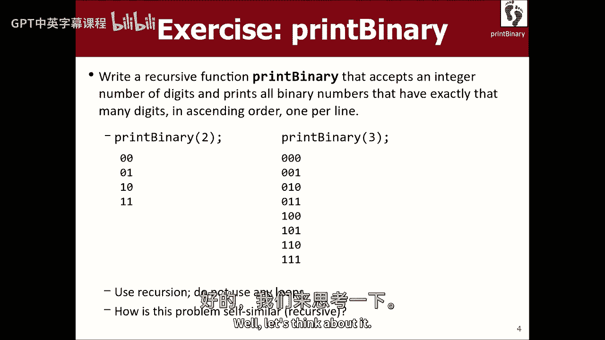
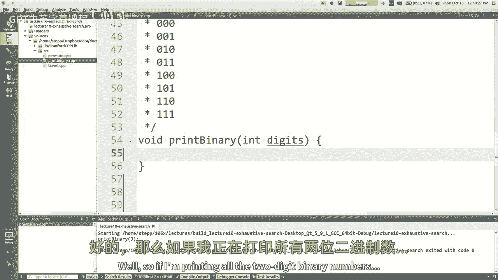
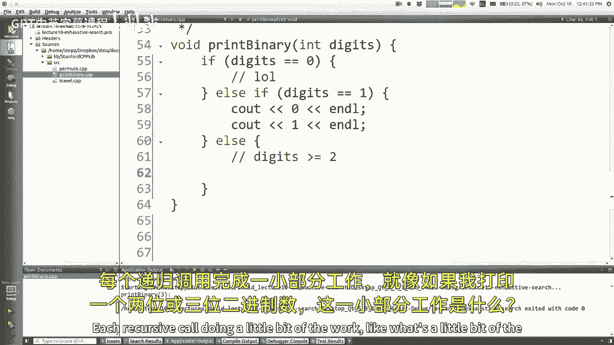
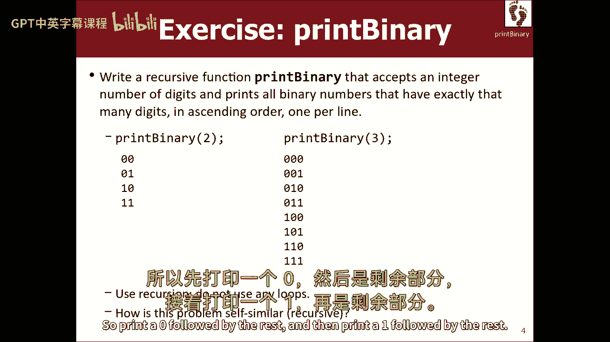
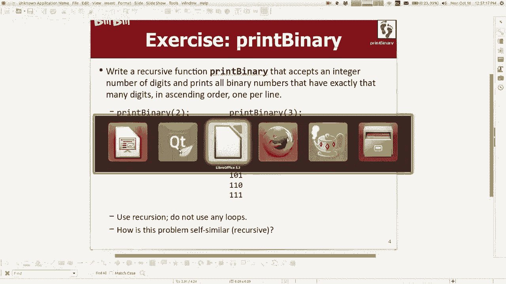
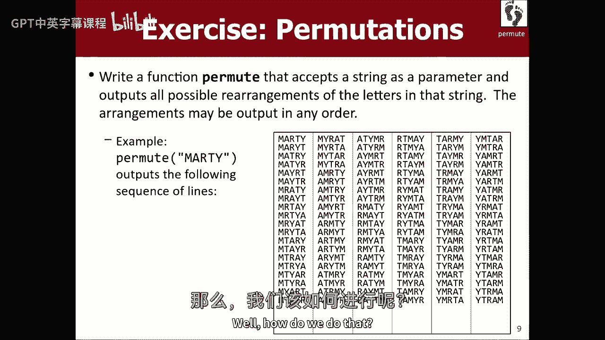
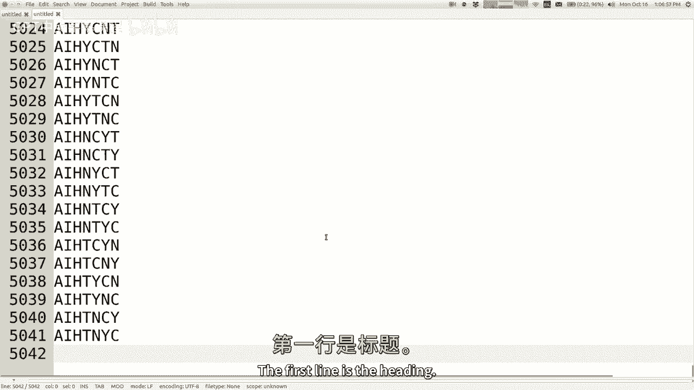
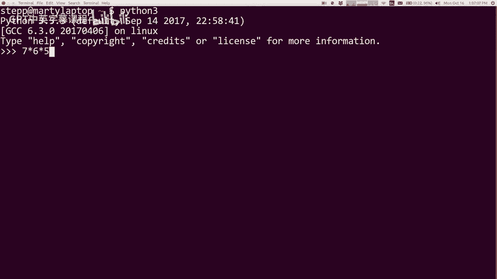
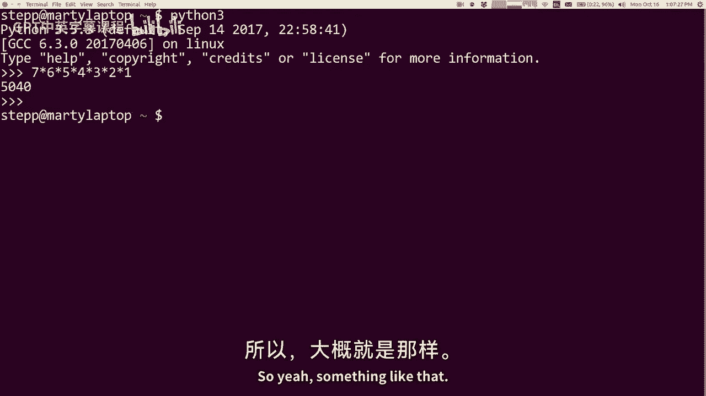

# 【编程抽象方法 cs106x 2017】斯坦福—中英字幕 - P10：Lecture 10 - Exhaustive Search - 加加zero - BV1By411h75g

欢迎上课，今天是星期一，已经是第四周了，六个中的一个，X呃，我们已经完成了十个星期中的三个星期，我们只是飞过这些东西，上周我们做了递归，本周我们将做更多的递归，我们要做一个递归的特殊应用，叫做回溯。

以及更多的内部错误，我不知道为什么，每次我开始一天，我得到这些错误，嗯哦好吧，我在回溯，所以，我的意思是，我们会花一整个星期在这基本上，它是用递归来解决某些问题的一种特殊方法。

包括探索可能是对的或可能是错的解决方案，如果你找到了一个错误的解决方案，你在算法中回溯并走不同的道路，所以这是一类我们可以用这种方法解决的问题，您知道，如果您到目前为止很好地处理了递归。

也许你也能处理好这件事，但我要说的是，当我年轻的时候学习这些材料的时候，很多年前，我发现回溯很棘手，尽管递归最终在某个时候为我点击了回溯，花了一段时间，因为它的点击，我也从我的学生那里看到了很多。

我看到学生们航行得很好，不知何故，本周砰的一声，他们碰壁了，我不明白，这是回溯的东西，我不知道，我不知道如何解决这些问题，所以不管怎样，这东西很难，这就是为什么我们会花很多时间练习它，嗯，家庭作业四。

它将于周五上市，将重点回溯，我们要解决一堆回溯问题，我知道你可能已经厌倦了每周五这么大的任务，好消息是下周五，不会有任务，但这就是为什么有期中考试，所以我喜欢这里没有变得更容易，你们都留下来了。

上星期五你本可以来的，但你做到了所以现在你完蛋了，你不是嗯是的，反正，所以我们这周要做回溯，所以让我们开始吧，与递归相同，我真的认为你不会做得更好，直到你练习，所以如果你在看讲座，这是有道理的。

解决方案对你来说是有意义的，那太好了，那是个好的开始，但我给你一个挑战，去用空白屏幕解决一些问题，看看你能不能做到，当你没有房间里的任何帮助来帮助回答问题时，所以好吧。

让我们跳进去吧，如果你想读更多，它主要来自书的第九章，虽然其中一些也在第八章，所以我想从一个叫做详尽搜索的东西开始，是一种回溯，会保佑你的，这将带领我们进入本周剩下的时间，好啦，什么是彻底的搜索，嗯。

它是当你有一套选择或价值观，你想处理或列出或检查什么的，你探索每一个，其中一个，所有这些现在有很多方法可以实现详尽的搜索，有时您可以使用循环或其他方法来完成，如果你要找的东西很简单。

就像我想搜索这个向量，你只需在向量上写一个for循环，这很简单，因为你在搜索一些线性的东西，但如果你在寻找比这更复杂的东西，也许仅仅一个循环并不容易解决它，你知道就像，例如，我们把目录爬虫程序写对了。

我们只是打印所有的文件和目录，你可以参考，就像对目录树的彻底搜索一样，因为这个结构不是线性的，它是嵌套的，等级，有更复杂的结构，递归实际上有助于在该空间上实现搜索，嗯，你什么时候能做好这件事。

我刚提到目录爬虫，你知道的，排列或搜索一组值的组合，对那个有好处，这对你有好处，你知道的，逻辑，组合器名称，密码，就像，如果你，如果你想写一个字典攻击，它尝试所有的密码，看看哪一个是正确的密码。

这就是你想要的东西，您希望彻底搜索所有可能的密码，直到你找到合适的，这些问题可能很棘手，解决或想出一个系统来解决，所以我要讲很多关于某些术语，就像我要谈论选择什么的，因为你知道当我们写递归代码的时候。

记住我们有一系列的电话，是的，每个调用都做少量的工作来解决一个大问题，在这里仍然是这样，所以我想当我谈到电话时，当我解决这些问题时，我要说的是每一个电话都做出了一个选择，下一次呼叫做出连续的选择。

我们在一系列的呼叫中做出一系列的选择，最终，所有这些选择的总和是我们搜索空间的一部分，我们看看这组选择，或者我们把它打印出来，就像我们，我们做一些事情与选择的顺序，我们正在进行的递归调用序列。

让我们看一些例子，其实对不起，让我们先看看伪代码，我看着我的例子，我想说这是一种通用的伪代码，比如如何写一个详尽的搜索算法，你在写某种函数，我叫搜索，它得到了某种参数，表示一组决策，你需要做的。

那是什么意思一个超级模糊的，但也许这意味着我有一套扑克牌，我必须选择所有的五张牌，或者一套卡片里的东西，一副牌，也可能是一组字母，我在搜索所有的密码或类似的东西，所以这里的算法是，如果有什么要做的决定。

那么让我来做一个选择，我会选择一些东西，然后我会搜索在这个选择之后会发生什么，现在我听到这里的每一件事都是这样，我想说的是每个电话都有一个选择，但它需要探索所有可能的单一选择，它可以做得很像，例如。

如果你想把所有的五张牌都打印出来，你可以在纸牌游戏中，嗯，其中一些牌是从这五张牌中的一些开始的，从梅花的王牌开始，所以也许我的电话抓住了俱乐部的王牌，说好吧，那是我选的牌，现在我要递归地选择另外四张牌。

一旦我完成了那个递归，我从理论上列举或检查了所有包含，梅花王牌或我说的任何牌，但现在我还没说完，我现在要试试两个梅花，在我尝试完A俱乐部之后，我尝试了梅花的两个，我告诉递归来探索其余的。

所以这不仅仅是我选择，然后我做递归，我可以为每一件事选择，我试着摘它，然后我做一个递归遍历，然后当它回来的时候，我尝试下一件事，尝试探索尝试探索尝试探索有点模糊，有点难跟上，不过，这样更合理。

当我们看到一些问题，所以好吧，这和递归有什么关系，我是说这些电话你说，搜索接下来的选择，这些都是递归调用，我们也知道在递归中我们总是有一个基本情况，在这里仍然如此，因为如果没有什么要做的决定。

就像我们试着把所有的五张牌都挑出来，如果我们已经选了五张牌，我们接到这个电话，那我们就停止，也许停止意味着打印我们一直在挑选的手，或者停止意味着退出程序，我不知道，如果这意味着什么，我们已经选够了。

所以现在这就像是一个基本情况，我会提到这里的基本情况有一点不同的含义，我是说当我上周谈到基本情况时，我们讨论过，基本情况是问题的一个简单版本，很容易解决，你只要立即回复，或者你马上打印一些东西。

您只知道在不进行任何递归调用的情况下该做什么，在这些问题的情况下，我不认为基本情况是这样的，我把它看作是每一个电话都在做出选择，做出选择，做出选择，基本情况不是一开始就没有选择。

我已经做了所有我需要做的选择，我已经建立了一个足够高的堆栈，我不需要把它建得更高，现在我展示我所建立的，那是我的基本情况，所以再一次，这并不是说我在解决一个简单的问题，以前的电话已经起作用了。

现在你来找我，没有更多的工作留给我这样做，我只是打印一些东西或返回一些东西或什么的，所以再一次，基本情况，稍微不同的思考方式，事实上，当我写这些问题的时候，我经常最后做基本情况。

因为我可以想象递归调用的工作，在我走到最后之前，基本情况，好啦，所以无论如何，一切都很模糊，我试图给你一个系统在这里，所以让我们来看看一个具体的问题，让我们编写一个名为print binary的函数。

打印所有具有一定数字的二进制数，你知道0和1，对呀，如果你一步一步地做这个，或者在可爱的创造者身上做这个，带着讲座页上的拉链，如果你想，好啦，所以乍一看，这可能看起来根本不需要使用递归，好吧，好你。

技术上来说你没有，但就像你可能会说的，哎呦，只要做一个循环，就像一个2到这个功率只是打印每一寸，或者你知道类似的事情，是啊，是啊，好啦，我是说，你看，有一些方法可以解决这个问题，而不需要递归回溯。

但是你知道，如果你想玩我的游戏，你必须这么做，递归的，不允许使用循环，如何做好，二进制二打印所有有两个二进制数字的数字，像个王子，意思是同样的顺序，对呀，所以好吧，嗯，让我们考虑一下。

让我们，让我们去找敏锐的创造者，我这里有打印二进制文件，好吧，如果我打印所有的两位二进制数字。

我打印零零，零一一，零一一，嗯，也许我们可以用我们的旧方法来思考递归一分钟，我们可以从基本情况开始，比如什么是容易打印的二进制数字，零位数。

好啦，就像，如果数字等于零LOL，我什么都不用做，还有其他容易打印的二进制数字吗。

就像一位数的二进制数字，只会在行上打印一个零，然后是一条线上的一个。

好啦，嗯，我可以在别的地方做得很好，如果数字是1，看到零，所有人都看到，让你一个和所有的这是很容易的其他，所以我想我会假设，我不打算担心负数，我可以抛出一个异常，我以后再做，否则我就假设数字大于1。

大于等于二，所以说，每个递归调用做一点点工作。

就像一点点工作，如果我打印一个两位数或三位数二进制数，在这里做一些工作的单位是什么，一个数字，好啦，这个问题本身是如何相似的呢？如果你看2-1和3-1，自我标记区在哪里，高阶数字优先。

然后打印0和1，所以如果你看这个，打印二进制2的输出，它就出现在那里，不是吗？它也出现在那里，所以我的意思是，这里的想法似乎是打印二进制文件，我应该打印一个零，后面跟着一个递归调用。

然后我应该打印一个1，后面跟着一个递归调用，有点对，那是一种，这里的想法，好啦，哦，天哪，我跑得很慢，我想我关闭了嘿松弛，走开啦，你在哪里，你喜欢我的小狗，啊，我怎么关闭它，我甚至没有松弛跑。

是因为铬吗，哦好吧，希望，希望他们不会像男人一样突然出现，乔的节目烂透了，哦我的天啊。

好了，我们永远不会谈论这一点，所以一种指纹是零，然后是其余的，然后打印一个1。

紧随其后的是红色，对我们就是这么说的，好啦，所以也许更像是，让我们做C出零，然后打印二进制的数字-1，也许我不想让它掉线，所以我会那样做，然后，我将做c出一个1和打印二进制，刚刚好，就像，前面一个零的。

前一个前面有一个像这样的东西，好吧，我可以试试，然后它做什么打印二进制，好吧，那，你只打印了一个零，然后去下一个。

你想要什么四零，是啊，是啊，他说得对，寿星们得到了，他说我们的代码只打印一个零，然后进行递归调用，所以它就像打印这个零，然后它试图这样做，所以我们必须在第一行写一个零，老兄，你知道我的意思。

你说的完全正确，我想这么做，但是再加上一个零，我们以前见过类似的东西，右与缩进的目录爬虫，我们是怎么做到的，因此，上一个调用可以传递一些信息，以便在下一个调用之前打印，我们该怎么办，是呀，你必须。

你必须添加参数，是啊，是啊，让我们向函数添加另一个参数，传递那个零或那个，我经常从学生那里听到的，你说你答对了，可能是像前缀字符串之类的传递，很多时候，当我在一个零中显示这个，6B，他们说的很好。

您应该将该零作为新参数传递，所以你可以在这前面打印，这是个不错的主意，只不过，我想你会发现，你知道如果这个人给这个人零分，这家伙想通过零分，打印二进制文件，所以我想你最终会有多个角色，在这里传递。

所以我想你想要的是你想说。

实际上，如果我去这个标题，或许你想让我说，字符串前缀等于没有开始，也许只是从没有前缀开始，所以我想我们要用这个参数做什么，这里是，它将存储所有的二进制数字，我们需要把我们的，就像如果我打印二进制。

这时我接到了打印二进制三的电话，然后他会给我一个零作为直线和零，然后在我一路跑到完成后回到他身边，他会再打电话给我，但他会递给我一串，我会把我后面的那个，再一次，为什么它需要是字符串而不是int井。

因为当我递归调用print二进制1时，我要通过他的零加我的零，他的零加我的一，等等，所以我得把这个东西种出来，所以我想我要做的是，如果是一位数字，好啦，所以我真正想做的是，我想把数字减一和零。

数字减一加一，这段代码有几个问题，但它越来越近了，加上零前缀，这真的很重要，我不知道你是否明白其中的区别，但就像之前的电话给我发了一个前缀，我想把这个也放在前缀上，因为如果在我之前有四个电话。

里面有1和0，我希望我的选择是，好啦，我们快到了，我们就快完成了，还是不太对，我的意思是，我可以运行它，如果你想要的，更糟的是，你所有的想法都很糟糕，好险啊，嗯，我们从来没有，是啊，是啊。

构建这个前缀的全部意义在于它被打印在一些东西的前面，我们从来没有把它打印在任何正确的地方，我想我们可能要重做我们的基本案例，所以再看看，我想让你重新思考这些不同的案例意味着什么，我们的代码真正在做什么。

我说的是选择和探索，遵循选择，那么这里到底发生了什么，这东西就像一个选择的集合，你一路走来，在递归调用上，我把它们储存成一根绳子，但这只是一个实现细节，它是一组0和1，我在按一定的顺序选择呼叫。

现在我要打这个电话，这可能是第一个电话，也可能是第十个电话，之前的那些电话，把一些字符放入字符串中，那里，这些代表了这些电话所做的选择，我的电话也需要做出选择，它这样做了，我选择零。

这条线是一种选择和探索，它在说，选择一个零，然后现在打印可以跟随该零的内容，当它运行完毕，当它回到这里，选择一个，尝试所有可以遵循的二进制东西，好啦，最终所有这些电话都完成了选择，别无选择。

如果是这样的话，这个字符串存储了在整个过程中所做的所有选择，我怎么知道什么时候没有选择，当数字为零时，所以我想让你重新考虑一下，此参数的含义，我知道如果你过了三关，然后打印所有三位二进制数。

但根据我们的守则，它的意思是在这里还需要选择多少位数字，现在，还有多少人可以这样选择，如果我说数字零，哈哈，我什么都不用做，那不是正确的想法，不是缅因州的人让我打印零数字，他们让我打印四位数。

我要求自己打印三张，也就是我自己打印两张，调整自己打印一个，只有我自己打印零，答案不是什么都不做，是对以前的人所做的一切的回应，我该如何回答他们的所作所为，我应该把他们做对的事印出来，如果没有选择。

打印您选择的内容，这个前缀是此时应该打印的全部内容，因为前缀有三个字符长，如果我在打印三个二进制文件，无论数字的值是多少，这就是我现在得到的，我甚至不需要这个权利，这其实不是一个有用的案例，其实呢。

这是个破了的窃听器，我们以前有过，但我们认为我们需要它，但我想我们没有，所以说，我们试试看，哇哦，它的工作原理，太神奇了，所以这与我们所做的大多数其他递归代码非常不同，还是很短，看起来很简单。

对案件含义的思维过程，以及这些叫声是如何相互交流的，与我们上周所做的完全不同，好啦，所以我称之为对三位数的二进制空间的穷尽搜索，本质上是现在，如果你在想象，这些电话发生了什么，我又可以用我的魔法了。

我可以把这个递归称为h，记住包括RE，在这里我可以，在每次通话开始时，我觉得你应该这么做，无论是否使用递归h，如果你想学习递归，只要说，看出去，数字，不如，我说数字等于，然后我说逗号前缀等于，加前缀。

所有的嘿，让我们看电话，那么它是做什么的呢，哦等等，它没有那样做，对不起对不起，对不起，对不起，我没有做，什么叫递归缩进，这就是我想做的，这就是我导入递归的原因，H递归缩进在那里，会让通话结束，好啦。

让我们试试看，所以打印二进制的三个说，我把所有三位数的号码都打印出来，好吧，那么首先我将尝试两个以0开头的数字，稍后，我将尝试两个数字，以一个右开始，这是我的两个电话，以0开头的两位数字。

尝试所有从零开始的一位数数字，所有以0开头的一位数，那是他的两个电话，每一个都用零打电话，剩下的数字是零和一，每一个都导致产出，因为那些太左了，行线是输出，我们代码的西雅图行，所有这些台词都是。

所以你可以看到一个前缀不断增长，当它变大的时候，你找到基本情况，把它打印出来，这就是我们的代码所做的，这有道理吗，你对那个代码有什么问题吗，好啦，呃好吧，如果你明白代码，哈哈哈。

我们为什么不试试这个的变体呢，让我们试试一个叫做打印十进制的，那么那是哪里，哦对不起，我想在我打印小数之前我会给你看这张照片，就像我们说的电话树，就在一分钟前，你还从侧面看到了这一点，我是竖着画的。

所以我叫它到目前为止而不是前缀，但你的单词前缀也很棒，所以这就像我到目前为止所选择的，或者我的前缀是什么，这是一棵由两位二进制数组成的树，但是很多算法都有这样的想法，一棵树不同的探索路径。

可能会导致答案，打印出来什么的，所以让我们打印十进制，这意味着打印所有的十进制数字，所以它基本上和打印二进制代码完全相同，只不过是十垒而不是二垒，对呀，好吧，我们走吧。

让我们去看看可爱的创造者，所以这里是打印十进制，我想我可以像打印二进制文件一样，我是说我可以我可以回到这里说，实际上，我想要一个字符串前缀作为这里的参数，只要是可选的，我能做到，然后我会去写它。

我必须写字符串前缀，我想我可以去复制粘贴，我喜欢复制我自己的代码，所以我可以把这个改成，打印十进制，哇塞，这个比我想象的要容易，好啦，嗯所以现在，但现在还在打印二进制数字，我该怎么办，是的。

所以我的意思是，我认为这是一个正确的解决办法，但我想部门领导不会给我充分的风格点，所以我听到有人说，循环是你想要的吗，是啊，是啊，是啊，是啊，您可以执行for循环，比如1=0整型数，我等于0到9。

我加加哦，看起来像循环，虽然打印前缀，加i，你得做，你得说字符串对整数，我不过没关系，好啦，当然可以，哦不，无无整数，只是耶，从整数到字符串，感谢您使用该功能，我想我得说包括，我想是在搅拌器里。

我想这就是功能所在，好啦，罚款，我们可以试试，让我们去Main，让我们取消对该调用的注释，哦伙计，五位数太多了，让我们做所有的三位十进制数字，下课后你可以留下来校对，如果你想，我觉得它很好用。

听着我的意思不是那个很难，那个应该不会花我们很长时间，但我确实想指出，我们在这里使用了一个循环，就像，我们在哪里作弊，我觉得这样可以，我是新来的，我不会用这个循环遍历所有的数字。

我不是用循环来摆脱递归部分，好啦，我只是使用循环来列举所有可能的单个选择，我的电话可能会选择打，我是说你看，我在这里也可以用，我可以用一个从0到1的for循环，但那似乎有点傻，那么这个呢。

几乎没有足够的碎片，我刚把它们写出来，但在这里因为有十个，我用了一个循环给他们，所以有时候当我们解决这些问题的时候，我会说嘿，你可以用一个循环，如果你想，但是你必须对自我使用递归，问题的类似部分。

所以我想说的是，如果我，如果我在作业或测试中告诉你类似的事情，我的意思是你可以用这样的小循环，提示你的电话，你要做的，但不是一个循环来解决整体，呃问题和避免递归部分，所以无论如何，那是打印十进制。

基本相同的想法，我展示它的唯一原因是为了表明有时循环是可以的，在这方面，好啦，我们再玩一会儿。

让我们做排列，排列，意思是把字符串的所有字母重新排列成所有可能的顺序，所以如果你把马蒂这个词，你把这些都放在那里的某个地方，呃，我猜，如果你知道我的全名，马蒂步，你重新安排它，你得到精子，帕蒂。

我想他们在我们的，我不知道，我不确定，啊，反正伤口很深，恶心，所以把这个词的所有字母重新排列成所有不同的可能顺序，对所以这感觉和前两个问题相似，把你知道的都打印出来，打印所有不同的方式。

你可以做一件详尽的事情，搜索这个字符串的所有排列，对呀，好啦，但你知道我给了你这个算法，战略或模式，就像你思考决定和选择，你可以选择什么，就像，这个问题的选材单位是什么？一个人应该打多少钱，做是。

像字母一样的字符，也许我选M先走，或者我应该把Y放在这里，比如选择用一个字母做什么，好啦，我觉得听起来不错，别人说的是你说的，是啊，是啊，嗯，嗯。

我们怎么做，如果我去找可爱的创造者，我现在有一个不同的文件要打开，我把这个叫0 0 0 1，随便啦，好啦，现在一个开放的置换，所以这里我有置换字符串的打印，给定字符串的所有可能的重排，好啦。

所以我的意思是，只要想象一下一般的模式，就像做出选择和探索一样，如果没有更多的选择，那我就完了，那种东西所以，嗯，我怎么做，我在这里怎么做，比如什么，什么样的选择，我如何做出选择，我不知道，帮我一下。

你下一步会做什么，取第一个字母，就像这里，好啦，所以就像这样把那封信从蓝色中剪下来，字母和琴弦可以把它们中的每一个都选在第一位，改变，然后将其从字符串中移除并传递给字符串，知道了知道了，好啦。

所以每一个字母都很像，如果我们说的是绳子，马蒂，我有点自我中心，我选了我的名字作为例子，所以你是说每一封信，就像我认为每一个电话堆积如山的方式，就是，他们每个人都在挑选下一个字母。

所以像这个人首先要选择，这五个中哪一个应该在输出中名列前茅，也许它选择了M，也可能是它挑选团队什么的，但我们选择了，现在我们把所有的四个字母，接下来的事情，所以你说，只是我需要把它循环一下。

就像一个例子，如果我要挑出M，然后做一个递归，做剩下的，就像把零拉出来，然后你知道吗，字符串s 2等于s点1的子搅拌，从一点开始，然后对一些模糊的东西进行排列，但你是说。

那只会打印第一个字母为m的字符串，我想这么做，然后我想打印所有第一个字母为a的东西，就像这段代码后面会有一些模糊的东西，比如，然后它就像s子字符串，零一后面跟着s点子，哎呀，那是什么潜艇，先生要你知道。

就像商店的信一样，所以你会做，就像五个字母中的每一个，但是你说过要用右圈，因为这些大块会完全一样，这些项的个数与s的长度有关，所以是的，我想这是个好主意，所以就像每一个，我等于零，我小于S点的长度。

我加上加上你说，选择字符i，然后转到i，但不包括i，然后从i加一开始，所以我们把除了字符i以外的所有东西都放在那里，然后排列其余的，在某种程度上这是正确的想法吗，是零，什么都不是，是啊，是啊，哦不。

那几乎完全正确，你说过，你说过这样下去，每次我们执行递归调用时，我们通过的力量更短，对呀，传球什么的，是啊，是啊，是啊，是啊，所以确切地说，嗯这根弦变短了，你一秒钟前说过整个过程将停止这样做。

当里面什么都没有的时候，X2和S2都被咬碎了，我觉得你的意思是，我的S 2会是下一个，太像了，如果s点长度为零，这就像一个基本情况，所以我们还没有完全的代码，但除此之外，我们会喜欢下一封信。

或者我会说选择下一个字母作为字符串的一部分，我们正在建造的，好啦，你说的最后一句话是什么，我认为这也是一个很好的建议，我们想把这个打印出来，并使每次我们使用第一个字母添加到，是啊，是啊。

我认为二进制问题的诀窍是传递前缀什么的，也是在这里行得通的诀窍，嗯，我的意思是看，并不总是一根弦，但不知何故，你需要跟踪你的电话正在做出的选择，你需要把这些选择交给下一个电话。

因此下一个调用可以看到它们或添加到它们或打印它们，或者任何电话需要做的事情，在这种情况下，我认为它应该打印所有的，所以我想我们只需要建造这些街道，是啊，是啊，所以所以我想，你说过像字符串前缀一样传递。

听起来不错，如果我去这里，我写字符串前缀，也许一开始和以前完全不同，好啦，所以现在在这里，如果我的长度为零，就是说，啊，其实呢，我还没有用前缀，对呀，如此排列的S 2，我得给他一个前缀，对呀。

那么我在这里传递什么，第一批，是啊，是啊，我想这不是第一个角色吧，我叫它C，就像这个角色对吧，所以就抽出一个角色，把绳子切成薄片，把他从绳子上切下来，现在用较小的字符串调用置换。

但这个人被选中成为下一个，基本上，好啦，所以如果我的长度为零，那是什么意思，这是基本情况，对呀，但是好吧，我怎么到这儿，这是什么意思，如果我的密码到了，真的吗，是呀，没有选择了，是呀。

我想你们都说了同样的话，你说过的，呃，前缀已被构建为包含每个字符，从S和S已经萎缩了，里面什么都没有了，S，s应该为空，前缀应为满，所以这意味着我们选择了一个排列，对呀，所以让我们把它打印出来。

看到前缀和所有，我们试试看，哦，看，它现在正在打印所有不同的字符串，你可能会说很好，这儿有什么菜？为什么它按这个顺序打印，我是说基本上是这样想的，是它先选了我吗，然后打印所有以m开头的字符串。

它为什么先挑M，m是不是字符串中的字符零，原来那是在里面传的，先挑第一个试试，所以它会打印所有以m开头的字符串，如果你仔细看，它下一口井挑什么，原始字符串中的下一个是，所以它会打印所有以。

下一个带绳子的，最初的字符串是r，所以它打印了所有以先生开头的，原始字符串中的下一个是T，所以它打印了所有以MT开头的，原始字符串中的下一个是y，所以它会打印所有以m y开头的，一旦它完成了。

它尝试了所有不同的第二个字符，可以跟随我，然后它回去，M部分就完成了，现在它开始打印所有以a开头的单词，所以看起来它在这里起作用了，我们换个名字吧，我应该用谁的名字，辛西娅怎么样，她是我的好兄弟。

所以让我们打印那个，喔喔，有一大群你可以看到输出只是倾倒，倾倒，有多少，有多少行输出。

不知道，我用Python作为计算器。

关于新型五人组，哦四，啊。

第一行是标题，我想这可能是有原因的，你知道为什么对，就像，第一个人有七个不同的选择，然后他把那个拔出来，然后接下来的所有，还剩六个让他们挑，它否决了它，所以说，是啊，是啊。

差不多吧，嗯，好啦，反正是排列，如果，哎呦，有个问题，是呀，去吧，是呀，所以是，哦，好吧，子字符串函数，它有这个属性，如果你在字符串的末尾开始或结束，就像如果长度是十，你给它一个10的索引，只会断掉。

如果你要求一个超出界限的真实角色，所以如果你说嘿，长度为10的绳子，把十点开始的信都给我，它会给你一个空字符串，但如果你要十一个，我想它会，它就会坠毁，这只是一个特殊的例外，如果你在最后。

你说从这里开始把一切都给我，这就像，哦，你是说绳子末端的一切，它让你一无所有，所以结果是，我是说我们很幸运，我是说我们得把一堆该死的，如果在这里检查其他，会很痛苦的，但是是的，算出来了，好啦。

所以就像这个真正快速的轻微变化，如果不是打印所有的排列，我要你回来，或者给我所有的排列，就像矢量什么的，嗯哼，那是什么？是啊，是啊，而基本情况，我们可以把它插在一个确定的，好啦，不是打印而是插入矢量。

我认为这是个好主意，如果你有推荐人，是啊，是啊，是啊，是啊，所以我想如果你想象一下，我们完全可以作弊，做一些不好的事情，你知道吗，就像我会做的是，我就会到这里的某个地方，我想包括矢量，风格不错。

我可以那么做但是但是像什么，如果我只是说像LOL向量的字符串，你知道的，LOL全局变量，无论如何不要这样做，所以我有一个全局变量，这是不好的，对吧，但在这里的置换，你说的不是打印出来。

就像V点添加前缀一样，让我们把它扔进矢量里，魔术全局矢量，现在在这里，在我调用置换之后，与其去见辛西娅，也许我会在这里做一个艾比，我的狗，然后我就像c出v手柄然后，A指纹，现在所有的一切，有些是重复的。

因为有很多，我不在乎那个，那很好，没关系，但我的意思是，在那里，我得到了他们作为一个矢量，那很管用，但那不是很好的风格，对吧，你知道我们什么时候去找我们的狗，我就像，真好笑，我妻子多么想给狗取名。

一些对婴儿来说是字谜的东西，就像四个，我们说好要有个孩子，你知道这就像，我知道你在做什么，嗯，它也起作用了，所以好吧，我是说这是一种把结果放在向量中的方法，但你有一个更好的，我觉得，解决方案的样式。

我不想去的地方，这个全局变量，我真正想要的是，你知道的，弦向量，V等于置换，然后我打印这样，你知道的，我不想要这个矢量，就像漂浮在这里，像这样，好啦，所以我的意思是，你能再说一遍你之前的建议吗，啊。

我想说我们可以在更改中引用这封信，以…的形式，那是个好主意，我是说有时候当我们想要一个我们操纵的收藏，我们通过引用传递它，我认为这是正确的想法，因为我想你知道你可以在这里画图，就像我可以做一个矢量一样。

我可以把东西放进去，我可以退回去，但听起来有点恶心，不是吗？我要打电话给下一个人，他返回一个矢量，我必须把它和我的矢量结合起来，听起来有点恶心，所以我认为更好的方法是，做一个矢量。

然后所有的电话都可以分享它，把它传给对方看，当他们都填好数据后，我们就可以把它送回主基地，基本上现在我们学习了静态变量，您可以创建一个静态向量，但我不喜欢那样，因为这个矢量会在。

递归调用是以我不希望的方式完成的，我想我不想用静态向量，所以你说的，我觉得是个好主意，就是嗯，让我们做一个矢量，我们通过引用传递，现在你可能会说好，嗯，也许你想要的是向量V，然后我排列艾比逗号V。

然后它就像把所有的东西都放进V里，但我想挑战你，如果我真的想让它看起来像那样，得有人做这个矢量并把它传来传去，所以它充满了数据，所以我的建议是，我想有时当参数不匹配时，我们的主要需求和递归所需的参数。

有时我们只是做另一个函数，在这两者之间架起桥梁，所以我认为你应该做如下的事情，如果你想做置换，那么我真正要做的是，我会有一些其他的函数，叫做虚空置换，获取字符串的字符串前缀和字符串V的向量的帮助器。

我想这是指，就像你说的参考，所以他们分享它，现在实际的置换函数，当你叫它的时候，它会说我想创建一个字符串v的向量，然后我想打电话给置换助手，然后我想返回V，所以就像我成功了一样，我把它传下去。

我把它还给你，我得为这种排序编译做一个原型，但这个想法，是啊，是啊，所以有没有可能，嗯，而不是这是有可能的是一个功能，然后使用默认值，哦，使用向量的默认值，等于空，或者别的什么，嗯可能。

但我不知道它是否也适用于推荐人，我觉得这样比较好，如果它是按值传递的，我不知道你能不能让它工作，我也想提醒你，就像我在教你策略一样，这适用于所有的编程语言，不是每种语言都有引用参数。

不是每种语言都有默认值，你能做这种事情的每一种语言，就像如果你用Java做这个问题，你经常要这样写，没有办法绕过它，是啊，是啊，去吧，是啊，是啊，所以也像以前一样，您认为这比使用静态变量要好。

就像它要研究变量，哎呦，什么时候好，当我明确地希望向量在这之后继续存在时，并在以后被此函数重用，就像一小时后回忆，如果你再打这个电话，一小时前的结果仍有帮助，在这种情况下，你一小时前需要的矢量。

你受够了，它说与你现在计算的新向量无关，但是是的，视为函数是第一类值和c加，有可能说，比如将置换帮助器函数存储在您的作用域内，避免命名空间，然后就像，哦，就像在一个范围内声明它，我是说你可以做很多事情。

我想我又是说，就像我认为这是做这件事的方法，这是最语言不可知论的，如果有两个函数，其中之一是问题语句需要的参数，另一个是解决问题所需的参数，您经常编写两个函数，你有一个叫另一个。

肯定有一些你可以逃脱惩罚，两者的某种结合，这可能包含了C Plus的一些特性，但坦率地说，我甚至不太喜欢C+，或者是在功能上完成的，呃，所以现在我只是在开玩笑，但我，你知道这是你通常说的方式，这样做。

你知道，就像你把矢量，你把它传下去，你还给我，我需要解决的一个问题是，因为这家伙在做真正的工作，下面的这些呼叫需要调用置换，帮助者而不是排列者，所以它实际上会做工作，哦，我必须通过V。

唯一一次任何东西被添加到，V哥在这里，把它打印出来的地方，所以如果我编译这个，从，啊，是啊，是啊，是啊，是啊，这个应该返回字符串的向量，所以我想我需要把我的原型固定在这里，是啊，是啊，事实上。

我还可以把前缀去掉，因为唯一真正需要前缀的人是帮助者，所以我的意思是，有时候你稍微清理一下，所以让我回到这里，所以没有前缀的排列，所以我传递s和空字符串和v，所以是的，现在我想我需要这个标题在这个上面。

所以我可以看到它与分号在那里，我想我现在很好，否，我不知道，复制粘贴，好啦，我想我现在很好，是呀，网络，但我只想指出，那是个例子，在那里，我不想把我想捕捉的所有东西都打印成一个集合。

所有的事情都有一些小技巧你必须做，你得收集，你得把它传下去，参照，你得把东西放进去，当你做完，你得把它拿出来，要么通过引用，要么通过返回，所以你得想想所有这些事情，如果你要收集他们，相反，印刷是伟大的。

因为打印会把它发送到控制台，它只是从这个函数中逃逸出来，到用户可以看到的世界，你知道的，但如果我想保留它，并把它带回代码的其他部分，这可能有点棘手，所以这就是我在这里做的，好的，好的，关于那个的问题。

我想再次提醒你，你经常需要这样的东西，我告诉你的地方，你得写这个函数，你就像，我做不到，我还需要五个参数，好吧，好吧，用五个参数写你自己的函数，让这个叫它，现在你没事了，只是你知道你，因为你得写这个。

不代表你不能写这个，你知道这很重要。

我们回去吧，那还有什么，还有什么还有什么，是啊，是啊，是啊，是啊，是啊，是啊，我们已经讨论过这个问题了，好啦，置换，我想我们可能有时间进行这种排列的变化，这是只是给定流的唯一子字符串的组合。

有一定数量的字母，这是一个非常相似的问题，很相似的问题，我想现在就打印出来，我不想把它们存储在矢量中，或者别的什么，注意到有像谷歌G O O G L E这样的重复，我不想再发疯了，因为有两个重力什么的。

你知道的，我对这个字符串中任何三个字母的所有唯一的三个字母顺序的意思是什么，任何一般的想法，就像，我将如何处理这件事，我会如何攻击这个，你说的话，只是制作它只有另一个的独特水平，和，啊，那很有趣。

我可以扫一扫，剪掉所有重复的，我可以这么做，那不是我想的，但是，然后只是排列字符串，所以我会做Og l e，但是三个方面呢，虽然，怎么样，我不想要所有的信，我只要三个，对呀，还有要做的，别人的手。

我先来个新的，我做了那个解决方案来做弦，啊，我们不想这样，我失去了粘液，这里应该有黏液，我是说，它说可以形成，是啊，是啊，是啊，是啊，我是说，有不同的方法可以把这件事做好，你可以写一个版本，打印谷歌。

但无论你做什么，你不会想要两个版本的黏液，一个有第一个O，然后是第二个O，一个是第二个O，然后是第一个O，我不认为这两个问题中的一个比另一个更好或更难解决，像不打印重复的东西这样的一般概念是什么，是啊。

是啊，也许您可以在打印前传递解决方案的向量，检查一下你是否已经找到了解决方案，是啊，是啊，我是说，我想我想，如果你想从排列问题到这个问题的最简单的改变，你用最少的打字就能做到的方法，我觉得是抄袭。

粘贴置换码，但是把你打印的所有字符串保存成一组，然后如果你以前没见过绳子，不要再印了，基本上像这样的东西。

我想只是为了时间，因为我只有一两分钟，我想我作为一个黑客要做的是，我将把这个函数改为组合函数，我不打算费心给它起一个合适的名字，所以我要在这里写谷歌，但是在这里，我想我要做的是把一个矢量。

我要做c出前缀，所以关键的是，如果你想象一下我出轨了，我有一套绳子叫做已经打印好了，你知道的，如果我能像这里一样作弊，我有一套叫已经印好了，然后我想你会做的是，当你打印东西的时候，你会说已经打印点。

添加此前缀，对呀。

但你要做的是在你印刷它之前，你会说如果已经打印的不包含这个，打印并添加到集合中，是啊，是啊，就像，如果你需要喜欢的会员，不管怎么说，你只要试着把它加到布景里，然后在最后打印出布景中的所有内容，当然。

我是说你可以把它加到布景里，然后打印一套也没问题，这段代码没有处理长度方面，长度为3或其他的排列，所以我认为当前的代码所做的是，它避免了打印同一字符串的两个副本，回家前的最后一件事，是啊，是啊。

所以我是说你可以用一个字符串，它有字符串的所有唯一字母，然后您可以递归地找到该字符串的所有字符串，它们被称为，当然可以，我告诉你吧，让我们在周三探讨这两种解决方案，不过，我得让你走。

所以祝你有美好的一天。