# 课程10：穷举搜索 🔍

在本节课中，我们将学习一种特殊的递归应用——**回溯**。这是一种通过递归来探索所有可能解决方案的方法。当我们发现某个路径行不通时，算法会“回溯”到之前的状态，并尝试另一条路径。本周我们将重点练习这种方法。

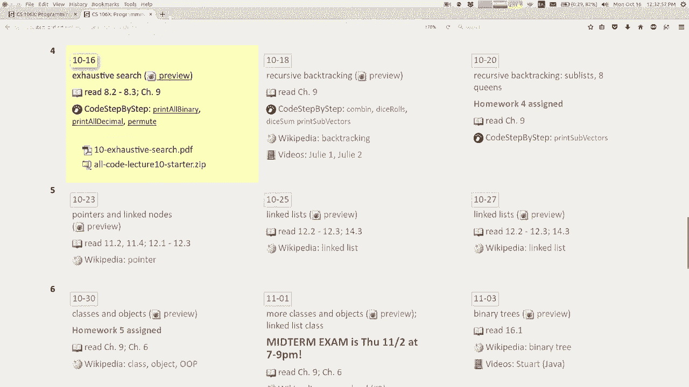

---

## 概述 📋

回溯是递归的一种特殊形式，用于解决需要探索多种可能性的问题，例如排列组合、密码破解等。其核心思想是：在每一步做出一个选择，然后递归地探索后续选择；如果发现当前路径无效，则撤销（回溯）上一步的选择，尝试其他选项。

---

## 穷举搜索的基本概念

上一节我们介绍了回溯的基本思想。本节中，我们来看看如何实现一种称为“穷举搜索”的具体方法。

穷举搜索意味着系统地探索所有可能的选项或值。对于简单的线性结构（如数组），一个 `for` 循环就足够了。但对于更复杂的嵌套或层次化结构（如目录树），递归则更为有效。

### 通用算法模式


以下是实现穷举搜索的通用伪代码模式：


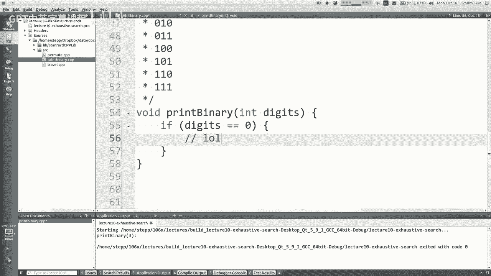

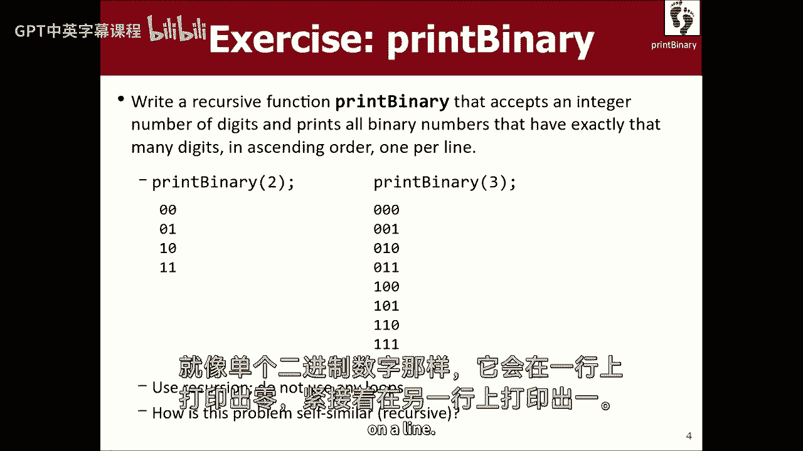

```cpp
void search(决策集合) {
    if (没有更多决策需要做) {
        // 基本情况：处理或输出当前累积的选择
        输出或记录当前结果;
    } else {
        // 递归情况：尝试每一个可能的单个选择
        for (每一个可能的选择) {
            做出该选择;
            search(剩余的决策集合); // 递归探索后续选择
            撤销该选择; // 回溯，为尝试下一个选择做准备
        }
    }
}
```


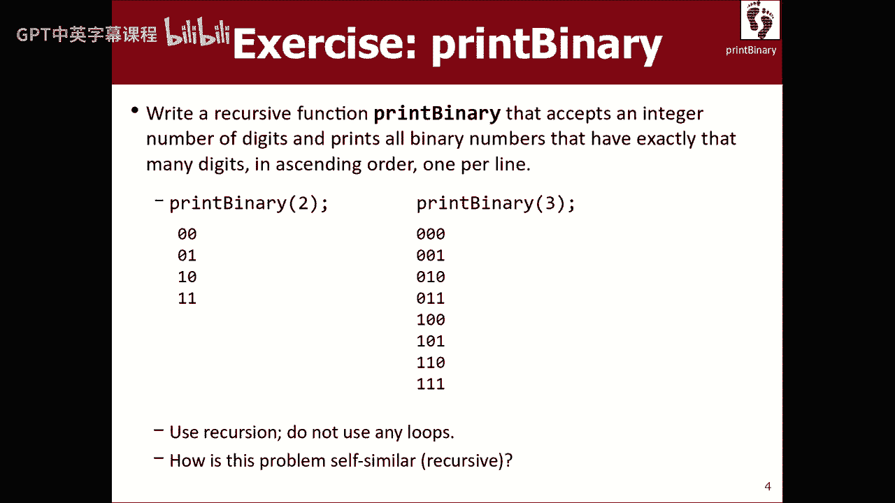

**关键点**：
*   **选择**：每个递归调用负责做出一个小的、局部的选择。
*   **探索**：通过递归调用，探索在当前选择之后的所有可能性。
*   **基本情况**：当所有决策都已做出（即没有剩余选择）时，我们到达“叶子节点”，此时处理累积的结果（如打印、存储）。
*   **回溯**：在 `for` 循环中，当一个选择及其所有后续可能性都被探索完毕后，算法会自然地返回到当前调用，然后循环会尝试下一个选择。这隐式地实现了“撤销选择，尝试下一个”的回溯过程。

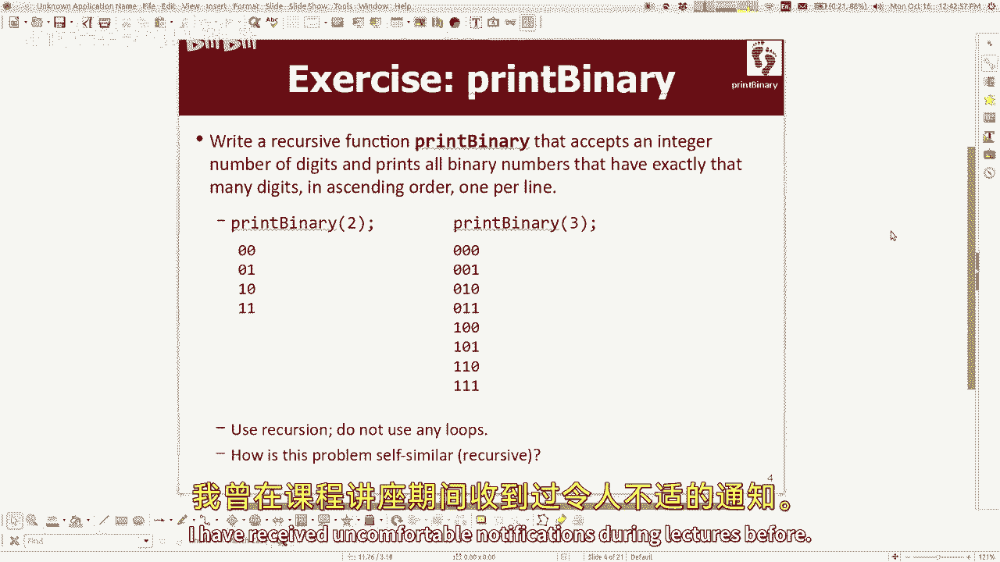


---


## 示例一：打印所有二进制数字

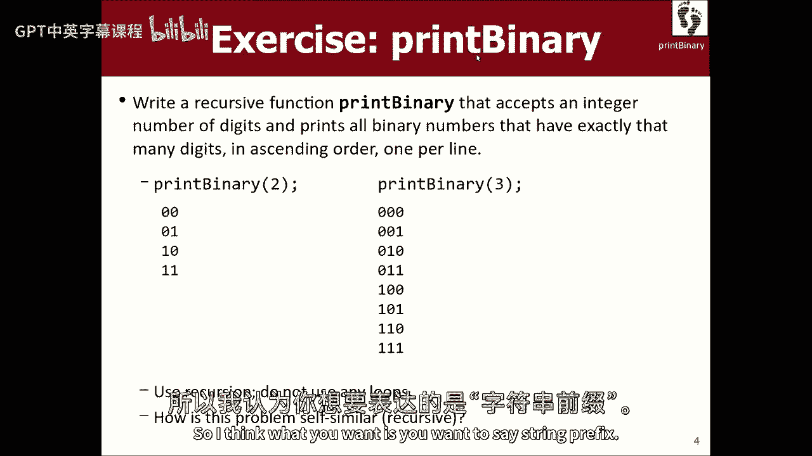

让我们通过一个具体问题来理解上述模式：编写一个函数 `printBinary`，打印所有指定位数的二进制数字（由 `0` 和 `1` 组成）。

### 问题分析

对于 `printBinary(3)`，应输出：
```
000
001
010
011
100
101
110
111
```

我们可以将问题看作是一系列选择：为每一位数字选择 `0` 或 `1`。递归调用负责填充下一位。

### 代码实现

```cpp
void printBinary(int digits, string prefix = "") {
    if (digits == 0) {
        // 基本情况：所有数位都已选择完毕，打印结果
        cout << prefix << endl;
    } else {
        // 递归情况：为当前位尝试两种选择
        printBinary(digits - 1, prefix + "0"); // 选择 0
        printBinary(digits - 1, prefix + "1"); // 选择 1
    }
}
```

**代码解释**：
*   `digits` 参数表示**还需要做出选择的位数**。
*   `prefix` 参数累积了**到目前为止已做出的选择**（即已生成的前缀字符串）。
*   当 `digits` 为 0 时，意味着前缀 `prefix` 已经是一个完整的二进制数，直接打印。
*   否则，函数会尝试在当前位添加 `“0”`，并递归生成剩余位；然后尝试添加 `“1”`，再次递归。这覆盖了所有可能性。


**调用树示意图** (`printBinary(2)`):
```
printBinary(2, “”)
├── printBinary(1, “0”)
│   ├── printBinary(0, “00”) -> 输出 “00”
│   └── printBinary(0, “01”) -> 输出 “01”
└── printBinary(1, “1”)
    ├── printBinary(0, “10”) -> 输出 “10”
    └── printBinary(0, “11”) -> 输出 “11”
```

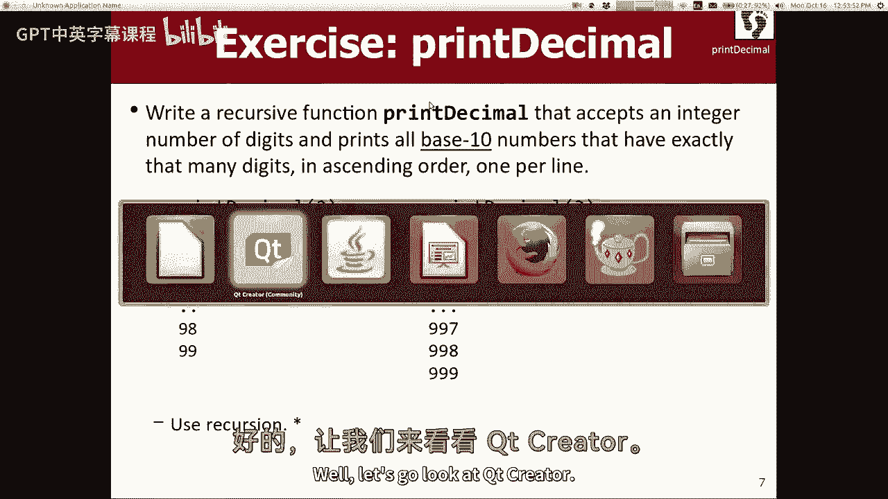

---

## 示例二：打印所有十进制数字

理解了二进制后，打印所有指定位数的十进制数字就非常类似了。唯一的区别是每位有 10 种选择（0-9）。


### 代码实现


```cpp
void printDecimal(int digits, string prefix = "") {
    if (digits == 0) {
        cout << prefix << endl;
    } else {
        // 使用循环来枚举当前位的所有可能选择
        for (int i = 0; i < 10; i++) {
            printDecimal(digits - 1, prefix + to_string(i));
        }
    }
}
```

**重要说明**：
这里在递归函数内部使用了一个 `for` 循环。这个循环的作用是**枚举当前递归层级的所有可能选择**，它并没有替代递归本身去解决“剩余位数”这个子问题。在回溯算法中，这种用于枚举局部选项的循环是常见且允许的。

---

## 示例三：打印字符串的所有排列

现在我们来解决一个更复杂的问题：打印给定字符串的所有可能排列（即所有字符顺序的重排）。

### 问题分析

对于字符串 `“Marty”`，其排列包括 `“Marty”`, `“Matry”`, `“Mayrt”` 等等。
思路依然是做出一系列选择：第一个位置选哪个字符？第二个位置选剩下的哪个字符？……


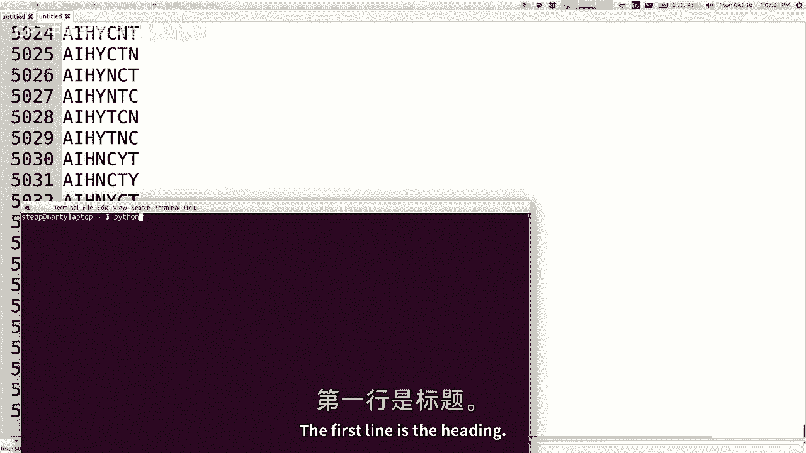

### 代码实现


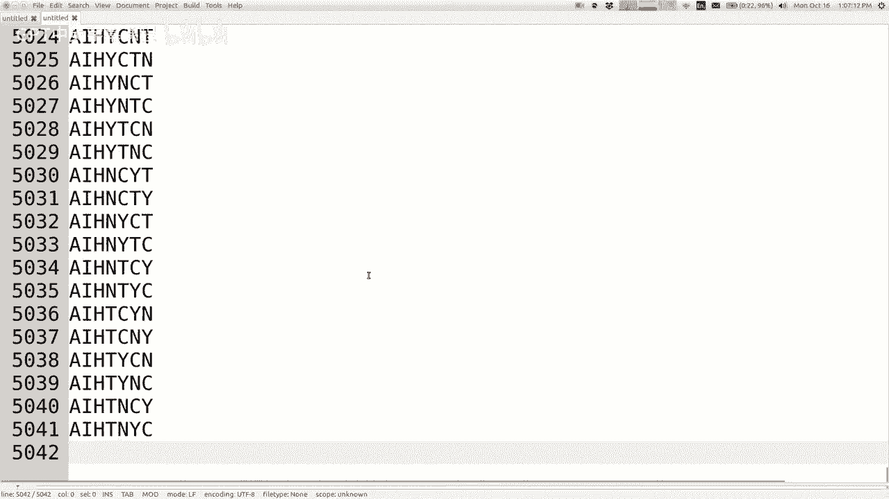


```cpp
void printPermutations(string str, string prefix = "") {
    if (str.empty()) {
        // 基本情况：原字符串已无字符可选，前缀即为一个完整排列
        cout << prefix << endl;
    } else {
        // 递归情况：尝试将原字符串中的每一个字符放在下一个位置
        for (int i = 0; i < str.length(); i++) {
            char chosen = str[i];
            // 从原字符串中移除被选中的字符
            string remaining = str.substr(0, i) + str.substr(i + 1);
            // 递归构建剩余部分
            printPermutations(remaining, prefix + chosen);
        }
    }
}
```

**代码解释**：
*   `str` 表示**尚未被选择的字符集合**。
*   `prefix` 表示**已确定的字符顺序**。
*   循环遍历 `str` 中的每个字符 `chosen`，将其加入 `prefix`，然后从 `str` 中移除该字符得到 `remaining`，再对 `remaining` 进行递归。
*   当 `str` 为空时，`prefix` 就是一个完整的排列。

---

## 进阶：收集结果而非直接打印

前面的例子都是直接将结果打印到控制台。有时我们需要将结果（如所有排列）收集到一个数据结构（如向量 `vector`）中，以便后续处理。

### 实现方法

直接修改递归函数来返回集合可能很繁琐。一个更清晰的方法是使用一个辅助函数，并通过引用参数来传递结果集合。

```cpp
// 辅助函数，通过引用参数 results 收集所有排列
void permuteHelper(string str, string prefix, vector<string>& results) {
    if (str.empty()) {
        results.push_back(prefix);
    } else {
        for (int i = 0; i < str.length(); i++) {
            char chosen = str[i];
            string remaining = str.substr(0, i) + str.substr(i + 1);
            permuteHelper(remaining, prefix + chosen, results);
        }
    }
}

// 主函数，提供干净的接口
vector<string> getPermutations(string str) {
    vector<string> allPermutations;
    permuteHelper(str, "", allPermutations);
    return allPermutations;
}
```

**设计思路**：
1.  `getPermutations` 是面向用户的接口，它创建一个空向量，然后调用辅助函数。
2.  `permuteHelper` 执行实际的递归和回溯逻辑，并通过引用 `results` 修改同一个向量，将所有找到的排列添加进去。
3.  这种方式避免了使用全局变量，并且适用于多种编程语言。

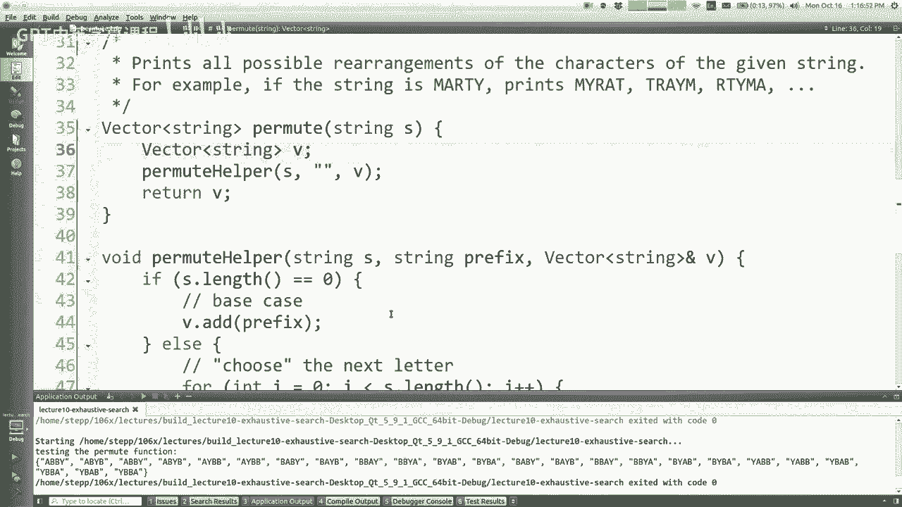

---

## 总结 🎯

本节课中我们一起学习了**回溯**和**穷举搜索**的核心技术：

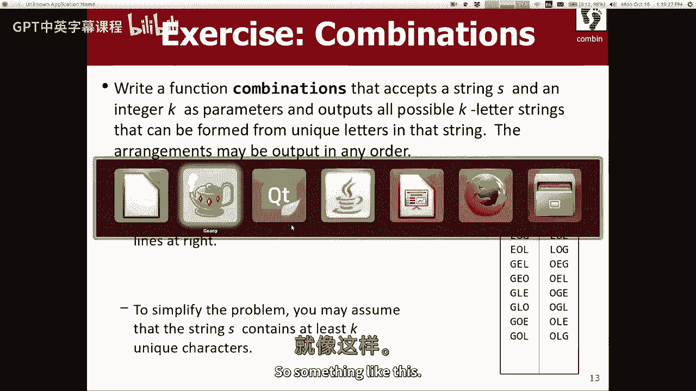

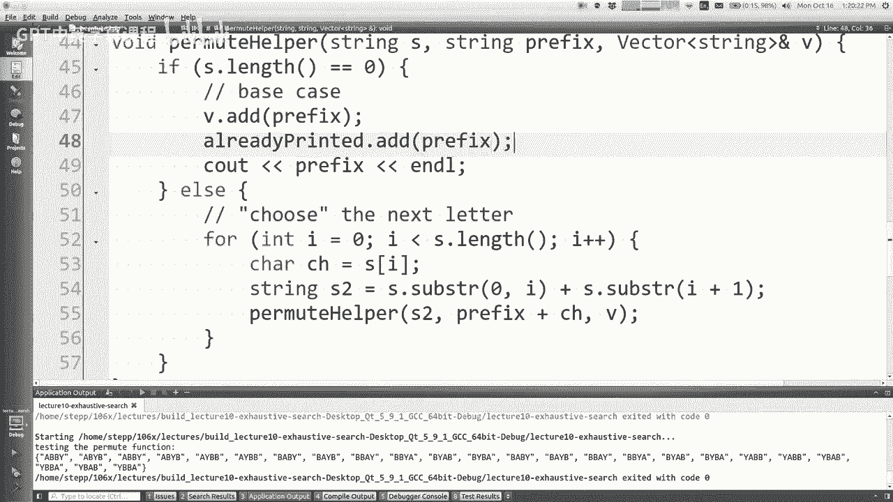

1.  **核心模式**：通过递归做出系列选择，用循环枚举当前步骤的所有选项，通过函数参数传递累积状态，在无选择时处理结果。
2.  **关键区别**：此类递归的**基本情况**通常意味着“已构建完一个完整候选解”，而非解决一个原子问题。
3.  **应用**：我们实现了打印所有二进制数、十进制数以及字符串排列的算法。
4.  **结果收集**：学习了如何通过辅助函数和引用参数将递归产生的结果收集到容器中，而不是直接打印。

回溯是解决组合问题、约束满足问题（如数独、N皇后）的强大工具。掌握它的关键在于大量练习，亲自动手在空白屏幕上实现算法，理解每一步选择如何展开成一棵搜索树，以及如何在这棵树上进行深度优先探索和回溯。