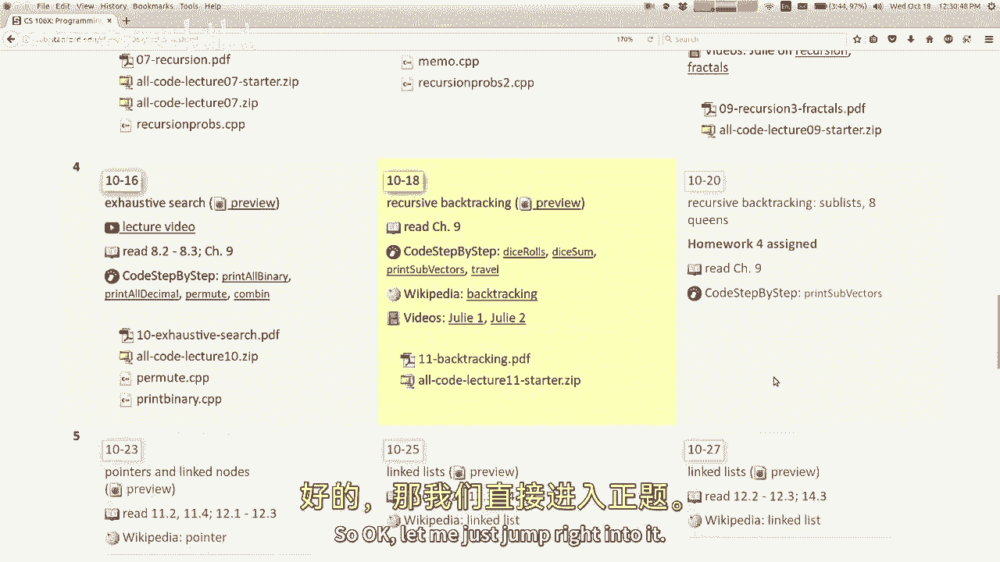
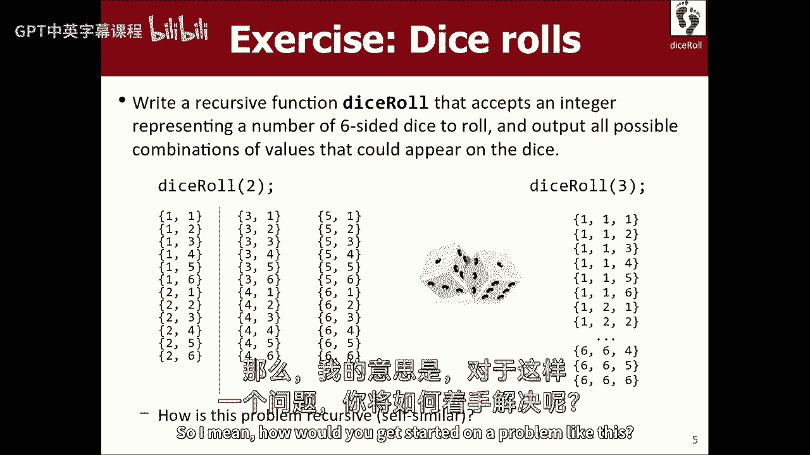
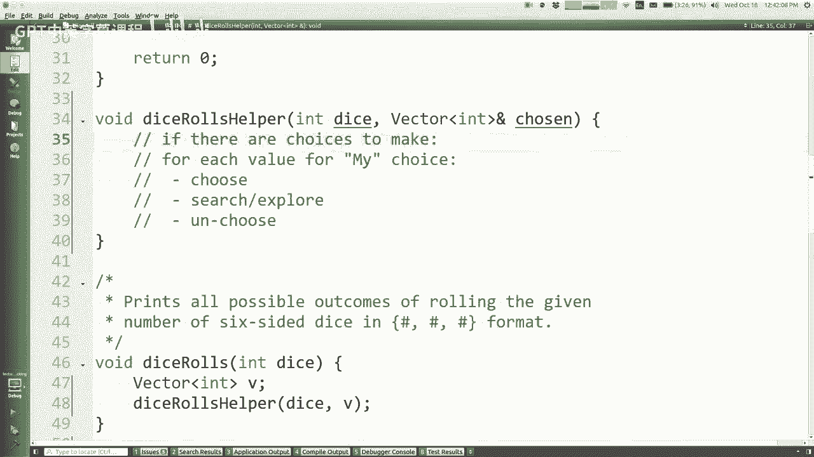
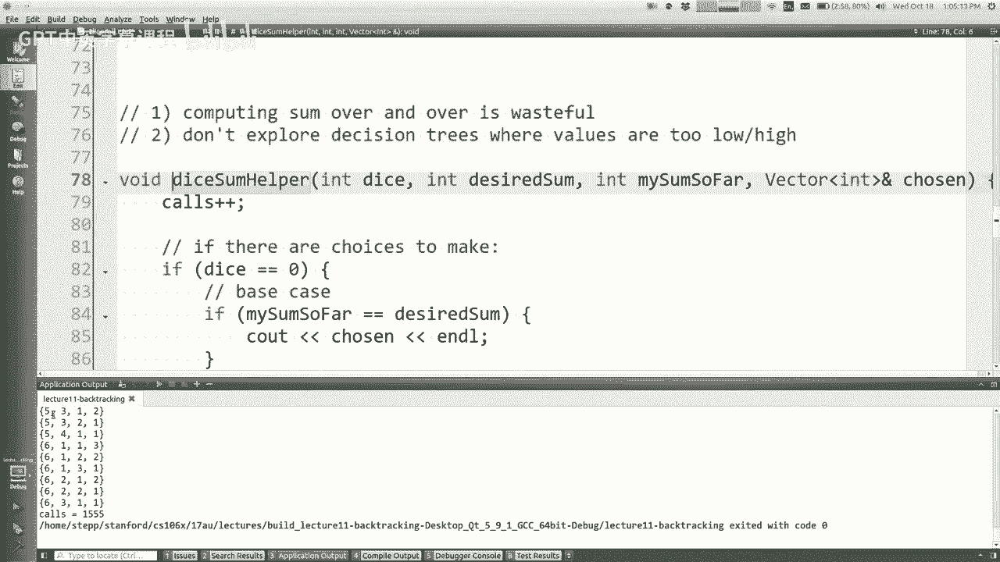
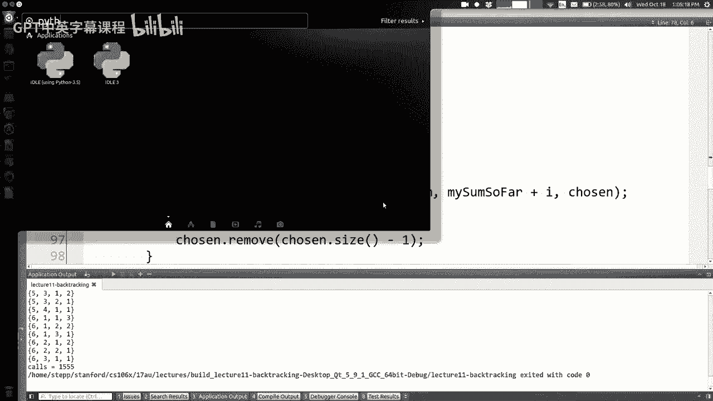
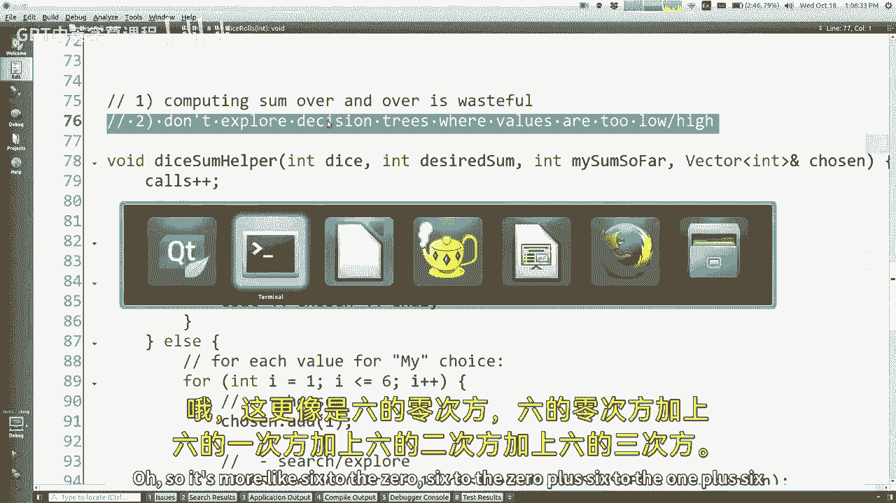
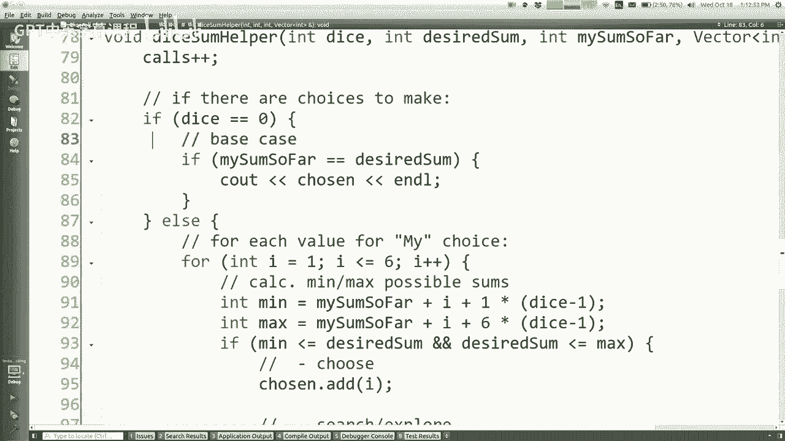
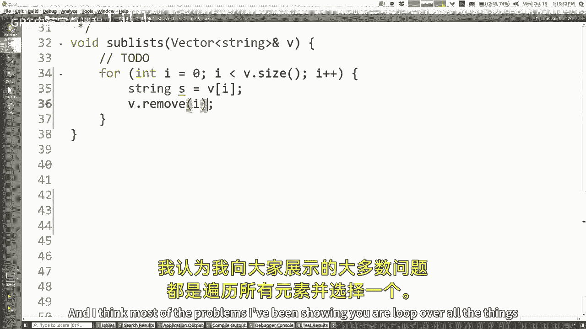
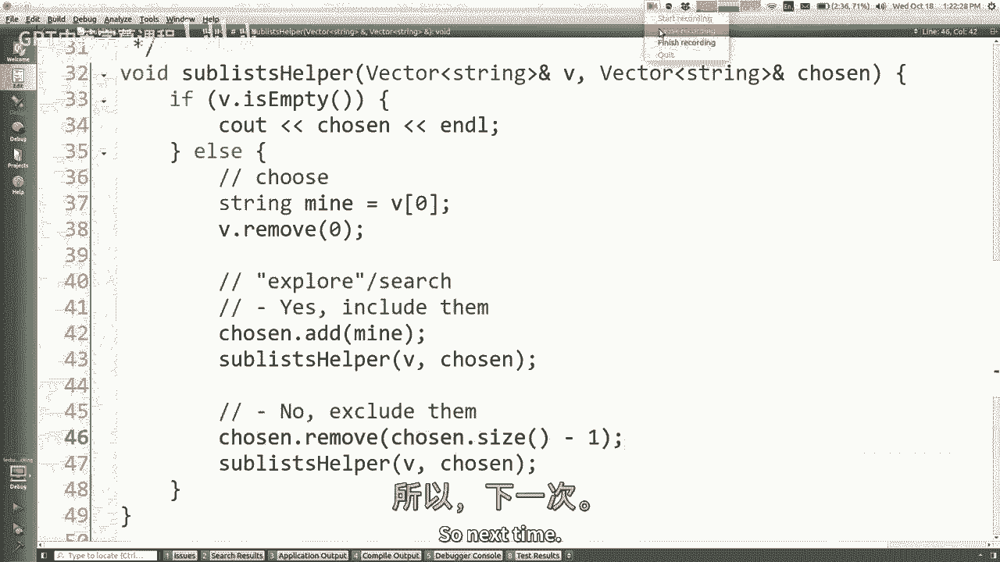

# 【编程抽象方法 cs106x 2017】斯坦福—中英字幕 - P11：Lecture 11 - Backtracking - 加加zero - BV1By411h75g

欢迎光临，今天是星期三，现在是第四周，我们今天要做一个关于递归回溯的讲座，我们周一开始的更多详尽的搜索内容，星期五作业四出去，你有时间做作业，这将是一项难得的任务，你要花一个多星期的时间来完成。

因为几周后就要期中考试了，所以好吧。

让我直接跳进去，我没有什么要宣布的，我不认为今天，所以我们来了一次又一次，我们在看书，如果你读了这本书，这些材料主要来自书的第八章和第九章，所以这是一个很好的参考，可以查看更多的例子。

回溯是我们上次讲的一个特例，彻底的搜索，所以让我再次提醒你，我再问你一次，我猜什么，那详尽的搜索是关于什么的，做详尽的搜索意味着什么，所以看看所有的可能性，也许是解决问题的空间，你可以做出选择的空间。

或者类似的东西，是啊，是啊，绝对的，一般来说，你能告诉我，或用于执行穷举搜索的算法策略类型，递归的，就像我在周一的课上使用了一些术语或一些常见的模式，你能想到那些东西吗，是啊，是啊，尾部递归。

哦有趣好吧，我想当你说尾部递归的时候，你说的是以某种方式进入下一个电话，但我不认为你必须利用这一点，做一个彻底的搜索，我是说，我在找一些有点不同的东西，你有什么想法，嗯，有一堆选择要做，代表了一种选择。

是啊，是啊，每次通话，每次递归调用都会做出选择，然后继续下一个递归调用，它将使更多的选择正确，所以这是一个选择东西的想法，然后探索或寻找可以跟随这个选择的东西，这就是详尽搜索的一般模板，基本情况是。

如果没有更多的决定要做，我们停下来，或者我们打印我们决定或选择的，或者类似的东西对吧，我刚刚谈到了基本情况是如何不同的，对基本情况有不同的思考方式，当你彻底搜索，基本情况不像，哦。

你让我解决一个简单的问题，所以我现在就解决它，不完全是那样的，更像是，啊，在我面前的电话已经做了很多工作，现在我们做完了所有的工作，所以我要打印一些东西，或者我会归还一些东西或类似的东西。

所以基本情况是这样想的，现在这是对每个选择的详尽搜索，尝试一下，然后寻找可能跟随这个选择的东西，好啦，那么现在回溯得很好的是什么，这是一种策略，一种算法策略，在那里你找到问题的解决方案。

通过尝试部分解决方案，看看它们是好的、正确的还是有希望的，如果他们不正确或不合适，你解开它们，回到你来的地方，你走回头路，它非常类似于穷尽搜索，不过，穷举搜索有点像回溯算法，在每个解决方案都合适的地方。

你只要把他们都找出来，你得一一列举，你得把它们都打印出来，你得把它们都放在一个向量里，回溯就像，我想去看看所有的解决方案，但有的不好，有的好，我想留下那些好的，所以这有点像穷尽搜索加过滤，你可能会说。

我们称之为蛮力技术，因为它只是检查一切，或者至少它确保它已经考虑到了一切，您经常使用递归来执行此操作，虽然我不知道我是否真的说过这句话，当我们刚开始学习递归的时候，但是你知道。

递归的思想并不比像循环这样的东西更强大或更强大，您实际上永远不需要递归来解决编程问题，你不用递归就能解决每一个问题，但是由于这些算法的策略通常是自相似的，递归通常是为它们实现解决方案的好方法，是啊。

是啊，两者有什么区别，回溯搜索和穷举搜索的区别在于穷举搜索，一旦我们到达终点，就像我们试图想出所有的四位二进制数字，或者我们试图想出一个字符串的所有排列，一旦我们到达终点，一旦我们选择了所有角色的顺序。

或者数字的所有位，没有坏数字这回事，不良排列，所以我们得到一个排列，然后我们把它打印出来，或者我们储存它，或者随便什么，所有的终点都很好，终点，我们只想把他们都找出来，回溯就像有些端点不好。

我不喜欢他们，我不想把它们打印出来，我甚至不想处理它们，如果我能避免，但我一会儿会谈谈你怎么能做到这一点，反正，有很多可以使用回溯的例子，有很多游戏，有很多涉及回溯的编程问题。

我认为最物理上可以理解的例子是如何走出迷宫，比如，基本上如果你在一个有墙壁的二维迷宫里，你可以向不同的方向移动，你想弄清楚，我如何走出迷宫，我是说走出迷宫有不同的策略，也许你听说过右手规则什么的。

但是逃离迷宫有不同的方法，但一个策略是尝试所有不同的方法，试着往上走，如果成功的话，然后你就出来了，不然下去试试，如果不行的话，试着往左走，如果不行的话，试着往右走，这些都是递归的东西，试着从左边逃跑。

试着从我上面逃走，如果我走上去，我走上去，而且是死路一条，我需要回到我原来的地方，你回来的方式是通过这种回溯过程，所以无论如何，这种尝试解决方案和毁灭的想法，如果你不喜欢你的结局，这就是回溯的想法。

并建立在详尽的搜索基础上，所以好吧，如果这是你如何进行详尽搜索的模板，回溯的模板几乎完全相同，看着我的冷静消退，哦哇哦，等一下等一下，太糟糕了，我得再做一次，Linux无法处理我的幻灯片有多酷。

我想是的，我强调了不同的部分，只是你选择了某样东西，然后你搜索了这个选择之后会发生什么，但是当你搜索完关于选择的后续信息后，你必须撤销，你必须撤销你所做的选择，你这么做是因为你知道。

也许这个选择在某种程度上改变了世界的状态，你决定不喜欢这种修改，我是说这里可能会有更多的细节，也许我想说的是，如果C后面的决定是糟糕的，然后你看，我的意思是，你如何编码这个是有变化的。

但关键是它基本上是一个穷尽的搜索算法，但有时你有一些逻辑，这就像撤销了你以前选择的东西，我想当我们看到一些问题时，你就会明白了，你就会明白我在说什么了，好啦，这里有一个快速的例子，你需要机械地回溯。

即使所有的结果都是我们想要打印的，但我会得到一个，我们不会在一秒钟内打印出所有的结果，所以这是一个叫做掷骰子的问题，我只想打印出你能做的所有可能的角色，两个六面骰子或三个六面骰子或任何权利。

所以我认为很明显，问题是自我相似的，就像，如果查看变量为1的输出，1的好规则是1 2 3 4 5 6谢谢，二的规则是基的输出，反复一的规则，前面有一个，前面的两个和三个，所以这有点像。

你可以看到n的骰子滚动与n的骰子滚动有关，减一，现在这里有一种自相似性，这和我一分钟前说的不完全一样，我是说有些路是好的，有些结果是好的，其他人是坏的，倒退的，这个问题并不完全有这一点，所以。

但我要说的是，我会用这个来解决一个问题，我们要打印所有的组合，所有的骰子，所以我的意思是，你怎么开始处理这样的问题。

如果你必须在这里掷骰子，它是，如果你要掷那么多骰子，并使用递归打印出它们可以拥有的不同值，您可以将此看作是一个详尽的搜索问题，如果你想想代码，上次我们打印二进制文件的时候，我们做了排列。

我们必须考虑一些我们传递的参数，从一个电话到下一个电话，我们对那些道具的参数做了什么，把你的手举起来，是啊，是啊，是啊是啊，所以在其他问题中，我们做了一个额外的参数，叫做前缀。

我们设置这个参数的原因是为了跟踪二进制数字，或者以前调用选择的字符串字符，对，我们应该写的标题没有这个参数，但我们加了它是因为我们决定需要它，这通常是这些问题的主题。

我们需要一些额外的参数来跟踪以前调用所做的选择，所以这里也是这样，所以我想我们真正想要的是一种叫做掷骰子的方法，帮工，你说的掷骰子，传一个矢量，你知道我们可以试着用一根绳子，前缀什么的。

但我想现在的情况是，我们选择一些骰子号码，我们想记住所有的骰子号码，我们最终想把它们像这样打印出来，看起来就是这样，当你打印一个矢量或某种集合时，所以也许储存角色，我们选择了一个整数向量。

那可能是个好办法，所以int向量选择了这样的东西，通常当我们将集合作为参数传递时，我们通过参考传递它们，所以所有的电话都将共享集合，我想我也想在这里做，嗯，如果你想开始，你基本上没有双关语。

你想你想让这个家伙，叫那个家伙来这个家伙做所有真正的工作，右上角的那个，所以基本上我只想叫骰子卷，帮助者，我想把我的骰子数，然后我想通过某种矢量，我的意思是你只需要在这里声明一个向量，int v向量。

然后超过他，他将被选入下一轮，或者类似的东西，好的，空向量，对，你明白的，所以这样做的唯一目的是启动这个，给他一个矢量，在他所有的电话中，人们一直在问静态矢量，我不想要静态矢量，因为只要打完一个电话。

我想让矢量消失，基本上，所以这就是为什么我不想要静态向量，好啦，现在这个帮手将是真正的工作，所以记住这里的模板，如果每个人都有选择，你知道我们只有一个选择，所以对于我的每个值，选择该值。

我将搜索或探索选择该值后会发生什么，当我回来的时候，我不会选择那个值，那么我怎么知道，如果有选择要做好，2。在这个问题上我们有什么疡？什么样的，每次调用递归函数要处理多少工作量，它选择一个模具的值。

所以如果我掷三个骰子，他们可能会有三个电话，他们每个人都会从六个骰子中选择一个的价值，第一个调用将尝试这里涉及一个的所有选项，它会尝试所有涉及2的选项，它会尝试所有涉及三的选项。

这第二个调用将尝试所有的选项，涉及一个在它的位置到两个，在它的三个点在它的点，第三次调用将尝试所有在这里有一个或在这里有两个的选项，三个在这里，所以每一个调用都在处理它的所有可能性。

好的，好的，所以如果要做出选择，你怎么知道，如果有什么选择要做好，这个骰子的数量是你需要选择正确值的东西的数量，就像如果骰子数为零，这将是一个基本情况，但也许我会回到那里做什么，否则。

对于我选择的每个可能的值，都有选择要做，我的选择是我在管理价值观，我可以选择的东西是数字1到6，对呀，我会试着选择那个号码，然后探索随之而来的事情，我如何表示我正在选择那个数字，把它放在向量里，是啊。

是啊，绝对如此选择点，添加值，我和现在让我们来探索所有可能跟随这个选择的事情，对呀，所以探索，搜索，这通常是递归部分，所以我叫掷骰子，帮工，我首先传递什么参数，骰子减去一，因为我在处理一个死亡。

所以剩下的电话少了一个死亡，他们需要处理的骰子，我将通过相同的选择向量，因为我们共享一个选定的向量，现在当我回到这里，我写了《不可选择》，我认为这个想法就像，我选择我的人的价值是1，然后我探索。

但现在我回来了，我想试试会发生什么，如果我的人有价值2，我不想既有价值一又有价值二，所以我想撤销这个，这样我就可以和我两个一起再做一次，我有两个，所以选择的方式正好相反，你以前的所作所为。

当你做选择的时候，所以这将被选择移除右，小心点，虽然remove需要索引，你可能会认为就在那里，但这意味着我从向量中去掉了i的值，但这不是remove的参数，它不需要一个值就可以删除。

它需要一个索引来删除什么索引是我的值，我想移除，它是向量中的最后一个值，因为电话越来越多，他们把东西放在矢量的末端，所以它会选择点大小减去一，但是等等，是这样吗，因为这些调用都是在向量的末尾添加元素。

所以我的元素还是会在最后，就在这里，你不觉得这些人，伙计们会追杀我的，那么为什么这是对的呢，你觉得怎么样，否，你是说我写错了代码吗？你是说我不是一个好的程序员，你认为这是对还是错，因为每一个电话。

啊是的，你有很好的递归，禅宗，你所说的完全正确，这个力很强，你说的是对的，你说其他电话都有相同的密码，所以他们在添加东西和探索东西，但当他们的电话从它所做的事情中回来时，他们要去掉他们加的骰子。

所以理论上每个电话都会自动清理，你明白吗，就像任何一个电话的净结果，当调用完全完成并返回时，它没有比以前放更多的骰子，所以每次我添加一个和删除一个，没有不平衡，没有那个就没有办法得到这个，反之亦然。

所以在这家伙做完之后，我知道矢量和之前一样，所以我现在把最后一个去掉是对的，如果你还不相信，我去打印，我们可以检查一下，但这是对的，是啊，是啊，继续吧，因为我们正在处理冒险中的步骤，每次，哎呦。

我们能用一个链表，嗯，好消息是非常正确的，矢量的远端是快速，前端是慢的部分，因为前端涉及到换挡，NN没有任何移动，如果我们把指数0加起来，我完全同意，也许矢量不如链表好，这是一个很好的观点，但这没关系。

我觉得可以，所以这很接近，但还有一件事我们还没写，是基本情况，如果我们得到零骰子，记住，基本情况意味着前面的调用已经完成了工作，现在没有工作可做了，当我们到达这里时，所有的值都已经被选中了。

那我该怎么做，是啊，是啊，只需打印出选定的矢量在一个漂亮的，是啊，是啊，把我们选的打印出来，把我们选的骰子打印出来，它应该用花括号打印它们，这正是，向量的默认打印如下所示，我只能看到被选中的人。

所有这些都是基本的情况，让我们，我们试试看，所以，哦函数f做，我有一个错别字，少了一个卷发，哦耶，是啊，是啊，我这里没有卷发，谢谢，编译，我对代码中其他地方的一些未使用的东西有一些警告，没关系，嗯。

运行它和什么，我得到了什么，一一一二，我想它起作用了，你看，看起来很不错，呵呵，只是如果再次，如果你，如果你想更明白一点，有点想知道发生了什么，我真的觉得你想做的事，我喜欢包括，这是可选的。

但是您可以包括这个递归，然后在这里，当你做每一个帮手呼叫，你可以说，看出去，助手空间骰子等于加骰子加选择等于，选择的加号加号和所有加号，注意电话，然后让我们看看，哦，天哪，大量输出，大量输出，没关系。

嗯，但让我们看看它，所以如果你用三个骰子打电话给帮手，没有什么是选择的，我们称之为二骰子，你选择了一个，然后我把它叫做一的冰，我在某个时候选择了另一个，我把它叫做零骰子，这导致了大量的输出。

然后这个人回到这个人身边，他现在用一个二而不是一个，所以这个人回到这里，这家伙继续他的一是二，所以从一到六的那种被他尝试过，那这家伙就完蛋了，所以他回到这里，所以这个人试着给第二个人二分。

所以我的意思是，你可以用这种格式观看呼叫树，以及向左缩进的行的输出，这些是输出线，这些是我们每次遇到的基本情况，现在，这在很大程度上仍然是一个详尽的搜索，但我必须做这一步，撤销我所做的选择。

所以我想谈谈这个，我们上次做的问题，就像打印二进制数字，打印十进制数字，我们不必在那里取消任何选择，我不知道你是否真的记得那个代码是什么样子的，你可能会想，比如为什么那个。

为什么我们不必在那个问题上做出选择，但就一会儿，我今天不打算多谈这个，但让我重新打开类似的排列什么的，所以记住我们写了置换然后置换，找了个变态帮手，我们通过了一根绳子什么的，上面是我们的实际代码。

在这里没有不选择的余地，你知道他们有点像，选择此字符，探索置换其余部分，在那之后，这里没有像“不可选择”这样的权利，为什么没有脱鞋，是呀，如果我们不打包，是啊，是啊，因为我们不是通过引用传递字符串。

我们在做一个新的弦，它是我们的前缀，加上另一个角色，如果这是对字符串的引用，我们在上面加等于字符，然后在这个帮助回忆之后，我们必须做-等于或不-等于，但是我们得把这个字符去掉，去撤销我们的选择。

所以真的，这是一个实现细节，我们通过引用传递向量，我们按值传递字符串，你可能会说很好，那么也许我们应该通过值传递向量，然后我们就不必做不可选择的权利，也许回到这里，从今天开始在我们的代码中。

也许我们应该删除这个符号，我不喜欢那样，因为我想这意味着我们要做很多很多，大量矢量拷贝，我们在另一个代码中复制的字符串，但是弦是非常小的东西，向量更大更笨重，我真的不喜欢，我们会做很多很多的递归调用。

每一个都会复制一个越来越大的矢量，所以无论如何，这是一个彻底搜索的问题，但它必须在每个步骤之后执行清理步骤或撤消步骤，有多大，我应该喝吗，做个点赞，你应该停止像没有一样传递它，哎呦，原来如此，是啊。

是啊，比如在什么时候复制字符串会变得太贵，嗯，我是说这有点武断，坦白说，我不知道一个字符串到底使用了多少字节的内存，与给定大小的向量的比较，但我知道字符串元素是一个接一个的字符，向量元素是每个4个字节。

所以至少有一个四x，那里发生了一些事情，矢量内部还有其他场，所以我不知道，门槛在什么之前，你会在乎这个的，我的意思是坦白说，如果我删除符号，可能没那么糟，但我是说总的来说，如果你要这么做，这些深度探索。

也许你在探索棋步，你想写人工智能解棋盘，那玩意儿会有数以百万计的电话，或者有这么多的动作在移动在移动，就像，如果每个递归调用都在复制向量，你只是沉沦了，你的算法可能非常非常慢，即使只有矢量。

每个矢量只有十个或十五个元素，只是太多了，所以我想这就是我们的工作方式，这是IT字符串的最佳实践，你知道的，如果我们玩棋盘，也许我们可以通过引用传递一个字符串，没有，因为琴弦是超长的。

但是因为我们有很多电话，我想这可能就是，嗯，好啦，反正，那是掷骰子，现在呢，我什么都没做，嗯，本期的，就像，有些路不好走，或者一些正确的事情，因为我想我在说那个，穷尽搜索和回溯是有区别的。

有时你会得到一个你不太喜欢的结果。

所以我们来谈谈这方面，如果我们修改这个呢，啊，这只是电话的照片，所以你不需要看到你们都很好，嗯，来吧，来吧，来我的节目，连动画都做不好，好啦，管他呢那我在哪，让我们做一个，我不仅想掷骰子。

但我想展示我滚动的两个数字，加到给定的总和，就像一套或三种染料的总和，加起来是七，你知道这种可能性吗，好啦，所以我认为做一个最小的改变并不难，把我们的掷骰子代码转换成，所以，我要做到这一点真正的快。

然后我想喜欢，在那之后谈谈代码有什么更好的地方，所以让我复制一下，我将删除此打印语句，但我这里有个标题叫骰子和，它是，所以我想我想做的是，我想写虚骰子和，帮助者，然后我想粘贴，是啊，是啊。

现在我要说的是int v的向量，然后我要叫戴斯帮手，骰子期望和逗号v，所以这种方法并没有什么作用，就像另一个，但现在我想把注意力集中在这里的帮手身上，所以我认为最重要的是我们不叫掷骰子助手。

我们叫戴斯帮手，我们必须通过想要的总和，还是那么好，现在最小的变化是什么，这个代码说它的名字是骰子和，但它根本不看总数，所以我认为最小的变化就像，我们并不总是想把这件事做好，其中一些现在是坏的。

它们加起来不对，好吧好吧，我提前想到了，我为今天的课做了一点准备，如果要得到向量的内容之和，这里有一个，这里有一个函数，我写了求和，它需要一个向量，它只是循环所有的ins，只是把它们加起来，它回到一些。

只是，我只是不想我的手指，我有很多腕管，我想把代码打出来，所以我只是为你写了代码，所以我想在这个帮手里，我只想说，如果所选向量中所有元素的和是所需和，我会刊登事实，否则，我不会的，所以这可能会奏效。

所以让我们去主楼一会儿，确保梅因现在就打电话，主要呼叫骰子卷，我要把它评论出来，如果选择行并单击控件，削减它不评论或评论他们，所以现在我在做骰子，三逗号七之和，所以让我们，我不知道那是什么。

让我们运行这个然后好，所以我想它起作用了，也许我搞错了，也许那个问题太容易了，事实上，我甚至没有请你帮忙，我只是一个人做的，我想它只是在那里让我感觉很好，好像我真的很聪明，嗯好吧，但我要说。

我们所做的并不是一个理想的解决方案，它的功能不正确，到目前为止，我们的解决方案有哪些不理想的地方，是呀，也许不是像一些，当你这么做的时候，就像递归的东西，你可以减去所选的，在战争结束时，准确的说是。

这是一个有趣的转折，我喜欢你的建议，所以你说，而不是在最后把所有的东西加起来，也许我可以在这里传递一个越来越小的金额，把它削减到零，你为什么喜欢那样，更好，否，你说的对，我喜欢你的主意。

我的意思是我认为关键是做这件事需要一分钟，这就像大O的n和我们要做到这一点，很多时候，每次我们做一个基本案例，我们要这么做，这不是很多复杂的计算与一些，它是N的大O，如果我们只是跟踪一个和。

不知何故或将这笔钱削减到零，也许那样能达到同样的目的，不必一遍又一遍地循环所有这些向量，所以我喜欢这样，让我们马上就做，你也有不同的建议吗，如果你现在的歌是二，比你想要的歌还大，没有理由迭代。

如果它太小了，然后就像，它是，它是加上潜在的，那我们就永远吃不饱，是啊，是啊，是呀，所以这两个都是，我不是，没有一个正确的答案，你们两个都在这里，嗯，这个代码在浪费时间，所以在它的一些叫声中。

就像你说的，有时我喜欢，如果我在滚动，如果我想掷四个骰子，我想得到一个正好是八的和，好啦，四个骰子，八和，如果我掷前两个，我选6，没有办法得到八的和，如果我已经有十二个了，对呀。

但是这段代码正在愉快地探索所有这些，然后选择不打印它发现的东西。

你明白吗，所以说，给大家看一下，我想我有一张照片，在这个例子中，我有三个骰子，我想试着看三个骰子加起来是五的和，所以好吧，如果我选六个作为第一个，你不能把一个负的卷对，所以我的意思是。

即使在那里做那棵树也没有意义，所有的电话，有一大堆电话会在那下面，完全是浪费时间，就像这里，如果我选一个，事实上，我应该把这些涂成更多的红色，因为如果我有两个骰子和一个1和一个4，我已经有五个了。

所以下一个染料必须至少是一个，对呀，所以其实这个也应该是红色的，我还没有把这棵树弄得足够红，如果有什么，你发现这是个问题了吗，我想你也指出了这种情况发生在事情的另一面，如果我想要四个骰子，加起来17个。

我掷两个一，那么即使剩下的两种染料是6，我不能一直加到七十，对呀，所以我不能，这就像，如果你在任何一个方向上都太远，那么您的代码就是在浪费时间，我们需要担心的是，就像有几个例子出现了一到五个。

一一五五一一二，比如这个例子中的1-1-5和5-1-1，我只是假设这些是不同的，把它们都打印出来也没关系，如果我在乎，那些是一样的，我可能会想要一些排序有序的收藏，或者是那些会出来的东西。

就像我们做了一个字谜的例子，字谜都是一样的，因为我们把信分类了，我可能想在这里做一些类似的模糊的事情，在那里我将与那些相等的，我不会再探索这些了，是啊，是啊，会有这种变化吗，我会担心的地方，2。

对于这个问题我宁愿不考虑它，但是但是是的，嗯反正，其中一些都是很好的观察。

你的第一个观察是一遍又一遍地计算总和是浪费的，你的第二个观察是不要探索，比如说树，有时我们称它们为调用树或决策树，数值是低还是高，才有可能得到正确的答案，那么我们怎样才能把这些事情做好呢？

我想先做你的总结，所以我想你说的是，如果我选择我为我的死，所以我记得我在努力把想要的15或什么的总数弄对，所以现在我的染料，我选三个，所以剩下的骰子，我可以告诉它。

我在寻找一个想要的12而不是15的总和，我可以把它拔出来，所以我认为有两种方法可以做到这一点，你可以把这个人减为零，或者你可以以某种方式保留另一个int，那是在计数，看看它是否达到所需的金额。

这些都一样好，每种方法都有优缺点，我想如果你不介意的话，我宁愿做我保留另一个int的那个，我数了一下，我马上告诉你为什么，我想这对事物的边界的另一个建议很有帮助，但是，如果我加上一些东西。

比如到目前为止，我的和，换句话说，就像这是当前所选向量中的东西的总和，所以从某种意义上说，这是完全多余的信息，因为我已经有了那个矢量，我可以在上面循环得到总和，但我为什么不把这笔钱单独存起来呢？

这样我就不用绕圈了，我不必把工作做对，所以说，换句话说，在这里当你第一次开始，到目前为止，你得到的总和为零，所以我会通过0，但现在在这里，每当我做递归调用时，我把什么作为到目前为止的和传递给下一个。

它将与这笔钱有关，对呀，不管之前的电话选择了什么，而现在，我选i，所以我应该做到目前为止的和，加上我对，加相等，嗯，加相等，将修改变量，我想我不想修改它，因为当循环绕着，我不希望它被添加。

所以我可以添加下一个，我每个人都绕着，我希望它是原值，加上下一个我所以所以我认为这是很好的现在，到目前为止我想要这个的目的是什么，这并不能优化代码，任何，你的意思是，我想现在在这里。

而不是说一些所有的选择，我可以说，如果到目前为止我的总和等于，好啦，所以那些是，这就像一个优化，就矢量上的循环而言，它加快了一点，那很好，好啦，所以我想我们做了第一个，我是说，我想我们应该运行它。

别让我弄坏了，但是哇，大乐趣，看起来我认为它仍然在打印正确的东西，好啦，所以我们现在做了第一名，我们现在做第二件事，嗯很快，我想做一个黑客来了解一些关于代码的东西，我想计算它当前进行了多少次递归调用。

所以就像在这里，我要做一个邪恶的全局变量，呼叫等于零，不不不不是这样的，千万别这么做，无论什么权利，嗯对，所以不要不要那样做，但我刚刚做到了，所以说，我想我可以做一个静态的，我什么都不知道。

但在这里我要叫骰子和，然后当我做完，我要打印它打的电话数，然后在计算电话数量方面，我要上去找这个帮手，我要说的是调用加基本情况递归情况，我不在乎，是个电话，好啦，所以我运行它，它打印了所有的东西。

上面写着二百五十九，好吧好吧，也许你想一分钟，为什么是二百五十九，不过，好吧，所以这很酷，二百五十九呼叫正确，怎么样，如果是四个骰子，四个骰子，我数到十一什么的，让我们把那个电话注释掉，我们往左掷骰子。

我们跑吧，它打了一千五百五十五个电话，稍微超过它的周围，六次，上一个电话的号码，太巧了好吧好吧，我把它放回三个骰子，只是为了让它的产量少一点，是啊，问题，为什么它不做，为什么不是6比3，嗯，嗯。

让我们看看6的三次方是多少。

蟒蛇六次，六乘六。

所以说，216，原来是这么多，如果真的是，我觉得，因为我们实际上要打第四个电话让基本案例打印，你明白我的意思吗，就像我们选择三个骰子，然后我们用骰子设置为零进行第四次呼叫，还有那个，是呀，五个也是。

所以会是，但是是的，就像验证过的，所以我的意思是，应该是这个，但我是说这个案子只是一个，它不像是分支出来的，当然，但我们触底了，每次我们完成一条树的探索路径，应该是一个很好的样子，我们可以遍历树。

向上数节点，如果你想，我确实认为每次我们增加一个死亡，我们在这里大约上升了六倍，但是你看，我是说，我觉得重要的是，我想数一下我们一次保存的电话数，我们做了这个优化，我们称之为第二个。

所以第二个优化是，不要探索那棵树，价值太高的地方，哎呦，你举起手来，你对此有何评论？是啊，是啊，对不起，我想球的数量将是66个，哦原来是，更像是。

呃，六到零，六到零，一加六，二加六，六加三，是呀，这样好多了，这实际上正是它的电话数量，是啊，是啊，所以我用错了数学，谢谢你数学比我好，在这里你应该得到更恰当的感谢，因为i在范围内，一千。

是啊，是啊，无论如何，去接一零三和一零九，然后你会比我更擅长组合数学，好啦，所以我不想探索那些决策树，如果你不可能得到正确的答案，所以这是我正在做的部分，选择一个数字，然后探索，然后把它放回去。

我想我们需要某种，如果这里的陈述是这样的，如果这条路好，我想探索，但如果这条路不好走，我不想，嗯，我怎么知道这条路是好是坏，我怎么知道这是否可能，也许我会给你一个提示，你能帮我计算一下。

我能创造的最大价值，也许在这里，计算最少最多，你知道的，最小和最大可能和的排序，就像，最低金额是多少，如果我选择I作为下一个死亡，是的，到目前为止，加上数字，到目前为止，这是我的总数，另外我是说。

我想我会选择I作为我的死亡对吧，另外，接下来的事情我至少能做些什么，就像在所有的骰子上掷一个，减去剩下的一个骰子，对呀，如果我为自己选I，那你就跟着我吧，好啦，然后最大值是，我选i。

然后所有剩下的骰子都是高赌徒，他们都是六个对，好啦，所以现在我有了这些界限，我认为if语句更容易写，对呀，如果什么，那我应该这么做，如果需要一些负最小值，还是小于或大于max，是啊，是啊。

我想我想那很接近，基本上只要最小值和最大值，如果所需和在最小值和最大值之间，我想当我们想把这件事做好的时候，所以如果最小值小于或等于和，并且所需和小于或等于max，然后我想选择和探索，然后不选择右。

好啦，让我们试试看，还记得我们是怎么接到两个五九个电话的吗，然后我们接到了1500个电话，或者随便什么吧，让我们这样运行吧，因为一件事，我的输出正确吗，看起来我有，我有3个6号电话。

所以我认为这是打印所有与以前相同的输出行，三六，如果我回到四个骰子，电话会少得多，等等，不是那个，如果我把这个注释掉，把那个注释掉，记得我当时一千五百，我觉得，差不多现在是二百四十五。

所以它肯定消除了相当多的那些电话，所以在去掉那些我们不需要计算的和，删除这些调用，我们不需要制作这是一个更好的代码版本，它消除了一些开销和缓慢之类的东西，人们把太多的递归联系在一起。

所以关于家庭作业的问题，有时我会对你说，您的代码需要喜欢，通过避免坏的分支来修剪决策树，这就是我所说的，如果你知道你所到的地方，当你之前的电话无法得到回应时，您应该立即退出，而不进行更多的递归调用。

在那之后，你明白你有最后一个，就像田径一样，你不需要喜欢棕色，然后你不必做正确的事，所以我是说写这个代码的另一种方式，我想我会留给你自己玩，不是把总数传递到目前为止，把你选择的眼睛从这里拉出来缩小这个。

然后你只有三个参数，对我来说，在某些方面稍微改变了这个逻辑，在我的脑海里，这个版本有道理，但我认为我们用鳟鱼的版本完全没问题，你完全可以写问题来解决它，是啊，是啊，好啦，是的，是的。

因为我们在清除载体的时候，不管怎样，我们已经完成了这个功能，用静态变量做一个向量不是更有效吗，却没有一个，清理，所以最后就看你的了，好吧，又来了，就像我认为我认为你们，嗯，也许像静态变量，比我做得更多。

这就是静态变量的特点，就是，它将在递归完成后停留在那里，就像在电话完全打完之后，不管里面有什么东西，它都会留下来，现在你又说要把里面的东西拿出来，所以到最后会是空的，所以，也许这是好的，这很好。

我是说你可以这么做，我认为这些算法有不同的版本，你并不总是百分之百地，完美地清理矢量，如果你走进死胡同，你只是出于某种原因立即退出了整件事，现在矢量不是空的，所以我发现，还有一件事要记住。

静态变量在很多语言中都不存在，所以我不想教你太多的技巧，只有在C++中才能工作，你说得很对，在这个问题中，在你返回之前，所有的向量元素都被清理干净，所以静态变量可以工作，因为你每次都是空的。

我觉得一般情况下，您通常创建一个局部变量并传递它，你在这里通常都是这么做的，反正，是啊，是啊，这些都是合理的变化。

我想给你看另一个问题，我只想再完成一件事，趁我们有时间，所以废话，废话废话，我说过要修剪这棵树，好啦，伟大的嗯，只是副业，我不打算编码这个，但如果你真的想解决他的问题，就像我想打印一一五。

但不是一、五、一，也不是五、一，我怎么让它不那样做，你可以想出很多不同的方法，这是个反问句，我不会打电话问你答案的，但是有很多不同的方法可以做到这一点，实际上，你可以让它工作。

只需对代码进行非常非常小的更改，所以如果你在想象什么，喜欢集合和向量，喜欢计算东西，或者任何你可以用更少的工作来做的事情，所以这是值得考虑的事情，但我想再做一个问题，也就是所谓的子列表，我想叫它子集。

但从技术上讲，这不是一个数学集，一组的数据结构，我想做的是，我把弦的矢量传给你，比如名字，或者任何我想打印的权力集的所有可能的子集，名单上的人，所以就像其中一个子集是整件事。

其中一个子集只有基因和鲍勃在里面，或者只是鲍勃或者马特什么的，还有一个子集是这些人中没有一个，零人对，我不在乎，它们按什么顺序印刷，我只想把它们都打印出来，那么我们该怎么做呢，我们怎么做。

感觉就像排列组合问题，我们环顾四周，选择一个名字，探索什么的，我选择这个问题的原因之一是，如果你沿着这条路走下去，我想你会发现你最终得到了一些不太正确的东西，嗯，所以我的意思是图片，代码可能是什么样子。

你会说，好啦，我想做所有的子集，所以我要在弦上循环，我会选择和探索其他的，或者类似的东西对吧，大多数人的代码都是这样开始的。

让我去找我可爱的造物主，我要把这个主骰子注释掉，然后我这里有一个叫做子列表的文件，我现在就在这里工作，所以我成名了，一组名字，我打电话给苏布斯，我很确定这只是一个空的，如何做好，很多人认为，好啦，好吧。

我需要，也许我有帮手，我不知道，但我需要做一些循环，I=0小于v点大小，我从向量中选择元素i，所以我说字符串s等于v i，然后我会做v点移除i或者你知道我的意思，就像我会选择那个。

这是大多数人在这里开始的，我要你相信我，这通常不是你想要的方式，今天我想教你们的重要一课，在本例中，问题是这些回溯和搜索问题，不要总是把所有的事情都循环起来，我认为我表现出的大部分问题。

你把所有的东西都翻了一遍，挑了一个东西。

这个不是那个方向，所以让我试着向你展示，为什么你这么做，当我刚刚开始写作的时候，你最终会得到一些看起来像这样的东西，为了你喜欢的决策树，你会说很好，这些都是可用的人，我还没有选择任何人。

所以也许我会试着选择简，然后我会探索我还能选择谁或任何权利，然后在我探索完之后，也许我会回来说不，我再也不选简了，我要选鲍勃，我会看看我能用它做些什么，你知道对，但你会发现你最终会做这样的事情。

你有鲍勃·简还是有简，你得到了同样的两个人，那些彼此没有区别，在这个问题上，所以我真的不想把这个和那个分开，我不想探索这两种方式，事实上，我在这里做的是，我在做向量的排列。

我现在只用一个向量来解决置换字符串问题，这不是问题所在，这不是我要解决的问题，所以我想我有点过于模式匹配了，好啦，那么有什么缺陷呢？有什么问题，我到底需要做什么，我想这又回到了这个概念。

就像每一个电话都做出了一个选择，我们误会了，对于这个问题，这些选择是什么，选择不是，结果矢量谁先走，谁应该第二，谁应该是第三名，这就是排列，这应该是子集，就像，如果我打印子集，如果我要考虑。

你可能会做出什么选择，鲍勃，这与产量有关，你正在打印，是啊，是啊，其中包括，鲍勃是否应该包括在集合中，没关系，如果他是第一或第三，或者别的什么，关键是他在不在，这才是真正的选择，不是命令，但是包容。

排除，所以说，而不是一棵树说，谁先走？谁第二，这棵树应该看起来更像，让我们看看简，简在不在，这是两种可能，如果我决定让她去，让我们看看鲍勃应该在里面还是不在，对于每一个选择，我们都做同样的事情，这里是。

我没有留下简，我会试着留住鲍勃，下一个我尽量不留鲍勃，我尽量不去，我会尽量不保持那种类似的想法，不同决策树，你看它一分为二，不是每一步都在。

所以真的就，什么电话，你的电话做什么，我觉得你还是想帮她取消，你说向量v，但你也可能我们称之为次级帮手，但你也传递一个字符串向量，你选择了那样的东西，像这样，然后这里的这个人只是说选择的字符串的向量。

叫做子列表，选择帮助者V，好啦，现在好了，这家伙没有把所有的元素都循环起来，为什么我们不直接说他会处理第一个，或者他要对付他们中的一个，他将决定那个人是被保留还是被排除在外。

所以像弦我这样的东西等于V0，V点，移除零，所以我选择了这个人，我要去，我来处理这个人，所以现在我应该探索或搜索，所以这就像我选择，我猜，但实际上我必须选择是保留他们还是排除他们，那么我该如何选择。

这里有两个分店，有一个说是的，包括他们，还有一个是不，排除他们，对呀，那么包括什么呢？那我喜欢怎么做，是呀，我觉得我们还应该写上，向量中要包含或不包含的元素，然后在移除元素之前。

我们在讲座剩下的时间里做我认为很好的功能，所以你说我们需要弄清楚，嗯，这个调用要处理哪个元素，所以我们可以通过索引或类似的东西，我想另一种方法就像，让我们都同意每个人都在某个索引处选择元素，挑最后一个。

拿第一个，随便啦，很简单，这样您就不必显式地传递它，我想我们可以说每个调用进程都是第一个元素，然后把它去掉，如果要在所选向量中包含该元素，你可以把它加到所选的向量上，你可以添加我的选择。

探索是一个递归调用权，你用v说subliss助手，现在选择更小，选择现在更大了，现在可能更大，当这个回来的时候，我想试试这个的一个版本，我不包括那个人，我怎么没把他们包括好，我不想让他们在选定的向量中。

所以我会再做一次选择点移除，它是所选向量的最后一个元素，所以我会选择网点大小，减一，我想和他们一起做另一棵树，不在里面，所以我想再做一次，像这样，我本可以按相反的顺序做的。

但就像我在做一个有他们的探索和一个没有他们的探索，这里没有基本情况，基本情况是什么，我没时间了，所以它很快，基本情况是什么，V大小为零，当我看到我打印了我选择正确的东西时，我该怎么办。

所以如果点实际上是空的方法，如果这些空的看到选择的Endel，否则我们会做所有其他的事情，所以让我来试试，希望我们能成功，然后我们回家，我经营，WAP，WAP，那不太对，那不太对，你从来没有选择。

我从不犹豫，这意味着把它们放回V中，我在这里需要做什么，所以我们应该从生活开始，我告诉你吧，我已经检查过了，所以我就到此为止，星期五的第一件事是，我们会修好的，好啦，我不想让你迟到。

