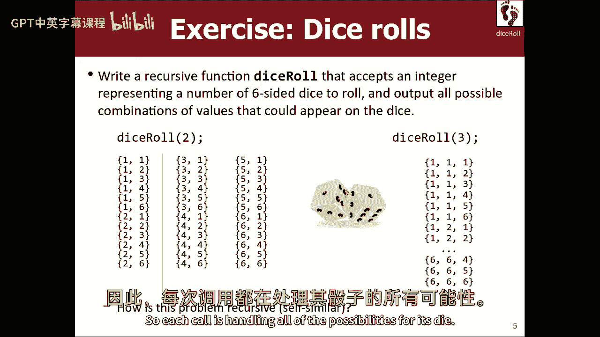
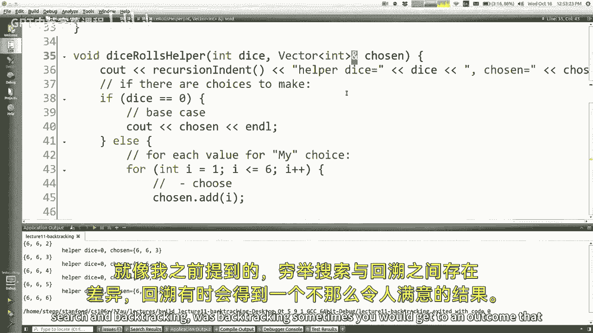
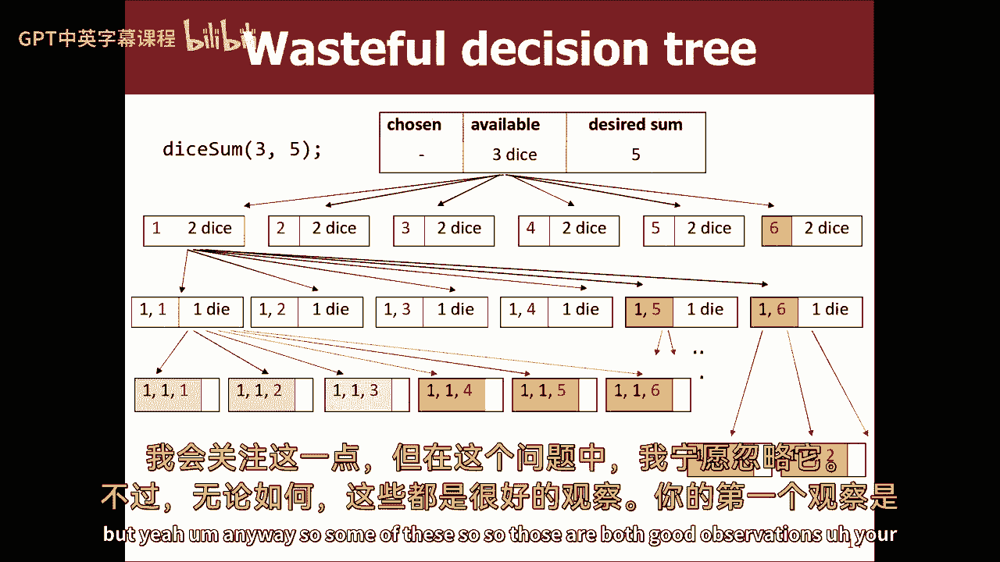
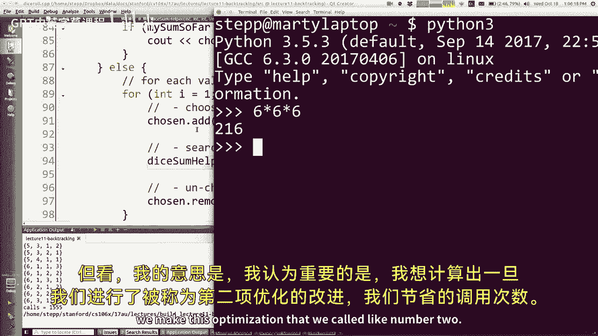
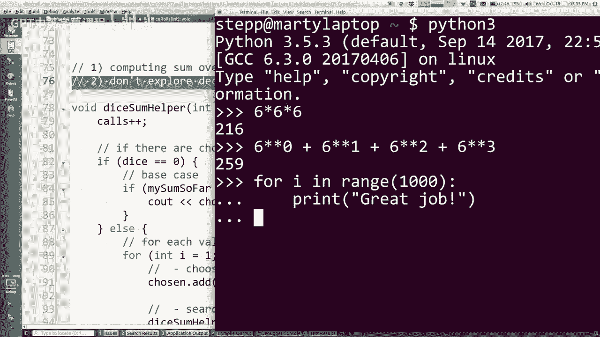
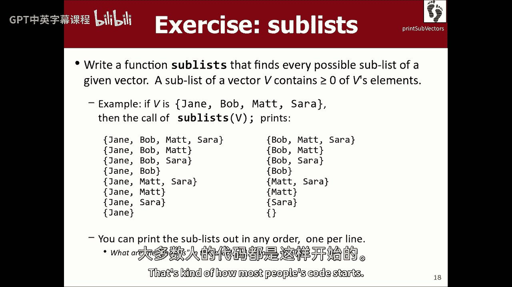
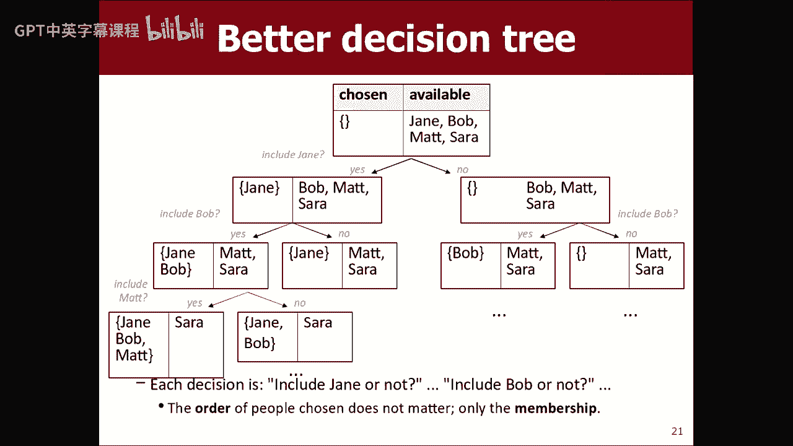

# 课程11：回溯法 🧩

在本节课中，我们将要学习一种名为“回溯法”的算法策略。这是一种通过尝试部分解决方案来寻找问题答案的方法。如果尝试的路径行不通，我们就“撤销”选择，回到之前的状态，尝试其他可能性。这就像在迷宫中探路，遇到死胡同时就退回来换条路走。我们将通过具体的编程例子来理解这个概念。

---

## 概述

回溯法是“穷举搜索”的一种特殊形式。穷举搜索意味着检查所有可能的选项来解决问题。而回溯法则在此基础上增加了“过滤”机制：我们尝试构建解决方案，但如果发现当前路径不可能导向正确答案，就立即放弃并返回（即“回溯”），从而避免无谓的探索。

上一节我们介绍了递归和穷举搜索，本节中我们来看看如何在此基础上实现更智能的搜索——回溯法。

---


## 回溯法与穷举搜索

回溯法建立在穷举搜索的模板之上。两者的核心递归结构相似，但目的不同。

*   **穷举搜索**：目标是枚举或列出所有可能的组合（例如，所有二进制数字、所有字符串排列）。每个“终点”（即完成所有选择后）都是有效的，我们只需记录或输出它。
*   **回溯法**：目标是找到符合条件的解决方案（例如，和为特定值的骰子组合、迷宫出口）。许多“终点”可能是无效的，我们希望尽早识别并放弃那些不可能成功的路径。


关键区别在于，回溯法在递归调用返回后，通常需要一个“撤销选择”的步骤，以恢复状态，尝试其他选项。



---

## 示例一：枚举所有骰子组合 🎲

首先，我们看一个接近穷举搜索的例子：列出投掷 `numDice` 个骰子时，所有可能的点数组合。

以下是实现此功能的递归辅助函数的核心逻辑：

```cpp
void diceRollHelper(int numDice, vector<int>& chosen) {
    if (numDice == 0) {
        // 基本情况：所有骰子已选定，输出结果
        cout << chosen << endl;
    } else {
        // 递归情况：为当前骰子做选择
        for (int i = 1; i <= 6; i++) {
            chosen.push_back(i);                // 选择：加入当前点数
            diceRollHelper(numDice - 1, chosen); // 探索：递归处理剩余骰子
            chosen.pop_back();                  // 撤销选择：移除当前点数，尝试下一个
        }
    }
}
```

**代码解释**：
1.  **参数**：`numDice` 表示还需投掷的骰子数，`chosen` 向量（通过引用传递）记录已选择的点数。
2.  **基本情况**：当没有骰子需要处理时（`numDice == 0`），打印当前组合。
3.  **递归情况**：对于当前骰子，尝试所有可能的点数（1到6）。
    *   `chosen.push_back(i)` 做出选择。
    *   递归调用 `diceRollHelper` 处理剩下的骰子。
    *   `chosen.pop_back()` 在递归返回后撤销选择，以便循环尝试下一个点数。

**注意**：这里通过引用传递 `chosen` 向量是为了避免在每次递归调用时复制整个向量，从而提高效率。正因如此，我们在递归返回后必须显式地 `pop_back()` 来撤销选择。

---

## 示例二：寻找和为特定值的骰子组合 🔍



现在，我们修改问题：不再列出所有组合，而是只列出那些点数之和等于目标值 `desiredSum` 的组合。这引入了“无效路径”的概念，是回溯法的典型场景。


### 初始实现（低效）

一个直接的想法是沿用上面的代码，只在打印前检查总和：

```cpp
if (sum(chosen) == desiredSum) {
    cout << chosen << endl;
}
```


但这种方法效率低下，因为它会探索所有可能的组合（包括那些总和已经远超或远低于目标值的路径），最后才进行过滤。

### 优化一：传递当前和



为了避免在每次到达终点时都重新计算向量总和，我们可以额外传递一个参数 `sumSoFar`，记录已选择点数的累计和。

```cpp
void diceSumHelper(int numDice, int desiredSum, int sumSoFar, vector<int>& chosen) {
    if (numDice == 0) {
        if (sumSoFar == desiredSum) {
            cout << chosen << endl;
        }
    } else {
        for (int i = 1; i <= 6; i++) {
            chosen.push_back(i);
            diceSumHelper(numDice - 1, desiredSum, sumSoFar + i, chosen);
            chosen.pop_back();
        }
    }
}
```

### 优化二：剪枝（Pruning）

这是回溯法的关键优化。在做出选择（`chosen.push_back(i)`）之前，我们先判断：**以当前选择为基础，后续是否还有可能达到目标？** 如果不可能，则放弃这条分支，不进行递归调用。


我们需要计算当前路径可能达到的最小和与最大和：
*   **最小和** = `sumSoFar + i + 1 * (numDice - 1)` （剩余骰子全掷出1）
*   **最大和** = `sumSoFar + i + 6 * (numDice - 1)` （剩余骰子全掷出6）


仅当 `desiredSum` 介于这个最小和与最大和之间时，我们才继续探索。






```cpp
void diceSumHelper(int numDice, int desiredSum, int sumSoFar, vector<int>& chosen) {
    if (numDice == 0) {
        if (sumSoFar == desiredSum) {
            cout << chosen << endl;
        }
    } else {
        for (int i = 1; i <= 6; i++) {
            // 剪枝判断
            int minPossible = sumSoFar + i + 1 * (numDice - 1);
            int maxPossible = sumSoFar + i + 6 * (numDice - 1);
            if (desiredSum >= minPossible && desiredSum <= maxPossible) {
                chosen.push_back(i);
                diceSumHelper(numDice - 1, desiredSum, sumSoFar + i, chosen);
                chosen.pop_back();
            }
        }
    }
}
```

通过剪枝，我们显著减少了递归调用的次数，让算法更加高效。

---

## 示例三：求集合的所有子集 📦

这个问题能更好地体现回溯法的决策树与排列问题的不同。给定一个集合（用向量表示），我们想列出它的所有子集（包括空集和自身）。


**关键洞察**：对于集合中的每个元素，我们面临的选择不是“顺序”，而是“包含”或“不包含”。因此，决策树在每个元素处会分叉为两支，而不是像排列那样有 `n!` 个分支。

以下是递归辅助函数的一种实现思路：



```cpp
void sublistsHelper(vector<string>& v, vector<string>& chosen) {
    if (v.empty()) {
        // 基本情况：所有元素都已处理，输出当前子集
        cout << chosen << endl;
    } else {
        // 取出第一个元素
        string first = v[0];
        v.erase(v.begin());

        // 选择一：包含该元素
        chosen.push_back(first);
        sublistsHelper(v, chosen);
        chosen.pop_back(); // 撤销包含

        // 选择二：不包含该元素
        sublistsHelper(v, chosen);

        // 重要：在返回前，需要将元素插回原向量，以供上层调用尝试其他可能性
        v.insert(v.begin(), first);
    }
}
```


**代码解释**：
1.  每次调用处理当前列表 `v` 中的第一个元素。
2.  两条递归路径分别对应 **包含该元素** 和 **不包含该元素**。
3.  在尝试了两种选择后，必须将元素 `first` 重新插入回向量 `v` 的开头。这是“撤销选择”的另一种形式，它确保了当递归调用返回到当前函数的上一层时，列表状态得以恢复，以便处理其他分支。

**注意**：这个例子中，我们通过修改输入向量 `v` 来推进递归（移除已处理的元素）。因此，在递归返回前，我们必须恢复 `v` 的状态。这与之前例子中修改 `chosen` 向量并在返回后撤销的逻辑是相辅相成的。



---

## 总结

本节课中我们一起学习了回溯法：
1.  **核心思想**：通过递归尝试部分解决方案，遇到“死胡同”时撤销选择并返回，系统地搜索解空间。
2.  **与穷举搜索的关系**：回溯法是增加了**剪枝**和**状态管理**的智能穷举搜索。
3.  **关键步骤**：
    *   **做出选择**：更新状态（如向 `chosen` 添加元素）。
    *   **递归探索**：基于当前选择，继续深入。
    *   **撤销选择**：递归返回后，恢复状态，以便尝试其他选项。
4.  **重要优化**：**剪枝**——在递归调用前，判断当前路径是否可能达到目标，从而避免无用的探索。
5.  **典型模式**：决策树的结构取决于问题。对于子集问题，是二叉分支（包含/不包含）；对于排列问题，是多分支（选择哪个元素放在当前位置）。


掌握回溯法的关键在于清晰地定义“选择”，并小心地管理递归过程中的状态（做出选择和撤销选择）。通过练习，你将能熟练运用这种强大的策略来解决许多复杂的搜索问题。