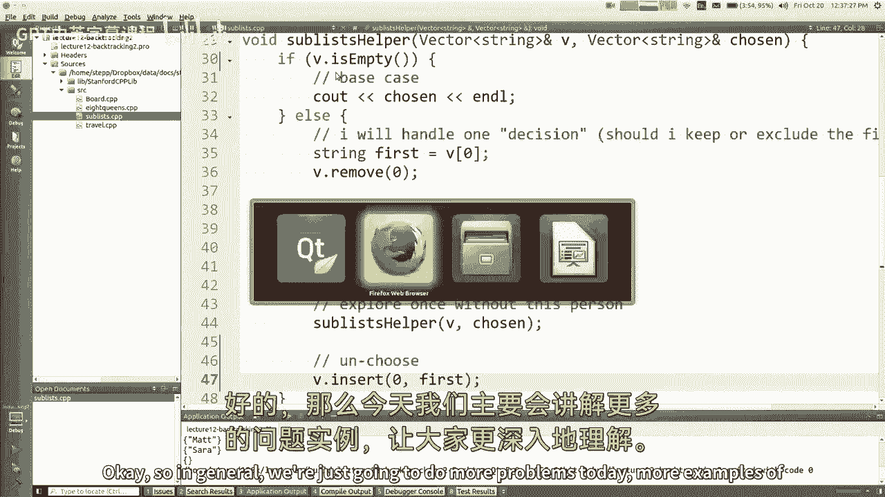
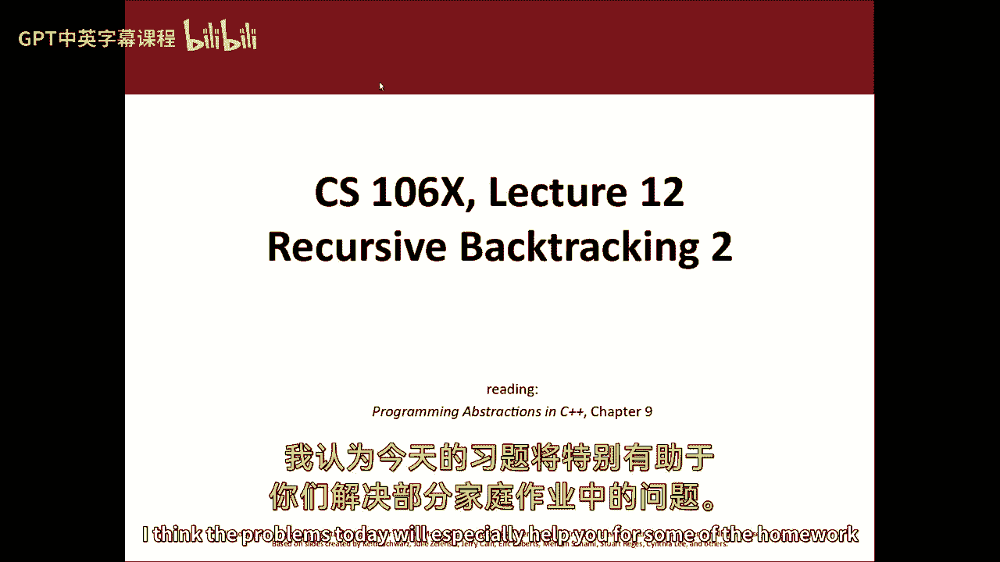
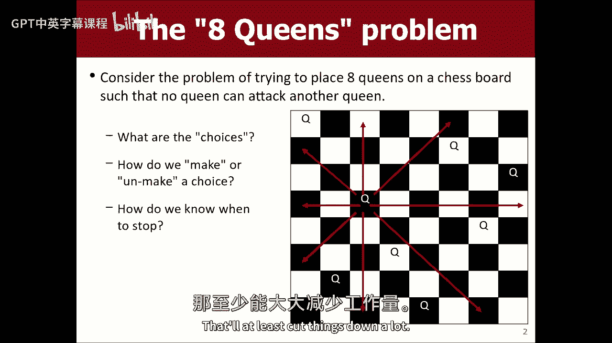
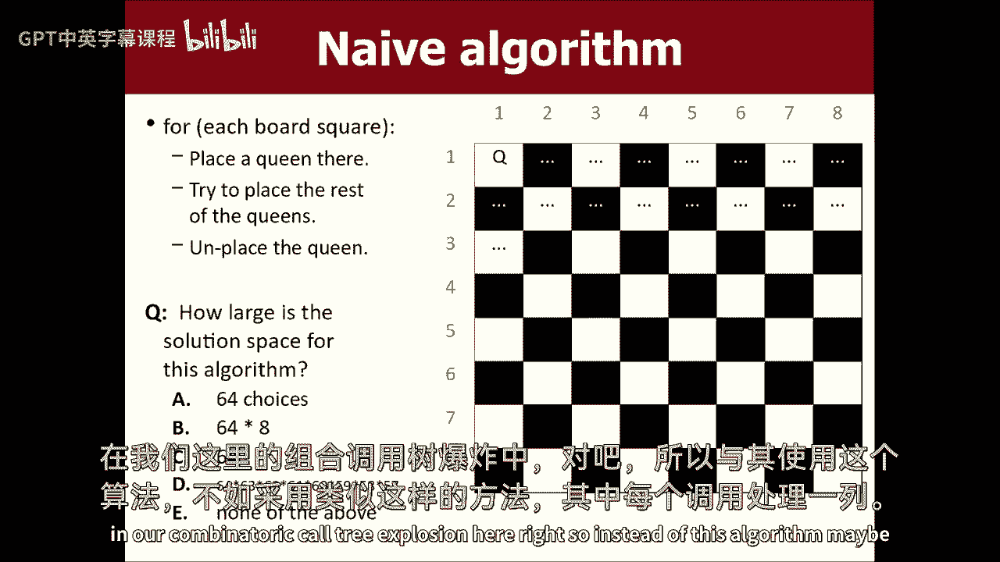
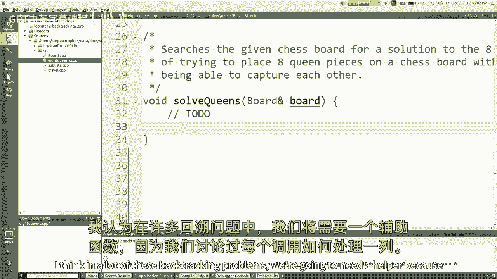
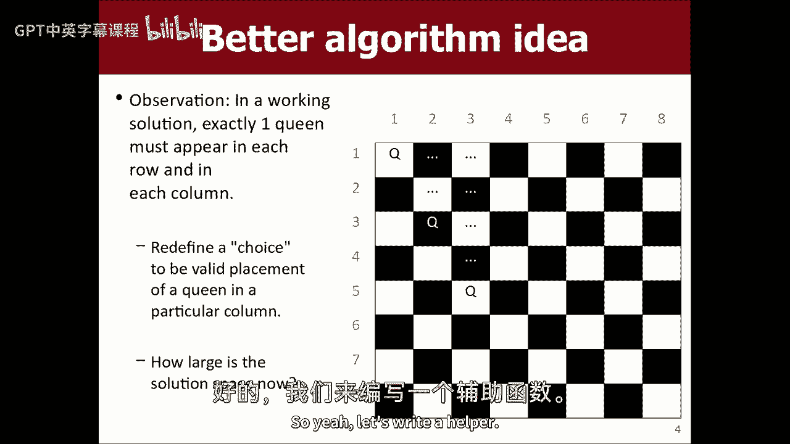
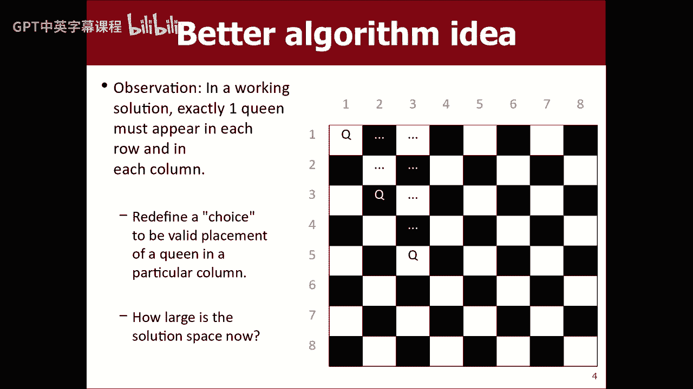
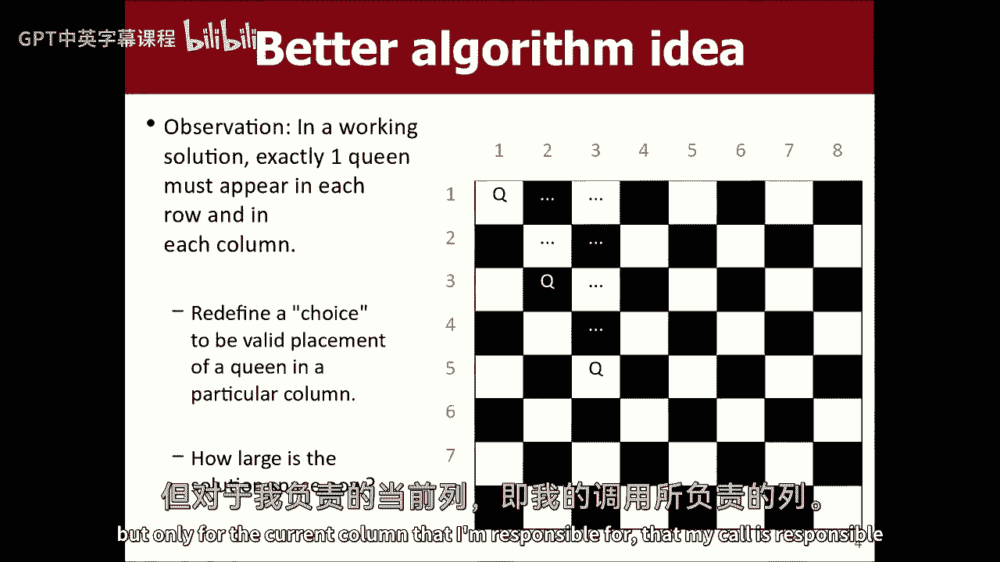
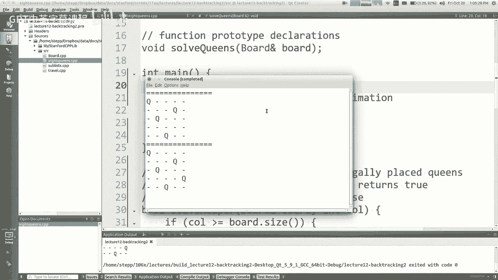
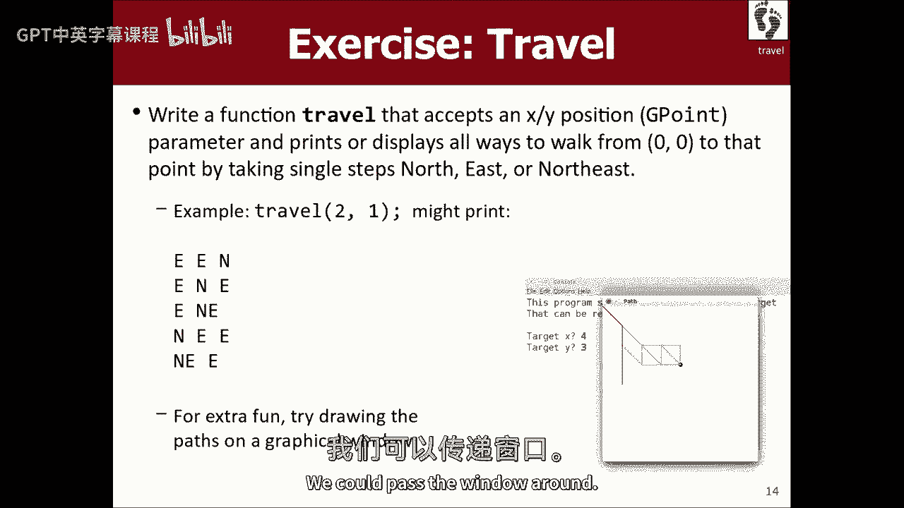

# 编程抽象方法 CS106X 2017 - 第12课：回溯算法 2 🧩

在本节课中，我们将继续深入学习递归与回溯算法。我们将通过修复一个遗留的程序错误开始，然后探讨两个经典的回溯问题：八皇后问题和路径探索问题。通过这些例子，你将理解如何构建回溯算法、如何调试它们，以及如何根据问题特性进行优化。

---

## 修复子列表问题中的错误 🔧





上一节我们介绍了如何打印一个向量的所有子集，但程序存在一个错误，导致输出不完整。本节中，我们来看看如何定位并修复这个错误。

回溯算法的核心模板包括“选择”、“探索”和“撤销选择”三个步骤。在之前的代码中，我们遗漏了“撤销选择”这一步。


以下是修复后的关键代码部分。在递归调用探索了包含当前元素的路径后，我们必须将该元素重新放回原处，以正确探索不包含该元素的路径。


```cpp
// 假设 v 是原始向量，selected 是当前已选择的元素集合
void sublists(Vector<int>& v, Vector<int>& selected, int index) {
    if (index == v.size()) {
        // 打印或处理 selected
        return;
    }
    // 选择1：包含当前元素
    int element = v[index];
    selected.add(element);
    v.remove(index); // 从原向量中移除
    sublists(v, selected, index); // 注意：移除后索引不变
    // 撤销选择
    v.insert(index, element);
    selected.remove(selected.size() - 1);

    // 选择2：不包含当前元素
    sublists(v, selected, index + 1);
}
```





**关键点**：在回溯算法中，任何在递归调用前对状态做出的修改，都必须在调用结束后撤销，以确保每次选择都是独立的。


---





## 八皇后问题 ♟️




八皇后问题要求在一个8x8的棋盘上放置8个皇后，使得它们彼此之间无法相互攻击。这是一个典型的回溯问题，我们可以通过优化搜索空间来高效求解。




### 问题分析与优化

一个朴素的算法会尝试在棋盘的64个格子中逐个放置皇后，这会导致巨大的组合爆炸，运行时间不可接受。

通过观察，我们可以利用皇后的攻击规则进行优化：
1.  **每行只能有一个皇后**。
2.  **每列只能有一个皇后**。

因此，我们可以将问题重构为：**为每一列分配一个皇后，并决定她应该放在该列的哪一行**。这样，每次递归调用只需要处理8个可能的行位置，而不是64个格子。

### 算法实现

以下是解决八皇后问题的主要递归函数。我们使用一个 `Board` 类来管理棋盘状态，它提供了 `isSafe`、`place` 和 `remove` 等方法。

```cpp
bool solveQueens(Board& board, int col) {
    // 基本情况：所有皇后都已成功放置
    if (col >= board.size()) {
        board.print();
        return true; // 找到一个解
    }
    // 尝试当前列的每一行
    for (int row = 0; row < board.size(); row++) {
        if (board.isSafe(row, col)) {
            // 选择：在 (row, col) 放置皇后
            board.place(row, col);
            // 探索：在下一列放置皇后
            if (solveQueens(board, col + 1)) {
                return true; // 如果找到解，提前返回
            }
            // 撤销选择：移除皇后，回溯
            board.remove(row, col);
        }
    }
    // 当前列的所有行都尝试过，未找到解
    return false;
}
```

**代码解析**：
*   `solveQueens(board, col)` 负责在第 `col` 列放置皇后。
*   循环遍历所有行，寻找安全位置。
*   如果找到安全位置，放置皇后并递归调用自身处理下一列。
*   如果递归调用返回 `true`，表示找到了一个完整解，我们立即层层返回，不再尝试其他位置。
*   如果递归调用返回 `false`，或者循环结束，意味着当前路径无解，需要撤销当前选择（移除皇后），回溯到上一步。

### 寻找单个解与所有解

上述代码在找到第一个解后就停止。如果你想找到**所有解**，只需移除提前返回的逻辑，让算法穷尽所有可能：

```cpp
void solveAllQueens(Board& board, int col) {
    if (col >= board.size()) {
        board.print(); // 打印每一个解
        return;
    }
    for (int row = 0; row < board.size(); row++) {
        if (board.isSafe(row, col)) {
            board.place(row, col);
            solveAllQueens(board, col + 1); // 继续寻找，不关心返回值
            board.remove(row, col);
        }
    }
}
```

---


## 路径探索问题 🧭





现在，我们来看一个不同风格的回溯问题：找出从坐标原点 `(0,0)` 到达目标点 `(x, y)` 的所有路径，每次移动只能向东 `(E)`、向北 `(N)` 或向东北 `(NE)` 走一步。

### 算法设计


我们通过递归模拟所有可能的移动序列。需要跟踪当前所在位置和已经做出的移动选择。

```cpp
void travel(GPoint current, GPoint target, Vector<string>& path) {
    // 基本情况：到达目标点
    if (current == target) {
        cout << path << endl; // 输出路径
        return;
    }
    // 递归情况：尝试三种移动
    // 1. 向东移动
    if (current.getX() + 1 <= target.getX()) {
        path.add("E");
        travel(GPoint(current.getX() + 1, current.getY()), target, path);
        path.remove(path.size() - 1); // 回溯
    }
    // 2. 向北移动
    if (current.getY() + 1 <= target.getY()) {
        path.add("N");
        travel(GPoint(current.getX(), current.getY() + 1), target, path);
        path.remove(path.size() - 1);
    }
    // 3. 向东北移动
    if (current.getX() + 1 <= target.getX() && current.getY() + 1 <= target.getY()) {
        path.add("NE");
        travel(GPoint(current.getX() + 1, current.getY() + 1), target, path);
        path.remove(path.size() - 1);
    }
}
```

**算法流程**：
1.  如果当前位置等于目标位置，则打印当前路径。
2.  否则，依次尝试向东、向北、向东北移动（前提是不超过目标边界）。
3.  每次尝试，将移动方向记录到 `path` 中，然后递归调用。
4.  递归返回后，从 `path` 中移除最后一次移动，以尝试其他方向。

### 可视化路径

为了让算法过程更直观，我们可以引入图形窗口，在递归时画线，回溯时擦除。这需要传递一个图形窗口对象，并在移动时绘制线段，在撤销选择时清除它。


---



## 总结 📚

本节课中我们一起学习了：
1.  **回溯算法的调试**：通过打印状态和检查“选择-探索-撤销”模板的完整性来定位错误。
2.  **八皇后问题的求解**：通过将问题优化为“每列放置一个皇后”，大幅减少了搜索空间，并实现了寻找单个解和所有解的代码。
3.  **路径探索问题**：设计了一个回溯算法来枚举所有到达目标点的路径，并讨论了将其可视化的思路。


回溯是一种强大的算法范式，适用于需要穷举并剪枝的搜索问题。掌握其核心模板——做出选择、递归探索、撤销选择——是解决此类问题的关键。在接下来的作业中，你将有机会应用这些技巧解决更复杂的问题。