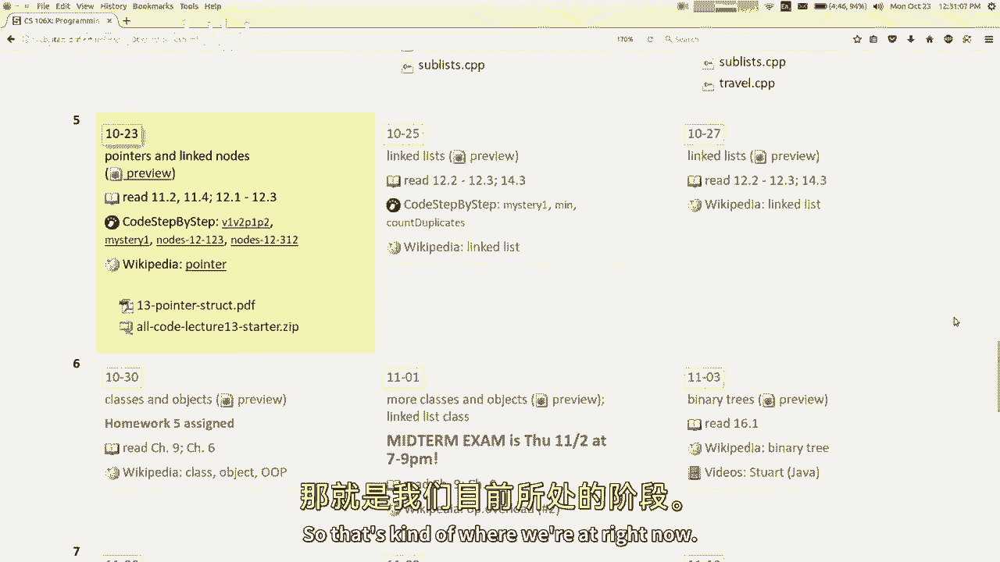
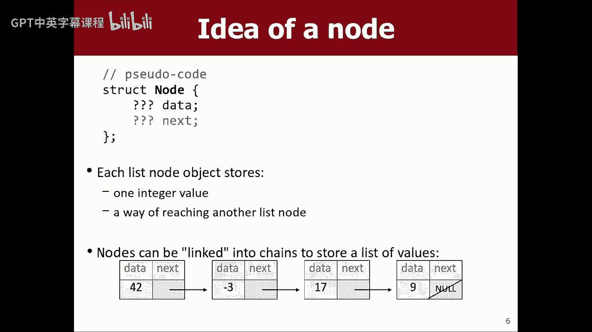
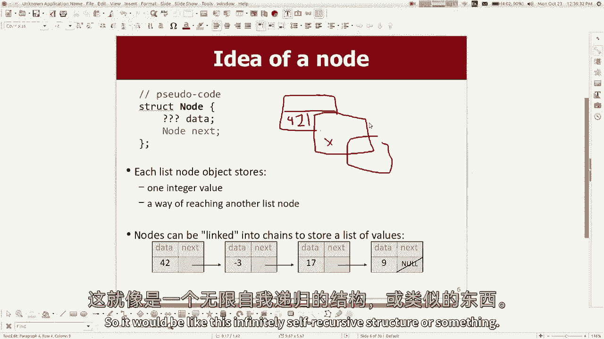
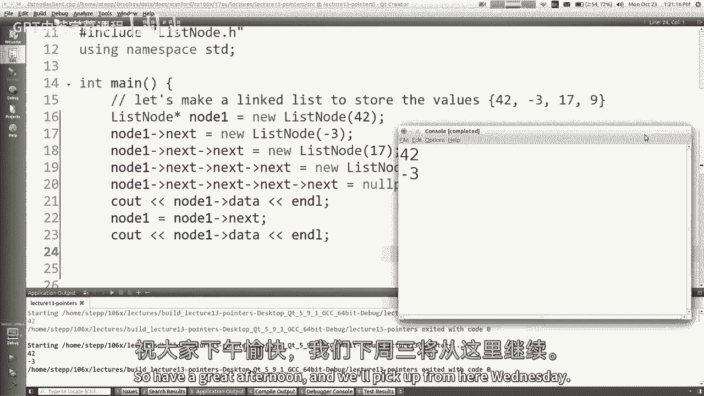

# 课程13：指针与节点 🧠



在本节课中，我们将学习C++中一个核心的新概念——**指针**，并了解如何利用它来实现**链表**。我们将从一个跨越数周的材料单元开始，通过亲手实践，深入理解哈希集、映射、向量等众多集合的内部工作原理。

---

## 概述 📋

指针是C++中用于直接操作内存地址的强大工具。理解指针是构建更复杂数据结构（如链表）的基础。链表与数组（或向量）不同，它不依赖连续的内存块，而是通过一系列相互链接的“节点”来存储数据。本节课我们将学习如何定义这些节点，并使用指针将它们串联起来。

---

## 结构体（Struct）🏗️

在深入指针之前，我们需要一种方式来创建存储数据的小容器，即“节点”。在C++中，我们可以使用**结构体**（struct）来定义这种轻量级的自定义数据类型。

结构体与类（class）非常相似，主要用于定义包含少量数据的简单类型。它们之间的主要区别在于默认的访问权限：结构体的成员默认是**公共的**（public），而类的成员默认是**私有的**（private）。

以下是如何定义一个结构体：

```cpp
struct Date {
    int month;
    int day;
};
```

这段代码定义了一个名为 `Date` 的新类型。它本身并不创建任何变量，而是一个创建 `Date` 对象的模板。每个 `Date` 对象都包含 `month` 和 `day` 两个整型成员。

我们可以像下面这样创建和使用 `Date` 对象：



```cpp
Date today;          // 创建一个 Date 变量
today.month = 10;    // 设置月份
today.day = 25;      // 设置日期
```



结构体也可以包含方法，用于操作其内部数据。

---

## 指针（Pointers）📍

上一节我们介绍了用于封装数据的结构体。本节中，我们来看看如何将这些独立的结构体实例连接起来。这就需要用到**指针**。

指针是一种变量，其存储的值是**另一个变量的内存地址**。你可以把它想象成一张指向内存中某个特定位置的“地图”。

### 获取地址：`&` 运算符

在C++中，使用 `&`（取地址）运算符可以获取一个变量的内存地址。

```cpp
int x = 42;
cout << &x << endl; // 输出变量 x 的内存地址，例如 0x7ffee2b5c9fc
```

### 声明指针：`*` 运算符

要声明一个指针变量，需要在类型名后加上 `*` 号。指针的类型必须与其指向的变量类型匹配。

```cpp
int* p = &x; // p 是一个指向整型（int）的指针，其值为 x 的地址
```

此时，我们说“p 指向 x”。


### 解引用指针：`*` 运算符（再次使用）

要访问或修改指针所指向的内存地址中存储的值，需要使用 `*` 运算符对指针进行**解引用**。

```cpp
cout << *p << endl; // 输出 42，即 p 所指向地址的值
*p = 99;            // 通过 p 修改 x 的值
cout << x << endl;  // 输出 99
```

**注意**：声明指针时的 `*` 和解引用时的 `*` 虽然符号相同，但含义不同，初学者容易混淆。

---

## 特殊指针：空指针与野指针 ⚠️

### 空指针（Null Pointer）

空指针不指向任何有效的内存地址。在C++中，通常用 `nullptr` 关键字表示。

```cpp
int* p = nullptr; // p 是一个空指针
```

尝试解引用一个空指针会导致程序崩溃（段错误），因此在操作指针前检查其是否为空是一个好习惯。

```cpp
if (p != nullptr) {
    cout << *p << endl; // 安全的操作
}
```

### 野指针（Garbage Pointer）

如果一个指针被声明但未被初始化，它将包含一个随机的内存地址，这就是“野指针”。跟随野指针是危险的，可能导致程序崩溃或产生难以预测的行为。

**最佳实践**：始终初始化指针，即使只是将其设为 `nullptr`。

---

## 内存布局：栈（Stack）与堆（Heap）🗂️

要理解指针的威力，我们需要了解程序运行时内存的两个主要区域：**栈**和**堆**。

### 栈内存

*   用于存储函数的局部变量、参数等。
*   内存的分配和回收由系统自动管理（函数调用时分配，函数返回时回收）。
*   访问速度快，但生命周期受限于函数作用域。

### 堆内存

*   用于动态分配的内存。
*   内存的分配和回收需要程序员手动管理（通过 `new` 和 `delete`）。
*   生命周期独立于函数作用域，可以在函数之间传递。

### `new` 运算符

使用 `new` 运算符可以在堆上动态分配内存，并返回指向该内存的指针。

```cpp
int* heapInt = new int(49); // 在堆上分配一个 int，初始值为 49
Date* heapDate = new Date;  // 在堆上分配一个 Date 结构体
heapDate->month = 12;       // 使用 -> 运算符访问堆上对象的成员
```

**关键区别**：在函数中创建的局部变量（在栈上）会在函数结束时消失。而在堆上使用 `new` 创建的对象会一直存在，直到使用 `delete` 显式释放它。这允许我们创建在函数调用结束后依然存活的数据结构。

---

## 构建链表 🔗

现在，我们具备了构建链表所需的所有知识。回顾最初的问题：我们想定义一个“节点”结构体，它包含数据和指向下一个节点的“链接”。

如果我们错误地让“链接”直接存储另一个节点，会导致逻辑上的无限嵌套。正确的做法是让“链接”存储**下一个节点的内存地址**，即一个指针。

### 定义链表节点

```cpp
struct ListNode {
    int data;           // 节点存储的数据
    ListNode* next;     // 指向下一个节点的指针
};
```

### 手动创建一个小链表

以下代码创建了一个包含三个节点（42， -3， 17）的简单链表：

```cpp
// 在堆上创建第一个节点
ListNode* node1 = new ListNode;
node1->data = 42;

// 创建第二个节点
ListNode* node2 = new ListNode;
node2->data = -3;

// 将第一个节点的 next 指针指向第二个节点
node1->next = node2;

// 创建第三个节点
ListNode* node3 = new ListNode;
node3->data = 17;
node3->next = nullptr; // 第三个节点是链表末尾

// 将第二个节点的 next 指针指向第三个节点
node2->next = node3;
```


现在，`node1` 指向链表头部。可以通过 `node1->data` 访问 42，通过 `node1->next->data` 访问 -3，通过 `node1->next->next->data` 访问 17。

### 链表的优势：高效插入/删除


链表的主要优势在于，在已知位置插入或删除节点时，不需要移动大量元素，只需修改相关节点的指针即可。


例如，要删除上面链表中的第一个节点（42），只需：

```cpp
ListNode* temp = node1;      // 临时保存原头节点，以便后续释放内存
node1 = node1->next;         // 将头指针指向第二个节点
// 现在链表从 -3 开始
// ... 之后需要 delete temp 来释放原头节点的内存
```

---

## 总结 🎯

本节课我们一起学习了：
1.  **结构体**：用于定义包含多个成员的轻量级自定义数据类型，是构建节点的基石。
2.  **指针**：存储内存地址的变量。我们学习了如何用 `&` 获取地址，用 `*` 声明和解引用指针。
3.  **空指针与野指针**：理解了未初始化或指向无效地址的指针带来的风险。
4.  **栈与堆内存**：区分了自动管理的栈内存和手动管理的堆内存，并学会了使用 `new` 在堆上动态创建对象。
5.  **链表实现**：综合运用结构体和指针，定义了 `ListNode`，并手动创建了一个小型链表，理解了其通过指针连接的基本原理。



指针是C++中强大但也需要谨慎使用的工具。理解它们是如何在幕后工作的，将为我们接下来实现完整的链表操作（如遍历、插入、删除）以及学习更复杂的数据结构打下坚实的基础。下节课我们将继续深入链表的世界。