# 【编程抽象方法 cs106x 2017】斯坦福—中英字幕 - P14：Lecture 14 - Linked Lists - 加加zero - BV1By411h75g

好啦，我们何不现在就开始呢？嗯，在我开始今天的讲座之前，我想介绍科林，他是我们的组长之一，他要讲几分钟关于，我们的部门领导计划，所以拿着吧，谢谢马丁，哎呀等一下，您不打算在这里给出我的链表演示文稿。

没关系，那里，你先走吧，好啦，嗨，就像马蒂提到的，我叫科林，我是部门领导计划的协调员之一，今天来到这里我真的很兴奋，和你们谈谈部门领导的事情，鼓励你们申请，因为作为六个X学生中的一个。

你们现在都有资格申请部门领导，这看起来真的很势不可挡，如果你在斯坦福上第一堂课，你已经准备好教书了，但你是如此，我们只是想提醒你，区长的样子没有标准的形象，不管你的专业是什么，你的专业或任何其他身份。

如果你有兴趣申请，我们很想看看你的申请，所以我将略过部门领导所做的后勤和要求，因为你们班至少有一个组长，但有几个快速的观点，这是一份有报酬的工作，它至少是两个季度的承诺，你有任何其他问题都可以在。

可能在这些幻灯片里，但是在讲座结束后看着他们，嗯，所以真正领导的理由，作为一个对教育事业有潜在兴趣的人，在工作经验方面真的没有比这更好的了，我可以想象比在斯坦福大学领导和教学生。

你还可以学到很多关于计算机科学的知识，当部门领导，真是难以置信，我从学生那里学到的东西，从复习话题，当我以后去教他们的时候，嗯，即使在斯坦福助教职位中，这样的职位也是不可思议的。

因为你可以和学生一起工作，就像一对一在区段，在IGS和轨道上，人的进步，看他们如何成长，这真是不可思议，我们有很多活动，我稍后会讲到，部门领导是一群非常棒的人，我从部门领导那里有很多非常非常亲密的朋友。

他们不仅是善良的人，但也非常非常聪明，我在所有的CS课上都和他们一起工作，对我来说太酷了，最后，就遗产而言，当我回想过去的四年，我在斯坦福待了四年多，就像对我来说，我介绍的都是计算机科学的人吗。

对我非常关心的事情感到兴奋，所以就我个人而言，这真的很棒，嗯活动我们有，所以我们有很多愚蠢的传统，包括一个层形式，在季度末，我们有点喜欢打扮和风暴层，帮助很多人，还要吃零食闲逛，而且超级好玩。

也与谷歌等公司举办活动，我们有个铁厨师活动，我们实际上只是去谷歌校园，为他们做一个小时的食物，一起吃饭，而且真的很有趣，我们有很多这样的活动，包括微软，小船，巡航，但也包括与不是超级大科技公司的事件。

所以如果你对可汗学院或IXL学习和教育方面感兴趣，我们也在那里掩护你，最后，你们将加入这个由优秀的部门领导组成的团队，包括所有这些技术主管，还有像米安萨米这样的教授、医生和作家，就像很多很棒的人一样。

他们很高兴能在你的角落里，申请开放，离现在还有一个多星期，如果你对申请过程有疑问，或任何评论或任何东西，欢迎您通过这个电子邮件地址给我们发电子邮件，我想这些都会在幻灯片里，除此之外，感谢大家的收听。

我们可能有时间问一两个问题，你们有什么关于性项目的问题吗，所以你们，是啊，是啊，嗯，我实际上做在春天，但不一定冬天还是那样，好啦，我现在喜欢的，我觉得你应该以后再申请，如果你认为有任何机会。

你会喜欢在冬天做这件事，你现在应该申请，因为人们在第一次尝试时没有得到它是很常见的，我没有得到我的第一次尝试，但一旦你被录取了，就像我们希望你做的那样，从那个季度开始，同样地，如果你想等到明年。

你会想在春天申请的，或者任何一个季度，比如你想开始的前一个季度，好啦，谢谢，谢谢，太棒了，太感谢你让我失望了，我想尽快加两分钱，你知道我自己是一个部门的领导很久以前，不是在斯坦福，我没被斯坦福录取。

但是好吧，嗯不，我在另一所大学是这样的领导者，我真的很喜欢它，和学生一起工作真的很有趣，是我是，我喜欢那样，我要去帮助别人，我必须使用他们的代码并帮助其他学生，我认识了一些很酷的人就像她说的。

他们付钱给我，我就像真的，你愿意付钱给我，这很有趣，感觉不像是工作，是啊，是啊，你得到报酬，你知道你得到了什么，我知道，我知道大学校园里对本科生来说工资最高的工作，只是把它放在那里，这是个不错的交易。

我要说的是这不仅很有趣，但我不认为我会站在这里，如果我没有那样做，我是说，我想这就是让我对教育和教学感到兴奋的原因，它带领我一路晋升，然后我是一个研究生，我暑假要去上课。

接下来我知道的是我在申请一份教练的工作，现在你们都和我在一起，所以这真的对我的生活产生了影响，所以我当然希望看到你们中的很多人申请，前几天有人在我办公室问我这件事，他说，你们可能不会像我这么早雇人。

对呀，因为我只是在一个零六个X，你可能需要大三或大四的人，我的意思是不，我们雇了很多和你一样的人，所以是的，你有机会被选中，如果你想等，不管是什么原因，因为这是你的时间表，或者因为不管怎样，那很好。

但刚出1 0 6 x，我是说如果你在这门课上表现好，你了解这些材料，这就是我们希望你帮助人们的，所以说，如果你能做好这个，对我们来说已经足够了，所以再加上一些良好的人际交往技巧，也许过了这个季度。

你就会成为一个很好的部门领导，所以我鼓励你考虑一下，你还有别的问题吗？每周多少小时，你说，是啊，是啊，每周工作时间变化很大，哪个班级领先的季度，我想你通常可以期待你的第一季度。

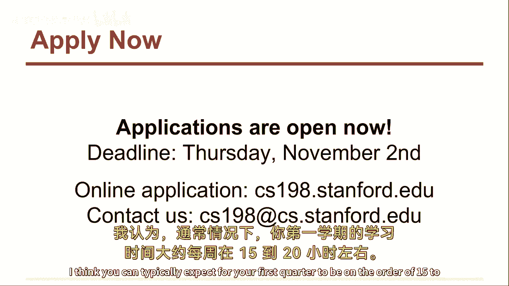

每周工作15到20小时，这改变了很多，基于，比如本季度的招生规模，或者截面大小是多少，嗯，有多少课程经验，你有很多因素，但我们总是希望把我的工作量减少几个小时。

但你也可以通过图层时间或其他方式来增加时间，好像真的是，你呀，喜欢很多，是啊，是啊，好啦，嗯嗯，如果你还有其他问题，请埃隆和CS的其他协调员，在CS斯坦福的一个九八或访问他们的网站了解更多。

关于引导部分的信息再次正确，谢谢科林，感谢你的时间，现在我们来谈谈链表。

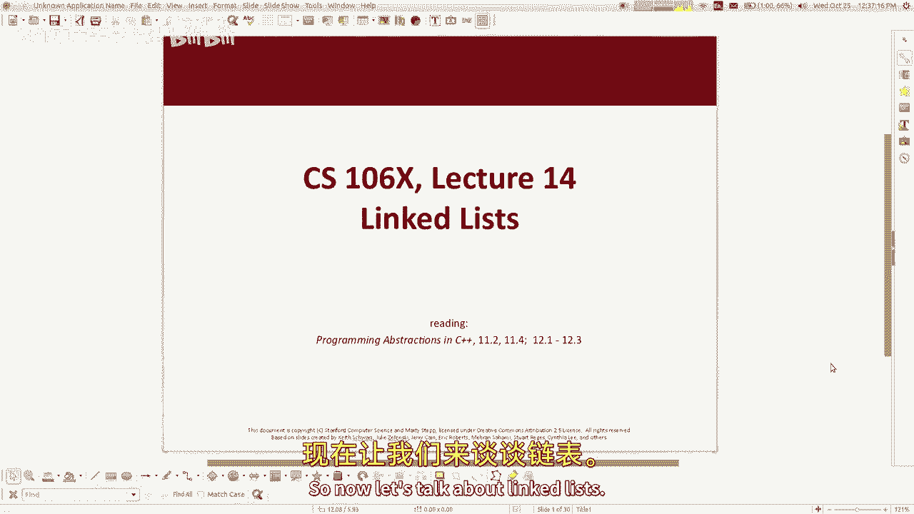

上次我跟你说指针的时候，什么是指针，这是现在开始的组长面试，什么是指针，走呀，走呀，你先举手的，是啊，是啊，去吧，有效的和呃，呃那只是，呃只是，只是，储存一个地方来纪念其他东西，不管那是一个物体。

另一头，这是正确的，它存储其他东西的内存地址，有些东西可能是，就像你说的，它可以是任何东西，也可以是一个int，它可能是一个物体，可能是一个数组，向量，对呀，存储指针，存储其他值的内存地址，好的很好。

指针与构建链表有何关联，为什么我需要知道，创建链表的指针，就在后院，在链表中，列表的每个元素都有一个指针，是啊，是啊，这是正确的，节点，清单的要素，它们存储从一个元素到下一个元素的小指针。

我们用这些指针把它们联系在一起，这就是我们的名单，对呀，是啊，是啊，你们记得你们的想法是对的，让我们从那里开始，所以你知道，你说“新”这个词来在这堆上做一个对象，还记得我们说过这个堆栈吗，而这堆。

我真的想强调一下，每做一个节点，链表，存储某些数据的节点，您总是要使用这种新语法，你从来不只是说，列表节点n分号，你总是说列表节点星号n等于新列表节点，你总是把这些东西当作指针，不仅仅是作为指针。

但是作为堆指针，当你说这个新的关键字，你知道我会理解的，如果周一讲座的那部分是最模糊的，但我只是我真的想让你记住，我们需要以这种方式构建所有的节点，如果你不，内存不会持续足够长的时间在我们的程序中使用。

它会导致bug或崩溃，它不会以正确的方式工作，所以当你创建列表节点时，用这种语法来制作它们，所以我们制作了这些列表节点结构，它们具有从一个节点到下一个节点的指针，在列表的末尾，我们有一个值为零的空指针。

表示在那之后没有其他节点，是啊，是啊，为什么你一定要，尤其是如果你使用你喜欢的关键字，什么是我相信，为什么你必须使用关键字新井，我是说，New关键字是一个导致几件事发生的单词，当你说新。

C+Plus系统得到了一大块热内存，它得到的那一大块，是那种类型的物体的大小和地雷，就这样进去了，它留出它分配了一个大小的内存块，然后如果你有某种带有参数的构造函数，它在这么大的物体上运行。

然后返回它的起始内存地址，所以所有这些事情都发生在你说新的时候，如果你不说新的，它不会去堆上制造内存，在堆上存储内存，这个对象对于这些示例非常重要，所以这就是为什么我们在这里说新，这就是我的意思。

但那是在想，为什么储存是至关重要的，哦，为什么把它储存在堆上很重要，嗯，我想我想给一个简短的答案，就像你知道的那样，你会使这些节点链，像这样，我们编写了代码，就像这个星期一讲座结束的时候。

就像你总是有一些东西在堆栈上，就像我调用的main或函数中的任何局部变量一样，那些在堆栈上，通常您要做的是在堆栈上保留一个指针，它指向堆上的东西列表的前面，所以当我画这些画的时候，我画了一堆。

像一朵云什么的，我不想每次都画云，我画了一个链表，我只是希望它是含蓄的，它在堆上，所以总的来说，当我画这些画的时候，我只是不打算画云，或者真的画堆栈，我要画一个指向这个的指针。

只是隐含地说这部分在堆栈上，所有这些高温下的磨砂膏，为什么这一定要在，是因为如果主调用函数a和a调用，函数b和b调用，函数c和函数c使链表链，函数c返回的瞬间，整个内存链就被释放了，被赶出去。

这就是堆栈的行为方式，我可能不想那样，我可能需要函数c使链表，在运行完c之后，列表将继续存在，所以你得把这些东西放在暖气上，为了让它们活得足够长，我想令人困惑的是，就像嗯，等一下等一下。

我用向量之类的东西，我用弦之类的东西，我不必说新的和堆的，所以我为什么要在这里做得很好，不同的原因是在矢量内部，如果你看了向量的代码，它使用单词new分配内存数组，把它放在，当你返回矢量时。

它有点像指针的手，它做了一些事情，所以它做了正确的事情，但就像你归还的任何东西一样，那很复杂，它可能是在内部做堆积的事情，以活得比你的功能更长，所以我们以前从来没有处理过，因为这些图书馆和收藏。

我们一直在使用的东西有这些内部的东西为我们做到了这一点，所以这就是为什么，突然间我们不得不做一件我们以前从来没有做过的事情，我们突然要担心这个从来没有讨论过的堆东西，直到今天这周的讲座，是啊，是啊。

所以说，如果函数c做了一个链表，使用新的，上的堆，如果它把所有的钱都放在堆栈上，就像上面说的，不带列表的列表节点前分号，二号节点，不听第三，列出节点4，它可以把它们联系在一起。

但它们都会在堆栈中连接在一起，指上指下，在堆栈里的某个地方，当函数c返回时，所有的静态记忆都会崩溃，所以所有这些节点基本上都会被抹去，所以他们已经走了，你可以回来，但是你返回的可能是前面的节点。

但你会回来，就像一个被擦洗的记忆指针，所以这就像写下你朋友的家庭住址，明天他们就会推平他们的房子，嗯，你还留着他们的地址，但如果你去那里，只有一堆瓦砾在等着你，你知道房子不在那里，所以不是说，哈哈哈。

我把房子从拆迁中拯救出来，因为我把房子的地址写下来了，它不完全是这样工作的，这更像是在云端盖房子，然后推土机就打不到它了什么的，我不知道这里有什么类比，但我想我的混合隐喻偏离了我什么的。

但就像那电影什么的，我不知道，我觉得，是啊，是啊，好啦，所以这就是我们现在的处境，我会我会理解，如果这些东西有点模糊，像什么窥视，这都是什么，我会说，我想你不需要知道细节，那些东西到底是关于什么的。

我觉得最主要的是，你要记住，当你在做这些节点的时候，你创建节点，您必须使用这种语法，我所有的例子都会做到这一点，你应该经常这样做，你知道堆积如山的东西，我告诉你这件事，因为我想你们是前男友。

你可能关心这个，但这更像是一个零七域，如果你拿一零七，你做了一大堆关于记忆看起来如何的事情，如果我分配这个，那是去哪里的，如果我去这个指针，再向前移动十个字节，会发生什么，你知道你会做很多那样的事情。

我不想做很多那样的事，因为他们会为你这么做，你要去教书，他们会教你的，所以无论如何，这就是你如何制造一个节点链，好吧，我想指出一件事，我已经说过了，但通常你所做的是只保留一个指向列表前面的指针。

你可以在这里保留前面的点，在这里保留第二个节点点，在这里保留第三个节点点，所以Main有所有这些局部变量，指向每个节点，那就太好了，因为您可以非常快速地使用任何指针与任何节点对话。

但实际上我们所做的是我们很好地计算，前面已经够好了，因为从前面你可以沿着指针到达所有其他节点，所以只要有一个指向前面的指针就足够了，现在只走一个方向，如果你在看这个节点，你不能倒着走。

因为从这里找不到内存地址的指针，跳回他们的，你知道这是单向的，但那是可以到达的，一切皆有可能，所以现在如果你想把整个名单交给某人，这是这个链表，我让你把这个指针，这个前面的指针。

你给他们这张纸条的内存地址，现在他们可以看到这一切，当然缺点是它们必须跳跃，跳，从一个节点跳到下一个节点，如果他们想查看所有的节点，不过没关系，这就够了，所以通常我们只谈论前面或开始。

或者是以名单前面的名字命名的头，所以我想谈谈当你在代码中有赋值语句时，涉及指针的相等语句，代码是做什么的，我认为你必须对此建立直觉，而且画画真的很有帮助，你这周肯定想去你的部门。

因为你要练习一大堆链表的东西，你画一些节点之类的东西，所以当你说左边等于右边的时候，如果你说的是指针，我会区分变量和存储在变量中的值，所以我有下面的图片，我有这个，这个链子在这里我有一个指针，一种叫做。

它指向一个节点，那个节点有一个下一个指针指向另一个节点，那个节点有一个下一个指针，它存储NULL，所以它不指向任何节点，这就是我现在在这个节目中所拥有的，如果我写了一个箭头，x等于p。

我想让你明白这句话现在意味着什么，什么P P不是东西，他什么都不是，但这意味着什么呢，当我说斧头等于好的时候，A是这个，下一个是箭头，记住箭头运算符的意思，箭头表示跟随指向该事物的指针。

它指向取消引用运算符，所以接下来的箭头表示，跟着箭头走，下一个等于，意思是把这个东西指向某个地方，下一个箭头等于p，意思是让这个东西指向p是这样的，如果我有一个像这样的节点b，我说下一个箭头等于b。

下一个会指向这里的b，反过来说，如果我把这个翻过来，如果我翻转赋值语句，然后我说p等于一个箭头，你可以想象他们会在这个问题上提出p点，因为右手边有一个箭头，你不会真的指着指针。

如果接下来你说p等于一个箭头，意思是指向下一个点的同一个地方，如果下一个是这个，它指向那个，然后做任何p也是点，指向我图表中的第二个，所以我认为对一些学生来说，那有点令人困惑。

指针似乎做了两件不同的事情，如果你把它们放在等号的两边，我想如果你真的想对这件事字面上说，像这样下一个，其实不是箭，它存储了一个数字，它存储了一个内存地址，所以存储在这里的内存地址。

如果我设置了与之相等的其他东西，我说什么都行，另一件事是在另一件事中放入相同的内存地址，从概念上讲，这意味着它们都有指向相同另一个地方的箭头，但是没有箭，箭是给我们人类的小大脑的。

这有点像第二个人的直觉，当我说下一个箭头的时候，我的意思是，转到这个变量并更改数字，将其排序为等于其他数字，从概念上来说意味着让它指向其他东西，不管怎样，我只想让你有一个普遍的直觉，意味着什么。

当您用指针编写这些赋值语句时，你需要有这种直觉，因为构建链表的整个想法就像操纵箭头，指向不同的东西，而不是他们过去指向，因此，您必须能够使用这些语句来正确地构建链表，所以让我们来试试，让我们练习一下。

哦，对不起，这里有一个例子，如果我，如果我有这张照片，我想说清楚，当我有这个东西，说a是一个列表节点星，它是一个列表节点指针，指向这个东西的是一个列表节点对象，好啦，所以当我说下一个箭头等于下一个箭头。

我的意思是，提出这一点，哎呀哎呀，动画在我的Linux上不太好用，但这就是那句话的作用，那么你如何让这张照片变成那样，其中列表是指针，列表节点指针，看一下，谁勇敢，谁有答案，为什么要举手，你说呢，我说。

C c，因为列表和第一个列表之间的箭头，下一个是在这一点上有十个的箭头之间的箭头，除非下一个下一个会创造，所以我想你可能会差一个，让我追踪她，看看列表在这里列表箭头表示跟随这个，所以现在我在这里。

我说下一个，那现在就在这里，我说箭头，现在跟着，我说下一个，现在在这里，我有箭头，跟着那个，所以我想这一行代码会设置，但没有那个，我们只有这个权利，所以我想我要改变的指针是下一个列表。

我想改变他指向一个新的节点，所以我觉得，但看起来我不会感觉太糟糕，被一个人带走，就像这是人们最常见的事情，他们下一个加了一个额外的箭头，他们有一到Q的误差限制，就像这正是，人们需要大量的链表练习。

被一个人甩了真的很容易，我觉得你只需要画图然后数数，好几次才能变好，是呀，那么什么是最确切的，是它是它，第一个元素，这是一个指针，这些彩色盒子是真正的，所以这个指针指向第一个对象。

那个对象有一个下一个指针，指向第二个物体，所以第一个对象只是下一个列表，你知道就像，如果我想打印十个，我说列出箭头数据，我不知道，我不说下一个，我想这是很多学生做的另一件事，当他们第一次这么做的时候。

他们就像，哦，名单在这里，所以如果我想去第一个真正的音符，接下来我要说的是列表箭头，因为接下来是推动你前进的东西，我是说，有点是的，但实际上向前移动的是负大于运算符，箭头操作符实际上是引导你前进的东西。

所以如果你现在说列表箭头，我在看这个，然后如果我说数据是这样的，如果我想去20，我说名单，向前箭头，看下一个，跟着那个箭头，这个箭头下一个箭头数据是再练习练习练习，我们再来一次。

我怎么把这张照片变成这个，所以最后一个，上一张幻灯片是，我在后面加了点东西，这张幻灯片，我之前加了点东西，其他元素，所以我在这里所做的是对初学者来说，我创建了一个名为temp的新节点。

它存储了一个带有30的新节点，我写什么是为了什么对语句，水平地将三十节点连接在正确的位置，你说呢，所以我喜欢画画。

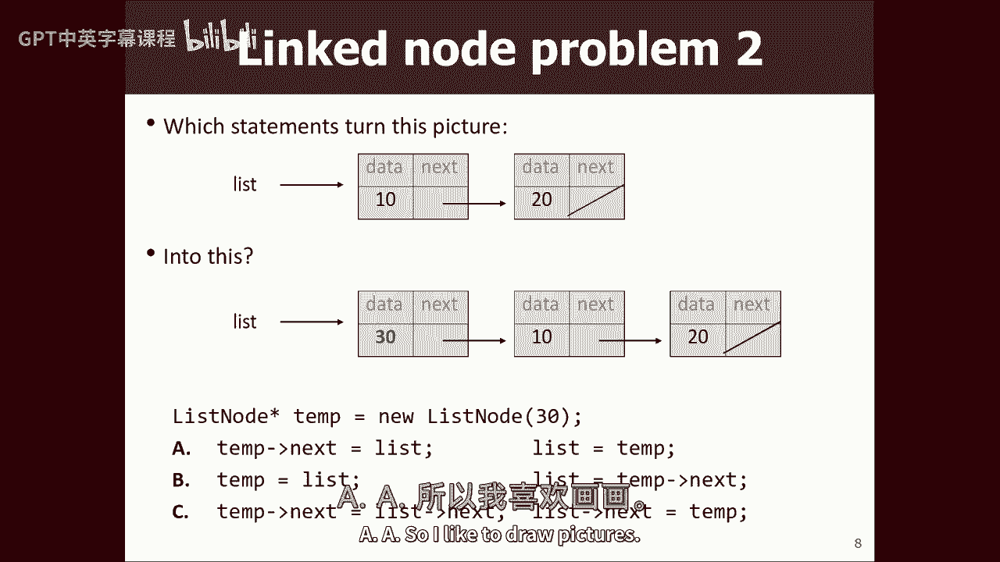

所以如果我有临时工，我就写，T temp是一个变量，它指向一个新的盒子，里面有一个30，右边看起来不错，现在你说的是，所以你是说临时工下一个应该指向列表点，所以这里的下一个应该指向与列表点相同的地方。

我想我正在做幻灯片的上半部分，所以下一个应该指向列表点的同一个地方，像这样对吧，好啦，顺便说一下，注意一件事，可能看起来像是嘿，三十而立，三十到十，二十到二十，我受够了，我造了30到10个，二十还不够。

因为我也是当你说名单的时候，名单也应该从30岁开始，所以你明白吗，就像你有时可以在同一个链中有多个入口点，哪里，就像这家伙和这两个有联系，但是如果你说列出箭头数据，你拿不到三十，你得10分。

因为列表仍然指向节点，它之前指出，所以是的，下一个会说，那里有温度点，所以不要再让它指向那里了，让它指向那里，所以现在我知道我的图表有点乱，但喜欢名单，如果你顺着这个点，你就到了这里，你得到第三个。

然后如果你跟着他的下一个指针，你得到它的十个，所以这就是工作，有道理，如果我用另一个顺序做这些呢，如果我在这里写了试图抹去呢，所以首先我做列表等于临时，其次，我做临时工。

Next equals list，如果我那么做了，然后我会说列表等于临时，所以我会让这家伙像那样指出来，然后我说临时下一个等于列表，所以临时工来了，接下来是这个东西，让它指向，其中列表点，那是哪里哇。

我指着自己，喔喔，你看到了吗，如果我翻转两个命令的顺序，我真的会打破一切，我会，我将用一个元素替换列表，向自身报告重复循环的列表，你知道的，我会失去可能指向这些其他元素，他们将无法联系到，我就没有指针。

会让我得到这些东西，你看到了吗，我们称之为内存泄漏，因为我失去了记忆，我再也拿不回来了，当我还是个小男孩的时候，我学习链表，我的组长杰米，他很讨人喜欢，她让我想想他们，好像他们身上绑着小气球，指针就像。

你紧紧抓住的细线，就像，你知道的，名单就像我，那个小男孩拿着绳子什么的，她是个比我更好的艺术家，但是一个小男孩有一根绳子什么的，还有一个，这家伙身上绑着一个气球，他有一根小绳子。

他身上绑着一个小气球什么的，然后小男孩说，哦哇哦，你看这个盒子，哇塞，那个盒子太酷了，里面有三十块钱，哇塞，整洁，也许我会松开绳子，伸手过去，我要把绳子系在他身上，哦不，我的绳子掉了，然后他扬帆而去。

所以我的意思是，这里发生了类似的事情，嗯，我不知道什么心理图景或类比最适合你，但是如果您没有保留任何指向给定节点的指针，或者一系列指针，将您带到给定的节点，然后它就不见了，你再也找不到了。

你泄露了不好的记忆，所以陈述的顺序很重要，你是对的。

答案A是正确的，我们再来一次，所以我想把这张照片变成这张照片，所以我现在做了更多的操作，所以这是我想做的，嗯。

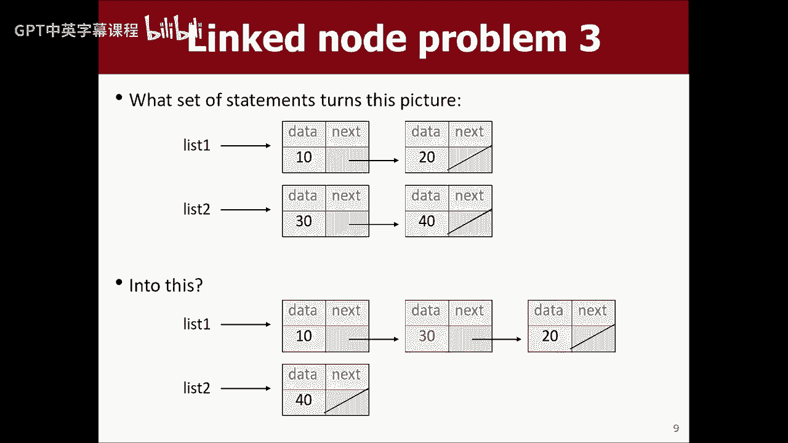

我要打开一个文本编辑器，我要把它缩小，这样它就不会覆盖整个。

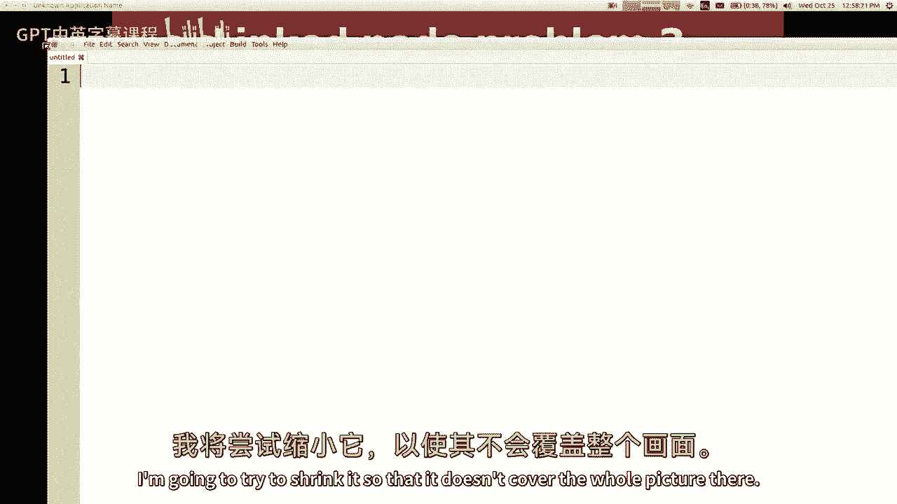

我要试着打字，我要你告诉我，然后我会画，我把代码写下来，你告诉我，然后我也会试着画这幅画，所以谁来告诉我，这将有助于在把这个变成那个方面取得进展，列表1下一个等于列表2，名单一在这里，名单一。

下一个在这里，你想让他指出，列出两点，所以你想让我这么做，好啦，但后来我失去了我的小气球要飘走了，这家伙，对呀，我想我们需要这么做，在我做对之前，我可能需要做一些事情，所以也许哎呀，我做了什么，帮我。

也许在这一行代码之前我该怎么做，如果你想做临时工，我想那很好，做临时工，如果您想要列表节点温度等于，现在有一件有趣的事情，几分钟前我告诉过你，每次声明节点时，你说星结，你说它等于一个新节点。

所以让我们记住新的含义，这意味着进入堆，留出内存，实际上创建一个完整的节点，这与指向节点的指针不同，您可以有许多指向同一节点的指针，这意味着所有这些小指针都在堆栈上，一个节点在堆上，他们都指向他。

如果你说列表节点星型温度等于，让我们列出一个，好啦，如果你写那就意味着，你做了一个小指针叫做，你知道临时工，我就写一个T，他指出了名单上的一个点，这就是那行代码的意思，但它不会复制节点对象的整个副本。

只是这两个指针指向同一个对象，所以现在如果我继续说列表一等于，你知道不管是什么空指针，就会切断这根绳子，但气球不会飞走，因为我在剪断第一根弦之前先接了第二根弦，所以你可以做这样的事情。

如果你认为这能帮你解决这个问题，我只想强调，就像我没说知道什么，因为这样会使图片上出现第五个盒子，五年级箱式，我不需要五年级的书，所以考虑到这一点，我是说，我只是这几行代码不一定能帮助我们，到目前为止。

你会在后面的代码中添加什么，对不起什么，你想让我怎么做，清单二，好啦，让它坚持住，让我来，我以为这会很好，不确定这里是不是这样，好的，你想让我把这个等价于下面的列表2，所以你想让临时工。

其中列出两个下一个点，所以你想让临时工看起来像，嘿嘿，我有个小窍门给你，如果你没有一个红色的标记在你的屏幕上画满，你可以做的一件事是在每一行，你可以写一点评论，就像四十个节点的临时点，你知道吗。

你人真好，如果你那样做，当你在考试的时候，你不需要对测试发表评论，但如果你这么做了，这会帮助部门领导理解你到底想做什么，因为你可能搞砸了，所以评论可能会有所帮助，好啦，所以温度是40。

我知道我的字体有点小，我要说的是列表节点温度，然后我要像那样打破界限，所以你可以看到更大字体上的行，好啦，温度到40，现在呢，你要那个干什么，你想在那之后再给我一句台词吗，是啊，是啊，然后你要做什么。

对X说这个现在得到，列出两个下一个等式，下一个列表1，所以下一个列表2，下一个是这个指针，就在这里，你说你希望它不再指向那个，但你想让它指向，列出一个下一个要点，在那里列出一个点。

在那里列出一个下一个点，所以你想这样，三十归二十，所以再一次，我可能会在这里写一点评论，三十支箭二十支，把这些排成一行，所以他们很容易读到这样的东西，好啦，那很好，再给我几行代码，我们有。

我们这里有一个列表一，下一个等于列表二，现在可以吗，所以如果我下一次这么做，下一个等于列表二，所以现在，我不想再让这家伙在这里指指点点，我要他指出两点，所以在这一点上，所以那是在十个之后做的。

我想指出三十个，像这样，是这样吗，好啦，我们在后面还需要做什么，是啊，是啊，我觉得你，所以我没有说下一个，你不必总是说下一个，我是说我想把这份名单放在前面的箭头上，不要再指着三十岁了，但要指出四十个。

所以把这个剪掉，像那样点，你说我们结束了，让我看看，是啊，是啊，我的意思是，如果你真的想清理，你可以说夯实等于空指针，会切断这根绳子，但你不必这么做，那很好，所以现在让我来看看我们是否做对了。

所以如果你按照列表一，我得先去十楼，我就是这么做的，然后如果我去下一个，我应该到30岁，我做到了，然后如果我去下一个，我需要得到20，我做的，然后如果我试着从下一个，那应该是空的。

所以整个链条看起来是对的，我知道这都是对角线，到处都是东西，但这些照片只是为我们愚蠢的大脑制作的，对呀，所以是的，这些是正确的跳转序列，以获得正确的节点序列，然后列表二应该会让我得到40，没有别的。

它只带我到四十岁，你也知道，在我们这么做之后，它祝福你，所以是的，这些命令序列将把顶部的图片变成底部的图片，这不是唯一的命令序列，如果你有不同的解决方案，可能有很多不同的方法，你可以。

你可以改变这些指针，然后去试试，如果你想看，是啊，是啊，你能把开头写完吗，所以就在这两点，两个嗯，你不用尝试就能做到，你只需要小心不要切分，你可能会失去你的气球，就像你说的清单直接到40。

你会失去那三十块钱的，好啦，所以你可以做一些把戏，就像你知道的，也许暂时成为四十个中的下一个，一个三十，然后做四十个中的这个，我基本上可以翻转这两个，现在更容易在不丢失任何东西的情况下删除30。

你可以做这样的事情，您可以把这里的这些结尾空指南看作是临时的，在某种程度上，所以如果你的目标是喜欢，不使用临时变量，你可以完成那个目标，但我不知道，你知道的，偶尔我会问你这样的问题。

我会说不要临时指点什么的，这意味着你可能会做一些把戏，但总的来说，我会让你做一个临时指针，如有需要，你觉得这样做有什么意义，你对这里的这些线条有问题吗，很快，你要做一个家庭作业，你基本上要做这个。

但这是行不通的，因为你已经写好了，这是你第一次尝试，也不会是对的，所以这很难，因为你会运行程序，你的程序会崩溃，会出现分割错误，因为有些指针会掉进深渊，你要跟着指针走，您的程序将崩溃。

所以你要做的就是写一张图片，所以你有你写的代码行，画一张图，然后沿着每一条线，如果它看起来应该做正确的事情，但事实并非如此，然后呢，坦率地说，你可能画错了图，就像你对代码的解释可能是错误的。

所以你给你的部门领导看代码，你给区长看图层里的图片，他们和你一起走过，或许他们能帮你看清，哦不不不，实际上，这改变了指针，不是那个指针，所以，这就是区长如何真正帮助您调试这类代码，但你需要照片。

没有照片真的很难做到这一点，就连我也喜欢今天，你知道的，当我想到涉及指针的试题时，我画这些愚蠢的画，我画小箭头，我把它们弯弯曲曲地写出来，所以这样做是可以的。

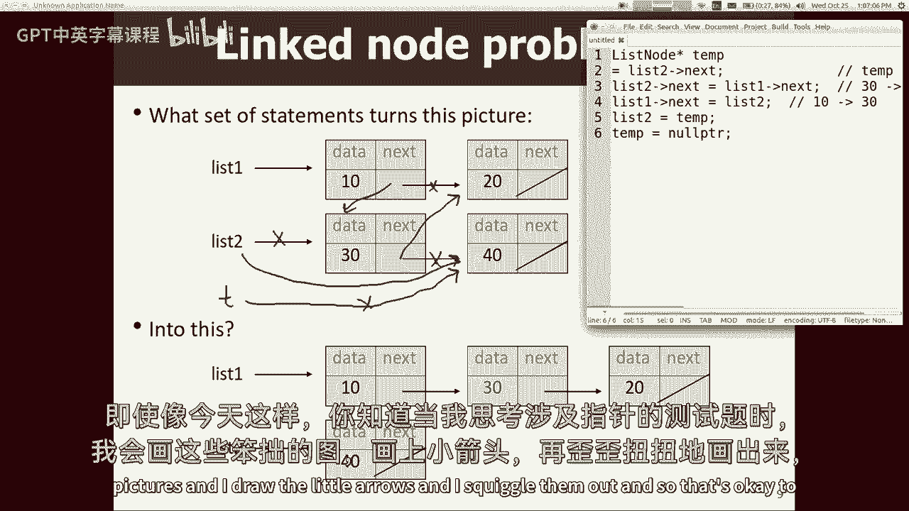

好啦，所以好吧，有趣的是，就像我拍的那些小照片，但那很好，但是链表可能是这个长长的节点链，我们要操纵它什么的，那么当它是一条很长的链子时，你会怎么做，你可能连链条有多长都不知道，你可能会说很好。

它在哪里存储列表的大小或长度，并没有把它储存在任何地方，我是说，我想我们可以保留一个整数什么的，但我们甚至不一定知道有多少节点，如果我们有一张纸条，有人给了我们一个指向链子前面的指针。

这就是我们所拥有的，我们不知道确切的长度，我们想打印所有的值，好吧，想打印所有的值，所以我的意思是，我有我有一个可爱的创作者项目。

在那里我们做了一系列的价值观，哎呀这里，所以我把这个链子，如果我想绕过它们，如果是数组或向量，我要说的是，我从零到大小，或者我对每个循环做一个，那些在这里不起作用，因为我没有尺码。

对于每个不明白指针的人来说，那么我该怎么做呢，这样我就可以打印所有这些值，我是说如果我想打印一个值，我可以这样做，我可以说打印节点一的数据，然后如果我想打印下一个值。

我可以说打印像空间加节点一个下一个数据，然后我可以说打印一个空格加节点，接下来你知道我可以这样做吗，但这似乎很傻，我想在这里做一个循环，我只是不知道有多少这样的，我需要做任何建议，是啊，是啊。

所以建立一个什么，把它循环起来，只要下一个数据值不存在，不想，是啊，是啊，我想你的想法是对的，就像做一个循环穿过指针，直到我击中零，打印每一个，就像用指针访问节点一样，所以我要稍微歪曲一下你说的话。

让它变得不那么好，因为我想先说明它的一个常见bug，然后我会照你说的做，如果你允许的话，嗯那么好吧，如果我只是这样做，而某事，我马上回来做循环测试，我会打印节点数据加上空格什么的。

然后我想前进到下一个节点，所以如果我在这里有这些值，我的节点1有点像一个指针指向这里，所以这个声明将打印四个二，然后如果我想去下一个节点，我可以说。

就像让他等于他的下一个变量点。

所以说，换句话说，打印完四个两个，它将把节点1提前到这里，然后在它打印一个负3之后，它将节点指针前移到那里，以此类推，好啦，所以现在我们回到这里，你说就像你不再做的地方，这是当您最终看到一个零的时候。

对呀，所以我会说，当节点一不是空的时候，推杆，做那个，一旦它变成空停止，所以让我们来试试，然后在最后我会做c out end l，也许只是为了说清楚，我出去看看，所以我编译它并运行它，我想这是另一回事。

等一下等一下，这五十是什么，这只是一些其他的东西，对不起，对不起，就像撞车一样，不是我们送的，忽略这些其他指纹，那是一些我们还没有写的代码，我的单子是四二负三，好啦，所以嘿，就像工作一样，印对了。

如果我想把列表打印两次呢，我将复制并粘贴所有这些代码，只需在列表上循环两次，没关系的，一切都会好起来的，我的清单是它打印了所有的元素，我的清单是它不按任何打印，任何元素，这个零号的东西，我把它关了。

那是哪里，那么为什么它第一次打印列表，然后第二次就什么也没打印出来，是呀，气球飞走了，所有的气球都飞走了，是呀，这是一种说法，是啊嗯所以再次。

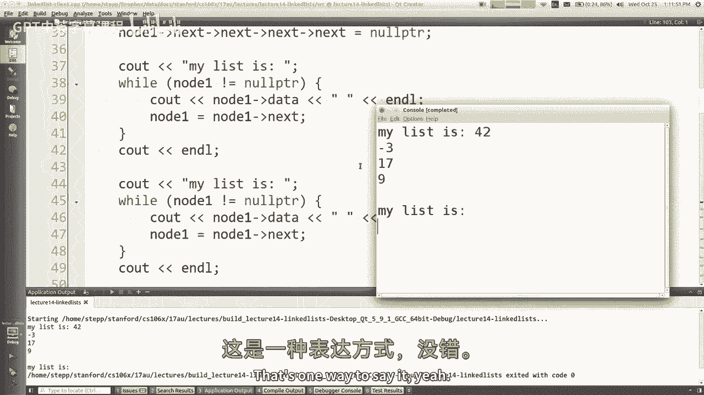

图片很有帮助，所以我列出了指向第一个音符或前面或其他什么的列表，你知道吗，我不知道我的职业叫什么，但我打印十个，然后我说让他等于，下一个点是什么，所以现在他指着这个，但我弄丢了巴林B，然后我打印这个。

我说指向下一个，但我失去了指向这些原始节点的指针，因为我把前面向前移动，你明白吗，就像我有这个，在那里列出要点，然后当我说列表等于列表下一个，它改变列表指向那里，然后在我打印20之后。

它将列表更改为指向那里的任何地方，但我要开门见山了，所有这些节点都坐在这里，他们仍然存在，他们仍然有数据存储在里面，他们仍然互相指指点点，它们最终连接到我所指的部分，但没人指出他们，你明白吗。

就像你在推特上知道的那样，你知道你可以跟着名人或很酷的人，或者随便你怎么指着他们，就像你在看他们一样，但好像他们没在监视你，就像单向的关系，你知道这就像，是啊，是啊，我和思嘉，Johansson。

就像约翰·德普，我们都很亲密，我们在推特上都是朋友，就像不不，你跟着他们，他们不跟着你，你不会被邀请参加他们的派对什么的，所以我想现在的情况是，这些家伙可能看起来还和链条有联系。

但他们只是他们不是因为没有人能接触到他们，他们指着链条上仍然可以到达的部分，但他们自己是无法联系到的，所以这是一个重要的区别，你能不能，您可以通过内存本身手动将列表的值编辑为双向，好好找回来的路。

你说过，是啊，是啊，我怎么解决这个问题，我怎么才能把名单找回来什么的，我想秘密就在一分钟前，我们学会了制造一个临时变量，我想这就是你要我做的，但我假装你没这么说，所以与其这样做。

让我们把它做成某种TAM或当前指针，并将其设置为列表的前面，或者我们的前指针的变量名是什么，因此，它将被创建为另一个箭头，指向开始，如果我跟着它打印它的数据，同样的十个也会出来。

如果我接下来设置电流等于电流，电流会哎呀，现在电流将指向20，如果我再说一次，当前等于下一个当前，然后电流会指向三十，以此类推，所以我可以用这个指针遍历节点，但我不会把我的气球串丢到名单的前面。

这样我就不会损坏任何东西。

不管怎样，回到这个程序，与其这么说，我要做的是，我说列出节点电流曲线或电流或等于节点一的东西，前面一个，然后我会说，当当前节点不是空指针时，打印它的数据并转到下一个，然后如果我想再做一次。

我将再次复制粘贴相同的代码，除了我不重新声明类型，我只说当前，所以现在如果我编译，我管理它，我得到了整个名单两次，我没有弄丢，所以很多时候你想把这些操作写成函数，所以你可以把这段代码，你可以把它拔出来。

你可以称之为印刷品，如果你给我一份名单，节点前端，我帮你把名单打印出来，所以我写了一张清单，节点，链表函数，你能看到，比如我们如何在这里建立一个收藏，我会写一个添加函数和删除函数，和打印功能。

和一个什么功能，他们都会走着一连串的东西，总的来说，我们将建立向量所具有的操作，或者链表有，或者别的什么，是啊，是啊，这么说的问题，如何在不引起内存的情况下删除其中一个，好吧好吧，让我们现在就谈谈那个。

我不认为我今天会删除，所以让我们做加法，我想我们可以做到这一点，让我们谈谈在列表的末尾添加一些东西，所以，嗯，在这里，我想说我的清单是，然后我会写打印节点一，我把第一个节点当作前面。

我想在列表的末尾添加一些东西，所以我有一个节点链。

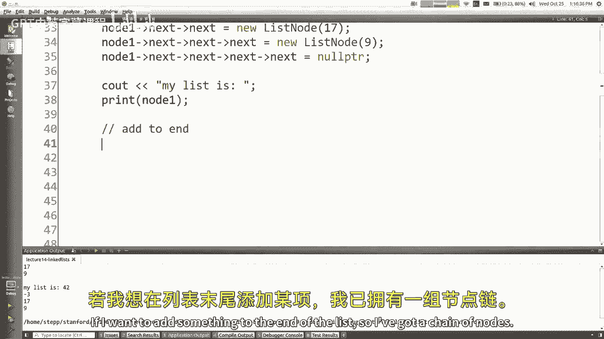

我的幻灯片里有这个的照片吗，它在哪里，这里，好啦，所以我有一个节点链，我想在最后添加一个新节点，这就是add方法在向量或链表上的作用，所以让我们把它写下来，所以基本的想法是，我得去名单的末尾。

然后在那里贴一个新的盒子，对呀。

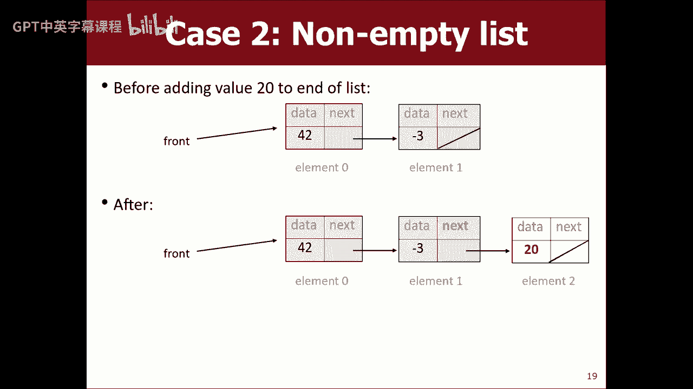

所以如果我如果我想做一个新的盒子，也许列出节点指针，新节点是新列表节点，也许我想加上八八的值，八八到名单末尾，所以有了新的节点，把它贴在末端，所以我认为你需要做的是你需要喜欢，走到列表的末尾。

这样我就可以把它放在那里，因为我没有直接的指针，指向列表的末尾，你可以有一个，但我不知道，那么你如何走到列表的末尾，这有点像打印一个列表，所以你说前面的节点电流等于节点一，当电流为零时。

我可以说电流等于电流，就像我想要的是。

我想做，所以我就在这里等着，然后我可以把他绑在这里，现在让我们仔细考虑一下循环条件，我希望电流是这个节点，这样我就可以在他之后安排一个新的下一个人，如果电流指向此节点，则为右，我想让循环停止。

什么会是真的，当我指向这个节点时，我的下一个将是不，并不是说电流将为零，电流不为空，电流指向这个，但我前面的下一个是空的，如果是这样的话，我想让这个循环停止。

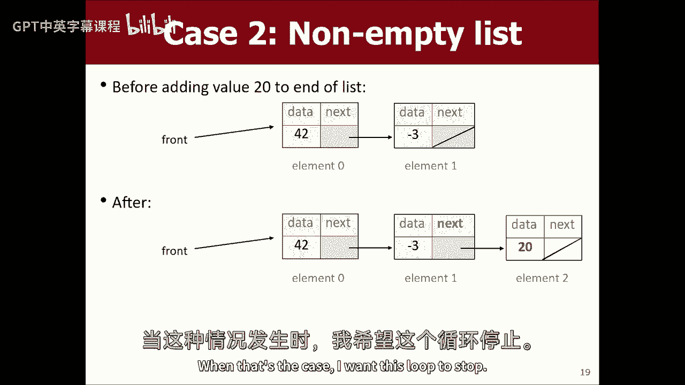

你明白的，所以重要的是要指出，像这样，直到电流为零，这个循环才应该循环，它应该循环到电流不，所以向前走，直到电流没有下一个，一旦我到了那里，在新节点处设置当前点，在新音符上做当前的下一个点。

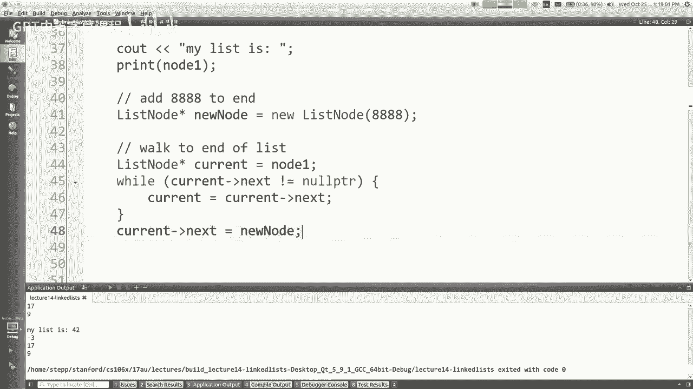

所以在我构造的新节点上设置当前的下一个点，是啊，是啊，列表为空，是啊，是啊，如果列表为空怎么办，所以我刚才写的代码走了一个现有的列表，但它可能不适用于空列表。

那么我该怎么处理呢，所以我只需要一些喜欢，如果为空，就像我知道我的主这里的这个列表不是空的，但让我们概括地说，所以如果它是空的，我想干点别的，但如果不是空的，我想这么做，所以如果列表为空，你怎么知道。

如果列表为空，空列表的含义是什么，你认为第一个前面的指针没有指向任何东西吗，那里没有节点，所以如果节点一，前面是零推杆。

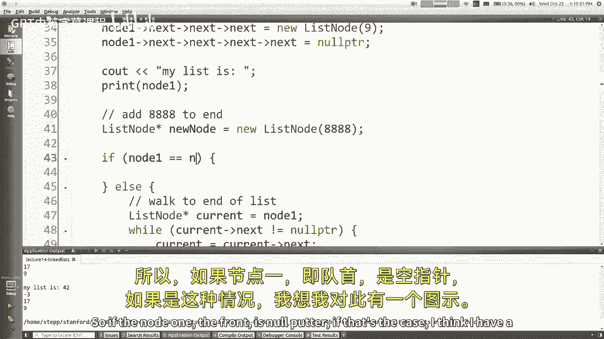

如果是这样的话，我想我有一张照片，我意识到我快没时间了，如果列表为空，那么前面是空的，我想做，所以后来就这样了，对呀，那么我该怎么做呢，我想在一个新的节点上做前端。

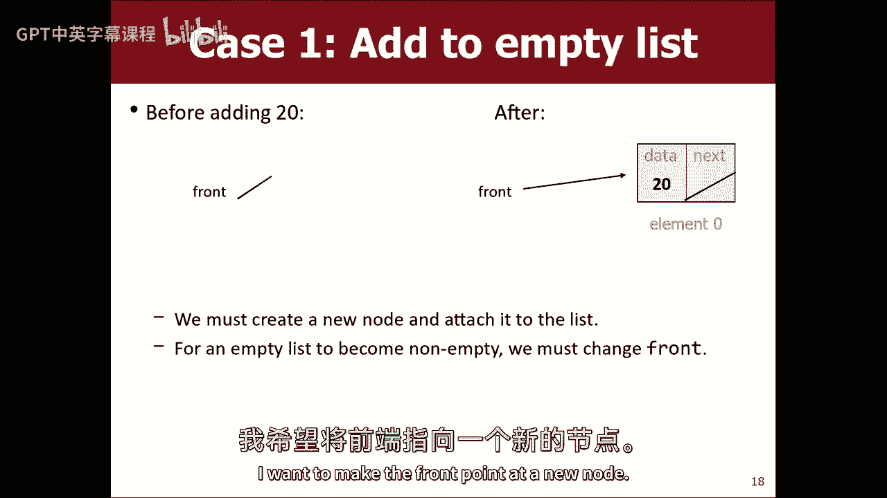

所以我应该说节点一个点在一个新的节点上，像这样，现在我要告诉你的最后一件事，我没时间了，但我还有一句话，我想在这里说，我最后要告诉你的是，如果你拿着这个，你想把它变成一个函数，所以你把这个。

然后你把它贴在，你下去喜欢，我有一个，我有一个加法，在某个地方加上就在这里，所以如果我把这个，不是八八八八，我写价值，所有这些代码仍然是正确的，但如果我运行这个，然后我把它打印出来，不会总是奏效的。

我给你一句话，原因为什么，然后我们会解释为什么在星期五，一句话，原因是我必须传递这个指针，我必须将此称为传递对指向列表前面的指针的引用，现在，狗屎变得真实，所以你看。

我们将解释为什么我们将在星期五更多地讨论这个问题，但时间长了，所以去你的部门，星期五见，我们在那里继续。

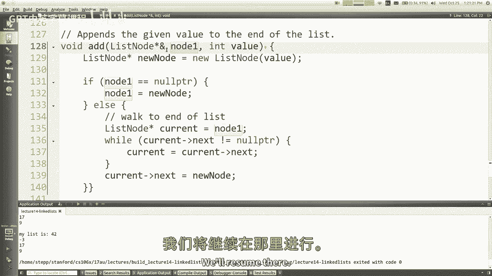