# 课程14：链表 📚

在本节课中，我们将要学习链表这一数据结构。链表由一系列节点组成，每个节点包含数据和指向下一个节点的指针。我们将探讨如何创建、遍历和操作链表，并理解指针在其中扮演的关键角色。

---

## 部门领导计划介绍

在开始今天的讲座之前，我想介绍科林，他是我们的组长之一。他将用几分钟时间介绍我们的部门领导计划。

我叫科林，是部门领导计划的协调员之一。今天来到这里，我很兴奋能和你们谈谈部门领导的事情，并鼓励你们申请。作为CS106X的学生，你们现在都有资格申请部门领导。


部门领导没有标准的形象，无论你的专业或身份如何，如果你有兴趣申请，我们都很想看到你的申请。

以下是关于部门领导计划的一些要点：
*   这是一份有报酬的工作。
*   它至少是两个季度的承诺。
*   你可以通过幻灯片或课后咨询了解更多信息。

成为部门领导的理由有很多。对于有教育兴趣的人来说，这是极好的工作经验。你可以学到很多关于计算机科学的知识，并与学生一对一地工作，看着他们成长，这是非常不可思议的体验。

部门领导团队由一群优秀的人组成，他们不仅善良，而且非常聪明。我们有很多活动，包括一些有趣的传统，以及与谷歌等公司举办的活动。

申请开放还有一个多星期。如果你对申请过程有任何疑问，欢迎通过电子邮件联系我们。

---

## 指针回顾与链表引入

上一节我们介绍了部门领导计划，本节中我们来看看链表。首先，让我们回顾一下指针。

指针存储其他值的内存地址。这个“其他值”可以是任何东西，比如一个`int`、一个对象或一个数组。

指针与构建链表密切相关。在链表中，每个元素（节点）都存储一个指向下一个元素的指针。我们用这些指针将节点链接在一起，形成链表。

创建链表节点时，必须使用`new`关键字在堆上分配内存。语法是：`ListNode* n = new ListNode;`。使用`new`关键字会导致系统在堆上分配一块足够大的内存来存放该类型的对象，并返回其起始内存地址。

将节点存储在堆上至关重要，因为堆上的内存在函数返回后仍然存在。如果只在栈上创建节点，当函数返回时，这些节点所占用的内存会被释放，链表将无法持久存在。

通常，我们只在栈上保留一个指向链表第一个节点（头部）的指针。通过这个头指针，我们可以沿着节点中的`next`指针访问链表中的所有元素。

---


## 指针赋值与链表操作

上一节我们介绍了链表的基本概念和内存分配，本节中我们来看看如何通过指针操作来构建和修改链表。

当代码中涉及指针的赋值语句时，需要建立正确的直觉。画图对此非常有帮助。


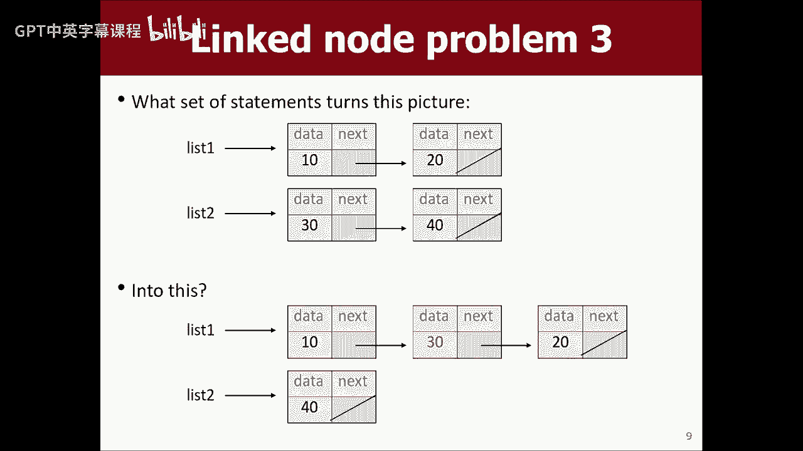

赋值语句`a->next = p;`意味着：让`a`所指向节点的`next`指针，指向`p`所指向的地方。
赋值语句`p = a->next;`意味着：让指针`p`指向`a`所指向节点的`next`指针所指向的地方。


本质上，这些操作是在改变指针变量中存储的内存地址。构建链表的核心就是操纵这些“箭头”（指针），让它们指向正确的位置。

让我们通过一个练习来加深理解。假设我们想将一个新节点（存储值30）添加到链表头部。

以下是正确的步骤：
1.  创建新节点：`ListNode* temp = new ListNode(30);`
2.  让新节点的`next`指针指向原链表头部：`temp->next = list;`
3.  让头指针指向新节点：`list = temp;`

**注意语句顺序**。如果先执行`list = temp;`，就会丢失指向原链表的指针，导致内存泄漏（无法再访问那些节点）。

---

## 遍历链表

上一节我们练习了在链表头部添加节点，本节中我们来看看如何遍历一个链表。

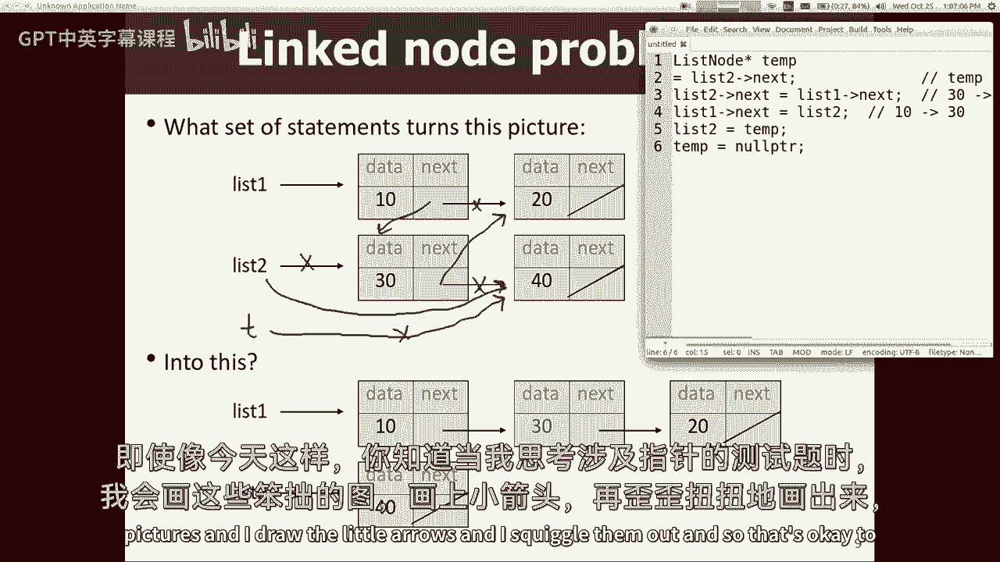

链表可能很长，我们甚至可能不知道其确切长度，因为长度信息并没有直接存储。如果我们只有一个指向链表头部的指针，我们想打印所有值，该怎么做呢？


我们不能像数组或向量那样使用`for`循环和索引。我们需要一个循环，沿着指针逐个访问节点，直到遇到表示链表结束的`nullptr`。

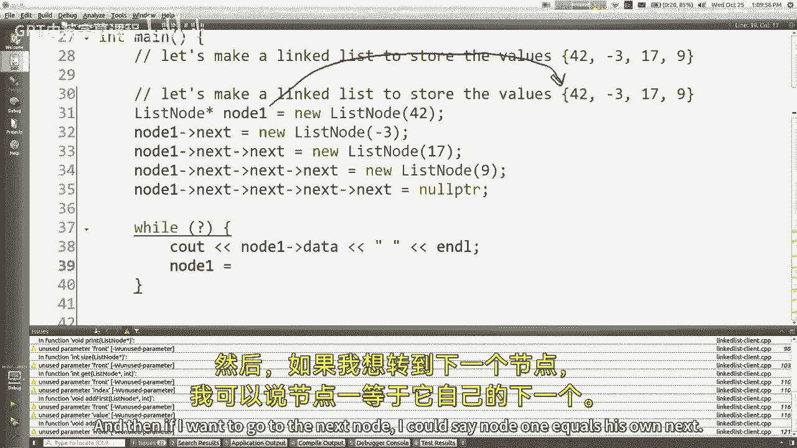


一个**错误**的方法是直接移动头指针：
```cpp
while (list != nullptr) {
    cout << list->data << " ";
    list = list->next; // 错误！这会使头指针丢失
}
```
这样做会丢失对链表头部的引用，打印一次后链表就“丢”了。

**正确**的方法是使用一个临时指针（例如`current`）来遍历：
```cpp
ListNode* current = list; // current指向链表开头
while (current != nullptr) {
    cout << current->data << " ";
    current = current->next; // current移动到下一个节点，list保持不变
}
```
这样，头指针`list`始终指向链表起始位置，我们可以多次遍历链表。

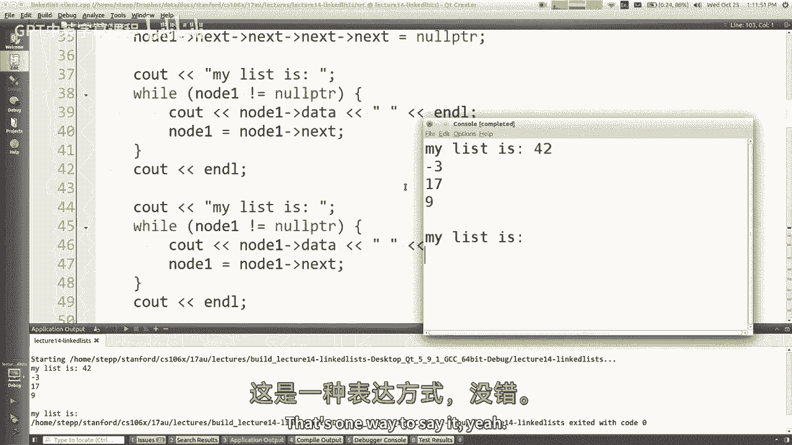

---

## 在链表末尾添加元素

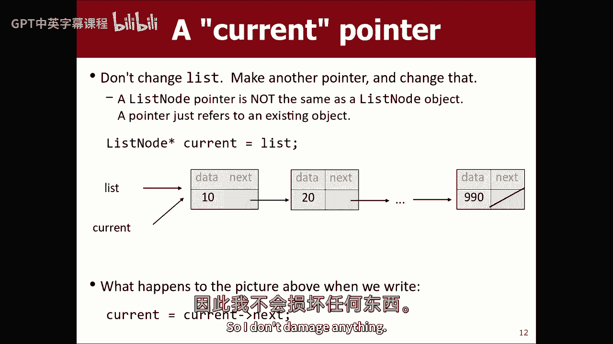

上一节我们学习了如何遍历链表，本节中我们利用这个技巧来实现一个在链表末尾添加元素的操作。

基本思路是：遍历链表，找到最后一个节点，然后让它的`next`指针指向新创建的节点。

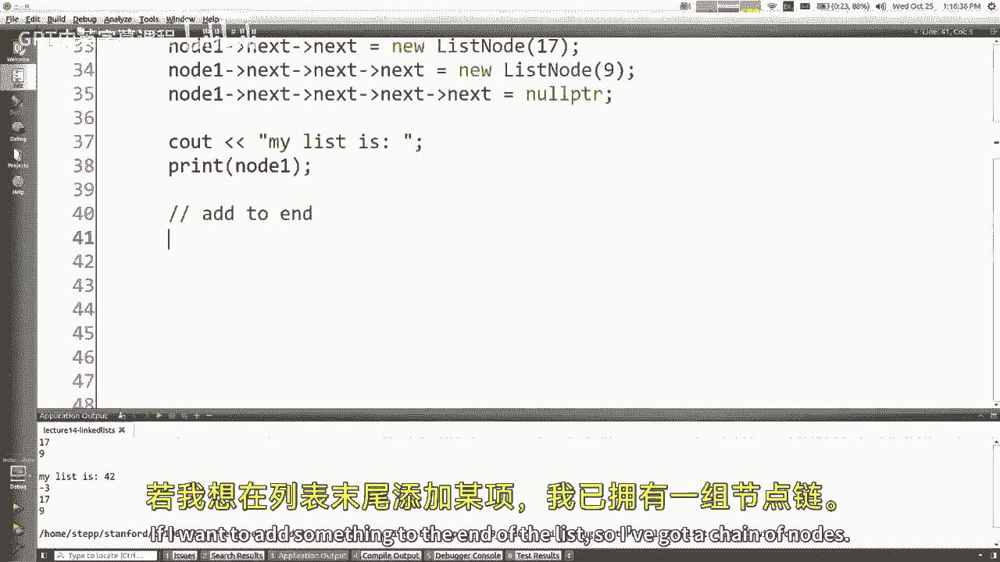

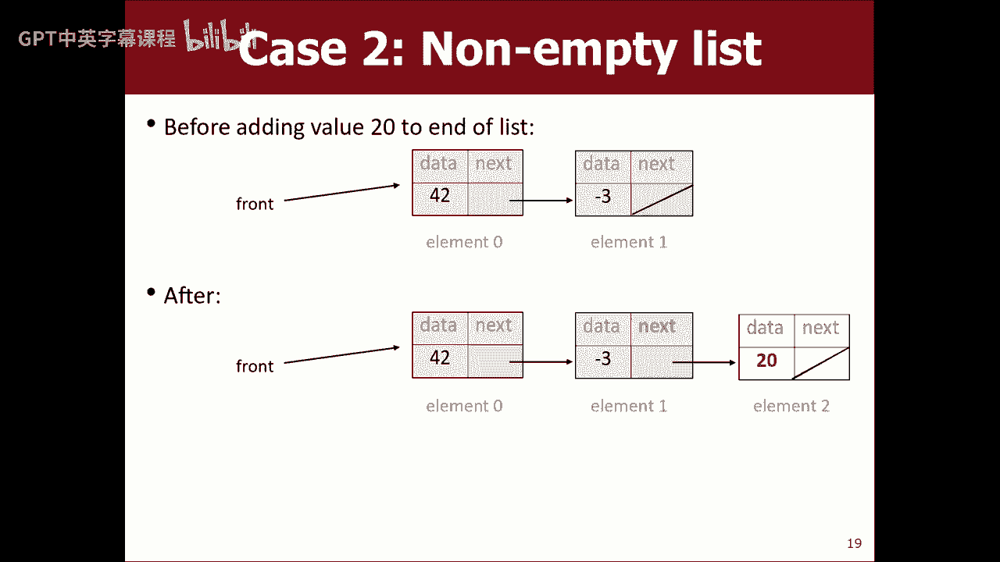

以下是实现步骤：
1.  创建新节点：`ListNode* newNode = new ListNode(value);`
2.  处理链表为空的情况：如果头指针`front`为`nullptr`，则直接将`front`指向新节点。
3.  如果链表不为空，则遍历到最后一个节点（其`next`指针为`nullptr`）。
4.  将最后一个节点的`next`指针指向新节点。


代码框架如下：
```cpp
void addToEnd(ListNode*& front, int value) { // 注意参数类型
    ListNode* newNode = new ListNode(value);
    if (front == nullptr) {
        front = newNode; // 链表为空，新节点成为头节点
    } else {
        ListNode* current = front;
        while (current->next != nullptr) { // 找到最后一个节点
            current = current->next;
        }
        current->next = newNode; // 在末尾添加新节点
    }
}
```
**关键点**：为了使函数能修改调用方的头指针（例如处理空链表时），需要将头指针参数声明为**对指针的引用**（`ListNode*&`）。我们将在下一节课详细解释其原因。

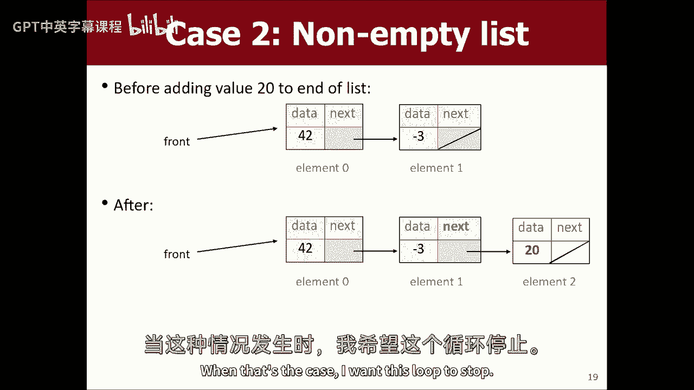


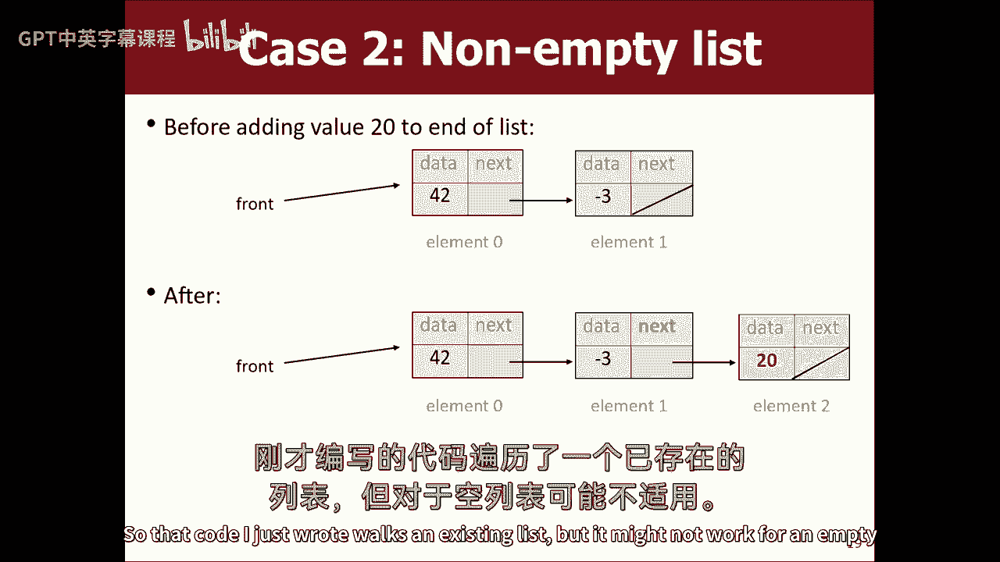

---

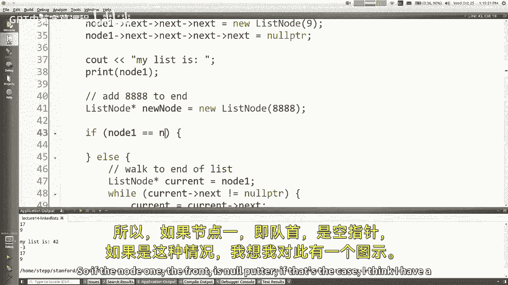

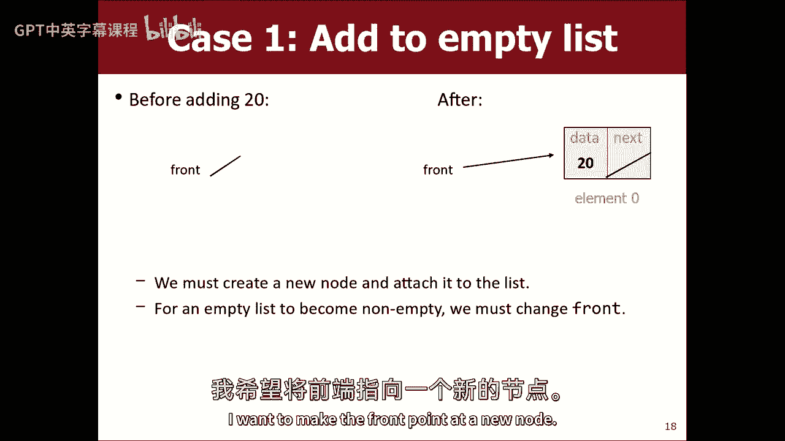

## 总结


本节课中我们一起学习了链表。我们回顾了指针的概念，理解了链表节点通过指针连接的方式，以及为什么必须在堆上分配节点内存。我们练习了通过指针赋值来操作链表，学习了如何正确地遍历链表而不丢失头节点，并初步实现了在链表末尾添加元素的功能。记住，在编写链表代码时，画图是理解和调试的极佳工具。下一节课我们将继续深入，探讨如何将链表操作封装为函数，并解释为何需要传递指针的引用。