# 课程15：链表操作进阶 🧩

在本节课中，我们将深入学习链表数据结构，并编写一系列操作链表的函数。我们将探讨如何计算链表大小、获取元素、在链表头部和尾部添加节点，以及如何安全地删除节点。理解这些操作对于掌握链表这一基础数据结构至关重要。

---

## 链表基础回顾

上一节我们介绍了链表的基本概念和结构。本节中，我们来看看如何对链表进行一些基本操作。

链表由一系列节点组成，每个节点包含数据和指向下一个节点的指针。

```cpp
struct ListNode {
    int data;
    ListNode* next;
};
```

## 计算链表大小 📏

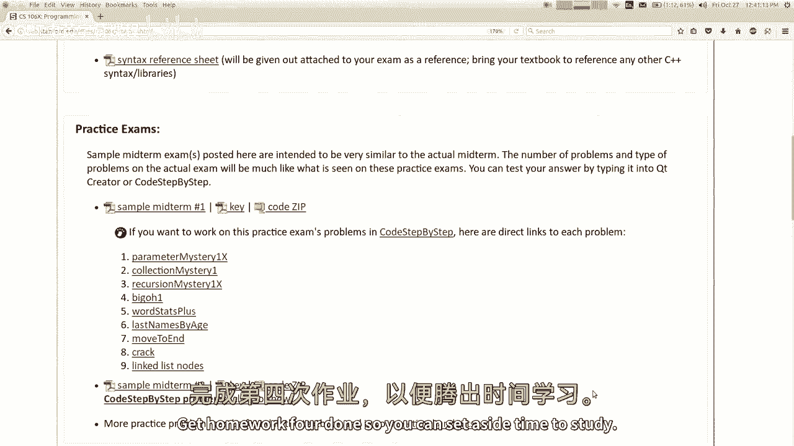

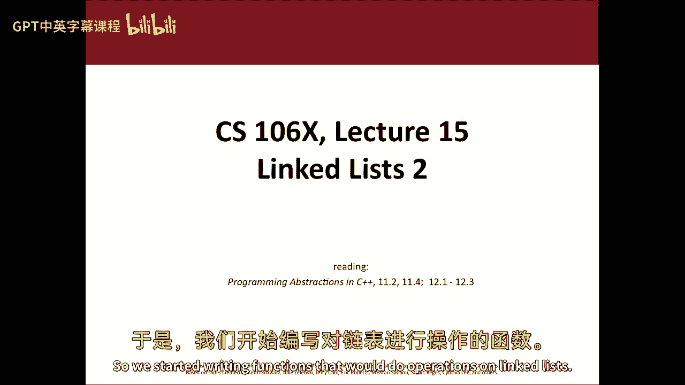

首先，我们来编写一个计算链表大小的函数。思路是从链表头节点开始，遍历每个节点并进行计数，直到遇到空指针。

以下是计算链表大小的步骤：
1.  检查链表是否为空（头指针是否为 `nullptr`）。
2.  如果不为空，则使用一个临时指针遍历链表。
3.  每移动到一个节点，计数器加一。
4.  当临时指针变为 `nullptr` 时，遍历结束，返回计数器的值。

```cpp
int size(ListNode* front) {
    int count = 0;
    ListNode* current = front;
    while (current != nullptr) {
        count++;
        current = current->next;
    }
    return count;
}
```

## 获取链表元素 🔍

接下来，我们实现一个获取链表中指定索引处元素的函数。由于链表不能像数组一样直接通过索引访问，我们需要从头开始遍历。

以下是获取元素的步骤：
1.  使用一个循环，让临时指针向前移动 `index` 次。
2.  移动完成后，临时指针指向的节点即为目标节点。
3.  返回该节点中存储的数据。

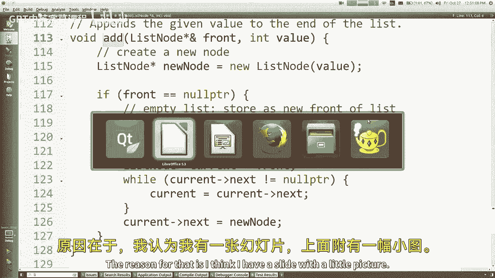

```cpp
int get(ListNode* front, int index) {
    ListNode* current = front;
    for (int i = 0; i < index; i++) {
        current = current->next;
    }
    return current->data;
}
```

**注意**：此代码假设传入的索引是有效的。在实际应用中，应添加索引越界检查。

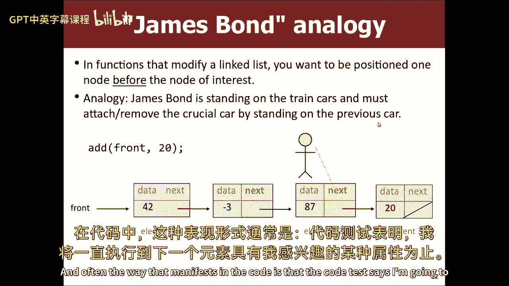

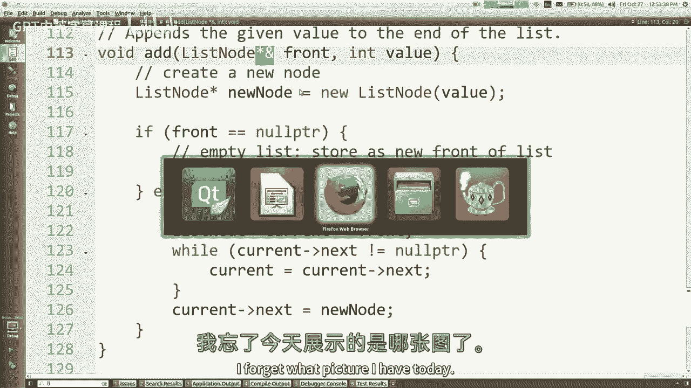

## 向链表添加元素 ➕

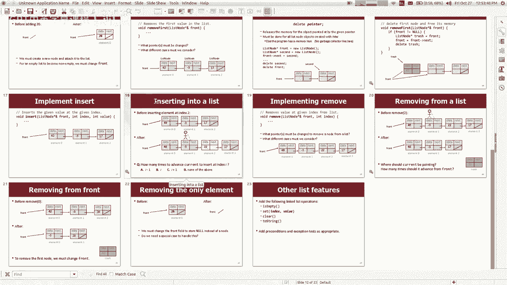

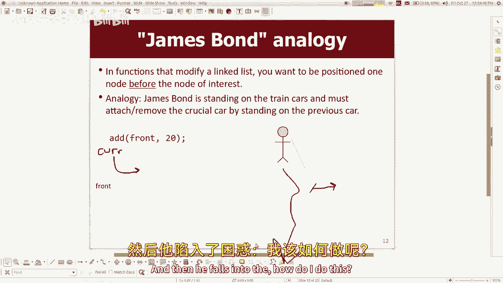

现在，我们学习如何向链表添加元素。这里有两种常见情况：在链表末尾添加和在链表头部添加。

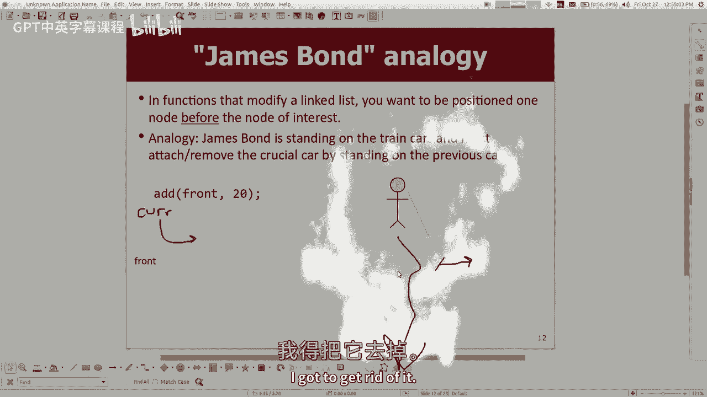

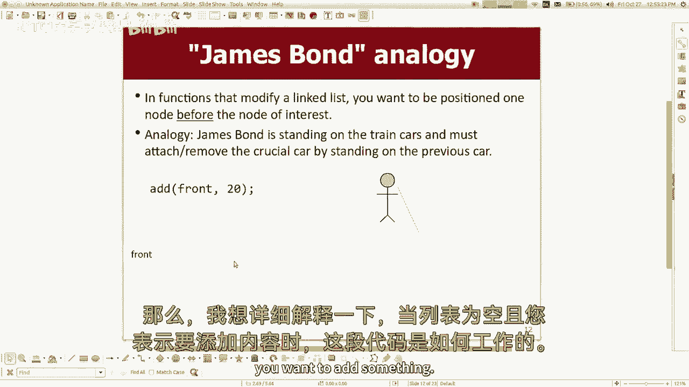

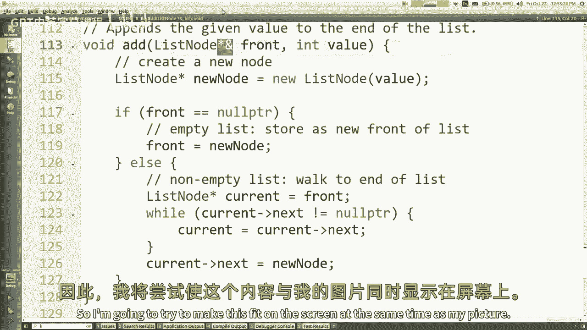

### 在链表末尾添加

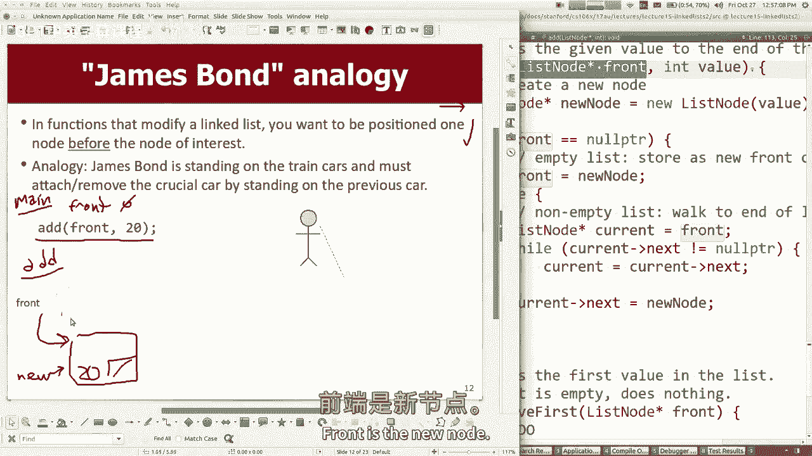

在链表末尾添加节点需要遍历到最后一个节点，然后将其 `next` 指针指向新节点。

关键点在于，如果函数需要修改链表本身（例如改变头指针的指向），则需要通过**引用**传递头指针。

```cpp
void add(ListNode*& front, int value) {
    ListNode* newNode = new ListNode{value, nullptr};
    if (front == nullptr) {
        // 链表为空，新节点成为头节点
        front = newNode;
    } else {
        // 遍历到链表末尾
        ListNode* current = front;
        while (current->next != nullptr) {
            current = current->next;
        }
        // 将新节点链接到末尾
        current->next = newNode;
    }
}
```

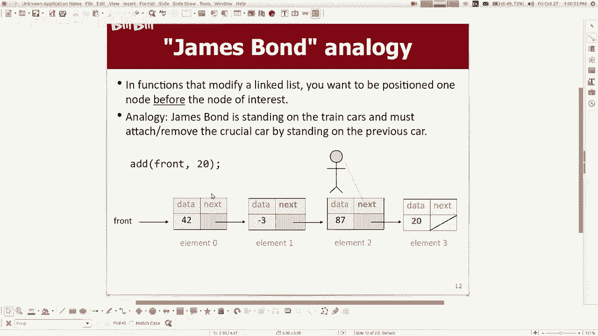

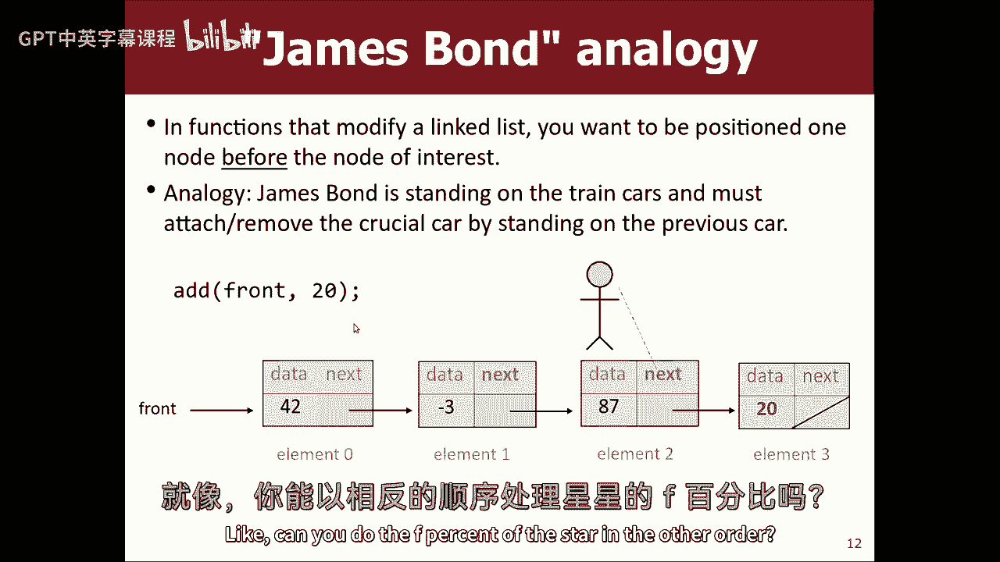

### 在链表头部添加

在链表头部添加节点更为简单。我们创建一个新节点，让其 `next` 指针指向当前的头节点，然后更新头指针指向这个新节点。

```cpp
void addFront(ListNode*& front, int value) {
    ListNode* newNode = new ListNode{value, front};
    front = newNode;
}
```

## 从链表中删除元素 ➖

最后，我们探讨如何从链表中删除元素。删除操作也需要考虑多种情况，并注意避免内存泄漏。

### 删除头节点

删除头节点相对简单：将头指针指向第二个节点，并释放原头节点的内存。

```cpp
void removeFront(ListNode*& front) {
    if (front != nullptr) {
        ListNode* trash = front; // 保存待删除节点的指针
        front = front->next;     // 头指针指向下一个节点
        delete trash;            // 释放原头节点的内存
    }
}
```

### 删除指定位置的节点

删除链表中间或末尾的节点需要找到目标节点的前一个节点，然后修改其 `next` 指针以跳过目标节点。

```cpp
void removeAt(ListNode*& front, int index) {
    if (index == 0) {
        removeFront(front);
    } else {
        ListNode* current = front;
        // 移动到要删除节点的前一个位置
        for (int i = 0; i < index - 1; i++) {
            current = current->next;
        }
        ListNode* trash = current->next; // 要删除的节点
        current->next = current->next->next; // 跳过该节点
        delete trash; // 释放内存
    }
}
```

**核心概念**：在C++中，使用 `new` 在堆上分配的内存必须使用 `delete` 手动释放，否则会导致内存泄漏。

---

## 总结 📚

本节课中我们一起学习了链表的一系列核心操作：
*   我们回顾了链表的结构。
*   实现了计算链表大小和获取元素的函数。
*   重点学习了如何通过**引用传递指针**来修改链表，实现了在链表头部和尾部添加节点的函数。
*   最后，我们掌握了如何安全地删除链表节点，并理解了在C++中手动管理内存、避免内存泄漏的重要性。

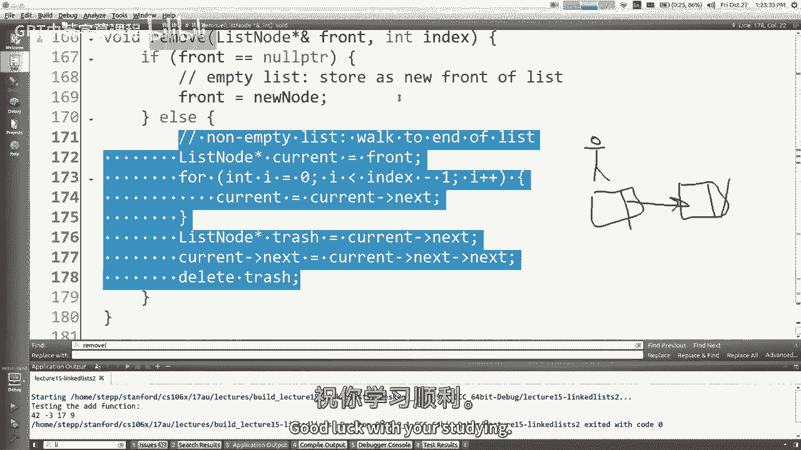

通过理解这些基础操作，你已为进一步学习更复杂的数据结构和算法打下了坚实的基础。