# 【编程抽象方法 cs106x 2017】斯坦福—中英字幕 - P16：Lecture 16 - Classes - 加加zero - BV1By411h75g

大家都好吗都一周了，星期一，我们基本上完成了一半，不过，这周晚些时候我们有个小事情要处理，如你所知，我们星期四晚上有期中考试，所以我希望你们开始考虑，期待那两个练习考试的研究。

我可能会在周四前再发一次练习考试，还有很多其他的问题，虽然，即使你完成了练习考试，去你的部分讲义，如果你想要更多的问题，转到代码，逐步网站，感觉到更多的问题，看完课本中的章节，有很多问题。

你甚至可以谷歌寻找旧的宿舍，一零六X或B的网站，他们有，他们有时会遇到其他示例问题，外面有很多问题，希望你不会出问题，用练习来练习是好的练习，尽你所能，从现在到周四晚上，嗯，我要给你们发些信息。

可能今晚或者明天早上我们就分头行动，因为我们要在几个不同的房间里做测试，我们不会在这里，那么我们要去哪里进行实际的考试呢？周四晚上将按字母表分开，就像姓，我要把你要去的地方发给每个人。

我也会把它发布在班级网页上，我会把它贴在广场上，我会寄的，我会发邮件给你，所以希望每个人都知道他们需要去哪里，我们还没有完全弄清楚，不过，明天就知道了，我想是的，好啦，那是考试。

你们还有其他考试相关的问题吗，我是说，2。我今天不准备复习，但我只是想看看是否有人对此有疑问，好啦，嗯，你知道怎么找到我，如果你以后有这样的问题，是啊，是啊，这就是例子，像链表一样的封面。

考试包括链表吗，是啊，是啊，我是说，我认为上周末是范围，我可能会更有可能给你点赞，在链表方面，我可能更有可能问你一个问题，这是之前的节点，这是笔记，在我想让你把这张照片变成那张照片之后。

与上周晚些时候的部分问题相反，在链表上写入方法，所以这是我在真正的考试中更有可能做的，实际上，从今天开始，我本周要讲的是，不会出现在期中考试上，所以说，当然你们今天都不会注意我，对呀。

但你的家庭作业需要它，你期末考试需要它，仍然需要知道，但不是周四对吧，之前还有什么关于考试的问题吗，我开始我今天的内容，是啊，是啊，那有什么用，第五份家庭作业什么时候交？它的到期日是一个星期后的星期三。

所以我的意图，我打算今晚或明天早上把新作业交上去，我的意图是你根本不会去想这件事，直到考试结束，就像这个即将到来的周末，这里会是，当你开始看它的时候，希望它还有足够的时间，有些人在订单中间发现。

不是因为我就是因为你其他的责任，是一个烂摊子，而且很忙，这可能是一个时候，你想利用今天晚些时候等到这个星期五，或者下周一交作业，那由你决定，嗯是的，反正，那是我们的总时间表。

所以好吧，我们来谈谈今天的内容，我有点转换档位了，我们上周一直在讨论链表，今天我想谈谈如何用C++构建类和对象，我也不知道，也许这似乎是一个奇怪的话题变化，你知道就像一家人。

Esque跳转到与之前的内容无关的东西，或者类似的东西，但我确实认为这和我们报道的内容有关，因为如果你看看我们上周写的代码。

我在可爱的创造者里有代码，我们编写了所有这些函数来对链表进行操作，你必须传递的所有功能，基本上是名单的前面，你必须传递一些你想做什么的其他参数，添加此值或搜索此值，或者把它移除，或者任何权利，这样很好。

我是说我们有很多这样的方法来使用这种风格，但这不是你真正做对的方式，像斯坦福图书馆的所有藏书一样，他们不是这样工作的，它们被写成对象的类，就像矢量是一个物体，哈希映射是一个对象，你创建一个，你申报一个。

然后在这个物体内部，它有一堆函数，执行该集合的所有有用行为的一组方法，对呀，所以我想学习如何教你们，如何在C++中做到这一点，所以我们可以把这个功能变成一个链表，上课。

好啦，在C++中就是这样做的，这就是联系，看，所以这与上周的内容并非完全无关，我认为任何实现数据结构的人都会把它作为一个类来实现，这就是我们要学的，我因为这是x，你知道的。

我想我会假设你们中的一些人以前已经实现了类，用另一种语言，请你举手好吗？如果您以前实现过对象类，是啊，是啊，你们大多数人都有，好啦，很多时候，你知道我告诉你，不管我假设你以前的知识是这样还是那样。

我要试着做手术，假设您以前见过类和对象，因为这就像是，我要复习一下，但我会尽量把重点放在，C++类，在语法和行为上，好的，好的，所以我们开始了，如果你想了解，它们来自第六章，所以这里的目标是。

我想写一个名为链表的类，实际上，我将调用我们的链接int列表，因为它储存int，也因为我不想与实际链表的名称发生冲突，来自斯坦福图书馆的类，但不管怎样，我们要写一个链表类，我们的类将包含所有这些方法。

列表本身将是一个对象，存储指向前面的指针，前面是一系列节点，所以它会管理，我是说，我想你可以这样想，我们写的所有这些函数。

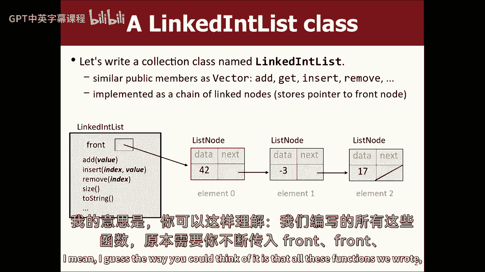

你经过的地方前面前面前面前面，对象将存储前面，然后所有这些方法，我再也不用把它作为参数传递了。

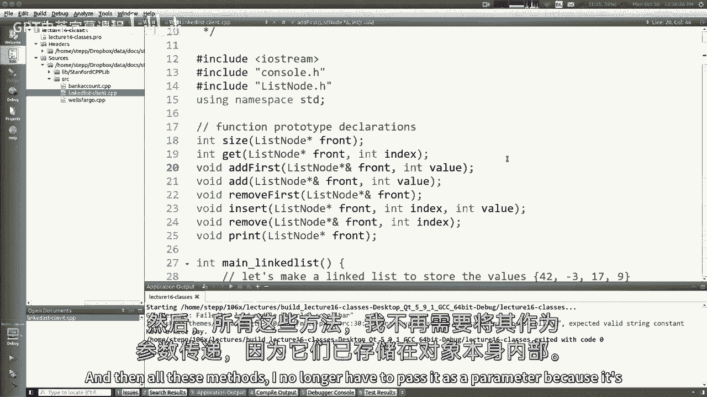

因为它存储在对象内部，计划是这样的，所以好吧，首先，我要倒回去学习一般的课程，所以再一次，什么是课堂，我想你们知道有一类是一种对象，一种对象类型的模板，它指定该类型中的内容，它存储了什么数据。

它存储了什么行为，如果您不太熟悉类和对象，我建议去读这本书的第六章，因为我不打算详细介绍什么是类，等等，去看看第六章，好好读读，嗯，就像有很多C++的类，你已经可以做新的了，取决于您的程序是什么。

你在写什么，如果你在做日历或活动计划，可以运行日期类，如果你在做学生注册系统，你可以写一个学生类、课程类或教师类，你在做一个金融系统，您可以创建一个银行帐户类，等等，对呀，魔兽世界游戏，你在执行。

你可能有一个兽人职业和一个人类职业，或者我不知道所有的熊猫熊类和潘多拉，我的魔兽有点落后了，我不知道所有的种族都是什么第三原型的东西，我不知道，嗯，什么是，我知道那是一类，那么什么是物体呢。

对象是存储数据并具有行为的实体，数据和行为的混合，好的，数据基本上是用变量来表示的，行为被表示为方法或函数，这个物体把这些东西放在一起，所以这很重要，你想把所有这些都放在一起，我想总的来说。

面向对象编程的思想是，大多数代码都涉及到确实工作的对象，并与其他对象交谈以帮助他们在主C++中不是对象，它不是面向对象的，但是如果Main创建了一个对象来做很多花哨的事情，就像G窗口或向量。

如果G窗口产生了一个G椭圆形，g o创造了一个g矩形什么的，那么大部分代码实际上是由对象完成的，所以你可以说这是一个面向对象的程序，我们喜欢拥有类和对象的最大原因之一，是因为它提供了一个叫做抽象的概念。

也许你以前听过这个词，当然这个想法是，你不必总是知道某件事是如何工作的所有细节，为了使用它，很多现实世界的例子，我不知道我的这个小玩意里面发生了什么，但它很好用，我知道怎么用，我不用打开它。

了解电路板和所有的东西，你知道生活中各种各样的例子，一堂课是一样的，如果我告诉你一个类有什么方法，您实际上不需要阅读代码来查看类是如何实现的，只要你明白它会做什么，有什么功能可用，你可以用对它。

所以这是件好事，它为程序提供了一个抽象层，当然我不需要说服你，你一直在利用它，所有季度，您还不知道哈希映射是如何工作的，可能是，但你一直在用它，所以你去那里，嗯好吧，所以我们存储为变量的类中的内容。

我们称它们为成员变量，你可能听说过另一个术语，比如实例变量或字段，或者基本上每种编程语言都为这个东西起了另一个名字，你所说的，存储在对象内部的变量，从技术上讲，在C++中应该调用的名称是成员变量。

我听说很多人喜欢，我想大多数部门领导都称它们为实例变量，所以不管我挑什么你最喜欢的，将函数，存在于物体内部的行为，我们称之为成员函数，很多人把这些方法简称为，我说过我想在过去很多次。

语言会给同样的东西想出新的名字，我想在上课的第一天或第二天，或者我说的任何东西，比如Java调用函数，方法，你知道功能和方法是一样的，但函数是C++对它的称呼，方法是Java对它的称呼，那多半是真的。

但我认为技术上来说如果你想对你的术语吹毛求疵，函数应该是与任何特定对象无关的东西，而方法应该是存在于对象内部的东西，所以我认为从技术上来说，调用对象内部的函数是可以的，语言标准中的C++术语是成员函数。

好啦，这些成员函数的一个重要之处在于，你可能已经知道了，对象的成员函数可以与该对象的数据交互，比如如果一个银行账户里有一个平衡变量，你写一个存款方法，存款可以与银行账户的余额相互作用，对其调用方法。

所以这是一个重要的想法，我们会好好谈谈的，然后通常在一个类中，你也有一个构造函数，您可以在创建对象时初始化对象的状态，当它诞生的时候，您可以传入一些参数或设置一些设置，然后对象就可以使用了。

所以我的假设是这对你来说是新的或不新的，除了术语，这些概念并不新鲜，我希望到目前为止大部分是对的，这么好，到目前为止有任何问题评论，说我的麦克风，我不知道，嗯好吧，所以让我们。

让我们试着谈谈所有这些东西的C+版本，在C加加中，当你写一个类时，您通常编写两个文件，编写一个点h文件和一个点cpp文件，还记得一开始上课的时候，我们学习了如何用分号声明函数的原型，然后。

您可以用花括号编写函数体，这基本上就是这种分离，您可以声明您的类的名称是什么，它的所有功能是什么，它的所有内容都用分号放在点H文件中，然后您可以编写这些函数是如何实现的主体，在cpp文件中使用花括号。

从技术上讲，您可以将所有代码放入一个文件中，把它们分开被认为是更好的风格，原因之一是因为你知道，程序中的其他文件将希望包括您的类磅包括，所以他们可以用它，一般来说，您希望它们包括这个标题。

如果您将标题和CPP混合在一起，我想这里的想法是，使用你的类的人可以看看这个，H文件的标题，他们不知道所有的方法是如何实现的，他们只会看到他们的名字，或者参数是什么，他们只需要知道这些，所以它把。

你的类的用户不应该在Java中查看，没有这种分离，事实上，大多数语言只是将这两个概念混合在一起，如果你有课，你只要做一个点Java文件，你把所有的代码都放进去，那没有错。

我认为这是大多数语言决定去的方向，但是C++认为把这两件事分开可能会很好，所以不管，所以是的，这是代码的主要分离，我马上就给你看，比如你在每个文件中都写了什么样的语法，但你我们会在我们所有的例子中。

我们每次上课都会有这双，下面是一个类的样子，这张幻灯片上有很多废话和语法，但我觉得这样更容易，如果我把所有的东西都放在屏幕上，一个h文件以几行开始以一行结束，前面有这些哈希符号的行称为预处理器指令。

它们有点像包含声明，你在哪里，将一个文件链接到另一个文件，你知道这些线条的作用基本上是，这样您就可以避免多重定义问题，因此，如果您的项目中有两个文件都希望使用您的类，他们都会说他们想把这个班包括在内。

包括该类的点h，但问题是，如果您理解该命令是如何工作的，包括，从字面上获取该文件的内容，并将其粘贴在那里，所以如果你不小心，发生的事情是，它们都粘贴在类的声明中，所以现在类在整个文件中定义了两次。

在您的整个编译项目中，然后编译器不喜欢这样，它说了，不管是什么课，它基本上尝试两次构造一个类，所以我们把这个说唱歌手放在文件的顶部和底部，这基本上是说，如果我以前从来没有包括过这个文件。

然后我想把这个定义为那个，然后结束，否则什么都没有，所以基本上这里的顶部和底部的东西会让它，这样您就不会意外地包含了您的类的多个副本，你必须做一件愚蠢的事，因为c+是愚蠢的，我关于这个语言特写的社论。

但你必须这么做，如果你不做，你在那里会有麻烦的，这个有一个更短的版本，在那里你可以说像庞德·普拉格马一次，但这并不像某些编译器那样兼容，所以我不打算先用那个，所以无论如何，你说，如果if和def定义。

如果只是为了向你展示。

我们要写一堂课，作为第一个例子，我们要写一门叫做银行账户的课，银行账户点H等在这里，我要说像，你知道的，类别银行帐户，如果你去一个程序，就像使用银行帐户类，你知道的，也许你们已经知道了。

一堂课通常不是一个完整的程序，类就是模块，可被其他文件用来帮助解决问题的库，所以如果你在这里有一个银行账户类，你可能有一些叫做Wells Fargo的客户端程序，或者是想用银行账户的东西。

所以你可能会说包括银行账户点h，现在你做到了，您可以说该类中的银行帐户B分号现在存在于此文件中，因为我把银行账户H，但如果我说包括银行账户点H两三次，它应该说重新定义类银行账户，好像你有两份。

如果两个不同的cpp文件各包含一次，也会产生类似的错误，所以解决方案又是，幻灯片上写的，那就是我在顶部有这个愚蠢的东西，我说的地方，如果不是定义的银行帐户h，然后我想把银行帐户h定义为这个类。

然后我说如果部分结束到结束，这个下划线是什么，它是一个预处理器变量符号，从技术上讲，这可能是任何东西，我可以写沃尔马蒂的死，你好，这里，只要这个在一个字上和这个匹配。

约定是使用与您的类名或昵称完全匹配的名称，所以如果是食物h，你说下划线食物下划线h或类似的东西，为什么下划线，因为那样你就不会把它和，就像你程序中的一些变量，或者类似的东西，好吧。

现在我把如果和def的东西，我重新编译了它，至少现在编译成功了，尽管我把它包括了很多次，基本上接下来的两个包括，什么都没做，因为如果从来没有进入顶部，好啦，这就是类的外壳。

现在呢，类里面的内容，是构造函数、方法和变量，这可能看起来很像Java，除了一些不同，一个是在Java中，类的每个成员，你通常在它的前面写一个说明符，你说的地方，不管是公共的还是私人的，右C加+。

您可以有一个类的公共部分和一个类的私人部分，是同一个概念，同样的想法，完全一样的意思，只是你说公众的，你写的都是公开的东西，然后你说私人的，你写了所有私人的东西，你实际上可以来回切换。

你可以想一些私人的事情，一些但你可以的东西，你想换多少次就换多少次，但它更传统，他们有一个公共的东西和一堆私人的东西，是啊，是啊，所以你有一个公共冒号语法，或者像你们一样，我想说和Vo一起公开。

你得用冒号这样做，是啊，是啊，我是说，如果你想假装是Java，你可以在这些东西前面写一个冒号，它看起来有点像Java，但它还得有结肠，那不是很传统，虽然我认为这是人们通常做的方式，然而。

这不像是一个主要的大会，就像Python中的自然键，你有两个联合国，那是二等兵，但这是不对的，有一些语言使用约定来表示事物，但从技术上来说，它们并不是强制执行的，就像你说的，Python语言。

如果你用某种方式命名事物，你在向别人暗示这是公开的或私人的什么的，尽管语言实际上并不限制或强制该约束，这确实加强了这一点，必须是公共这个词，不是随便不是别的词，就像，必须是公共冒号，我马上就来。

如果你有什么私事，然后其他文件试图触摸它，它会给出编译器错误，所以是的，这是现在一个重要的区别，否则，我认为这个语法的大部分将与Java语法相同，如果你想用Java写一个构造函数，你说公开课。

你要在一部经典的戏剧里写一个方法，你说公共空虚，不管公众是什么，都一样，你说过你只是不对公众说同样的话，实例变量的变量数，田野，你只是通常会，你会说私有int x什么的，相反，你说私有冒号。

然后把所有的变量都写出来，语法的一个小问题是在类声明的末尾，你绝对要写一个分号，否则就没用了，我年轻的时候，我会说我失去了一两个小时的生命，寻找我在课程结束时忘了放的丢失的分号，有一件事很酷。

虽然实际上，我不知道你有没有注意到，但当我开始输入可爱的创造者时。

我实际上打了一堂课，好像里面什么都没有，但我只是键入类银行帐户括号输入，它把模拟冒号给我，所以这就像，哦感谢上帝，对不起，也许你们没有和我一样的情绪反应，但就像我刚刚失去了一天寻找一个愚蠢的分号。

在一节课后，我忘了把。

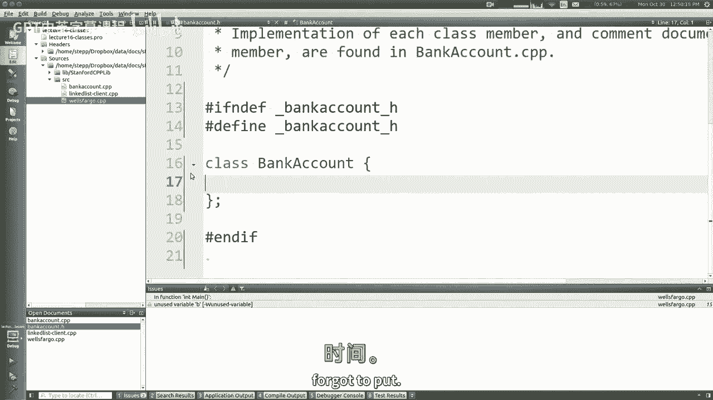

但不管怎样，你必须有一个分号，但总的来说，我会说，除了语法差异，这些命令做你认为它们会做的事情，但你也会注意到这里有半列，所以它非常类似于函数原型，你们一直在用的，我只是看看课堂上会有什么。

然后在另一个文件中的CPP文件中，我要用花括号和，尸体什么的，你能有私人构造函数吗，你是单身，是啊，是啊，你可以有一个私人的，因为你可以，我是说，基本上你从Java中看到的任何小东西。

您可以使用静态方法，你可以有私人方法，您可以拥有私有构造函数，你可以有各种很酷的东西，你知道吗，几乎所有的事情都是一样的，有几个重要的区别，我要试着给你看，但坦率地说，大多数喜欢的答案，你能做到吗。

或者你能像这样，这可能是你能做的事情的一个超集，在Java或Python中，因为c加上，他们不知道什么时候该退出，所以他们，他们增加了每一个功能，即使它是邪恶的，就像你看《星际迷航下一代》。

你就会知道有一个安卓数据，然后是邪恶的安卓传说，他是个坏人，你知道的，不同的是，知识是首先建立的，他有更多的特征，好像他有感情，但后来他学会了嫉妒、恶毒和刻薄，所以他们在数据上做了一个新的没有情感的。

他更简单，但后来他是好人，他是个更好的人，你知道的，他们从错误中吸取了教训，我是劳拉，这种语言里的东西太多了，它是邪恶的，嗯，和意见和赠款，所以这就是点，H，所以就像一个快速的例子，会在这里，银行账户。

每个物体都有名字和平衡，所以也许有那么一秒钟，一个快速的黑客就像你可以把变量放在你的公共中，那不被认为是好的风格，但也许这可以让我玩一秒钟。

所以如果我回到可爱的造物主那里，如果我说公开啊，字符串名称，双重平衡，所以这就像那个人的名字，谁有银行账户，双倍就是他们有多少钱，我不知道你可以有一个INT ID，就像一个帐号，或者类似的东西。

你可以有各种各样的字段，我想指出的一件事是，就像任何其他文件一样，你知道如果我在这里用绳子，那么实际上我应该说，字符串，如果我想叫它字符串而不是STD字符串，我应该说使用名称空间，所以就像所有的一样。

还是c++右，所有的规则都适用于这里，嗯，所以现在只是，你会注意到我没有，我是说文件是分号，然后CPP文件就像尸体一样，但我实际上还没有任何功能，我没有任何构造函数或方法。

所以我实际上在技术上还不需要CPP文件，所以就这样，我可以去找客户，使用这个的东西，所以我可以像银行账户B一样，然后我可以说B一个点名等于马蒂，余额等于，你知道我有五块钱。

或者任何银行账户B一个两个B一个两个点的名字等于Meron Homi，两个余额，他赚的钱比我多一点，不管你知道什么，所以我的意思是我显示我显示银行账户在一到六A，当我教这门课的时候，所以如果你把我的A。

你可能看起来有点眼熟，但就像我认为一个非常重要的概念，我想你已经知道了，但我只想确保每个人都在想这件事，这里重要的概念是当你做一个类，您正在启用一种新类型，一种新型变量，一种新型对象。

程序可以使主要的用户能够创建和使用权利，真正重要的是，如果我做两个，每一个里面都有一个名字，每一个里面都有一个平衡，这不像我说的银行账户有名字，有一个字符串叫做name，在程序的某个地方不。

这是一个模板，每次我做一个我就会得到一个名字，每次我做这个，我得到了平衡，所以这真的很重要，这就是我所说的实例概念，您创建的每个对象都是该模板的另一个实例，你在银行账户里申报的那些东西的另一个复制品。

H文件，好啦，我想你已经知道了，但重要的是要记住，因为如果我改了这个人的名字，它不会改变那个人的名字，他们是分开的，他们彼此不同，对呀，重要的概念，好啦，所以即使只是这样，嗯，我有点课。

它内部有很小的变量，对呀，但这显然是不完整的，所以让我们再走远一点。

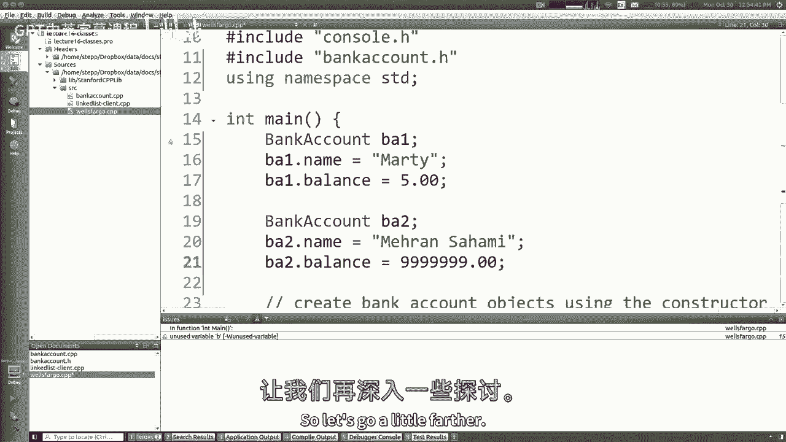

所以哦，这里有一个，这里有一张照片，我想如果你想拍张照，就像在小堆栈上，银行帐户对象基本上是一小块内存，有足够的空间放绳子，也有足够的空间放双倍，或者别的什么，所有的成员变量都是对的，好啦。

就像我们已经学会了结构，基本上是一样的，只是几个变量合二为一对吧，好吧好吧，现在让我们来谈谈成员函数，所以如果你想写成员函数，您现在突然必须编写一个cpp文件，成员函数的语法与常规函数完全相同。

除了在函数或方法名称前面，你写的类，两个冒号，所以这有点奇怪，我想他们可能在这个语法上搞砸了一点，我只是要告诉你一个小秘密。

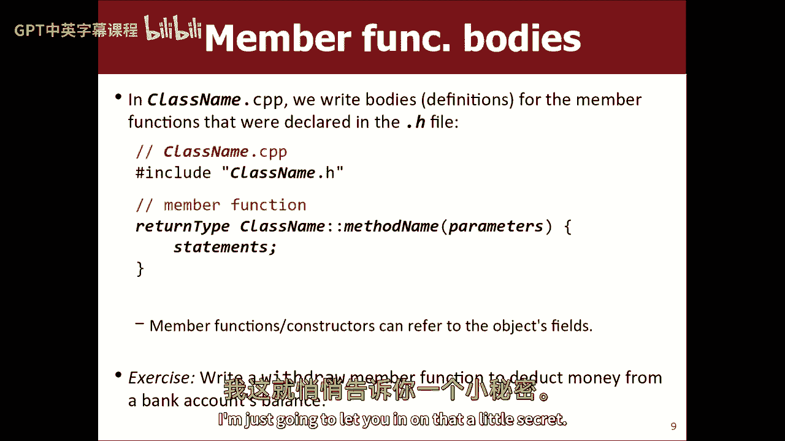

所以你看，我给你看看银行账户，如果你说你知道你有一个名字和一个平衡，就像，我觉得应该有一个叫无效存款的功能，你可以把钱存入银行账户，所以让我们看看，它回来了吗，它有很好的参数吗，可能是双倍。

你存入一定数量的钱，当然，这个想法是，但是，你在这里花了很多钱，我来调整平衡，这就像增加了平衡，基本上是对的，这并不意味着很复杂，但是当你想实现函数体的时候，带着花括号，你去银行账户CPP文件。

所以现在银行账户CPP现在完全是空的，通常CPP和H是相同的，除了用分号代替，你有大括号，对呀，所以你，你可能会想象你会做这样的事情，您知道在CPP中，您将粘贴类，但你会那样做的，你知道的，但没有。

那不是你该做的，取而代之的是，你拿着这个，所以你要做的第一件事就是你的CPP文件，你需要猛击，包括您自己的H文件，因为您的cpp需要知道类的声明，它要把谁的身体，所以这是你要做的第一件事。

接下来你要做的就是写出所有函数的所有主体，这样你就不会复制到类标题上，您只需像这样复制方法头，哎呀像这样，现在你用大括号写，但你得把它和普通的存款功能区别开来。

你必须区分这不仅仅是一个叫做存款的全局函数，这是一个类的方法，称为存款的银行帐户类，你区分它的方法就在你写的函数名之前，我个人认为这看起来很完整，我不喜欢这种句法，你就是这么做的，如果你要写十个函数体。

你必须把银行账户Colin放在十个中的每一个前面，这就是这些身体的语法，关于这些成员函数，最重要的是，你可能会从一个，或者你以前的编程经验，这些功能，这些成员函数，它们在任何物体内部运作，你叫他们。

好啦，就像一般，我想要存款功能来增加银行账户的余额，所以如果我来到这里，我说加等于量，这是一件非常重要的事情，我的意思是你所谓的“零钱押金”，那个物体平衡了那么多，所以这里有一个概念。

我称之为对象上下文，你得明白，每当此代码运行时，此时您在一个银行帐户对象中，你可以在那一刻引用那个对象的数据，它会修改它，或者使用来自该对象的数据，这不同于常规的全局函数，对他们来说没有这个概念，就像。

例如，如果我来到这里这个客户代码，你知道这个使用银行帐户的代码，如果我说B一个点存款，你知道十二个，当存款代码运行时，理解这一点非常重要，它在这个对象上运行，所以它将把这个平衡修改12，就在这下面。

如果我说B A 2点存款1美元或其他什么，也许他得到了，他有九个，九十九八，他上升到九什么的，在那一刻，存款正在这个物体上运行，所以它改变了这个物体的平衡，所以如果你输入存款密码，我只是说平衡。

我不说b a 1余额或b a 2点余额，不管我是谁，我的余额应该改变对吧，代码是对象真正重要概念的一部分的概念，关于这门课的前提概念，是啊，是啊，你需要通过推荐信，虽然，因为一份好的，对呀。

所以我想问题是，如果你没听到，1。这个帐你是按人头算的吗？或者我想说的是，思考这些事情会让你误入歧途，因为你不喜欢，传递银行账户作为参数，非参照，不是指针，不是像你叫存款那样。

隐含地知道这是感兴趣的对象，所以它就像通过自己，所以它知道自己是谁，不知何故，我们可以谈谈它是如何知道的，如果你真的想，但就像你不喜欢，传递对象，任何方式的银行账户，您的代码不能做到这一点。

这个用这个的名字，你不能那么做，在这里嗯，你知道你不必提到你自己，必要的，我是谁，AM是什么参数，我是我指针的引用，我是常量吗，我是什么，你只是，你只是存在，您在此代码中隐式存在。

您作为对象的身份隐式地包含在此代码中，事实上，我们有时称之为，隐式参数，因为代码中没有任何地方说明它，但就是在那里，你知道这种存款在我身上的想法，因为我是银行账户，有一种方法可以在目标代码中引用您自己。

如果你用了Java或Python或其他通常会说，如果你想把自己称为一个对象，它在Python中被称为，你有时说自己，但那只是个惯例，你可以叫它这个，如果你想用Java这么想。

你可以用C++来表示这个点平衡，你可以说这个箭头平衡，同样的想法，如果你熟悉这个概念，所以这意味着无论你在什么对象上调用这个函数，但是，你可以说平衡而不是平衡，你的意思很含蓄，这个物体的平衡。

因为这里有一个箭头，你对此了解多少，是个指针，它的类型是银行账户明星，所以从技术上来说，这里的机制是，当你说b a 1点存款时，它将这个点设置为1，然后它运行这个代码，这就像c+所做的。

调用对象上的方法时，但一般来说，你不需要经常写这个，因为它暗示了，如果你真的想看奇迹发生，您可以设置一个小断点并在调试器中运行，我忘了它会显示什么，我觉得会有好东西，所以呢，我的代码在这里暂停。

我有两个银行账户，另一个里面有垃圾，因为我还没有真正达到，然而，你可能会说等等，为什么这个会在这里，我还没到这一行呢，为什么会在那里，从技术上讲，c plus提升了这些定义，并将它们作为垃圾留下。

直到您到达初始化它们的行，但我们别再提那件事了，如果你想仔细观察，就像第一个物体是Eoe，第二个是一个很像，如果有帮助的话，内存地址可能有助于您了解这些对象中的哪一个是，哪个。

所以我从来没有设置ID外观，它怎么会有一个随机的垃圾号，因为我从来没有设置过，所以它只是耶，垃圾C加未初始化变量，嗯所以当我说存款，如果我现在接那个电话，我在里面看，这就是那个物体，你看，所以。

如果我说余额加金额五应该是加十二，所以我得到17个，现在我击中了支架，所以我回去，现在再看看缅因州，马蒂有十七个，但如果我能成为一个二，我声明我把名字设置为Maron，我把余额定在很多钱，我叫定金。

如果我跳进去，还记得伊伊为马蒂，梅隆一人，如果我跳进去，嘿嘿，这是一个，我是梅龙，对呀，所以我余额加上金额，它的转速是998，再加一块钱，他到了那里，我退出，所以我的意思是。

我想我想你们已经从以前的经验中得到了，但我只是我真的想确保这很清楚，你以前也见过，如果你对这些东西是如何工作的感到好奇，我是说你可以穿过它们看，看着它发生，你知道在调试器里，任何。

到目前为止有什么问题吗。

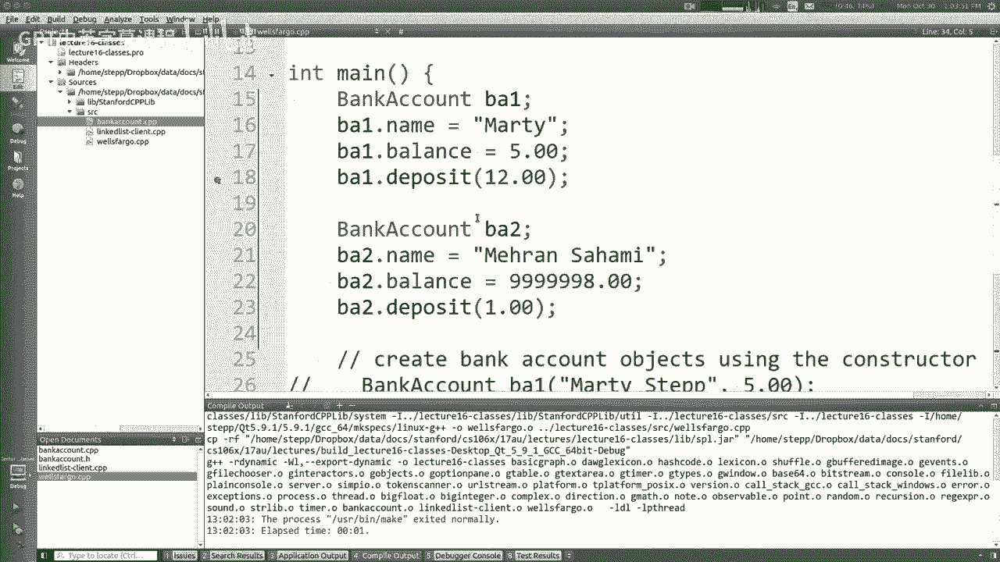

好啦，好酷啊，我是说，主要是新东西，下面是语法，我希望，这些概念你大多熟悉。

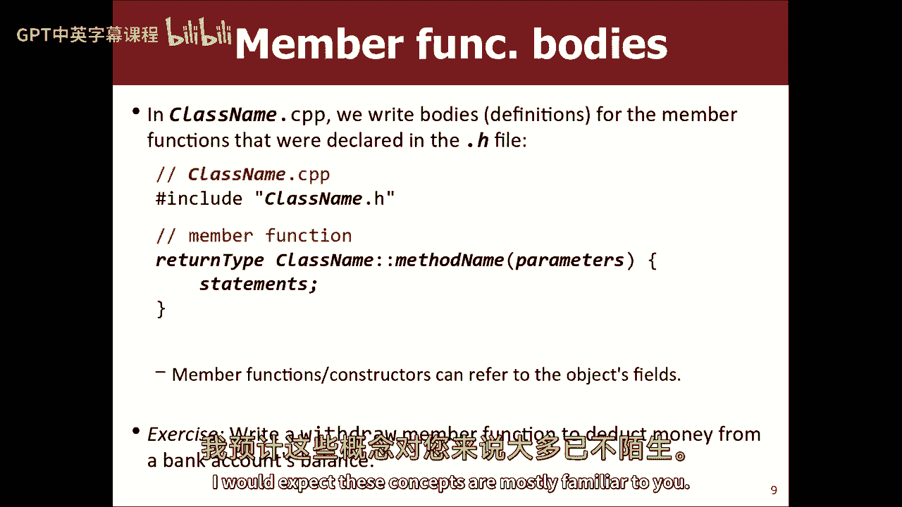

嗯，好啦，所以就像其中一个原因，你知道的，学生们总是问的经典问题是，为什么我要存款方式，我可以说1余额加等于12对吧，这就是它的作用，有存款方式有什么意义，如果只是把几个数字加起来，你对此有何反应？

是啊，是啊，假期封装，好啦，你什么意思，比如什么，为什么这样做更好，通过方法修改变量，通过成员函数和值，您可以创建安全检查以确保您没有执行该值，或者是的，我想你已经捕捉到了我想谈的很多东西，你说的是。

如果我强迫客户像这个主要的人总是和对象说话，通过调用它的方法，而不是直接接触它的变量，这将允许我有一些支票和一些保护，和物体上的一些东西，是啊，是啊，我认为那是正确的想法。

我可能想要的银行账户支票的例子是什么，非否定喜欢喜欢，也许我们有一个撤回，就像一个很简单的例子就可以了，我有存款，我们也撤退吧，我会从CPP去H并退出，撤回和撤回是减去金额很大，所以这似乎很简单，好吧。

现在我回到那个人身边，使用它的客户，我说实际上我想提取12美元，哎呀哎呀，马蒂没有12美元，我现在不想让他那样做，如果允许我说负等于十二，我无法阻止双倍变成负7对吧，但如果我强迫他们使用撤回。

然后我可以说嘿之类的话，嗯，等一下，你知道的，如果你的余额足够大，可以提取这笔钱，那我就这么做，但除此之外我不知道，我可以打印一条错误信息，我可以抛出一个异常，或者我可以默默地不执行这个动作。

现在我可以保护这个变量不被滥用，你可以做的另一个检查是，你可能会说很好，我不想让他们，你知道的，提款负一美元，偷偷存一块钱，或者任何你能做的，你可以把任何支票，你认为你的课程需要，那是啊。

那正是正确的想法，除了，当然，到目前为止的问题是，现在我，即使这个方法有那些检查，我可以避开这些检查，说啊，余额等于负七对，所以它仍然不能阻止我，所以你用封装这个词。

这就是如何完全阻止恶意客户端做坏事的方法，对呀，那么如何获得封装，是啊，是啊，您必须使对象的变量是私有的，这应该是您的审查，对吗，所以在这里你把你的方法公之于众，你把你的变量变成私有的。

现在它不允许他们做，当然，这意味着它也不允许他们这样做，我们希望那是我们就像初始化对象一样，哎呀，看来我们需要一个例外，的特例，就像我希望能够设定这些值，当我初始化新创建的对象时。

您通常如何实现正确编写构造函数，那么如何用C++编写构造函数，另外你回来说，银行账户，把你名字的绳子和余额的双倍递给我，或者你只是把名字传给，我不知道你不用给我余额，也许你从没有钱开始，差不多吧。

所以现在在H文件中，然后在CPP中，我会写银行账户冒号冒号，银行帐户字符串名称，再说一次，这看起来有点奇怪，但这就像你只是把它在h文件中的样子，但是你用银行账户冒号作为名字的前缀，所以银行账户冒号冒号。

银行账户，是啊，是啊，所以你就会说，如果我把一个名字作为参数传递进来，我想将帐户设置为以它为名称，我想把它设置为零美元作为余额，所以实际上你可以做的是，如果这叫名字，你可能想叫它不同的东西。

所以你可能会说也许n所以如果这是n，您可以说，将我的名字设置为n，将我的余额设置为零，这个构造函数类似于存款或取款的方法，从某种意义上说，它是在一个对象的上下文中操作的，该对象隐式参数，在这种情况下。

对象是在那一刻诞生的对象，所以如果你回到富国银行，你会说Java中的银行账户，你会说银行账户b a等于一个新的银行账户，然后你会超过马蒂，差不多就是这样，这是C++中的Java语法。

您只需删除等于新类型部分，你说银行账户B一个马蒂，调用构造器传递马蒂，然后存储在该变量中创建的对象，一个银行账户B一个语法看起来有点奇怪的账户，但你就是这么做的，假设我想要中的功能。

就像我的银行帐户对象，它有一个构造函数，名称只有一个参数，或者使用一个可以包括银行和起始余额的，我做了一个构造函数，它与，就像默认值，就像你处理函数一样，当然，你可以说都等于零。

所有常见的函数都应该适用于这里，我可以通过一个可选的余额，或者如果你没有通过一个，你得了零分，那么在CPP中，你说双弓平衡等于肠道，对呀，当然有用，那我想我能做的就是，我可以过来有几个方法。

我可以初始化一个银行账户，我可以说银行账户马蒂，然后我可以说是一个存款，五美元就能让我达到五美元，或者在这里我可以说银行账户B两个马龙萨米逗号这么多钱，所以现在他会开始，我不必做两行，好啦。

所以现在我编译所有编译，但在这里，我得到了一个平衡错误，等于负七，它不让我做，二等兵的规则是你的阶级，你的档案可以看到这个东西，以及其他文件，任何其他代码都不那么私密，指银行账户方法。

银行账户建设者可以看到它，改变它，看看它，没有其他人，你能在一行上声明一个变量吗，然后你可以在另一条线上指导，你能申报吗，啊，你能申报一个银行帐户吗，但直到另一条线，是啊，是啊，在Java中。

你有时可以做银行账户B分号，然后你可以说B等于一个新的银行账户，没有嗯C加加上喜欢，那是一种更多，如果你想这么做，你得做一个指针，银行帐户指针，是分号，然后你会说B等于一个新的银行账户，马蒂·乌姆。

所以申报银行账户的概念，但您还没有初始化它，然而，你不能在C++中真正做到这一点，而且你必须初始化它，当你宣布的时候，或者如果您不想初始化它，这就是指针的作用，您将创建一个空指针。

然后你会把它指向一个新的，你不能像有一个如果声明，它以一种基于条件的方式或另一种基于另一种条件的方式初始化它，因为我是说总会有办法的，但就像，是啊，是啊，我是说你想的风格更像是Java，ISM。

就像c+不是那样做的，是啊，是啊，所以这条线就像你声明的那样，你初始化它，准备好出发了，你可能会说，啊，我不喜欢那样，但我会说，你会有更少的bug关于未初始化的空对象，因为这个模式。

所以我不知道做的每件事都有利弊，我只是补充，C加加脏，把它从我身上弄下来很好，我喜欢它，不会再发生了，我答应你，好啦，好啦，所以你不能，你不能设定平衡，那太好了，当然问题有时也会出现。

你可能会喜欢打印的地方，就像，看你怎么知道，我的余额是一个余额结束，就像，啊，我印得不好，但我不想改变它，你不需要保护我，我只想把它打印出来，那么你通常怎么解决这个问题呢，你就像个讨厌鬼，一种访问方法。

让您看到余额，但不会让你如此频繁地改变平衡，你这样做的方式是你来到这里，你说双倍获得平衡，所以它再次返回余额，所以在这里我只是字母表，我喜欢按字母顺序，因为我就是那样，所以你说银行账户有余额。

你说回报平衡，所以不管是什么东西，我返回我的余额变量的值，但我要按价值退货，在它成为复制品之前，所以你不能惹我，我是说这就像，类比，在这里，这个银行账户的余额就像，当你去银行存钱的时候，他们去做。

你要一份有余额的收据，你答应了，那个副本是得到平衡，如果你把它撕了，你不会输光你的钱，对呀，或者如果你在那个东西上加一个额外的零，你拿不到十倍的钱，因为它是复制品，这是一个，这是一个，它是那个值的表示。

就像在富国银行，我可以说B一个点得到平衡，现在它编译并工作，还有我的老板，上面说五个，因为它没有在那里提取，所以我想说清楚，就像如果你说b a 1得到平衡，减等于七，它不让你这么做。

因为你基本上是想说5减等于7，它没有到达，它不工作，这不是参考，所以它不让你这么做，好啦，Private实际上保护内存中的数据吗，还是它只是隐藏了它，就像如果我把指针返回到天平，你能进去把它弄乱吗。

是啊，是啊，这是个好问题，不幸的事实是，私人的东西只在访问点保护，就像你知道天平的内存地址，你可以伸手进去摆弄它，它会让你这么做，事实上，其实不难弄清楚它的内存地址是什么，因为你要的是1的和号。

在它前面有一些字节数，你知道吗，也许第一块地就在上面，下一个字段在它前面四到八个字节，所以你实际上，这是一个在C++中不存在的问题，甚至是常量，不一定意味着绝对没有办法修改那个东西。

但我要说的是它能保护你免受，就像这是你真正想要的东西，我不能直接去改变变量，一切都会好的，我是说，如果我们不给用户一个指向余额的指针，我们会没事的，如果他们只是访问随机的内存地址。

那我不知道他们已经很邪恶了，他们罪有应得，所以是的，私人功能有什么用例吗，当然当然，我的意思是，我想这个例子应该很简单，这样我们就可以像上课一样交谈了，大多数时候你写得更大，更复杂。

比如去看看作业的启动代码，我要写一个大文件，这就像一个贵，我会有一堆功能在那里，动画之类的，我不希望你们调用所有这些函数，所以我会做一些像拼字游戏的GUI，家庭作业四，规格上有一张桌子，列出了五个功能。

剧透警报，在boggle gui中有五个以上的函数，但我让你接触到了他们的另一个，因为我不希望你们乱来，我不想让你打电话，所以是的，我保护我的代码不受你的代码的影响。

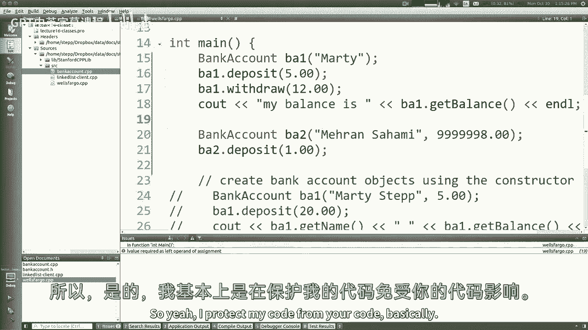

基本上，私有函数肯定有一个用例，不，不是真的在这里，但在其他例子中，所以再一次，主要是对概念的回顾，但是C的语法，再加上它是新的东西，好啦，那么我们在哪里，我们在哪里构造函数构造函数，是呀，是呀。

我跳过了一些幻灯片，不过，好吧，让我们看看有时在课堂上，如果客户不好，抛出异常，就像我们写的构造函数，我们把平衡参数，嗯，他们可以在那里通过负10，我们所有的存款提取，他们试图防止负数。

但如果我们从负数开始，这只会让我们处于一个糟糕的状态，所以有时候如果你得到不好的参数，你你扔，因为我无法初始化，我想我可以把余额设为零，如果是阴性，但很多时候这意味着这是衣领上的虫子。

所以我想告诉他们他们有一个bug通过扔弹跳，就在他们后面，比如你去银行你有一张负7美元的钞票，你转向存款，就像把它扔向你一样，你的脸还是怎么的。

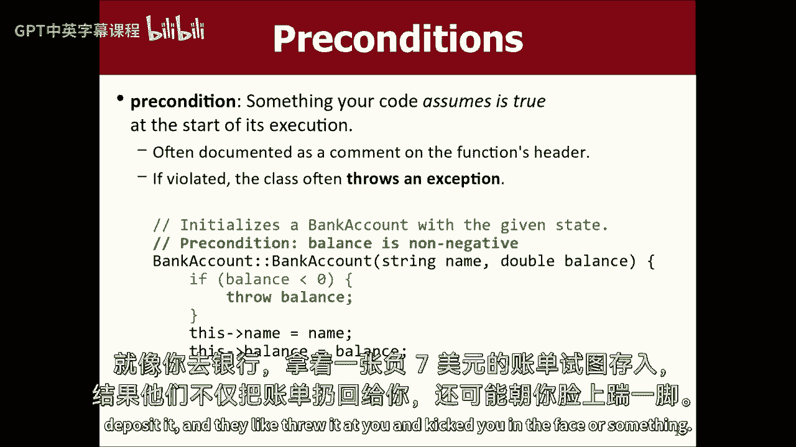

我不知道，我不知道这是什么类比，但你知道你去上银行账户课，你说你知道如果val小于零。

扔弓，你只要把它扔向它，好啦，好啦，先决条件，那还有什么，私人数据，让我们谈谈康斯特，所以您可以在类中使用const这个词，常量的含义变得更加重要和复杂，当你处理一个类，我想你已经知道缺点是什么意思了。

你不能改变这件事，但是在C++中至少有三种不同的方法可以使用const，您可以声明一个变量，这意味着在你设置了它的值之后，你可以重新设置，那是可以理解的，很简单，您还可以传递参数，那是缺点。

尤其是常量引用，就像这里，这是我的矢量，大家可以看一下，但请不要改变元素，我在问我的推荐人，所以我和你分享我的矢量，但我不会让你改变的，好啦，罚款，这就像你把你的手机给你的小侄女什么的，但你把它锁起来。

这样她就可以把脸打开了，向奶奶问好，但她不能删除你所有的联系人，或者别的什么，你知道的，就像上锁了一样，但你可以拿着它看一分钟，然后还有第三条路，如果你在写一门课，您可以编写一个常量方法。

语法是你只写一个词，方法标题末尾的常量，意思就是你，由于本课程的作者都承诺该方法，如果调用该方法，它不会改变物体的状态。

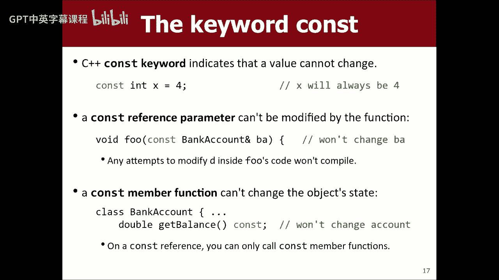

所以如果你看看我们班，我们有存取款和余额，存取款，他们改变了平衡，它们改变您调用它们的对象的状态，他们是变种人，他们是修饰语，他们改变了对象，这得到了平衡，它不是只返回信息，所以你可以在这里说常量。

你可能会说很好，为什么，有什么意义，做，我不得不这么说，我给你看，我可能要到星期三才能全部看完，但这么说，如果有人碰巧声明了一个变量，这是一个常量银行帐户变量。

或通过一个银行账户是一个常量的银行账户参考，它只允许您调用它上的方法，上面有这个骗局的关键字，这就是它如何知道哪些方法是允许的，哪些不像这里，如果我说平衡在h中是常量，我还必须回到cpp。

把它写成const，很多人把它们混在一起，他们忘记了这些必须彼此同步，但现在这样一个，有几件事会发生，当我在这里说常量，一个是如果我试着做一些不固定的事情，就像如果我说平衡加，另外，这就像嘿。

你答应过不会那样做的，所以它实际上不让我编译，所以这很酷，好的，让我们摆脱它，另一件事是在客户端，如果你把这叫做，它知道这种方法不会修改银行账户，就像这里的一个例子，你可能会做一些像void这样的事情。

做事做事做事，对银行账户做一些事情，做一个，你可以对银行账户做一些事情，嗯，我可能会通过，我应该参考一下，但你可以做的是你和说好，我想确保打电话的人，知道我不会修改这个，所以我会说缺点是一口井。

如果你想做这种事，B A存款，B A撤回，B得到平衡，它不会让你存取款，因为它就像嘿，3。你坚持要我改变这个主意，但你想改变它，所以常量在类中限制，客户可以用什么方式使用它，如果他们的参数或变量是常量。

所以这有点有趣，事实上，如果你看看斯坦福图书馆，像向量类或哈希映射类，如果你往里面看，其中一些方法实际上是常量。

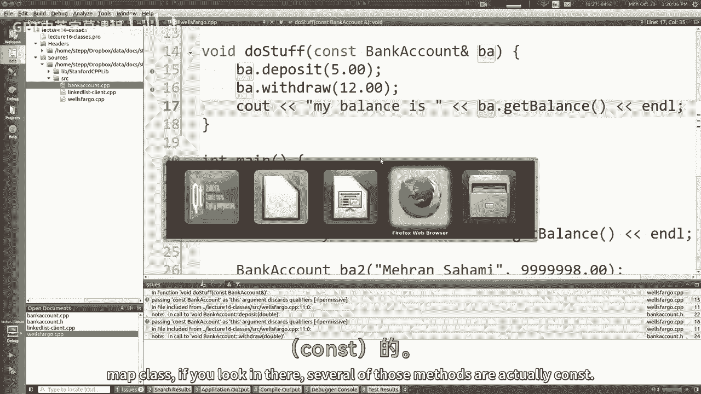

差不多该走了，但这是我给你看的最后一件事，如果你去找斯坦福大学图书馆的文档，你向上看就像矢量什么的，矢量在哪里，所以如果你看这些标题，比如void add，有道理，空白清除。

但是如果你看看这些方法中的一些，比如get it说const，因为你可以从矢量中得到东西，它不会改变，向量插入，常量不是吗，但像常量一样是空的，所以你可以这样计算，我到底要不要改变这个东西，我不是。

我要在上面写上const这个词。

所以客户端知道它不会改变对象，好吧好吧，这不是我们想说的关于物体的一切，但我最好在那里停下来，祝你学习顺利，星期三的课我在这里等你们。

