# 课程16：C++ 类与对象 🧱

在本节课中，我们将学习如何在C++中创建和使用类与对象。我们将从链表操作的传统函数式写法过渡到面向对象的封装写法，理解类如何将数据和行为组合在一起，并提供抽象和封装的好处。

---

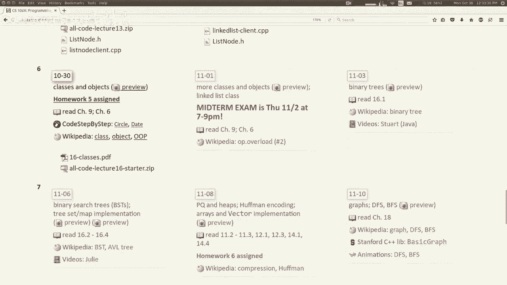

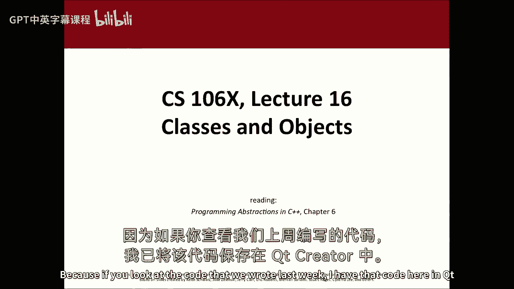

## 概述

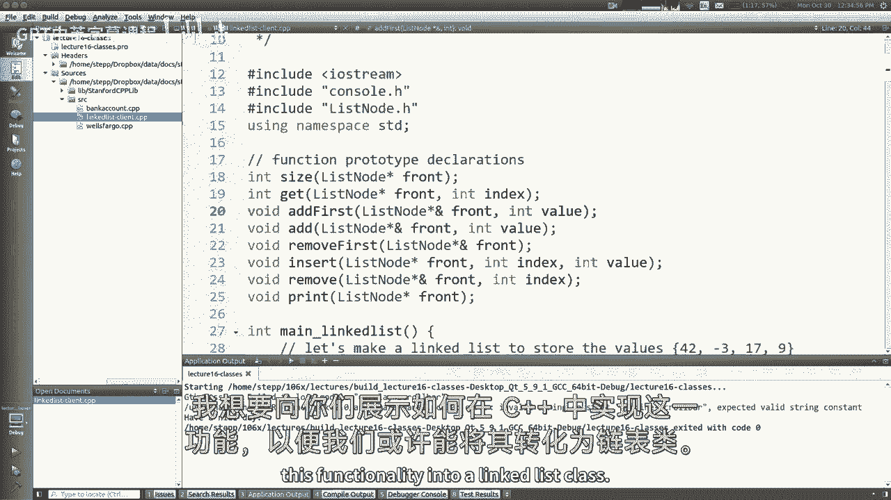

到目前为止，我们编写了许多操作链表的函数，这些函数都需要将链表的头指针作为参数传递。然而，在标准的库（如向量、哈希映射）中，数据结构通常被实现为对象，其内部包含了数据和操作数据的方法。本节课的目标就是学习如何用C++构建这样的类，将我们的链表功能封装成一个`LinkedList`类。

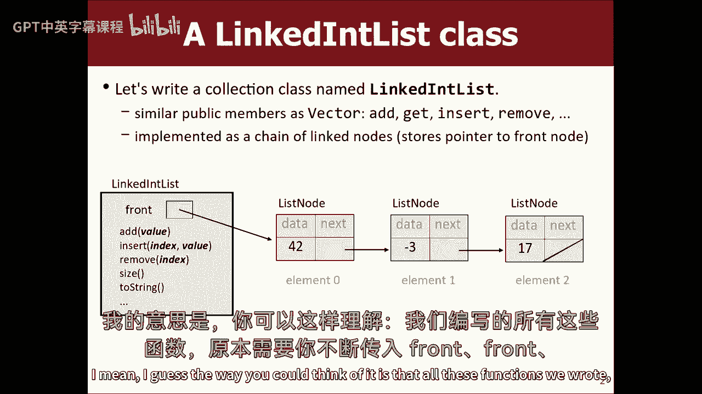

上一节我们介绍了链表的手动操作，本节中我们来看看如何用面向对象的方式重新组织这些代码。

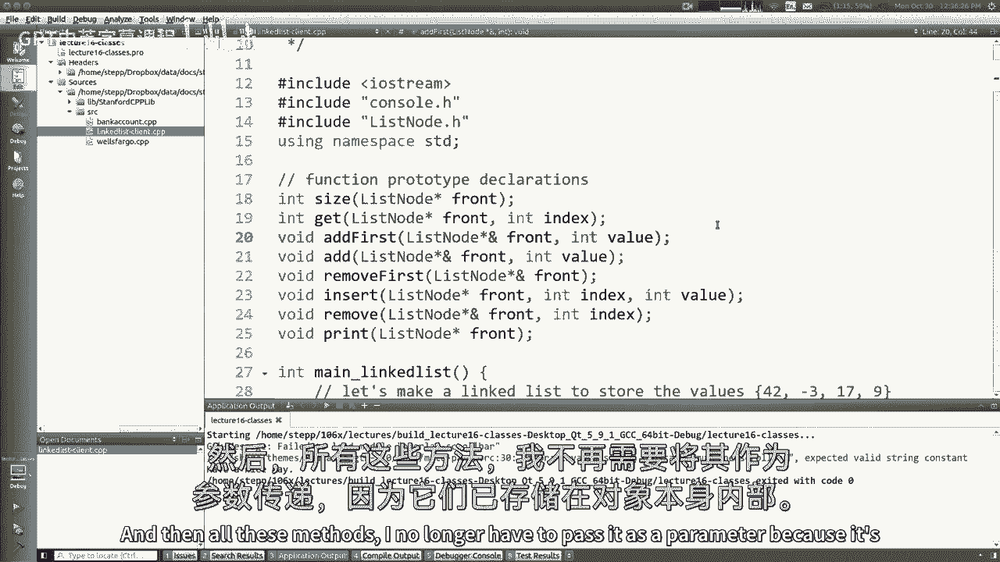

---

## 什么是类与对象？ 🤔

类是创建对象的模板或蓝图。它定义了对象将包含的数据（成员变量）和行为（成员函数）。对象则是类的一个具体实例，它包含了类中定义的数据的实际值，并可以执行类中定义的行为。

面向对象编程的一个核心优势是**抽象**。使用者无需了解类内部的具体实现细节，只需知道类提供了哪些方法以及这些方法的作用，就可以使用它。例如，整个学期我们都在使用`Vector`和`HashMap`，而不需要知道它们内部是如何工作的。

在C++中：
*   存储在对象内部的变量称为**成员变量**（或实例变量、字段）。
*   与对象关联的函数称为**成员函数**（或方法）。
*   **构造函数**是一种特殊的成员函数，在创建对象时被调用，用于初始化对象的状态。

---

## C++ 类的文件结构 📁

在C++中，一个类通常被分为两个文件：
1.  **头文件 (.h)**：包含类的声明，即类名、成员变量和成员函数的原型。
2.  **实现文件 (.cpp)**：包含类成员函数的具体实现。

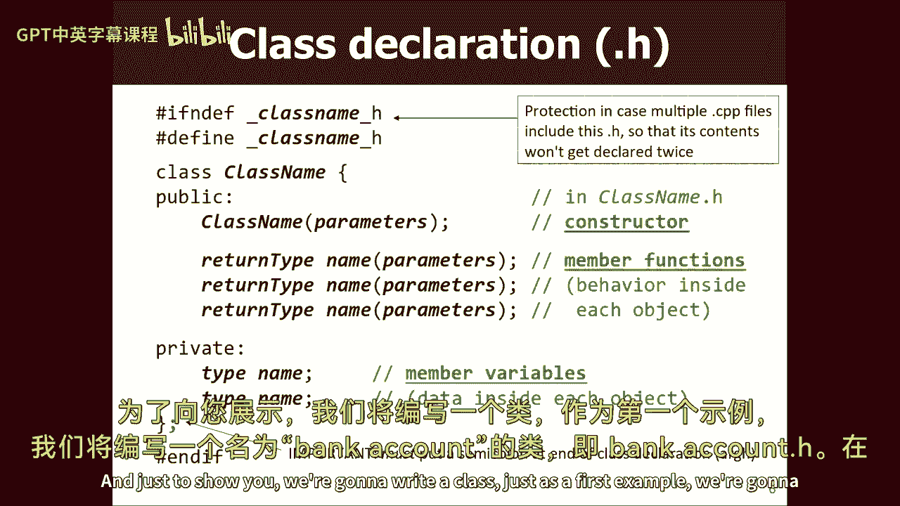

这种分离符合“接口与实现分离”的原则。使用该类的其他代码只需包含头文件，了解有哪些可用的方法，而无需关心其实现细节。

### 头文件 (.h) 的基本结构

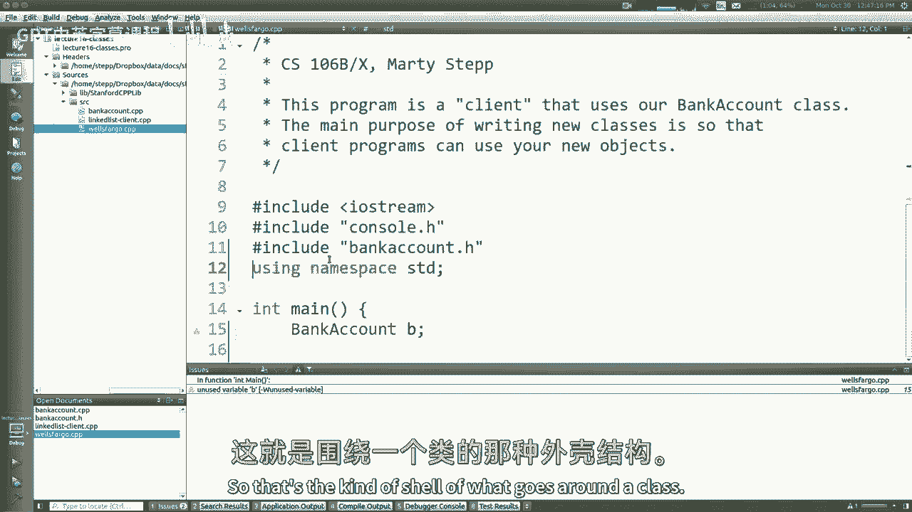

头文件通常以“包含守卫”开始，以防止同一个头文件被多次包含时引发的重复定义错误。

```cpp
// BankAccount.h
#ifndef BANKACCOUNT_H
#define BANKACCOUNT_H

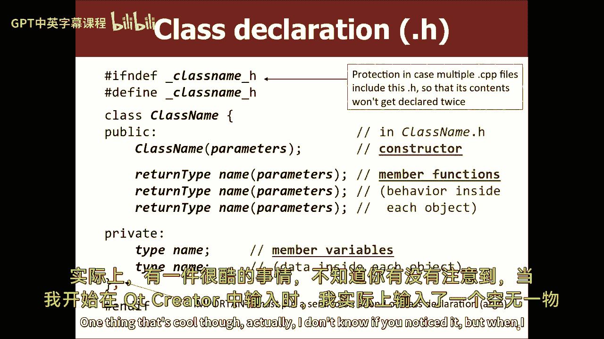

#include <string>

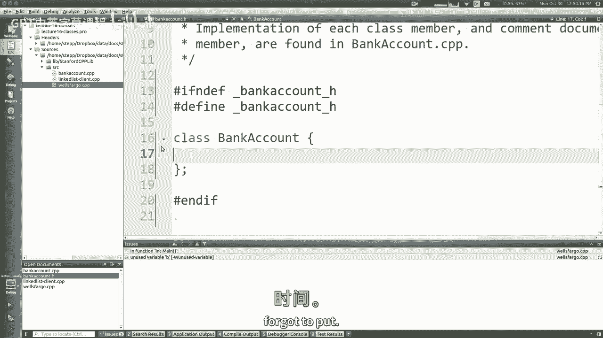

class BankAccount {
public: // 公共接口
    // 构造函数
    BankAccount(std::string name, double balance = 0.0);

    // 成员函数（方法）
    void deposit(double amount);
    void withdraw(double amount);
    double getBalance() const; // const 成员函数，承诺不修改对象状态

private: // 私有实现细节
    // 成员变量（字段）
    std::string name;
    double balance;
};

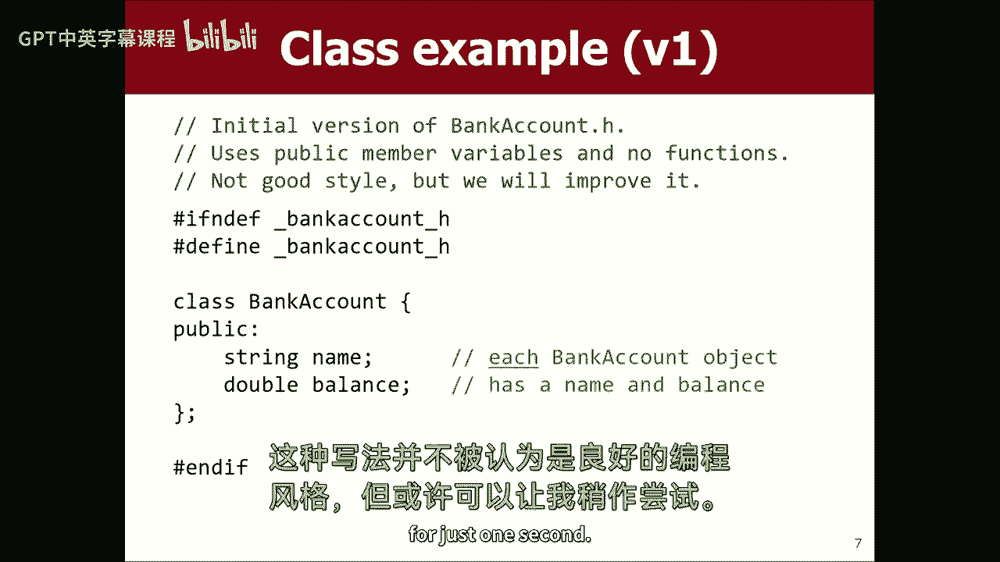

#endif // BANKACCOUNT_H
```

**核心概念解释**：
*   `#ifndef` (if not defined), `#define`, `#endif` 是预处理器指令，构成了“包含守卫”。
*   `public:` 之后的成员可以被类外的代码访问。
*   `private:` 之后的成员只能被类自身的成员函数访问，这实现了**封装**。
*   构造函数名与类名相同，没有返回类型。
*   成员函数原型以分号结尾。

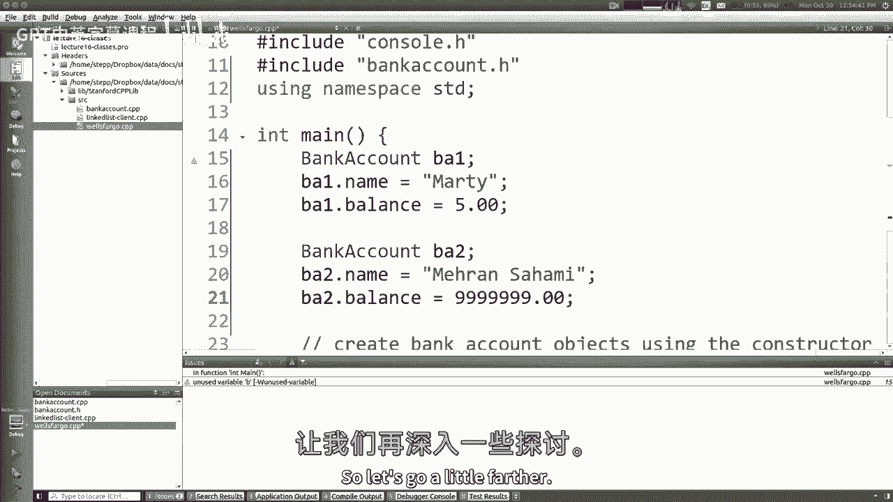

---

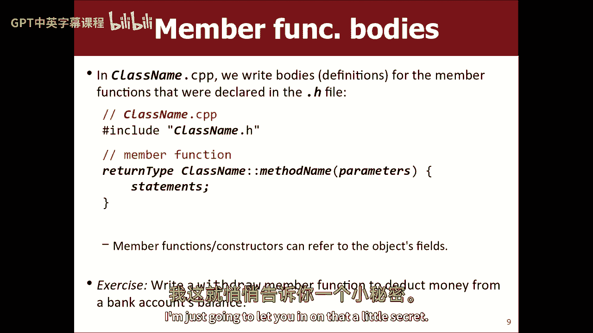

## 实现文件 (.cpp) 与成员函数定义 🛠️

实现文件需要包含对应的头文件，然后定义头文件中声明的所有成员函数。

```cpp
// BankAccount.cpp
#include "BankAccount.h"
#include <iostream>
using namespace std;

// 构造函数定义
BankAccount::BankAccount(string n, double bal) {
    name = n;
    if (bal < 0) {
        // 可以在此处添加错误处理，例如抛出异常
    }
    balance = bal;
}

// deposit 成员函数定义
void BankAccount::deposit(double amount) {
    if (amount > 0) {
        balance += amount;
    }
}

// withdraw 成员函数定义
void BankAccount::withdraw(double amount) {
    if (amount > 0 && balance >= amount) {
        balance -= amount;
    } else {
        // 处理余额不足或非法金额的情况
        cerr << "Withdrawal failed for: " << name << endl;
    }
}

// getBalance 成员函数定义
double BankAccount::getBalance() const {
    return balance; // 返回余额的副本，保护原始数据
}
```

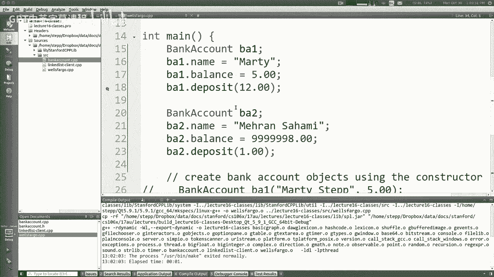

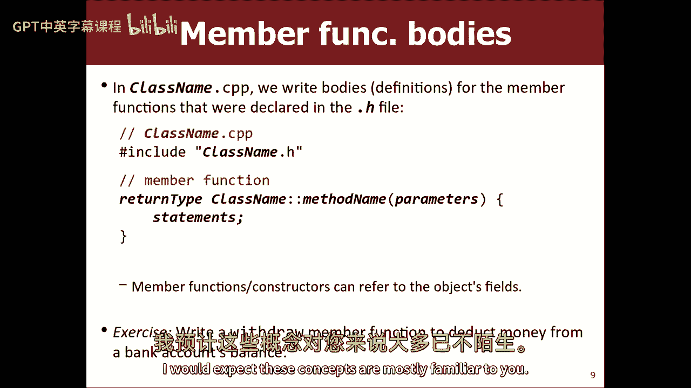

**核心概念解释**：
*   `#include "BankAccount.h"` 是必须的，这样实现文件才知道类的结构。
*   定义成员函数时，需要使用**作用域解析运算符 `::`** 来指明这个函数属于哪个类（例如 `BankAccount::deposit`）。
*   在成员函数内部，可以直接访问该对象的成员变量（如 `balance`）。调用该函数的对象提供了这些变量的上下文。
*   `const` 关键字在函数声明和定义中都必须出现，它向编译器承诺此函数不会修改调用它的对象。

---

## 使用类创建对象 🎯

一旦定义了类，就可以在程序（如 `main` 函数）中创建并使用该类的对象。

```cpp
// main.cpp
#include "BankAccount.h"
#include <iostream>
using namespace std;

int main() {
    // 创建对象，调用构造函数进行初始化
    BankAccount account1("Alice", 100.0);
    BankAccount account2("Bob"); // 使用默认余额 0.0

    // 调用对象的公共方法
    account1.deposit(50.0);
    cout << "Alice's balance: " << account1.getBalance() << endl; // 输出 150

    account2.withdraw(10.0); // 会失败，因为余额为0
    cout << "Bob's balance: " << account2.getBalance() << endl; // 输出 0

    // 错误示例：无法直接访问私有成员
    // account1.balance = 1000000; // 编译错误！balance 是私有的
    // double b = account1.balance; // 编译错误！

    return 0;
}
```

**核心概念解释**：
*   对象创建语法：`ClassName objectName(arguments);`
*   使用**点运算符 `.`** 来调用对象的成员函数。
*   由于 `balance` 是私有变量，客户端代码无法直接访问或修改它，必须通过公共接口（如 `deposit`, `withdraw`, `getBalance`）。这强制了数据的安全性，类可以在这些方法中添加必要的验证逻辑（如检查取款金额是否超过余额）。

---

## 封装与 `const` 成员函数 🔒

以下是封装和 `const` 关键字的几个关键点：

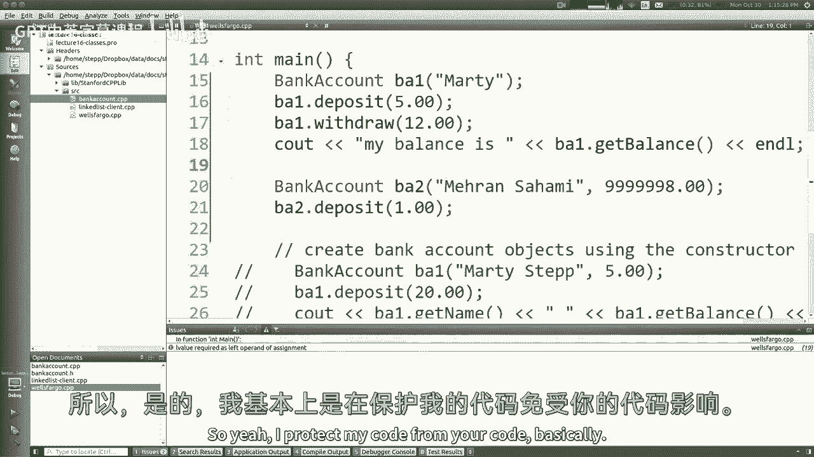

**封装的好处**：
*   **数据保护**：防止外部代码随意修改对象内部状态，导致数据不一致。
*   **实现隐藏**：可以更改类的内部实现（例如改变数据存储方式），而不会影响使用该类的客户端代码。
*   **简化接口**：为用户提供一组清晰、安全的操作方式。

**`const` 成员函数的作用**：
1.  **对内的承诺**：在函数体内，不能修改对象的任何成员变量（除非变量被 `mutable` 修饰，这很罕见）。
2.  **对外的契约**：如果一个对象被声明为常量（例如 `const BankAccount& account`），那么只能在其上调用被标记为 `const` 的成员函数。这保证了不会通过常量引用意外修改对象。

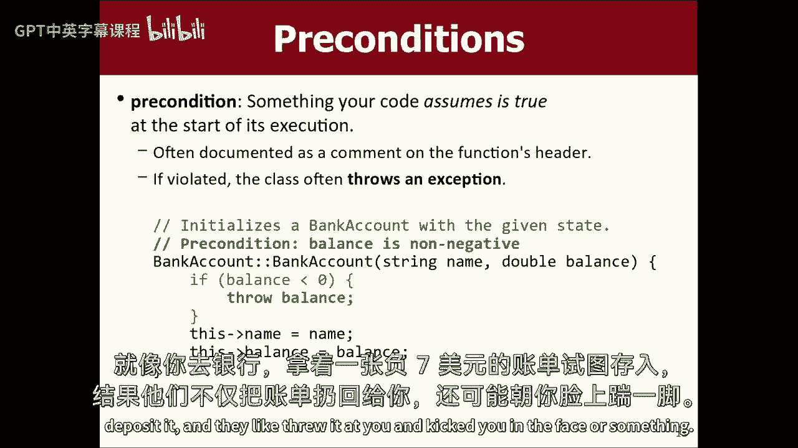

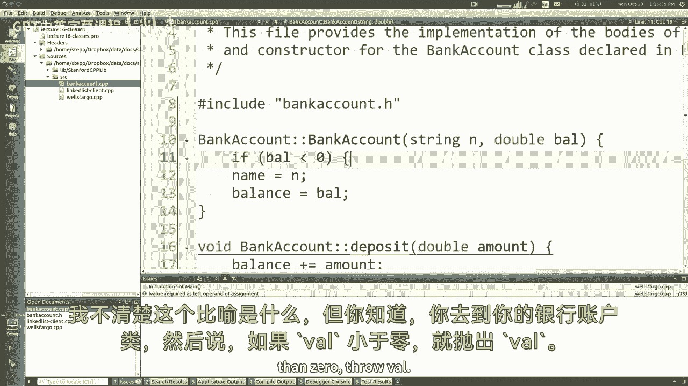

```cpp
void printBalance(const BankAccount& acc) {
    // acc 是一个常量引用
    cout << acc.getBalance() << endl; // 正确，getBalance 是 const 方法
    // acc.deposit(10); // 错误！deposit 不是 const 方法，不能通过常量引用调用
}
```

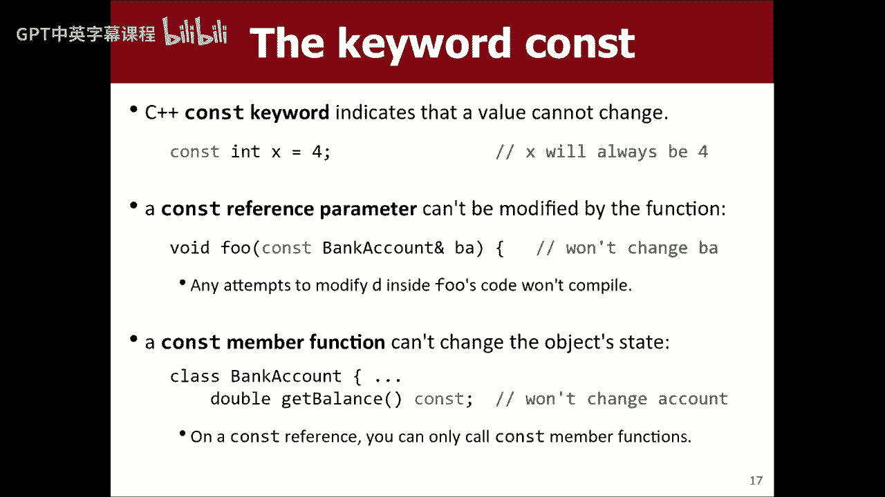

---

## 总结

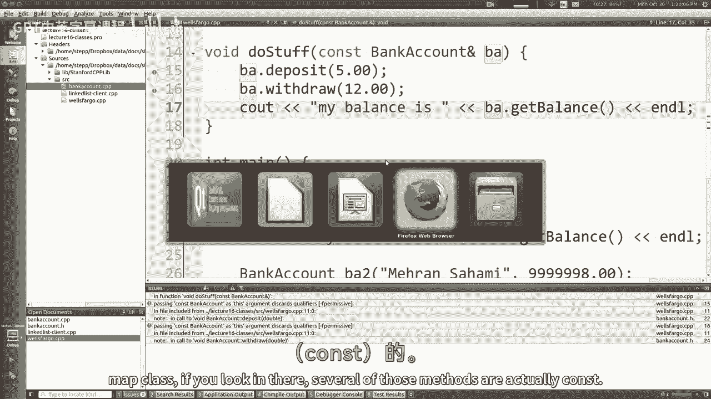

本节课中我们一起学习了C++中类与对象的核心概念：
1.  **类**是蓝图，**对象**是实例。类将**数据**（成员变量）和**行为**（成员函数）封装在一起。
2.  C++类通常分为**头文件 (.h)** 和**实现文件 (.cpp)**。
3.  使用 `public` 和 `private` 访问修饰符来实现**封装**，保护内部数据，并通过公共方法提供安全可控的访问途径。
4.  成员函数在类外定义时，需要使用**类名和作用域解析运算符 `::`**。
5.  **构造函数**用于初始化新创建的对象。
6.  **`const` 成员函数**承诺不修改对象状态，允许在常量对象或常量引用上调用。

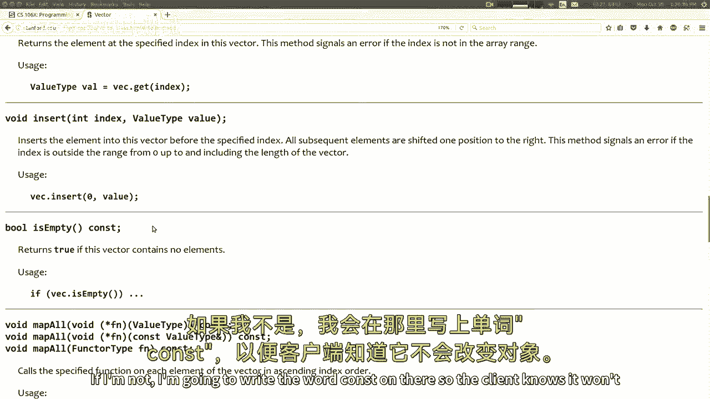

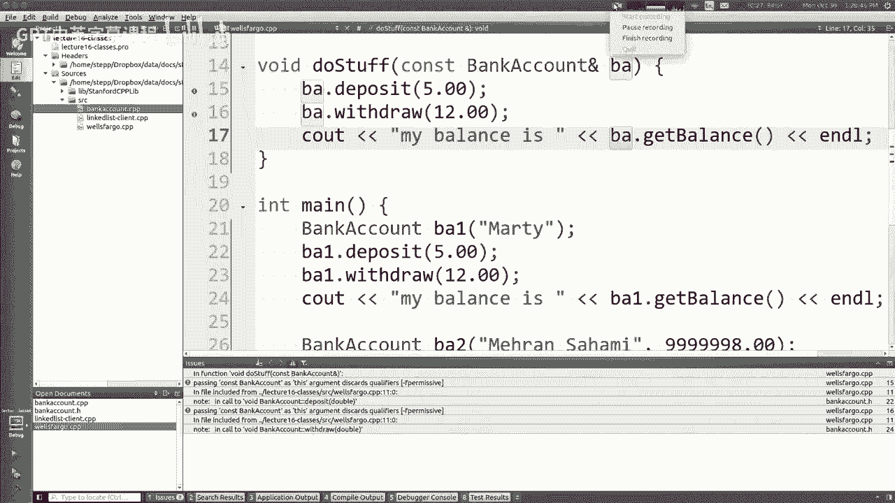

通过将数据结构（如链表）实现为类，我们可以创建更模块化、更易维护且更安全的代码，这也是现代C++编程的基石。在接下来的课程中，我们将运用这些知识来构建更复杂的数据结构。