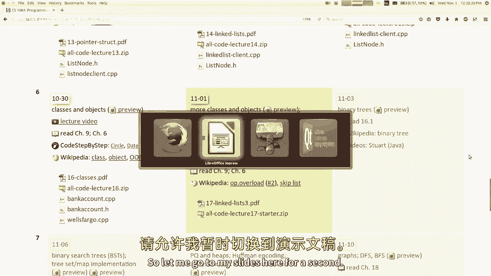
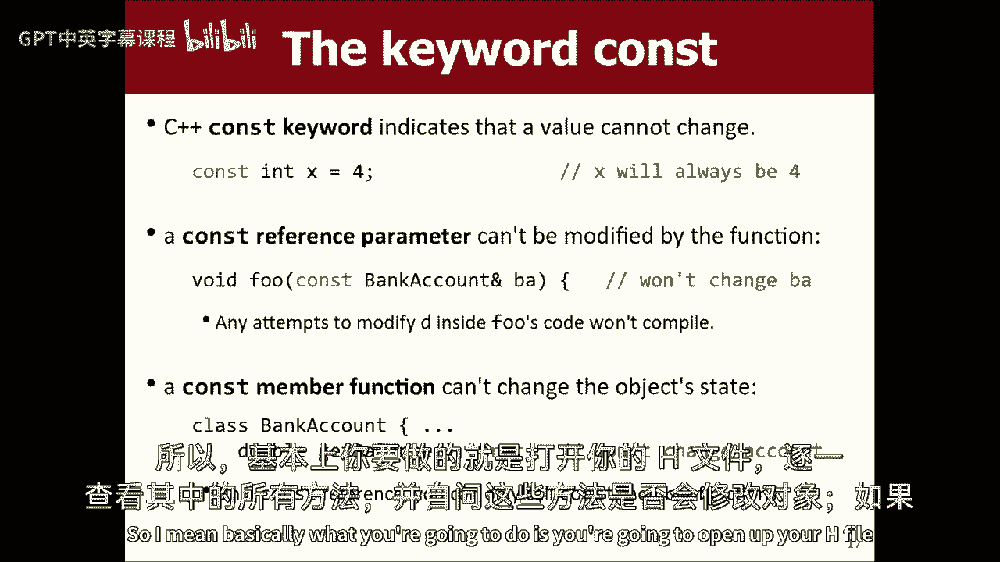
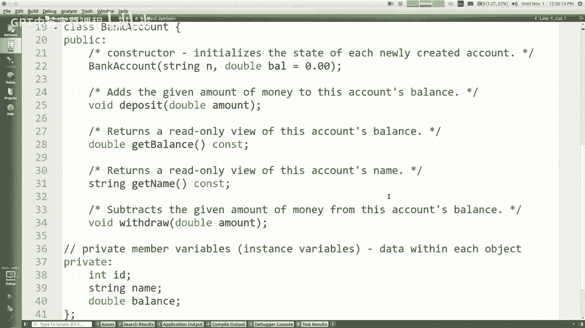
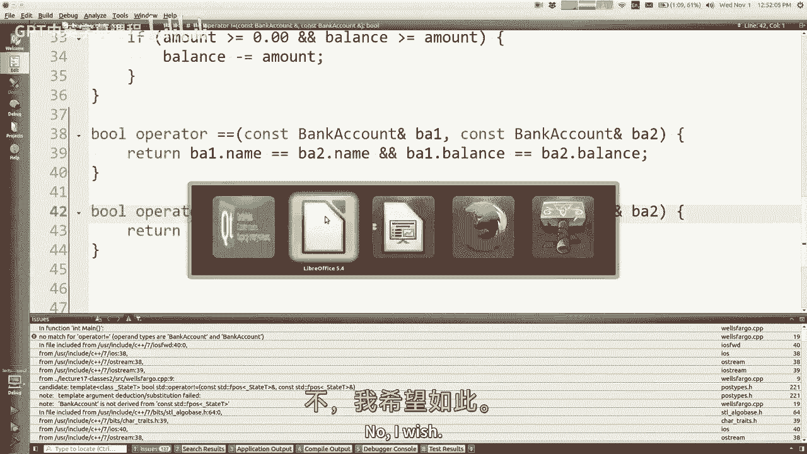
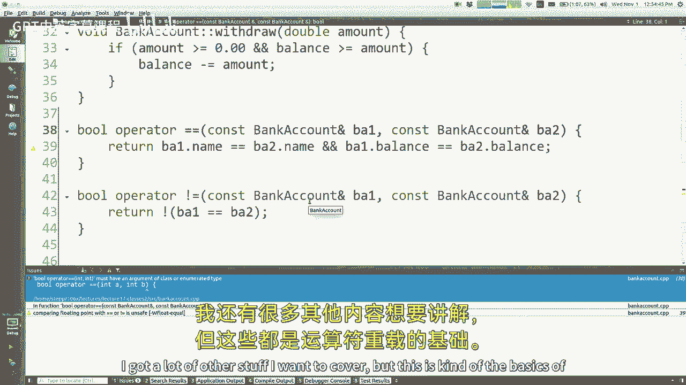
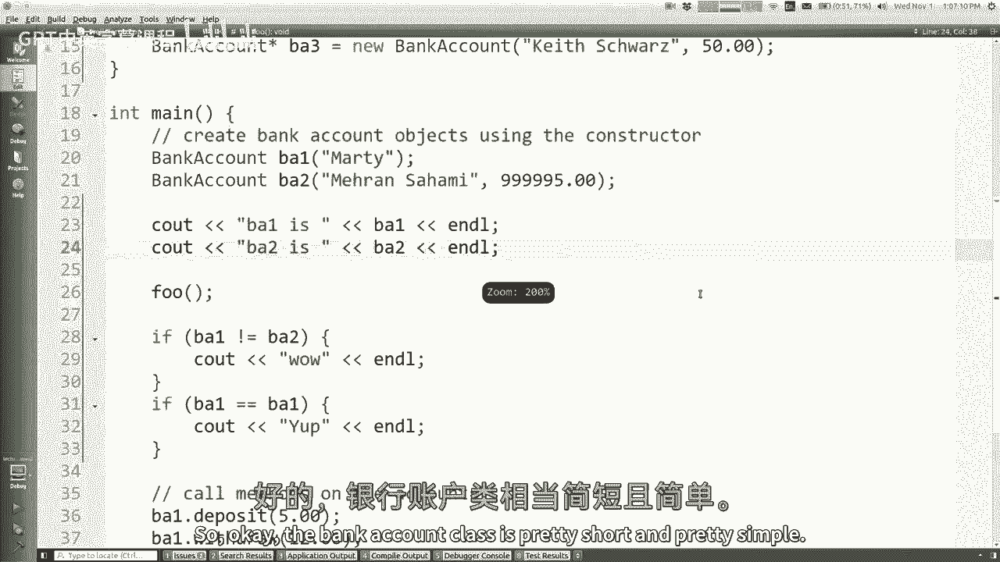
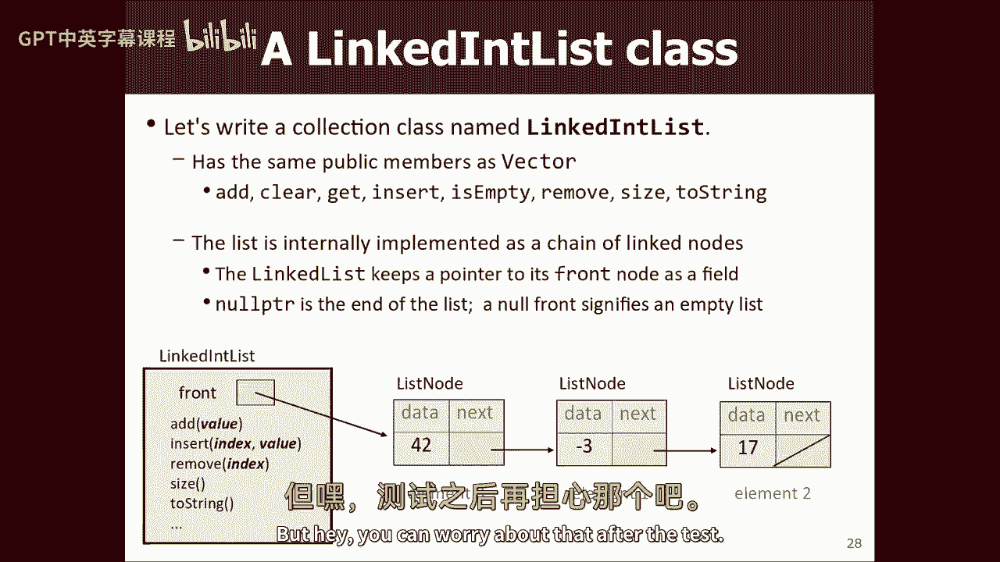
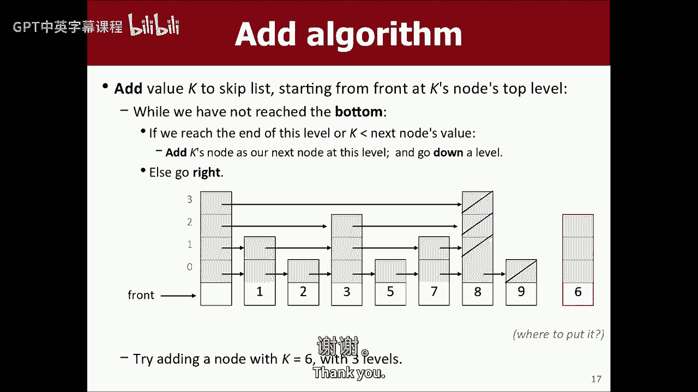

# 课程17：类与对象（二）及跳表 🧩

在本节课中，我们将继续深入学习C++中的类与对象，并探讨链表的高级变体——双链表和跳表。我们将重点介绍运算符重载、析构函数等高级概念，并了解如何将这些概念应用于更复杂的数据结构。



---



## 运算符重载

上一节我们介绍了类的基本概念和常量方法。本节中，我们来看看如何通过运算符重载，让自定义类型支持像内置类型一样的操作。

运算符重载是C++的一个独特特性，它允许你为自定义类型定义运算符的行为。例如，你可以为矩阵类定义乘法运算符 `*`，或者为自定义集合类定义下标访问运算符 `[]`。



以下是C++中允许重载的部分运算符列表：
*   算术运算符：`+`, `-`, `*`, `/`, `%`
*   关系运算符：`==`, `!=`, `<`, `>`, `<=`, `>=`
*   逻辑运算符：`!`, `&&`, `||`
*   赋值运算符：`=`, `+=`, `-=` 等
*   下标运算符：`[]`
*   函数调用运算符：`()`
*   流插入/提取运算符：`<<`, `>>`

**注意**：运算符重载应谨慎使用，仅当运算符的含义对于你的类来说直观明了时才进行重载。滥用会导致代码难以理解。

### 重载等号运算符（`==`）

如果你想比较两个自定义对象是否相等，可以重载 `==` 运算符。其函数原型通常如下：


```cpp
bool operator==(const BankAccount& ba1, const BankAccount& ba2);
```

实现时，你需要比较两个对象的关键状态（如成员变量）是否一致。

```cpp
bool operator==(const BankAccount& ba1, const BankAccount& ba2) {
    return ba1.getName() == ba2.getName() && ba1.getBalance() == ba2.getBalance();
}
```

**注意**：由于 `operator==` 是一个全局函数而非类的成员函数，它默认不能访问类的私有成员。如果需要访问，必须在类声明中使用 `friend` 关键字将其声明为友元函数。

```cpp
class BankAccount {
    // ... 其他成员 ...
    friend bool operator==(const BankAccount& ba1, const BankAccount& ba2);
};
```

### 重载流插入运算符（`<<`）

在C++中，要使对象能够像内置类型一样用 `cout` 打印，需要重载 `<<` 运算符。

其函数原型和实现通常如下：

```cpp
// 在头文件中声明
std::ostream& operator<<(std::ostream& os, const BankAccount& ba);

// 在源文件中实现
std::ostream& operator<<(std::ostream& os, const BankAccount& ba) {
    os << ba.getName() << ": $" << ba.getBalance();
    return os; // 必须返回流引用以支持链式调用，如 cout << a << b;
}
```

同样，如果 `operator<<` 需要访问私有成员，也需要在类中将其声明为 `friend`。

---




## 析构函数

构造函数在对象创建时被调用，用于初始化。与之对应，析构函数在对象生命周期结束时被调用，用于执行清理工作。

析构函数的语法是在类名前加波浪号 `~`。



```cpp
class BankAccount {
public:
    ~BankAccount(); // 析构函数声明
    // ... 其他成员 ...
};


// 析构函数定义
BankAccount::~BankAccount() {
    // 清理代码，例如释放动态分配的内存
    std::cout << "Destructor called for " << name << std::endl;
}
```

**何时使用析构函数**：当你的类管理着动态分配的资源（例如，使用 `new` 在堆上分配了内存）时，必须在析构函数中使用 `delete` 来释放这些资源，以避免内存泄漏。对于仅包含基本类型或标准库对象（如 `std::string`，它们有自己的析构函数）的简单类，通常不需要编写显式的析构函数。

**栈对象与堆对象**：对于在栈上创建的对象（如 `BankAccount ba;`），当其作用域结束时，析构函数会自动调用。对于在堆上创建的对象（如 `BankAccount* ba = new BankAccount();`），只有在对其指针使用 `delete` 操作时，析构函数才会被调用。

---


## 将链表实现为类

之前我们实现的链表操作函数（如 `add`, `remove`）都是全局函数，并接收一个指向链表头节点的指针作为参数。我们可以将这些功能封装到一个 `LinkedList` 类中。


以下是重构的基本思路：

1.  **私有成员**：类内部维护一个指向头节点的私有指针 `head`，可能还有一个记录链表大小的 `size` 变量。
2.  **公有方法**：之前全局的链表操作函数（如 `addToFront`, `removeAt`, `get`）现在变为类的公有成员方法。它们不再需要 `head` 参数，因为可以直接访问类的私有成员 `head`。
3.  **析构函数**：在 `LinkedList` 类的析构函数中，需要遍历整个链表，删除所有节点，以防止内存泄漏。

```cpp
class LinkedList {
private:
    struct Node {
        int data;
        Node* next;
    };
    Node* head;
    int size;

public:
    LinkedList(); // 构造函数，初始化 head 为 nullptr, size 为 0
    ~LinkedList(); // 析构函数，删除所有节点
    void addToFront(int value);
    int get(int index);
    void removeAt(int index);
    // ... 其他方法 ...
};
```

---



## 链表的变体

我们已经掌握了基本的单链表。现在，我们来看看两种功能更强的链表变体。

### 双链表




在双链表中，每个节点不仅包含指向下一个节点的指针（`next`），还包含指向前一个节点的指针（`prev`）。此外，链表类通常还会维护一个指向尾节点的指针（`tail`）。

**优点**：
*   可以双向遍历链表。
*   在已知某个节点的情况下，删除该节点的操作可以在 O(1) 时间内完成（单链表需要从头查找前驱节点）。

**缺点**：
*   每个节点需要额外的内存来存储前驱指针。
*   插入和删除节点时，需要维护更多的指针关系，代码稍显复杂。

**核心操作变化**：
*   **插入**：在指定节点前或后插入时，需要正确设置新节点与前后节点的 `next` 和 `prev` 指针，共需修改最多4个指针。
*   **删除**：删除一个节点时，需要将其前驱节点的 `next` 指向其后继节点，并将其后继节点的 `prev` 指向前驱节点。

### 跳表

跳表是一种用于快速查找的有序数据结构。它通过在原始有序链表的基础上添加多级“索引”来实现近似二分查找的效率。

**结构**：
*   跳表由多层链表组成。底层是包含所有元素的有序链表。
*   每一层都是下一层的“快速通道”，元素更稀疏。
*   每个节点包含一个数据域和一个指针数组（或向量），数组中的第 `i` 个指针指向该节点在第 `i` 层链表中的下一个节点。

**搜索**：从最高层开始，向右遍历。如果右侧节点的值小于目标值，则继续向右；否则，下降到下一层继续查找。重复此过程，直到找到目标或确定目标不存在。这个过程的时间复杂度平均为 O(log n)。

**插入**：
1.  使用类似搜索的过程，找到新节点在每一层中应该插入的位置（即每一层中最后一个值小于新节点值的节点）。
2.  随机决定新节点的“高度”（即拥有多少层指针）。一种常见策略是“抛硬币”，从第1层开始，每次有50%的概率增加一层。
3.  根据步骤1找到的位置和步骤2决定的高度，将新节点插入到每一层的链表中，更新相关指针。

**优点**：实现相对简单，且能提供有序数据结构的高效查找、插入和删除操作（平均 O(log n)），其性能与平衡树相当。

**应用**：跳表是Redis等系统中实现有序集合的底层数据结构之一。

---

## 总结



本节课我们一起深入学习了C++类的两个高级特性：运算符重载和析构函数。我们了解了如何让自定义类型支持直观的运算符，以及如何安全地管理对象的资源生命周期。接着，我们将之前所学的链表知识封装成类，并探索了其两种高级变体——支持双向遍历的双链表和利用多级索引实现快速查找的跳表。理解这些概念将帮助你设计出更强大、更高效的数据结构和程序。