# 【编程抽象方法 cs106x 2017】斯坦福—中英字幕 - P18：Lecture 18 - Arrays - 加加zero - BV1By411h75g

昨晚过得怎么样，嗯嗯，我不会说这是一次艰难的考验，但它让我的头发都掉光了，只是在写，太不可思议了，是啊，是啊，我知道，每次考试我都很投入，如果你的测试里有刮胡子的痕迹，那件事我很抱歉，所以是的。

这个周末我们要给考试打分，只要我能，我会把成绩公之于众，这样你就能看到你做得怎么样，我们将使用这个数字系统，这样你就可以在网上看考试了，看到点，看看你做了什么，诸如此类的事情。

希望我们能尽快把这些信息告诉你，我也会试着给你信息，一旦我可以关于曲线，会有一个曲线吗，分数会有什么调整吗，你知道我需要知道之前的平均值，我可以告诉你，所以只要我能，我去给你拿，应该是这个周末。

可能是星期天，你应该知道我们在哪里找到的，是啊，是啊，我会在电子邮件中给你发一个信息，上面有链接什么的，我会给你发一个去哪里的链接，是的，是的，我对此一无所知，因为我还没评分，不过，我们走着瞧。

如果分数太低，我把它们弄弯，你知道一切都会好起来的，我们会想出办法的，我会在这个周末发布一个答案，以此类推，有一群人给我们发邮件，就像他们试图运行的支持会议，你们收到邮件了吗，他们就像，他们正在开会。

他们想把人们聚集在一起谈论我们的期中考试，或者别的什么他们想问我，如果我想告诉你们这件事什么的，并为他们的事情做广告，我不知道我是不是，我刚收到这封邮件就在我走到这里之前，所以我没有时间真正看它。

但对我来说有点奇怪，嘿伙计们，你讨厌我的考试吗，如果是这样，到这里来，所以我不知道我只想说清楚，就像我和那个事件没有任何联系一样，我刚听说，所以我甚至不知道我是否对此有意见。

但我只想说清楚那不是部门赞助的活动，我想这是我唯一能说的，有任何关于，嗯，但是你看，我猜我想说的是，让我们在喜欢状态之前把分数拿回来，我们对一切的看法，我想很多时候人们做得比他们想象的要好。

也可能是曲线固定，他们对分数的担忧，所以让我们谈一次，我们都知道我们是怎么做的，好啦，所以这就是我要说的，关于期中考试，我也会补充，我很感激你们，我知道这一周很难熬，我知道你们很努力。

我很感激你今天能来，在座的各位，我很感激你的好意，有时考试后的第二天，房间有点空，但感觉我们这里有我们通常的核心人员，很酷，你了解我的，我们继续前进，我们不打算沉湎于过去，我们在向未来前进。

我会在一个小的方面承认网站是错误的，呃，今天我们不讨论二叉树，对不起，对不起，我们要做它在，星期一，我们是，但我只是我不能进入网站去改变它，但我们要谈谈滑梯上的东西，我们要谈谈提高模板，我觉得这也很酷。

所以嗯，反正，是啊，是啊，我们就在那里，作业五就在考试前贴出来了，你得抽时间在下周末之前把它做完，所以去看看。

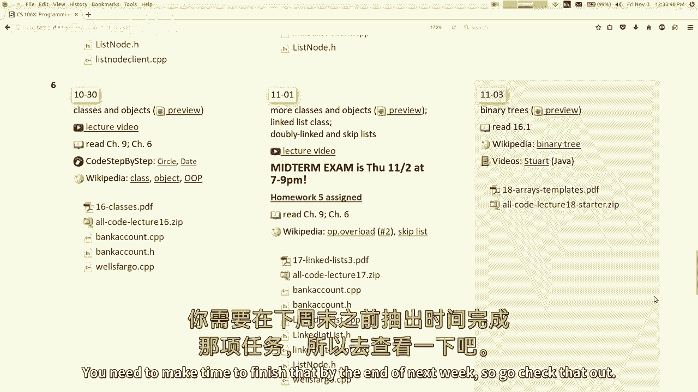

那是一个以链表和指针为中心的家庭作业，所以嗯，好啦，让我们继续讨论新的东西，稍微谈谈数组。

其中一些来自课本的第十一和第十四章，我们是一个关于实现数据结构的大材料单元的一部分，我们做了链表，现在我想谈谈数组，像向量这样的东西，其中一些其他类型的集合是使用数组实现的，数组没那么难。

你可能已经做了很多，所以我不想在他们身上花很多时间，但我们今天要讲的是，好啦，下面是如何在C Plus中声明数组，另外，你写的类型，然后是要给数组的变量名，然后你写方括号并指出元素的数量，数组的长度。

这与Java的语法不太一样，Java语法看起来更像这个数组名称等于新数组，你把链接，所以这可能对以前做过Java的人来说很熟悉，但是声明数组有两种语法，取决于您希望数组位于堆栈上还是堆上。

我们已经了解了堆栈和堆，对，堆叠内存将在你的函数中，当你的任务完成后，记忆被丢弃，热记忆通常是某个地方的云，它不会在你的功能结束时消失，因此，取决于您需要数组的时间，你得挑一个你想要的。

这是更简单和专家的工作人员，一旦你分配了它，这就是它将永远的大小，第一次初始化数组时，数组的内容是随机垃圾，所以这七个元素都没有设置为零，它们被设置为以前记忆中的任何东西，所以你要注意这一点。

如果你想让它们是零，有办法做到这一点，但不会是零，一开始，此版本在堆上分配数组，两者的行为是一样的，它们都是数组，只是功能完成后这个会留下来，语法的一个小区别是在Java中。

您会说类型括号括号名称等于新类型，在C++中，加上类型指针名称等于新类型，所以这有点有趣，因为C++在这里的作用，它分配的内存，适合这么多这种类型的东西，所以如果一个输入占用了4个字节，你要求一个数组。

它将分配44 x 10字节，它将返回由四个设备组成的块的开始的内存地址，所以它只是存放这十样东西的地址，所以实际上如果你和C程序员交谈，他们认为指针和数组是相同的，或者他们很相似，这就是它的来源。

这是因为数组是内存的砖块，如果你在中断开始时有一个内存地址，你可以去那里把东西放进大块里，所以这就是我的想法，我在这里看到一只手，堆栈指针的类型是什么，从技术上讲，即使它是一个指针，嗯。

我的意思是这种数组相似点就在那里，就像你说家庭作业成绩为零，用这个或者用这个语法，你说的是跟着指针走，然后在它的内存中向前移动零，所以如果你说家庭作业成绩排在第三位，它到家庭作业成绩地址。

它向前移动三倍于一英寸大小才能到达那里，所以这个或这个都是真的，所以技术上来说，如果你只是在没有语法下标的情况下引用家庭作业成绩，严格来说你是，那是恒星的内存地址，从技术上讲，它是一个类型指针。

但是你知道，主要是我想避免对数组使用指针语法，当我不用的时候，那更多的是使用指针，它打算做一个射线的东西更多的是一个C的东西，如果你在做c+加，你就不必经常这样做了，但是我们不要在这里谈论常规的C编程。

如果我们能避免，你可以，你可以在其他课上忍受，改天吧，好啦，嗯是的，是啊，是啊，其他班级，对不起，所以是的，反正，这个就像链接节点一样，所有这些东西，这是一个会泄漏内存的，如果你没有释放它。

在以后的课程中，你必须注意这一点，这种语法的另一个优点是，如果您使数组具有一定的大小，然后您决定现在要一个更大的数组，数组永远不能调整大小，但是你可以做一个更大的数组，比如20个而不是10个。

您可以告诉这个指针指向较大的数组，而不是较小的数组，所以现在你基本上有了一个比以前更大的数组，尽管旧的那个，旧的没有长大，只是你指了一个更大的新的，你知道，这些是声明数组的语法，当然这里的上下文是。

我们要做一个，我们将实现一个基于数组的数据结构，所以我们需要知道如何申报一个，所以这里有一张堆栈和堆之类的快速图片，所以这里有一个函数，我宣布两个，INI声明一个saarray。

我声明一个大小相同的堆数组，所以记忆的模糊画面，你得到了x和y，这是在这里的堆栈上，你有x和y，A也在，当你分配一个2，2实际上只是指向内存中数组的指针，当您完成make数组时，所有这些都消失了。

但这不是，嗯，是的，实际上有一件事，也许我说得不太好，访问元素的语法是相同的吗，所以如果你说一个括号0，这里是42，如果你说一个双括号零，在这里得到支持，所以你不必像刀疤一样说两个括号零。

括号表示跟随此内存地址，跟着这句话暗示的指针走，好啦，这就是数组的语法，在堆栈和堆上，我说过元素是如何垃圾的，当您第一次使用任何一种语法声明数组时，还有另一种语法，您可以在后面加上括号，这就告诉C++。

你想把元素归零，默认情况下，你可能会说，为什么他们不总是把元素归零，原因是C++是一种为速度而构建的语言，如果你不需要把它们清零，然后他们不想花时间走过去把它们归零，归零。

记忆需要n个时间才能在某物的元素中归零，所以他们不想那样做，如果你不需要，其他语言如java和python做出了相反的选择，他们说好，这会导致bug具有垃圾值，所以我们要把所有的东西都归零。

即使它使我们的程序运行得更慢，因为它更安全，那是，您能在静态上使用此语法吗，静止的鳄鱼，我觉得你可以，我们可以在QT创建者中尝试。

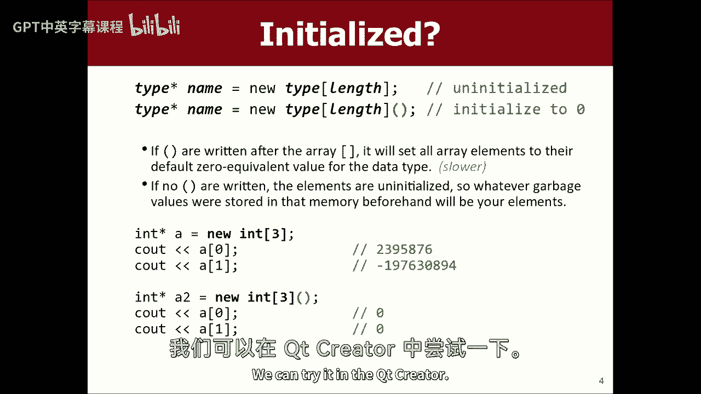

我想我最近没有尝试过那种语法，我们要用数组做一个堆栈，这就是我们的节目，但如果我做int括号，插入括号四，然后我算出0是，如果我做一个for循环，对int的权利，我等于零，我不到四岁。

我加加然后让我们看看里面有什么，a i是加上ai之类的，为了说明里面的垃圾，哦，我不得不等待这整个愚蠢的事情，哦天啊，为什么，为什么哦天哪，好吧好吧，我很确定这会打印垃圾值。

真正的问题是我是否能把括号放在那里，我们马上就会知道，但是。

好啦，让我跳回这里，以防有其他事情，我想在这里说一件事，如果你是这样，如果你用括号，然后你打印出来的值将是零而不是橙色，对呀，所以你可以用它，啊，所以有垃圾，我们预计，我看到你的手了，我马上给你打电话。

所以我们认为那是垃圾，只是随机数，基本上在那里，然后如果我。

如果我说括号，它不喜欢那样，所以现在不如，如果我说int指针a等于圆括号中的一个新int，它工作，它打印零，所以是的，我想这只是堆，我不太清楚为什么它不让你这么做，我可以用一个for循环在它们上面循环。

然后把它们都设置为零，后面有人有问题，是啊，是啊，替换不同的圆括号，用一些初始化的东西得到这个空间，哦，我能像94岁一样通过吗，然后他们都设置到94，我不这么认为，你可以做，有一个支架，括号语法。

我想你可以做一个，我觉得你能做到，然后它将值设置为，是呀，我想那应该在幻灯片上，我现在不是真的把那个，其实嗯，如果你在做堆栈，把一个分配到四个，我想你可以用同样的语法，然后就出来了，是啊，是啊。

所以值的括号，你能做到的，我不知道，我不知道为什么，我没有把它包括在幻灯片上，是啊，是啊，错开的气候，如果你让那些括号继续播放，得到一个七，哦所以，如果我就这样走，是呀，也许是这样，让我们试试，哦酷。

我喜欢很酷，今天大家都在学习，包括我很好，谢谢太棒了，是啊，是啊，我是说，我不知道语言句法的每一个角落，你可以做很多奇怪的事情，这种行为有点令人惊讶，有时候无论如何，不管怎样。

加薪有很多可爱的事情可以做，是呀，问题，你能再做一次吗，你能为数组上的每个，就像数组中的int n一样，一个看到和结束，都是这样，我猜，让我们把一些元素放在这里，95负，十七零，四十五。

你得把元素打印出来，是的，是的，所以对于数组上的每个循环，是的，是的，好啦，你能为每个循环，如果是一个，如果是指针，如果是一堆，我认为在星形中a等于新的int，呃，哎呦，它不喜欢，是啊，是啊，它不喜欢。

它在寻找一种叫做带开始的迭代器的东西，然后不管，所以是的，我不经常为数组上的每个循环做。

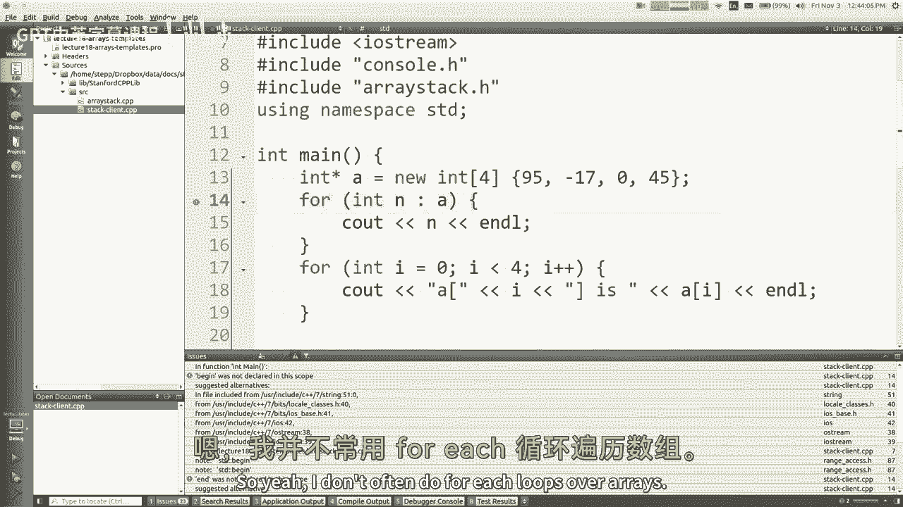

但关于数组，我要说的一件事是，你知道我们为什么要等这么久，就像课程的第六周结束，我们只是在讨论加薪，你知道我们为什么要等这么久，我想简单的回答是，数组真的吸收了C++，加上我们一直在使用向量。

任何我们想要数组的地方，因为矢量的行为大多是合理的。

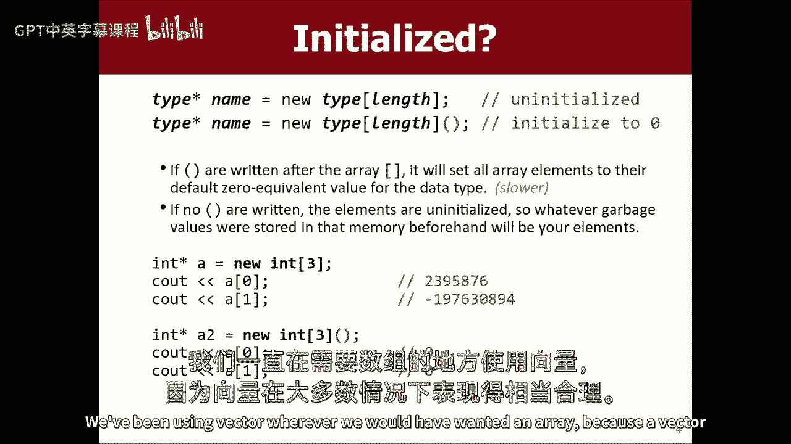

就像这里，这里有一个有趣的，看看我是如何有四个元素的，看着看着这个看到一个七结束，那里有什么，哦对不起，它是，还有之前的另一个错误，但是七号元素里的东西，因为在C++中，你可以离开数组的末尾。

你想要的一切都没有问题，嘿嘿，你想看看真正有趣的东西吗，整数x等于五，五个，五个，整数y等于七，七七，让我们打印一张底片，一个，哎呦，是零，嗯，负2呢，有时候，如果你喜欢玩下标之类的东西。

让我们用这些元素做int 4，负2是什么，嘿嘿，五点了，五五，为什么这是负面的，七点了，七七，我们能由此得出什么结论呢？是啊，是啊，但这个的内存地址就在这个的后面，就在那个的后面，如果我去那个地址。

我倒退了一年的记忆，我到了那里，有一个很有趣的虫子，我能浪费两分钟的上课时间吗，可以吗，你们从来不点头，如此猛烈，是呀，浪费两分钟，好啦，看这个，我想这个会有效的，int x=4 int y=5，好啦。

好吧，就这样吧，然后我就停止了功能，对呀，所以现在我有了空栏，我想这行得通，我只是不一致，但我想它会起作用的，然后B然后就没事了，所以我有未初始化的变量，好的，我正在打印，所以它可能是任何值对。

所以如果我做foo条，然后让我们做返回零，所以它不会执行其他代码，会发生什么，哦，它说A是未初始化的，所以实际上问题是，我在我的建筑里设置了一个警告标志，所以它会等待，我把这个锁起来了。

所以它不让我这么做，最快的方法是什么？我可以解决这个问题，首字母，见，我在我们的项目中设置了这个标志，所以你不能这么做，因为我不想让你有这种虫子，但让我们危险地生活，不要对我指手画脚，爸爸。

你不再是我的老板了，我叫阿福，它分配这些变量，它设置它们的值，然后Foo回来了，因此foo的内存将从堆栈中删除，它被扔掉了，但它实际上并没有把任何东西擦洗掉，它只是在某种程度上标志着记忆不再被使用。

里面的碎片还在里面，所以值4离顶部的开始还有一英寸，那个东西什么的，但当我打电话给巴尔巴尔时，巴尔也说，我给自己做一个堆栈区，它使它在同一个地方，以前的食物，它不会清零任何东西。

所以那些碎片里的东西仍然在那些碎片里，而这恰好是它，但它是x和y，所以当我进来的时候，它碰巧设置A和B就像偏移量一样，这就是为什么我以前住在，所以当我打印它们的时候，它能打印出，好啦，所以无论如何。

这不是一种愚蠢的语言吗来吧。

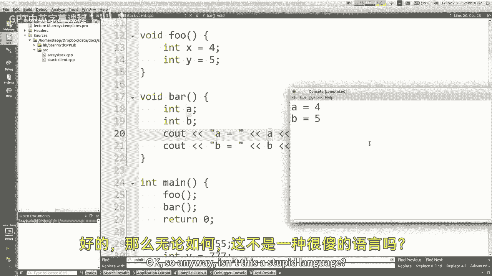

我知道这有点好笑，但是男人，来吧所以好吧，反正，回到任务中，让我们多谈加薪，所以是的，有时您有初始化的值，有时你有垃圾值，你可以小心点，你看，我老了，我受够了这些虫子，我喜欢简单的事情。

所以我有点喜欢清零我的记忆，但也许那只是我，所以嗯，让我们来谈谈我们所做的一些收藏，它们是如何工作的，向量和堆栈，我很久以前就提到过这一点，基本上他们所做的是，他们在里面有一个数组。

它们在数组中有额外的空间，这比你添加的元素的数量还要大，如果你用完了空间，你成长为一个更大的数组，所以这是一个大致的想法，你有一个数组，你在容量中保留一个尺寸，除了客户端实际添加了多少元素之外。

容量是我们总共有多少点可以添加更多的元素，如有必要，呃，关于C++中的数组有一点是，它们实际上并不把它们的尺寸储存在任何地方，所以如果你有一个数组，然后你想问嘿数组，你存储了多少元素。

没有办法回答这个问题，没有点链接或点大小或任何东西，数组没有功能，它们只是记忆，它们只是记忆的碎片，等于元素的大小乘以，元素的数量就是这样，没有办法，没有大小字段，所以你不能问数组的大小。

你实际上必须保留一个变量，不知何故，我记得我看到的尺寸，我最终是，我做了吗，我践踏了你的问题，那是你的尺码吗，是呀，好啦，是呀，你的问题，如果它没有大小，这四个怎么样，哎呦，哦耶，这也是为什么早些时候。

我不想卷入其中，但我试着为下面的每个循环写一个，它在这个数组上工作，但在堆上不起作用，它对这个起作用的原因是，而不是在堆上，因为它可以看着它，看这里有四个，但热的那个只是一个指针，它不知道它指向什么。

它不知道它指向多少元素，所以它无法判断要打印多少个循环，所以是的，这与为什么，它没有让我对每一个循环都这样做，所以，但它能做到这一点的原因是它可以看到。

堆叠的东西，计算出大小，但不管怎样，任何你不能计算出一般尺寸的东西，但这个概念我们称之为未填充，数组位于许多构建在数组上的不同数据结构之下，好啦，所以我想和你们做的是，我想写一个名为数组堆栈的类。

只是快速实现堆栈，使用数组，这并不意味着很难，但我只想玩数组，所以这就是这样做的借口，推弹出偷看是空的，和打印操作员小于，我们将有一个未填充的数组，我们从十号开始，数组的长度为十。

所以如果你来找可爱的造物主，我有一个叫数组堆栈的文件，点CPP和擦除堆栈H，我们一直在学习如何上课什么的，所以我想要一个构造函数和析构函数，我希望这些方法就在这里，我还没有为他们写原型。

所以也许现在我们要存储一叠int，所以也许你可以说void push int然后弹出，弹出顶部元素，然后在峰值中，看顶部的元素，但不把它拿出来，对呀，游泳池是空的，对，然后操作符小于这里，是啊，是啊。

也许我们可以做朋友，朋友，有好处的朋友，你知道那些东西，好啦，那么现在成员变量是什么，嗯，我们需要一个数组，我已经说过了，它将是数组的堆栈样式，或者数组的堆样式，我想这是令人困惑的措辞。

因为我们在做一堆，但是堆栈的数据结构和内存位置之间是有区别的，调用堆栈右，所以我想我要说的是，我应该在这里写10吗，或者我应该在这里写像int star a一样，比如哪个更好，还是有关系，你说在星星上。

我觉得第一个，第一个，摆脱它，会过去的，我没必要把它处理掉，有一个更有效的答案，我想我认为总的来说指针，第二个比较好，你说的都是真的，如果我们这样分配，那么它就不需要那么多的新的和删除，管理记忆之类的。

这绝对是一个有效的评论，但这样做有一个很大的问题，如果我们需要十种以上的元素，这是行不通的，比如如果我们想添加第十一个元素，实际上没有办法用这个做到这一点，变化无常，正确使用我的指针语法的好处。

我们可以从十个开始，如果我们把它们都用完了，我们可以用20个，抄送大家，然后指着那个，现在我们有20个数组，因为这个原因，这基本上是唯一的原因，我想我们需要使用指针语法，如果我们没有问题。

如果我们只需要十个，那么这个语法就更好了，但正因为如此，我认为指针是我们必须使用的，所以我把它叫做元素而不是，我们还需要跟踪数组的大小，我们需要跟踪数组的长度，就像，但这两个术语有点相似。

所以有时我喜欢称之为容量，因为这就是数组的长度，而且尺寸是，他们推了多少次，所以这就是区别，尺寸在任何时候都应小于或等于容量。

对呀，就像在我的照片里，把指针指向这个，最初的大小是什么都没有，但它会随着他们的推动而增长，容量总是。

好啦，所以这些就是我们现在的成员，让我们去CPP文件，我们需要用身体来写所有这些东西，所以cpp文件里面什么都没有，我得把这些换成大括号，对呀，还有什么对不起，慢，就像，像那样像那样，好啦。

这里的语法还有什么需要更改的，是啊，是啊，我需要在所有方法名和所有成员前面，我不得不说数组堆栈，冒号，冒号，对呀，因为我必须告诉编译器这些是一个类的成员，不仅仅是全局函数，所以必须这么做。

在高峰的时候有点讨厌，而且是空的，就像这样，我最终要写这个运算符，我还没有一个方向，所以让我把它复制粘贴到这里，所以让我们从顶部开始，当您构造一个新的数组堆栈时，让我们从构造函数开始。

无论何时你有任何你应该喜欢的构造函数，正确初始化所有私有变量，所以让我们最后做数组，我们先做尺寸和容量，新创建的堆栈的大小是多少，大小是，里面什么都没有，堆栈的容量是多少，我想我们从十个开始。

然后元素数组是什么，组成一个大小为10或容量为10的新int数组的集合是什么，对呀，像这样对吧，好的很好，我们都准备好了，如果你想变酷，像我一样，你可以把小圆括号，把他们清零，我很酷。

这是我唯一酷的地方，我总是把我的记忆归零，是啊，是啊，去吧，哎呦，你得按照你的装饰顺序，但这有关系吗并不重要，我刚把它们移到，因为我想按照那个顺序初始化它们，所以我认为这样做完全没问题，这确实很重要。

因为在记忆中，它真的会把它们按那个顺序排列，但我永远不会在我的代码中以这种方式遍历内存，希望这对我来说并不重要，好啦，所以我得到了我的元素，我有我的尺码，顺便说一句，我得到了我的能力。

我只想指出当你在做Java的时候，人们习惯说，你知道等于零，还是你，你不知道你C加+，你真的不能那样做，你得在这里申报所有东西，你得在另一个地方设置所有的值，这就是为什么我认为即使在Java中。

我们告诉你们声明并初始化你们的成员，在不同的地方，不过，好吧，随便啦，所以现在我们设置了析构函数，这里是当堆栈被扔掉的时候，当它超出范围时，我们得自己收拾，就像一般情况一样，如果你只有普通字段。

如尺寸或容量，你不需要说像删除大小或删除容量，就像int，像那样去清理一下，但是数组自从我说新的并把它放在堆上，那个确实需要清理一下，所以你需要说删除元素，像这样删除数组，我们在这里分配的。

但为了让它更有趣而说话，你得说删除数组元素，删除数组有一个单独的语法，为什么是分开的，因为数组只是指针，所以它很难区分，那是指向一端的指针吗，或者指向一堆移民局的指针，为了区分它们，你说得好。

这是一个数组，然后它去查找一些内部数据，并说，哎呦，我知道有多少字节，那就是，我知道该怎么做，它确实保持了尺寸，有人知道，但不是以一种我们可以告诉我们的方式，我知道，听着伙计，我不是在这里提倡这种语言。

这种语言烂透了，是啊，是啊，有人知道它的尺寸，但他们没告诉你，是啊，是啊，所以无论如何，你得说删除括号括号，好啦，所以现在我们有了，我们在这里建立了簿记，所以现在让我们把元素推到堆栈上，你有一个问题。

是啊，是啊，去吧，为什么你有这个括号应该只是指向，这是语言所期望的，3。我不知道我是否能令人满意地回答你，就像它的内部簿记，对内存管理系统有帮助，要知道这个指针实际上是数组的开始。

与指向int的指针相反，因为int星可以指向，或者它可以指向数组中的第一个int，很难区分这两件事，否则，这里的这个括号说，我在指针中删除这个，它是数组的开始，不仅仅是四个字节，可能会更多。

所以我想这就是为什么它需要知道，我觉得如果你把托架拿掉，很糟糕，我认为记忆中发生的坏事没有得到适当的清理，好的，推推的意思是添加到堆栈中，当然不是一堆。

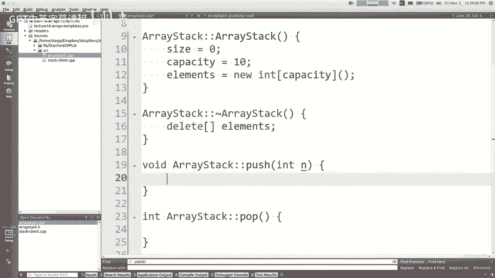

这真的是一个数组对吧，所以基本上我们需要去一个索引，那是可用的，当我们把东西放进去的时候，就在我的照片里，当我按下这三个，我是这样放进去的，我想这暗示了这里的秩序，对，因为堆栈更垂直。

它有一个顶部和底部，那么底部在哪里，零，顶部是大小或n或任何正确的，所以我想这提出了一个问题，就像我们选择了那个有关系吗还是我们已经做到了，另一种方法是顶部最好是正确的，还是说谈话和笑声一样好。

你对此有什么看法，有人还没有叫它，是啊，是啊，左边的软件，然后你得把一切都推到一切之上，你想添加一些东西，这将是，是啊，是啊，请记住，对于这些操作，堆栈应该是快速的，就像推来推去，是的。

如果你把东西添加到数组的末尾，你可以去做，但是如果你想在开头添加一些东西，你得把每个人都转移到所有的加法上，移除我们要做的是在堆栈的顶部，对呀，那么是什么使这堆东西的顶部，做一个很便宜的地方，东西。

明白就像在这里加一个大O，在这里加上他们进去，你得换班，所以我们不要一开始就加，让我们在末尾加上，让我们加上使顶部成为结束，所以如果你想添加一些东西。

如果你想把东西推到堆栈上，这意味着您希望转到第一个可用的索引并将元素放在那里。

你怎么知道第一个可用的索引是什么，这里有一张照片，我有一些元素，你应该把新推送的项目放在哪个索引处，基本上是大小，是啊，是啊，如果有三个元素，你知道指数是0或2，所以索引数大小是下一个正确的。

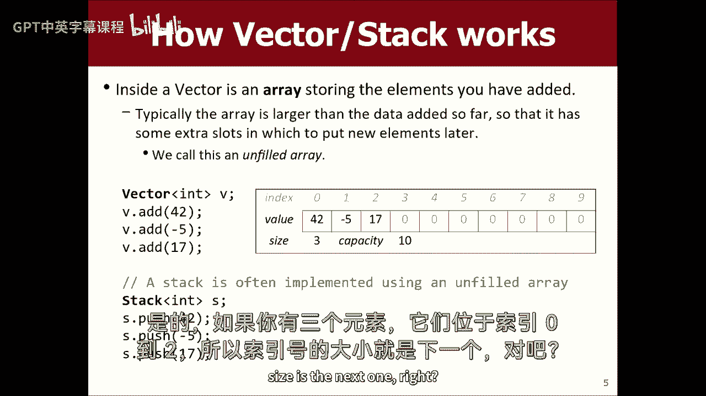

所以转到元素括号大小，并将其设置为，我们还需要做什么，是呀，是呀，哦哦，是啊，是啊，这其实是一个很好的观点，如果尺寸至少和容量一样大，那我就没有地方放这个了，就像如果我已经有十个元素在这里。

所以我要写自己，这是一个很好的老式做法，我绝对想解决这个问题，但我想回来，因为这需要一点点修理，所以假设我们在这里，我们有空间。

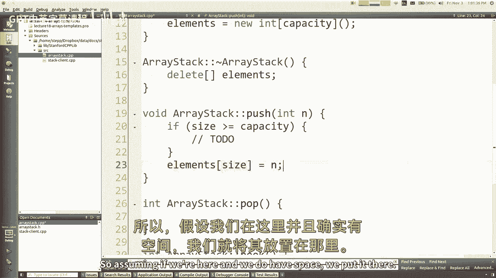

我们把它放在那里，所以我们继续把第四个元素，在我们的代码中还有什么需要做的吗，我们得增加尺寸，对呀，因为现在我们又多了一件所以尺码加尺码加尺码。

其实呢，如果你想变得很酷，你可以把你的加号放在这里，对呀，但不管怎样，我不会那样做的，我没那么酷，是啊，是啊。

就像容量减去没有容量并不表示有多少可用的插槽，它是插槽总数的指示，不下去，好啦，所以这是向右推，这些都是简单的操作，堆栈快，那是因为操作很简单。

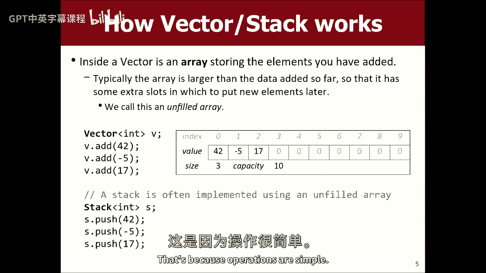

所以推，是吗？现在我们有了，让我们在流行音乐之前做顶峰，所以峰值是看堆栈顶部的元素，对呀，所以我要返回数组中某个元素的值，上面的元素大小减去一的索引是多少，是啊，是啊，那很好。

这里有什么我可能没有想到的情况吗，如果没有任何元素对，比如什么，如果堆栈为空，我们还没有我们还没有写这些空，但我们会再写一次，啊，她是什么，我不知道像，扔一个阿拉伯人，那是个错误案例，对吧。

我们不应该这样做，因为，就像我们几分钟前看到的，从附近的内存中随机抽取垃圾，数组，让我们不要这样就不会抛出一个例外，必要的，我们应该抛出一个异常，所以OK是空的，那只是回报，如果大小为零，对呀。

所以这很容易，好啦，流行所以流行有相同的方面，就像你不应该从空的堆栈里弹出来一样，所以也许我会，哎呀哎呀，我做了什么，也许我会把同样的，如果检查，您可能需要创建一个helper函数，不过，好吧。

所以现在流行音乐和巅峰基本上是一样的，但是我们必须删除元素并正确地返回它，所以我的意思是，基本上你把它从数组中拿出来放在一边，所以你确实喜欢int结果等于元素，支架尺寸减1。

或者你甚至可以说等于峰值大小减去减去，然后返回结果。

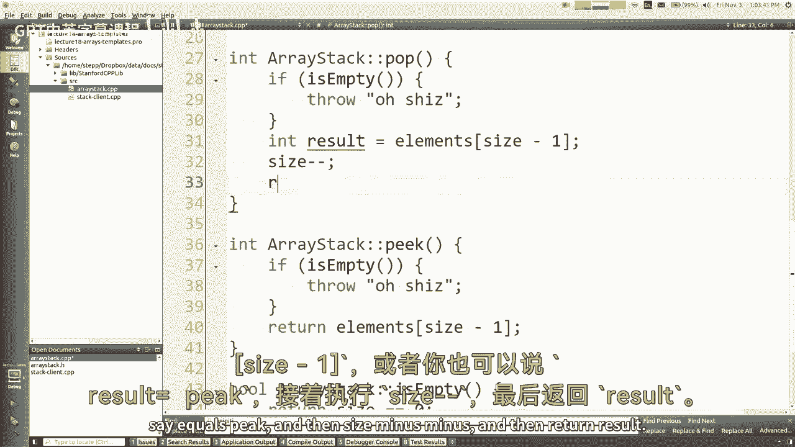

我们在这里没有做的一件事是，想象一下，如果我们把他抓回来，所以我们把尺寸缩小到两个，我们可以进来把他干掉。

我们可以说，呃，零。

所以这样做就像，如果我是，如果我突然出现，我把他带到一个叫做卖出和零出局的临时变量里，我把尺寸设为2，然后我把我留在一边的十七个还给你，结果，对，一切都很好，我想指出的是，虽然我们在技术上不需要清零。

这个东西，你知道为什么，如果我把尺寸增加到两个，我就把他们留在那里，就像，4。我怎么能就这样走了呢？我答应过你，我要把这个元素弹出来，但它还在里面，尺寸，是啊，是啊，我是说，我想这里的答案是。

结构的内部是有区别的，和结构的外观图，就像那十七还在那里，但如果他们想，他们拿不到十七个，下一次他们尝试尺寸将是两个，好让我们抓住这家伙，所以从客户的角度来看，十七岁不在那里。

至少不是以他们永远不会看到的方式，如果我有两个元素，我按下它就会超过17，所以如果我推的时候看不到，我咳嗽的时候看不见，它不在客户那里，所以你实际上不需要把它归零，那是一条有趣的皱纹。

如果你真的想把它归零也没关系，只是为了帮你调试什么的，但实际上并不像，如果你真的想为了速度而写这么快，你知道你不会把它归零，这是一种C加+的方式，只留下一些垃圾。

事实上，在程序的一开始，我就把整个数组清零了，我没必要那么做，我可以把这些括号删掉，让这一切都成为垃圾，如果大小为零，我绝不会让你看任何垃圾，所以谁在乎呢，这是一个有趣的皱纹，你知道吗，好吧。

我想我差不多做完了，我还没有找到打印操作员，我们现在就写吧，因为打印操作员与堆栈是最好的朋友，它可以看到内部数组的内部，与任何其他代码不同，它是允许的，或者，与任何客户端代码不同。

我是说它可以看到内部数组，我是说打印东西的模板是，你把花括号，然后你把用逗号分隔的元素，就像我觉得我写了代码，很多时候，它只是一种栅栏柱的东西，基本上你要做的就是说卷曲。

然后在最后的某个地方你会说另一个卷曲，然后你会说出去，那将永远存在，即使它是空的，但是如果传入的堆栈不是空的，然后打印元素，元素就打印出来了，就像用栅栏柱，中间有逗号的，对呀，所以你会做。

然后在后面的每个元素上加上一个逗号，加上元素，你知道我的意思，因为int i等于1，I小于堆栈大小，那里，所以我想现在管用了，如果我在那里开得快一点，我是说基本上这个在外面，然后从1开始。

这样我以前就没有逗号了，第一个是栅栏柱的东西，堆栈点元素的语法是，因为从技术上讲，这个函数在堆栈类之外，所以我指的是堆栈，伸手到他体内，利用他的私有变量，但我用的是外部语法，因为这个函数不在类中。

我向上移动尺寸，这有道理吗，我正在打印出来，这就是这个操作员被调用的输出流，很可能会被淘汰，但也可能是别的什么，所以我只想去测试一下，我已经设置好了测试代码，哦有趣，这个东西采用常量数组堆栈。

它不让我打电话是空的，因为它说你不能调用常量堆栈上的空，所以我们制作了不完全常量正确的代码，你明白吗，就像这个打印操作员，他保证不修改堆栈，所以他说我会让他保持不变，但是当你保证不修改堆栈时。

这意味着您只需要调用堆栈上的常量方法，我们没有任何常量方法，所以它不会让我们调用任何方法，应该引起哪些方法，是的，是空的，不会改变任何事情，峰值也会回来，它查看数据，但它不会改变它，它只是给你价值。

所以这也是常量，推和弹，显然修改堆栈，他们不是骗子，好啦，是呀，现在我想，如果我们编译一个灯泡，呃，我不知道，它走了吗，哦，那里，上面写的是什么，哦，那是因为CPL中的H文件，CPP文件必须匹配。

如果你让其中一个常量，你需要让另一个常量，所以我想在顶峰应该说这里是常量，里面是空的，这里应该写常量，好啦，所以我认为它起作用了，所有这些警告都在客户端代码中，我们之前做的那些蠢事。

所以我在这里真正想做的是，让我把这些东西评论出来，那与我们目前正在做的事情无关，评论出去，这一切，好啦，我真正想做的是，这些东西就在这里吗，所以让我把它拉起来一点浆糊，我听到松懈的信息进来，那里很好。

好啦，所以我应该做的是做一堆东西推一些东西，打印堆栈，所以我推，推，推，推和我打印之间，然后我流行流行流行流行和我打印，所以我只是想测试一下这些方法，好啦，所以让我们试试吧，所以我推。

我得到42个看起来像我添加的元素，然后当我把它们弹开的时候，我得到88然后我得到17，然后我得到负3，然后我得到42，然后它是所以我认为它通常是工作的，所以我是说我不是真的选这个。

就像一件超级超级难实现的事情，但我想向你展示如何实现一个数据结构，它的内部结构是基于，你知道记住如何释放所有的记忆是很重要的，当您使用完堆栈后，我可以打印声明来验证它是这么叫的。

但我想我会节省这样做的时间，所以到目前为止我们所看到的祝福你，你对数组有什么问题吗，或者关于基于数组实现这样的结构，是啊，是啊，所以为了实现，你要达到十个要素，每次加十个会不会更有效。

或者是基于大小的增量，所以一旦你有了五万到十五万，你不必每十次就执行一次，如果它像一个巨大的，是啊，是啊，是啊，是啊，嗯好吧，嗯，让我们谈谈那个，所以他问我们应该增加多少，其实呢，我应该向她道歉。

她让我调整尺寸，我放弃了她的想法大概有20分钟再也没有回来，所以让我们把它修好，如果我们没有空间添加这个东西，让我们做一个更大的数组，并继续使用它，但是如果我们做一个更大的数组。

我们必须获取我们较小数组的内容，我们必须将它们复制到，所以这看起来像这样，在更大的等于一个新的数组，现在呢，这就提出了一个问题，即较大的数组应该有多大，应该有一定的尺寸，那口井比较大，你可以像容量一样。

再加上十个就像它能再容纳十个一样，他说得很好，我可以加50，它的容量可能是1000倍，可能有很多不同的事情对吧，先不说细节，我告诉你这很重要，它是一个倍数，而不仅仅是添加，加五加十，加一百不好。

你想要时间，二或五倍，你想要时间，简而言之，这是因为这确保了你，你越来越不会经常遇到这种情况，如果你在做一个非常大的结构，你必须调整它的大小，每10个元素或每50个元素复制一次。

那么建造一个由两千万个元素组成的结构真的会用所有这些副本杀死你，所以翻倍或三倍，或者类似的东西对你来说更好，去一个更大的，一个更好的大O，不会伤害你的地方，同样多的事情要做，随着时间的推移。

这些首先调整大小，所以到目前为止，最常见的事情是在这样的情况下将大小增加一倍，所以这就是我认为我们应该做的，嗯，所以我会把它清零，我猜，然后我所做的是为了int，我等于零，i小于大小或容量。

他们在这一点上都是一样的，那我说大一点，我等于我的元素，I，您必须这样做，将每个单独的元素复制到，如果你试图做一些像，喜欢将元素内容复制到更大的，你明白那是什么感觉吗，如果我有两个数组。

我想把这个的内容复制到那个里，这个语句只是将指向这个点的指针指向那个点，现在我失去了我更大的数组，我仍然指向较小的数组，感觉很糟，情况不妙，你知道你不想那样做，所以你得一个接一个地复制元素，像这样。

一旦我们完成，我们还有两件事要做，我们现在创建了一个新数组，那个更大，储存的东西和以前一样，实际上我们需要做三件事就是少了三个陈述，告诉我一个声明，我应该补充一点，是啊，是啊，会是，啊，是啊，是啊。

我应该删除旧数组，因为我们不想再用他了，所以那个小的有十个大的，把它扔了吧，我现在要留着那个大的，那我还需要做什么，除此之外，我的元素数组应该指向更大的，从现在开始我要用那个作为元素，是呀，好呀。

我还需要做一件事，我需要说容量乘以2，因为我需要记住我有更多的空间完全正确，我不需要改变尺寸，因为我没有改变我存储了多少元素，这就是调整大小的操作，你可以看到，也许我为什么跳过它。

因为这是代码中最难的部分，所有其他的方法都很简短简单，这就有点棘手了，但这就是我们回到那条路的原因，好啦，是啊，是啊，去吧，但是你想要什么开始你的能力和一个向上调整的力量，很高兴认识你，是啊，是啊。

你可以，我是说，有很多人研究这个，它们就像这些东西的合适尺寸，有一个权衡，就像如果你开始得太大，你浪费空间建造小建筑，我觉得一个处理了一大堆程序的人，发现像很多程序列表一样，平均只有零到三个元素。

或者类似的东西，令人惊讶的是，有很多这样的小名单，所以如果他们都是从一百个或五十个点开始的，或者你是说2的幂，取决于2的幂是多少，你知道我不认为它必须是二的幂，你知道吗，不管我怎么想，这是第二次很重要。

但是从倍数或2的次方开始并不重要，我刚说八点，当然看起来不错，你可以从八个开始，你想做八个，好啦，你的门在这儿，当然我们是很好的程序员，我们很小心没有写数字十，其他地方，对呀，那不是真的吗？在那里吗。

这里还有其他十个吗，没有井，但是没关系，我原谅那个我们不换到86英尺10英寸，就是这样，没有其他十了，嘿元素是红色的，你是田纳西人吗？因为我在计算你的元素，不要紧，你是唯一的十个，原来如此，来吧，来吧。

你们还没听过，呃随便吧，所以说，嗯，这就是这个的核心，好啦，我想尽快再做几件事，这里我想谈谈一个常见的特殊bug。

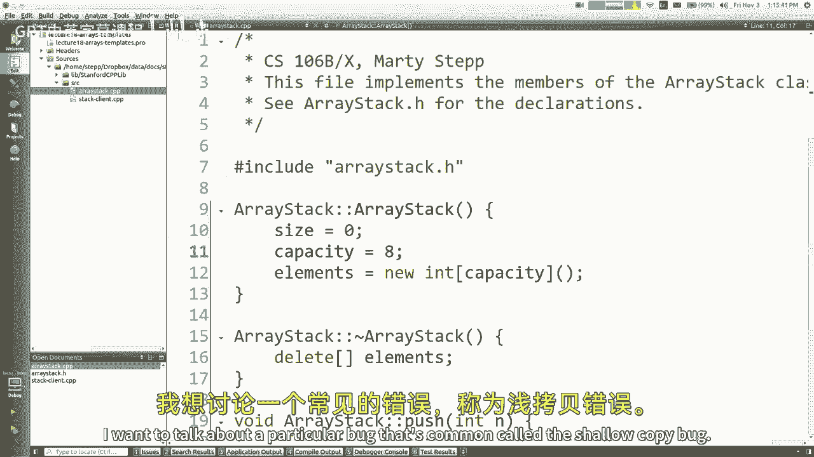

称为浅拷贝错误，这很微妙，我将很快向你们展示，如果创建一个数组堆栈，就像我在这里做的那样，这是我们写的代码，放点东西进去，您可以创建另一个数组堆栈，你把它设置为第一个，所以等于运算符一般是做什么的。

是把记忆中的东西，把它贴到另一个东西上，所以第一口井的内容会被复制到第二口井里，s的内容是什么，一个大小，一个容量和一个数组，数组被构建为指针，对呀，开始了吗，当我设置这个的时候，它的两端看起来像这样。

真正重要的是，它们都指向同一个数组，为什么它没有复制好，记住指针是什么，写下内存地址和数字，所以它就把这个数字复制到这里，这实际上意味着它们都指向同一个地方，对呀，他们共享一个数组。

所以现在如果我设置S的两点推，它就会把它放进去，它会增加这里的大小，但它会改变这家伙的数组，但他的体型不会，基本上现在真的很糟糕的事情开始发生，因为他们彼此分享记忆，他们是他们是，他们要相撞了。

最具破坏性的是，如果这两个中的一个超出了范围，他要删除数组，另一个人会喜欢，试着继续使用它，然后那里会发生非常糟糕的事情，对呀，所以你看到了吗，这个bug，这是个问题，这就像一个C+的问题。

它在其他语言中也出现过，这叫浅拷贝，肤浅的复制问题，好的，好的，所以这很糟糕，所以如果你想解决这个问题，有几种方法可以做到这一点，一种方法是你可以写一个叫做复制构造函数的东西，它是擦除资产的构造函数。

它接受另一个具有参数的数组，现在在这里，你可以写一些代码，实际上是数组的完整副本，这是一个新的数组，复制了其他人的所有元素，然后你就不会有一个肤浅的副本，您还可以编写一个equals运算符。

所以创建一个堆栈和创建一个堆栈是有区别的，使用另一个堆栈的内容，或者把一堆同理心和内容设置为另一堆，这些都是你需要做的独立的事情来处理，一个堆栈被分配给另一个堆栈的情况，所以在C++中有一个普遍的原理。

叫做三法则，三的规则是，如果您有任何内存要分配给新的，你需要在教练那里清理，那么你可能应该把另外两件事也写下来，以确保你没有一本肤浅的抄本，所以基本上就像如果你需要这三个中的任何一个，你可能需要这三个。

或者你可以做我喜欢做的事，就是说，你知道的，我不想处理这个，所以你可以禁止复制，你可以声明我刚才在幻灯片上的另外两件事，但你可以声明它们是私人的，这意味着任何人都不允许对你的班级做这些事情。

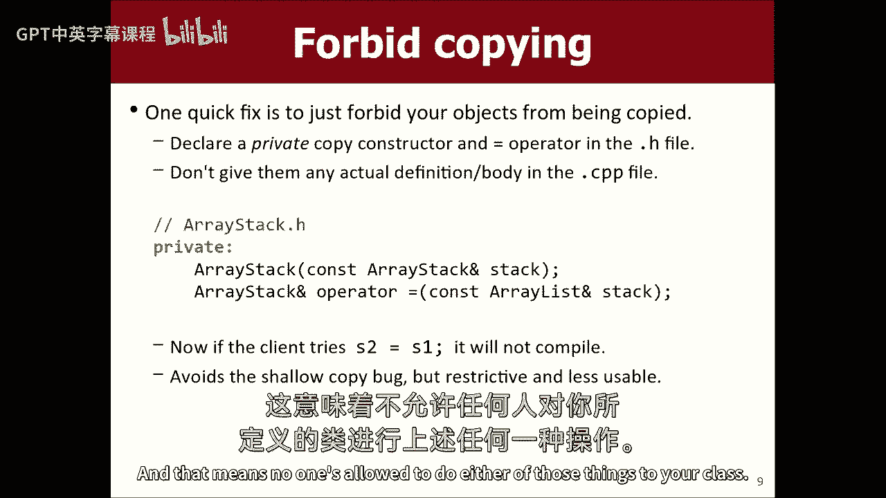

所以就像我的意思，我不知道我是否能在这里很好地演示这个bug，但是如果Main在之后做了另一个堆栈，我做了所有这些事情，如果我做另一个数组堆栈，S 2等于，S一个，我现在有窃听器了，否则我会有虫子。

所以如果我不想让这一切发生，我可以去数组堆栈点h，我可以说让我们做一个新的构造函数，对于接受对另一个数组堆栈的常量引用的数组堆栈，但我们不要把它放在这里，我们把它放在私密区吧，3。

别人不允许把自己的私事告诉别人，让我们也写，一个运算符等于它将数组堆栈，equals运算符的返回类型是对自己的引用，所以我会把这两个都写在这里，并把它们保密，有什么用呢，如果我没记错的话，哦。

它不叫它的一个，它叫做堆栈，但现在我们将汇编，它会说你不能这么做，你可能会说，好吧，这是相当蹩脚的，但至少我的意思是这比浅薄的抄本要好，因为肤浅的复制虫很乐意向前犁，然后你的程序做了可怕的事情。

所以编译器错误总比可怕的事情好，我认为，是啊，是啊，那么为什么在他们的引用中有不同类型的等式呢，哎呦，为什么是参考，因为你可以把一个相等的语句作为一个更大语句的一部分，它返回等式左边的东西，你指的是谁。

被分配到，那只是运算符的实现细节，是啊，是啊，问题是复制构造函数特殊，或者它只是一个构造函数，它只是一个构造函数，它叫它有点特别，他们称之为复制构造函数，但它有一个特殊名字的唯一原因。

只是它采用与参数相同的类型，除了任何特殊的语法或任何东西，没有比这更好的了，我的意思是，如果你如果你做并删除堆栈二，把调用复制构造函数的圆括号，如果您没有定义复制构造函数，如果你根本没有定义一个，是啊。

是啊，你没有保密，没有那样的东西，然后你试着这么做，不，看看你有没有复制构造函数，就像，等式或类似的东西有某种默认值吗，是啊，是啊，我有时对这些有点困惑，但这两种方法都是有效的让一件事基于另一件事。

这是一种愚蠢的东西，但基本上你不想让别人这么做，如果他们要做指向记忆的指针，他们会与你的记忆发生冲突，所以你不想让客户这么做，我没时间了，但如果你有兴趣，今天的演讲台上还有一些幻灯片。

如果我们想让这个属性能够支持其他类型，除了整数，我们可以做一个叫做模板的东西，但我会停下来继续，星期一，谢谢你陪我度过了艰难的一周。

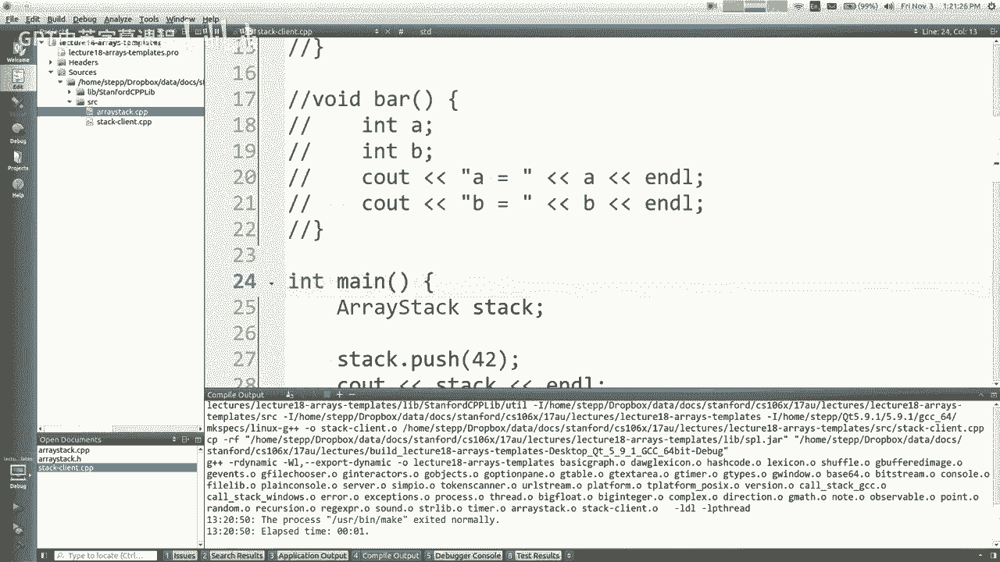

享受你的周末，回头见，星期一。