# 课程18：数组 📚

在本节课中，我们将学习C++中数组的基础知识，包括其声明、初始化、内存管理，并动手实现一个基于数组的栈数据结构。我们将重点关注数组的核心概念和常见陷阱。


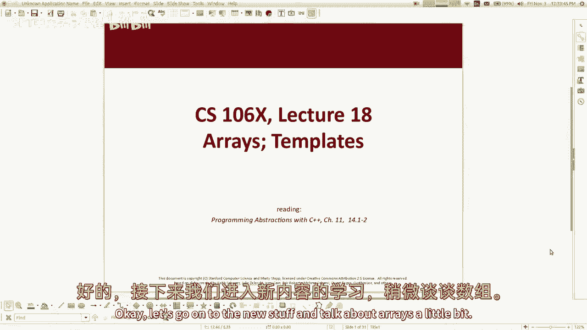

---

## 概述

数组是C++中一种基础且高效的数据结构，用于存储相同类型的元素集合。与链表不同，数组在内存中是连续存储的，这使得元素的访问速度非常快。然而，数组的大小在创建时是固定的，这带来了一些挑战。本节我们将学习如何声明和使用数组，并探讨如何利用数组来实现更高级的数据结构，如栈。

---


## 数组的声明与内存

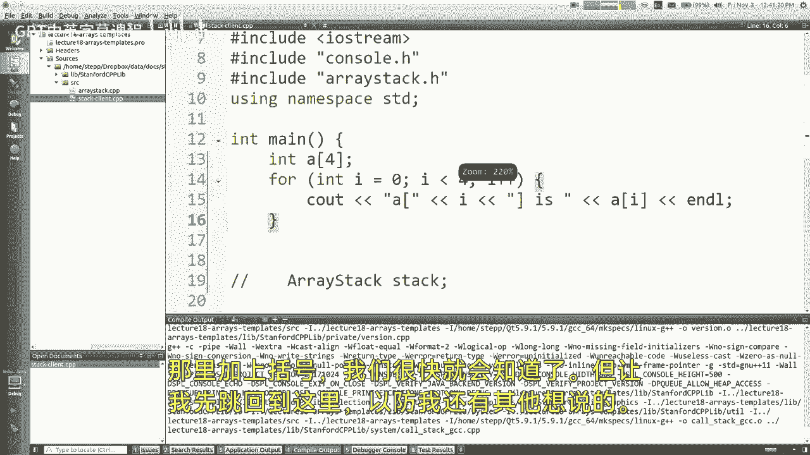

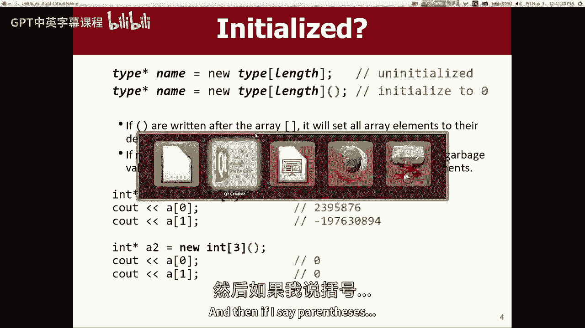

在C++中，数组可以在栈上或堆上声明，这决定了数组的生命周期和内存管理方式。

### 栈上数组
栈上数组在函数作用域内存在，函数结束时自动释放。其声明语法如下：
```cpp
int arr[10]; // 声明一个包含10个整数的数组，元素值为随机垃圾值
```
此数组的大小固定为10，其元素初始值为内存中的随机数据。


### 堆上数组
堆上数组使用`new`关键字分配，其生命周期由程序员控制，必须使用`delete[]`手动释放。
```cpp
int* arr = new int[10]; // 在堆上分配一个包含10个整数的数组
// ... 使用数组 ...
delete[] arr; // 使用完毕后必须释放内存
```
堆上数组允许我们动态管理内存，例如在需要时重新分配更大的数组。

### 数组初始化
默认情况下，数组元素不会被初始化。我们可以使用以下语法将数组元素初始化为零：
```cpp
int* arr = new int[10](); // 所有元素初始化为0
```
对于栈上数组，C++不允许在声明时使用空括号进行初始化，但可以通过循环手动设置。


---

## 数组与指针的关系

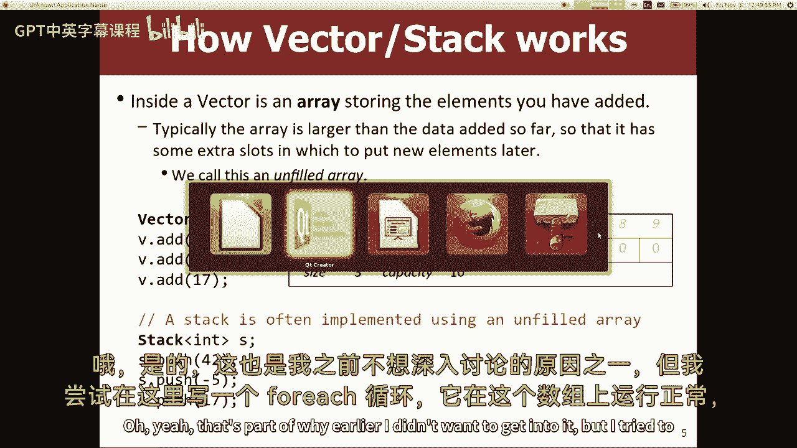

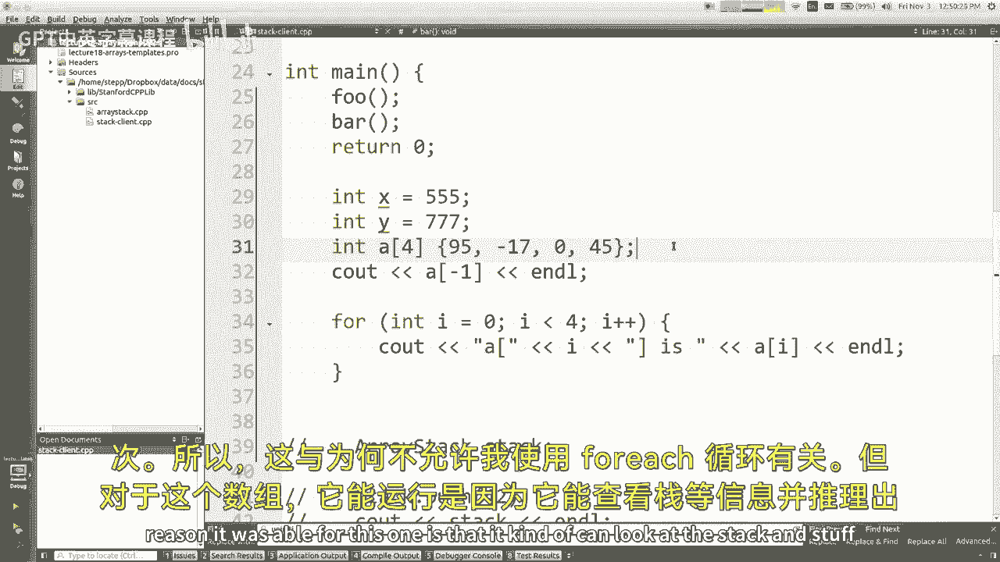

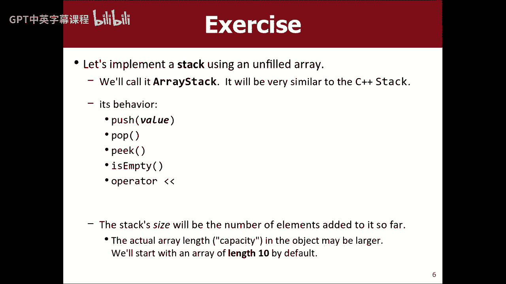

在C++中，数组名本质上是指向数组第一个元素的指针。这意味着我们可以使用指针算术来访问数组元素。
```cpp
int arr[5] = {1, 2, 3, 4, 5};
int* ptr = arr; // ptr指向arr的第一个元素
cout << *(ptr + 2); // 输出arr[2]的值，即3
```
这种关系使得数组和指针在许多情况下可以互换使用，但也容易导致错误，例如越界访问。

---

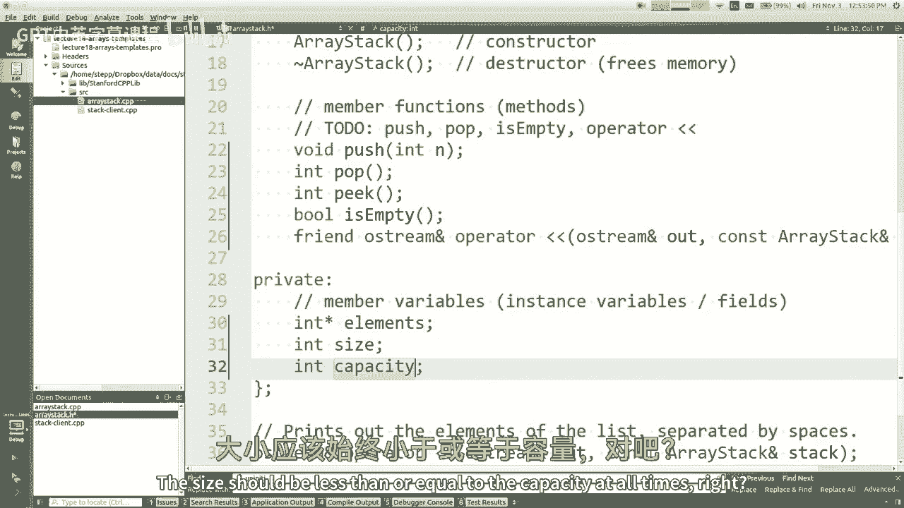


## 实现基于数组的栈

上一节我们介绍了数组的基本概念，本节我们将利用数组来实现一个栈数据结构。栈是一种后进先出（LIFO）的数据结构，支持推入（push）、弹出（pop）和查看顶部元素（peek）等操作。

### 栈的设计
我们的栈类将包含以下私有成员：
- `elements`：指向堆上数组的指针，用于存储栈元素。
- `size`：当前栈中元素的数量。
- `capacity`：数组的总容量，即最多可存储的元素数量。

### 构造函数与析构函数
构造函数负责初始化成员变量，析构函数负责释放堆上数组的内存。
```cpp
ArrayStack::ArrayStack() {
    size = 0;
    capacity = 10;
    elements = new int[capacity](); // 初始容量为10，元素初始化为0
}


ArrayStack::~ArrayStack() {
    delete[] elements; // 释放数组内存
}
```

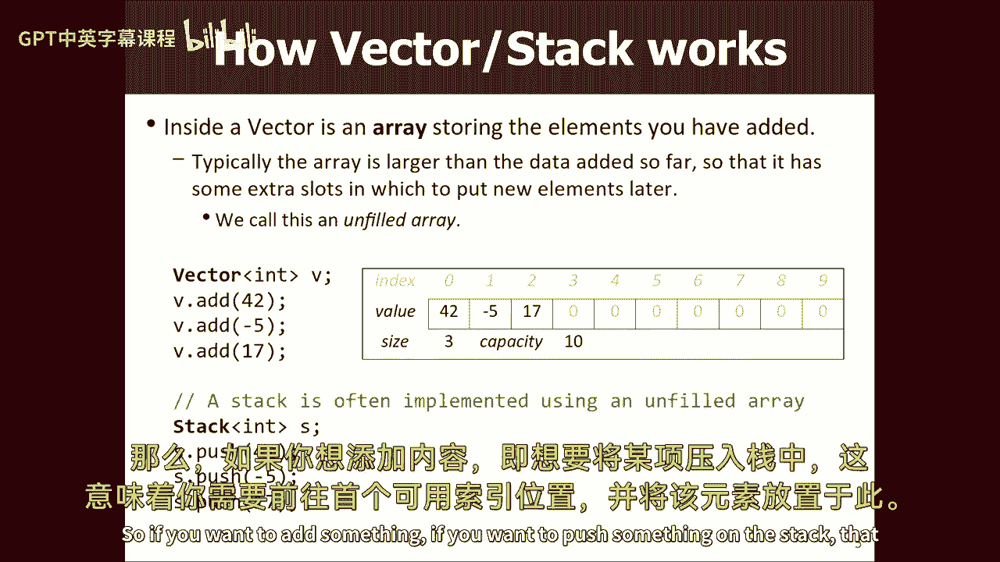

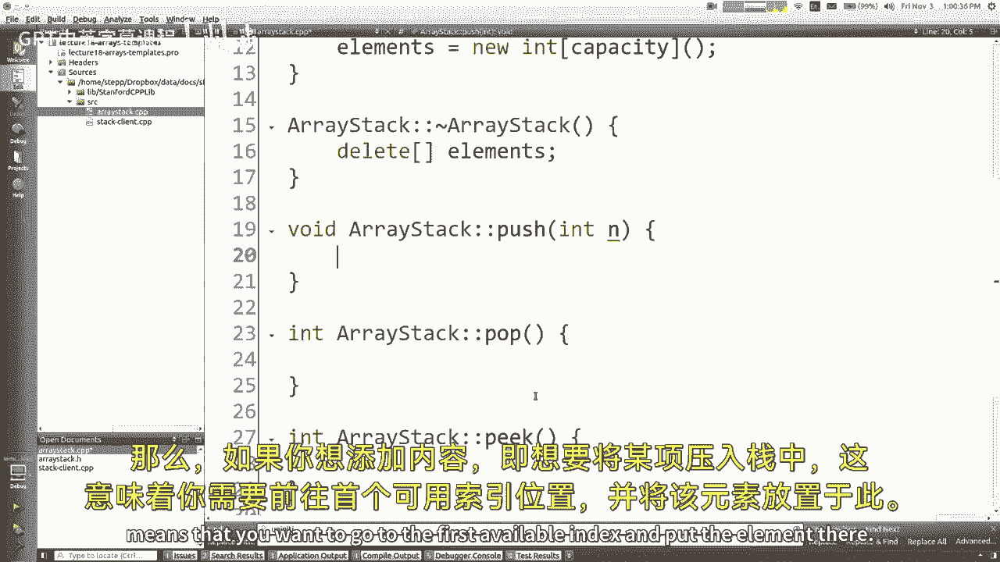


### 推入操作（push）
推入操作将元素添加到栈顶。如果数组已满，我们需要扩展数组容量。
```cpp
void ArrayStack::push(int value) {
    if (size >= capacity) {
        // 扩展数组容量
        capacity *= 2;
        int* larger = new int[capacity]();
        for (int i = 0; i < size; i++) {
            larger[i] = elements[i];
        }
        delete[] elements;
        elements = larger;
    }
    elements[size] = value;
    size++;
}
```


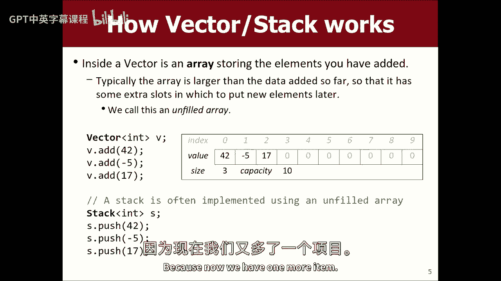

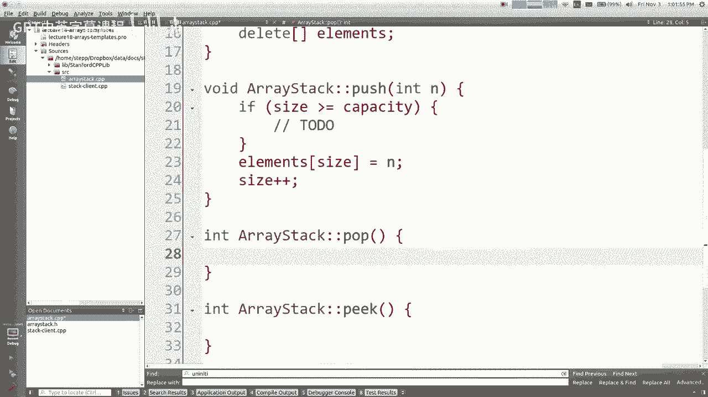


### 弹出操作（pop）
弹出操作移除并返回栈顶元素。如果栈为空，应抛出异常。
```cpp
int ArrayStack::pop() {
    if (isEmpty()) {
        throw "Stack is empty";
    }
    size--;
    return elements[size];
}
```


### 查看顶部元素（peek）
查看操作返回栈顶元素但不移除它。
```cpp
int ArrayStack::peek() const {
    if (isEmpty()) {
        throw "Stack is empty";
    }
    return elements[size - 1];
}
```

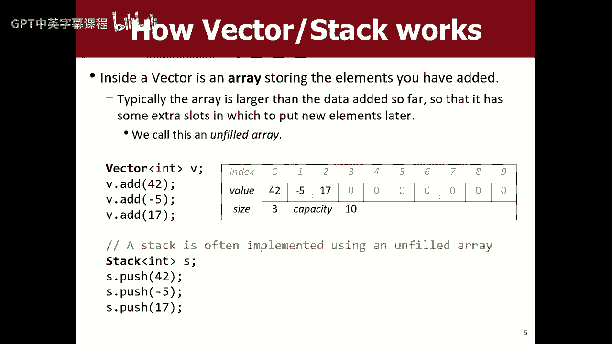

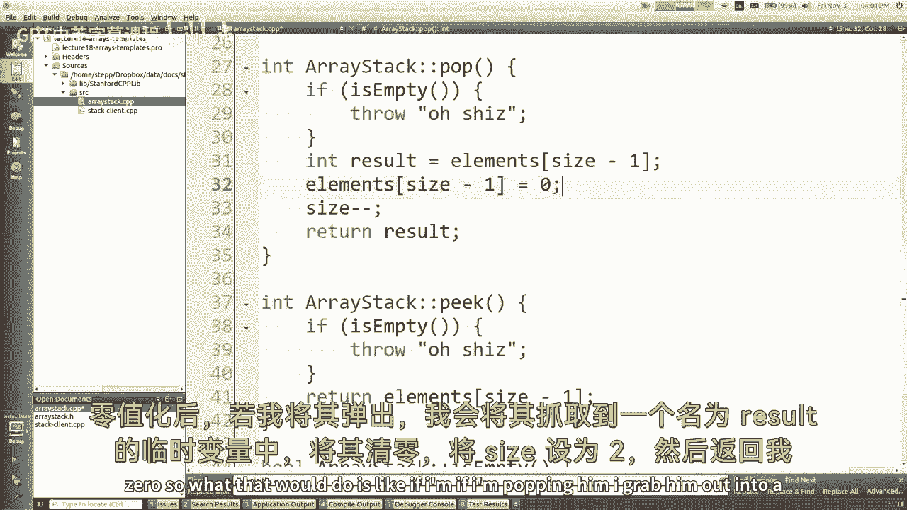

### 判断栈是否为空
```cpp
bool ArrayStack::isEmpty() const {
    return size == 0;
}
```


### 打印栈内容
我们可以重载输出运算符来打印栈的内容。
```cpp
ostream& operator<<(ostream& out, const ArrayStack& stack) {
    out << "{";
    for (int i = 0; i < stack.size; i++) {
        if (i > 0) out << ", ";
        out << stack.elements[i];
    }
    out << "}";
    return out;
}
```

---

## 浅拷贝问题与三法则

在C++中，如果类包含动态分配的内存（如堆上数组），默认的拷贝构造函数和赋值运算符会导致浅拷贝问题。浅拷贝仅复制指针值，使得多个对象共享同一块内存，可能导致内存泄漏或重复释放。

### 三法则
三法则指出，如果一个类需要自定义析构函数、拷贝构造函数或赋值运算符中的任何一个，那么它很可能需要全部三个。以下是解决浅拷贝问题的方法：

1. **禁止拷贝**：将拷贝构造函数和赋值运算符声明为私有，防止外部调用。
    ```cpp
    private:
        ArrayStack(const ArrayStack& other);
        ArrayStack& operator=(const ArrayStack& other);
    ```


2. **实现深拷贝**：自定义拷贝构造函数和赋值运算符，复制动态内存的内容。
    ```cpp
    ArrayStack::ArrayStack(const ArrayStack& other) {
        size = other.size;
        capacity = other.capacity;
        elements = new int[capacity];
        for (int i = 0; i < size; i++) {
            elements[i] = other.elements[i];
        }
    }

    ArrayStack& ArrayStack::operator=(const ArrayStack& other) {
        if (this != &other) {
            delete[] elements;
            size = other.size;
            capacity = other.capacity;
            elements = new int[capacity];
            for (int i = 0; i < size; i++) {
                elements[i] = other.elements[i];
            }
        }
        return *this;
    }
    ```

---


## 总结

本节课我们一起学习了C++中数组的基础知识，包括声明、初始化、内存管理及其与指针的关系。通过实现一个基于数组的栈数据结构，我们深入理解了数组的实际应用。此外，我们还探讨了浅拷贝问题及其解决方案——三法则。掌握这些概念对于编写高效、安全的C++程序至关重要。


在接下来的课程中，我们将继续探索更多数据结构及其实现。祝你学习愉快！ 🚀