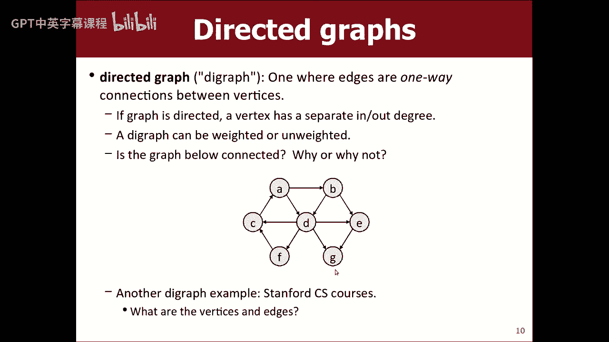
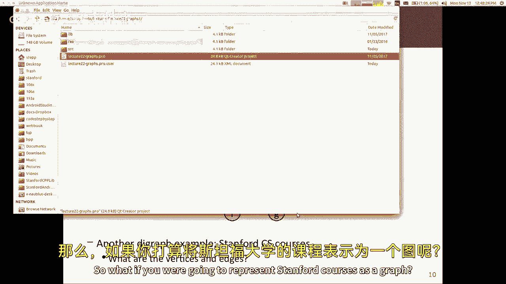
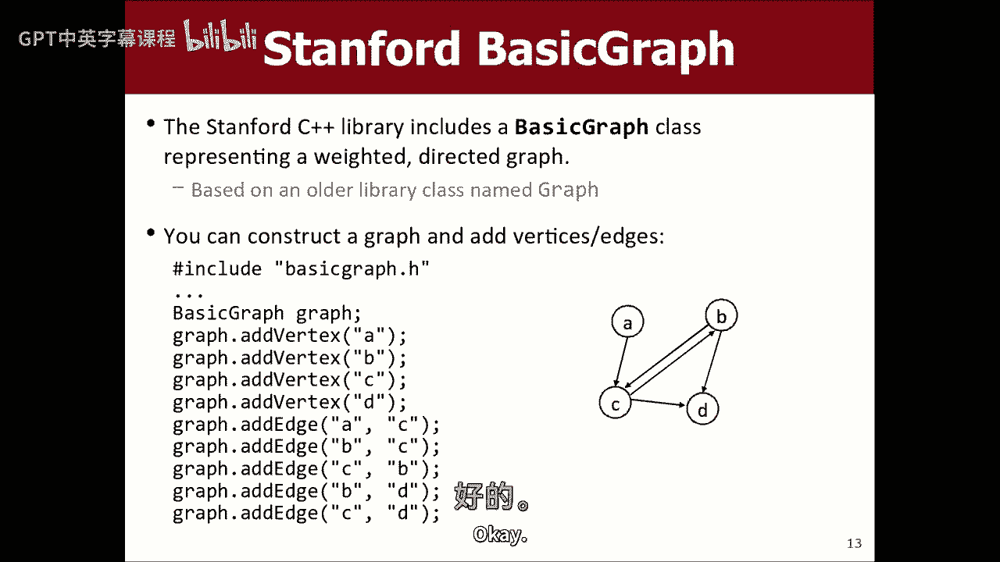
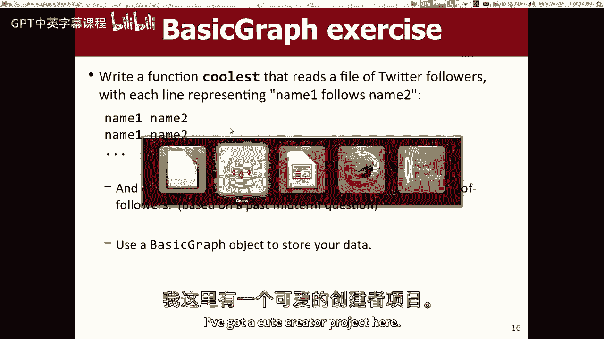
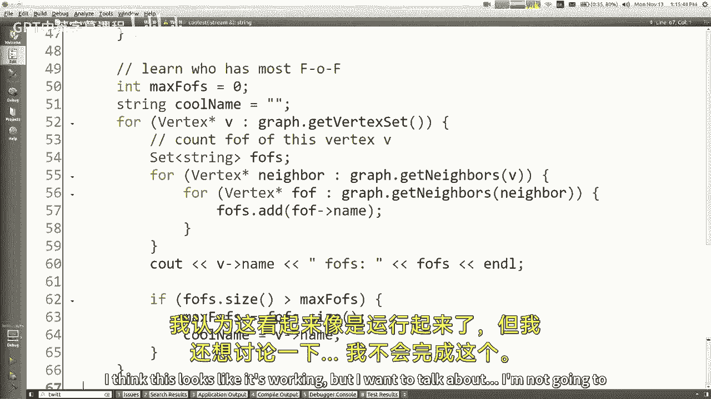
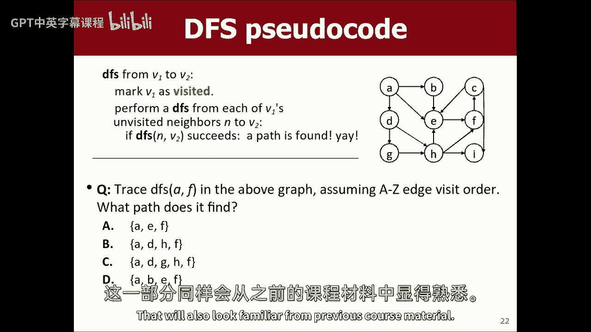

# 📚 课程名称：编程抽象方法 CS106X 2017 - 第19讲：图（一）与深度优先搜索


## 📖 概述
在本节课中，我们将学习一种新的数据结构——图。图由顶点和边组成，能够有效建模计算机科学中的许多问题，例如社交网络、地图导航和课程先决条件等。我们将介绍图的基本概念、术语，并学习如何使用斯坦福库中的`BasicGraph`类。最后，我们将探讨一种基础的图搜索算法：深度优先搜索。

---

## 🧩 什么是图？
图是一种数据结构，包含两个主要部分：一组顶点和一组边。顶点有时被称为节点，边则是顶点之间的连接。

在计算机科学中，图用于建模许多问题。例如，社交网络中的用户可以作为顶点，用户之间的好友关系可以作为边。航班路线图中，城市是顶点，城市间的航线是边。

### 核心概念
*   **顶点/节点**：图中的基本元素。
*   **边/弧**：连接两个顶点的关系。
*   **路径**：一系列边或顶点，将一个顶点连接到另一个顶点。
*   **连通图**：图中任意两个顶点之间都存在路径。
*   **环**：一条起点和终点是同一顶点的路径。
*   **自环**：一条连接顶点到自身的边。

---

## 🔄 图的变体与属性
上一节我们介绍了图的基本构成，本节中我们来看看图的一些常见变体和属性。

### 加权图
在加权图中，每条边都有一个关联的数值，称为权重。权重可以表示距离、成本、时间等。

**公式/代码表示**：`边 e = (顶点A, 顶点B, 权重 w)`





### 有向图
在有向图中，边具有方向，从源顶点指向目标顶点。例如，Twitter的关注关系是有向的。

**代码表示**：`边 e = (源顶点 -> 目标顶点)`


图可以同时具有多种属性，例如，可以是一个加权有向图。

---

## 💻 使用`BasicGraph`类
斯坦福库提供了一个`BasicGraph`类，方便我们操作图。它默认是一个有向加权图，顶点通常用字符串表示。

以下是`BasicGraph`的一些常用方法：
*   `addVertex(name)`: 添加一个顶点。
*   `addEdge(v1, v2)`: 添加一条从`v1`指向`v2`的边。
*   `getNeighbors(v)`: 获取顶点`v`的所有邻居（即从`v`出发能直接到达的顶点）。
*   `getVertexSet()`: 获取图中所有顶点的集合。
*   `getEdgeSet()`: 获取图中所有边的集合。

### 示例：寻找“最酷”的人
假设我们有一个文件，记录了Twitter的关注关系。每行包含两个名字，表示“名字1关注名字2”。我们定义“最酷”的人是拥有最多“追随者的追随者”的人。

**思路**：
1.  读取文件，构建有向图。为了便于计算“追随者的追随者”，我们让边从被关注者指向关注者（即 `addEdge(名字2, 名字1)`）。
2.  遍历图中每个顶点（用户）。
3.  对于每个用户，收集其所有邻居（直接追随者），再收集这些邻居的所有邻居（追随者的追随者），放入一个集合以去重。
4.  集合的大小即为该用户的“间接追随者”数量。找出拥有最大集合的用户。





**核心代码逻辑**：
```cpp
// 伪代码示例
BasicGraph graph;
// ... 读取文件构建图 ...

string coolestName;
int maxFollowers = 0;

for (Vertex* v : graph.getVertexSet()) {
    Set<string> allFollowers;
    for (Vertex* neighbor : graph.getNeighbors(v)) {
        for (Vertex* secondNeighbor : graph.getNeighbors(neighbor)) {
            allFollowers.add(secondNeighbor->name);
        }
    }
    if (allFollowers.size() > maxFollowers) {
        maxFollowers = allFollowers.size();
        coolestName = v->name;
    }
}
cout << "最酷的人是: " << coolestName << endl;
```

---

## 🧭 深度优先搜索
现在，我们来看看如何在图中寻找路径。一个基础的算法是深度优先搜索。

深度优先搜索从一个起始顶点开始，沿着一条路径尽可能深入地探索，直到无法继续，然后回溯并尝试其他路径。这本质上是一种递归回溯算法。

**算法思路**：
1.  从起点开始，将其标记为“已访问”。
2.  检查当前顶点是否是目标顶点。如果是，则成功找到路径。
3.  如果不是，则递归地对每一个“未访问”的邻居顶点，执行深度优先搜索。
4.  如果所有邻居都探索完毕仍未找到目标，则回溯。

**特点**：
*   DFS不保证找到的路径是最短路径。
*   它可能首先找到一条较长的路径。



**伪代码**：
```cpp
bool dfs(Vertex* current, Vertex* target, Set<Vertex*>& visited) {
    if (current == target) return true; // 找到目标
    visited.add(current); // 标记为已访问

    for (Vertex* neighbor : current->neighbors) {
        if (!visited.contains(neighbor)) {
            if (dfs(neighbor, target, visited)) {
                return true; // 通过这个邻居找到了
            }
        }
    }
    return false; // 从当前顶点出发未找到
}
```

---




## 📝 总结
本节课中我们一起学习了图的基础知识。我们了解了图的定义、顶点和边的概念，以及加权图、有向图等变体。我们实践了如何使用`BasicGraph`类来构建图并解决实际问题（如寻找社交网络中最有影响力的人）。最后，我们介绍了深度优先搜索算法，这是一种利用递归回溯在图中寻找路径的基本方法。下节课我们将学习另一种搜索算法——广度优先搜索，它能找到最短路径。