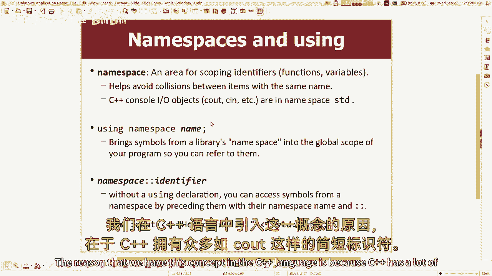
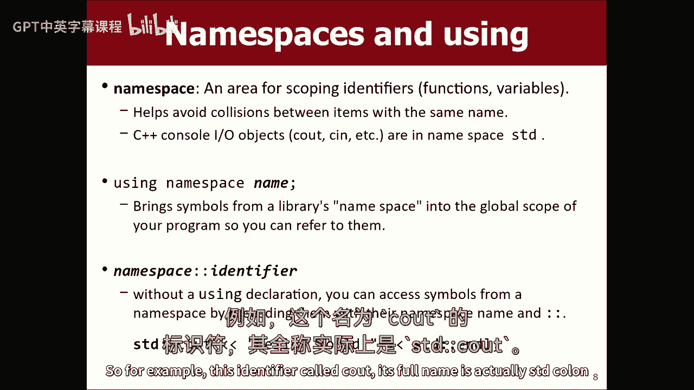
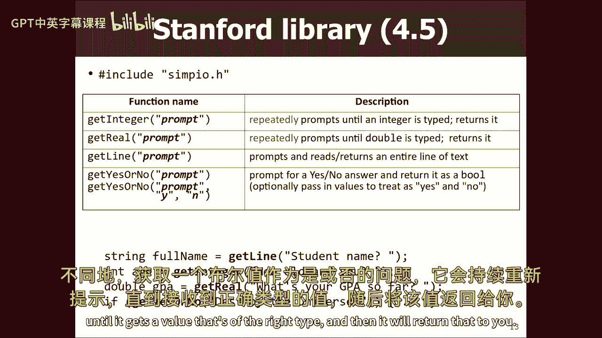
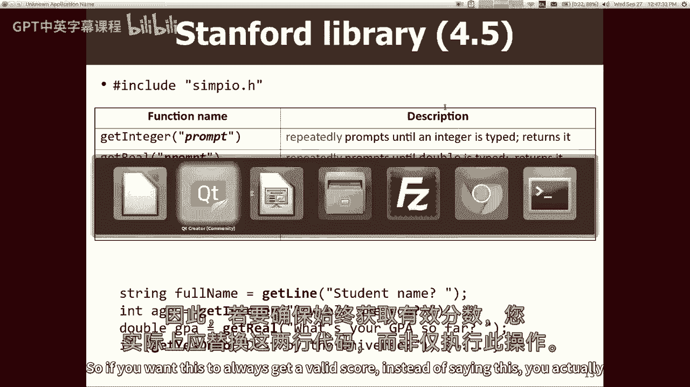
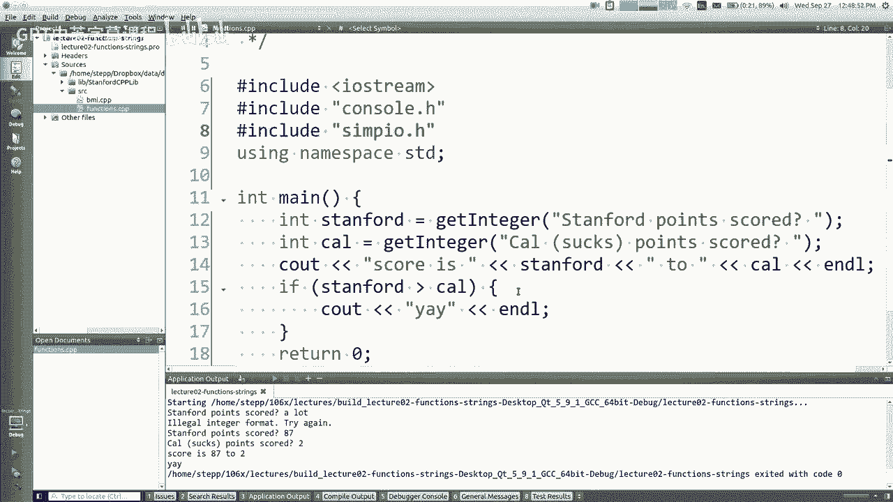
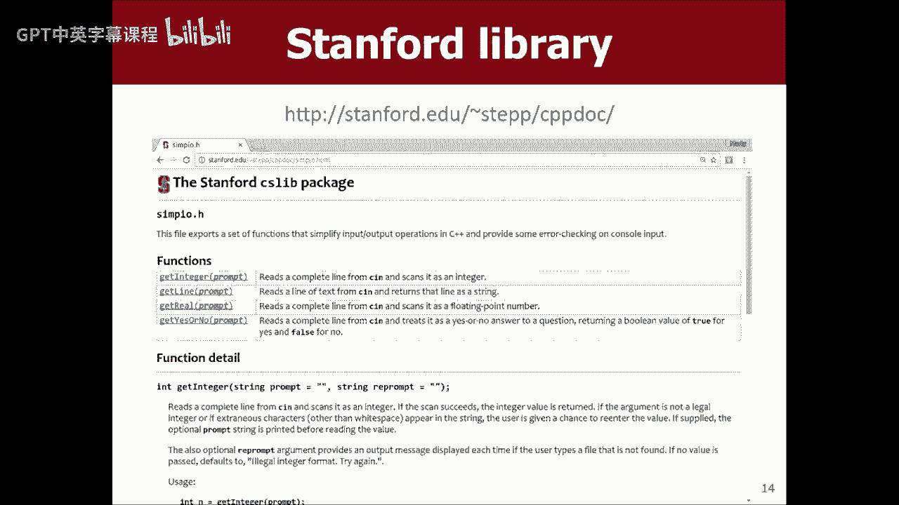
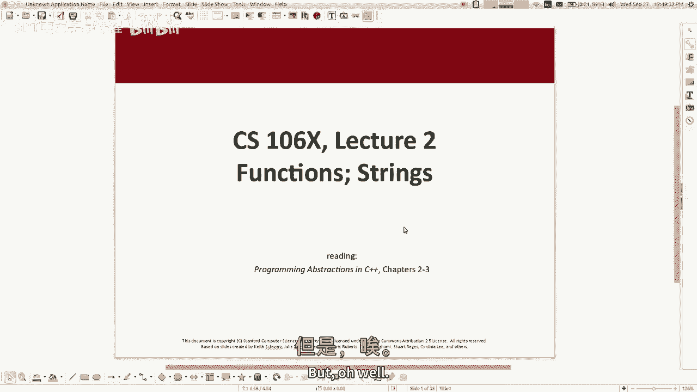
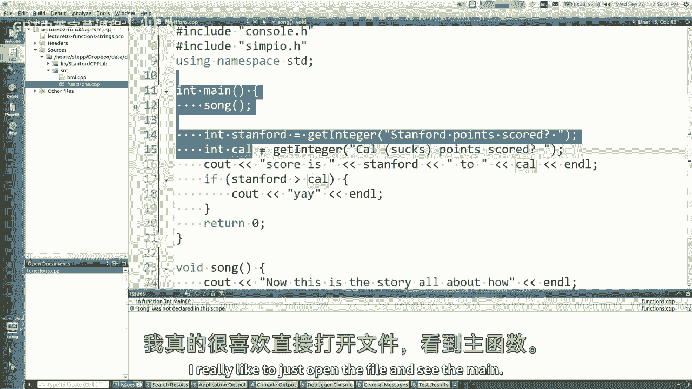
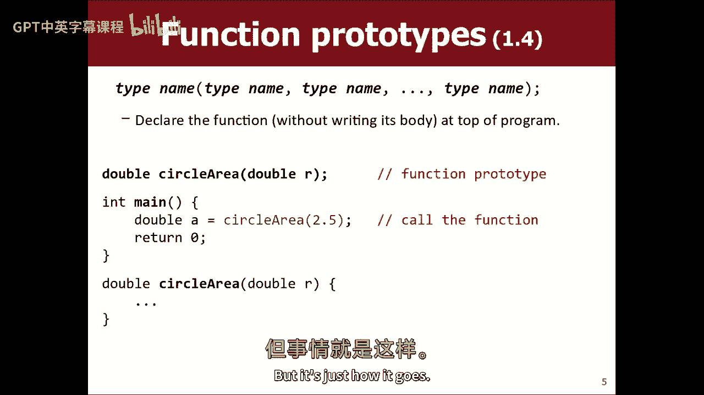

# 【编程抽象方法 cs106x 2017】斯坦福—中英字幕 - P2：Lecture 02 - Functions - 加加zero - BV1By411h75g

好啦，我们何不现在就开始呢？欢迎回来看你，我有点糊涂了，我想我星期一已经说得很清楚了，你也应该离开这里，当你还不能，任何理智的人都没有理由留在这个班，但我很高兴今天有你们这些疯子和我在一起，嗯快速宣布。

星期一我有一件事没有说清楚，你知道我们每周有一次讨论，你下周要去开始，我也没说过你是怎么进入这些的，你怎么报名参加那些，你不能通过正常的在线系统这样做，就像访问或简单的注册，我们有自己的表格。

这将从明天开始在我们的网站上公布，星期四，当它上升的时候我会给你们所有人发邮件，我会在周四到下周一之间在我们班的网页上发布一个公告，你需要进入那个表格，你需要告诉我们什么时候，你可以去部门。

我们会把你分配到，所以事情就是这样发展的，明天就上去了，我现在会给你发一封关于这件事的电子邮件，你什么都不用做，如果你想和某人合作，在这门课的结对作业中，你应该试着和他们进入同一个区。

因为搭档必须在同一个区，所以我们的表格会问你，如果你有朋友，我们会试着把你和你的朋友放在同一个区，好啦，是啊，是啊，所以我想继续上次我们谈论的地方，C加加我没走多远，我今天要努力弥补。

所以C++加上很多语法和Java没有什么不同，我知道这里不是每个人都懂Java，但如果你做了很多，这对你来说就像Java，我想说，如果你仔细寻找差异，我想你可能会注意到，有一个东西说谷歌。

那在Java中叫什么，你知不知道，意思是它和逻辑数据类型完全一样，真假，你可以用它来，if语句或while循环，或者这种东西，他们称之为C++规则，C++通常有较短的名称，Java有很长的名字。

C++加上循环的短名称，如果语句，很多都是完全相同的语法，我是说这不是巧合，爪哇大部分是剽窃的，他们的语言很大程度上建立在C++的基础上，这就是为什么它们是如此相似的循环，如果语句结束，OR等于。

不等于，除以返回参数函数，许多语法通常对您来说应该很熟悉，所以我们开始写简单的程序，我们开始的程序。

让我让我去可爱的创造者一秒钟，所以这是一个典型的程序，你会说，看出去，你好，CS一零六x，然后你会说结束l和l是这条线的结束，这是一个典型的最小c+程序，我们讨论了大部分的作品，这是你的主要功能。

这是一条将输出发送到控制台的语句，罚款，这些陈述我讲了一点，我想再多说一点，所以它们包含的语句很像。

Java或Python中所谓的导入语句，或者其他很多语言，这是当您想要将库连接到您的程序时，嗯，有两种图书馆，有语言库和项目库，语言库就像是C++语言的一部分，如果安装C Plus Plus编译器。

你得到这些库，项目库是我从斯坦福大学给你的，所以我们有一个稍微不同的语法，它告诉编译器在哪里查找它们，它应该在您的项目文件夹中查找吗，或者它应该查看c plus编译器安装文件夹，我尽量把它说清楚。

当我向你展示一些语法或库功能或其他什么时，我会试着向你展示你必须包括的确切库，为了得到这些特征，所以有两种语法，有点奇怪，但这就是它的工作原理，例如，有一个内置的语言库叫做i o stream。

有透视功能的，您必须包括它才能打印到控制台，还有一个来自斯坦福大学的图书馆，叫做G窗口，你必须把它放在引号里，如果要弹出图形窗口，好啦，包括图书馆，在节目的顶部还有另一个声明，也就是说。

使用名称空间STD，名称空间是变量的作用域，哦耶，问题继续，你得先指向目录，所以我们要去工作，问题是，如果是本地图书馆，我必须像斜杠一样写目录吗，不管是什么斜线，嗯一般没有，它将在您的文件目录中查找。

如果它不在同一个目录中，您可以为它指定要查看的其他路径，我们设置我们的项目来查看特定的文件夹层次结构，因此，当您下载要处理的项目时，所有这些都应该为您设置，但如果你从零开始，你可能得告诉它目录在哪里。

对于您拥有的库，所以这个命名空间的想法，名称空间基本上是名称作用域的分离，函数名称，变量名称，类名称，我们在C++语言中有这个概念的原因是因为你知道。

C++有很多简短的标识符，比如see out，你知道的，如果C输出是用来打印东西的，这意味着您不能将变量C命名为，因为这会与，你对同一个名字的使用会有冲突。

所以C++试图通过这些不同的名称空间来解决这个问题，可以在两个不同的名称空间中使用相同的名称，一切都会好的，在这门课上，你不必想太多，您可以使用need空间在程序中编写语句，所以你要把所有的名字。

在那个命名空间中的东西，您希望在您的程序中可以访问它们，例如。

这个名为um see out的标识符是它的全名，其实是性病结肠，冒号c是那个变量的全名，它是一个名为c out的变量，位于STD命名空间中，但如果我们要经常用这个，这真的是一个主题。

如果您说使用名称空间STD，有点像进口，从某种意义上说，我不必写那个命名空间的名称，在那个面前，所以我认为有一件事让学生感到困惑，那就是，为什么我必须说这两个，好像他们在谈论同样的事情。

它们都涉及到把一些外部的东西带到我的程序中，我想说的是这包括，这样我就可以在所有这些使用语句的情况下使用c out，这样我就可以用更短的，我不用写那么多字，所以我们通常会把这两个都写在我们的代码中。

是啊，是啊，这是否意味着一次只能使用一个名称空间，或者你可以有几个空间，然后像这样的线条在顶部，是啊，是啊，您可以使用多个命名空间吗，我想你可以用不止一个，问题是什么，如果两者都有相同的变量。

他们可以冲突，所以这有点复杂，我不想详述它的所有细节，但是是的，我是说你可以做到，事实上，我可以在代码中编写自己的命名空间，你知道我可以做一些，你知道的，命名空间foo，然后我可以说像int x。

然后在缅因州，我可以说foo冒号冒号x，现在这是一个只存在于foo中的x，但如果我只写X，它不会和那个X冲突，现在可以有两个X，所以我的意思是我不想走得太远，使用这些名称空间，但这就像是语言用来允许。

重用函数、变量和事物的名称，而不使它们相互冲突，using名称空间语句只适用于块范围还是望远镜，一旦你在档案里这么说，文件的其余部分现在可以访问该命名空间，由于汇编的工作方式。

有时这意味着其他文件也可以看到命名空间，所以有一个常见的bug发生在你有两个文件的地方，其中一个说使用名称空间，另一个没有含蓄地说，希望使用命名空间，因为他们都在同一个项目里，它的工作原理。

但是如果你把一个文件和另一个分开，突然相同的程序不再编译了，所以有些规则有点奇怪，嗯，它可能是，事实上，有C++程序员有一个规则，他们从不写使用语句，他们总是把所有东西的全名都写下来。

但我只是我不能让自己这么做，所以我不是，我不是这样滚的，但不管你知道什么，如果我把使用语句拿出来，我再编译一次，它其实，我不知道你不能读这篇课文，但它说看看它是如何不在这个范围内声明的。

所以我可以通过说性病出来来恢复工作，然后它就起作用了，我也有性病，所以我可以让他们有全名，相比之下，如果我拿走了包括，但我的使用声明也不起作用，因为就像现在，它甚至没有把我和大海图书馆联系起来。

不管我叫它什么，它不在那里，所以这有点像，这两件事经常同时发生，好啦，所以这些是进口和使用，是啊，是啊，只有在有两种可能的情况下，我们才不必使用名称空间，两人都是对的，你不必写性病前缀。

如果您写了一个using语句，如果您没有使用语句，你一定要写得像，如果我删除第7行，我无法看到外面，它不会明白的，只有写这个，它允许我在没有前缀的情况下提到性病的成员吗，我将始终使用名称空间STD。

我将包括图书馆，所以我不打算用冒号冒号语法。

但我只是想让你知道，它在那里，所以我们讨论了，查看打印语句，我不打算呆在这张幻灯片上，因为我们已经谈过了，所以一个简单的例子，就像你可能想写的一个小程序，你知道的，问用户谁得了多少币。

然后打印谁赢了足球赛，或者类似的东西对吧，所以这个蓝色的部分就像，我提示用户键入一个值，类似于控制台的输入，所以如果你胡乱猜测，如果我使用C输出，你认为我用什么来输入，你们前任真聪明，是啊，是啊。

我是说这是对的，有一个C，但我有个坏消息要告诉你，CN烂透了，这和看到外面没有什么不同，我是说你看，你要这么做，你说再见你说，请告诉我你的年龄，然后你说看，然后你告诉它什么变量，你想把它储存在。

它会从用户那里读取p，并把它放在那个变量中，有趣的语法，嗯，很多学生在坐网上混了，但就像箭一样，你知道的，进入那个变量，我不知道，我不知道你想用什么记忆法，但这很有效，你叫他们输入年龄。

它等着他们输入年龄，它将其存储在那个变量中，然后打印值，它打印出他们输入的内容，所以它说气馁，我还没解释为什么，是这样的，但这个有用这个可能有用，是啊，是啊，你颠倒操作员的顺序和方向，所以颠倒一下。

你能变老吗，然后是小于小于，啊，我看得很像，也许把这两条线变成一条线，你看到了吗？没有，我稍后会讨论这个问题，在今天的讲座中，你必须声明一个变量，然后你必须把c写进去，在这个变量上有一个箭头。

你不能喜欢，在同一上声明这一点，同一行上的这个变量，你想储存在里面，这和，所谓的参考变量，我一两分钟后给你看，但这是一种方式，你必须说出来，如果你想做C N小发明，嗯是的，可以继续看看，处理它。

如果你传错了，它是做什么的，如果你打错了，一种价值，就像你不输入你的年龄，你输入马蒂什么的，它不是int，它是做什么的，是啊，是啊，这也是为什么不鼓励这样做的部分原因，所以让我，呃，回答这个问题。

尝试正确，所以我们应该说他们得对了多少分，所以这并不难。

所以就像，你知道的，看出去，站第三分得分问号，我不会结束我，因为我希望光标与，所以我会像在斯坦福一样，逗号卡尔，然后在斯坦福看到对吧，然后也许我会做，然后我想做什么就做什么，如果斯坦福比卡尔大。

看到了耶，我不需要其他人，因为我们永远达不到那个案子，我不知道，我们不浪费任何时间在一个零六X，我们不需要写别的，但就像这样，我运行程序，哦对不起，其实我想给你看点东西，所以如果你有锐利的眼睛。

我运行了程序然后在这个小盒子里，上面说斯坦福的分数，因为这是默认的，像C Plus的控制台，这并不奏效，而且不是很灵活，所以我们实际上有一个库，我们链接到，在我们所有的项目中，你会想要使用。

我们说包括控制台点H，这是一个很酷的图书馆，只是把它包括在内，这就是你现在要做的，你运行相同的程序，控制台弹出作为自己的窗口，那是斯坦福的小发明，这就是为什么它有引号，而不是上面的括号，所以无论如何。

那是斯坦福的事，但我们要利用这一点，上面说斯坦福的分数，所以我打字，你知道的，15分，卡尔得了7分什么的，耶，我们赢了所以现在，我来回答他的问题，斯坦福积分收获满分，似乎接受了卡尔分数，我不知道十个。

你只要把a作为第一个输入，然后这个，是啊，是啊，所以实际上，我试着打字，它甚至不让我给卡尔打分数，因为在幕后，它读到了斯坦福大学的分数，和卡尔的分数一样多，你说的是什么？嗯，让我们一探究竟。

让我们一探究竟，到卡尔，你知道的，我只是在重复他们打的内容，那是很简单的事，所以让我打很多点，比分是0比3 2，我不认为的是，所以他们的跑位不是很好来吧，呃，你什么意思，所以它是，它是。

它给了我这些奇怪的价值观，基本上长话短说，如果你把错误的值放进去，它无法转换，因此它不会在这些变量中存储任何值，所以这些语句失败了，没有分配任何东西，所以这就提出了一个有趣的问题，嗯，这些有什么价值。

如果你不给他们任何价值，我给你看看这个，什么，如果我把这个评论出来，所以我从来没有读过任何东西，所以让我们看看我们得到了什么，比分是0比1，等一下，什么，什么什么，呃，让我们，我们再试一次，嗯。

比分是0比1，嗯，基本上，如果你不在C中初始化一个变量，另外，它有一个随机的垃圾值，所以我们从不储存任何东西，我们只是打印，我们得到各种各样的东西出现在屏幕上，所以不管怎样，听着，这个节目很好。

但它处理得不太好，用户正确键入虚假值的情况，所以让我给你看一些更好的东西。

哦耶，问题，在你知道之前就去吧，在任何函数中定义变量和全局，它有默认值，差不多是零，是吗，是啊，是啊，问题就像在某些语言或上下文中，变量将获得类似于默认值的值，就像在一些语言中的零。

比如Java和其他语言，这是真的，这是真的原因是因为它在C中不是真的，加号加号，当他们制作Java时，这是如此令人沮丧，他们就像啊，使所有变量为零，求求你了，所以这种语言没有，你说得很对，在Java中。

如果你不初始化东西，它们有时会得到默认值，他们会得到零什么的或者空，这种东西C++，当你做一个变量，我想你们可能还记得变量就像一小块记忆，某处，这个想法就像在你的程序出现之前，在那段记忆中还有别的东西。

所以不管那里有什么，我们只是把它当作一个int，这就是你的价值，如果你不给它一个值，它只是用它作为值，所以我的意思是无论如何，C++不会为您初始化东西，因此它们包含随机垃圾。

有时如果你重新运行相同的程序，你得到同样的随机垃圾，因为您的程序碰巧加载到与以前相同的内存地址中，但是是的，未初始化的变量是坏的，反正，cn有很多问题，哦耶，问题继续，我想如果你为整数写字符串。

然后取第一个字符并使用它，哦，好好利用ASCII值，您可能会想到C语言中的C语言，有一些字符到整数的转换，今天晚些时候我要谈谈弦，我也许能解决这个问题，嗯，我是说，长话短说，如果你这样做。

他们不打在里面，只是中止并且不给，这就是为什么，有一些背景，在那里会发生一些奇怪的事情，就像你在问，我们可能会稍微讨论一下，但我只想说总结是，我认为你不应该这样直接用cn，我觉得你应该做的是。

我们在斯坦福有个图书馆，称为简单，伊诺，有这些功能，你可以像get整数一样调用，得到实数，或者像个替身，得到一条线，就像一根弦，不同的人得到一个恶霸，我说是还是不是问题，它将重新提示，直到它得到一个值。

那是正确的类型。

然后它会把它还给你，所以如果你想让这个总是得到有效的分数。

与其这么说，你实际上把这两条线都替换掉，提示消息的打印和答案的阅读是，你说，斯坦福得分，实际上说国际斯坦福，然后我会说int cal等于，获取整数，卡尔得分很低，然后耶，所以实际上要做到这一点。

我得把这个舔狗，IO点H所以现在我编译，我跑步，我得了多少分，那是个非法整数，好啦，八十七卡怎么样，你知道他们有保险什么的，好啦，所以它不断地提示，如果需要，所以说，那是我的建议，现在呢。

我会说有些学生不喜欢用东西，那不是语言的一部分，这是斯坦福的事，如果你到了现实世界，和新的C+Plus，你没有这个功能，所以如果有人说我不想那么做，我想做真正的事情，那很棒，但我的意思是。

如果要读取整数并重新提示，你基本上编写了我们为此编写的确切代码，这不是很有趣的代码，所以如果你想看看这东西是怎么工作的，去吧，没那么有趣，我不认为这是我想在这门课上关注的，我只想继续讨论更有趣的问题。

所以是的，问题是有一份斯坦福大学的名单吗，我们可以在线访问的本地目录。

是的，所以我有一个幻灯片，让我看看这是不是在下一张幻灯片上，所以在班级网页和顶部的链接栏上，有一个链接说斯坦福图书馆，我无法加载Web，但不知何故，我的互联网今天坏了，所以你必须，我要跳一段。

这里的互联网是什么样子的，所以嗯，去班级网站，顶部有一个链接，上面写着斯坦福图书馆，它有一个列表，列出了我们所有不同的功能和所有不同的库，如果你想看的话，这是同一个文档的直接链接，所以如果你想看的话。

都在那里。

好啦，是啊，是啊，所以我想继续前进，上一节课的幻灯片讲完了。

看看我落后了多远，但是哦，好吧。

所以我想谈几个新的话题，我今天想谈谈函数和字符串，我想你们可能都已经知道函数和字符串了，用你自己喜欢的语言，所以我会试着把注意力集中在，C++中的这些东西有什么不同，如果您不知道什么是函数或方法。

也不知道什么是字符串，那么这些都是话题，我希望从你那里得到必要的知识，所以你得去看看，如果你想读课本的第二章和第三章，好啦，所以函数，你们知道函数和方法非常有用，对呀。

我的意思是你可以把一组语句放到一个函数中，然后调用函数，它运行的语句很好，你可以把参数，你可以退货，C++中的语法或函数与C++中的语法非常相似，用另一种语言，就像Java中的Java。

可能会有一些其他的东西在左边这里右边，就像Java中可能存在的东西，公私静态，喜欢修饰语，像那样的词，如果是Python或其他语言，你可能会说像def，或者在这里工作，或者类似的东西，但是是的。

在Java中，你在这里放了更多的修饰符，但是你知道，如果你把这些剥掉，在这个上下文中，C++之后的语法看起来非常相似，没有一些公共和私人的概念，完全一样，所以你可以写一个函数，然后你的main函数。

所以这很简单，你们知道调用函数，其中一点o向上变成r，它做计算，它在这里返回结果的来源，因此，作为回报，预告片的行为方式与您对Java的期望相同，暂时，在C加+中，在程序中调用函数后，是否允许定义函数。

是啊，是啊，我会告诉你，你问的是定义函数的顺序，在顺序上更重要，C++比Java，所以我得给你看我的下一张幻灯片，我想我们会解决这个问题，让我给我点时间，我给你看，我们知道平方数，你能平方一个数字吗。

啊，有一个平方函数，有一个，有一个指数，我只是还没给你看，所以说，我不想喜欢惊喜的功能，我从来没有提到过，当然就像，如果你想做r乘以r的次方，有一个幂函数，因为这样你就可以通过。

你能把函数作为参数传递吗，是啊，是啊，这是很酷的东西，那个Java没有那个，C++确实有，有函数指针，我会谈谈他们，我今天不打算谈他们，虽然，因为那是在更远的地方，但是是的，那是一个强大的东西。

你说的地方，这里有一个函数，我想让你稍后帮我调用这个函数，是的，是的，回电是一种术语，当您定义一个类或强进程时，可以是私有的或公共的，是啊，是啊，我要进去了，我觉得，第三或四周，我要和你们谈谈类和对象。

当你做一个类，您可以用C++创建类，当你做的时候，你可以把事情公之于众，你可以把事情保密，但在某种程度上，我们称之为自由浮动的功能上下文，像这样，我们真的没有私人或公共的概念，它们只是功能。

所以我们在这里不用这些词，但我们会在其他时候用这些词，是啊，是啊，所以要不要用那个，你传递的值是1而不是一个零，它仍然被视为魔鬼或被视为，是啊，是啊，我想很多语言在这里都有非常相似的类型转换规则。

就像如果你只说一个int，但它知道如何自动将其转换为一个点零的倍数，所以有些语言超级挑剔，他们会给你一个错误，这更像Java或Python，它会帮你变成双倍，所以一切都会好的，所以这是一个函数。

这应该会很冷，挺好挺好，好像这并不让你惊讶，我没有想太多，嗯，让我们进入不同的东西，所以C++允许你做所谓的默认值，对于参数，当您声明函数时，你可以在等号后面加上一个值，这将意味着，当他们调用函数时。

然后给出对函数的调用，如果他们不提供价值，它将使用您的默认值，有点酷，所以这是一个愚蠢的例子，但这就像印刷品一样，对齐，多少份，什么字好，不管你告诉我多少份，我要印那个字，所以如果你说打印第七行，问号。

它会打印这个，如果你说打印第五行，但你没说是什么角色，它会印星星，如果你什么都不说，它会假装星星，嗯，这个语法有一点微妙之处，就像你不允许有一些带有默认值的参数，然后一些没有默认值的。

然后一些有默认值的人，比如你不能这样做，因为它很难找出哪个值映射，到哪个参数，就像所有默认的，有这些相等的，必须位于函数参数列表的末尾，但这是c的一个可爱的小特性，再加上，再加上，Java没有这个。

布彻，如果你有两个，默认情况下，是否有一种方法可以省略第一个，但仍然给出一个值，是啊，是啊，不幸的是没有，如果这两个都是默认的，没有办法通过这个而不通过那个，你只要写一个十，基本上，所以我的意思是。

这是其中的一件事，就像有些语言有办法做到这一点，但是c+没有，因为参数值仅由它们的顺序指示，所以它无法消除这些，还有别的问题吗，或者同样的问题，好啦，只是为了检查调用参数是否应该在，是啊，是啊。

就像如果你有八个参数，你想要其中的两三个是默认的，你把这两三个当成最后一个，两三个，好啦，现在有点酷了，几分钟前，您有一个关于声明函数的顺序的问题，所以是的，这是个问题，这是我的第一次展览。

在控方的案件中，c+很烂，你知道我几乎从不发誓，所以我不会这么说，如果你把函数放在缅因州之后，愚蠢的编译器找不到函数，它实际上不会编译，它会说这里没有叫圆的函数，就在那儿，但我找不到，所以嗯。

这真的很糟糕，我只是不敢相信他们搞砸了，这太蠢了，但一切都得先声明或定义，它用于垂直遍历代码，所以你，如果你用Java或Python什么的。

事实并非如此，C++就是这种情况，就像，例如，在这里，就像，我只是要把我所有的例子都转储到这里的同一个文件中，基本上，但是你知道，如果我有某种函数叫做，你知道的，虚空之歌，它只是打印一首歌的歌词。

你知道的，天翻地覆，我不打算打这首歌，我保证，所以无论我打印一些歌词，如果我上来，我说这首歌看起来很好，但我编译了它，它说你不能读它，但它说宋不在这个范围内声明，哦，天哪，所以你可以做的一件事是。

你可以把这个剪下来贴起来，上面的main使这个函数是第一个，但我不喜欢那样，因为我喜欢先吃主食，我喜欢选择自己的顺序来申报事情，我真的很喜欢打开文件看看主要的。

所以没关系，你能做到的，但你只需要做一个小小的改变，也就是说，你必须把一个叫做函数原型的东西放在上面的文件中，原型是函数的标题，在这里写出名称、参数和返回类型，但你不能把大括号或身体，你只要加一个分号。

这就像是给编译器的借条，我保证以后我会写这个函数，这允许编译器向前移动，如果我看到你有一个圆的面积，在这里保证，那么如果你叫圆面积，我相信你，最终，啊，有一个圆形区域，好吧，酷，然后代码是OK的。

我真不敢相信你要这么做，这太蠢了，但事情就是这样。

就像这里一样，如果我想调用这首歌的函数，我可以上来，我的意思是，我总是做的是，我只是在卷曲之前抓住这个部分，然后我只说分号，现在事情汇编，现在它运行，它打印了歌曲的开头，可能是的。

问题是我有一大堆函数原型，你能把它们放在另一个文件里吗，然后向右，所以有些人做的就是，如果它们有一大堆功能，接下来发生的是，您的文件顶部以，就像一大堆这样的原型，看起来有点丑，你知道不是同一个。

但许多不同的开始变得丑陋，所以有时候你开始把东西分成多个文件，你把所有的原型放在一个文件里，该文件通常以点H扩展名结尾，这些是函数的标题，这是它的来源，我今天不打算那么做，但那是你。

如果你写一个更大的程序，你肯定会这么做，把它分开，所以当你把不同的文件，如果连顶点都是这样，为什么不直接像导入函数一样，啊，原型有什么意义，就像，如果您有两个文件，并且导入另一个文件。

我想给你一个挥手的解释，就像，基本上发生的是，如果喜欢这个文件导入那个文件，它实际上复制了所有函数的第二个副本，如，包括字面上的复制粘贴，它从字面上进入这个文件，复制所有的行并粘贴在那里。

所以最终发生的是，如果你有两个文件，第一个包括第二个，然后将它们绑定到一个可执行文件中，你实际上有第二份文件的两份副本，这不起作用，因为他们彼此冲突，只是很奇怪，就像这种愚蠢的东西。

C++完成二进制数据的编译和链接，就像我只是我讨厌陷入杂草，这是你在七个中的一个做得更多的事情，挺有意思的，但这大多只是一种痛苦，因为您的程序没有正确构建，或者别的什么，所以我们最终做的是。

我们用这些原型，所以每个人都可以调用函数，然后其中一个文件写入函数的定义，当编译器将所有这些链接在一起时，一切都解决了，所以是的，问题，如何在，哦，可选的，如果您有可选参数，就像你知道就像。

也许你说喜欢，像这样的国际时代，对于int i等于零，您想打印多少次，我比i加+的次数少，所以我会打印这首歌，不管你说多少次，然后你知道你可以说我想让这首歌出现十次对。

所以在这里你有时会说这样它们就会互相匹配，但是如何执行默认参数，如果你把原型和身体分开，你只在原型中设置默认值，你就是这么做的，然后这里，如果我说，无参数歌曲，它将印刷这首歌的五份副本，一个原型。

你知道正常的函数可以在这两种情况下定义为默认，如果你有一个原型和一个身体，我可以把等于5的数字放在这里吗，我相信它有一个错误，如果您重述，你也会认为你可以在这里说等于5，但我想它会生气，是啊，是啊。

它说已经给出了一个默认参数，什么的，是啊，是啊，它不喜欢那样，所以我不知道，我是说你看，这是一种愚蠢的语言，我是说，对不起，我讨厌C加+，我们会活下来的，我们要用它，教这门课不会是我的第一选择。

但没人问我，所以显然我得教你指点什么的，所以我得教你C++，但我不喜欢C加，我不用c加，赚大钱的人，不需要知道C加加，但它是一辆车，我们要学一些很酷的东西，刚好是c+。

好啦，所以这是一个原型，这里只是，这是一种随机幻灯片，就像有一个数学库，里面有一堆有用的数学函数，你问我如何平方一个数字，而且是的，你可以，如果算上C数学，你可以做力量，不管这个指数。

所以所有这些函数都取这些参数，他们返回结果，你知道他们大多数人都把双倍作为他们的参数，但你可以通过它转换的瞬间，所以我不会在这上面花任何时间，因为无论你学什么语言，您可能已经在Java中做过类似的事情。

我想你说数学点战俘，数学点腹肌，就像，基本上是一样的想法，你只是不说数学点，你只要说腹肌，是呀，让我们说那些事情，是呀，问得好，你问了命名空间，其实呢，那是我的幻灯片并不总是很清楚的一个地方。

所有这些函数都在std命名空间中，就像C调一样，如果我没说用，我不得不说性病结肠腹肌，性病结肠，怎么会呢，我已经习惯了使用性病命名空间，因为里面有很多东西，来自标准库，就像。

基本上他们所有的东西都在里面，就像我一样，你知道的，所有这些东西开始给你错误，如果你把这句话去掉，所以好吧，哦耶，问题是的，去吧，所以这是否意味着如果你有，假设我有命名空间必须在我的一个文件中。

我进口它，这是否意味着它与所有其他性病名称空间合并，我不知道我是否完全理解你的问题，我是说使用名称空间不像复制粘贴，就像include是复制粘贴一样，使用名称空间更像是一组快捷方式，它明白还是不明白。

如果您的一个文件说它使用STD命名空间，另一个有，它们不会以不好的方式相互复制和碰撞，这只是意味着这两个文件都可以使用那些较短的名称，引用那些变量和函数，如果一个文件使用了性病而另一个没有。

另一个可能不会用那些短名字，所以我不知道我是否正确地回答了你的问题，我是不是有点没听懂你的意思，你应该多拍马屁，像你聪明的回答一样，不是我问题的答案，不不不帮帮我，但告诉我伙计们。

所以你是说我会你包括蒸汽，这些都还在性病名字空间里，所以这是不是意味着像，也像一个IO流，这些也是肯定的，那也是，如果这些是在不同的文件中定义的，那是不是意味着他们都是。

它们都具有所有这些部门的名称空间std，右右，如果你打开这些的源代码，它们从一行开始，上面写着名称空间STD，卷曲制动器，然后这些函数的所有实现，然后最后一个卷曲，两个文件都有。

现在我想我知道你在说什么了，两个不同的文件都有名称相同的命名空间块是可能的，它会把它们结合在一起，又不是说，其中一个是命名空间，另一个不是，或者它们碰撞，它们都成为其中的一部分，谢谢夸奖。

我永远不会离开你，所以在这种情况下，你只需要解释两个独立的库，宣布你的书将进入同样的空间，C Plus如何解决命名空间冲突，C Plus如何解决名称空间之间的冲突，我是说我要告诉你。

我真的不记得所有的规则，但这也应该让你感到安慰，我不该安慰你，我不称职，但这是什么，我从来没有关心过，这就是重点，你可能也不必在乎，东西很少碰撞，因为，就像和性病名字冲突的人，他们就像，哦，天哪。

每个人都使用命名空间STD，所以我不想和它发生冲突，所以他们取了一个不同的名字，那么它实际上是做什么的呢，我忘了，我想如果它模棱两可，这是个错误，但有些情况下他们中的一个赢了，所以它用那个，坦率地说。

规则有点疯狂，就像我有一次，我就像啊，去他的，我不知道，有时这取决于什么顺序，你说你在利用他们，有时这取决于什么文件链接到什么其他文件取决于符号是什么，看情况，如果它能消除他们之间的歧义，有点乱。

所以有些人真的，你知道的，把这些都弄到杂草里去，我不觉得把所有的东西都背下来很有趣，所以如果我有问题，我只是诚实地查了一下，所以我不，我其实不是这样的，如果这里的所有这些函数都在STD命名空间中。

那为什么还要用现场，如果你说使用命名空间，那并不意味着，我想将该名称空间的所有内容带入我的程序，意思是如果我碰巧提到一个名字，编译器在我的文件中找不到那个名字，它还应该检查STD名称空间。

看看是否有那个东西，但如果我不包括CMAT，这些函数没有附加到我的代码中，所以它不会在那里找到他们，所以这有点微妙，但这就是它的工作原理，你申报一个，你们喜欢命名空间，你知道吗，我从来没有见过他。

不是我们所有人都在那里，我从没见过这么专业的人，我喜欢它，你们喜欢把一切都分开，我打赌你们宿舍里都有独立的冰箱，这是我的命名空间，别碰我的东西，对不起，呃，所以我想你是在问，您可以有多个命名空间吗。

还是全部放在一个全局命名空间中，我是说，如果你不申报，您是全局命名空间的一部分，这就是我们一直在写的所有程序都是全球性的，如果您确实有一个带有卷曲的命名空间块，然后该代码将位于该名称空间中的单个文件中。

您可以在这个命名空间中拥有一个部分，在命名空间中的一部分，其中一部分是全球性的，你可以混合搭配所有这些东西，我觉得总的来说，我不打算问，你们写了很多命名空间的东西，在本课程中。

您必须对名称空间有一点流利的理解，包括你将要使用的其他地方的东西，但是编写自己的命名空间会更，如果你在一个更大的项目上工作，你会做的事情，你有很多文件，很多人你会想把事情分开，不管怎样。

我想谈谈值和引用语义，你们知道这个，但你可能不知道它的名字，值语义意味着当您传递参数时，它复制值，所以如果我有一个交换函数，你给我A和B，我就换了它们的值，我移动结束，我说的值就是这些值。

然后我把温度放回B，所以我交换了这两个值，对呀，那么下面我可以有两个，我也在他们身上，然后我把它们打印出来，它没有交换，你看它还是一样的，我知道你总是看不到幻灯片的底部，但基本上没有，它没有做到这一点。

交换在缅因州不起作用，原因是，我想你们应该知道当我传递x和y作为参数时，它不喜欢将这个函数链接到我的变量，为什么它只是获取这些变量的值，它把这些值放入这些，然后它使用这些值运行函数。

这就是价值语义学的含义，你已经做了一千次了，认为这是理所当然的，当你像这样传递参数时，它总是这样工作的吗，什么时候不是这样，是啊，是啊，对于多种语言中的对象，如果将对象作为参数传递。

则对象具有不同的行为，就像数组列表之类的，如果修改函数中的列表，您将在主右看到更改，所以这很有趣，那是另一种叫做引用语义的东西，所以在很多语言中，当涉及到什么样的变量时，或者是什么样的参数。

我们会用什么样的语义学，这是由您使用的数据类型隐式规定的，如果您使用像int这样的原始值，您将使用此值复制语义，如果使用复杂的对象或数组，它将转而使用这个引用语义。

所以它是由语言和类型系统C Plus为您决定的，你想做什么就做什么，所以如果你想传递一个int，使用这些对象样式引用语义，您可以，这样做的方法是在它后面加上一个符号，这意味着我想要一个int的引用。

如果你看过，这有点像指针，但不完全是，所以这个小变化会让它，如果你把x和y传递给这个函数，它将把这个变量a链接到这个变量x，他们将是彼此的化名，如果你换一个，它会改变另一个，同样的y变成了b所以在这里。

如果我在缅因州交换这些，它真的会交换他们，我会看到区别，那有点酷，在Java中你不能这么做，人们一定想知道Java是在C Plus之后出现的，Java的设计者肯定知道这个美丽的特性，但他们选择不包括它。

嗯哼，我想知道这意味着什么，我不知道，嗯，好吧，我告诉你，我来回答我愚蠢的问题，好极了，这是一件很酷的事情，这是一个强大的东西，但它可以被滥用，我告诉你，如果你看一个C++代码，就像，想象一下你只有主。

这东西在其他文件里，所以它不在你的屏幕上，你只有我，你也可以看到这个叫做x逗号y，我是说，也许你可以推断出一些东西，因为这叫交换什么的，但就像你不知道，不管是引用还是传递的值，所以现在你不确定。

如果这个函数会扰乱变量的值，因此，很难对C++代码进行推理，它能做什么，当你调试时它不能做什么，你需要做的一个关键的事情是限制程序部分的表面，可能是导致窃听器的原因，你知道我知道这不是问题所在。

我知道这不是问题所在，可能在这里，在某些地方，像这样谈论C++代码更难，因为你有所有这些，比如引用周围漂浮的东西，这些东西可能会改变，这很难，是啊，是啊，问题，在Ruby有少量工作经验。

他们在方法上有感叹号，这些方法实际上可以修改值模式，C++有任何类型的命名约定，是啊，是啊，这是个好问题，就像你在红宝石里说的，你有突变的感叹号，用于修改，它帮助你直观地看到你是否可以改变一些东西。

是啊，是啊，嗯，C加+并没有真正的，呃，我是说，这是一种古老的语言，当他们成功的时候，他们基本上不认为，所以如果你想交流，那是你喜欢的，你有时可以在这里加一个小注释，说突变或引用。

或者在这里你可以把评论之类的东西，但是是的，这在某种程度上取决于开发人员是否有选择地指示类似的内容，所以我的意思是，不幸的是，否，语言没有这些东西，坦率地说，像Ruby这样的语言，做你所描述的那些事情。

他们这样做是因为他们从中吸取教训，基本上和这个不匹配，是啊，是啊，引用和引用有什么区别，魔法和指针，引用和指针有什么区别，所以我的意思是，我不认为这里有人知道指针是什么，但是，对于你们中的一些人来说。

做指针基本上和这个想法是一样的，但是指针需要对语法进行更多更改，这是对程序的最小更改，然后它做我想要的--一个指针，我得用星号，我必须在更多的地方使用星号来获得正确的行为，指针的安全措施也较少。

而且更有可能导致撞车，引用是相当简单和有界的，更容易正确，所以这是指针概念的演变，它的目的是取代许多，与这些指针特性一起使用的C程序，就像我会在这门课上和你们谈论指针一样，但这超出了好的范围。

所以这些是引用语义，我想提到的是，任何类型的数据都可以通过这种方式传递，在双A弦中，任何事情，所以这有点取决于程序员，值是否作为副本传递，或者它是否作为引用传递，有点酷，这里有一个例子，很多时候。

引用参数被用于我们所说的输出参数，所以我不知道，如果你听说过这个XKCD漫画，有一个，有一个漫画说，嗯，什么年龄段的人，好吧，在它变得令人毛骨悚然之前约会，因为你在这个时代太与众不同了，别担心。

你们远远超出了我的范围，我们很酷，但这里有一个公式，比如他们的年龄只有你的一半再加上七岁，没关系的，或者他们老了，你知道你的年龄减去7乘以2，没关系的，我的意思是，只是个玩笑，但如果你想打个招呼。

我这么老了，最低和最高年龄是多少，我可以和他们约会的人，也不会令人毛骨悚然，这就像是我想要的一个函数，我想通过年龄，我想把这两样东西还给你，C++和Java，很多语言就是没有办法返回两个东西。

但你可以做的是，你可以有两个参考参数来存储东西，这提供了两个输出，所以这有时被称为输出参数，输出参考参数，所以实际上，如果你看看主，我宣布年轻人和老年人，四岁八岁的第九个呼叫年龄，实际上，如果你注意到。

我甚至没有得到任何价值，我甚至不初始化它们，因为你是怎么被安排在这里的，当敏指年轻时，当Max提到老的时候，它设定了它们的价值，所以我不必说等于零，或者我只是不离开，我不把任何价值放在那里。

所以这是一个通过使用引用参数返回两个东西的例子，是的，这是我提到的输出的主题，Gra，啊，是啊，是啊，把这些放在最后，或者别的什么，嗯，我不知道松散地，我是说，也许我会说函数和参数有很多不同的情况。

我不想给你的东西，关于这一点的过于严格的规定，我要说的话，虽然你不想把一切都作为参考，就像我可以在与号时代做这个一样，但没必要那样，因为我不喜欢，我不想修改后面的仪表，所以如果你不需要它作为参考。

你不应该把它作为参考，你应该少用这个，当它是有帮助的，而不仅仅是到处都是，你不把它作为参考，因为它就像复制一样，啊，啊，啊，你在问我是否通过一个物体，但它不是对对象的引用，是啊，是啊。

我以后会教你关于物体的知识，但是有一些有趣的规则，比如如果你有一个物体，就像一个学生，一个银行账户，一个数组，或者其他什么，把它作为一个没有与号的参数传递，它会完整地复制这件事，这很奇怪。

不是Java会这么做的，我现在不打算详细说明这一点，但是是的，我是说这是我们想解决的问题，我们想很快再来，不过，请便，跟进，是啊，是啊，所以它真的更像密码引用，哦，你说了那个词，你说效率，什么更有效率。

嗯是的，所以我只是在戏弄你，因为很多X程序员关心效率，什么使用更多的内存，什么使用更多的运行时，我想要一个快速精益的程序，你知道，我也很在乎，但我更关心的是大规模的而不是小规模的。

所以就像有些人走得很好，我为什么不把这个年龄作为参考呢，因为那样我就不用抄了，所以我节省了大约四个字节的内存，哈哈哈哈，做这种事的人，是那些从地上捡起便士的白痴，没关系没关系，你知道的，你不需要这个。

省了这么少的钱，对嗯，3。我认为没有必要为了提高效率而将其一笔带过，现在你说的不是那个，你说的就像一个大物体，如果我把它作为参考，我不必抄袭这个更有效的大东西，尤其是如果你是一个充满数据的巨大阵列。

我不想把整件事都抄好，我们以后再说，但是是的，一件大事是，你想通过引用传递，有时为了效率，但不是很少之类的，只是澄清一下，如果不想将数据类型像对象一样放置，你知不知道，C加加。

当它复制并为非原语类型做一个深度时，就像一个物体，就像，说一个物体，那是它的另一个物体，是啊，是啊，我想回来，我是说我会到达那里，我想我们有点领先了，就像引用其他对象的对象一样，如果你复印。

你可以做深度复制，或者你可以做一些肤浅的副本，我认为默认情况下，东西是肤浅的复制，所以如果有两件事指向某个地方，他们指向同一件事，或者其他任何东西，除了可能做更深的副本，我来解决。

我今天不想在那个方向走得太远，反正，好啦，所以我总结一下，这里是关于参数的，你可以退货不止一件事，您可以避免制作对象的笨重副本，但这使得对这个代码的推理变得更加困难，如果我通过ABC，它会改变一个。

B和c，它们是参考文献吗，它们是价值观吗，我不知道，我得去看看foo函数才能弄清楚，引用可以更慢，不是暗示，但在某些情况下，它们可能会更慢，因为你必须设置这些记忆指针之类的东西，不能传递文字值作为引用。

你必须传递对变量的引用，关键是，你指的是一个记忆位置，你指的是一个变量，所以如果你在这里说三十九，如果那是个参考参数，它不会编译，所以在前面的例子中，你呀，对所以实际上，如果我改变这个来得到参考年龄。

我就过不了四八，在我这个年纪，等于48，然后过了我的年龄，因为你指的是一个int变量，不仅仅是字面上的值，一种微妙的区别，但是是的，好啦，所以我还有几分钟，我只想利用我在这里的所有时间。

关于函数的一件事，你知道我没有写任何非常大的函数或非常有趣的函数，在课堂上和你一起生活，但是当你写一个大程序，你最后把它分开了，把它分解成许多功能，我想说总的来说你想让缅因州推动这个项目。

Maine调用了大多数其他函数来完成这项工作，现在呢，有时这个函数调用方法，但有时它会叫另一个，所以我不是说刻薄，所有的召唤，但意味着管理事情，一种常见的风格，我看到学生们这么做，我想我想劝阻。

main调用第一个函数，然后第一个函数调用第二个函数，然后第三个函数调用第四个函数，等等，主线就像一条线开始，然后我们再也不回来了，我把这叫做锁链，而且风格不好，因为它把这些结合在一起。

我不能把这些单独处理，我不能只调用方法二而不把我的四和它一起调用，所以还是让我来管理比较好，我后面有一些例子，在幻灯片中，我可能不会够到，不过，好吧，所以等等，让我们做最后一件事，因为我没时间了。

我将在星期五演奏弦乐，但是让我们来谈谈这个例子，想象我想要一个二次方程求解器，你知道二次方程，x的平方加上8 x的平方加上bx加上c等于零，你想找到它的根源，你用这个二次公式，有两个根。

一个是这里加号一个是这里减号，你们知道这些东西，所以我想把我正在解的二次方程，我想把这些根拔出来，所以如果这是等式，我现在想离开这两条路线，不是每个二次方程都有两个实根，但也许现在，让我们忽略它。

让我们假装我们在和这样做的人打交道，我可以把这段代码写成C++，但我想更多地谈谈功能的设计，函数的标题应该是什么，参数应该是什么，回报值应该是什么，也许是我没叫过的穿黄衬衫的人，是啊，是啊，你说呢。

应该接受数字，作为一种手段，系数，是啊，是啊，A、B、C，好啦，因为我们返回两个不同的值，我们也许应该做那些，作为，好的很好，所以这些a和c应该是值或引用，这些都是价值，回答双倍，我们不修改它。

我们只需要他们的价值观，然后这两个根就是你，你再说一遍出去，这些是对我们将存储为退货的数字的引用，基本上是对的，那么函数的返回类型应该是什么，我想是虚空，我们不喜欢回来，从字面上看，归还任何东西。

我们是输出参数，把这两样东西还对了，是啊，是啊，难道不清楚喜欢，哦，当然，当然，另一个设计是返回列表，根的数组，所以我们有两个元素或其他什么，这也很好，我只是在抄写，因为我还没教你这个，也没教你加薪。

但如果我知道加薪，那将是另一个有效的解决方案，我认为你刚才说的是一个很好的解决方案，以a b和c为正则值参数，把这些作为参考参数，把这些填了，这种结果会被发回给，所以这是最后一个问题，然后我们就回家。

是啊，是啊，现在，我们假设二次入侵有两个不同的根，所以如果我们考虑的是一个一般的亚得里亚海方程，我们能不能回到一个时代，回到真正的根的数量上，是啊嗯，如果你想处理没有两个真正根的。

我相信如果你看这里是一个歧视者，确定这个D，我想他的信号是零负正会告诉你有多少根，所以我赌了一把，啊，无系统问题，我在这个例子中提到了这一点，但这就是解决办法，好啦，我要就此打住。

但如果你是一个热切的海狸，你想向前看，我发布了一个早期链接到我们家庭作业的一部分，如果你想看，但我周五会正式布置家庭作业，所以我会看到你们。

