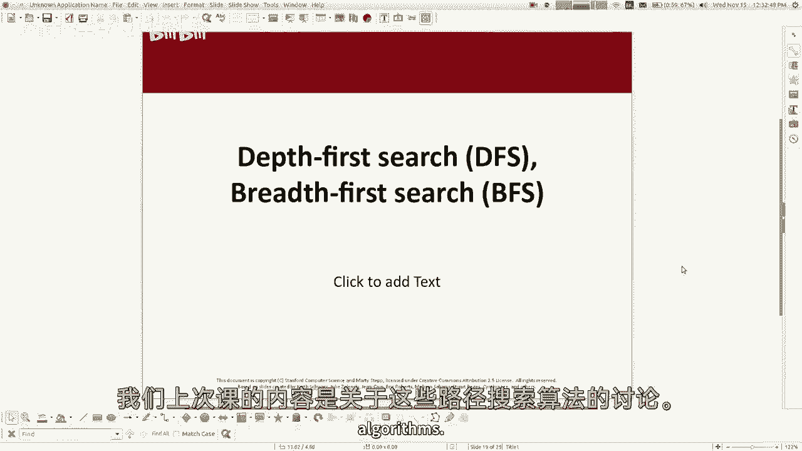
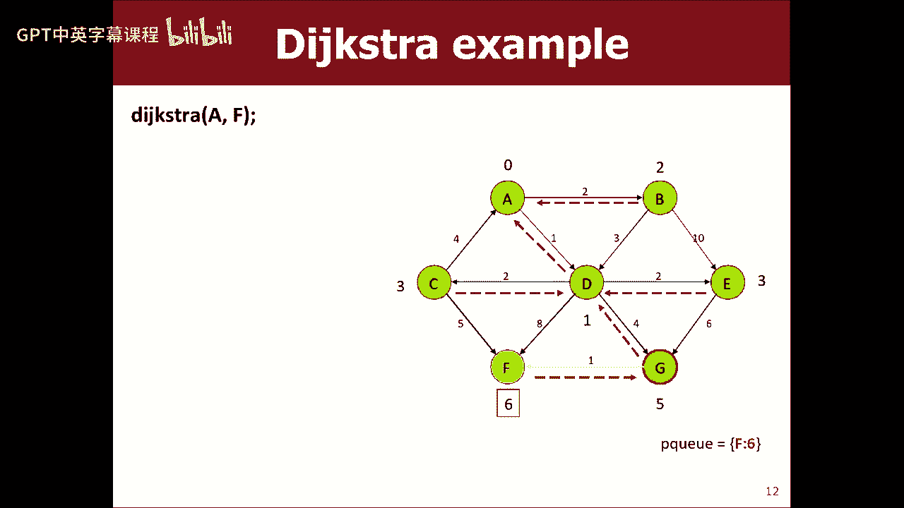
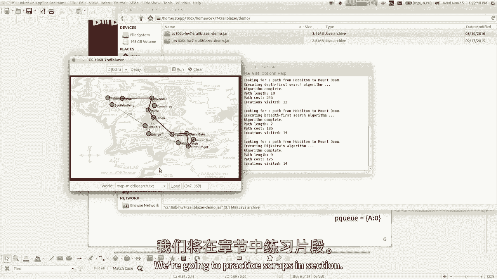

# 【编程抽象方法 cs106x 2017】斯坦福—中英字幕 - P20：Lecture 20 - BFS, Dijkstras - 加加zero - BV1By411h75g

好啦，让我们这样做，呃，第八周，今天是星期三，我们还有几节课要讲，然后我们可以和家人一起休息一周，或者你休息的时候要做什么，我知道我们都很期待，今天我们将继续讨论图表，上次我们讲的只是一般的概念和术语。

您可能会关心图形的原因，诸如此类的事情，我们使用了C++库附带的基本图形类，关于那堂课，我要提到的一件事是，关于基本图，我们用它编程，那真的是，如果你看了很多编程语言，您将发现它们没有表示图的类。

他们没有基本的图形，或者他们没有类似的东西，其实呢，我想我在这节课开始的时候提到过，我们正在学习的大多数斯坦福图书馆都是等价的，或者类似于C++附带的stl库，我们有我们的矢量STL，也有一个矢量。

你知道我们有地图，还有一张地图，所以，我们做的大部分事情，这些斯坦福系列相当于C真正附带的东西，基本图不等价于STL中的任何东西，我可能会在周五谈论更多关于这一点，但基本上长话短说，图表是复杂的。

它们是变化的，有很多不同类型的图，很难写出一个适用于所有这些的图库，所以大多数语言甚至不尝试，但不管怎样，不管我们尝试了什么，我们写了一个，它有点管用，我们上次讲到的是，我们在讨论这些路径搜索算法。

如何在图中找到路径，我们谈到了深度优先搜索，有人能给我，就像用一句话描述深度优先搜索是如何工作的，你说你基本上在图表中尽可能地走得更远，除非你走到死胡同，否则他们不会得到什么，然后你回溯，尝试另一个。

一直这样直到你们找到彼此，是啊，是啊，这是正确的，如果你想找到一条从A到B的路，你选择一个邻居，你往那个方向走越远越好，看看你能不能到达目的地B如果你做到了，那你就停下来，如果没有，你就倒退。

你试试别的，你就是这么说的，所以你一次又一次，你在这条路上深入探索，你在这里选一个邻居，你选择一个邻居，你试着去探索，你是否能从那个邻居到达目的地V2，所以这意味着什么。

深度优先搜索是你不能保证找到最佳路径，最短路径，边缘重量最小的路径，这些都不能保证，但它会发现图中是否有一条从起点到终点的路径，你最终会找到的，所以这很好，我想深度优先搜索相对来说并不难实现。

而且它不需要那么多的数据和那么多的复杂性来做到这一点，它是一种简单的路径搜索算法，这是它的主要好处，所以我想从那里恢复，我想谈谈，啊，我想提到的另一件事是，有时在你用完DFS后，深度优先搜索，你说。

好的，好的，嗯，我发现了一条很棒的路，路找到了耶，但就像，这条小路是什么样的，你知道的，我需要知道要访问哪些节点才能正确地遵循路径，所以就像，我该如何写一个版本来告诉我道路是什么，这是一个递归回溯练习。

就像你们周一说的，所以当你做递归回溯时，你怎么知道，我是说，你选择正确的这些顶点，就像，我们如何知道算法选择了什么来呈现给用户，当我们在一般情况下完成时，因为我们在跟踪我们已经访问过的节点。

所以我们没有得到相同的，所以当我们到达终点的时候，我们访问过的所有节点中最少的一个，是列表是路径，是啊，是啊，所以我们正在访问的这些节点，如果我们能记住我们访问过的所有节点，那基本上是我们的团队。

或者是的，所以就c+中的一些力学来说，也许你可以把这样的东西传过来，你传递某种这是伪代码，但就像你可能会传递一个矢量或其他东西作为另一个参数，我们用回溯来做这个，你把你做出的选择和正确的东西传递给别人。

所以传递一些矢量，那是你的路，然后当你标记人们访问，它发生在那个矢量上，如果你知道，查找路径数组，嗯，如果它现在在你的矢量中，但如果你找不到路，也许你选择把它从路径上移除，所以是的，这是基本思想。

我在这件事上有点含糊其辞和伪科迪，以防万一，假设，如果你必须实现这个，也许我不想放弃所有的权利，但这是一般的想法，嗯好吧，所以我已经谈过这个了，呃，这是对，Dfs，找到一条现在找不到最好的路。

我想走另一条路，搜索算法，我想把它和深度优先搜索进行比较，这个叫做广度优先搜索，Bf s，所以我的意思是，只是我觉得这个名字暗示了一点算法，它搜索的范围很广，而不是很深，所以一般的想法是从你的起点开始。

如果你想到达目的地，你一个一个地搜索，看看你能找到的任何地方，如果你不能到达目的地，然后你两个人搜索，看看你能到达的任何地方，如果这不能让你到达目的地，你只要一直重复这个。

你一次又一次地扩大你的搜索范围，直到你到达目标，现在还没有足够的细节来实现一个算法，但这就是我的想法，对呀，嗯，所以如果你想从A到I，你会看看所有的近邻，看看他们中是否有人，我和如果是，那你就完了。

但除此之外，你现在开始观察所有这些人的近邻，看看他们是什么，就像，我只是写在这里，在算法中，顶点的顺序是什么，你看着一个，然后你看BD，然后它们的直接邻居是，看看他们的直接邻居，你会得到c或者i。

你会把我看作目的地，然后你就会停下来，你会发现在D H I，与深度优先搜索相比有一些不同的属性，然后呢，它最重要的属性之一，它总是返回最短路径，现在我是说，你应该一直持怀疑态度，每当我告诉你一些事情。

因为你知道我知道的不多，另一件事是我有点喜欢对你们撒谎，只是想看看你会不会上当，但就像这样，如果我告诉你这样的事，我觉得你应该经常质疑我，你怎么知道你知道，就像，你确定吗，嗯，你的直觉是什么。

那会让你相信我没有骗你，它必须返回最短路径，你怎么知道那是真的，是啊，是啊，因为当它搜索产品时，它基本上定义了所有其他可能的较短路径，就像在深度搜索一样，在这里可以跳过一条较短的路径，你可以下到每一关。

是呀，是呀，你说的对，嗯，如果你拿一个，零，我们的三门或几门理论课，你学习证明技术，就像，你如何用一种逻辑上合理的方式来证明事情，证明事物的一种常见方法是通过矛盾，对呀，所以你可以说，嗯。

想象一下这没有找到最短的路径，想象一下，有一条比这个发现的路径更短的路径，关于那条路等等，什么是真的，你清楚地表明这将是一个矛盾的状态，那不可能是那种，矛盾的观念，这里是你先看所有长度为1的路径。

如果他们中的任何一个能让你找到目标，你停下来，我们没有停下来，所以我们继续到长度为2的路径，我们看所有的路径，如果其中任何一个能让我们到达目的地，我们停下来，他们不会，我们继续过去的第三点。

所以我们到了第七个长度的包，我们找到了目的地，然后你想知道有没有更短的，因为在你明白我的意思之前，我们已经检查了所有的路径，就像我们会找到它一样，所以算法不会这么做，所以不管怎样，这是个好主意。

它在图中找到这两个顶点之间的最短路径，所以现在就如何实现这一点而言，呃，你不能同时看到这三个元素的跳跃，但你可以按照你看东西的顺序排序，所以一般的算法是这样的，如果你在寻找一条从B1到Two的路径。

你有点事要做，还有一些你要看的东西，最初你的待办事项列表是顶点一，起点，所以你重复直到队列为空，从队列中取出前面的元素，您将该元素标记为正在访问，然后将所有相邻的元素插入队列，稍后处理，你重复。

直到队列中弹出的是目的地，所以我的意思是，你可能会说这听起来不像你在上一张幻灯片上说的那样，但如果你只考虑代码的影响，这将是我在最后一张幻灯片上说的，它将是这个队列中出现的第一件事，将是起点。

接下来从这个队列中弹出的将是邻居，起点的近邻，接下来的事情，我们会调查所有这些人的邻居，等等等等，所以这个算法现在将实现广度优先搜索，上次我们谈到深度优先搜索时，我说嘿，是不是很眼熟，房间里有人说。

像是回溯算法，对呀，这看起来眼熟吗，你以前在哪里见过这个，字梯程序，这正是你在单词阶梯程序中所做的，它实际上是相同的算法，你把只有开头单词的小堆栈放入队列中，然后你反复地拉出一叠。

把所有邻居都放在那堆东西上面，把所有相邻的书堆放到队列里，对呀，你就是这么做的你就是这么做的，你只是没有把它作为一个图形问题来做，但是你用同样的算法，所以如果你让那个程序起作用。

我想你知道你找到了最简短的词，两个字之间的梯子，对呀，所以这是一个图搜索问题，基本上，当然还有，如果这是一张图表，顶点是文字，如果它们相差一个字母，边缘就会是，如果他们的邻居，然后他们之间有一个边缘。

对呀，这是一张数据图，所以是的，这就是如何实现广度优先搜索，所以我是说我不知道还能说什么，这是这里的主要想法，现在我认为主要的事情是，当我还是个学生的时候，当我第一次学习广度搜索时。

我觉得那个好像比另一个好，为什么你会想要深度优先搜索，它找不到捷径，它找到了一条又长又怪的路，你为什么不一直用这个，我的意思是我认为这是一个合理的问题问，但我想简短的回答会是，有时候你不在乎。

如果这是最短的路径，有时这可能需要更长的时间，仅仅因为它必须操纵Q和Q DQ，所有这些不同的事情，运行这个可能需要更多内存，运行这个可能需要更多的时间，也许这样做的好处对我来说并不重要。

在我试图解决的问题的背景下，你可能会说为什么你不想要最短的路径，嗯，有时路的长度并不重要，就像，如果你想把电网连接到一个城市，确保每家每户都有电，那你就知道了，假装它是一个图表，房子是顶点。

电力电缆是边缘，是的，这并不重要，如果你有一根短的电力电缆连接到你的房子或一根长的，我是说，我想如果它真的很长，可能会有危险什么的，但就像一般，只要你连接，你连接，所以我只想确保他们都有联系，我不在乎。

如果短，你知道的，所以你并不总是希望这一切的好处结束，Dfs，你有问题吗，是啊，是啊，所以这是有什么意义的，那个，我们标记它们的原因，因为我们只想看看这里未被拜访的邻居，我想你在单词阶梯中做到了这一点。

事实上，你们中的一些人可能有这种错误，因为你们没有这样做，你需要保留一组你以前见过的单词，记住这一点，你是用字母写的，当你看单词的时候，你把它们放在那里，如果你不做那一套，或者忘了把东西放进那一套。

我想你可能发现你的算法花了很长时间，它从来没有停止过，你们有没有过那种虫子，所以说，嗯是的，我是说，基本上，很多这些算法会说这样做，到每一个未访问的顶点，这是为了确保，因为很多图都有这样的循环，哪里。

如果你走这条路再回来，你可以回到你开始的地方，你不想让图表像旋转一样寻找，嗯，是的，FS给它引入了随机性，那还会是FS吗，还是总是始终如一，哎呦，DFS随机选择要走的路，是啊，是啊，还是DFS，我是说。

我想你会发现如果你实现dfs和dfs，使用我们的图书馆，所以你会得到一个一致的结果，但它一致的原因是，只是因为我们的曲线图把你反馈给了邻居，通常足够的联邦秩序，但是是的。

如果你把这些邻居按不同的顺序洗牌，再进行处理，你得到不同的结果，运行路径搜索的不同时间，但这仍然是一个想法，或者BFS，这不会改变搜索的性质，我是说，您可能会发现您的dfs碰巧选择并突出了最短的一个。

但这只是因为有了国家，所以你知道总的来说，每当你实现这些东西，你可能想知道路径是什么，就像dfs一样，所以DFS，我们计算路径的方法是沿着一个矢量，我们把访问的顶点放入向量中，你不能在这里做同样的把戏。

因为从概念上讲，从技术上讲，你是一次一点点地尝试一堆垫子，与DFS相反，你在尽可能地探索一条路，然后后退，这样你就可以把唯一的一条路径表示为一个向量，在这种情况下，所以我的意思是，你看。

我们所做的是记住单词阶梯中的路径，你把这个复杂得可笑的结构，就像一个充满单词和字母的提示，就像它是一种愚蠢的结构，你有所有这些线索和堆栈到处都是，这是因为这些堆栈中的每一个都代表着一个类似的局部探索。

你看到的是一条路，一旦你找到目标，你说过，哦好吧，然后这是这个选择的堆栈，这是所有单词的堆叠，对呀，嗯，这样很好，只是它需要大量的记忆，所以我们让你在任务二的时候，因为那是我们目前能找到的最好的了。

但最重要的是，如果你有一个很好的图形库，你会做什么，就像这样，而不是保持一个QA堆栈或向量队列，每次你访问一个顶点，每次你喜欢市场被参观，你也会记得，我是怎么到这个顶点的，所以如果我标记，你知道的。

如果我在Q中做第一个，然后在一个我做BD之后，我会记得b和d和e都来自，所以我会像存储以前的节点一样存储，上一个指针，以前的东西代表，所以最终如果我能击中目标，就像一个对我是我正在寻找的。

然后我就会记得我以前的是H和H，因为前面是d，d是前面是a，所以如果我想要从a到i的路径，一旦我找到i，我只是走在前面，上一次，以前，这就是我的道路，倒过来了，但这是正确的道路，如果有同样好的路。

有两个相同的最小长度，这个算法会找到其中一个，他们中的一个没有更好也没关系，或者比另一个更糟，所以我想它会找到按字母顺序排列最少的最佳路径，是啊，是啊，所以之前，是啊，是啊，就像，前面的故事在哪里。

我是说这取决于你用的是什么图书馆，但基本上你需要一些方法来问那个人的前任是谁，所以我的意思是，如果你没有很多支持，这可能是字面上的，从字面上看，这可能是一个向量或顶点到顶点的地图或其他东西。

你知道它可以是任何东西，或者如果你的图书馆有帮助，也许它让你坐下嘿，你以前和你一样，也许它可以让您以某种方式将其存储在图形对象中，取决于图书馆给你的东西，所以是的，我是说，但只是在抽象的意义上。

你需要想出一种方法来记住对于给定的顶点，我想以某种形式记住他们的前任是谁，这可能是字符串到字符串的映射，也可能是顶点星到顶点星的地图或类似的东西，你知道的，就是这个意思，同样的事情。

当我谈到将一个顶点标记为访问时，同样的概念也适用于那里，就像，如何将顶点标记为已访问，“好”是什么意思，我不知道，比如把参观过的东西做成一组放在布景里，你知道，就像你想出了一个方法，如此正确，就像。

图表并不神奇地，像你做的那样为你做，你知道的，想办法记住你以前访问过这个顶点，但是，这就对了，那个算法大部分是有意义的关于dfs的问题，他创建了一个包含，当然，我想如果你对图形库有设计控制。

你可以说我希望我的顶点有一个小布尔标志，在里面，或者访问过的东西真假，或某事和真实的替代，所以是的，我是说，如果你有能力决定这些事情，然后你可以让你的图书馆帮助处理这种事情。

我想我要小心的一件事是寻找一条路，是你可能想用图表做的十亿件事之一，这不是你唯一想做的事情，如果您过度自定义图库以方便路径搜索，对其他事情可能没有那么好，或者它可能会臃肿什么的，所以这取决于你想做什么。

其实呢，如果你想让我离题一会儿，就像我曾经参加过一次工作面试，我在微软的一个行业工作，你知道他们会问你这些编码问题和益智问题之类的，那家伙说，我想让你写一个图形库，或者至少告诉我如何编写图形库的设计。

比如它有什么方法，它能做什么，我开始写下所有这些方法标题之类的东西，然后在某个时候我停了下来，我就像，哦等等，其实呢，你打算怎么处理这张图表，因为你知道，我需要访问的布尔值吗，我需要以前的地图吗。

你知道的，就像，你打算怎么处理它，因为我想，不管我是用这个还是这个，这取决于你要怎么处理它，他说，好啦，那是正确答案，让我们继续他想让我说的话，曾经是，你打算怎么处理这张图表，因为不管怎么样。

我应该直接问他的，这样我就不用知道答案了，在那里吗，另一只手举起来，有人，是啊，是啊，所以这就像，即使你有深度搜索，你还是要像以前一样发送，你不需要以前的，呃对于DFS来说，因为如果你传递一个胜利者。

就像你是一个递归调用堆栈，一种是你的路，你在哪里，你在看哪里，就像如果你存储在一个向量中，比如您在当前递归调用中访问的位置，如果你找到目标，那个矢量有你的路径，如果你找不到目标。

你只需在返回的路上取消选择并从矢量中移除，所以不同的，你这样做的原因是，你只探索一条路，尽你所能直到你放弃，因此，一条路径可以在向量中，什么地方什么的，但这个你隐含地探索了很多道路，一步一个脚印，因此。

你不能只把一条路径作为矢量，因为你做的这些事，所以你知道我的意思，就像你不能把所有这些路径都扔进一个向量，但我有一个问题，就像你说的你可以在地图上，就像这个之前那个，但是这个案子呢，你以前有很多可能性。

如果你有多个预览，但你不在这个算法中，因为就像在这个算法中，每当你把某人作为别人的邻居添加到队列中时，你从队列中拉出来的，所以你就像，我从他那里得到了他，所以它结束了之前什么的，所以这就像。

虽然确实可能有多个，就像你可以从h或c得到i，或者其他什么，但我从H那里得到了两只眼睛，就像，这就是我要储存的，其他可能的方法，我不会储存那些，因为这不是我的算法遇到的，你知道的。

如果您想返回所有可能的最短路径，因为另一个很容易修改，你只是不停地寻找，但在这个问题上，你不知道你的，你想要所有最短的路径，是啊，是啊，我是说，那是，我想你知道，我不想在那上面花太多时间。

但基本上简短的回答是，如果你曾经，我想实际上伪代码中缺少的是当你停止，就像你停下来，如果你看到目标像B2或其他什么，但我想你会做的是，如果你看到V 2你，你庆祝，你用前面的指针给出你的路径。

但在庆祝并打印出来或返回或其他它正在做的事情后，你不会立即跳出你的循环，你继续循环，直到你把所有和那个一样长的垫子都用完，但是一旦你到了你的路径比这更长的地步，你会想停下来，你知道的，蜂蜜，你知道的。

既然我们没有，我们只跟踪我们当前在哪个节点上，以及它以前的节点是什么，嗯，我是说你必须决定要修改算法来记住，可能我的前任就是他，它走了两三步才找到我，或者任何你能做的。

您可以将任何顶点与任何其他信息相关联，你喜欢用地图，所以我必须绘制地图我每跳两下，我得到了高和三跳，所以是的，一旦你停下来看到顶点，你得用它跳三下以上，你就会爆发。

因为你会说我现在受够了所有伟大的三个啤酒花垫，好啦，好啦，所以这就是BFS，我还有什么没说到大O，我将主要谈论大o在星期五，但这些算法中的大多数，BFS和DFS有一个大O，与顶点和边成正比。

两者都是线性的，所以我们说它是v加e的大o，我不想大谈理由，情况就是这样，我想把它保存下来，但就像它是什么，我们可以以后再谈，我是说，这种直觉是，你不会多次访问一个顶点，你知道。

因为你不会多次拜访它的邻居，这也意味着你不会在边缘旅行不止一次，所以我的意思是它有一种直觉，你最多看一次东西，但不管怎样。

无论我想继续前进，我想跳到我的另一个滑梯上，还有更多的算法来搜索路径。

我想告诉你另外两个，我不知道今天能不能全部吃完，但我想谈谈一个叫做贝克算法的算法，如果我们有时间，我说的是一个叫星星的，这些算法是对广度的进一步改进，首先搜索，试图让他们跑得更快。

因为你知道我用这些小图表给你看的例子，从a到b从b到c，这些都是非常小的图表，我是说，但我有八九个顶点，或者如果你有一张所有城市和道路的图表，你知道你在试图绘制街道地图，或者有很多顶点，有很多边缘。

你缩小，你拥有整个美国，有很多顶点，更不用说其他的了，就像社交网络，这些图表里有数十亿人，你知道它的顶点太多了，所以这些算法真的需要加快速度，我给你看的那些有点快，但也许我们可以做得更好。

所以这些算法还有另一个缺陷，除此之外，他们不考虑边缘重量，BFS被优化以找到最短路径，这是伟大的，但有时我不想要最短的路，我想要总成本最低的，这些并不总是相同的权利，所以我想我的例子是。

如果你从一个到一半，那么最短路径是正确的，那是，呃，两啤酒花，这条路的成本和7加2是9，但我想你能做到，有几种方法，你可以以较低的成本到达那里，好吧，如果你去一个B E F，那是四加二加二，那是八。

所以少了一个，我想这不是真的吗，如果你一直绕到底部，比那个还要便宜，不是六个吗？就像有更便宜的垫子有更多的啤酒花，有时这就是你想要的，是的，我是说我们已经讨论过一些现实世界中的类比，就像飞机票一样。

如果你愿意飞四件东西的航班，听起来很可怕，但如果你愿意花六百块，而不是花900块坐两站飞机，嗯，你是个挨饿的大学生，你可以接受这笔交易，我不知道，你可以想到很多这样的例子，对呀，所以有时候体重很重要。

好的，好的，所以dijkstra算法是以edgar dykstra的名字命名的，他是个很酷的家伙，你应该去查查他的维基百科什么的，他，你知道我可以继续谈论他，我只想简短地说。

他是计算机科学和逻辑学史上的重要人物，嗯，然后他，你知道他想出了这个算法，戴克斯特拉算法，以及许多其他聪明的计算解决方案，他在计算语言学方面很有影响力，在编译器中也是如此，在操作系统中。

我们领域的各种领域，一个才华横溢的家伙，他获得了图灵奖，就像诺贝尔计算机科学奖，嗯，很酷的家伙，我喜欢他，因为他的名字在一行中包含for循环变量，我JK，太酷了，这是很酷的财产，你知道的，嗯。

他还几乎单枪匹马地杀死了去指挥，这是有史以来发生的最糟糕的事情之一，在编程语言中这个命令被称为，转到您可以跳转到程序中其他任何地方的地方，立刻，这几乎就像调用函数一样，但是你可以直接跳到一个函数的中间。

或者跳到任何地方，你可以说去那里，现在呢，你在那里，嗯，那是强大的，但它使调试变得不可能，因为你不知道自己从哪里来怎么来的，只是很糟糕，他写了一篇很有影响力的论文，打电话去认为这是有害的。

有一次他说每个人都像，哎呦，他说得对，所以他们停了下来，我是说，他不是单枪匹马杀了珂图，但不管怎样，那家报纸超级有名，不管怎样，他是个很有趣的家伙，他在计算机科学方面做了很多工作，我通常不谈论CS的人。

但他是我的人，所以他想出了这个算法，你也知道，我觉得有点好笑，因为就像学校里的人第一次听到冰斯特拉的名字一样，你知道的，但这可能是他的两个七，对我们领域最重要的贡献，你知道我的意思。

但不管这是以他的名字命名的，所以这是一个算法，在图的两个顶点之间找到一个最小权重路径，从技术上讲，你可以找到所有的路径，但不管怎样，嗯，这个算法的基本思想是，很像闺蜜，您使用优先级队列而不是常规队列。

记得我们说过，我们把东西排队，我们把它们拿出来，看看它们什么的，而不是做一个正常的队列，我们使用一个按边缘权重排序的优先级队列，如果你做到了再加一点魔法，然后基本上你最终会用算法找到最小权重路径。

还记得我说的逻辑吗，我们知道广度优先搜索，我们会找到最短的路，因为我们观察所有较短的路径，在我们看任何更长的路径之前，对呀，直觉上这将是找到的最短路径，这个算法有点像，只是它查看了所有低成本的路径。

在它研究所有高成本路径之前，因此，如果你找到了通往目的地的道路，你会知道这是到达那里的最低成本的方法，我拿给你看，所以有点复杂，伪，但也没那么糟，相信我，嗯。

所以德克斯特的算法是将每个顶点与成本关联起来，所以我们在讨论，如何映射到以前的，你是怎么记住一些啤酒花的，你呀，你可以有地图什么的，从顶点到双倍或它的或任何成本，你知道的，假设每个顶点都有代价。

你从它们都有无穷大的代价开始，那只是意味着我没有任何办法，我不知道有什么办法能到达那个顶点，然而，所以说，如果我有办法，比无限还便宜，对呀，就是这个意思，除了起始顶点，你已经从那里开始了。

所以到达那里的成本为零，现在您将所有顶点放入优先级队列中，你们知道优先提示，病人提示，对呀，好像你知道似的，所以按优先级排序，一开始把v1放进去，现在这个算法和BFS基本相同。

你拔出一个顶点市场就访问了，把他的邻居关在里面，变化意味着这里有很多词，但变化是，当您将东西添加到数据结构中时，你必须把PQ加上你放进去的值，就像顶点一样，你得增加一个优先级，那么你使用的优先级是什么。

您使用的优先级是到达顶点的成本，你现在看到的是我称之为V的，加上从v到邻居的边的代价，所以如果我能以零的代价得到v1，那么到达邻居的成本就是他们的直接边缘成本，然后到达所有邻居的成本是第一个优势。

再加上第二条边以此类推，所以你储存了一些成本作为优先事项，你们还记得PU把东西弹出来，从优先数到最高，所以那些低成本的会先从那里出来，所以我们要先看看它们，所以我们要先看看更便宜的通行证，以此类推。

就是这个意思，再一次，我们有重建路径的想法，使用以前从BFS借来的指针，一旦我们找到目标，我们以前以前以前，直到我们找到它回到商店，现在我想有一个例子和一张图片会更容易，所以让我们谈谈幻灯片都在网站上。

所以如果我在找Dijkstra的算法，从A到F的路径，你知道，我记得所有这些人都有无限的代价，但我的星形顶点成本为零，我要在这张图上做一些颜色编码，我要在这里放一些黄色的东西，如果它在p q中。

在某个时候会被看到的，我要把它涂成绿色，如果我把它从PQ里拿出来，我把它标记为已经访问过了，那将是绿色的，所以最初当算法启动时，你把起始顶点放在PQ中，代价为零，好啦，所以这就是事情的状态。

我在寻找一条通往F的道路，所以下一步就是把人拉出来，你把他们所有的邻居都放进去，所以我拿出一个，标记他为访客，然后我把他所有的邻居都放在PQ里，我把它们放在优先级上的成本。

我把它们放进去的是边缘重量从一个到那个人，对呀，所以这家伙和这两个人在一起，这家伙拿着一个，所以在排序正确的PQ中，所以有一个的会在前面，所以他要先出来，是啊，是啊，那么，以无穷大为代价。

使其他一切都变得像有什么意义呢？是的嗯我的意思是，只是在概念上，如果你曾经，如果你，我是说我们马上就会看到有时你会到达一个顶点，多种方式，你想知道哪种方式更好，所以你总是想知道，如果你。

如果你还没有到那里，那这种方式是无限糟糕的，所以你还想要什么，但是那种，你知道的，所以我的意思是，您不必总是在代码中存储无穷大，只是概念上，你觉得这就像，我不知道怎么到这里。

所以我认为它有无限的成本去达到，或者别的什么，你知道的，我看过你们这么做，就像你试图找到最小的东西，所以你把它设置成，最大值什么的，是那个黑客，你知道你这样做是对的，所以好吧，把这些家伙放进去。

边缘重量是优先考虑的，对呀，所以我们只要重复，所以我们把人拉出来，这将是，我知道这是在幻灯片的底部，硬C，但是PQ首先有D，因为它的成本最低，所以我把D拉了出来，现在很多事情都变了。

因为我把那个标记拿出来，我标记了他所有未拜访过的邻居，我把它们都放进去了，我把它们放进去的成本，就像他的优势一样，是什么的成本，加上这两个，加上八个，加上这四个，加上这两个，就像C和三个一起进去。

E和三个一起进去，F加9，G代表五，而且有点，又排序了，像往常一样，现在，你可能会说等等，就这些了，我在找F，我现在停下来，对不对，你不把F拉出peq就不停下来，标记他被拜访了，因为如果你现在停下来。

您将选择ADF作为您的路径，我们会发现这不是最好的选择，就像你还不想停下来，如果你看到了，所以好吧，这就是现在的情况，只要按Q的顺序，现在最便宜的是Beam，两个人的费用，对呀，所以我把他拉了出来。

我看着他所有的邻居，他的邻居是D和E等等，即使我已经有了D D或者我想我已经去过D了，但是e在p q中，那么问题是通过b得到e更好吗，比我以前的方式，就像我已经把他看成一加二。

他在里面用那个作为他的体重，但现在我找到了另一个接近他的方法，如果找到他的新方法，那我可能想用那种方式，但在这个特殊的例子中，情况并非如此，就像二加十，那更糟，所以看着他，我把他标记为被拜访过。

但到目前为止，它没有更新算法状态的任何其他内容，但有时如果你能找到更便宜的方法，它会更新东西，所以好吧，我检查B，现在pq中的下一个是c，所以我弹出C，我把他标记为访客，从c i可以到f。

我现在正在看C的近邻，我可以用更便宜的成本达到F，因为之前我有F在那里，九个的成本来自，你看到这个了吗，这就是我的算法到目前为止所发现的，所以我有f和9，现在我在看C。

我实际上可以通过这种方式达到这一点，所以我继续，我更新了，在P Q I升级病人，从9分到8分，蜡上蜡下，嗯是的，所以这和升级PU的一个元素是一样的，把它移到比以前更好的优先级F成本现在是8。

所以下一个从山顶出来的，这里是前面这里，三个人的费用，e的邻居是g，我想我以前为吉恩付出了什么代价，我现在有一个相等或更差的成本，如果我如果我从，是一加二加六，那更糟，所以这不会更新任何东西。

PQ的下一个是，如果我看，这实际上更新了我现在的成本，因为我会再回去，F在里面，花了八个钱，往这边走，但如果我加G，我访问，然后我可以花一个钱去G，加4等于5再加1等于6，所以现在更新到六个的成本。

这是以前的，你看到了吗，所以这就像你在前进一样，你只是在回忆你见过的最好的方式，去到每一个顶点和它从哪里来，你从哪里来得到最好的道路，所以基本上在某个时候，当你最终DQ F目的地，你把他标记为访客。

在这一点上你应该确定，因为您在使用成本最低的方法后所达到的算法的属性，是啊，是啊，问题确实使，我赢了，因为我觉得你不会去一个节点，你知道的，如果得到戴克算法的方法不起作用，如果图有负边权，它会。

我相信它会很好的，如果你有零重量的边缘，但是负权破坏了算法，你只是不能作为先决条件，它假设没有负权，行不通的，所以如果喜欢喜欢来自G，如果你有一个，你有树，像其他人一样，没有什么是我没有连接回F。

然后算法必须喜欢，就像这里有一堆垃圾一样，那没有帮助，算法就像卡在这里，看着这群人，在它发现不之前，我想我的意思是，也许我应该稍微改变一下这些幻灯片，因为我想在这篇文章结束时，我已经看过了每个节点。

但在另一个例子中，如果有脏东西，我不一定要看所有的节点，您查看节点的顺序是相对于权重的，所以如果这里有一个节点，它的成本是3或其他什么，然后他就会以一加四加三的方式参加队列，你不会把他拉出来。

除非那是你还没看过的最便宜的东西，所以就像，例如，在这一点上，算法f在这里有6，所以他就像下一个被预订的，所以说，然后我停了下来，因为我找到了他，但你知道吗，如果有人，你知道一个花了一个。

然后E又花了两个，所以我有三个人来这里，然后这里还有一个东西花了一个，我会看着那个，因为那样更便宜，因为你永远不知道这家伙可能会付出代价，其次是1到F的成本，我得检查一下，我得看看那个。

但如果这家伙花了12英镑，它将以很高的PQ数进入，在他来之前我是不会去看他的，所以我根本见不到他，因为我会看到如果我发现那是我想要的，我只是停下来，所以基本上如果这里有污垢，你只会看着它。

如果是低成本的垃圾，在这种情况下，你需要看看它，所以如果一个高成本的污垢你会，不会被看到的，所以说，D级二级，好啦，等等，等等，等等。

我很乐意回答这个问题，但让我让我现场直播，我们会现场直播，你们收到推荐信了吗，A到B要花一个钱，他们就像D和E，然后他们就像，好啦，就像一步的成本和成本，嗯哼，所以那会更多，所以你要做的是。

当算法开始时，你把成本为零的一个放进去，所以你没有把他从马克和格林那里拉出来，然后你会让邻居排队，你用1做q b，用2做d，然后你重复你的循环，所以你总是挑最便宜的，所以你先看b，你说谁是B的邻居。

你说，啊，我可以花两个钱去D，但我已经花了两个钱了，所以你就把它，你不会改变它，你要花11英镑买D，但是是的，好像你不会改变，你可能会做什么，虽然就像，如果这就像花了四个，所以就像你把他和一个。

你让他带四个人进去，你先去看他，你发现你可以花两个钱到达D，因此，您将更新d的成本为2，而前面的成本为d，但它不会破坏算法或任何东西，只是意味着你会更新，然后我们在这里做了类似的事情。

有时我们储存一个数字，后来我们找到了一个更好的号码，所以一切都很好，如果你那么做了，不是这样的，我们实际上可以正确地更新，我想当我描述BFS时，几乎就像，它在某种程度上是平行的。

就像它看所有的路径一个长度和所有的路径两个长度，但它不是它必须按顺序看它们，因为它是一种顺序算法，从概念上看，它看着他们，它一次移动一个，但是这个算法总是把一个元素从pq上移开，更新任何必要的内容。

然后在PQ上再重复一次，是啊，是啊，是啊，是啊，问题嗯，我有个关于负重的问题，那么为什么这不起作用呢，我们就不能把最低值加起来，就像负5一样，这些都是有趣的问题，呃，为什么不管用，让我这么想。

我是说基本上发生的事情是，就像我说过的这种可能性，如果这里有15英镑的东西，它就像顶点一样，X或其他什么，好吧，那么我的算法可能永远不会看到，因为它会做所有其他的工作，它会把东西拉出来，PU它从来没有。

它从来没有到过15英镑的东西，它找到f然后说，哎呦，我知道我找到了最便宜的方法，因为没有什么是15英镑的，你知道我不需要看十五件事，因为我发现一条路比十五块便宜，这让我想到了F，但是如果x对f有一条边。

它的代价是负12，然后哎呀，喜欢抵消十五，哎呀，现在我应该看看十五，现在我得看看一切，有点打击，算法的效率，基本上，这意味着我必须看看每一个，我是说你在问什么，如果这里有脏东西，算法不必看污垢。

如果它的重量太高，但是负边会破坏这种性质，所以现在，是呀，你说的是，我可以加一个，如果最坏的负边，负十二，我可以，在所有的边缘成本上加上十三，我觉得你能做到，我想这只是字面上的东西不能有负数在里面。

所以我觉得没关系，我想那会解决，我忘了，我以前没有这样做过，但是但是是的，不是你不能这么做，只不过，如果它真的是负数，你知道算法会做自己的事情，是的所以如果我们试图从情况中获得数据。

这个算法仍然像搜索所有其他节点一样，即使只有一个节点，是的，如果我想从A到X，我以前会看很多其他的东西，我实际上跳到X，即使我能看到去那里的路，因为我得确保，如果有一个边在这里花4英镑。

那么一个边在这里花1英镑或类似的钱，我想我做反了，但是像什么，如果是四个然后两个然后一个，啊，这比十五或四个，然后两个，然后五个，然后一个要好，那比，所以我得先检查所有这些，以防他们中的一个跳到X。

我不知道，我做不到，我不喜欢窥视前方，知道你知道你有，我是说，我有，但我想如果你仔细想想，知道这基本上是我所做的花费和成本，所以说，就像如果它不止像一个，跳开，我只需要喜欢，看全图，基本上是这样是的。

问题，所以我想知道，嗯，所以这看起来像是，我们将此与一般搜索区分开来，或者像缩小，计算成本，这和广度的主要区别，首先搜索的是广度，首先搜索找到最短路径，最短边数，这个找到了成本最低的路径。

所以你可以把更多的边缘，我想我在这里做的是，我走得很好，我把边缘的数字，但我会撤销你让我做的事，宽度优先搜索找到的最短路径是f，但戴克斯特拉会发现，因为它的成本较低，所以这是一个不同的结果。

针对不同因素进行优化，这是一个重要的区别，你是对的，否则他们很相似，但它们生产的东西在产量上有一个重要的区别，好的，好的，回到a到d是1，b，d是1，db，这将使它，所以有两条路通往相同的目标。

代价相同，对呀，其中之一是一条更长的路，因为PQ的实现方式，会的，不是吗？每次都选短一点的，因为它总是先做A和D检查然后再检查，是啊，是啊，我想那是对的，呃我，你知道的，我不敢夸大，好像有办法扭动它。

在那里你不真正看东西，好像我不确定，如果它产生给定的最短的，是否需要使用，总是最短的路径，是啊，是啊，我得考虑一下，但我认为在这样的例子中，你说得很对，但是这个和这个长的，因为这个方法，排序。

也就是看东西，但我不确定，如果这是一个属性，我可以假设我的意思是看，我想说的是如果你在运行Dijkstra的算法，你关心的是总重量，这才是你关心的，如果你不得不跳，一次额外的得到。

或五倍或一百倍的额外得到，你来吧，所以你知道你说得很好，会是一个吗，跳得短或长，我能假设这条路有多短吗，这不是为了短，我不在乎短，我是说有时候这很好，如果一切都是平等的，也许我想要一个短一点的。

但如果我这么做，因为体重是我想担心的，你知道的，是的，就像数据x从x到a，向后搜索，从X开始，就像做相反的算法，搜索，因为你在说，因为到这里的路不多，而且是的，我是说，戴克斯特拉的算法有很多不同的变体。

我想你会发现，如果你炮制了一个具有某些性质的图，你可能会说，等一下，你可以这样做，你知道的，但是如果你试图写一个对每个图都有效的算法，有各种形状和大小的图形，你在一个图表上使用的任何类似的小技巧。

对其他图形来说会更糟，所以这对任何图都有效，这是一般的，挺快的，啊，啊，所以嗯，如果图表中有循环和循环之类的东西呢，嗯，我想你没事，因为这里面有一些循环不是，这个图中没有循环，是呀，是呀，是呀，A、C。

所以你可以有周期，没关系的，但那是另一件事，如果你有负重边，你可以像哇负能量，你知道的，现在它让我付出了代价，它是，这就像，你看过超人电影吗露易丝·莱恩死了，所以他喜欢飞上太空，他让地球向后旋转。

它让时间倒流，然后她就复活了，然后他说嘿，好像不是那样的，所以如果你喜欢在图表中旋转，试图获得负重，所以你的道路会更好，因为它不是这样工作的，所以嗯，是啊，是啊，我觉得没问题，如果有，如果有循环。

再回答几个问题，今天到此为止，是啊，是啊，所以建立一种向后的开始和退出，你就不能说，好啦，嗯，从终点开始，哪一个有更多的节点连接到它，然后选择一个比较少的，哦从哪个起点，嗯，我是说你看。

Dijkstra算法有各种变体，我没有时间一一谈，我的意思是有一个特别的变化，我确实想谈谈，就像，你们认为，嗯，等一下等一下，我能用一些关于这个图的直觉让Dijkstra变得更好吗。

这就是我星期五要首先报道的内容，它被称为恒星，它使用，这叫做启发式，一种引导，哪条路，它先看一下，基于对图表的一些估计，关于顶点，关于边缘，而这些事情，所以我将向你展示一个相当聪明的优化，就顺序而言。

这可以让事情变得更好，它看东西，我们星期五去，嗯，我能给你们看一下吗，我有这个的动画，我可以给你看看吗？我知道差不多该走了，但让我们看看，作业在哪里，我要把这个分配给你，所以说，这是去年的，不过没关系。

嗯，就像你们要写的这些图搜索算法，所以像什么，这里是中土世界，是你知道的，指环王什么的，所以如果你说喜欢，我要从霍比顿去末日山，我让它慢下来，然后它走得太快了，基本上它选择，哦，现在它走得太慢了。

它基本上选择了一条路，它尽可能地朝着那个方向发展，看它往那边走，哦不，那很糟糕，回去，我们走那边，我在末日山找到的，哦，我先去黑门，所以它选择了那条路，它就像捡东西一样，尽它所能。

你知道如果你做了一个BFS并运行它，挺顺利的，甲板上的下一个是谁，你们这些家伙，好啦，我去找你，我去找你，黄色在排队，绿色在参观，所以这有点像访问节点，再往前一点，再往前一点，在每个岔路口再往前一点。

有点你知道，最终它会找到通往厄运山的路，它将是通往末日山的最短路径，所以这可能意味着他们会走这条路，因为它是，它马上就会告诉我，在那里，所以它去了那边，因为那是最短的，我觉得边缘的重量。

走那条路有多危险，比如有多少埃里克·罗伯茨制作了这张特殊的地图，他说你不能从南方来，直奔艾森花园，疯狂，你得穿过颠茄河，我很好，那是，这就是为什么我不会走那条路，但是如果你用戴克斯特拉的算法。

它先看便宜的，它看着之前的三十个，或者那个很便宜，但它看的是以前便宜的边缘，它看的是昂贵的边缘，所以我相信这个Dijkstra电话会给我们最低的总数，所以结果就是这样，所以它不同于BFS产生的。

这对小弗罗多来说更有可能，从《怪奇物语》里出来的那个人，反正，我要让你们知道，因为我们练习残羹剩饭的时间。

我们星期五见。