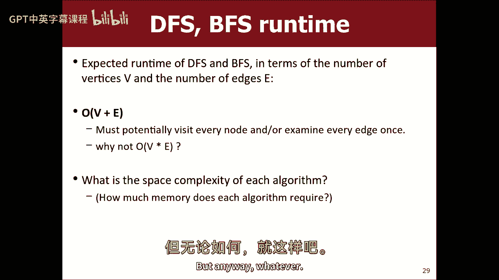

# 课程20：图搜索算法进阶 - BFS与Dijkstra算法 🧭


在本节课中，我们将继续学习图论中的路径搜索算法。上一节我们介绍了图的基本概念、术语以及深度优先搜索（DFS）。本节中，我们将重点探讨两种更高效的算法：广度优先搜索（BFS）和Dijkstra算法。我们将学习它们的工作原理、实现方式以及各自的适用场景。

## 从DFS到BFS 🔄

上一节我们介绍了深度优先搜索（DFS），它是一种沿着单一路径尽可能深入探索的算法。虽然DFS能判断图中是否存在路径，但它不保证找到的是最短路径。本节中我们来看看广度优先搜索（BFS），它采用了一种不同的搜索策略。

BFS的核心思想是从起点开始，逐层向外探索所有可能的路径。它首先检查所有距离起点为1步的顶点，然后是距离为2步的顶点，依此类推，直到找到目标顶点。这种方法保证了找到的路径是边数最少的（即最短路径）。

以下是BFS算法的基本伪代码描述：

```cpp
queue.enqueue(startVertex);
while (!queue.isEmpty()) {
    current = queue.dequeue();
    mark current as visited;
    if (current == target) {
        // 找到路径
        break;
    }
    for (each neighbor of current) {
        if (neighbor is not visited) {
            queue.enqueue(neighbor);
            record predecessor of neighbor as current; // 用于重建路径
        }
    }
}
```

## BFS的实现细节与路径重建 🛠️

在实现BFS时，我们需要记录每个顶点的“前驱”信息，以便在找到目标后能够重建完整的路径。这与DFS不同，因为BFS是同时探索多条路径，而非单一路径。

以下是实现BFS时需要注意的几个关键点：

*   **避免重复访问**：必须标记已访问的顶点，否则在存在环的图中算法可能陷入无限循环。
*   **路径重建**：通常使用一个映射（如 `map<Vertex, Vertex>`）来记录每个顶点是从哪个顶点访问过来的（即其前驱）。找到目标后，从目标顶点开始，沿着前驱指针回溯到起点，即可得到路径（注意路径是反向的）。
*   **数据结构**：使用队列（Queue）来管理待访问的顶点，确保“先进先出”的访问顺序，从而实现层序遍历。

BFS的时间复杂度通常为 **O(V + E)**，其中V是顶点数，E是边数。这意味着算法访问每个顶点和每条边的次数是常数级的。

## 引入权重：Dijkstra算法 ⚖️




BFS能找到边数最少的路径，但现实中的图（如道路网、网络）的边往往带有权重（如距离、成本、时间）。这时，我们关心的是总权重最小的路径，而非边数最少的路径。本节中我们来看看Dijkstra算法，它解决了带权图中的最短路径问题。

Dijkstra算法以科学家Edsger Dijkstra的名字命名。它的核心思想与BFS类似，但使用优先级队列（通常是最小堆）代替普通队列。顶点按照从起点到该顶点的当前已知最小成本（距离）进行优先级排序。

以下是Dijkstra算法的基本步骤：

1.  初始化：将起点成本设为0，其他所有顶点成本设为无穷大（表示尚未到达）。将所有顶点放入优先级队列（PQ）。
2.  循环：从PQ中取出当前成本最小的顶点 `u`，标记为已访问。
3.  松弛操作：检查 `u` 的所有未访问邻居 `v`。计算通过 `u` 到达 `v` 的新成本：`newCost = cost[u] + weight(u, v)`。如果 `newCost` 小于 `v` 的当前记录成本，则更新 `v` 的成本为 `newCost`，并记录 `v` 的前驱为 `u`（同时调整 `v` 在PQ中的优先级）。
4.  重复步骤2-3，直到从PQ中取出的顶点是目标顶点（此时可以确定找到了最小成本路径），或者PQ为空。

**关键公式**：松弛操作的核心是 `if (cost[u] + weight(u, v) < cost[v]) { cost[v] = cost[u] + weight(u, v); }`。

## Dijkstra算法图解与特性 🧩

让我们通过一个简单例子理解Dijkstra算法的工作过程。假设我们寻找从A到F的最小成本路径。

1.  起点A成本为0，其他顶点成本为∞。PQ: [(A, 0)]。
2.  取出A，更新其邻居B(成本1)、D(成本2)。PQ: [(B,1), (D,2), ...]。
3.  取出B（成本最低），更新其邻居E(成本1+2=3)。PQ: [(D,2), (E,3), ...]。
4.  取出D，更新其邻居C(成本2+1=3)、F(成本2+7=9)。PQ: [(C,3), (E,3), (F,9), ...]。
5.  取出C（或E，成本相同），发现通过C到F的成本为3+5=8，优于当前的9，因此更新F的成本为8，前驱为C。
6.  继续此过程，最终当F从PQ中取出时，其成本即为最小成本，通过前驱链可重建路径。

Dijkstra算法的重要前提是**图中不能有负权边**。负权边会破坏“一旦顶点从PQ中取出，其成本就已确定最小”的性质，可能导致算法失效。其时间复杂度取决于优先级队列的实现，使用二叉堆时约为 **O((V+E) log V)**。

## BFS与Dijkstra的对比 🤔


为了更清晰地理解，我们来总结一下BFS和Dijkstra算法的核心区别：

*   **优化目标**：BFS寻找**边数最少**的路径；Dijkstra寻找**总权重最小**的路径。
*   **数据结构**：BFS使用**队列**；Dijkstra使用**优先级队列**。
*   **边权处理**：BFS**忽略**边权（或视所有边权为1）；Dijkstra**显式处理**边权。
*   **共同点**：两者都需要标记已访问顶点，并记录前驱信息以重建路径。它们都属于“单源最短路径”算法。

选择哪种算法取决于具体问题。如果只关心连通性或不考虑权重，DFS或BFS更简单高效。如果边权代表真实成本（如距离、票价），则需要使用Dijkstra算法。

## 总结与预告 📚

本节课中我们一起学习了两种重要的图路径搜索算法。我们首先深入探讨了广度优先搜索（BFS），理解了它逐层搜索的特性以及如何找到边数最少的最短路径。接着，我们引入了边权的概念，并学习了Dijkstra算法，它利用优先级队列，总能找到从起点到目标点的总成本最低的路径。

我们比较了BFS和Dijkstra，明确了它们分别针对“最短跳数”和“最小成本”的不同优化目标。这两种算法是理解更复杂图算法的基础。


下节课（周五），我们将探讨对Dijkstra算法的进一步优化——A*搜索算法。它会利用启发式信息来智能地引导搜索方向，从而在特定场景下（如地图导航）大幅提升搜索效率。我们还将更详细地分析这些算法的时间复杂度。敬请期待！