# 【编程抽象方法 cs106x 2017】斯坦福—中英字幕 - P21：Lecture 21 - A Kruskal - 加加zero - BV1By411h75g

什么事？他们是这么说的，年轻人就是这么说的，是呀，我现在听起来年轻很酷吗，因为你，伙计，这个讲座会被免费的，我是说，我有，我确实给我发了一些很酷的话，我以后可以融入我的白话，啊，我知道文学听着。

我去找过罗比，我知道这件事，我都不知道那是什么意思，不过，好吧，嗯，想想看，如果你提到，也许人们喜欢读他们自己的解释，嘿嘿，所以我想感谢你们，你知道这是休息的前一天，我认识很多人，有些人不来上课。

所以我有点害怕，今天会有我们两个人在这里，所以谢谢你能来，我想这一定是，一定有某种斯德哥尔摩综合症，你们就像，我讨厌上课，但我得走了，他让我，我只是，我很高兴你在这里，谢谢你能来。

我们今天要做更多的图表，今天有个任务，我知道你们可能不会，我是说我一周前才给你一个，你想先听好消息还是坏消息，坏哇，好啦，坏消息是还有很多工作要做，会有第八个家庭作业和期末考试，所以还有很多事情要做。

好消息是今天发出的家庭作业七只是一部分，你知道这些作业总是像两个部分，三分十分随便啦，这个只有一部分，我知道我很好，我一定很爱你们，我知道你上周有个任务，所以不，它不是一个很大的公园，反正是。

这个作业可能没有其他一些作业的时间长，但部分原因是我还是想给你喜欢，坦白说，作业八有点像作业七的第二部分，因为它们在另一个世界都有一个图形组件，我今天可能会把他们两个都分配给。

我可能会提前一点发布任务8，就这样出来了，但不管怎样，我知道七号作业，休息的时候会出来的，我想我上一节课说过，我真的不指望你在休息的时候做什么，真的，我是说，如果你六号作业还没做完。

你可以把它吃完什么的，但就像，我不指望你在七号上工作，当你吃感恩节火鸡的时候，我希望你能等到复出，由你决定，虽然对，周一或周二这里有一个问题，我相信决赛是星期一，哦，所以这应该是11号。

我面前没有时间表，我待会儿再检查一遍，我只是不想，我可不想浪费上课时间，但我以为是星期一，但也许这是说十一号，那么这就是应该说的，是啊，是啊，我再检查一遍，它在访问上写的东西都是对的。

也许它真的在这里考试，十一耶，所以我只需要把课程安排好，好啦，是啊，是啊，问题是第八项作业在最后一天会是什么样子，否则任务8就会出现在这里，然后在这里做，决赛就在这里，它没有出现在下一个日历上，星期一。

好啦，是啊，是啊，这就是我们现在的处境。

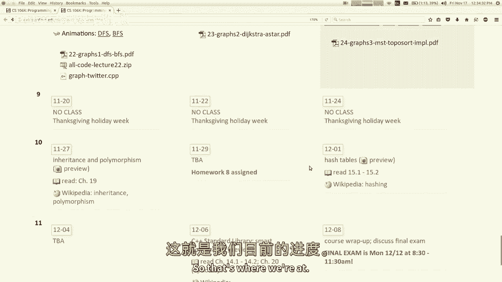

这就是我们正在做的，我想把它盖起来，现在就跳到图表上，所以我们学习了一种叫做Dijkstra算法的算法，你能给我描述一下，Dijkstra和其他一些有什么区别，到目前为止我们学到的，就像，就其结果而言。

Dijkstra给了你什么其他公司没有的东西，最低成本，最低重量路径，与最短路径相反，像宽度，先搜索右，好啦，酷，它是如何做到这一点的快速版本是什么，如何找到最小权重路径，在如何使用优先级方面。

它与其他算法有何不同，如果您将不同的路径按OFF排序，所以它沿着最便宜的道路和漫长的道路前进，是啊，是啊，这是一个很好的总结，它使用按成本排序的优先级队列，所以它先看最便宜的成本。

所以它找到了最短的成本，最低成本路径优先，是啊，是啊，完全正确，这就是戴克斯特拉的算法，今天我想从，我想谈谈Dijkstra算法的一种变体，叫做星搜索。

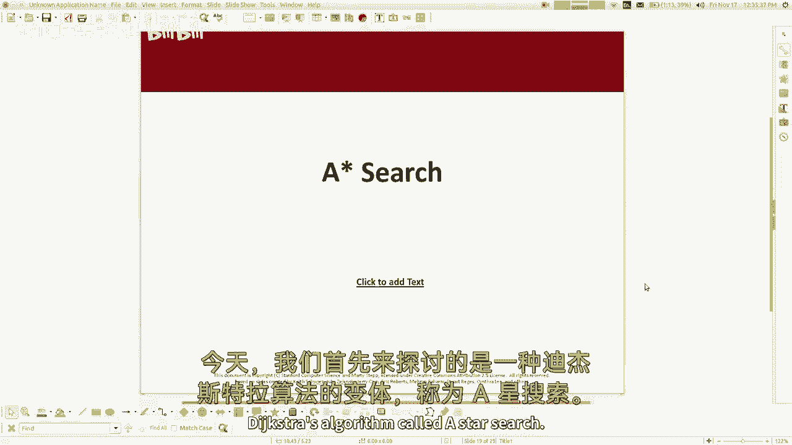

我很喜欢这个算法，我在学生时代就学会了，我用它来实现我正在制作的一个游戏，从那以后我一直觉得很整洁，所以这个算法很像Dijkstra，但它有一个具体的优化，我想教你，所以好吧，我想考虑上下文。

我想想想为什么一些图表会有额外的信息，到目前为止我们还没有考虑过，想象一下这个图代表了一个世界或迷宫，或者类似的东西，所以我要把它画成一个二维的正方形网格，但我想让你把它想象成一张图表。

每个正方形都是一个顶点，如果有一条路，如果你能从顶点走到下一个顶点，但就像这家伙旁边有一堵墙，所以那个方向没有边，所以我不能去那里，甚至不能去那里，我拿到了，所以这是一个图表，所以想象一下。

我正试图从这个起点找到一条路，到这个终点c，如果你使用深度优先搜索，你只要选择一个方向开始四处走动，也许最终你会找到正确的目标或类似的事情，但你可能找不到最短的路径，如果使用广度优先搜索，从概念上讲。

你只是一次又一次地把一个扇开，直到你发现它是正确的，你会找到最短的路径，因为这是搜索的第一个红色，它能找到最短的路径吗，这是很好的dijkstra算法。

如果你在这张图上运行Dijkstra的算法会发生什么，按成本排序，最低费用，路径，它会做什么，不行吗，我是说Dijkstra的算法是关于成本或重量的，这不是一个加权图，我会在非加权图上做什么。

你觉得怎么样，是啊，是啊，只是和，就像在每个盒子里一样，是啊，是啊，这是正确的，我很久以前提到过，如果你有一个未加权的图，你可以假装所有的边缘都有一个重量，同等重量或零或其他什么。

所以如果你运行Dijkstra，它将使用一个p q，但是PQ排序不会很有趣，因为他们都有一条领带，所以它会把它们分类，它会根据你添加它们的顺序对它们进行排序或其他什么，或者按字母顺序什么的，所以本质上。

我想说的是妮塔基本上也会这么做，作为广度优先搜索，它就会散开，因为所有的路径都有一个成本，所以他们会按顺序尝试，所以是的，在未加权的图中，Dijkstra算法向广度优先搜索发展，实际上，如果你仔细想想。

有那么一秒钟是有道理的，因为在图中所有边的权重都是1，最小权重路径，根据定义是最小长度路径，因为重量和长度是成正比的，好啦，所以这就是它现在所做的，我再提一个问题，Dykstra的算法应该做好什么。

我是说，你知道的，如果我们想聪明点，记住什么药品管理局，和一个搜索是要做的，就是，它们会向各个方向散开，直到他们最终找到一条通往这里的路，关于这个图或这个问题的任何直觉，可能比那个算法更好，是啊，是啊。

我想我们的直觉是，我想去那边，我想去右边，至少我是说，如果我知道像一个有坐标一，它的坐标是5，不管坐标是什么，如果我知道我要往东走，最终我的目的地是东方，好像我得走很远才能找到一条路，到达目的地。

但如果是那样就更好了，如果我能走过去，或者如果我能走到那里，然后稍微让开一点，为什么我不试着向右而不是向左，我最终可能需要向左看，但一切都需要平等，如果我试图分散所有这些方式，在走那条路之前。

我为什么不走这条路，在我回去之前再往这边走一点，你明白我在说什么，所以说，让我们利用我们所知道的边缘的空间关系，图表上的节点，这就是这里的直觉，所以这里有一个观察，Dijkstra算法使用优先级队列。

据我们目前所知，戴克斯特拉的想法，我展示了迪克斯特拉的幻灯片动画，我们去过的地方，一组特定的顶点，它们是绿色的，我们也有线索，一组特定的顶点，它们是黄色的，所以被拜访的人，我们知道所有关于。

我们知道到达的最便宜的成本，这就是为什么我们曾经拜访过他们，我们参观了PU，并从PU中拿出了一些东西，并将其作为绿色产品进行营销，这是你能得到的最便宜的顶点，我们确信这些黄色的还在PU里，没有拔出来的。

但那些我们略知一二的，还有一些我们甚至还没有看过，我们对此一无所知，Dijkstra的算法是基于我们目前所知道的，关于如何从起点到中点，我们也许能推断出，从中点到最后一点更有可能发生什么。

回到这张幻灯片，就像如果我从开始到这里，假设这个正方形，如果我从开始到这里，我可以说好，也许通往这两个地方的道路彼此的成本非常相似，从n开始，我喜欢在这里比我喜欢在这里，只是因为它在这里离目标更近。

所以如果你知道这些东西的位置，你可能会，如果你知道一些关于这可能需要多远的估计，从中点到球门，也许我们可以把它合并到算法中，唯一棘手的部分，虽然是像你不确定像，我是说，如果你看这样的图表。

如果我看这个正方形，我去，哎呦，你知道那个方块离目标只有一二，那是个好广场，但实际上他有墙，所以你不能就这么去，你可以绕着走，实际上你可以想象有这样的墙，所以像这样走完全没有帮助，你知道我的意思。

所以我觉得他很好，但他实际上可能并不好，所以它是它是一个，你可以有一种直觉或猜测一条路有多好，或者一个方向是或者一个顶点是，但你不能肯定，你知道的，好啦，所以让我们来探索我们可以说的未知距离，这又是。

如果你想的是一个二维的空间图，三乘四，这些是到达所有这些方块的成本，对呀，好啦，我们想走那条路，所以这条路走错了方向，算法并不真正理解这一点，算法根本没有考虑到这一点。

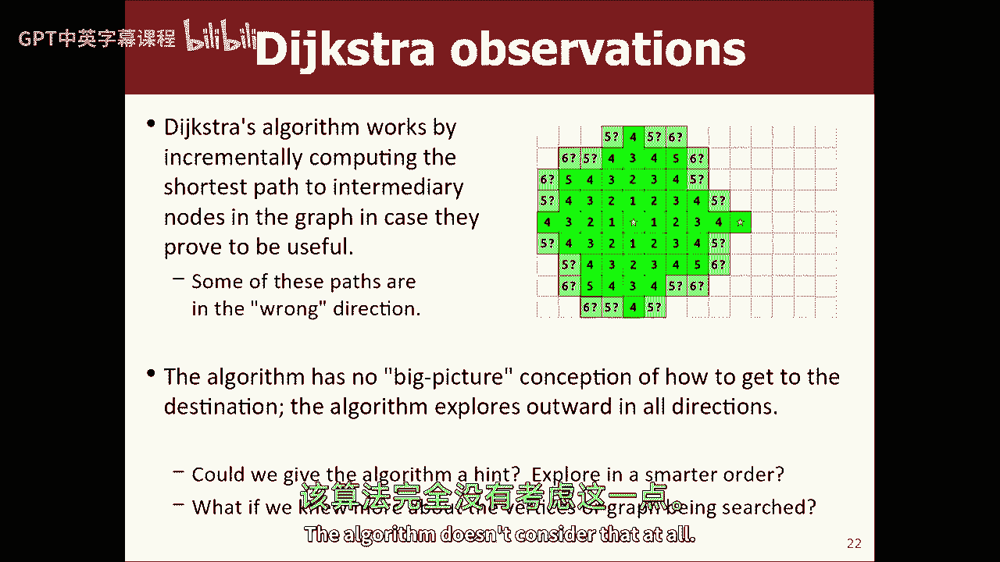

如果我们能给算法一个提示，让我们来谈谈一种叫做启发式的方法，启发式是个花哨的词，只是估计一下，有教养的猜测近似值，启发式的一个例子是当电子邮件进入你的收件箱时。

一组代码查看电子邮件并给它一个垃圾邮件评分，这条信息有多垃圾，分数是基于几件事，就像，你知道的，寄给了多少人，是谁寄来的，留言的内容是什么，留言的主题是什么，所有这些事情都是对的，基于这一切。

他们给它打分，我们认为这条信息在垃圾邮件量表上是11。6，如果超过一定的阈值，我们现在把它放在你的垃圾邮件过滤器里，你们可能知道垃圾邮件文件夹并不完美，也许你经常去那里看看，有一个真正的信息。

它不应该放在那里，但主要是对的，所以估计，这是公平的猜测，经常是正确的，但并不总是，那是垃圾邮件启发式，有时也叫做贝叶斯滤波器，但是，所以在图的上下文中，如果我们能估计中点在到达目的地方面有多好。

这就像是一个启发式，有一类启发式，我称之为可接受启发式，这些都是小于或等于实际答案的启发式，所以基本上他们过于渴望，我是故意提到这个的，因为我要教你们的算法很重要，所以一个可接受启发式的例子。

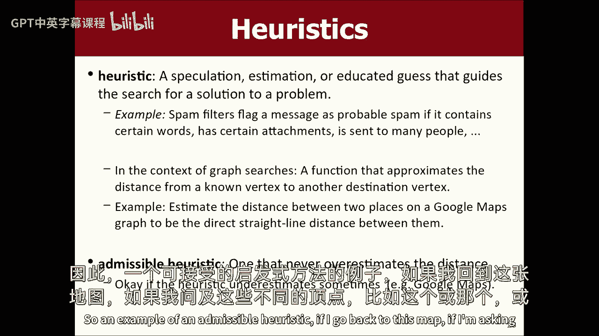

如果我回到这张地图，如果我问这些不同的顶点，像这个那个什么的，我想知道这个顶点有多好，我喜欢吗，我喜欢从这里到这里，一个可接受的启发式可能是从这里到这里的距离，就像从一个到另一个的直线距离。

这一个有一定的距离一二三四五六七八九十十一，这个距离是一二三四五六七，也许这个是七个，那个11岁，就优先级队列而言，我更喜欢七一，或者类似的东西，但还是低估了，这是个乐观的猜测。

正确的答案要么是我的猜测，要么更糟，也许有一堵墙，我得绕过去，或者一些乐观的猜测，这肯定会小于或等于真相。

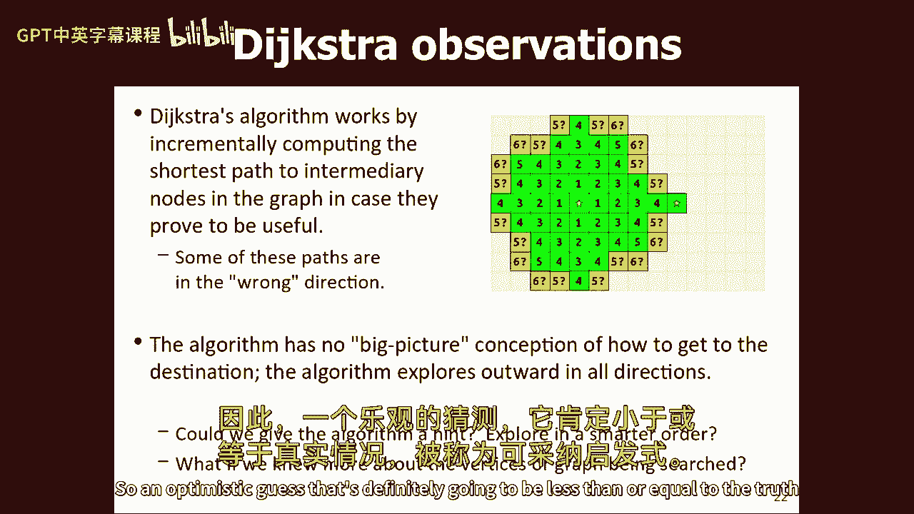

称为可接受启发式，在算法的上下文中，今天我要教你们，能够想出一个可接受的启发式是很重要的，所以这个算法是启发式的，他们总是喜欢关心距离吗，我想这是最容易理解的例子，嗯就像。

我想学生们真的会得到像这样的空间例子，因为这就像，啊，这个顶点比较好，因为它更接近那个，但想象一下，我在两个单词之间寻找单词阶梯，就像你们尝试所有不同的，你先找的面包对吧，所以你可以做一些很好的事情。

如果我把这封信改成那封信，那是一种可能的途径，如果我把这封信改成那封信，那是一条可能的道路，哪一个比较好，如果我同时考虑这两种可能性，这个与目的词不同的字母较少，我不是很肯定，我可以从这里得到目的地词。

但我喜欢这样的开始，因为它似乎离目的地更近了，所以也许在一个单词阶梯的例子中，不同的字母数量将是一个启发式，所以国家的情况是，你能做的，的编辑距离，看起来错误的字符数，基本上你可以把它加起来。

并说最小的变化和跳跃数，我必须从这里到达目标，如果每一个中间状态都是一个有效的英语单词，因此，我不能比这更快地到达目的地，但我可能需要更多的时间，所以这将是一个可容许启发式的例子，基本上，但是是的。

无论如何，空间的是最容易的，我想只是想象一下，你知道的，好啦，所以我只想说清楚，不是每个图都有顶点的启发式，有些人这样做是因为图表代表了一些我们有其他信息的东西，就像这是一个关于迷宫、地图或字梯的图表。

所以我知道一些关于这些中间状态的东西，我可以用在我的推理中，但我只是给你一些随机的图表，节点和边可能有也可能没有这样的启发式，我教你们的算法叫做星形，它是Dijkstra的改进版。

你所做的唯一改变是当你达到这个顶峰时，Q，记住，p q存储顶点是基于到达顶点的成本，你所做的唯一改变就是加入一个启发式，它是到达顶点的代价，再加上一个启发式的有多好，我想顶点是你把这些加在一起。

这就变成了该节点的p q得分，这会稍微调整PQ的排序顺序，并调整pcube的排序顺序，调整签出路径和访问路径的顺序，这将导致算法在某些图上运行得更快，所以在寻找从a到c的路径方面。

顶点是b是PQ中的顶点，它不仅有达到它的成本，从地塞米松，但它也有估计的启发式，它可能要花多少钱，从这里到达目标，我们将这些元素相加，形成您添加的元素的优先级，所以让我试着给你们看一个例子，回到这个图。

就在这里我们已经讨论过了，我是说PU里的东西的成本是字面上的，只是到达它的步数，启发式将是到目标的直接距离，忽略任何墙壁，所以像这样的东西，对于这种特殊类型的图，这将是一个启发式。

每个广场我不需要任何联系人，只是我可以告诉你一个分数，这个分数这家伙有启发式，一分，因为它就在一个广场之外，这个是两个，这个是三四五，但你会再次注意到，就像你不能在三个酒吧里到达那里，因为有墙挡着路。

但在一个完美的世界里，就是这个权利，所以这对这些人来说是一个启发式，当你这个，这是Dijkstra算法的伪码，有点斑点，但基本上是把东西从PU中拉出来，用成本把邻居放进去，这就是这个想法，这是分级的。

因为那是dykstra，恒星是完全相同的代码，但是哎呀。

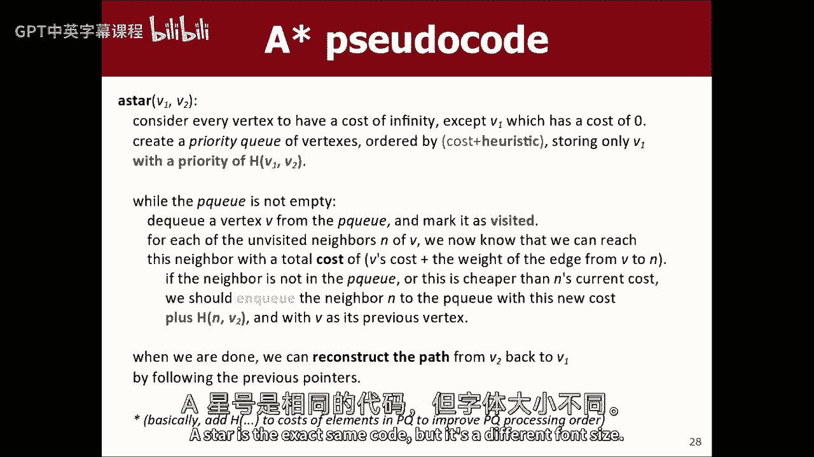

所以是不同的字体大小，啊，太烂了等等，看起来不太好，如果字体不一样，我以为你和我一样，怎么样，那工作吗？来吧，伙计。

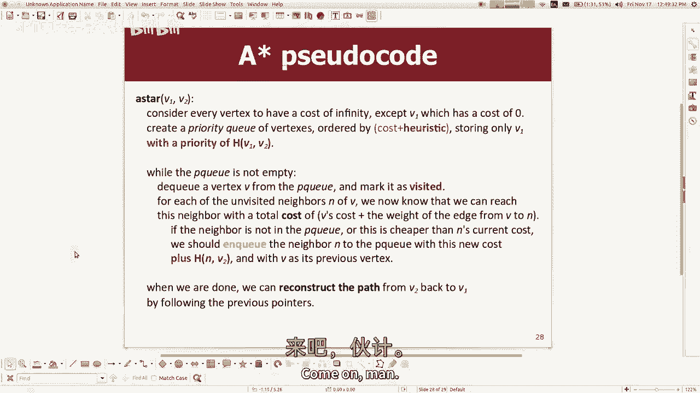

好近啊，但是看这里，它好像动了一下，哦好吧，没关系，就像，这是似曾相识，新零件的蓝色部分，而不是用目前到达它们的成本来储存东西，这就是你所做的，按成本将它们存储在PQ中，以到达它们到目前为止。

加上他们从中点到球门的神奇启发式得分，就是这样，你只是，你只要要求算法包含额外的信息，所以我的意思是，算法似乎没有很大的变化，它对行为有很大的改变吗，它很好，当然可以，哦，天哪。

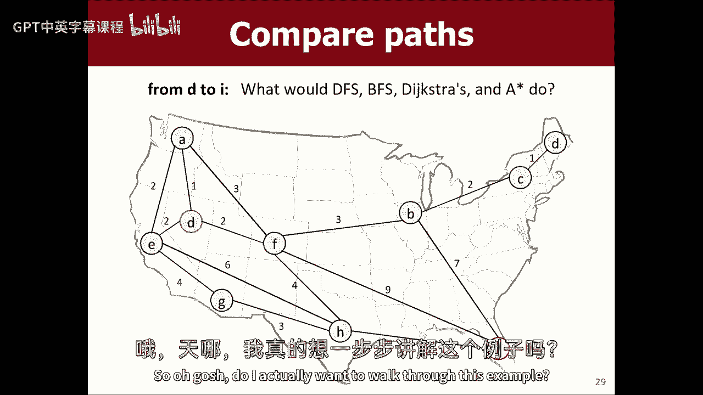

我真的想在这里遍历这个例子吗，让我做点不同的事，我想像你们必须做的家庭作业7一样跑，开拓者的事，我会运行，我认为这是最好的例子，我可以给你看，这是一张旧金山的地图，我不知道，我不去旧金山。

所以我猜这就是旧金山的样子，它实际上有很多顶点，也许我不会从这个开始，也许我会做嗯，也许我可以画张斯坦福的地图，这个很酷，这里是斯坦福，我也不常去斯坦福，所以说，是啊，是啊，我们在哪里，我们就在这附近。

是啊，是啊，我们就在这里的某个地方，但不管怎样，嗯，加州大火失控，嗯，就像如果你点击顶点，它开始正确地执行算法，所以如果我点击这里，然后我点击这里，它现在开始散开，有点难看，但就像它是这样的。

它往这边走，你知道的，它在探索两者，这很酷，如果我把算法改成星形，哦，它必须访问总共576个顶点，所以如果我把它换成星星，我运行相同的算法，它访问四个八个顶点，因为基本上它就像，它可以选择走这条路。

也可以选择走这条路，就像等待，球门在这里，那么为什么我现在不走那条路呢，如果你有敏锐的眼光，你会注意到它确实朝其他方向走了一点，这并不完全是正确的，有点偏离了道路，但它试图将其最小化，因为它不想。

它认为我想朝着目标前进，如果可以的话，也许另一个例子，我可以用这些迷宫，也是，你们以前玩过迷宫，所以如果我用Dijkstra的算法从，从这里到这里，它现在扩散得很均匀，这是一个未加权的图。

所以堤坝运行本质上是一个粘合剂，广度优先搜索，所以它就像扇形一样，它看起来不像是呈放射状散开的，但那是它在每条路径上散开，它可以径向跟随，它看着一千七百个方块，但是明星会说，嘿嘿，我从这里开始。

我想去那里，所以有点，如果我能往右边走，我想看一下，也许比左边多一点，如果我能下去，我想做的比起来多一点，所以如果我用星星做，而不是看1798个方块，它看着，八四九，所以现在我可以再运行一次，慢一点。

就像你可能会说的等等，看起来一点都不酷，好像走错路了，发生什么事了？我以为你说这样会很好，现在没有办法走那条路，所以它是在挑它能挑的东西，但是你看，你看到现在的情况了吗，它走对了很多，只要能走对。

会这样的，如果它找到一条正确的路，它真的要把它，所以我不知道这很难理解，从这个例子中，让我看看能不能找到一个不同的例子，嗯，让我看看5月7日，哎呀哎呀，停下走，五月七载，好啦，这个怎么样。

我要从这里到这里，你看到它有多想朝它走去吗，如果你仔细观察，它会离你有点远，如果你像每次结束时一样看着这些坏蛋，它会像这样，所以我想知道我到底是怎么想走那条路的，因为这就像，我想我几乎，你知道的。

真的很想走那条路，但那个没有成功，现在它有点喜欢这个，这是最低限度的看到那里，是这样的，所以算法真的像，向球门倾斜，你可以看到它这样做，它访问了五百九十一个广场，有了Dijkstra，它一点也不倾斜。

所以你会在这里和下面看到更多的东西，我觉得，所以让我们看看它有多长，加速一点，所以它只是更多，只是均匀地展开，它的价格是1千4百对5千9百1，所以你可以看到使用星型算法有很大的改进，是啊嗯，自从搜索。

我们就像停在，就像第一条路，我们不能保证，最短路径，嗯，哪里能保证我们有最短的路径，你很好，在这种情况下，这些是未加权图，在未加权的图表中，Dijkster和e星都会找到最短的路径，但在加权图中。

迪克森和一个明星可能想走一条更长的路，如果比较便宜的话，实际上，我认为这个程序将使用不同类型的图表，如果你把这些地形图，这些有点有趣，地形图是，有点难以理解，因为它看起来像一个很大的斑点，就像以前一样。

我有激光，一切看起来都像那样，基本上，但是嗯嗯，这是一张头顶地形图，就像你从太空或天空或其他地方往下看，较浅的颜色就像更高的海拔，就像山顶或山顶什么的，较深的颜色就像一个小山谷或峡谷什么的。

所以这个图的思想是你不能真正看到顶点，因为每个小正方形都是一个顶点，他们都是邻居，在那些，在他们旁边，八个方向，所以这里没有真正的墙，但上坡的优势更昂贵，所以如果你在黑暗中，你要从那边上去。

这些边缘让你付出了更多的代价，所以我想这里的想法是，如果我想从这里到这里，两者之间最直接的路径就是翻过这座山，但我不得不爬上山，走过去，走下去，但也许我要绕着山走一圈，所以如果我用。

如果我用广度优先搜索从这里到这里，让我们在这里说，它就会均匀地散开，因为它是先读的，这正是它应该做的，它就会散开，要花点时间，说下去，布雷特第一，你能做到的，哦伙计，我去把延迟关掉。

现在你可能会说等等什么，这还不是最短的，别担心那个，看起来不大对劲，但基本上死了也算一个，就像直线房子一样，所以其实扭动并不是，即使看起来不对，没关系，这是最小长度，但它就在山那边，基本上是这样。

如果我使用Dijkstra的算法，你会看到哇，太快了吧，我再试一次，戴克斯特拉算法，它是扇形的，我喜欢它，因为它看起来像你把液体倒在地图上什么的，它是不是会扩散，而且会在低处扩散，现在呢。

你会看到它有点不想上山，你看到了因为那很贵，所以它有点不喜欢走那条路，所以它之前在这些黑暗的地方流动，这不是星星，所以它不是想下去到这里，它只是想避免上坡，如果能避免的话，好啦，它试图避免昂贵的边缘。

所以它会散开，它会变得比光明更黑暗一点，它最终会找到最小重量路径，我的猜测是，与其走这条路，像以前一样，它可能会绕着山走，在这里，你可能会发现一个小切口，没有更多的侧面，稍微穿过这座山是值得的。

但可能会更像这样，我猜，让我们一探究竟，是啊，是啊，所以它穿过了一点点山，但它避开了这里最热最宽的部分，好啦，它必须查看11000个顶点才能做到这一点，让我们再看看一颗星星，你现在将要看到的。

不像迪克斯特拉，呈放射状散开，你会真正看到的，想要向球门走去，我想是的，我们试试看，所以我放慢了速度，但看看它在做什么，它下面的液体还在涌出，但涨幅不大，多下去是一回事，有点难看，但是嗯。

如果我再快一点，看看它有多想下去，它并没有像这里一样蔓延开来，更多的是往下走，现在看，它在往上一点，它确实上去了一些，你知道的，因为在某种程度上，去那里总比不去好，所以它找到了相同的路径。

相同的成本路径，但它看着，你知道4000个顶点而不是11000个顶点，是啊，是啊，启发式也是，通常被认为更有方向性，比如当启发式或某种矛盾，实际的喜欢，就像如果它是真实的路径，这实际上是更好的权利。

所以我的意思是我要稍微挥舞一下我的手，但基本上只要你有一个可接受的启发式，它不会弄坏任何东西，我是说，我们主要要注意的是，如果我们认为我们在做一些聪明的优化，但我们实际上并没有找到最小重量路径。

这是不对的，就像这里的重点是找到最小重量路径，我可以直接下去，但这不是最低重量，所以有一些优化会打破这种权利，可接受启发式的整个想法是，如果你的估计小于或等于正确答案，那就意味着它不会打破你的巅峰，问：

如果你估计的比正确答案更糟糕，它会导致一条好路在PU晚些时候走，然后你就不看了，这将对你的算法造成很大的损害，因为也许有一条更好的路，你懒得去看，但是因为我们对目标有这些积极的估计，直接去目标。

会让你达到顶峰，我们不会看着一个不守规矩的人，基本上没问题，所以我的意思是还有更多，但那是本能，这就是它的直觉，你还说了些别的，这些启发式也是，基本上是空间的，就像往那边走，他的问题是关于同样的事情。

我给他举了一个单词梯子的例子，如果我在图表中搜索单词阶梯，你可以选择去一个邻近的词，这更类似于目的地词，比如，例如，我正从，你知道的，猫变狗，所以我可以把猫变成被抓住的被抓住的O，那更接近于狗。

因为它和狗有一个共同的字母，对呀，或者我可以把猫变成老鼠，仍然有三个字母和dog不一样，所以你可以在尝试老鼠之前尝试被抓住，因为启发式地，理论上，两步就可以把被抓住的人变成狗。

而我知道老鼠至少需要三步才能变成狗右，所以这将是单词梯形图搜索的启发式，你知道这是可以接受的因为，我的估计不可能大于正确答案，如果我抓到了，我想要狗，我知道我至少还需要两个动作，所以我的启发式是两个。

所以正确的答案不可能喜欢相似，是啊，是啊，我想说，所以它得到了某种分数，就像有多好，如果你有办法精确地，相对于正确的答案，这个要好多少，这就是你想要的，是啊，是啊，所以我想我明白了法律永远不会。

这是最小到不可能的，就像发生了什么，如果你低估了秩序。

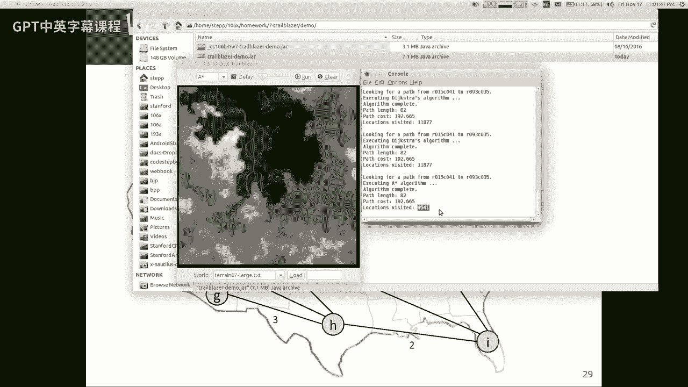

就像命令你搜索一样，就像你还在看低估，但实际上较短的路径低估了小于1的路径，是啊，是啊，是啊，是啊，嗯，我不知道我是否能给你一个答案，那真的会让你满意的，喜欢，基本上，所以我认为你说的就像。

也许我把他们是因为我的启发式，你在担心，也许我的启发式太好了，所以它在pcube中太早了，对呀，所以我的意思是我认为我能给你的最好的本能是，它会让你早早地看着某人，那会导致你过早地看某人。

对或者像这样的情况，假设你是，你的准确性总是被低估了，但接下来发生的事情是它切换顺序就像一件事，到那里实际上需要更长的距离，但它来得更早，好吧，我的意思是我不认为我有一个好的幻灯片喜欢。

我想在视觉上更容易说明，但基本上会发生的是，你可能会导致这可能会导致你走上一条路，这不是正确的答案，但在你到达终点之前，就像你会离目标更近，但你会发现，哎呀，有一些昂贵的边缘我没有考虑到。

这些昂贵的边缘会增加启发式的前成本，你到了哪里，这将导致你在PU后面要去的地方，所以从数学上来说，会让你误入歧途，但这不会导致你完全走上错误的道路，就像你会接近错误的答案，但你会停下来。

因为数字会追上你，现在你的PQ顶点会在后面推，正确的一个现在会在你前面冒泡，所以我的意思是，我不认为我有办法在视觉上，只要给你看，但就像它自己解决了一样，没有打破算法是一种方式，我想看看。

你对此有何评论，你觉得像一颗像一颗星星，哪里像，当然可以，那很好，这样想是完全合理的，Dijkstra是一个对每个人都有启发式的明星，具有零启发式，不是说得太清楚，但如果我在实现算法代码。

这可能是避免两个算法之间冗余的好方法，是呀，另一个评论，是啊，是啊，你有没有一个图表的例子，你开始的时候比我差，我有一个图表的例子，一个明星做得更糟，所以根据定义，它不能做得更糟，如果是这样，它就坏了。

所以如果一个明星做得更糟，意思是你的启发式函数错了，因此你不应该用星星，或者像你的图表没有句点。

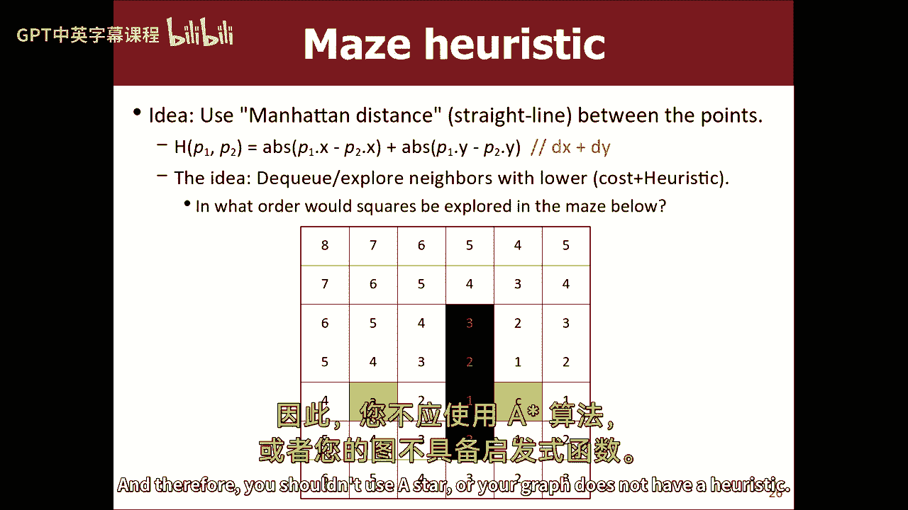

所以我就给你看看我们的开拓者节目，在这里运行一个明星是有效的，因为我们有关于身高的启发式，它也适用于运行一个明星。

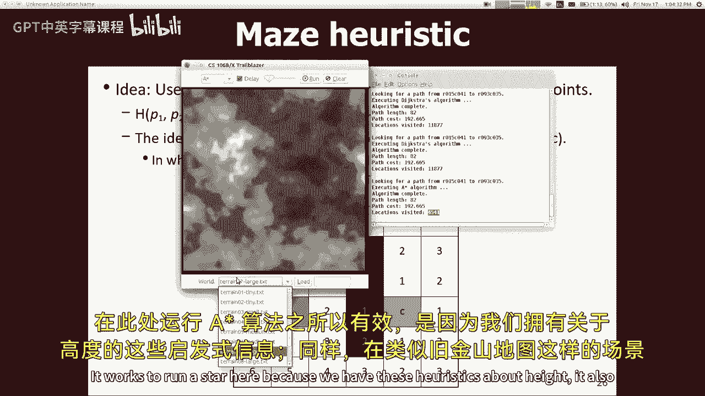

就像这张旧金山地图，或者别的什么，我可以用这里到这里的直线距离，作为我是否要走那条路的启发式，但我有一些其他的地图，就像我有一张中土世界的地图，中土世界的地图，这里的边不是基于，像x y坐标距离。

那个30岁，那个50岁，那是一条很长的边，但现在是十五，埃里克·罗伯茨教授制作了这些边缘砝码，根据他发表的中土世界的路径有多危险，根据他对，他很棒的方式，你应该多了解他，嗯，加权是基于一些非空间的东西。

对这些重量没有特别的直觉，只是因为我喜欢伊森加德，是个不错的地方，他们要把哈比人带到，那是个好地方，你不知道那首歌，谷歌一下，这首歌有十个小时的版本，嗯，没有办法，你可以直觉到确定有多好。

你可能会说我想走那条路什么的，但是边缘你没有感觉，从你所处的位置看你周围的边缘会有多波浪形，所以这个特定的图在图的信息中，我已经禁用了启发式功能，所以如果你在上面运行一颗星。

你只会得到与灵巧算法相同的结果，仅仅因为这张图表，我无法想出一个真正有效的利己主义，所以你问我，开始怎么样，如果它打破了图表怎么办，基本上如果它能，你不应该使用启发式函数，你基本上不应该有明星。

区分自身与危难，所以它总是必然的，因为它不太为人所知，而不是很好，它可能会访问相同的节点作为额外的在ristic或零，但是如果你尝试像这样应用这个，基本上看，如果你在这里用x y距离作为启发式。

你跑了一个明星，对恒星使用启发式会给你错误的路径，所以我不想那样做，是啊，是啊，所以呃，不管你是在没有启发式的情况下运行这个，或者按你说的做，所以它不会检查更少的节点，威尔，它会做Dexa做的事情。

它就会，它只会找到同样的一半，我也有道理让你点击迷宫，我的问题基本上是，你能做个迷宫吗，你就像挥舞着堆栈，所以它总是向上的，你好像很想往右边走，但你不是真的，所以一颗恒星需要比，啊。

你能让一个明星做最糟糕的事情吗，严格意义上来说是更快还是相等，不错的下降，是啊，是啊，这是个好问题，我觉得答案是，如果我，如果我做了一个迷宫。

好啦，我怎么画，别读那个，如果我做一个像这样的迷宫，我从这里开始，我想走到这里，就像你在一条路上一样，就像那样什么的，你喜欢这个迷宫是个很棒的迷宫，好啦，我想我们谈完了，所以一颗星星可能会更想走那条路。

想象一下我把中间的部分，所以它真的很长，就像，哎呀，就像一条错误的道路，所以我可以想象一个明星会更多地往那边看，这可能是件坏事，我认为最重要的是它找到的路径仍然是最小的，轻量级路径。

所以它不会找到一条更糟糕的路，我想这可能是真的，我最近没想过这件事，但我想这可能是真的，一个明星可能会看到更多，顶点在这样的例子中，这有点歪斜，伤害了一个明星，但我认为明星的部分目标是。

如果你看看我们处理的很多图表，你不可能落得如此可笑的下场，所以你依靠图表不太可能陷入，就像你必须非常仔细地构造一个图表来制作星球大战，你知道它在所有的图表中都要好得多，你可能会看到，是啊，是啊。

在这个例子中，当戴克也必须经历，是啊，是啊，我想Dikstar会去所有这些方向，所以我想Dijkstra会在某个时候来这里，所以它不会成为一个大明星，因为在明星搜索中，女性的任何路径。

似乎德威尔在搜索之前也搜索了一下，是啊，是啊，我想这可能是对的，我还没想过，如果你从来没有见过这么多带有星号的顶点，那是真的，我不知道今天的对抗性图表，但我明白你的意思，在本例中。

我想迪克斯特最终会把这条错误的道路检查到正确的地方，所以我想我的例子还没有击垮德克斯特，所以我得多考虑一下，虽然，你对，我想到了一个例子，也许有一个开始，有点来来回回，离那时越来越近。

不管是什么它都会试着往下走，因为它比，是啊，是啊，我是说，也许我们把它放在桌子上，呃，我会考虑的，我得喜欢，试着画一些邪恶的图表，看看我能不能引诱它，我觉得最重要的是，不过，你不会在恒星中走更糟糕的路。

只要你有一个有有效启发式的图，你会没事的，这不会让你得到更差的结果，那很重要，所以好吧，嗯，那现在是明星了，我之前想给你看另一件事，我们今天没时间了，等等，在哪里？

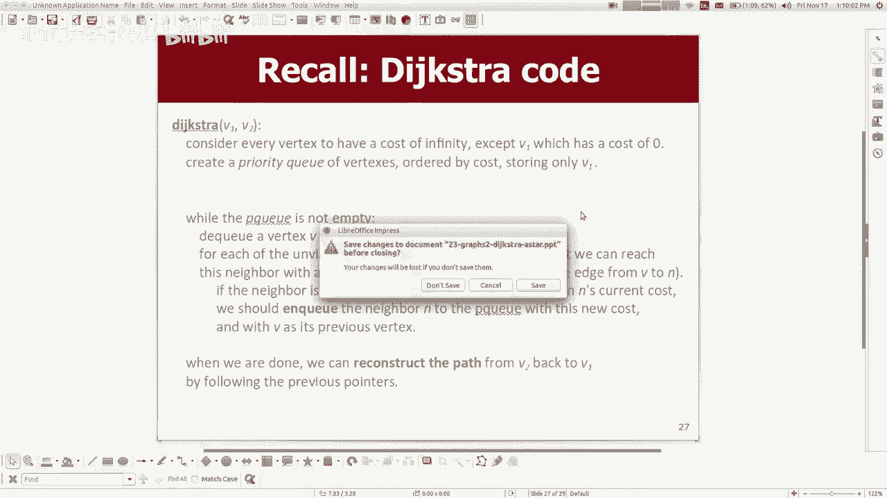

它在哪里，这个呢，我想谈谈一种完全不同类型的图算法，叫做生成树，今天差不多有时间了，接下来我会做得更多，打破它后的星期一，但是生成树是我们作业最不需要的，所以我想教你们什么是最小生成树。

我想教你们一个找到它们的算法，称为克鲁斯卡算法，所以这里有一个特殊的动机应用程序，假设我们有一个迷宫，迷宫是一个方根的方格，你知道屏幕上的二维正方形，我们的顶点就像迷宫中的小方块，我们在它们之间有边缘。

没有墙在它们之间行走，所以这些就像，这不是迷宫，因为没有围墙，基本上，但是如果你把墙竖起来，就像嗅这些边缘一样，从概念上讲，你会有一个迷宫，如果我想喜欢呢，生成随机迷宫，嗯，你知道我想要的基本上就像。

如果我剪掉一条边，就像这里，我现在基本上在这里创造了一堵墙，你们几个星期前就知道了，我在骗你，因为我基本上是在给你一个图表问题而没有告诉你，这就是我的一个洞，我喜欢强迫你做作业七。

家庭作业前的材料方式七，所以基本上生成迷宫的一种方法是，如果你把迷宫想象成一个图表，尝试生成图的生成树，生成树是当你把一个图，你把它的边缘子集，所以在图中所有的顶点都是相连的，但没有任何循环，你还记得。

循环是你绕过并回到你开始的地方，所以如果根本没有循环，你有一棵生成树，就像，下面是一个生成的示例，对不起动画不太好用，但是这里有一个左边图的生成树，我刚刚嗅出了这张图的一些边缘。

每个人都与每个人联系在一起，你接触到每个人，但没有循环和循环，你不能，你不能回到你在这个图表中开始的地方，一个完整的连通图是一个每个人都可以到达任何地方的图，这就是一个完整的图。

从每个人到每个人都有直接的优势，所以无论如何，这就是生成树，迷宫是两个D图的生成树，如果你剪掉一堆边缘，我是说如果有一个有循环的迷宫，但如果你嗅出边缘，直到你有一棵生成树，这确实是一个很好的迷宫。

是生成随机迷宫的好方法，所以好吧，这就是生成树，生成树的变种称为最小生成树，它是这样的生成树，在树的所有边缘中，你有最低的总重量，那是可能的，我的照片没什么帮助，因为我想我应该换这张照片。

但基本上这个想法是看到，我是如何嗅出某些边缘来得到这棵生成树的，但我本可以保持D而不是E对，你看，我本可以保留d，删除b，那也是一棵生成树，他们同样好吗，这个想法是，如果d的速率低于e。

我应该尽量给你买最便宜的，同时让每个人都有联系，如果你一直这么做，这叫做最小生成树，从技术上讲，它是一个生成树，没有其他可用的生成树，对于权重之和比它低的图，我的照片很烂，所以我没有在边缘写重量。

但我想我要跳过这张幻灯片，我将跳过这张幻灯片，所以我想举一个不同的例子，所以有几个例子，可以用来在图中查找扩展树的几种算法，我想教你们的是Kruskal算法，这相当简单，你在几周前的家庭作业中学到了。

你把图的所有边都去掉，您根据成本将它们放入优先级队列，然后当PU不是空的时候，你把边缘拉出来，如果那条边的端点没有相互连接，但你把边缘放回图表中，这基本上就是你在家庭作业中对这些集群所做的，对吧。

你把事物的顶点聚集在一起，这就是这个算法，基本上，所以这里有一个图表，你知道，我只是它是相同的算法，但是用一种更生动的方式写的对吧，所以现在我得到的是所有的边缘都有名字。

然后它们有与之相关的边缘成本边缘权重对吧，所以如果我把这里所有的边，算法要先看哪条边。

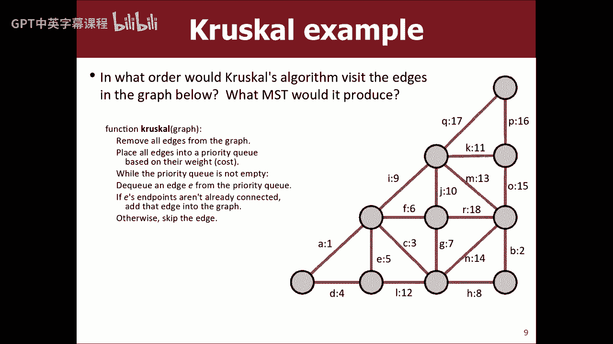

一种权利，好啦，所以让我们一起做吧，所以P Q是对的，所以我们从PQ中抽出一个，我想在图表中保留A吗，是啊，是啊，好啦，我们留着吧，我们有一个，所以这两个家伙现在是有联系的，我们把b从p q中拉出来。

我想留B吗，B在哪里，在这里，你想留着吗，是啊，是啊，你想留C吗，是啊，是啊，我当然想留下D，是啊，是啊，我没有那个顶点，基本上任何顶点我还没有，我会保持他的优势，好啦，我想留B不，因为我已经有办法。

我能把它擦掉吗，啊，全部组合在一起，等一下等一下，我可以，让我们看看，取消分组，我可以点击一个边缘，如果我只是删除它呢，哦耶，不要保存此行文件，不要保存它，所以我只是我删除了e，我不留e，我有F，做。

我想确保，我们留着吧，因为我还没有这个人，呃，那么g do呢，我想留着G不，我已经得到了这两个顶点，我已经可以联系到他们了，我不要那个，呃，我想要H，我想我知道，因为这里的这些人聚集在一起，对了。

这两个在一个集群里，这些团块还不能到达彼此，所以让我们保持h do，我想要，I，加上这个新来的家伙，当然，我会留意的，J do，我想要J不，好啦，这是一个新的顶点，所以我会保持他的权利，十二点在那里。

是或否，否，我已经够到他们两个了，他们已经有联系了，我十三岁，我想那样吗，我想没有，因为我所有的人现在都连成一团，难道他们不喜欢我，如果我，如果是M，把这家伙和这家伙联系起来。

我可以一路绕着这里到达目的地，所以我不需要我，好啦，那n呢，我不要，因为我已经可以联系到那些人了，哦十五，我不需要那个，我可以绕过去，P在上面，我还没抓到这家伙，所以我会保持PQ是17，我不需要那个。

因为我已经可以到那里了，然后我们有我们的，我想我不需要弧线，因为他们已经联系在一起了，这就是我的最小生成树PowerPoint风格，我们知道根据算法的性质，我们知道这将是最低重量，因为它先看便宜的边缘。

所有这些东西，所以你们基本上已经实现了这个算法，所以我不会在这上面花那么多时间，对吧，但现在我们正在重新考虑，作为一个图形问题，现在呢，它的许多实现挑战仍然是一样的，跟踪集群，但你们之前已经考虑过了。

所以这对你来说应该不难，但如果我给你一个基本的图形对象，我想让你做最小生成树的事情，你可以做对的，这就是克里斯奥尔的算法，如果我再运行那个开拓者程序。

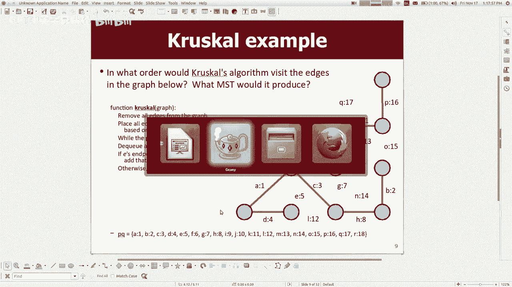

它对算法的作用是，如果你说我想要一个随机的迷宫，它将在一个连接的迷宫上运行kruskal。

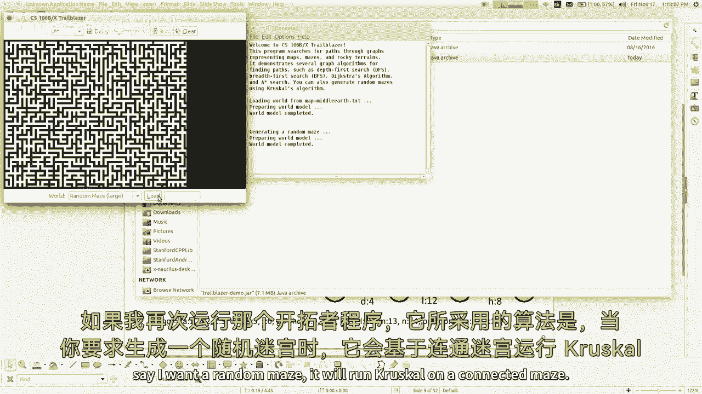

我不知道为什么它做得这么宽，但你想看到一个巨大的迷宫，让我们做一个随机的色调迷宫，巨大的迷宫，哇塞，让我们在这东西上看到一些星星，所以无论如何，你要在这些图表上写Kris Gal的代码，你要移除边缘。

直到生成一个随机迷宫，最终要花很长时间，因为我认为既然它是一个最小生成树，我想这意味着实际上只有一条路可以到达出口，所以一种方法可能就像真正的迷宫，它没有停止，它还在工作，它是，情节扭曲从地图上消失了。

是啊，是啊，就像那样什么，那个愚蠢的谜题是什么，就像，你得到了九个点，你应该用四条线把它们连接起来，你走右边，什么事？你就像一个，你最终会在那里，好像我做错了，你是做什么的，你就像那样，你得到了所有的。

或者任何权利，你用四条线把它们连接起来，所以嗯是的，那是一回事，所以无论如何，那是克鲁斯卡的算法，所以你的任务，我是说你看到了所有这些不同类型的图表，就像小地图，你看到了迷宫，你也看到了那些地形高程图。

你的代码不关心这个，我只是给你一个基本的图形对象，可能与这三件事中的任何一件，所以你不必担心它是哪种类型的图，然后我只要求你运行深度第一搜索广度，第一搜索Dijkstra算法，或者上面有星星。

你只需要实现那些算法，我们已经全部了解了，然后第五个函数你答对了，你得创造一个随机的迷宫，利用克里斯·斯凯尔斯的算法，所以这就是作业七，我想你们应该能处理好，嗯，还有更多，我将在周一休息后谈谈图表。

但在第八作业之前我们不需要剩下的，所以我就到此为止，希望你们感恩节假期过得愉快，去休息一下，见你的家人和朋友，玩得开心点，一周零几天后见。

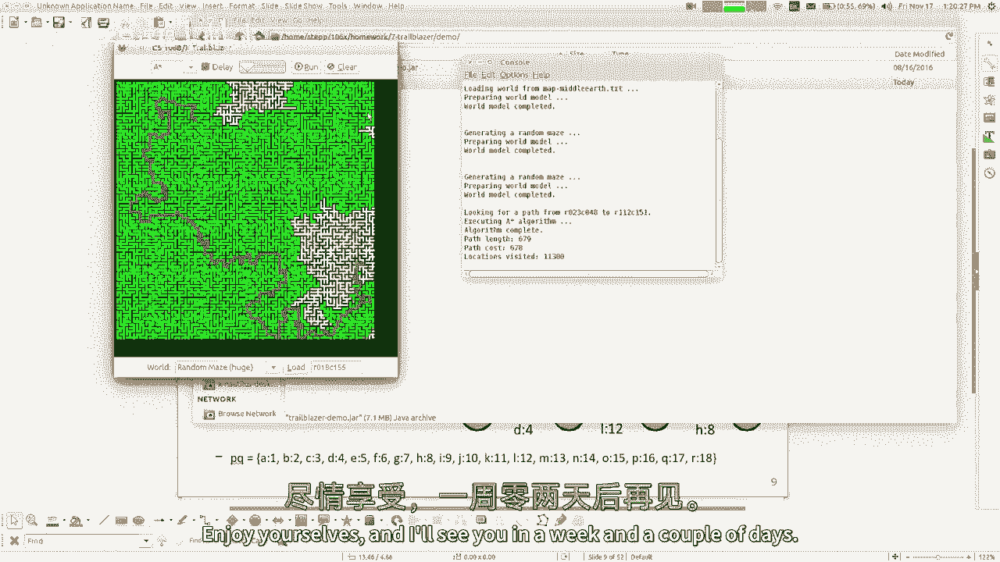