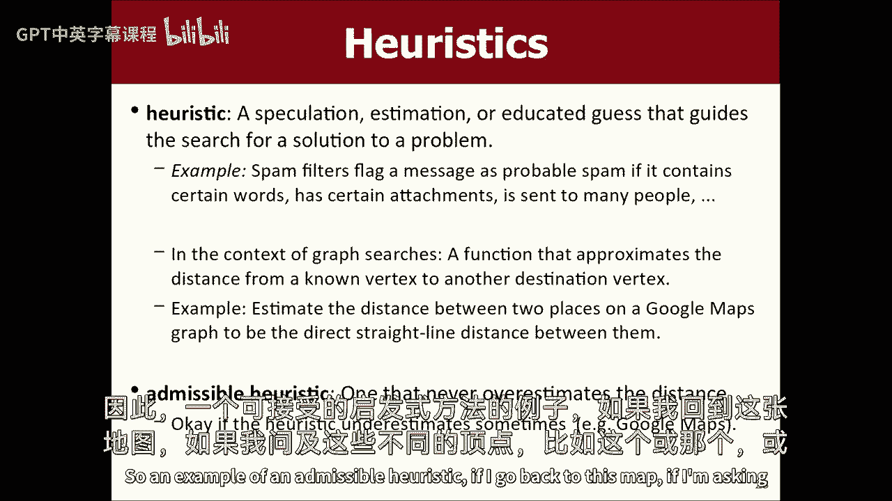
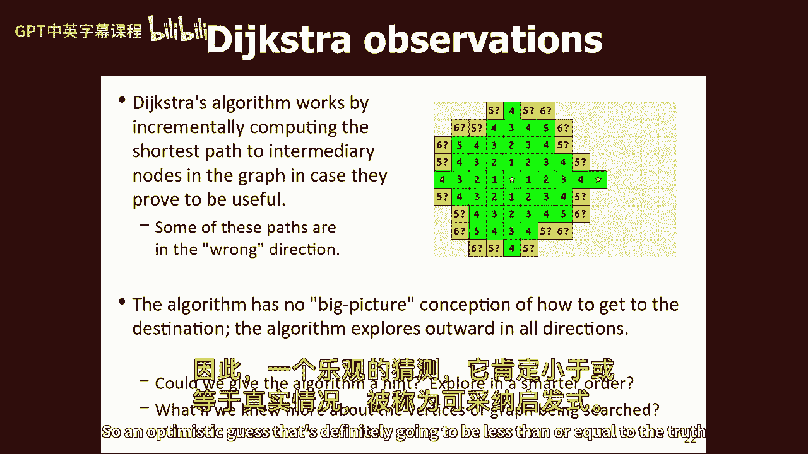
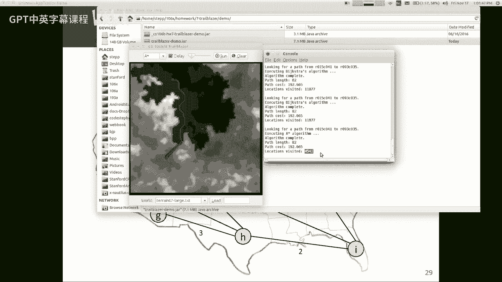
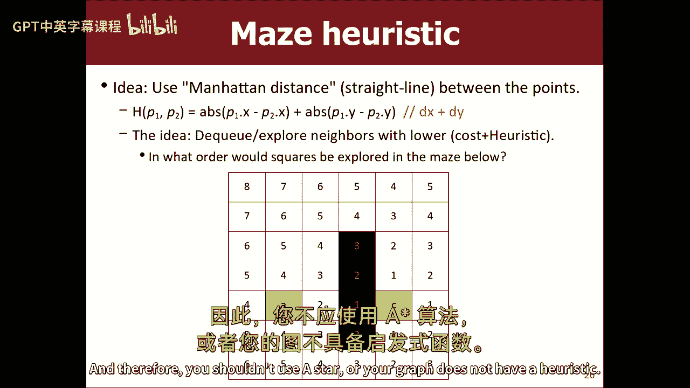
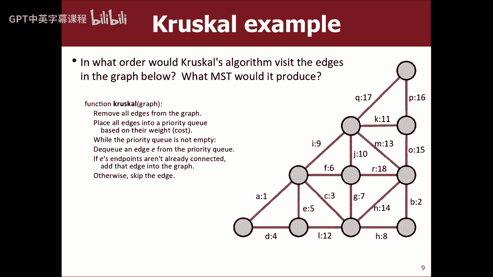
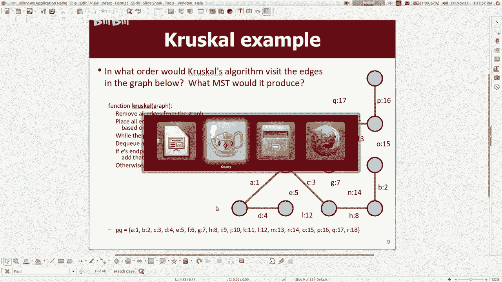
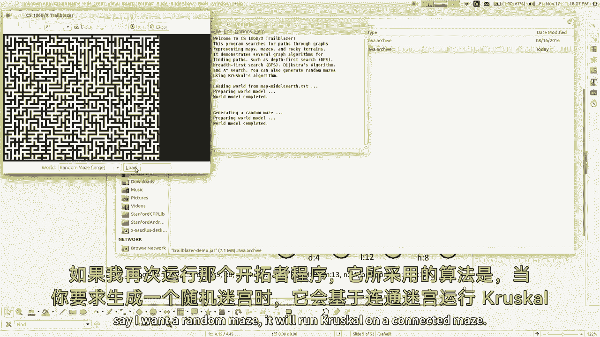
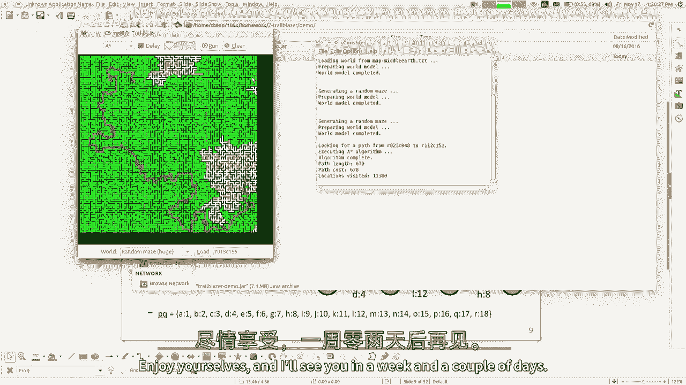

# 课程21：A*搜索与Kruskal算法 🧭🌲

在本节课中，我们将学习两种重要的图算法：A*搜索算法和Kruskal最小生成树算法。我们将了解A*搜索如何利用启发式信息优化路径查找，以及Kruskal算法如何构建最小生成树。


---

## Dijkstra算法回顾


上一节我们介绍了Dijkstra算法，它用于在加权图中找到从起点到所有其他顶点的最小成本路径。

Dijkstra算法的核心是使用一个优先级队列（Priority Queue），该队列根据从起点到当前顶点的已知最小成本进行排序。算法总是优先探索成本最低的路径，从而确保找到最小权重路径。

**伪代码核心思想**：
```
将起点加入优先级队列，成本为0。
当优先级队列不为空时：
    取出当前成本最低的顶点u。
    如果u是目标顶点，则结束。
    对于u的每个邻居v：
        计算从起点经过u到达v的新成本 = cost[u] + weight(u, v)。
        如果新成本小于已知的cost[v]：
            更新cost[v]为新成本。
            将v及其新成本加入优先级队列。
```

在非加权图（或边权均为1的图）中，Dijkstra算法的行为退化为广度优先搜索（BFS），因为所有路径的成本增长与路径长度成正比。

---


## A*搜索算法介绍 🎯

本节中，我们来看看Dijkstra算法的一个优化变体——A*搜索算法。A*搜索在Dijkstra的基础上，加入了启发式信息来引导搜索方向，从而在某些情况下大幅减少需要探索的顶点数量。



### 启发式函数



启发式函数 `h(v)` 是对从顶点 `v` 到目标顶点 `G` 的**剩余成本**的估计。它是一种“有根据的猜测”。

一个关键的启发式类型是**可接受启发式**。可接受启发式永远不会高估从当前顶点到目标的实际成本。即对于所有顶点 `v`，满足：
```
h(v) ≤ 实际从 v 到 G 的最小成本
```
例如，在网格地图中，从当前点到目标的直线距离（曼哈顿距离或欧几里得距离）就是一个常见的可接受启发式。

### A*搜索的工作原理


A*搜索与Dijkstra的唯一区别在于优先级队列的排序依据。


在Dijkstra中，优先级依据是 `g(v)`，即从起点 `S` 到顶点 `v` 的已知最小成本。
在A*中，优先级依据是 `f(v) = g(v) + h(v)`，即已知成本加上到目标的估计成本。

**A*搜索伪代码修改部分**：
```
当优先级队列不为空时：
    取出当前 f(v) = g(v) + h(v) 值最小的顶点u。
    ...（其余步骤与Dijkstra相同）
```
通过将启发式值 `h(v)` 加入优先级计算，算法会倾向于探索那些“看起来”更接近目标的顶点。

### A*搜索的优势与注意事项

A*搜索在拥有良好启发式信息的图上效率显著高于Dijkstra。它访问的顶点更少，能更快地找到目标。

然而，使用A*搜索有两个重要前提：
1.  **图必须包含启发式信息**：例如地图坐标、单词阶梯的编辑距离等。对于普通的抽象图，可能没有合适的启发式。
2.  **启发式必须是可接受的**：如果启发式高估了实际成本，可能导致算法找不到最小成本路径。当启发式函数为 `h(v) = 0` 时，A*搜索即退化为Dijkstra算法。

**核心公式**：
```
f(v) = g(v) + h(v)
```
其中：
- `f(v)`：顶点v的优先级分数。
- `g(v)`：从起点到v的实际最小成本。
- `h(v)`：从v到目标的启发式估计成本（必须可接受）。

---

## 最小生成树与Kruskal算法 🌲

现在，我们转向一个不同类型的图问题——寻找最小生成树。这在创建网络连接、设计电路或生成随机迷宫等问题中非常有用。

### 什么是生成树？



一个图的生成树是包含原图所有顶点的子图，并且是一棵树（即连通且无环）。生成树中的边数恰好是顶点数减一。

### 什么是最小生成树？



在加权图中，最小生成树是所有可能的生成树中，**边的权重总和最小**的那一棵。


### Kruskal算法步骤

Kruskal算法是一种贪心算法，用于寻找最小生成树。其思路非常直观。


以下是Kruskal算法的步骤：

1.  **初始化**：将原图的所有边放入一个优先级队列（最小堆），按边权重从小到大排序。
2.  **创建独立集合**：将每个顶点视为一个独立的连通分量（或“集群”）。
3.  **迭代加边**：
    - 从优先级队列中取出当前权重最小的边。
    - 检查这条边连接的两个顶点是否属于同一个连通分量（使用并查集数据结构高效判断）。
    - 如果**不属于**同一个分量，则加入这条边（合并两个连通分量）。
    - 如果**属于**同一个分量，加入它会形成环，因此舍弃这条边。
4.  **终止条件**：当加入的边数达到 `(顶点数 - 1)` 时，算法结束，此时已构成最小生成树。


**算法核心思想**：始终尝试添加当前可用的、不会形成环的最便宜的边。

### Kruskal算法示例

假设我们有一个图，其边和权重如下：
```
边: A-B (1), A-C (4), B-C (2), B-D (6), C-D (3)
```
以下是执行过程：
1.  选择最便宜的边 A-B (1)，加入。
2.  选择下一个最便宜的边 B-C (2)，加入。
3.  选择下一个最便宜的边 C-D (3)，加入。此时已连接所有顶点，且边数为3（4个顶点-1）。算法结束。
4.  边 A-C (4) 和 B-D (6) 被跳过，因为加入它们会在已连通的顶点间形成环。

最终得到的最小生成树总权重为 1 + 2 + 3 = 6。



---

## 总结

本节课中我们一起学习了两种强大的图算法。





首先，我们深入探讨了**A*搜索算法**。它是Dijkstra算法的优化版本，通过引入一个**可接受的启发式函数** `h(v)` 来估计到目标的成本，并将 `f(v) = g(v) + h(v)` 作为优先级，从而引导搜索方向，显著提升效率。记住，启发式的质量至关重要。

接着，我们学习了**Kruskal算法**，用于求解加权图的**最小生成树**。该算法采用贪心策略，不断选取权重最小且不会构成环的边，直到将所有顶点连通。实现的关键在于使用**优先级队列**排序边，以及使用**并查集**来高效管理顶点间的连通性。



掌握这两种算法，你将能够解决更广泛的路径规划和网络优化问题。