# 【编程抽象方法 cs106x 2017】斯坦福—中英字幕 - P22：Lecture 22 - Inheritance, Hashing - 加加zero - BV1By411h75g

最近怎么样？人们欢迎好的回来，这是呃，星期三，现在是第十周，我不知道你们做得怎么样，你们把休息算作第九周，今天是第十周，所以这是第九周，你们这些家伙，是呀，我不在乎什么，你数数，我的日历上写着第十周。

所以现在是第十周，这是第九个，真实周，我想是的，不管要看情况，无论你是从零开始数还是从一开始数，计算机科学的东西，我们一直在做图表，在这一点上，我们基本上完成了图表，当然，关于图表，你可以说得更多。

但我们得把它留到改天的其他课上，我们也谈了一点关于继承的问题，今天我会多讲一点，第八个也是最后一个家庭作业现在结束了，昨天涨了，这是一部份，我知道你厌倦了这些多部分的任务，所以最后两个任务。

你们只有一部分，每个家庭作业八个被称为斯坦福，一二三，你得做一个电子表格，它基本上是一个非常普通的矮胖版本，像Excel或谷歌工作表，或者类似的东西，嗯，作业中最难的部分是重新计算所有的公式。

就像如果细胞互相引用，就像这个等于那个乘以那个什么的，你得计算出所有这些值，这些值之间存在依赖关系，我想让你代表电子表格中的单元格，使用图表，基本图对象，所以作业规范谈到了所有这些。

单元格中也有不同类型的值，可能只是一个数字，也可能是对单元格的引用，也可能是一个公式，也可能是一系列细胞的功能，单元格中有这些不同类型的值，这些值被表示为继承层次结构中的对象。

你必须实现这种行为的一小部分，的值，所以这里面有一点遗传，不管怎样，你可以晚点再看，下星期五到期，所以这是应得的，你知道在这里，我只想澄清，你知道你可能不想交家庭作业，我建议晚点。

因为那个周末是你准备期末考试的时候，也就是下星期一，所以如果你在八号任务上迟到了一天，你在浪费期末考试的学习时间，所以我不推荐，还有一件事，因为我们得给作业打分，我最多只能让你用一天的时间做家庭作业。

我不能超过一天，所以说，不管你是否还有迟到的日子，星期一六点以后就不接受了，所以我想就像，如果你想过危险的生活，你可以晚一点做作业，你可以在12月11日星期一上午参加期末考试，十一点半你可以跑回家门口。

你有大约六个小时完成家庭作业，在翻页被切断之前，我不赞成这种想法，但是嘿，你知道的，你们中的一些人喜欢生活在危险中的刺激和冒险，是啊，是啊，嗯好吧，无论如何，所以说了这么多，我们今天和明天要做的是。

我今天要做更多的遗产，然后我将继续讨论哈希集合是如何实现的，和哈希集哈希图，我今天的目标是深入一点散列，即使它被列为明天的话题，我只是想在这方面先行一步，本周你的部分也会有一些关于继承和哈希的问题。

好啦，所以让我们回到我关于继承的幻灯片，我们已经知道什么是继承，它是类之间相互关联的时候，当他们建立在彼此的基础上，一种亲子关系，基类和派生类，我向您展示了继承的一些语法，你还记得在C++中。

如何指示一个类是另一个类的子类，你怎么说你只是把一个冒号，然后将父类名称正确，就像我们有一堂课叫。

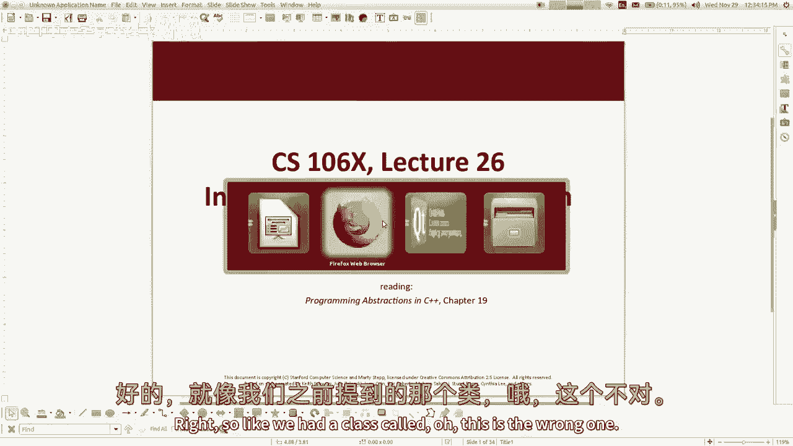

啊，这个不对，我们有一个叫雇员的班，员工看起来是这样的，只是用一些非常简单的方法来获得假期和工资之类的东西，然后嗯，然后我们发现如果你想写一门叫律师的课，律师说它用这个冒号延伸员工，对呀。

所以这是大部分，另一件事是我教你虚拟这个词，这是怎么回事为什么我需要知道，当我做遗产的时候，那有什么用，是呀，我们可以允许方法被类覆盖，基本上，它只是向编译器表明你可以，如果子类重写此方法。

如果你真的想知道更多，这里有一个叫做动态方法绑定的概念，有时称为虚方法绑定，这个概念的意思是，这个程序是否应该弄清楚，在编译时和运行时执行哪个方法，长话短说是虚拟手段，在运行时选择方法。

这真正意味着如果你有一群员工，但他们中的一些人是律师，他们有些是医生有些是秘书，它实际上在运行时，询问每个对象，你有什么方法，我到底该叫哪一个，而不是调用同一方法的公共基版本，但不管怎样。

不管是什么简单的版本，如果你说虚拟，它允许子类重写方法，我想我在上一节课简单地提到过，但即使你不说虚拟，编译器将允许您重写方法，它将允许它不会犯错误，但问题是在很多情况下，它实际上不会使用新版本的方法。

您在子类中编写的，所以它基本上不会做你想做的事情，我会试着说明这一点，我还没有一个运行的程序，为了说明其中的一些事情。

所以好吧，这就是我们目前的情况，那我在哪里，所以我们讨论了重写一个方法，我们讨论了如何让这个关键字虚拟，好啦，好吧接下来是，如果您想要一个子类构造函数，调用超类构造函数，我们有一个奇怪的语法。

在那里你知道，在这些花括号里，你只会说打电话给超级，然后在括号中，您将传递您想要传递的参数，但在C++中，就像这个冒号，我觉得你应该这样想，当你说冒号的时候，一些事情，意思是这个是基于那个。

所以这个构造函数是基于调用另一个构造函数，有了这些其他参数，在那之后如果你还有什么想做的，你把它放在花括号里，所以我举的例子是。

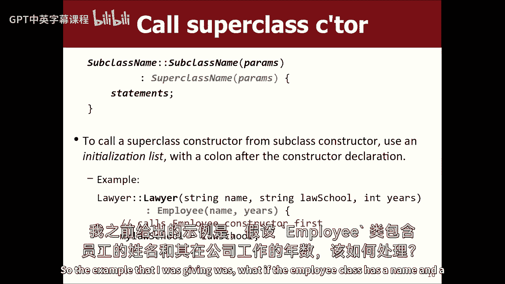

如果雇员类，雇员类有一个名称，员工在公司工作的年数，然后这些字段在构造函数中被初始化，所以如果我看构造函数，它设置对象的名称，物体的年份等于你在这里传递的这些值，好的好的，所以如果你有律师。

那是雇员的子类，律师也一样，你知道他们的名字和在公司工作的年限，但律师也记得他们上的是哪所法学院，所以也许这三个都是构造函数的参数，所以也许你会有像私立弦乐法学院这样的学校。

或者我想我会把它叫做我的法学院来匹配另一份文件，所以现在在律师构造器中，你所做的就是你说，嗯，此构造函数基于使用此名称和此年数调用该构造函数，所以它基本上用这两个参数调用super，在那之后你会说。

你知道的，我的法学院等于法学院，所以这是这里的部分，那是律师独有的，构造函数，你可能会说很好，我不想这么做，这是愚蠢的，也许我会说我的名字等于名字，我的耳朵等于年，那只是我，直接设置所有三个字段。

它不让你这么做，嗯，因为哦，没有目标是什么，我想我有一些杂乱的文件，我得在这里刷新一下，我再试一次，是啊，是啊，但我想我把那份文件处理掉了，我不是还好吗，那里，我还有其他的问题，我的生活中有很多问题。

但目前这样不行，它不让我直接把那些，你明白我为什么喜欢律师吗，它里面有一个变量叫做挖掘，它内部确实有一个变量，呼唤我的耳朵，因为它从员工那里继承了这些，但是，我不允许在这里的构造函数中设置它们的值。

你知道为什么吗，是呀，因为它们是私人的，更多，是啊，是啊，这是对的，因为这些变量被声明为私有的，在父类中，在雇员阶层，子类不允许访问超类中的私有内容，即使他们有那些东西，他们也不允许看它们。

原因在Java中类似，我们不想让子类违反，类的封装，他们在扩展，所以说，好啦，所以我不能这么做，但如果我可以调用员工构造函数，员工构造函数会为我做这件事，所以基本上这就是我这样做的原因，现在呢。

有些人问得很好，而不是这种语法，我可以写员工的名字吗，把它放进去，使其看起来更像普通代码，或者一些不起作用的东西，因为从技术上讲，它构造了一个雇员类型的匿名对象，然后把它扔掉。

它没有初始化我有那些名字和耳朵的权利，你得这么做，我回放一下，你得这样做，好啦，这就是C++是如何做到这一点的，所以就这样做吧，好啦，是啊，是啊，那么是否与使用相同的语法有关，类似于其他方法，哦。

有没有办法在其他地方使用这种语法，我不认为你能用其他方法做这件事，这个是你可以用这个，即使你不继承遗产，它被称为实例初始化器列表，就像在上流社会，员工超级班，这里没有遗产对吧，它不是任何人的子类。

你可以这样做，你可以做冒号，我的名字，说出我的耳朵，年份，然后这里什么都没有，呃这意味着，基本上把这个初始化为那个，初始化为，你可能会说为什么这比我以前的好，以平等的陈述，某些领域。

尤其是作为引用的字段，必须使用此语法初始化，否则它们不能正确初始化，但这有点奇怪，就像C+加垃圾一样，所以我没有选择详细说明这件事，但基本上您可以在其他地方使用这个冒号语法，但我想让你知道的主要地方是。

从一个构造函数调用另一个构造函数时，因为这基本上是正确地，确保这个律师的所有三个字段都被正确初始化，好啦。

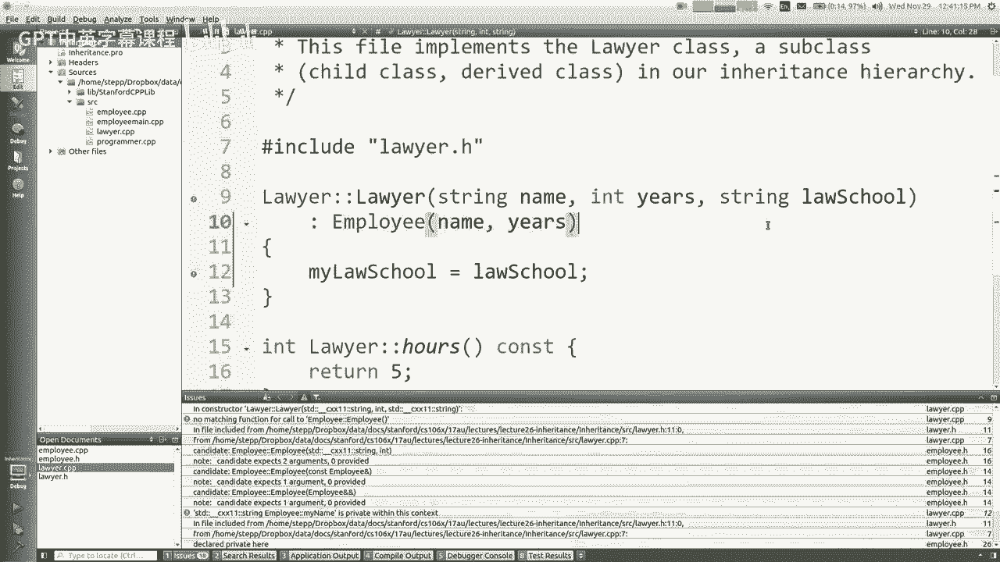

好吧我们继续，所以我想我已经这么做了，如果您有方法的子类版本，就像方法的重写版本，你想把超类版本，您只需编写超类名称，冒号，冒号，然后是方法名，它就会叫它，里面没有喜欢的超级关键词，在这些地方。

java会使用super关键字，其他语言有其他关键字来表示这个概念，C加+没有一个，所以只写类名就是这整个，就像你想要的如何构造这些属性，是因为你继承了，就像法学院的情况一样。

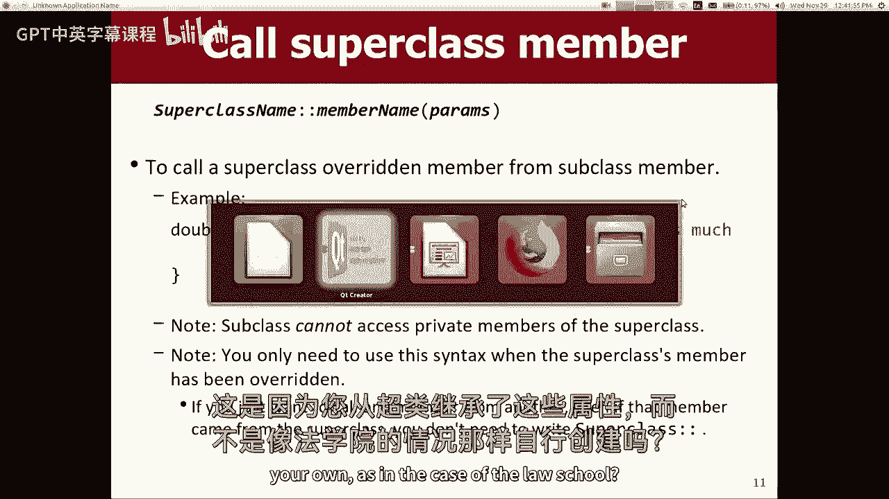

就像这里，是啊，是啊，我必须这样做的原因，是因为被称为我名字的岁月的名字，我在私人变量方面的岁月，我没有宣布我的超类在我的超类中做的那些，从那个超级类继承，我有那些变数，超级阶级要求他们只对他们保密。

所以即使我有他们，只有该类才能编写操作它们的代码，所以我必须调用他们的代码来设置他们的值，而我在法学院的律师课堂上宣称，所以这就是为什么我可以直接修改它，是啊，是啊，当你打电话给员工指导员时。

你能做几年减一年吗，或者像一些函数调用，是啊，是啊，当然，我可以用年乘以二减三，或者你知道一些表达，我基本上是把这两个参数传递给员工构造函数，它使用这些值来初始化，所以是的，当然，好啦，呃。

你有两个问题，你和你有，我们有一个超级，就像，它叫，在C++中没有super这样的关键字，不幸的是，在这个上下文中，名称和年份是传递给构造函数的这些参数，相对于在员工中，田名是我的名字和矿工，我的名字。

所以现在因为他们是私人的，律师不能直接接触他们，但是如果超类有返回值的方法，我可以把这些方法，这样我就可以通过调用年数的方法来问我的年数是多少，所以它就像一个只读，这很常见，行动正确，你有一个私人领域。

但是返回该字段值的公共方法，然后你的问题，如果你想打电话给，超类的构造函数，一个太笨拙的表达式，不能写在那里，哦，我明白了，就像你不想喜欢的那样，在…的字符上循环，也许你想喜欢，搭一些疯狂的弦。

然后把那个传过去，是啊，是啊，你在下面写一个叫做helper的方法，就是这样，然后在那里叫结束，所以你所做的，你知道的，是的，是的，是的，是的，所以我的意思是，这些东西是相当简单的，只是有点像。

C++是如何做这些事情的，我已经知道如何在。

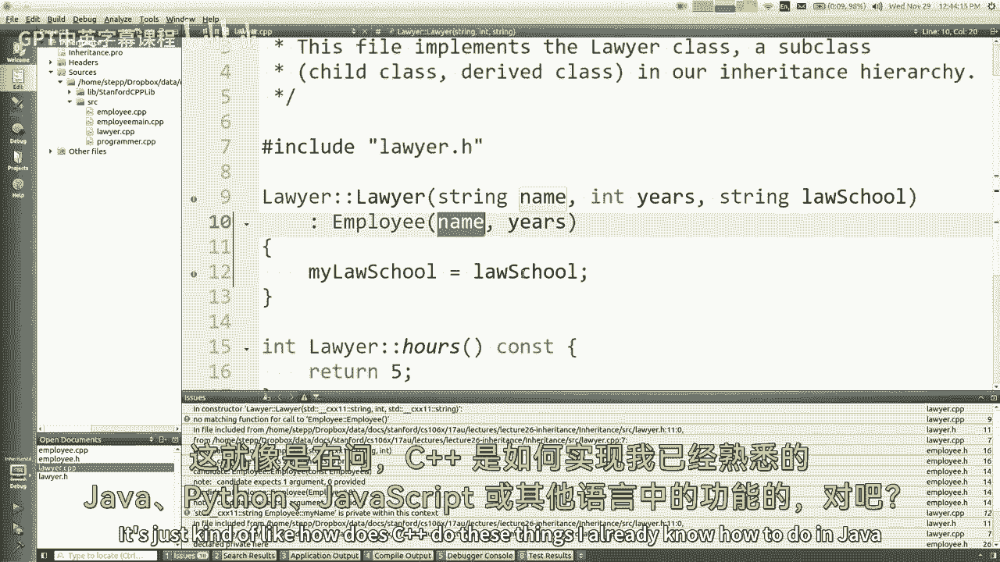

Java或Python或JavaScript，或者任何权利，好啦，所以让我们继续一点点，关于遗产我还想说几句，既然我们谈到这个问题，有些地方你不想使用继承，我想有些人一旦学会了继承，他们他们有点结束了。

应用它来解决不同种类的问题，他们说，哦好吧，嗯，我有一门课几乎可以做我想做的事情，但我想要一些不同的东西，或者更多一点的东西，所以我会延长它，有时候，这是正确的想法，有时不是，但就像这里的一些例子。

我会声称你不应该使用继承，因此，假设您有一个存储x和y的点类，它是一个二维坐标，我说，哦，我想要一个三分，我想要一个z坐标的，所以让我们扩展点2d，使一个点3d，我只要加上z坐标，现在我三个都对了。

另一个例子是，我有一个矩形类，它有宽度和高度，正方形是矩形的子集，所以我会做一个正方形的类，我将调用矩形构造函数，我将通过与高度相同的宽度，现在我有一个方形的凉爽，我也不必重写，矩形内部的所有代码。

所以你知道你可以用继承来解决这个问题，或者有些人喜欢，他们想要的正方形的另一种方式，要实现的超类和矩形，或者别的什么，但是嗯，你也可以有一个叫做排序向量的，在那里你知道，你有一个法向量。

您可以在任何需要的地方添加元素，任何你想要的订单，但我想要排序的向量，无论在哪里添加元素，它将始终保持元素的排序顺序，所以我将扩展向量，我会写排序向量，我将重写add方法，你知道的。

把元素放在正确的位置，你知道的，所以我们把，所以说，我的主张是，所有这些都不是使用继承的好地方，即使它们最初看起来是好主意，你知道为什么在这种情况下使用继承是不好的吗？你说这些听起来不错，我喜欢这些。

啊，这里有什么问题，你觉得怎么样，是啊，是啊，几乎所有的方法都要内部，需要做什么，你说方法需要重做，就像如果你在做这些中的哪一个，你在哪里能想到这样的例子，我是说任何时候你用这种矢量，你得注意维持秩序。

任何时候你和第三点D一起工作，你需要和Z板一起工作，喜欢和焦点一起工作，是啊，是啊，我总是想到的例子与点类是像距离，你知道如果你有两点，你想计算它们之间的距离，是xy距离，所以你把dx的平方根。

加dy平方，或者类似的东西，但现在如果你有一个三维点，而不仅仅是这种距离，三点可能在这里，所以你有一个第三维度，不同的公式，但是现在代码可能会混淆，比如你把一个二维点和一个三维点之间的距离。

或者一个三维点和一个二维点的区别，就像有很多奇怪的情况，它可能会做错误的事情，也可能会让人困惑，您可能必须重写代码，它可能真的有虫子，在某些情况下，可能会产生不同的结果，如果你传递论点，这是不同的顺序。

听起来很糟糕，所以是的，这似乎很不幸，我总是想到的，在这个矩形的例子中，矩形有宽度和高度，它可能有一个方法，比如设置高度或设置宽度什么的，所以现在如果是正方形，如果扩展矩形并设置宽度，你打破正方形了吗。

还是设定宽度，也调用设置高度以保持正方形，但就像你可能会说的，我把它修好了，又成正方形了，你知道如果你如果我覆盖设置宽度改变高度二，如果我重写设置高度也更改宽度，现在它总是一个正方形。

它不会打碎任何东西，但我认为一个人被递给一个长方形的物体，但暗地里它是一个正方形的物体，当他们调用set width时，他们不指望高度会改变，令他们惊讶，如果发生这种情况，你知道我的意思，原来你是你是。

你让这门课，对于使用类排序向量的客户机来说，这有点令人惊讶，就像你知道的一样，Vector有一个插入方法，该方法接受索引和值，对呀，好啦，所以如果我给你一个矢量物体，但秘密地作为一个排序的矢量对象。

所以你在索引2调用插入，你把这个值，但现在，就像我重写插入，把它放在正确的排序位置，看来，好啦，我把事情处理好了，所以好吧，罚款，但是怎么了？听起来你要跳进去，你想说什么不好吗，关于那个场景。

就像你把它加到，如果您正在编写代码，知道你把它插在哪里是明智的，然后你看起来更好，它实际上是一种，不会是，是呀，就像，如果我在索引2插入一些东西，然后我立即问矢量，指数2是什么。

我完全希望它是我刚刚插入的东西，然后我插入一些东西，其他人就在那里，就像什么，那是什么，我刚才不是这么写的，所以这些例子会让客户大吃一惊，那是在使用代码，有一个原则叫替补能力清单原则。

谷歌芭芭拉·利斯科夫，她是巡回演出奖得主，我相信她是第一位获得巡回演出奖的女性，我可能错了，但是她，她想出了这些，其中一些重要的操作概念，你知道的，不应该使用继承的地方，对她来说，这个想法就像。

如果你不能用一个代替另一个而不感到惊讶，那是对遗产的不良利用，所以我们所说的这些地方，如果在子类对象中替换，它会做一些奇怪的事情，客户不会，所以你，您通常应该找到一种不同的方法来实现这种功能。

把第三点分开，也许把广场分开就好了，有时人们有一个诀窍，他们把一个超级阶级，像长方形或四边形之类的，然后这两个人都扩展了，所以你可以找到一种方法来共享代码，不用说他们中的任何一个都是另一个的阶级。

所以是的，你基本上只是把这些东西分开，所以在C++中有一种机制叫做私有继承，我今天不打算多谈这个，我只想让你知道，它是你扩展类的地方，您确实继承了该类中的所有代码。

但是没有一个外部代码可以判断您的类与另一个类有关，所以这有点像你得到了代码的副本，但如果有人像律师，私人雇员，你不能把律师放进员工的向量中，因为外面的人不明白律师和雇员是有关系的。

所以这个想法是你共享代码而不得到这些，你知道客户机代码中的继承混淆，我认为这主要是一个不好的功能，我觉得如果你想这么做，你可能做错了什么，所以我不喜欢私人角色，大多数语言都没有这个概念，就像如果你。

如果你继承了，你只需要向全世界喊出来，你必须公开你的超级阶级来自哪里，在大多数编程语言中，随便啦，原来是这样，我在上一节课中也简短地谈到了这一点，所以一个虚拟的，纯虚函数是虚拟声明的函数。

你把它的值设为零，这样做的想法基本上就像把它设置为空，这意味着你的类中没有那个函数，但是您要求您的类的任何子类都将编写该函数，所以这与Java中的特性非常相似，就像一个抽象的函数，如果你做了一大堆。

这就像有一个Java接口，所以Java的这两个特性是同一个概念，您不编写方法的地方，但是您要求其他人稍后编写该方法，现在呢，如果您有一个所有子类都应该包含的方法，这将非常有用。

但是每个子类都将以不同的方式来做这件事，这样就没有意义了，用于超类尝试编写方法，我想如果语言中不存在这个特征，您可以将它设置为一组空的花括号，但什么也不做，但那将是不幸的。

因为这样您可能会有一些子类忘记重写该方法，然后他们没有代码问题的实现，是啊，是啊，一定要零吗，或者如果你是对的，我相信你必须写零，我看到的所有代码都是零，是啊，是啊，不是空的。

因为我想我忘了我们可以很快尝试一下。

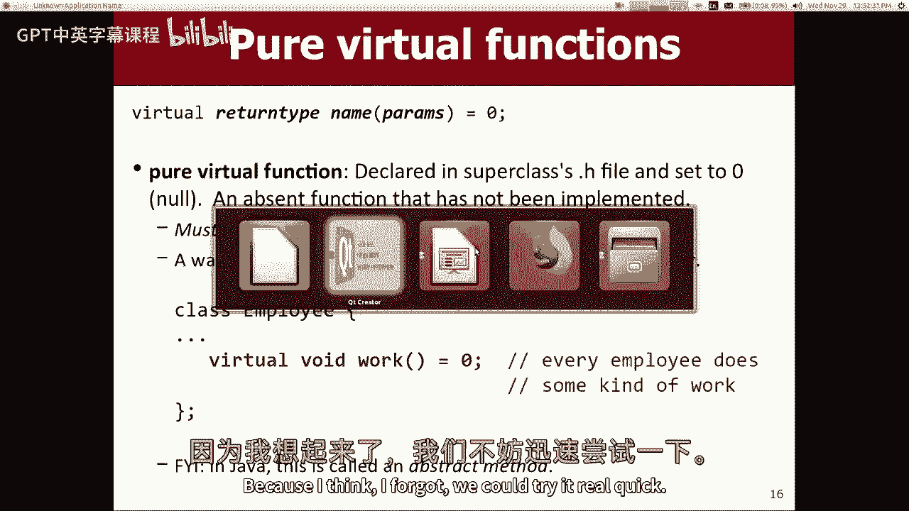

当谈到C+时，我有一半的时间是错的，但我们在这里做什么，我们要说，雇员h，我们要说Speak方法被设置为空指针，我想那行不通，是啊，是啊，看上面写着无效，纯说明符只允许零，哦真的好，嗯，我的想法。

如果你说空，就像这个空字面上是一个宏，它被零取代，所以我想这可能有用不不，你得用零，它很挑剔，它让你用零，就像一个零，如果我说，是呀，我抓住你了，它的工作原理，哈哈哈，我们不要再提这件事了，另一个问题。

是啊，是啊，实现多重vis，是啊，是啊，像那样的事情只有权利，所以我想我的下一张幻灯片会谈谈你的问题，嗯，如果你想在Java中，你有这些接口，您可以实现它们，你基本上很像这种功能，你可以说。

我保证我会实现那些超级接口中声明的所有方法，C Plus没有接口，所以如果你想要的只是对子类型的纯粹需求，你必须做所谓的纯虚拟类，假设你要写一个类，称为一堆形状类，好啦，你可以有三角形、矩形和圆形。

还有各种各样的东西，每个形状都有一个区域，双区域和每个形状也有一个周长，但你计算它的方法因形状而异，所以你不想在这里为他们写任何东西，这将完全是Java领域的一个接口，好吧，所以你在这里做的是。

你会说等于零等于零在这里用c加上，但你不能说界面形状，你只要说班级形状，好啦，所以现在如果你想写一个矩形类，你确实喜欢矩形类，你知道把公众形象，然后你必须把这些方法写对，好啦。

但是你知道当你用Java扩展一个类时，您可能知道只能扩展一个类，是的，这也是原因之一，Java有接口，您只能扩展一个类，但是您可以实现任意数量的接口，C++没有接口，因此您可以扩展任意多个类。

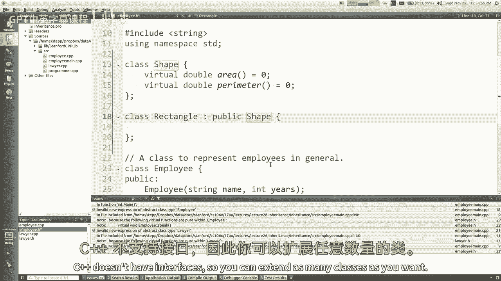

让我看看我的下一张幻灯片，它在哪里，C++具有多重继承，您可以扩展一个类，然后扩展另一个类，然后扩展另一个类，然后扩展另一个类，您可以扩展任意多个父类，可能听起来很酷，这是个可怕的主意，因为它很好。

我是说，对不起，并不总是可怕的，只是最终发生的事情，你的代码是，它会极大地增加代码的复杂性，它还会导致令人困惑的歧义，比如，如果您的两个父类都有一个名为get x well的方法，你得到哪一个。

答案是你得到了他们两个，但是现在，想要使用您的类的代码如何区分这两者，真是一团糟，我甚至不想谈这件事，但在某些地方它是有用的，从多个地方抓取代码的概念，把它们放到你的课堂上，这在其他语言中也发生过。

从那时起，红宝石就是一个例子，流行的网络语言Ruby，他们有一个叫做混合的概念，这与多重继承非常相似，你可以从其他地方取材，把它们粘贴到你的课堂上，现在你的类有了这些功能，但无论如何。

这个特性是在C中使用的，Plus Plus库，就像输入和输出流类有一个非常复杂的继承树，它们互相延伸，有点像坦格利安家谱，在《权力的游戏》的结尾，全部或某事，你知道吗，没关系，看看，查一下，但不管怎样。

大多数面向对象的编程语言不支持多重继承，因为它会导致这些奇怪的虫子，它使代码更难推理，在某些情况下，编译器也很难进行优化，所以它被禁止在Java中使用，大多数其他语言不允许，是啊，是啊。

你能建议它收敛到一个超级课程到一个，所以你说，你能建议两个超级的，啊，我看到像，你如何避免这种情况，我不想做好这件事，你看，呃，也许有一件事我没说，这可能会回到我的例子中，就像三个点之类的，就像。

如果你有一个类，你认为类似于这个东西，它有点像那个东西，就像，我应该把这两件事都延长吗。

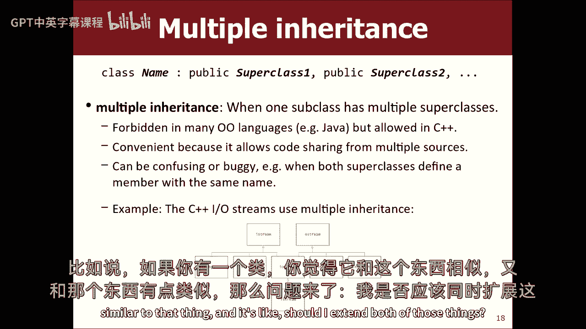

有一种，这条规则，嗯。

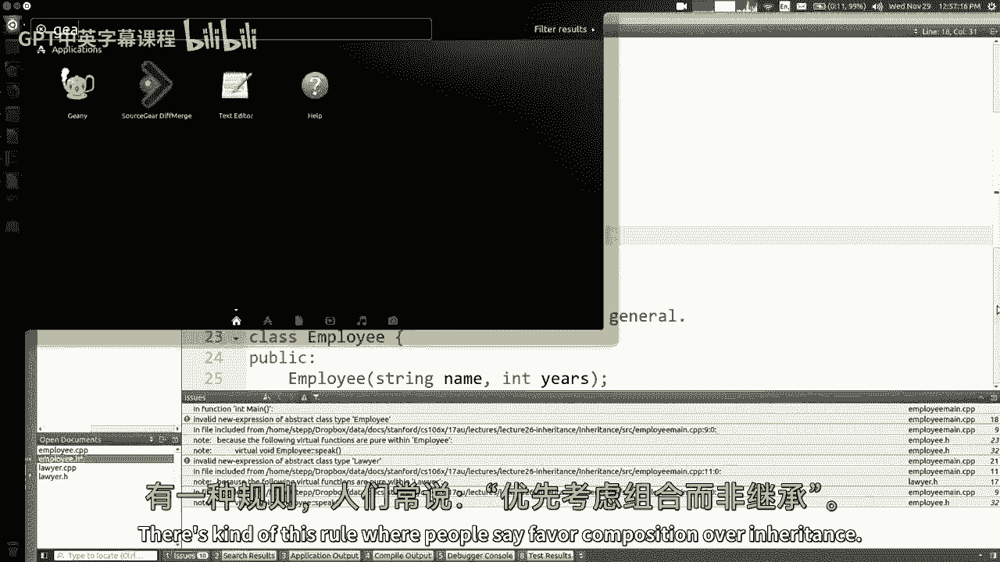

这是另一个，我相信这也是芭芭拉·利斯科夫写的，构图只是意味着如果你像一个矢量，如果你们相似，如果你想做的是，多好的矢量啊，你不必喜欢，通过扩展向量成为向量，只需在您内部声明一个私有向量并使用它。

如果你有点像一个点，如果你的3D点有点像一个点，你想分享代码，宣布你内心的一点，作为私人会员使用，所以我想你说的是，我可以上我相似的两门课吗，我可以合并它们吗，当然，你有可能做到这一点。

但也许他们彼此不一样，所以也许这没有意义，也许我应该宣布他们中的每一个都是我内心的私人领域，所以我经常听到的比喻就像牙医、律师和垃圾，人和东西，就像我想要所有的东西，所以我要去牙科学校和法学院。

我要学习如何捡垃圾，因为我会成为所有这些东西，好像没有，我不需要成为那样的人，我只想拿到那些东西，所以我要申报一个私人牙医，我每隔几个月就得去一次，我可以找一个私人律师，我想起诉某人，所以你知道。

你不需要做那些事，如果你想用那些东西，垃圾，垃圾工是干什么用的？他们捡垃圾，对不起，一个收垃圾的来了，是啊，是啊，机会均等。

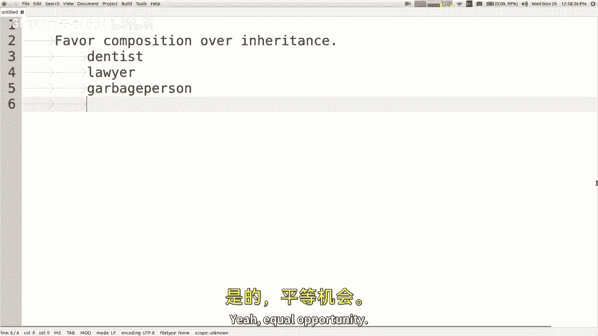

所以是的，反正，我只是在这里漫无边际地谈论遗传的不同方面，但我只想让你知道，C++确实有这个特性，我真的不想讨论所有不同的语法，如何消除重写之类的歧义，如果覆盖在，如果继承相同方法的两个版本，如。

我不知道，我真的不想展示所有的语法，如果你好奇的话，你可以谷歌C Plus加多重继承问题，是啊，是啊，当您尝试构造类时会发生什么，它有一个纯虚函数。

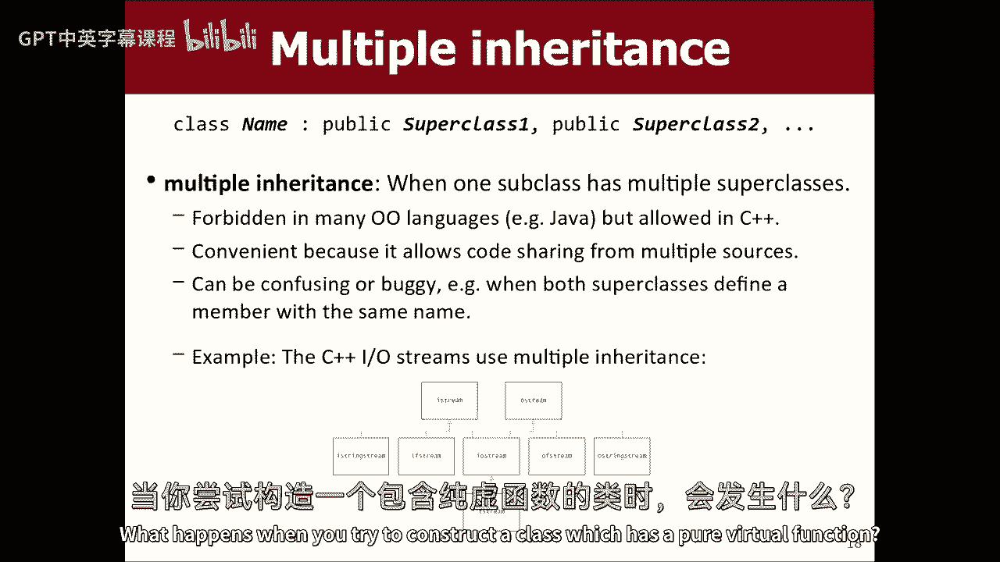

哎呦，如果您有一个具有这些零函数之一的类，纯虚拟，然后你试着构造一个形状对象，我几乎肯定编译器会说不，不能实例化纯虚拟类，类本身成为纯虚拟类，它是不可实例化的，基本上它也没有，是啊，是啊。

即使它有一些不是零的行为，它就是不允许你，基本上，它认为它是一个不完整的实体，不完全类，嗯好吧，所以我想，关于这个主题，还有几张幻灯片叫做多态性，但我想跳过一会儿来谈谈哈希，首先。

我可能会回到多态性的问题上。

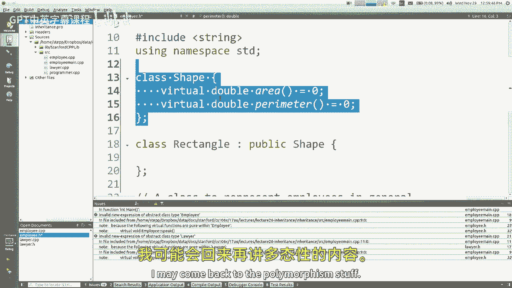

所以我想跳到我的其他幻灯片。

它在哪儿？哈希，所以这些东西，我们今天做不完，但我只想在部分中介绍一下，然后我们会在周五做更多的这方面的工作，来自书的第十五章，这里的主要话题是，我想谈谈一些集合是如何实现的，我们想把它包起来。

学习我们用的几乎所有藏品，你知道的，了解它是如何建立在里面的，所以我觉得哈希真的很酷，当我第一次得知这件事时，我很难理解，但我没有你们聪明，在这本书的第十五章，所以好吧，让我们来谈谈这个。

我们试图弄清楚的主要概念，是实现一个集合的好方法，我在想像，我们基本上要得到一个哈希集，但让我们集思广益，如何落实好一套，你可以在内部有一个向量或一个未填充的数组，你知道其中一个调整大小的数组。

所以当人们想在布景中添加东西时，您可以将它们存储在最后一个元素中，像这样对吧，只是一种无序或插入的顺序，对呀，有什么大不了的，一套真正需要擅长的三种方法，是添加、删除和搜索，这就是布景的作用。

其他一切都只是在右边上面结霜，那么在这个模型中添加的大O是什么，大开眼界，只需添加到手上，没有移动，如果我必须经常调整大小，没关系，如果他们走了，它就不会断，包含的大O是什么，我让他们所有人都去找对了。

所以这不是很好，对于单个包含的包含O和n，集合需要快速，支票回来了，好啦，移除，那要多长时间，我得再找找，好吧，我们大部分时间都回去，太烂了，这个可以加，但这对你真正想要的东西大多没有好处，好啦。

那不好，好啦，嗯，怎么样，排序数组呢，同样的想法，但我们只是把一切都整理好，如果你说你想添加，你知道四九，我把它放在最后，如果你说要加八，我把它放在这里，只是，我会根据需要转移人员，并把它。

所以一切都井然有序，加进去需要多长时间，平方井，那么我该怎么做呢，我得找个合适的地方把它插进去，一旦我找到了那个地方，我可能需要把人转移过来，然后我把元素放在那里，多长时间有两个任务，找到地点。

然后给东西腾出空间正确的位置需要多长时间才能找到位置，我可以用二分搜索跳来跳去找到正确的位置，对呀，它需要n的对数，你们应该知道，所以这还不算太糟，但如果我发现正确的位置在这里，我得把人转移过去。

转换需要多长时间平均要花N，我可能得把一半的元素，所以是对数加n，这意味着只有N个，所以增加是很大的，n搜索的O，搜索日志需要多长时间，我用二分搜索很好，这样好多了，虽然加法比较慢。

搜索速度的提高真的很有用，好吧，那很好，登录搜索删除，移除需要多长时间，我用日志搜索找到你想让我删除的东西，但一旦我把他带走，我得把人滑过去，所以添加和删除，在这个模型中真的很慢，但是搜索更快。

所以对此有一些赞成和反对，还是不太好，好的好的，然后我们今天的幻灯片上也没有照片，我们还有二分搜索树，对呀，添加删除包含，在二分搜索树中，这些需要多长时间，他们都接受法律，假设这棵树很平衡。

我们已经讨论过了，嗯，这是三个小时的日志记录，那其实挺好的，那是迄今为止我们看到的最好的东西，我想给你看第四个选择，另一个选择，好啦，如果当你添加了一个值，而你添加的值是，我只是把它存储在索引的数组中。

我没事，所以我不是，我不会把每个人都推到左边边缘什么的，只要你说，加七，我把它放在下一个七点，你加上9，我会把它放在索引里，九一一，我把它放在索引一，添加一个元素需要多长时间，如果你这么做了。

它需要所有的一个，因为你知道跳转到数组的索引，即使是一个大指数也不需要任何时间，你只要直接跳到那里，所以这需要一个恒定的时间，搜索查看某物是否在集合中需要多长时间，你只要跳转到索引，看看它是否在那里。

或者如果有一个零，这将需要一个恒定的时间，移除某样东西需要多长时间才能使其归零，哦一个，哦一个，哦一个，哇塞，听起来不错，这个想法有一个小问题，你能想到这个想法有什么问题吗，很多，是啊，是啊，内存不足。

是啊，是啊，当然，我认为这个问题的另一种表达方式应该是，如果你想加个十呢，没有索引，哎呀哎呀，好啦，嗯，也许我会把数组做得更大，所以有一个十，我要做二十号的，十号的放在那儿，好吧，好吧。

现在我可以存储高达20的值，现在你加上一个2 8，哎呀，我得把大小调整到40，好啦，所以我只是把数组做得更大，包含要讨论的所有值的范围，所以如果你的值在一个不太大的范围内，这也没那么糟，但你离开了记忆。

所以我想你的意思大概是，如果我有一个像三的数字，我有一个大约十亿的数字，我必须做一个十亿大小的数组，大部分是空的，所以看起来，哎呀哎呀，这不是很有效的记忆，对吧，所以是的，那是个问题。

那是个相当大的问题，但我喜欢这个又大又旧的东西，所以也许我们可以试着解决这个问题，与其放弃这个奇怪的想法，不像非数字项目，是啊，是啊，我们在这里需要做的是，我们需要找到一种方法来获取我们想要存储的值。

并将它们映射到特定的索引，最好把它们存放在那里，如果我们存储在集合中的值，想出那个映射有点微不足道，因为映射是存储数字，因为指数等于那个数字，但如果这个想法我认为你在描述一个潜在问题的问题呢。

如果我在街上储存呢，如果我在储存双倍呢，如果我存储三点对象呢，这个概念如何推广到其他类型的数据，我想，那是个很重要的问题，我想回来，不过，我们得想个办法，如果这个想法有什么可取之处。

但是这种把元素储存在特定地方的想法，无需寻找任何东西，这个想法被称为哈希，你提出的所有问题都有合理的解决办法，所以如果我们能解决所有的小问题，这是个很酷的主意，好啦，所以让我们继续努力，让我们继续思考。

所以如果你加上更大的数字，也许我把数组做得更大，我想把它拿去无穷大是行不通的，因为你知道有这么大的范围，我们不想要数组，上面有数十亿的索引，大部分都是空的，那是那是个问题，但让我们继续前进。

看看我们是否能解决其中的一些问题，所以好吧，就像我说的，这个想法被称为哈希，哈希是当你映射一组很大的值，更小的索引域，那太小了，所以我们从映射整个int范围开始，到一组数组索引中，因此。

如果要使用数组存储数据，就这样，我们可以将数组称为哈希表，上一张幻灯片上图表中的数组，我们可以称之为数组，哈希表，哈希函数是一个字面上的C加号函数，在那里你传递一段数据，它返回一个索引将这段数据。

那么这东西该存放在哪里呢，将其存储在此索引中，从值到索引的映射称为哈希函数，我们想出的哈希函数有点微不足道，就像这里是int，我应该把它存储在哪里，将其存储在索引中，我们就是这样开始的，但如果你愿意。

你可以有比这更复杂的东西，然后是你被告知要去的实际索引，把我们称之为哈希码的东西，或者你知道，我们就叫它索引吧，如果你想，好的，好的，所有这些术语都是当你在做这种收集建筑时使用的术语，好啦。

所以我们想出了这个函数，哈希代码I存储在索引中，它们的缺点是什么，我们已经讨论过了，可能需要一个很大的空数组，对负数不起作用，因为数组中没有负索引，我们可以有稀疏的，你知道大多数索引都是空的，对呀。

所以让我们改进一下，让它变得更好一点，所以我们可以做的一件事是，如果我们看到一个负数，我们只要取绝对值，如果你想储存一个负6，我把它存放在索引六中，至少那样不会出界，对呀，所以你让我储存一个负2。

我存一个索引给你叫我存三个七，我会把它储存在接下来的七年里，所以我在修补你告诉我的一些问题，我不再有一个巨大的十亿元素阵列了，我会根据容量来修改元素，所以就像，如果你在上面加上一些东西。

我想存储索引大小为10的数组，然后我会把它修改10分，以找出该把它放在哪里，所以理论上我解决了一些问题，我现在引入了新问题来取代旧问题，我对此有什么问题，是啊，是啊，你们两个两个，是啊，是啊。

如果我想存储一个2呢，我想储存到两个，我想储存一千零两千零四千，两个和哎呀，哎呦，现在有人想争夺同一个位置，哦好吧，这似乎是个问题，是啊，是啊，那么我们该怎么办呢，嗯，只是很快地复习一下。

这三个行动都将是大的，一的O，因为如果我们有一个哈希码函数，以数组大小为批号的绝对值，添加，删除和搜索都只是一条线，对呀，所以我只想确保，很明显，这将是一个很大的问题，如果我们能成功，所以好吧。

最大的问题是你所说的碰撞，碰撞是指两个值都想要相同的索引，我有一个二四，我有五个四个，那很糟糕，我需要区分这两件事，所以任何哈希，一个正确的系统，必须有一个碰撞解决机制，必须以某种方式处理这个问题。

很多人花了很多年思考这个问题，所以人们想出了很多方法来解决这个问题，给大家看一下，其中一些方法叫做探测，探测只是去寻找一些其他的索引来存储价值，就像你储存一个24，它进入你体内，你10岁前是24个月。

十分，所以我把两个4放在那里，我有五十四个，所以我试着去这里储存，还有哎呀，它被拿走了，所以我一直期待着一个，直到我找到可用的索引，然后我就把它们放在那里，所以这就像把它变成别人的问题，好吧我不知道。

这在现实世界中的类比是什么，这就像你去尝试去睡觉在你的宿舍，但是你的室友在里面已经很吵了，做一些你不想做的事，所以你去隔壁宿舍，你睡在那个宿舍，但当他们回家时，现在你在他们的床上，所以他们就睡在隔壁。

我不知道，人们就是这么做的吗，我从来没有进过宿舍，我好像50岁了，所以不管怎样，你转到下一个真正的足球索引，这就是你做对的，如果使用这种解决冲突一的方法，这是解决碰撞的一种方法，还有其他方法。

而不是一个接一个地转移到下一个，也许你跳了一定的量，有时你按数字的方块跳，跳一加四加九加十六，你跳过它的正方形，他们并不都挨着，他们散开了，嗯，那么你对这种方法有什么看法，还是你有问题，是啊，是啊。

去吧，是啊，是啊，我很快就会说这是受订单影响的，其中你添加了一个非常晚的探测，导致了不同的指数，这是真的，这确实意味着添加元素的顺序会影响它们的最终位置，但这对我来说并不重要，他们最终会在这里。

只要加上，删除并包含，正确对待此集合的用户，所以如果他们说这一套包含54个，我来到这里，我以前没有看到它，我需要更新我的连续代码，看看他是否在下一个位置，或是之后的那个或是之后的那个。

但如果我把它修补好，只要它给出正确的答案，就像它说的是真的，当我加了一个5-4，上面写着假的，当我没有加50的时候，只要行为得当，我并不特别在意内心，每个人都在那里，只要行为得当，顺便说一下。

你知道当你有一个哈希集并打印它时，都乱成一团了，怪异，你不知道为什么订单很奇怪，它在做，它把你放进去的东西，它把它修改成一些数组的索引，然后当你打印东西的时候，它只是在数组上循环，不管那个顺序是什么。

这是它打印的顺序，这就是为什么它打印像一个奇怪的顺序，反正，随便啦，所以只要它起作用，我想这方面我没问题，但是是的，这确实意味着，如果我们这样做，这意味着我们必须更新添加、删除和包含的代码。

我们必须确保广告向前推进，如有需要，我们必须确保包含向前看，直到需要一个空插槽，和移除可能要期待找到东西来移除它，对呀，嗯，如果你是一个大，哦呃，纯粹主义者，你可能会说等一下，呃，如果我必须喜欢。

到这里，然后开始走在前面，就像，这难道不意味着，我现在有一个，这难道不意味着，它不像以前那么大了，所以你最终会遇到所谓的聚类问题，可能会有一大群人，我应该把这叫做，一零一高速公路的问题什么的。

我不知道你们可能不会开车，别管老人有这些东西叫汽车，有时他们有很多人，所以看起来是这样的，如果你添加一堆元素，所有这些都需要放在哈希表的相同相似部分，他们都挤在一起，这个问题的问题就像，如果你说，嘿嘿。

哈希集，你有七十四吗，那我得从这里开始，没有，不是他，但我得继续找以防他被调查，所以好吧，没有，不是他不是他不是他不是他，他不是他，哎呀哎呀，我终于到了这里，你得把这些东西包起来，如果需要的话。

所以要定义一个点，所以我所要看的，看到这里没有一个74，所以哎呀，一点都不酷，现在情况很糟，这个示例是尽可能精心制作的，破解密码，你知道的，使它有一个很长的簇，嗯主要是，如果你有这样的哈希表。

你不能只做半号的，这是一个不错的初始尺寸，对于向量，或者射线列表什么的，但是一个哈希集你可能会让它有一个更大的，差不多有一百或两百，只是为了给你多一点空间，所以如果你有一个大小为100的哈希集。

这些家伙中的很多人都不想再成为指数四了，你知道我的意思，就像在一个大小为100的哈希表中，2-4会在下一个2-4，三十七就是八三七，大小为100的哈希表，或者即使是20号的哈希表。

你会看到37会在17和呃结束，你知道我不知道什么，但他们会，他们会被分开一点，他们会比这更不聚集，如果哈希表大一点对吧，另一个经常使用的技巧是，你知道我碰巧选了10的倍数，因为我们喜欢10的倍数。

因为我们的小手指和脚趾，但是如果我选择哈希表的大小是73，然后造型和包裹和东西分布不是很均匀，所以很多时候人们为这些数组选择奇怪的大小，使模组在容量上碰撞更少，是啊，是啊，所以我们用。

我们正在影响我们的探测，我明白如果我们只是在，我们知道什么时候该停止看起来像一旦我们遇到了，是啊，是啊，但是如果我们删除像这样的索引，假设我们必须提出十个空格，我们要为我的空间挪点东西，这难道不意味着。

当我们搜索的时候你必须，当我们知道什么时候该停止寻找，是啊，是啊，这是个很有趣的问题，如果我告诉它我想删除，我这里有这个数据，然后我说我想去掉十四个，所以上面会写十四号在哪里，可能还有4分钟，不，好吧。

我去探头，哦，他来了，我会把他送回零，把他带走，这似乎是正确的执行清除，但现在以后，如果我问哈希表是否等待，我选了一个很好的例子吗，我要五四，我把他带走，我把这家伙，所以现在在再次移除并将他归零后。

有人说，这一套有十四个吗？所以我会从它的自然位置开始，那不是他，然后我去这里，我看到一个零，我可能会停止寻找，所以说，哎呀哎呀，我会想念他在那里，所以这实际上是一个重要的bug，如果你真的要写这个代码。

你得做点什么，你不存储零，你储存了一些垃圾价值，就像这里以前有一个五四，但现在是垃圾，就像一个空值，或者一个常量int，那是出界的，或者你必须在这里存储某种值来指示，就像继续寻找，那里。

以前这里有些东西，但现在它被从这里移走了，是啊，是啊，那是一个，这是个好问题，虽然嗯，反正，这个有一些好处，集群的一些缺点现在可能是一个问题，哦，在我走之前，我看到另一个人举手了吗，是啊，是啊。

为什么聚类，再慢下来，为什么集群会减缓事情，因为我们要做的就是，删除或包含在此，我们可以跳转到正确的索引，如果你想知道是否有14个，你只要跳过指数四，呃，这就是为什么它是一个很大的，这就是为什么它很快。

但如果你必须从四点开始，然后任意向前看，找到十四个，然后如果你有很多集群，意思是你在循环寻找东西，这种表示的全部意义在于避免大量的循环，去看，好像如果你有，如果你说像更少的集群。

东西散开得比你要寻找的更多，就是这种病，如果像这样的集群较少，是啊，是啊，你不必绕很多圈，我是说，如果你想找三十七，关键是他不会出现在任何其他索引中，你七点开始，看他在不在，因为七是他的特殊指数。

他的哈希码，会把你送到索引七号，是啊，是啊，它不会把你送到其他地方，为什么你为什么会知道，你为什么知道在这种情况下你不必四处看看，嗯，你知道你不必四处张望的原因是，说我寻找，说我要八十七，我说，好啦。

他的指数应该是87，十就是七，所以我会去这里，你坚持87年，我发现三七不，它不在这里，好吧，那我看看下一个索引，是87吗，没有，是零，如果你看到一个零，你可以停下来，因为零意味着如果有87。

我会把它放在那里，那里没有人，所以没有八十七，任何地方，所以你就开始走到零点，所以这个东西假设，就像你所认可的，是啊，是啊，是啊，是啊，我假设我在这里做线性探测，是啊，是啊，反正。

我想告诉你另一种做事的方式，它不是移动到下一个索引，另一种方法是在每个索引中，而不是只存储一个值，您可以存储值的集合，您可以存储一个值的链表或一些值的向量，不管怎样，这种方法很好。

因为它从来没有一张桌子，你必须查看每一个值或类似的东西，只是如果你去索引4存储2-4，你只要把它们放到链表里，然后如果你想储存54升的东西，您只需添加到链接中，通常你要做的是把它们插在前面，那更快。

但现在加法还是很快的，您不必查看任何其他索引，您只需将其添加到感兴趣搜索的链表的前面，你得绕过去，所以不管它有多长，您的运行时是这样的吗，移除就是，你得去找，然后把它取出来，所以现在比以前快了一点。

从某种意义上说，嗯，你知道的，大多数情况下，这些将再次分散开来，我的照片有一个长度为3的列表，所以这看起来有点糟糕，但实际上有了真实的数据，你有一个更大的哈希表，元素通常更分散。

所以你更有可能有一堆锁链，里面有一两样东西，所以如果链条足够短，即使您必须在两三个对象上循环，那真的没什么，所以这基本上仍然让我们保持在一个大O，所以这就是所谓的分离链，这是在哈希集中所做的。

我们斯坦福图书馆附带的哈希图，这是在STL里做的，这就是Java的功能，这是现在大多数哈希结构所做的，我没时间了，我最后要说的是，你知道的，主要的，还剩几只虫子，也许我们可以在星期五继续。

但我们还没有解决的最大的问题是，如果你不储存它，你如何把其他类型的数据放在这里，您如何想出一个神奇的索引来存储字符串，或者将一个点存储在，或者别的什么，所以我认为这真的归结为一个问题。

你能把物体的状态转换成某种int，那是可复制的，所以你可以为此做各种各样的事情，就像如果它是一根绳子，您可以将所有字符转换为它们的小ASCII数字代码，然后把这些加起来，然后是字符串的数字代码。

那是它的哈希码，然后这个数字mod数组大小是字符串应该存储在的索引，所以你得想出一些东西，把它转换成像那样的int类型的转换，所以无论如何，我就不说了，在这一节中，你可以更多地谈论哈希和哈希外套。

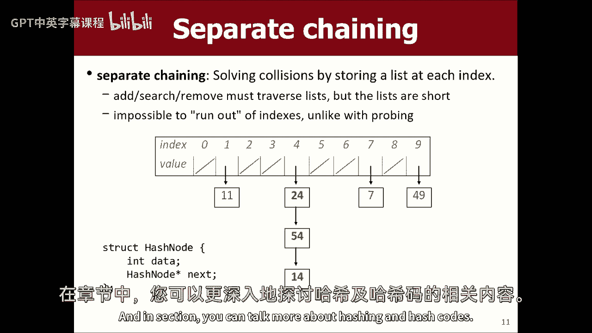

不过，我们星期五再继续，那么到时见。

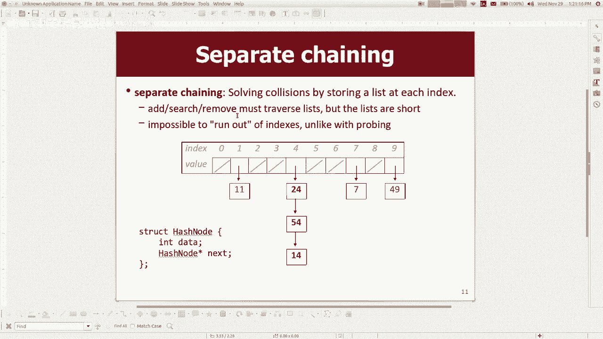