# 课程22：继承与哈希 🧬🔍

在本节课中，我们将深入学习面向对象编程中的**继承**概念，并探讨数据结构**哈希表**的基本原理与实现。我们将从继承的语法和注意事项开始，然后转向哈希表如何实现高效的集合操作。

---

## 继承详解


上一节我们介绍了继承的基本概念。本节中，我们来看看继承在C++中的具体语法和一些关键细节。

### 继承语法与构造函数

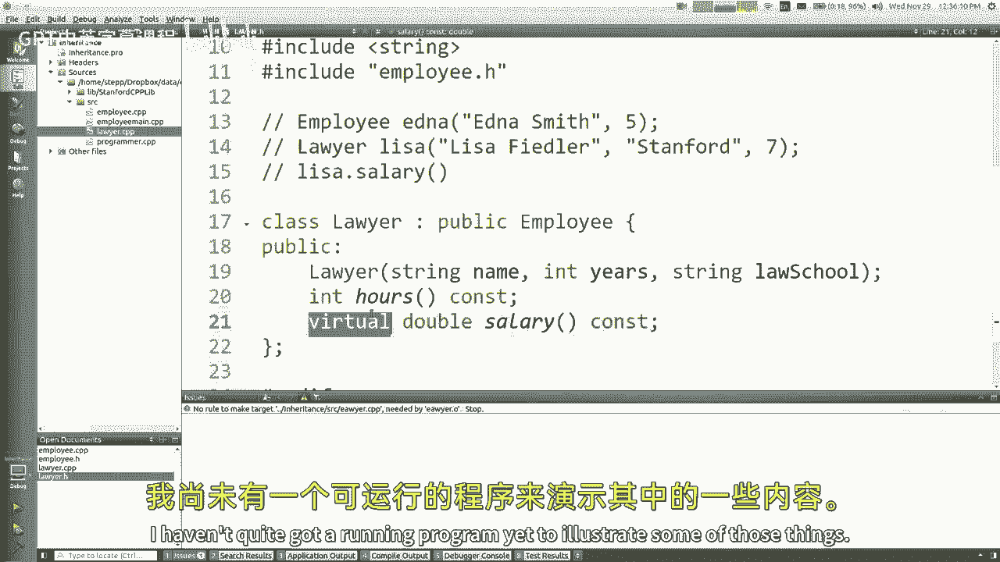

在C++中，使用冒号`:`表示一个类继承自另一个类。例如，`Lawyer`类继承自`Employee`类：


```cpp
class Lawyer : public Employee {
    // ...
};
```

当子类需要调用父类的构造函数时，使用初始化列表语法。这是因为子类不能直接初始化从父类继承来的私有成员。

```cpp
Lawyer::Lawyer(string name, int years, string lawSchool)
    : Employee(name, years), myLawSchool(lawSchool) {
    // 子类特有的初始化代码
}
```

### 方法重写与`virtual`关键字

为了允许子类重写父类的方法，需要在父类中将该方法声明为`virtual`。这确保了在运行时能正确调用子类重写的方法，而不是父类的版本。

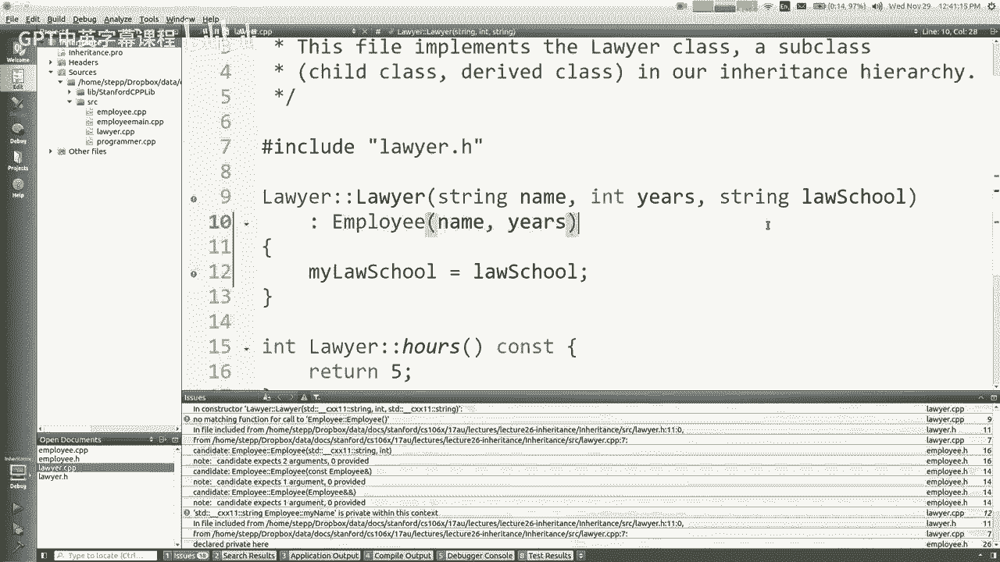

```cpp
class Employee {
public:
    virtual void speak() {
        cout << "I'm an employee." << endl;
    }
};
```

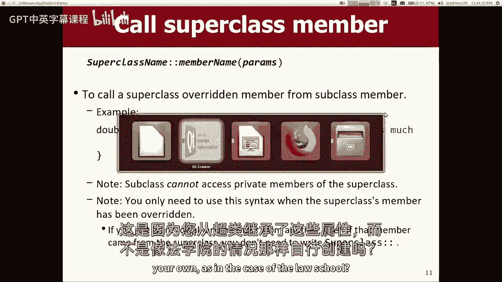

### 调用父类方法

在子类中，若想调用父类被重写的方法，需要使用父类名和作用域解析运算符`::`。

```cpp
void Lawyer::speak() {
    Employee::speak(); // 调用父类的speak方法
    cout << "I'm a lawyer." << endl;
}
```

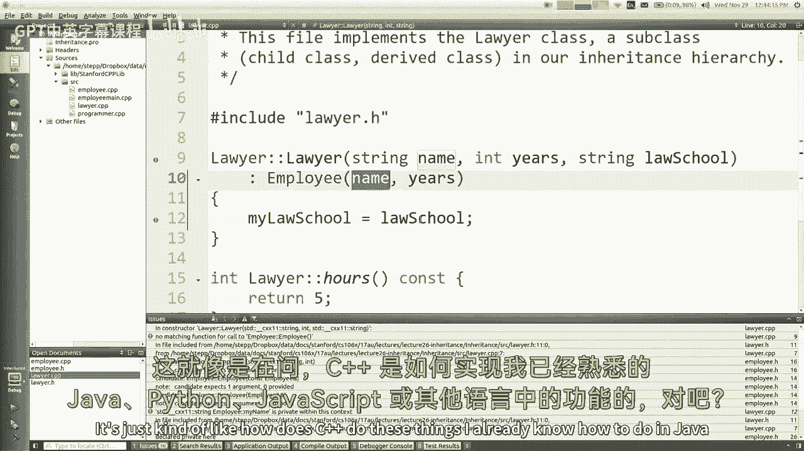

---

## 何时不应使用继承

继承并非适用于所有“是一个”的关系。如果不加选择地使用，可能导致设计问题。

以下是几个不应使用继承的典型场景：

*   **`Point3D` 继承自 `Point2D`**：三维点并非二维点的简单扩展，许多方法（如距离计算）需要完全不同的实现，强行继承会导致逻辑混乱和潜在错误。
*   **`Square` 继承自 `Rectangle`**：正方形虽然是矩形，但修改宽度时高度也应同步修改。如果`Rectangle`有独立的`setWidth`和`setHeight`方法，`Square`重写它们会导致使用者感到意外，违反了“里氏替换原则”。
*   **`SortedVector` 继承自 `Vector`**：排序向量重写`insert`方法以保持顺序，但使用者按索引插入时，元素可能出现在其他位置，这违背了使用者对`Vector`行为的预期。

在这些情况下，更推荐使用**组合**（即在类内部声明一个私有成员对象）而非继承，或者让两个类共同继承自一个更抽象的基类。

---

## 纯虚函数与抽象类

纯虚函数是在基类中声明但不实现的虚函数，语法是在声明后加上`= 0`。包含纯虚函数的类称为抽象类，不能直接实例化。

```cpp
class Shape { // 抽象类
public:
    virtual double area() = 0; // 纯虚函数
    virtual double perimeter() = 0;
};
```

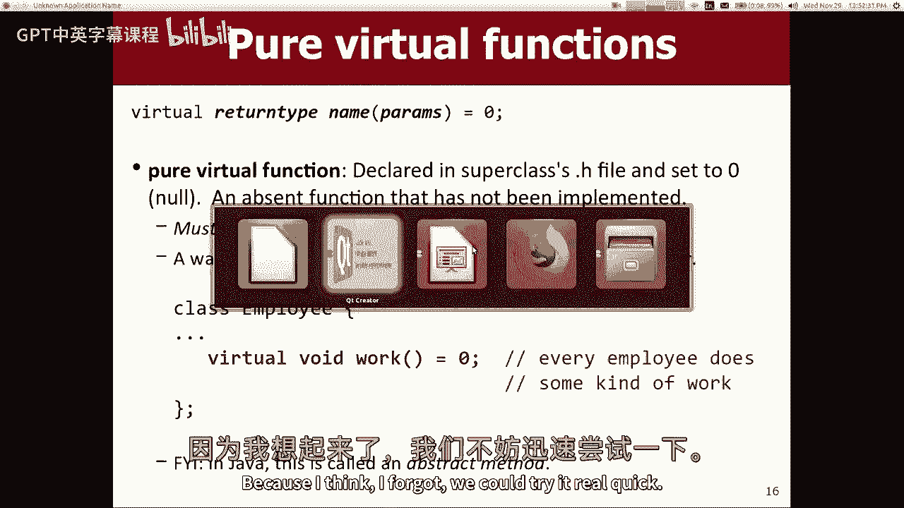

子类必须实现所有的纯虚函数，否则它也会成为抽象类。这类似于Java中的接口或抽象方法，用于定义一套必须实现的行为规范。

---


## 多重继承

C++支持多重继承，即一个类可以同时继承多个父类。

```cpp
class TeachingAssistant : public Student, public Employee {
    // ...
};
```

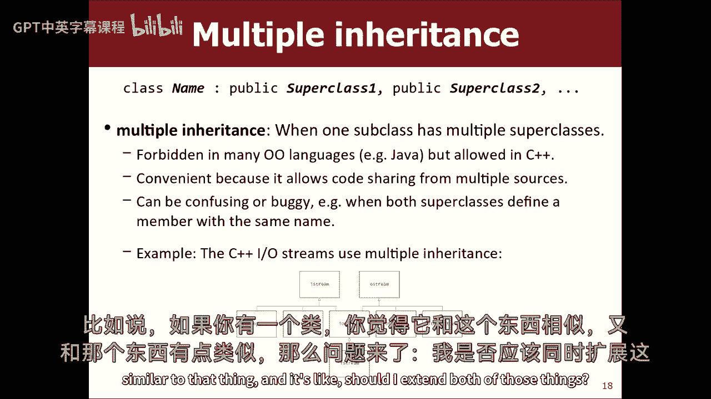

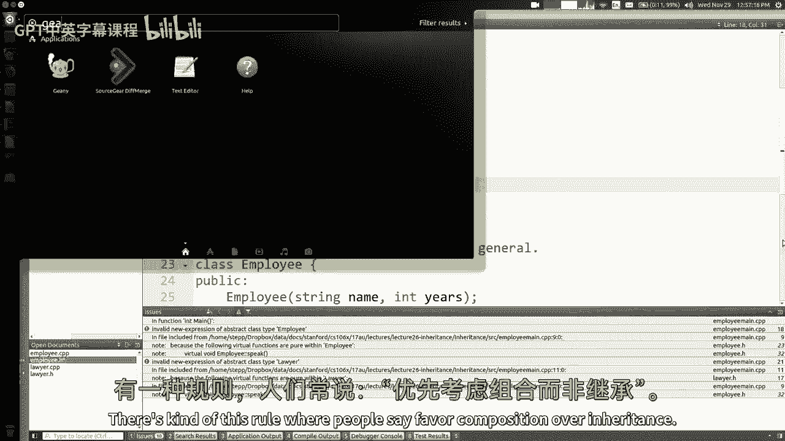

然而，多重继承容易引入复杂性，例如当多个父类拥有同名方法时会产生歧义（菱形继承问题）。大多数现代编程语言（如Java）不支持多重继承，而是通过接口来实现类似功能。

---

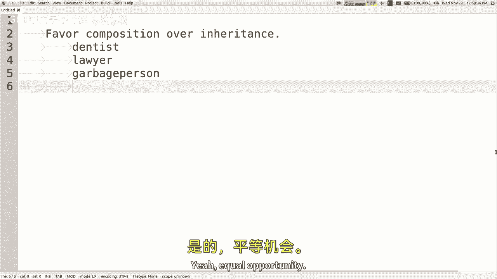

## 哈希表原理

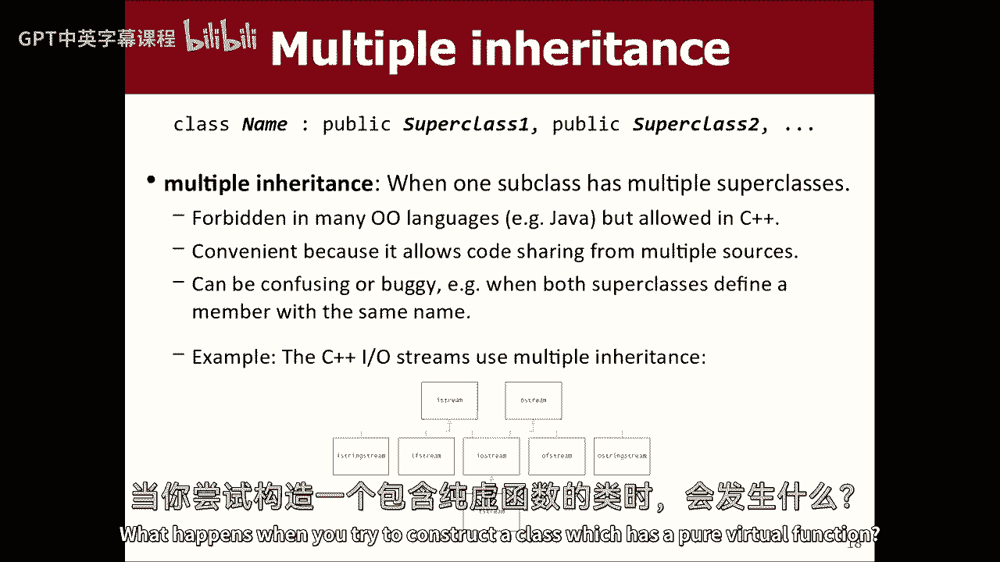

现在，让我们从继承转向另一个核心主题：哈希表。哈希表是实现**集合（Set）**和**映射（Map）** 的高效数据结构。


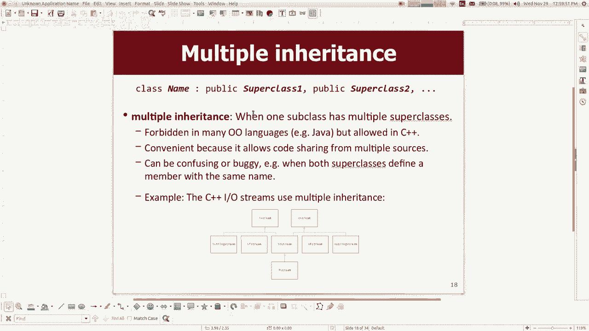

### 为什么需要哈希表？

我们首先思考几种实现集合的方式及其效率：

*   **无序数组/向量**：添加快`O(1)`，但查找和删除慢`O(n)`。
*   **有序数组**：使用二分查找，查找快`O(log n)`，但添加和删除需要移动元素，慢`O(n)`。
*   **二叉搜索树**：平衡时，添加、查找、删除都快`O(log n)`。

哈希表的目标是让添加、查找、删除都达到平均情况下的**常数时间复杂度 `O(1)`**。

### 哈希表的核心思想

哈希表的核心是使用一个数组（称为**哈希表**）来存储元素。关键是通过一个**哈希函数**，将任意类型的元素（键）转换成一个数组索引（哈希码）。

**理想情况**：每个元素都通过哈希函数计算出一个唯一索引，直接存入数组对应位置。这样，查找时只需计算一次哈希函数就能定位，实现`O(1)`操作。

```cpp
// 一个简单的哈希函数示例（仅适用于非负整数）
int hashFunction(int value, int arraySize) {
    return value % arraySize; // 取模运算确保索引在数组范围内
}
```

### 哈希冲突

现实中的问题是**哈希冲突**：不同的元素可能被哈希函数映射到同一个数组索引。

以下是两种主要的冲突解决方法：

#### 1. 线性探测

如果目标索引已被占用，则顺序检查下一个索引，直到找到空位。

*   **优点**：实现简单，数据直接存储在数组中。
*   **缺点**：容易产生**聚集**现象，即连续的被占位置形成长簇，降低查找效率。删除操作需要特殊标记（如标记为“已删除”而非直接置空），以避免中断查找链。

#### 2. 分离链接法

数组的每个索引位置不再存储单个元素，而是存储一个链表（或其他容器）。所有映射到同一索引的元素都放入该链表中。

*   **优点**：解决了聚集问题，删除操作简单。
*   **缺点**：需要额外的内存存储链表指针。如果某个链表过长，性能会下降。

在实际应用中（如C++ STL的`unordered_set`、Java的`HashSet`），**分离链接法**是更常用的策略。通过设置合理的数组大小和哈希函数，可以保证链表平均长度很短，从而维持`O(1)`的平均时间复杂度。

### 哈希函数的设计

对于非整型对象（如字符串、自定义类），需要设计哈希函数将其状态转换为一个整型哈希码。

例如，字符串的哈希函数可以将其字符的ASCII码相加或使用更复杂的多项式滚动哈希：

```cpp
int hashString(string s, int tableSize) {
    int hash = 0;
    for (char c : s) {
        hash = hash * 31 + c; // 一个简单的多项式哈希
    }
    return abs(hash) % tableSize;
}
```

一个好的哈希函数应尽可能将不同的输入均匀地映射到整个索引范围，以减少冲突。

---

## 总结

本节课中我们一起学习了：
1.  **继承**的深入语法，包括构造函数调用、方法重写、虚函数和纯虚函数。
2.  理解了滥用继承可能带来的设计问题，并学习了“组合优于继承”的原则。
3.  探讨了C++中**多重继承**的存在及其潜在复杂性。
4.  引入了**哈希表**的概念，理解了其追求`O(1)`操作时间复杂度的核心目标。
5.  学习了哈希表通过**哈希函数**将元素映射到数组索引的基本原理。
6.  分析了**哈希冲突**的必然性，并掌握了两种主要的冲突解决方法：**线性探测**和**分离链接法**。

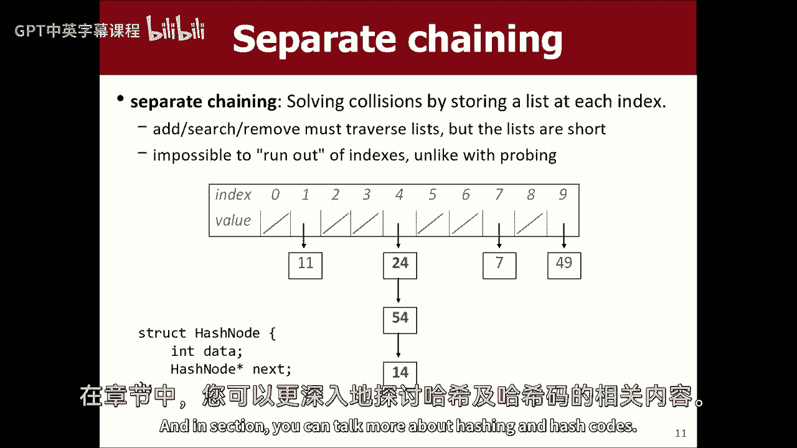

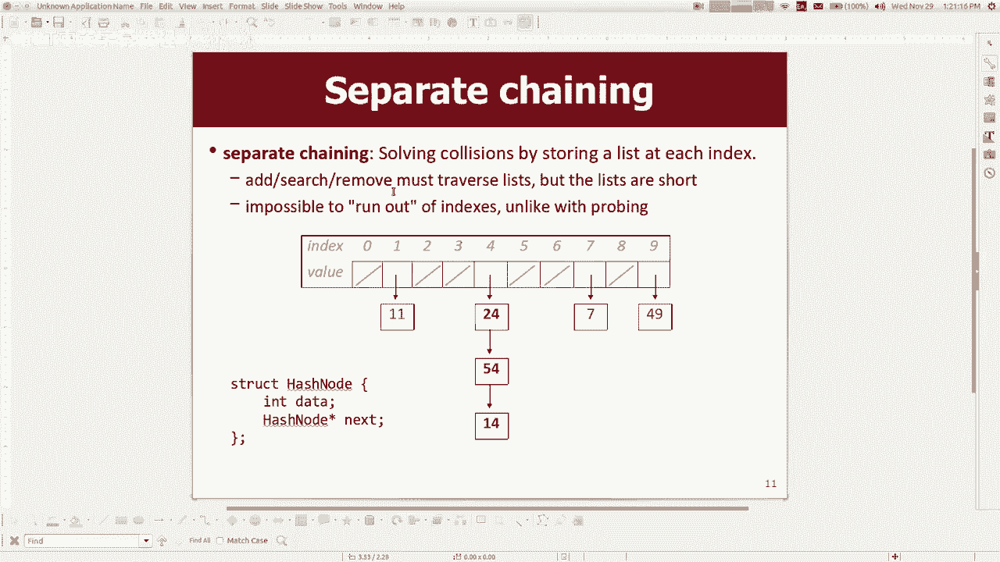

哈希表是现代编程中极其重要的数据结构，理解其原理对于编写高效程序至关重要。下节课我们将继续深入哈希的更多细节。