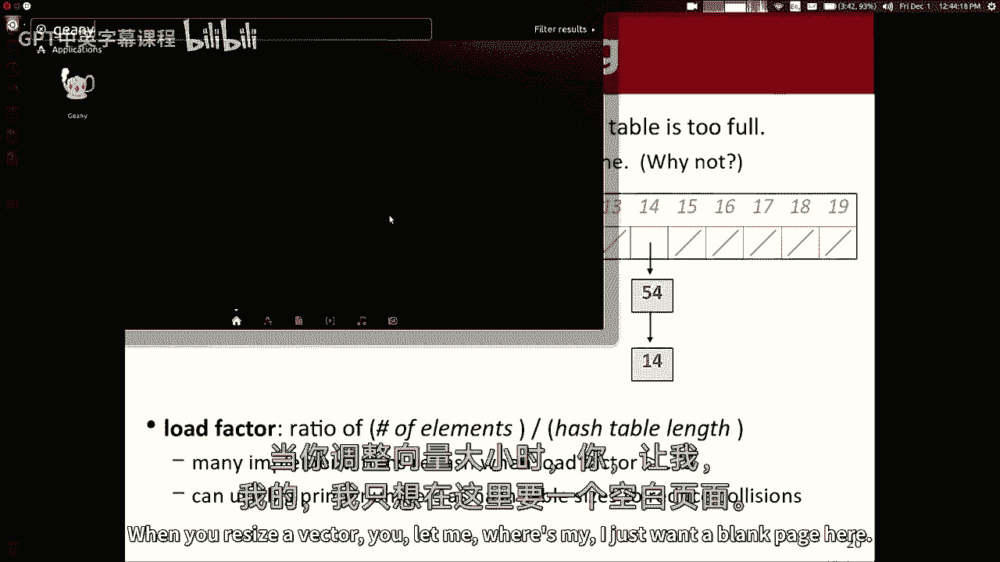
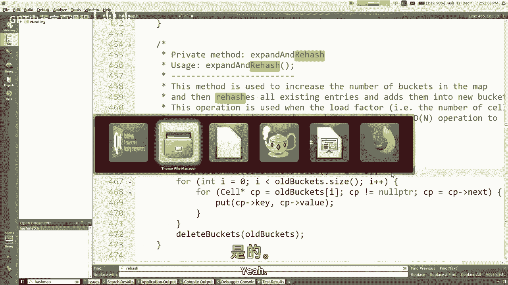
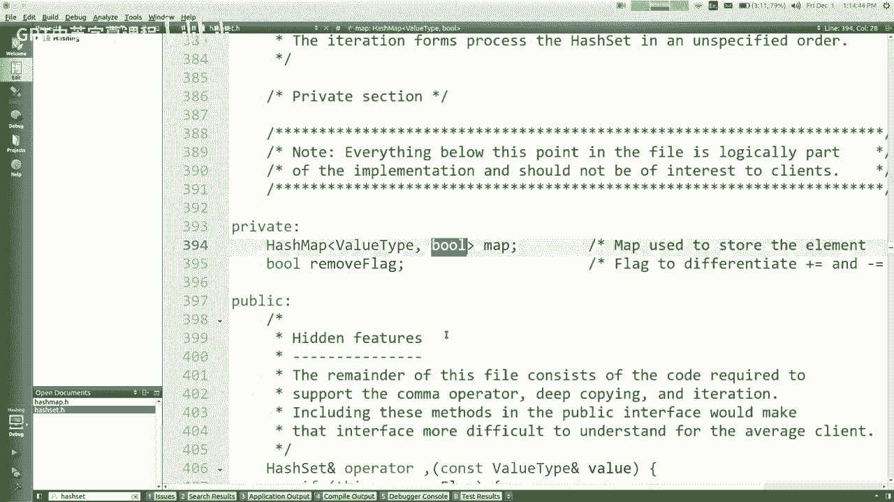
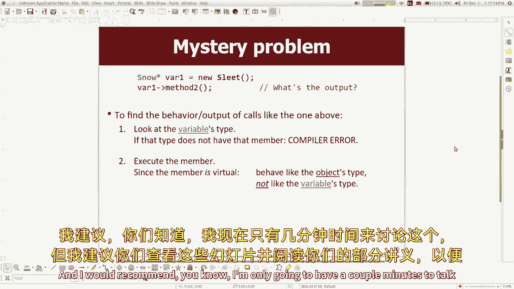

# 课程23：哈希表（二）与继承（二） 🧮➡️🧬

在本节课中，我们将继续深入学习哈希表的工作原理，特别是如何处理冲突和调整哈希表的大小。同时，我们也会回顾继承的概念，并通过一些练习来加深理解。


---

## 哈希表冲突解决与调整大小

上一节我们介绍了哈希表的基本概念，即通过哈希函数将数据元素映射到数组索引。本节中，我们来看看当多个元素映射到同一索引（即发生冲突）时，以及当哈希表需要扩容时，我们该如何处理。

### 处理冲突：链地址法

当两个不同的值通过哈希函数计算出相同的索引时，就会发生冲突。一种常见的解决方法是**链地址法**。在这种方法中，数组的每个索引位置不直接存储单个值，而是存储一个值的集合（例如一个链表）。

**核心思想**：
- 每个数组位置（称为“桶”）指向一个链表。
- 当发生冲突时，新元素被添加到对应索引的链表中。

**代码示例（概念性）**：
```cpp
// 假设有一个哈希表数组，每个元素是一个链表头指针
LinkedList* buckets[TABLE_SIZE];

// 添加元素时
int index = hashFunction(value) % TABLE_SIZE;
buckets[index].addToFront(value); // 通常添加到链表头部以提高效率
```

这种方法允许我们在同一个索引下存储多个元素，从而解决了冲突问题。




### 哈希表的调整大小

与向量类似，哈希表在元素数量达到一定阈值时也需要调整大小，以保持高效的操作性能。然而，哈希表的调整大小过程比向量更复杂。


**为什么需要调整大小？**
理论上，链表可以无限增长，哈希表永远不会“满”。但是，如果链表变得过长，查找、添加和删除操作的时间复杂度将退化为 **O(n)**，这与使用普通链表无异，失去了哈希表的优势。

**负载因子**
为了决定何时调整大小，我们引入**负载因子**的概念。

**公式**：
`负载因子 = 元素数量 / 哈希表数组长度`

例如，如果哈希表数组长度为10，存储了6个元素，那么负载因子就是0.6。


**调整大小的时机**
当负载因子超过一个预设的阈值（例如0.75或0.66）时，我们就需要调整哈希表的大小。



**调整大小的步骤**
1.  创建一个新的、更大的数组（通常是原大小的两倍左右）。
2.  遍历旧数组中的所有桶（即所有链表）。
3.  对于旧数组中的每一个元素，使用新的数组长度**重新计算其哈希索引**。
4.  将元素插入到新数组对应的桶中。

**重要原因**：因为索引计算通常依赖于数组长度（例如 `hash(value) % newSize`），所以数组长度改变后，元素在新数组中的位置很可能与旧数组中不同。不能简单地复制旧数组。

---

## 哈希函数的设计

为了使用哈希表，我们需要为各种数据类型（如字符串、自定义对象）设计良好的哈希函数。

### 优秀哈希函数的特性
1.  **一致性**：如果两个对象相等（根据 `==` 或 `.equals()` 判断），那么它们的哈希码必须相等。
2.  **高效性**：计算速度应尽可能快。
3.  **均匀分布**：哈希码应尽可能均匀地分布在整型值域内，以减少冲突。

### 字符串的哈希函数示例
一个简单但效果不佳的方法是只返回字符串长度。虽然一致，但分布极差（很多短字符串会冲突）。

一个更好的方法是结合字符串中所有字符的信息：

**代码示例（类似Java的字符串哈希算法）**：
```cpp
int hashString(string s) {
    int hash = 0;
    for (int i = 0; i < s.length(); i++) {
        hash = 31 * hash + s[i]; // 31是一个经验质数乘子
    }
    return hash;
}
```
这种方法考虑了每个字符及其位置，使得不同字符串（即使是相同字符的不同排列）更有可能产生不同的哈希码。

### 自定义对象的哈希函数
对于一个包含多个字段（如 `x`, `y`）的 `Point` 类，可以将其所有字段的哈希码组合起来：

**代码示例**：
```cpp
struct Point {
    int x, y;
    int hashCode() {
        int hash = 0;
        hash = 31 * hash + x;
        hash = 31 * hash + y;
        return hash;
    }
};
```
核心思想是：获取对象每个关键字段的哈希码，然后用一个乘数（如31）将它们混合在一起，生成最终的哈希码。

---

## 哈希集合与哈希映射的实现关系

哈希集合（HashSet）和哈希映射（HashMap）的实现非常相似。事实上，一种常见的实现技巧是**用哈希映射来实现哈希集合**。

**核心思想**：
- 哈希集合可以看作一个所有值都映射到 `true`（或某个固定值）的哈希映射。
- 在哈希集合内部，实际存储的是一个 `HashMap<ValueType, bool>`，其中键是集合元素，值恒为 `true`。

这样做避免了代码重复，因为哈希映射已经实现了所有核心逻辑（添加、删除、查找、处理冲突、调整大小），哈希集合只需调用这些逻辑即可。

---

## 继承回顾与多态练习

现在，让我们将注意力转回到继承上。理解继承和多态的关键在于区分**变量的编译时类型**和**对象的运行时类型**。


### 核心规则
1.  **编译检查**：编译器根据**变量的声明类型**来检查方法调用是否合法（即该类型是否有此方法）。
2.  **运行时行为**：程序运行时，实际执行的是**对象实际类型**中定义的方法版本。



### 类型转换的注意事项
当使用强制类型转换（如 `(Subclass) variable`）时：
- 转换本身是否合法（能否编译）取决于转换操作。
- 即使转换能编译，如果对象的实际类型并不是转换目标类型的子类（或本身），程序在运行时也会崩溃（例如 `std::bad_cast` 或访问不存在的成员）。

### 练习建议
课程提供的“多态神秘问题”幻灯片和讲义中包含了一系列经典的继承题目。建议大家：
1.  仔细阅读每个类的定义和方法。
2.  对于每行代码，先判断其**是否能够编译**（看变量/转换后的类型）。
3.  如果能编译，再判断其**运行结果**（看对象实际类型的方法实现）。
4.  特别注意强制类型转换可能带来的运行时错误。


通过反复练习这类问题，可以牢固掌握继承和多态的动态行为。



---

## 总结

本节课中我们一起学习了：
1.  **哈希表冲突的解决**：深入探讨了使用**链地址法**来处理冲突，即在每个桶中使用链表（或其他集合）存储多个元素。
2.  **哈希表的调整大小**：引入了**负载因子**的概念，解释了为何及何时需要调整哈希表大小，并描述了重新哈希（rehashing）的过程。
3.  **哈希函数设计**：学习了为字符串和自定义对象设计良好哈希函数的原则和通用模式（混合各字段哈希码）。
4.  **哈希集合与映射的关系**：了解到哈希集合可以通过内部封装一个哈希映射来实现。
5.  **继承与多态**：回顾了继承的核心规则，并强调了通过练习“多态神秘问题”来巩固对变量类型、对象类型及强制转换的理解。


掌握这些内容，你将能更深入地理解现代编程中这些基础且强大的抽象工具是如何工作的。