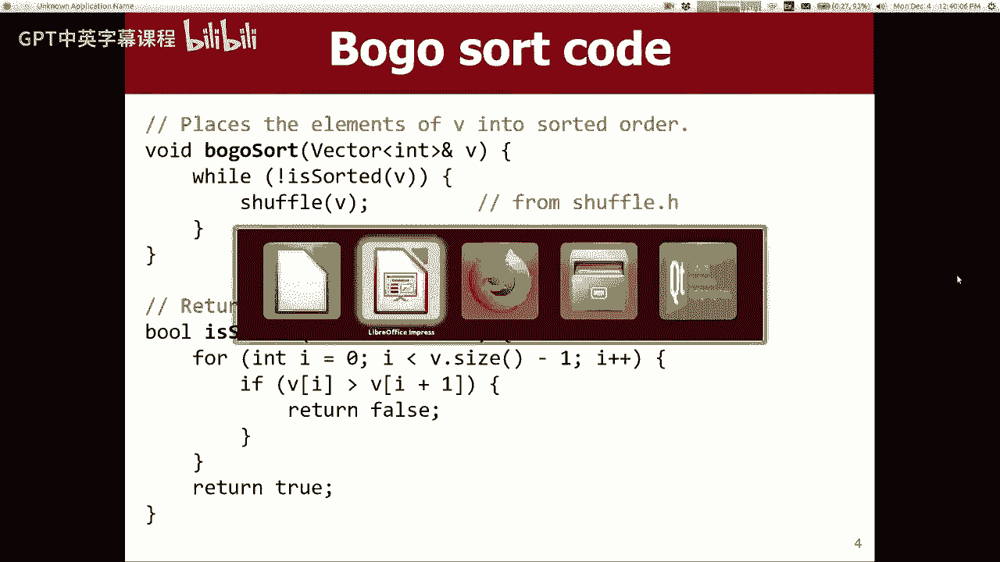
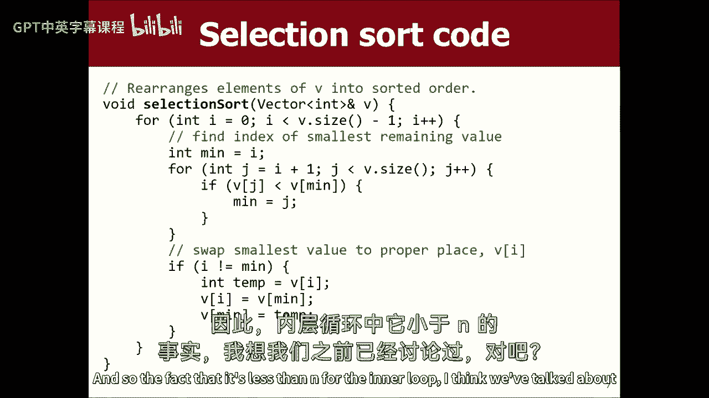
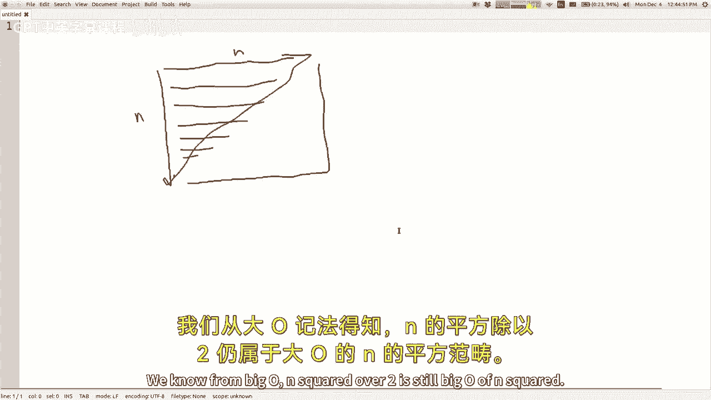
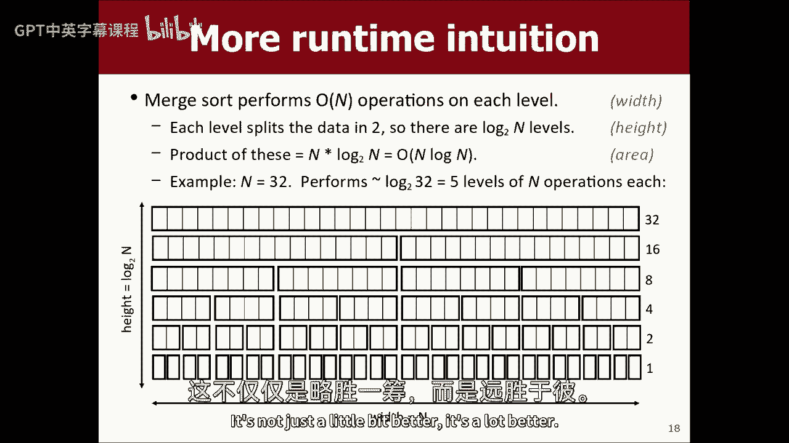
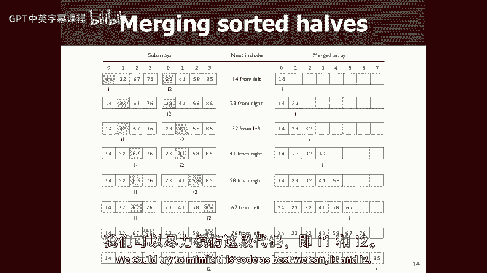
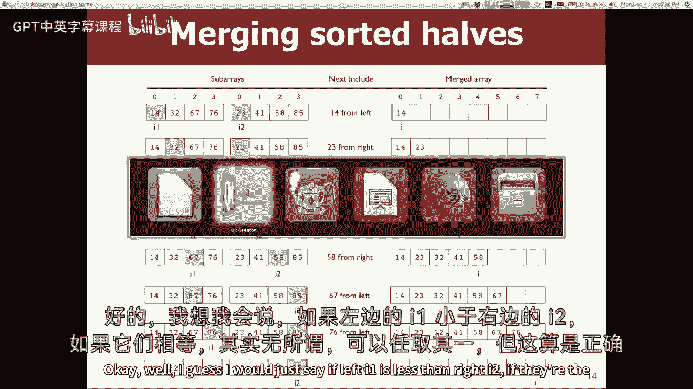
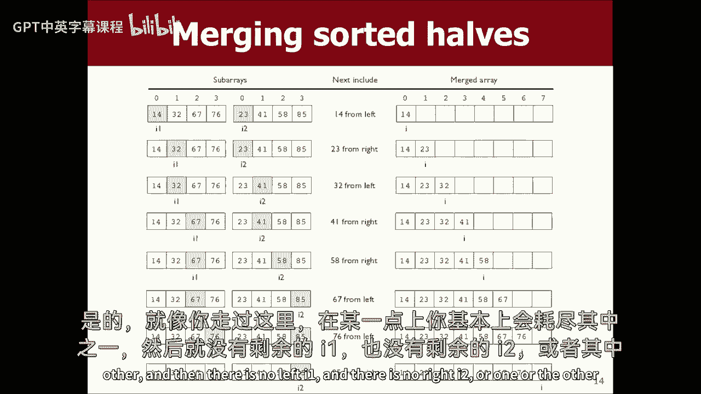
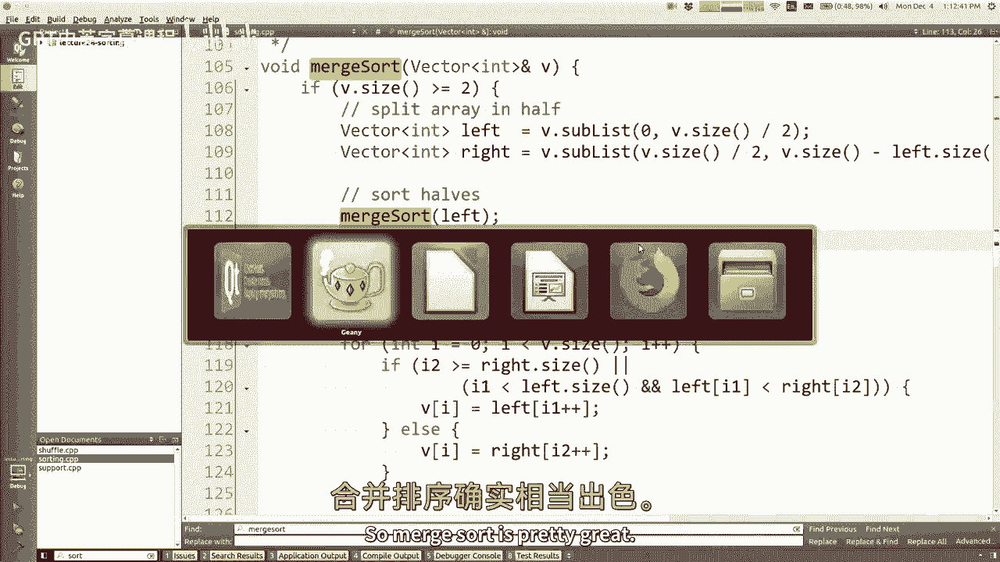
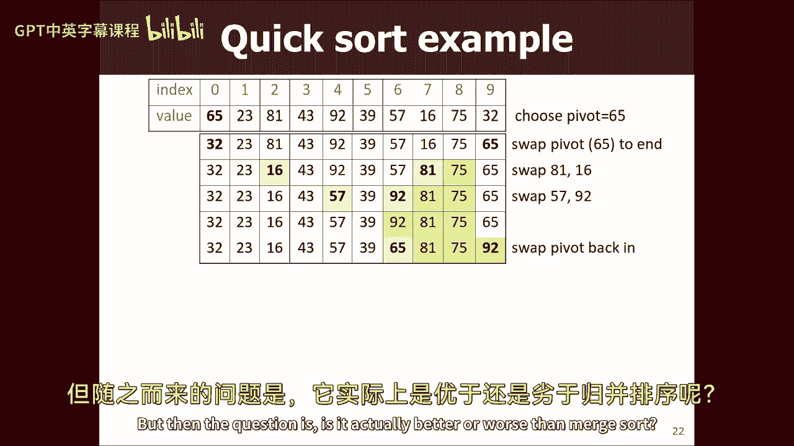
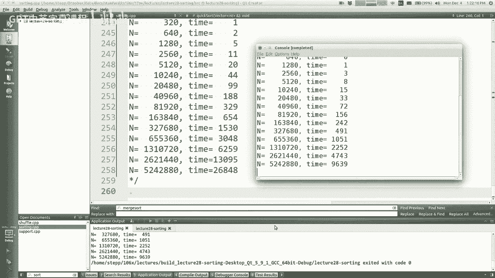

# 【编程抽象方法 cs106x 2017】斯坦福—中英字幕 - P24：Lecture 24 - Sorting - 加加zero - BV1By411h75g

现在是第11周或第10周什么的，我不知道我们怎么称呼一周了，但这是讲座的最后一周，你们兴奋吗，你想说什么？你不喜欢我的课，你很期待我下课，听到这个我很难过，你应该发出嘘声和嘶嘶声，人群中应该有哭泣。

来吧，来吧，给我一些爱，嗯不，开玩笑的啦，我是说，我知道我们都很期待寒假，我们快到终点了，从今天起还有一个星期的课，一大早，你要参加我们班的期末考试，今天晚些时候，我要贴一些练习考试和学习材料。

你可以看看，所以看看那些，你会在网站首页看到公告，当这些都起来，嗯，大部分覆盖，专注于我们从期中考试开始研究的材料，呃，是啊，是啊，所以没有真正把注意力集中在考试上，我打算在星期三多谈谈考试的事。

今天少星期五，今天我们要谈谈分类，而今天的内容将是最后一个，我可能会在期末考试中测试你，就像星期三，我将基本上谈谈你会怎么做，如果没有斯坦福图书馆，如果你只需要写真正常规的c+，你将如何生存。

你会怎么做，我还谈到了某种图书馆，特别是您可能感兴趣的智能指针库，不管怎样，在那次演讲之后，如果你要去一家公司工作或实习，你可能知道更多如何做到这一点，因为大多数公司不使用我们的斯坦福图书馆课程。

然后在星期五，那将是我们最后一堂课，我要做一些总结，谈谈我们学到的，给你们一些建议，关于课后你可能想做的事情，我还要谈谈期末考试，一点点，做一点回顾，上面会有什么，复习一些话题，回答一些关于这些的问题。

这就是本周的计划，你们周五有八点的作业要交，所以希望你们正在努力，只是一个小问题，Who’谁已经做完家庭作业了，不是很多，好啦，谁还没开始，我知道有些人就是不抬起头来，他们就像，我不想承认，没关系。

那很酷，你不必还没开始，但你要等到周五，所以留意一下，好啦，好吧，反正，这就是我们目前的情况，今天教大家分类，嗯，你们中有多少人以前学过排序，是啊，是啊，你学过哪些排序算法，博戈排序，气泡排序，哇塞。

好啦，嗯，我要去，我基本上假设你没看过，但我也会试着用一个教它，零六x的方式，所以我会试着过得快一点，但你知道吗，没关系的，如果你以前学过一点排序，希望今天我能告诉你一些你不知道的事情。

即使你以前见过排序。

所以好吧，开始分类，什么是排序，它是当你把事情重新安排到有序的时候，哇塞，嗯，我是说，我想我们有一种秩序的感觉，你会把事情分类，就像，如果你在分类整数，你按数字顺序排序，如果您正在对字符串进行排序。

你按字母顺序排序，或者类似的东西对吧，所以我们有一种感觉，就像数据类型一样，天生就有一个与他们相关的命令，对于某些类型来说，这可能是正确的，比如，也可能是字符串之类的，你可以称之为自然顺序。

虽然我只想说清楚，你可以把事情按不同的顺序排序，就像如果你想按长度排序，所有的短的先，所有的长的后，那还在排序，只是按不同的顺序排序，你知道的，安排权，那也算排序，实际上。

许多排序库或算法将允许您有时指定，比如我怎么分辨哪个在前面，还有哪些，这样你就可以调整它被排序的顺序，但不管怎样，我的意思是，排序经常在像这样的计算机科学入门课上教授，这可能看起来有点奇怪。

因为这是一个已经解决的问题，就像你知道的，排序您通常只是调用一些库函数，它分类，然后你就完蛋了，之后你就不怎么想了，所以它可能看起来有点平淡无奇或者不值得报道，或者类似的东西，但我想你知道的原因之一。

我们想教给你们的是，因为这是一个可以解决的问题，无数种不同的方式，其中很多方法都很聪明，有有趣的想法，有趣的算法概念，它非常适合谈论大o运行时，时空权衡，你可以谈论其他话题，就像并行化。

你可以谈论巨大的规模，谷歌如何对万亿个网页进行排序，或者别的什么，你知道的，就像，你可以通过，排序的类别，所以无论如何，我将介绍几种不同的排序算法，常用的或众所周知的，我们谈论它们，谈论利弊。

所以我个人最喜欢的排序算法叫做bogo排序，听起来应该是假的，就像，这是一个假的排序算法，但这不是假的，这是正确的，完全有效，算法如下，如果列表已排序，你完蛋了，如果没有，洗牌值并重复，所以洗牌吧。

希望你能把它们分门别类，它不是最聪明或最快的排序算法，但它最终还是起作用了，只要你随机，最终找到排序的顺序，会成功的，所以我的意思是，人们把它作为一个非常愚蠢的算法的例子，最终还是会找到正确的答案。

假设我们有一个很好的随机数分布，对呀，需要多长时间，这个算法的平均最大O是什么，我是说你得说最坏的，最坏的情况，它永远找不到对的地方，因为你总是随机选择错误的答案，但让我们假设。

如果你看看算法能做的所有事情的所有空间，有点像，平均案例运行时间是多少，你有像阶乘这样的答案吗，你为什么说我认为这可能是对的，是啊，是啊，是啊，是啊，我是说，把它想象成这里不同顺序的数量。

或者我想我也是从概率的角度来考虑的，就像如果你有，我把它当成一副纸牌，想象你洗牌，你被评为2-3-4-5的几率有多大，你很清楚，这有点像，第一张牌是正确的第一张牌的几率有多大，这副牌有五张两张牌。

所以这是正确的可能性，第一张是五张中的一张，对了，那么下一张牌是正确的第二张牌的几率有多大，你可能会说五十二个中的一个，但前提是你没上过概率课，就像一零零九，你学得很好，又不是五十二个中的一个。

你已经用过了，所以五十一分之一是对的，所以你在倍增，五十人中有一个，两次，五十人中有一个，十有八九，一直到最后一张牌，如果前五张1牌的顺序正确，那么最后一张牌，根据定义，必须是正确的一张。

所以这是一个中的一个，所以是的，这有点像1/52的阶乘，这就是你做对的几率，所以如果这就是你做对的几率，把它翻过来，而且是的，有点像阶乘，是关于你要花多长时间才能找到合适的，粗略地说，这是代码。

我实际上写了这个算法，其实呢，我从伯克利雇了一个分包商来写，它花了他们，你知道四分之三的全职工作，他们给我买了这个，随便吧，你知道的，虽然没有排序洗牌，然后它排序，我只是绕过去看看邻居是否井然有序。

或者对我们来说不是一路，实际上这个算法最难的部分是洗牌部分，就像如果你没有洗牌功能，我们还没有真正谈过这件事，但就像你如何洗牌数组或向量的元素，如果您没有这样做的库函数，你知不知道，别把它们弄乱了。

你没有任何魔法图书馆可以为你做这件事，你有什么想法吗，你想得很好，如果你有某种随机性，我不知道这是不是最好的办法，但一种方法是，在列表中随机选择一个时刻，吹灭它，把它放在一个新的列表中，然后重复。

免费名单上的另一个新的，现在你从n减去5中选择，但是你知道，是啊，是啊，我想基本的想法是喜欢，从列表的原始顺序开始，并对其进行随机操作，要么随机提取元素并将其放入结果中。

或者随机选择成对的元素并交换它们之类的，尽管出于，我没时间陪你，一定要小心，因为如果你做错了一点，你最终会有一个非偶数的概率，如果你做对了，五张两张牌都有五分之一。

两个平等的机会在五个两个位置中的每一个，但如果你做错了你的随机性，你对一端或另一端的可能性衡量得太远了--敬请关注，你会在一个零里学到更多关于这种东西的东西，三一，九门计算机科学理论课程，但不管怎样。

这里有啊，这里有一个，啊，我没有带洗牌密码的幻灯片，我不是什么，反正，我以为我有下一张带洗牌的幻灯片，但基本上很多人做的算法是，它们循环每个索引的列表，他们在它前面选择一个元素，他们交换它们。

你只要照着单子走就行了，然后当你做完，你现在是交换，你的算法很好，就像把东西拉出来一样，只是做一个辅助结构需要更多的记忆，把它建立起来，这东西只是在原地交换人，它做了同样的事情，但这些都是好主意，反正。

那是博戈排序，你想看看博加索特吗？我在班级网页上有一个拉链。

我很确定我这里有bogo排序，是啊，是啊，博戈排序，所以在这里，哦，我想我必须有我该做什么，我没有，所以是的，洗牌算法，从零开始，走到长度，从那里到最后挑一个随机数，如果你选择了不同的索引，那就交换吧。

所以博戈排序，所以我这里有一个主，我的主，你知道，如果你以后想看这个代码，你可以，但基本上我所做的是，我做了不同大小的向量，我用随机选择的数字填充它们，然后我对它们运行一个排序算法，我知道要花多长时间。

所以让我们做博戈排序，我可以调整这里的尺寸限制，所以让我们从两个开始，上升到20乘以2，我们做n加，我看到你举起手来，我等一下再打给你，跑到这里来，我们走，它一直做得很好，直到九点，呃，哦对不起。

你有一个问题，是呀，啊，是啊，是啊，所以有这样的东西，啊，那是某种字符串洗牌代码，是啊，是啊，我做错了事，我想，但不管怎样，这个想法是对的，你有索引i和j，你随便挑一个J，然后摇摆什么的。

我不会让它跑得更远，很奇怪它从这里跳到这里，其中一些只是它的随机性部分，但这是一种可怕的，我是说只需要四秒钟就能把十件事整理好，我弟弟的分类速度比这还快，所以来吧，嗯好吧。

所以我要关闭它，它是阶乘的，我想你是对的平均案件运行时间，这个太傻了，让我们继续前进，让我们继续前进，这里有一个不那么傻的，但还是有点平庸，它被称为选择排序选择排序是你在数组或向量中遍历的地方。

找到向量中最小的元素，你把它移到前面，所以像这样是原始数据，我走了全程，我寻找最小的值，我想这是指数三的负4，所以一旦你找到了，你把它换到前面，现在我要小心，掉期，我不是在说矢量，就像移除和移动。

然后插入移位，换班代价高昂，我们不想转移，所以我们找到了，我们只要把它的值和前面的值交换，好啦，交换而不是移位，所以现在我们做完之后，你可以把它想象成，这一个元素现在是数组的排序子部分，现在我们重复。

我们寻找下一个最小的，我们把它们换成索引一，所以我认为这两个是对的，所以指数12的两个掉期，现在前两个索引是排序的子组件，我们寻找第三小的元素，我们把他们交换到下两个，你只要一直这样做。

直到整件事都解决了，你觉得这是什么代码，基本上你可以用稍微不同的方式来写，但对于每个指数来说，我从I开始，然后走到末尾，在数组的那个区域中寻找最小的值，我们称之为指数最小值，一旦我们找到小敏。

如果一分钟还没有在正确的位置，把它换到正确的位置，这个算法的大O是什么，N的平方，1。你为什么这么说，是啊，是啊，因为它在名单上走了一次，是啊，是啊，我是说这种简单的答案很好，它有两个相互嵌套的循环。

它们都上升到矢量的大小，我是说你的回答稍微好一点，因为只有两圈，并不总是，你们知道你们，我期中考试用这些老掉牙的问题骗了你们，写两个循环并不总是意味着n的平方，但是是的，这个很合适，这个很合适。

看起来很漂亮的n平方，现在给我死，当然，它不会从零到大，从零到大，这个从零开始，但这个就像我加一个一样大小合适，所以内循环小于n的事实，我想我们以前谈过这个，对吧。

如果你有嵌套循环，外循环是n次，内循环是n次，下一次内环是n-1，下一次是n-2，下一次它是n-3或者类似的，最终你会得到一个三角形，我不会画直线，但是您最终得到了一个三角形的运行时。

所以n的平方就是整个矩形，这几乎正好是那个的一半，所以是n的平方除以2，我们知道大o和2的平方仍然是大o和n的平方。

所以这个算法是n的平方，所以是的，这就是选择排序运行所需的时间，很容易理解，虽然是对的，简单算法n平方运行时，所以是的。

我是说，我们可以运行它并测量它，我想在这里而不是博戈排序，啊，我本来应该，我想保存这些，让我们，让我们在这里保存一些运行时，别读那个，这是博戈选择排序，让我们做选择排序，然后我在哪里进行选择排序，好啦。

开始了，哦等等，你知道的，我排序像十个元素，因为我把它校准为bogo排序，所以应该是N次，初始大小应该是，我不知道十个，最后的尺寸应该是十万左右，我不知道是什么，我想让你看到的是。

如果我将数组的大小增加一倍，运行时几乎增加了四倍，对呀，那是因为二的平方等于四，此运行时与输入大小变化的平方成正比，好吧，如果我是说我，但我想我经常看到这种情况，人们去的地方。

Oh n平方表示运行时增加4，就像嗯，那只是因为我把数组大小增加了一倍，如果我把这些尺寸，乘以这里的十倍，然后这里发生了什么，一百倍，对呀，从两万到两千，或者它会上升一百倍，是啊，是啊，所以是两个四。

因为四是二的平方，所以是的，这是一种运行时，我们在这里结束，好吧酷，这就是选择排序运行时，你知道这里的运行时间是可以的，在波戈时代，我们可以整理一万件事，排序有点像什么--九件或十件事，好一点了，好啦。

让我们看另一个排序算法。

那个是n的平方，我相信我自己，嗯，所以插入排序，我想这个是大多数人类使用的，当他们不得不对实物进行分类时，就像我在期中考试后收集测试一样，然后我想按字母顺序排序，我所做的是我从一个开始，然后我拿第二行。

我走得很好，你先去还是后去好的，我现在把你，你们两个现在各就各位，我拿了第三个，我插入你，我基本上抓住每一个测试，我把新的测试放在我的小分类堆里的适当位置，我整理的东西越来越多，直到我抓住所有人。

我在现实生活中就是这么做的，当我整理东西的时候，这就是插入排序，所以它也是一个n平方算法，我给你看一下，我觉得这些算法都更容易理解，图片视图，所以我有个想法，如果速率从这个数据开始，一开始你说，嗯。

让我们把第一个人看作是我排序的圆周率，从本质上来说，你知道他是按大小一的定义排序的，排序正确，所以现在我要做的是，我要去看看第二个人，我只是想知道他去了哪里，关于我整理好的那堆，所以他比我的单元素堆小。

所以我把它们换了，所以现在我的一堆是这样的，这是二号的，现在我要看第三个人，八个，我想把他放在我分类的正确位置，基本上是你交换，掉期，换回来，直到他们在正确的位置，所以15是太大了。

所以八个掉期回到那里，现在我整理好的一堆有那么大，所以现在下一个是，我有一个，我想插入这堆长度，三个，所以我交换，掉期，再把他换到前面去，不是移动，移动，增加，移动，这是交换，掉期，掉期，掉期。

所以每次你看下一个元素，并根据需要向后滑动它们，我在最后一张幻灯片上说，我想最后一张幻灯片说运行时是n的平方，我想谈谈那个，我想试着说服自己那是真的，或者帮助你们相信这是真的。

我还想谈谈不同类型的数据和不同的数据安排，他们会对这里的运行时做什么，所以我们确信它是n的平方，比如这张图片或算法描述给了你本能，它将是n的平方，你觉得怎么样，是啊，是啊，我觉得是的。

它让你想起了一个黄色的三角形，只是看起来像那样，是啊，是啊，是啊，是啊，我想是的，我是说每一个，所以这个东西，这就像垂直n次传球，或者N倍，我将增长我的排序区域，对呀，所以这个轴很明显是n。

真正的问题是水平的，我们做对了多少工作，所以这要看，每一关你要做多少次这样的小交换，什么情况下我必须做大量的掉期，相对于我不必做很多交换，对不起，什么提高你的铜三三小，哦，当然，我是说费率的大小很重要。

但我只是说对于给定大小的数组，数组或值的排列中的哪些值在得到时产生更多的筛选器，如果原始数字是向后顺序或接近它，我将不得不交换很多，把人调回正确的地方，但相比之下，如果它们已经排序或接近它。

没有太多的交换需要发生正确的，因为你可以去把下一个人加入你的分类堆，你说嘿，他已经比我整理过的一堆里的每个人都大了，我什么都不做，我只是把他留在原地，所以实际上，这个算法做的工作少了很多。

如果输入数组已排序，少了多少工作，它实际上做的工作很少，以至于运行时下降到n的o，如果输入已排序，因为基本上在这N个过程中的每一个，你开始一个循环，然后立即停止循环，所以有N次你达到顶峰。

但又放弃循环了。

所以这有点有趣，如果我运行插入排序，让我回到我的顶部，我做插入排序，我管理它，这与选择排序运行的数据类型相同，你可能会说很好，我不记得我们把这和什么比较了，所以让我下降到这里，这些是选择排序的数字。

你看到了吗，对于相同的输入，插入要少一点，现在有点像二点半，我不知道，大概少了百分之几的有趣，它仍然有这样的时间，但几乎是四倍，我总是有学生问我，但它似乎并不总是跳四个，但我觉得你有点想忽略小的。

因为微小的数字会受到微小波动的影响，就像你的电脑在那一毫秒内碰巧检查了你的电子邮件，或者你知道你想要的东西，更大的数字更能说明问题，对，所以真的起来了，这里是喜欢的地方，看看有多近，几乎正好是四倍。

那是个更好的数字，你知道很好很好，那是插入排序快一点，我去看看，我试着回忆，我有办法喂它吗，我有一个填充，随机int向量，我有分类的填充吗，我这样做，好啦，好啦，我是霉菌，我什么都不记得了。

如果我将此更改为填充排序，所以数组之前已经排序了，我甚至在上面运行算法，看看插入排序有多快，是呀，它像成千上万的元素一样在短时间内完成，因为它几乎不需要做任何工作，你也许会说，我能很好地测量运行时吗。

是啊，是啊，当然啦，你当然可以，你可以把N做得更大，你知道你可以让最大n是那么多，我不记得它什么时候用完了内存，但我的意思是，在某一点上，您开始在这里看到可测量的运行时，即使那也不是很多。

如果你想测量更多，有时候，你能做的就是，您可以多次运行算法和时钟，这样也会有所帮助，但我的意思是基本上如果我把输入翻倍，的，运行时，这些小数字很难读懂，但它有点翻倍，基本上是关于，它更像是一个大的。

如果数据排序正确，那很酷，好啦，所以让我把它放回去，让我把它放回去是随机的。

所以无论如何，我觉得那个很有趣，就运行时而言，这是我们迄今为止看到的最好的一个，它还有这两个有趣的属性，你知道这个有趣的属性，输入的顺序对选择有很大的影响，所以我没有对排序的数据运行选择排序。

但这没有多大帮助，因为选择商店仍然为每一个通行证要走和看，一旦它完成寻找，它说是的，我不需要做什么，走啊走啊走啊说，我不需要做什么，不少学生尝试提出优化方案，他们进展顺利，如果我写了选择排序呢。

但首先它会走路，看看整件事是否解决了，如果是的话，它就不会做所有的选择，就像，是的很好，但我的意思是，大多数输入不是完全排序的，就像排序或大部分排序，所以你的小优化对这些都不起作用。

所以这是很难喜欢心理出来，尝试用算法中的一些技巧来击败它，基本上没问题，那就是插入，把我们目前看到的问题分类，是啊，是啊，我们为什么不用像，哦，像跳到正确的地方把它使用二分搜索，是啊，是啊。

那是个好主意，我是说我想你会发现，虽然就像，即使你找到了那个地方，你还得给他腾出地方，所以你得把大家都移过去，这基本上和交换交换是一样的，你知道我的意思，就像你一样，这样您可能可以节省少量的运行时。

但我想你会发现他需要移动的每一个索引，其他人也需要搬家，所以我不认为这会有什么大的不同，但不管怎样，好啦，那是插入排序，现在呢，到目前为止我们看到的所有这些类型，博戈排序以外的，它们是基于交换的。

基于比较的排序，所有这些性质都倾向于有n平方的运行时，所以现在让我们来看看更多聪明的想法，跳出框框，也许我们可以走得更快，我想说的第一个是合并排序，你们中的一些人可能听说过合并排序，或看到合并排序。

之前这是一个相当流行的排序算法来教，尤其是在这样的课堂上，这里的想法是把你的未排序的数据，你知道的，数组将其切成两半，把两半排序，现在把排序好的两半，把它们重新组合在一起，所以好吧，所以说。

这里的主张是，这可能比我们目前看到的其他方法更快，让我试着举例说明，所以有一个，有一个大小为8的数组，你能做的就是把它劈成两半，现在你可以把这一半分类，你怎么开始半场，所以你知道错误的答案是你说好。

我会在每一半上调用选择排序，或者我称之为插入排序，那也没关系，我其实经常得到这个答案，但是，当然，这是一个递归，自我相似的想法，所以哦，我可以把每一半合并排序，当然，只有当我们的算法是正确的。

但你知道如果你假设它会起作用，所以我可以合并排序左边的一半，所以这又意味着把它一分为二，我们可以把这一半合并排序，我们会把它们分成两半，这有点傻，但在某些情况下，比如你得到了一个带有递归的基本情况。

这里的基本情况是什么，如果有一个元素或空，好像没什么可做的，在一个长度内没有什么是不排序的，右一分，好啦，所以这两个家伙是天生的，现在在回忆之后，算法说的是你把分类的谷壳，这已经很平常了。

然后你把它们合并，你怎么把东西合并在一起，嗯，你们两两一组，你看着每个人的前面，你拿一个小一点的，把它们放到这样的结果中，所以你会看着这两个，说18个更小，然后二十二，所以我会把它们按那个顺序放回一起。

所以这就是结果，然后在右边，我会做同样的事情，我把这个分了，我说，哎呦，那些应该这样放，所以现在我想这可能是第一个案例，在那里合并不那么微不足道，所以你合并这些的方法是，你只要看看它们的正面。

你看哪一个小，我要那个，所以如果我喜欢这家伙，我带他去，现在你把十八和十二作比较，你知道我的意思，你两者都在走，你可以从每个起点中选择哪一个较小，所以我拿着这个，然后我要拿着这个，然后我拿着这个。

然后我会拿着这个，所以我最终得到了这个，这边是我的结果，我分裂，我合并在某个时候，我基本上做了我说过要做的事，也就是我一分为二，然后我整理了一半，现在我走过两半，把它们合并在一起，我最终得到了这个。

所以这看起来很可笑很复杂，我想有些人很难想象，为什么这会有效或更好，和选择排序或插入排序，当然是更多的代码，你知道这是典型的谬论，人们有大约大，O就像代码很短，就像选择、排序和插入排序的代码一样。

非常紧凑，但这需要更多的代码，但是会更快对吧，好啦，所以让我们来谈谈，如果你有这两半，你如何将它们合并在一起，就像另一个例子，想象一下，这里有这两半，你需要合并它们，所以事实上你知道它们都是排序的。

一半都排序好了，你可以利用，我想把这八个数字复制到一个结果中，全都在那儿了，所以你所做的就是你我的意思是，你可以把它想象成你在指着，或者在开始时每个数组都有一个索引，你就说哪个小，哦，我喜欢那个。

他比较小，所以我把他放在结果里，然后我移动，我在这里加上它的索引，现在我比较这两个更小的，两个三个，所以我把它们放进去，i加上这个指数，我把这两个比较小，这一个让他们在一个加分，另外，你要明白。

你要这样做，直到你走过这两个，你把它们都用完了吗，现在你得到了一个结果，这要花多长时间，这个结果就像那边的n，这个要多长时间，它需要一个正确的，因为这两个中的每一个，每项费用，你拿一个元素，你做了N个。

所以合并需要N个时间，我需要弄清楚合并的运行时是什么，在算法的每个级别上排序，我拆分并进行排序，然后我合并，所以我想我喜欢这些关于大O的空间想法，因为这是直觉，我想是的，这有点像，这种面积是多少。

你知道嗯，就像合并一样，所以我认为它就像水平的，我有张照片等一下，别看那个，对于算法的每个级别都是这样的，你把你的一分为二，你劈开劈开劈开劈开，然后你把人们重新组合在一起，所以这有点像。

像分裂和合并的水平时间是n个时间，好的我们只需要计算出我们要做多少次，得到这个的垂直分量，然后这些的产物基本上是我们的运行时，这不是一个很好的证明，但这种对它的直觉思考，所以差不多是这个井的N倍。

这个有多高，这东西有多高？是啊，是啊，我想它在滑梯上，对不起，我不该问你是不是在滑梯上，但是，是啊，是啊，因为你除以2，除以二，除以二除以二，你必须将某物除以2的次数，为了得到一个，等于你要乘以的次数。

一个接一个去拿你的东西，这就是以n或2为基数的对数，所以是的，这就像N次登录，所以这变成了n，log，n而不是n的平方，我希望你们现在知道了，n，log，n比n的平方好，我也希望你有直觉，n，log。

n比n的平方好多了，不只是好一点，好多了。

所以我想和你们一起写这个，很快的，我们有时间，所以，嗯，记住合并排序的算法合并排序，算法是将数组一分为二，所以这些部分比这里的其他部分更难，我帮你把第一部分一分为二，有一个很好的方法，int左等于向量。

有一个方法叫做v点子列表，子列表需要一个开始和一个长度，所以从零到什么是第一步，是的，两码以上，对吧，好的，现在我们有了右向量，在右=v的子列表中，剩下的部分是对的所以基本上我们想从v点的大小。

你得通过第二个指标，我忘了我应该换它，所以你不，哦，好吧，嗯，然后像有多少元素在这，我只想说v点大小减去左点大小，你知道我的意思，因为你可能会说2号以上，但它可能是奇怪的尺寸可能是左边或右边多一个。

或者别的什么，所以不管我拿什么，这两半，对呀，好啦，这是第一部分，对半排序，嗯哼，我不知道该怎么做，那很难，合并一半，这也很难，嗯，好啦，我们说这是递归的，我想让你们用这两个部分告诉我。

我做这部分是为了你们，这很棘手，那么我如何对这一半进行排序，我在这里放什么，是呀，很短，合并合并，我还写了Mogo排序合并排序左，这就像一个随机递归，所以我只是随机调用递归函数，哎呦，分形，对，你有吗。

你听说过我最喜欢的愚蠢的排序算法叫做量子排序，这个想法是看看数组是否排序，如果是停止，否则毁灭宇宙，当你做完，唯一存在的宇宙将是数组被排序的宇宙，你完蛋了不是很好吗，我喜欢它，试试看，你去编码。

以后试着编码，嗯所以是的，把一半排序，我想这是对的，那有点，Mumbo，Jumbo依靠我们的代码工作，但我想我们会做对的，所以好吧，然后我们要把它合并，这可能是最难的部分，啊，还有一件事。

这应该是递归的，对呀，所以我们会继续打电话，左边合并排序，右边合并剑，他们必须在某个时候击中一个基本情况，对呀，所以让我们在这里做，我真的没想过，所以这真的更像是，如果我要费心在这里做任何工作。

那我就把这项工作做好，所以如果v点的大小至少是2，我应该做点正确的事，基本情况是明确的，含蓄地做任何正确的事情，所以L空间案例什么都不做，好啦，所以合并一半，这部分写起来有点棘手，但我觉得这有点像。

你知道屏幕上的那张照片我只是有不同的元素，我只是在复制它们，或者我们可以试着模仿这个代码，尽我们所能。

我一个和我两个，你知道我们可以，我们可以做到这一点，所以在i中1等于零而i 2等于零，我们会有一个循环，我们把东西复制回v，从左到右，所以我想我们要做一些循环，我想我们会说int i等于零。

小于v点大小，所以我们要循环v的索引，把东西放进每一个里面，最后我们要说v i=，我们将从左边或右边取元素，所以我想我们需要弄清楚，如果有什么东西，我会从左边取元素，我还要取右边的元素。

所以v i等于左，我一，你明白的，就像有时我会从左边抓住，否则我会在索引处从右边抓起，我两个对，我还没写，我什么都没做，我跳过了最难的部分，但是呃，在这些尸体里我只想做一件事，每一项权利，我还能做什么。

是啊，是啊，是啊，是啊，我也应该增加，如果你是黑客，你可能想这么说，就像我读了那个索引后，然后增加指数，或者在我不能在作业后排队之后，就是这样，管他呢好吧。

我怎么知道我是否应该从左边拿，幻灯片上说选一个小一点的，所以你可能会说为什么马蒂跳过了那部分，好吧好吧，我想我只想说，如果左I一小于右。

我两个如果他们是一样的，这并不重要，所以随便拿一个，但这是正确的答案，但还有更多，我要办个案子，那就不好了，除非我修好它，哦耶，你可能会击中左的末端或右的末端，我可能该吃点。

是啊，是啊，就像如果你，如果你在某个时候经历了这一切，你基本上耗尽了其中一个或另一个，然后就没有剩下了，我一个，没有权利，我两个或一个其他类型的用完了。

你知道我的意思，所以我认为我们应该做的不是去检查他们的价值，除非我们确定两个数组中都有剩余的值，所以我想我想说的是，如果有记得这个，如果是测试，我什么时候该从左边走？所以我应该从左边开始。

属性上没有剩余值或没有剩余值时，左边这个小，你知道我在说什么吗，如果右边没有剩下的值，我怎么检查，如果i 2大于或等于右大小，类似的东西，或者我想我甚至需要在这里多一个测试，就像。

或者我想要的是小于左网点大小之类的，我可能有一个不必要的，如果有这种性质的东西，就像如果我们做得不对，或者左边小一点，我们走左边，好啦，所以我想就这样了，我想就这样了，我们可以在C中运行和测试它。

但一旦我们完成了，所有的V都将更新到新的值，他们应该在这里，大体上，我把它装满了随机数据，然后调用合并排序，为了确保我们没有把代码弄乱，就像我真的检查了，如果它是排序，所以说，如果我们写错了。

密码不会让我们得逞的，因为这将是你可以找到一个突破性的排序算法，这实际上并没有对数据进行排序，所以我想它起作用了，已经完成了，记住如何使用插入排序，对4万个元素进行排序花了40秒。

要对相同数量的数据进行排序，合并排序需要五分之一的时间，所以看起来大O很重要，孩子们，你知道嗯，从n平方到n log n，是一个非常非常大的加速，好吧我想让你明白，所以实际上只是为了真正看到这个运行时。

我想知道在我得到40秒之前我能排序多少元素，那是个有趣的问题，所以让我们把它改成一个更大的数字，让我们试试看，你实际上花了更多的时间来产生随机性，是啊，是啊，其实你看不太清楚。

但就像建立矢量所需的时间一样，把向量中的数字洗牌比它所需的时间长，对向量和滑稽进行排序，我是说这需要一段时间对吧，你可以从这些数字大致推断出，关于我能在40秒内整理多少，但这比选择和插入快得多。

我只想和你一起写，因为我真的想让你看到，我觉得很多人，最初在他们的教育中，他们没有大的本能，O，他们知道这样更快，但我不知道，可能是两次，两次，三次，四次，如你所知，快一点不行，好像快了很多。

它的速度快了几个数量级，它快多了，你只需要这么做，你需要用正确的算法来做到这一点，基本上我想我想我的程序停止了，我连这个都做不到，Z我走得还不够远，所以大约有一千万个元素，在相同的时间内插入排序。

或四万个元素，所以这很酷，我复印一下，我这里有这样的数据，这就是合并，排序酷，所以你知道，合并排序相当不错，实际上如果你去，如果你去下载Java或Python附带的库，或者c+或其他什么。

这些语言附带的实际标准库，他们中的许多人使用合并排序作为他们的排序算法，当您实际对数据进行排序时，另一个排序算法，我的幻灯片里没有，是Python附带的排序算法，我喜欢这个，这叫提姆排序。

那是因为一个叫蒂姆的家伙，我好嫉妒，我就像，那是最聪明的主意，我会喜欢，我来告诉你他做了什么，因为之后我会告诉你我的计划，所以这是蒂姆排序，所以如果你要提姆排序，一种叫做V的向量，大致如下。

如果v点大小小于某个数，就像20个插入排序，这基本上是蒂姆剑是你去谷歌它，呃，可能不是20，我想他们测量了所以这个家伙蒂姆，他做了一堆排序算法的测量，他发现的是合并排序，显然比插入排序快得多，对呀。

但他发现，在某个时候，所有的分裂和合并，拆分和合并确实有成本，所有的递归调用，它确实有一点成本，它真正有高成本的地方就像，如果你有两个元素，你费心把它们分开，然后做一个完整的递归调用。

然后把它们合并起来，只是为了整理两件事，你知道那很傻，为四件事做好八件事也有点傻，有多少事，如果我没有什么，如果我实际上主要是合并排序，但一旦我进入一个相当小的数组，然后我真的在那里做了插入排序。

他发现它更快是因为功能减弱，呼叫头顶和分裂新出现的向量之类的，所以他调整了又调整又测量，他发现有一些价值，我想大约有二四十五十个谷歌，如果你想要蒂姆排序，他发现就像，如果我把这个大小设为常数。

我的快了百分之五，或者快10%，或者类似的东西，这就是Python中的内容，有点不一样，我是说提姆排序，有时间排序的变化，在那里你有更多的选择而不仅仅是两个，你选择的更多变化等等，但这基本上是我的想法。

我就像男人蒂姆，为了钱，那很好，你现在知道了，我好嫉妒，我要发明像马蒂的算法，就像戴克斯特拉的算法，但你一开始就写了你好，在所有的教科书中，这又是马蒂的算法，只要调整一个现有的就出名了，是啊，是啊。

为了这个，就像我们曾经，就像它裂开，就像那样裂开，这就像，少于20的东西就像插入排序一样，呃对不起，我有点过于简单化了，我想我是什么，如果你真的想从字面上理解，呃，它在哪里合并排序，这里比较像。

就像如果左边是二十，做插入，否则做功，所以这部分你还是做这个，所以我会在这里插入，如果不是逻辑，基本上没那么简单，但不管怎样，有点有趣，所以我的意思是这意味着另一个概念，就像有时各种各样的东西都很聪明。

它在某种情况下是有用的，所以合并排序非常好。

合并剑是很多语言使用的，或者它的变体，比如帝汶岛，是许多语言使用的，让我再告诉你一个你没有太多的时间了，但这一个甚至可以比合并排序快一点，这叫做快速排序，因为它很快，我我总是笑。

因为你知道那个叫WH的人，所以他不想称之为四，或者你知道，他们说我们得想出别的办法，我们能不能，我们可以叫它快剑吗那样会更好一点，所以快速排序与合并排序非常相似，在这个意义上，你分而治之。

但它有一个不同的有趣的想法，这个想法是你选择向量的一个元素，我可以谈谈你如何选择哪一个做，你在一秒钟内，你选择其中一个元素，你说这个元素将被称为枢轴元素，好啦，所以现在你要做的是。

您需要使它使您的数组被排列，使得所有小于该枢轴值的值，你看，如果你碰巧选了一个号码，那是四二，你需要排列数组，因此，所有值小于4-2的元素都出现得更早，所有大于4 2的值都在后面。

听起来好像有很多胡言乱语，但如果你这么做，这不会排序数组，因为你知道如果所有小于4 2的元素都在这里，但它们还是乱七八糟的，但我知道他们都不到四二，所有大于42的元素都在这里，但它们都乱七八糟的。

但这并不意味着我被分类了，但如果我继续这样做，如果在少于4 2的区域内，我选择了另一个支点，是二十个，然后我移动了所有不到二十个的人和所有大于二十个的人，在那些小地方，我会继续做这种旋转的事情。

最终你会得到组合数组，如果你再这样，问题真的就像，这是做分类的好方法吗，我告诉你这是因为它是这个算法的实质，但很难有直觉认为这会很好地工作，但让我向你展示一下它是如何工作的。

所以这里有一个随机内容的列表，算法有效，不管你选择什么作为支点，只要你坚持足够长的时间，所以实际上，如果您想编写一个非常简单的快速入门版本，你只要取第一个元素，所以不管他的价值是多少，那是支点。

我们走吧，所以有时候你知道，你可以选择一个糟糕的支点，您希望枢轴大致是数组的中值，你想对分区进行排序，这里一半的人，那里一半的人，如果可以的话，如果你幸运的话，就像这里的数据，什么是一个好的支点，嗯。

我不知道，我真的没有提前看数字，但是，三四十，所以我不知道类似的事情，你想在它的每一边都有一半的元素，所以有一些快速的策略，就像，你如何选择一个真正好的支点，您可以随机选择一个索引，让我倒回去。

其实是这样因为你想把它平分，你想把它均匀地分开，那么，有什么数据或枢轴的例子会非常糟糕呢，如果你总是选择最大或最小的元素，作为支点，这将是非常非常有用的理解，你可能会遇到麻烦，如果你总是抓住。

第一个是支点，因为如果数据被排序或反向排序，这意味着你的支点选择得非常糟糕，所以有些人会随机选择一个索引，其他人所做的是，他们看起来像三个索引，他们选择这三个指数的中值，你所做的事情有不同的策略。

让我试着给你画一个，让我看看，我不是有这张照片吗，在这等着我们走，好啦，所以如果你有一个支点，所以说，让我们假设我的支点是八，对不起，我觉得这张幻灯片有点混乱，但是在这个数组中，也许8是第一个指数。

所以假设我选择八个作为我的支点，你把他们搬到最后，你让他们别挡路，就一会儿，好啦，交换到最后，现在你要做的是，在其余速率的端点启动两个索引，八点零的时候，你带着他们走向对方，这个想法是。

如果你看到左边的东西比我大，那很糟糕，如果你看到右边的东西小于8，那很糟糕，所以如果那个是大的这个是小的，那些不好，所以你把它们换了，然后你继续搬进来，交换交换交换，然后当你做完。

你最终和每个人都在隔板上，所以我试着画一幅画，但基本上你有j和j，你走过去，你看，所以很难想象，所以等等，我选了什么，是我的枢轴六，对不起，对不起，我想我设置错了，我向你道歉，支点是第一个切六。

所以我要做的是，我把他从前面换到后面，所以我要把他挪开，好啦，到这边来，六现在是一对，我开始把我的人从i和j从端点向内走，所以我要找的是，右边六个以上的人是好的，所以我只是从他们身边走过。

但如果我在这里看到一个不到六岁的人，那很糟糕，杰要停在这里停在边上，我在找那些，嗯大于6，所以基本上我的算法停止了，这里是i，那里是j，因为这不合适，这个也出来了，看到了吗，所以我把它们交换了。

然后我就继续前进，如果我继续这样做，我最终在一个不到六个人的人都在左边的州，大于六的人都在右边，你知道的，然后i和j相交的索引是它的中间，然后我把枢轴放回原处，那是我后来放六个回去的地方，所以在这之后。

它没有被正确地排序，但它有点排序，比以前好多了，我的意思是它有点接近排序，所以现在我递归地快速排序这个峰值部分，我很快把绿色部分的荧光笔分类，如果你继续这样，最终数组被排序，很难看到。

尤其是考虑到我的幻灯片很混乱，但是哦，下面是另一个例子，这里是支点65移动65到最后，我走进来，我喜欢这两个家伙，但让我们看看最后交换65，我不喜欢这里的八十一个，因为他太大了，我不喜欢这里的十六岁。

因为它们太小了，所以我把它们交换了，现在我继续搬进来，直到我找到其他我不喜欢的，是哪两个我把它们换了然后走进去，最终我得到了这个，原来如此，好吧好吧，你走过去交换东西，拿着，那需要多长时间，一次。

对的O，你在阵列中行走直到它们相遇，那需要N个，我得做多少次，运行时的高度是多少，如果类似的递归，因为递归调用将在这部分，绿色的部分和这个粉色的部分，所以如果这两部分有一半大，每一个都是合并排序的权利。

我们是一半一半一半，所以这有点逻辑，这是n，这是一种对数，那是唯一正确的，如果这些边大约是，每一项权利，所以如果我选择这些枢轴，嗯，这需要n log n时间，就像合并一样，但问题是。

它实际上比合并好还是坏。

或者它可能看起来和合并排序差不多，我们可以运行它看看，我已经实现了，我已经写好了，您可以稍后查看它的代码，如果你想，如果我运行快速排序，这是我得到的，我想你会看到它更快一点，它实际上要快得多。

在这个数据上大约快两三倍，我在很多其他编程语言和库上看到过，区别不太明显，嗯，关于我们如何实现合并排序，有些事情不是最优的，我们把东西一分为二的部分，矢量和二，然后再把它们合并在一起，从技术上讲。

你实际上不必做一个完整的另一个矢量，对于这部分，你可以把子范围想象成，从概念上对较小的向量进行排序，你知道我的意思，所以就像，您可以使合并排序比我们这样做更有效，无论如何，就差异而言，这有点夸张。

我想说，快速排序的速度通常是合并的1。5倍，剑或更少，通常不那么明显，但你仍然会注意到这里的增长，一些n log n的东西的生长，好像是两倍多一点，每次都是两倍多一点，不是四倍，你明白的，二倍等于n。

二倍加一点等于n，log，n，这基本上就是我们这里的增长，每次都比翻倍多一点，所以这是快速排序，在日志里，略好于合并排序，现在呢，我刚刚告诉过你，这是在我们走之前我要说的最后一句话，我刚刚告诉过你。

很多编程语言使用合并排序或提姆排序，他们为什么不用快速排序，这是因为快速排序相对于合并排序的一个特殊性质称为稳定排序，我就告诉你，这是一个离开的评论嗯，如果你按一件事排序，然后按另一件事排序。

您按主要排序，然后按次要排序，订购，问题是在那之后是，它仍然按照第一件事排序，如果是这样，它是一个稳定的排序，如果没有，它不是合并排序是稳定的，快速排序不是哪个，很多人希望自己的剑能稳定。

这就是为什么快速排序没有那么多的使用，好啦，我没时间了，所有这些算法都在今天讲座的代码中，如果你想看的话，玩得开心作业八，我们星期三的最后一堂课内容见。

是呀。