# 编程抽象方法 CS106X 2017 - 第24讲：排序算法 🧮

在本节课中，我们将要学习几种经典的排序算法。排序是计算机科学中的一个基本问题，它涉及将一组数据按照特定顺序重新排列。我们将从简单但低效的算法开始，逐步深入到更高效、更巧妙的算法，并分析它们的性能。

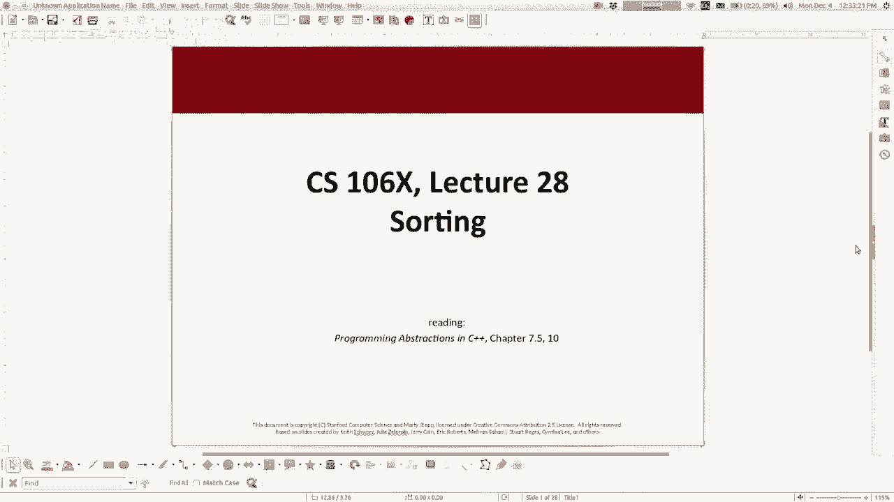

---

## 什么是排序？🤔

排序是将数据重新安排成有序序列的过程。例如，对整数排序通常意味着按数字大小排列，对字符串排序则通常按字母顺序排列。但排序的顺序可以根据需求定义，例如按字符串长度排序。虽然在实际编程中我们通常调用库函数来完成排序，但学习排序算法有助于理解算法设计、时间复杂度分析等核心概念。

---

## 低效的排序算法

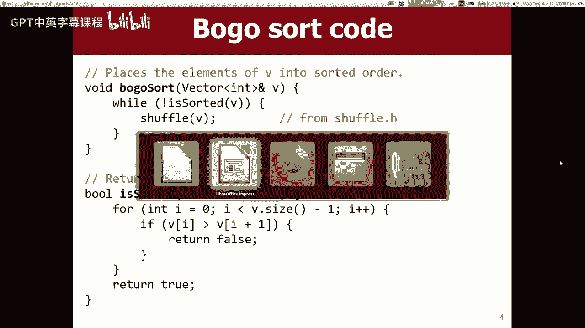

在探讨高效算法之前，我们先来看两个虽然简单但效率较低的算法，以建立对比的基础。

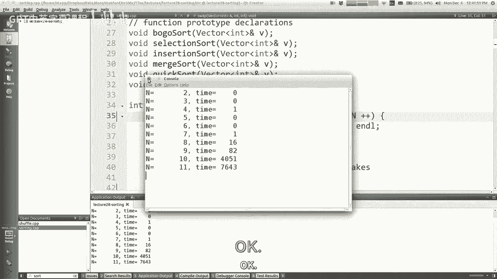

### Bogo排序 🎲

Bogo排序是一个非常低效的算法。其基本思想是：检查列表是否已排序，如果是则完成；如果不是，则随机打乱列表中的元素，然后重复此过程。

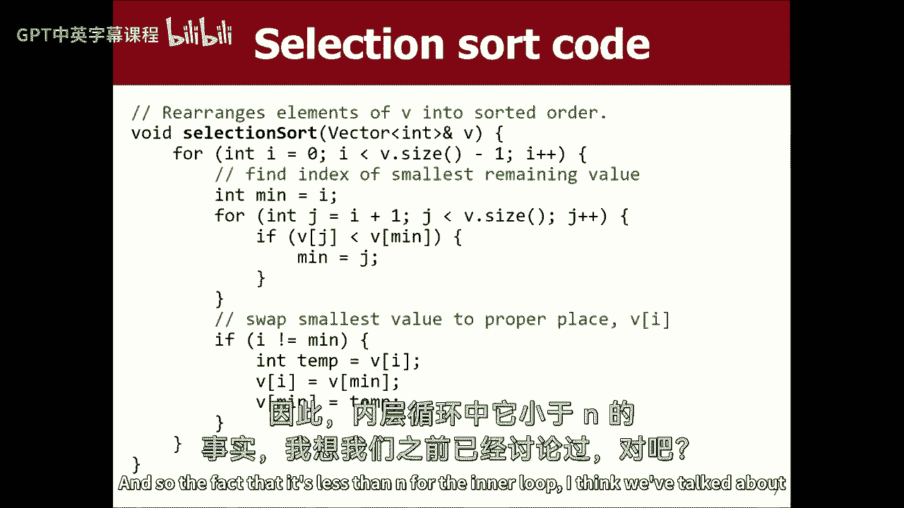

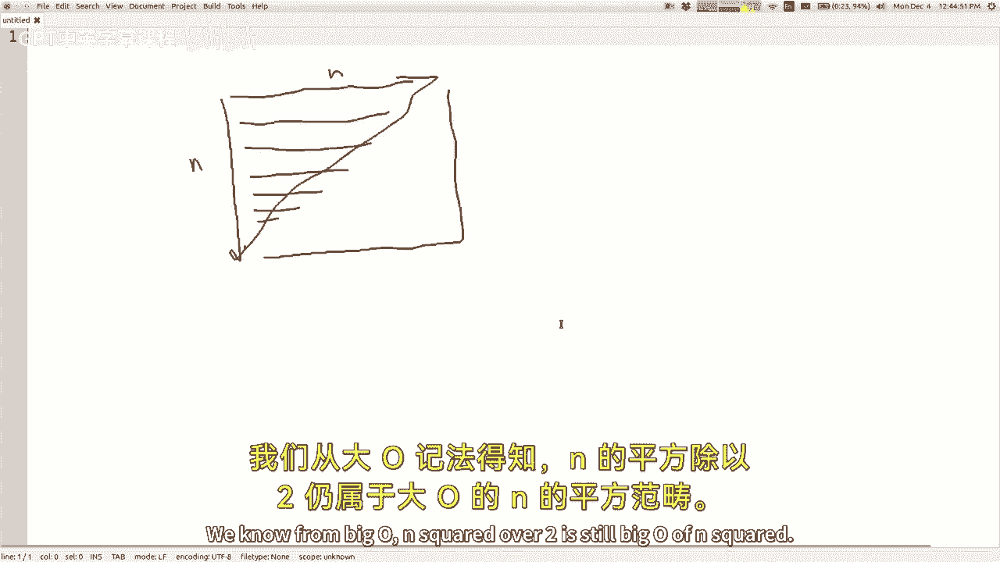

**算法描述**：
1.  检查列表是否已排序。
2.  如果已排序，算法结束。
3.  如果未排序，则随机打乱列表中的所有元素。
4.  返回步骤1。

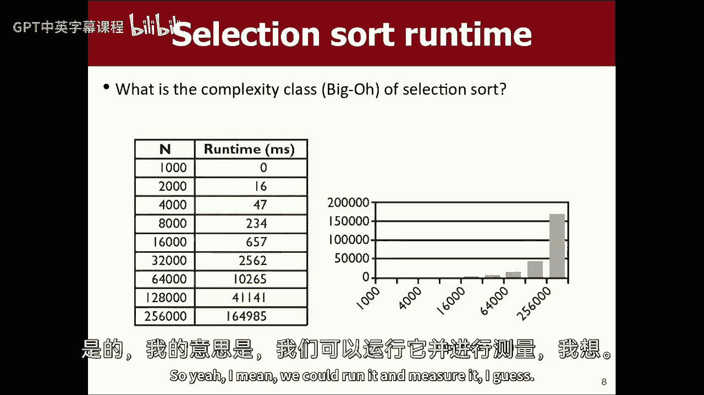

由于其依赖随机性，在最坏情况下可能永远无法完成。平均情况下，其时间复杂度是 **O(n!)**，因为找到正确排序的概率是 `1/(n!)`。

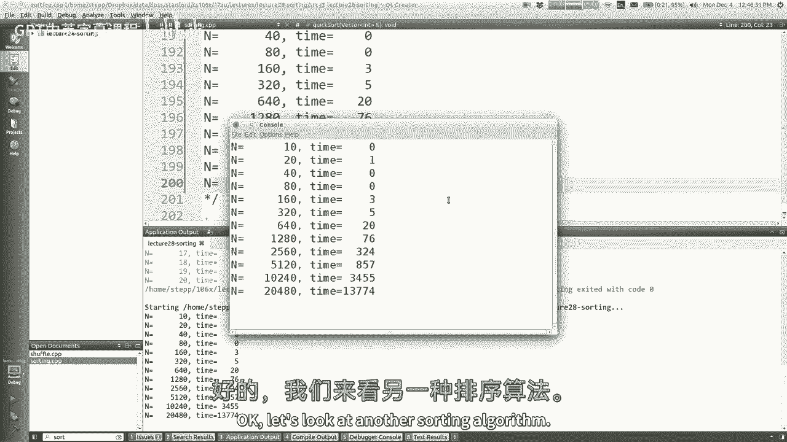

### 选择排序 🔍

选择排序是一种直观的算法。它反复从未排序的部分中找到最小（或最大）元素，并将其放到已排序序列的末尾。

**算法步骤**：
1.  在未排序序列中找到最小元素。
2.  将其与未排序序列的第一个元素交换。
3.  将序列的已排序部分边界向后移动一位。
4.  重复上述步骤，直到所有元素均排序完毕。

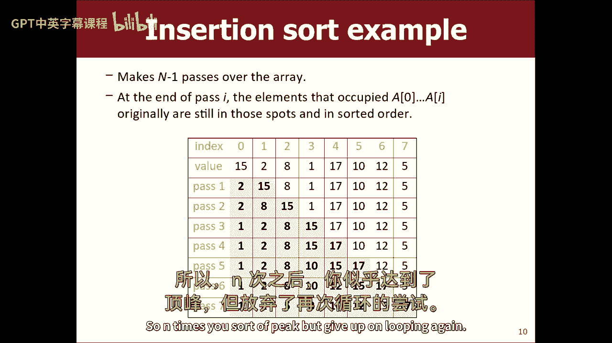

选择排序包含两层嵌套循环，其时间复杂度为 **O(n²)**。无论输入数据的初始状态如何，它都需要进行近似 `n²/2` 次比较。

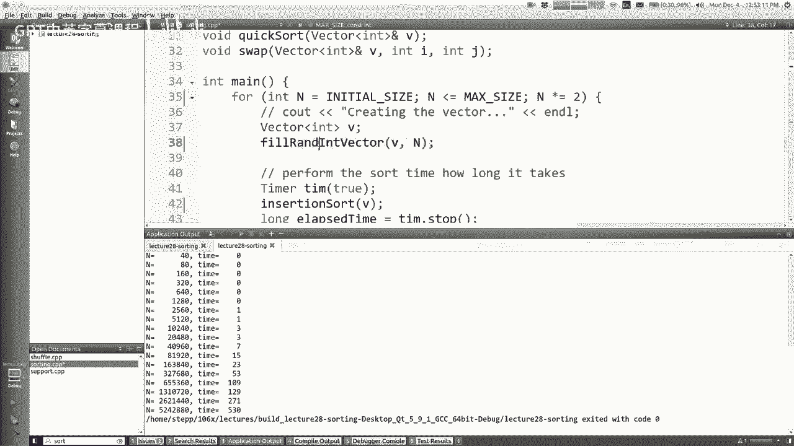

---

## 插入排序 📝

上一节我们介绍了基于选择的最小值查找排序。本节中我们来看看另一种直观的算法——插入排序。它模拟了人们手动整理物品（如扑克牌）的过程。

插入排序的工作方式类似于整理一手牌：从第二张牌开始，将每张新牌插入到手中已排序部分的正确位置。

**算法过程**：
1.  将第一个元素视为已排序序列。
2.  取出下一个元素，在已排序序列中从后向前扫描。
3.  如果该元素（已排序）大于新元素，则将该元素移到下一位置。
4.  重复步骤3，直到找到已排序元素小于或等于新元素的位置。
5.  将新元素插入到该位置后。
6.  重复步骤2~5，直到所有元素处理完毕。

插入排序的时间复杂度也是 **O(n²)**。但是，它有一个有趣的特性：如果输入数据已经基本有序，它的效率会非常高，甚至接近 **O(n)**，因为需要进行的“插入”操作很少。

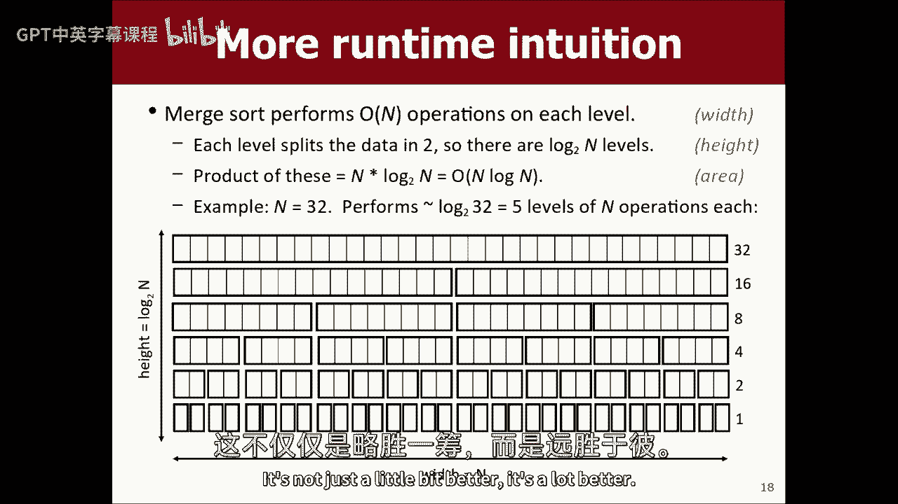

---

## 高效的排序算法

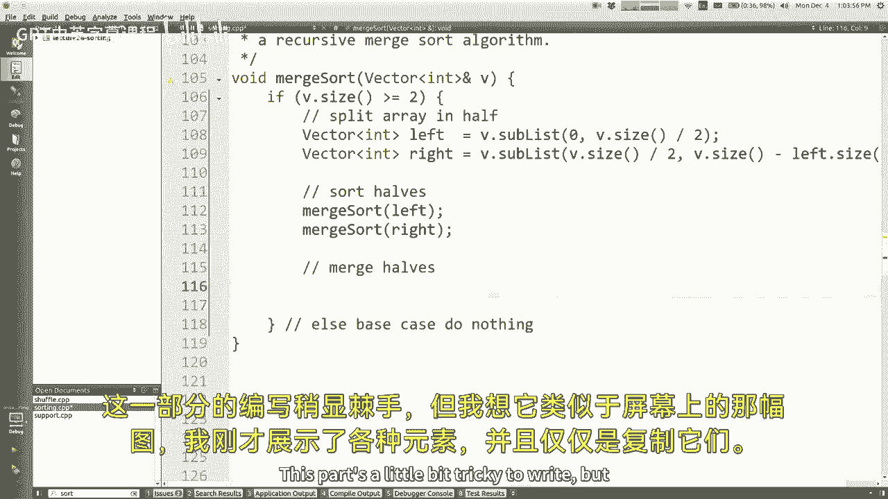

前面介绍的算法在数据量较大时效率不高。现在，我们来看看两种采用“分治”策略的更高效算法。

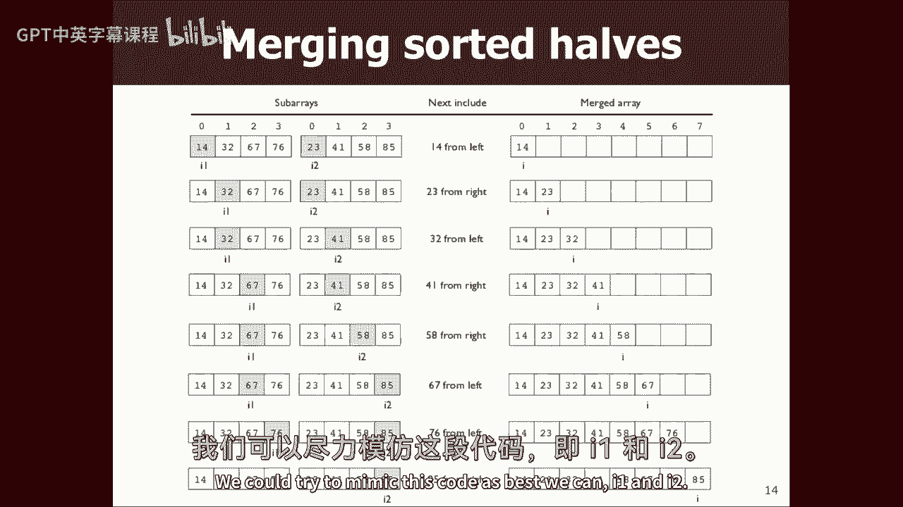

### 归并排序 ⚔️

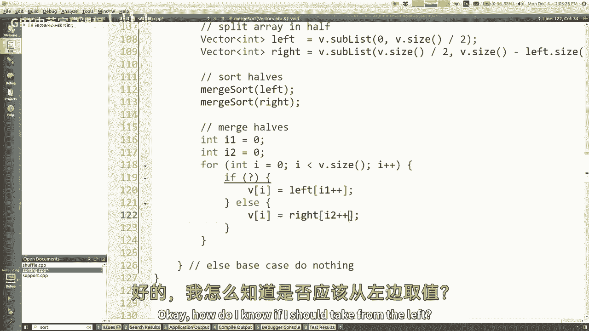

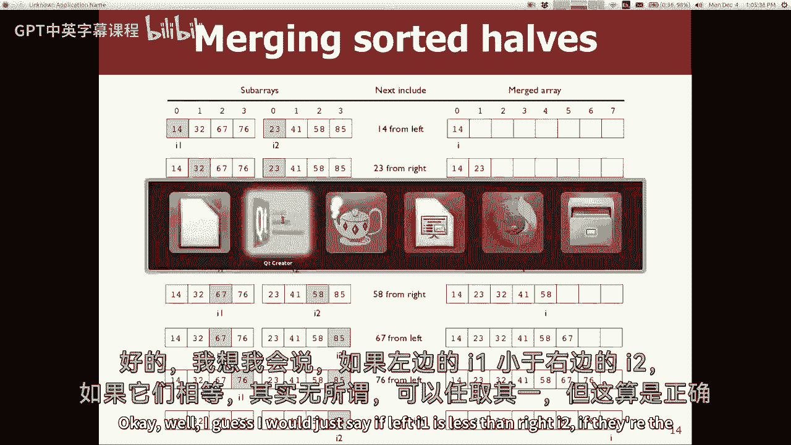

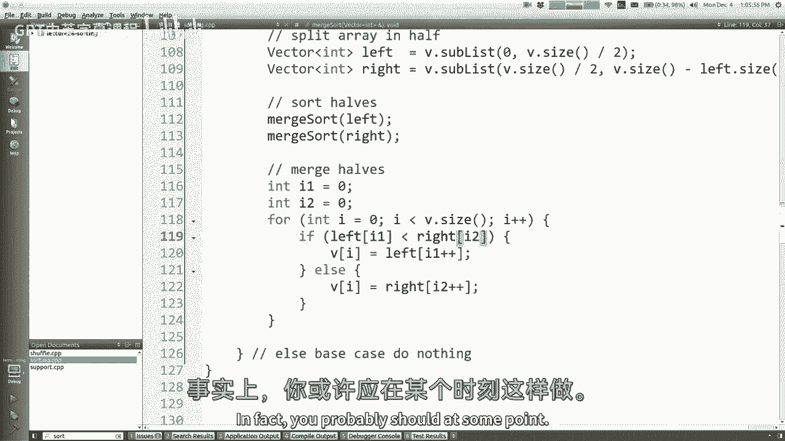

归并排序的核心思想是“分而治之”。它将一个大问题分解成小问题，解决小问题后，再将结果合并起来。

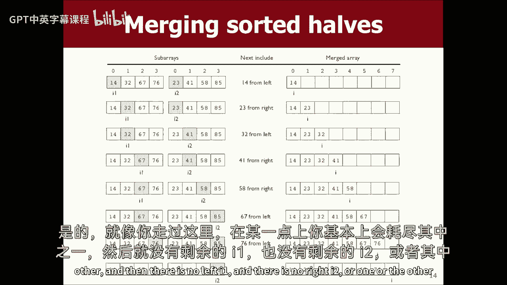

**算法步骤**：
1.  **分解**：将待排序的序列递归地分成两半，直到每个子序列只包含一个元素（此时自然有序）。
2.  **解决**：递归地对两个子序列进行归并排序。
3.  **合并**：将两个已排序的子序列合并成一个完整的有序序列。合并时，依次比较两个子序列前端元素，将较小的放入结果序列。

合并两个已排序列表的时间复杂度是 **O(n)**。由于序列被递归地对半分解，分解的深度是 **log₂n**。因此，归并排序的总时间复杂度为 **O(n log n)**，这比 **O(n²)** 要高效得多。

**核心合并操作的伪代码描述**：
```cpp
// 假设 left 和 right 是两个已排序的向量
vector<int> result;
int i = 0, j = 0;
while (i < left.size() && j < right.size()) {
    if (left[i] <= right[j]) {
        result.add(left[i]);
        i++;
    } else {
        result.add(right[j]);
        j++;
    }
}
// 将剩余元素添加到结果中
while (i < left.size()) { result.add(left[i]); i++; }
while (j < right.size()) { result.add(right[j]); j++; }
```

### 快速排序 ⚡

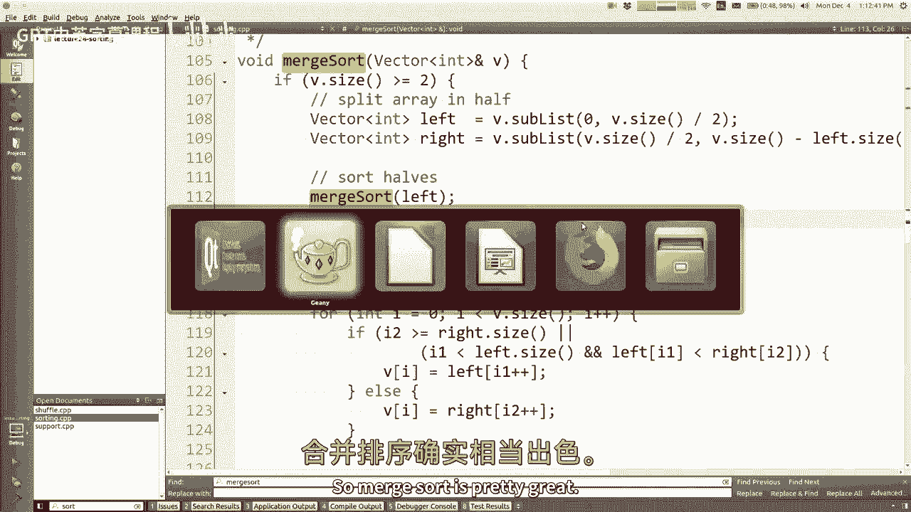

快速排序是另一种高效的分治算法，在实践中通常比归并排序稍快。它的核心思想是选择一个“基准”元素，将数组分为两个子数组：小于基准的元素和大于基准的元素，然后递归地对这两个子数组进行排序。

**算法步骤**：
1.  **选择基准**：从序列中挑出一个元素作为基准。
2.  **分区操作**：重新排列序列，所有比基准值小的元素放在基准前面，所有比基准值大的元素放在基准后面。操作结束后，基准就位于序列的中间位置。
3.  **递归排序**：递归地将小于基准的子序列和大于基准的子序列进行快速排序。

理想情况下，如果每次分区都能将序列均分，那么快速排序的时间复杂度也是 **O(n log n)**。但如果每次选择的基准都是最大或最小值，导致分区极度不平衡，最坏时间复杂度会退化到 **O(n²)**。因此，基准的选择策略（如随机选择或选择中位数）很重要。

快速排序通常比归并排序快一些，但它不是**稳定排序**。稳定排序意味着相等元素的相对位置在排序前后保持不变，这在某些应用场景中很重要，而归并排序是稳定的。

---

## 算法对比与总结 📊

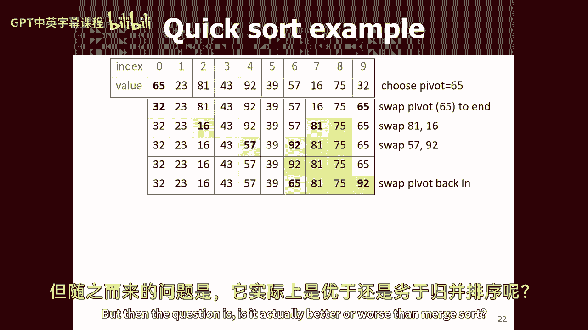

本节课中我们一起学习了多种排序算法：
*   **Bogo排序**：理论上可行但效率极低，时间复杂度为 O(n!)。
*   **选择排序**：简单直观，但效率不高，时间复杂度为 O(n²)，且与输入数据状态无关。
*   **插入排序**：对于小规模或基本有序的数据效率较高，平均时间复杂度为 O(n²)，但在最好情况下可接近 O(n)。
*   **归并排序**：采用分治策略，稳定排序，时间复杂度为 O(n log n)，是许多标准库的实现基础。
*   **快速排序**：同样采用分治策略，平均性能优异，时间复杂度为 O(n log n)，通常比归并排序稍快，但不是稳定排序。

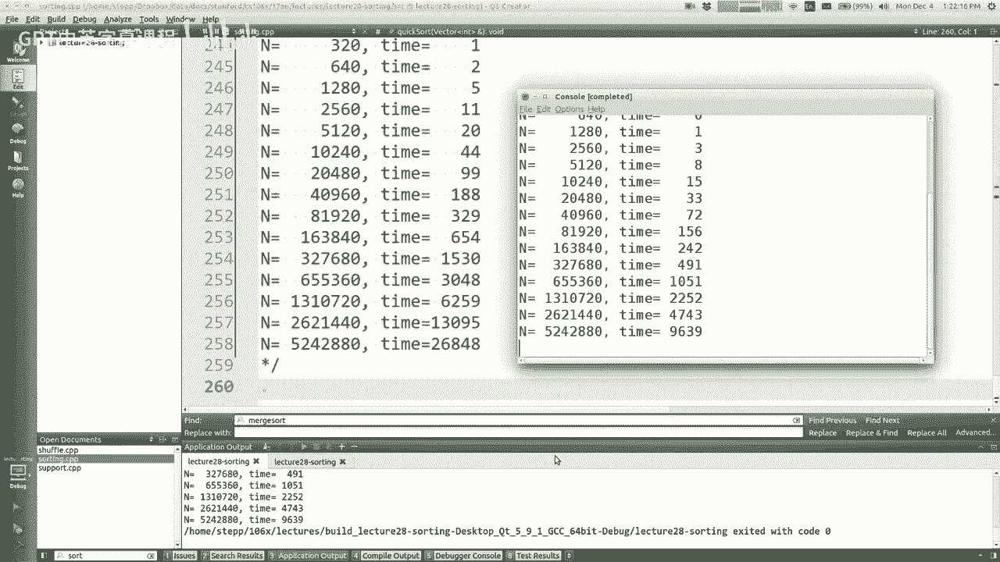

理解这些算法的原理和性能差异，有助于我们在不同场景下选择合适的工具，并深化对算法复杂度分析的认识。在实际编程中，我们虽然直接使用标准库的排序函数，但了解其背后的原理至关重要。