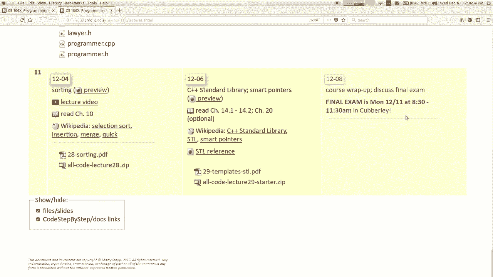
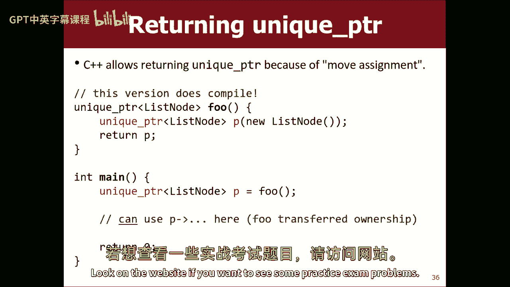

# 【编程抽象方法 cs106x 2017】斯坦福—中英字幕 - P25：Lecture 25 - Templates, STL, Smart Pointers - 加加zero - BV1By411h75g

开始了，这是我们今天上的倒数第二堂课，我们星期五上，星期一是期末考试，你现在可能知道了，呃，我很高兴看到你们在这里，我想奖励你来上课，所以我要给你们看一段小狗的视频，是的，是的，因为我爱你们，所以说。

那倒是真的，我应该把视频关掉，不应该，我是的，去他们的，他们没有来，所以说，我们开始上课吧，别告诉他们他们错过了什么，嗯是的，所以我保证我今天也会试着教你一些东西，所以好吧，剩下的演讲时间我要做什么。

下面是我想告诉你们C Plus的一些方面，我们略过了，因为我们用这些斯坦福图书馆，如果你再也不用C++编码了，那你真的不需要这些东西，我今天要告诉你，但是如果你的代码是C++。

在这门课之外或者斯坦福之外，你需要知道如何编写真正的C++，你知道可以说，也许我们应该一直教你真正的C+，但我觉得重点是我们的东西更容易使用，更容易学，如果你犯了错误，比真正的东西更有帮助。

所以这就是为什么我们在这门课中使用它，然后我们想，如果你能一路走到这一步而不辍学和退出，然后你可能会想出如何把这些东西翻译成真实的东西，季度末，这就是我们现在所处的位置。

所以让我们来谈谈吧，在我告诉你之前，我想谈谈一个叫做模板的特性，它与这些东西有关，所以我会到达那里，所以让我们来谈谈模板，这来自书的第十四章，嗯，您可以编写一个模板函数。

模板函数是接受已知类型的参数的函数，所以我的函数没有用int作为参数或字符串，你说我的函数用t表示某种类型的t，我还不知道是什么，所以这个想法是，函数可以自我复制，它可以创建一个自己的版本。

该版本接受一个int，参数，或者一个需要双倍的，或者根据需要取一根绳子，如果你叫它，给它一个双倍，它会制造一个自己的版本，需要一个双倍的，以此类推，我想从一个例子中更容易看出，我给你看下一张幻灯片。

这里有一个叫做max的函数的例子，您给我一个类型为t的值，称为a，类型为t的值，称为b，哪个大一点，如果a小一点，我就把它退了，真b，否则，如果你是一个，所以我认为这个想法是。

您可以通过传递int来调用它，你可以通过传球双打来称之为，您可以通过传递字符串来调用它，你想要的任何类型，它只是复制了这个函数的一个副本，但是它会把t换成int，好像你是那样打出来的。

所以你必须确保的一件事，你想传递的数据类型，它必须支持您在此代码中调用它的任何东西，所以如果我写的小于a小于b，我必须传递一个数据类型，它有一个小于操作，所以如果我在里面通过一个，它不会编译吗？好啦。

或者如果我试图调用函数，就像如果我把那个点说成大写什么的，然后我输入的任何类型都必须有一个两个大写，暗示是没用的，但它可能对弦起作用，你知道类似的事情，这就是模板函数的思想，很多语言都有这样的概念。

那你可以有一个通用的数据类型啊，参数什么的，好啦，您还可以编写使用模板的类，在我们的课堂上，你可能会更多地遇到这种情况，你可以你可以写它类，这是声明类的标准语法，就像H文件之类的，但最重要的是。

你说得好，这不仅仅是一堂课，这是一个类的模板，该类与称为t的数据类型相关，这里的想法是，这是你写作时我们用的，当你有一个向量或哈希图，或者类似的事情，那些是模板类，所以你可以做一个int向量。

字符串的向量，你在这些尖括号中提供t的值，所以如果你说弦的矢量，然后它复制向量代码，其中t被设置为string，这就是矢量的用法，所以这是一个模板类，它的语法有点好笑，你写标题，上面写着模板。

然后在CPP文件中，当您编写所有方法的主体时，你说模板也在那里，这里有一个快速的例子，如果您有一个名为数组到列表的类，或者这就像我在重新实现向量，但写在自己身上，你知道的，但它只适用于它的。

所以你可以添加一个int，你可以把它放入给定的索引中，可以在索引中插入，你可以把这种事情做对，所以它基本上是向量的方法，但它只对它起作用，你说，哦，天哪，我真的希望它对每一种类型的数据都有效。

我们可以把它做成一个模板类，对呀，所以说，当然啦，有些人想做的是，他们说得好，如果它不再是一个收入清单，我把它列成一张清单，或者名单什么的，所以我要搜索并把单词替换为这里的字母t，这让你更接近。

但是有一些词出现了，那是不应该被取代的对吧，喜欢喜欢，哪里有一些应该留在，它不应该变成，再举个例子，大小，是啊，是啊，名单的大小是一英寸，这不是一个T，如果我有一个字符串数组列表。

该列表的大小不是字符串，对呀，所以是的，我应该说，还有什么应该留下来，如果你有不同的答案，能力，哦耶，是呀，下面的一些田地，规模和容量，就是这个尺寸，数组的长度，你有答案吗，是啊，是啊，我做索引，索引。

是啊，是啊，比如当你得到一个索引的值，列表的索引是整数索引，不管索引中的数据是什么都是对的，所以你认为，是啊，是啊，我认为所有索引的出现都应该保持不变，如果你，如果您将此重写为模板类。

它说锻炼就像我们要一起写一样，我不会那么做的，因为我不想那么做，但你知道我们可以我们可以做到，如果我们将最后一段代码更改为模板类，我们就能做这样的事情，列出INS列表，其中之一是基本上是一个向量。

也许现实一点，直接把绳子放进去什么的，因此，练习基本上包括以下内容，就像我们将类声明为模板类一样，然后我们会有选择地用茶代替，在那里做有意义的事情，所以说，添加类型为t的值，你得到一个值。

添加一个一英寸的索引，但是如果它的值是T类型正确的，所以你会穿过这些不同的地方，把茶放进去，酌情，是啊，是啊，所以T是一个占位符，就像你用的那种类型，是啊，是啊，它有时被称为类型参数或类型变量。

就像我认为它只是一个喜欢的替代，如果我写一个现实的字符串，就像这样，从字面上看，遍历这个文件并用字符串替换t，然后它就像承认作为源文件，作为一个程序员，他基本上是这样编译的，你需要负责确保更换发生。

它仍然在这里的一个函数中，我猜函数的类型是T类型，您需要确保所有这些添加实际上是，我是说如果我在这个代码上多花一点时间，我们可以遍历所有这些函数的所有主体，并确保，我拿着这些小T做什么，我想你会发现。

我只是把它们存储在一个数组中，然后返回它们或其他什么，好像这就是我对他们所做的一切，所以我不依赖数据，键入t以获得它支持的许多特定操作，就像我没有试图调用每个T值的方法一样，你知道我的意思，实际上。

这就是为什么它对任何类型的数据都如此有效的原因，因为我几乎什么都不期待，我只需要能够存储和返回这些值，真的，如果你在做一个布景或一张地图，排序成一个顺序，那些模板类试图做小于或大于的事情来计算顺序。

它应该把一切都分类，所以你只能使用那些类，使用具有小于或大于运算符的类型，在他们身上定义有一种方式喜欢，检查要等于什么，有没有像，我可以做喜欢，如果t等于谁这样做，如果t等于做啊，是啊，是啊。

那是个有趣的问题，嗯，C++并没有很好的方法来做到这一点，比如如果你有一个给定的数组列表或向量，或者你能告诉我你喜欢什么类型，什么事？它并不真的支持，有一个特点，如果你想谷歌什么。

这叫做rti运行时类型推断，它试图做到这一点，但效果不是很好，我不推荐更多，现代语言有更好的能力喜欢，自讨苦吃，就像Java有一种问的方式，它在Java中被称为反射，你只要问一个班，你喜欢什么类型。

你喜欢在海滩上散步吗？或者你所知道的，你喜欢什么类型，呵呵，你知道的，你可以用其他语言询问这些信息，但是C++并没有很好的支持，反正，在那里吗，另一个我错过了另一个问题吗，是啊，是啊，那么是什么类型的。

啊，为什么这里写的是类型名，那只是个关键词，我只是说这门课取决于你，提供数据类型的名称，我在这里说，但这基本上是一个变量，我可以让马蒂，然后所有这些无边的，你呀，所有这些茶都是马蒂的，我可以叫它什么。

我见过，最常见的惯例是称之为T，但如果我写得像哈希地图课，这实际上取决于钥匙的类型，逗号值的另一个类型名称，所以它通常被称为类型名，类型名称，五，所以类似的事情，是啊，是啊。

如果你看看斯坦福收藏的源代码，他们不说，他们通常称之为值类型或元素类型，他们用了一个完整的词来形容它，但我个人更喜欢这个小短它只是对我来说，给我的那个简短的大写字母，它说那是一个类型变量。

对我来说就是这样后面还有一只手吗，某处，是啊，是啊，所以当你对类型进行一组比较时，如何指定，啊，如果你像一组或一张地图一样排序，你需要知道顺序，您如何指定如何进行您需要的订购，而不是，是啊，是啊。

所以这节课的作者让别人知道的方式，我需要你的课有一个小于或大于是，你只要用它，然后当他们试图创建您类型的对象时，他们提供的A T没有这些运算符，它就是不会编译，上面写着这条线要求这个操作员，是啊，是啊。

那有点笨重，他们只是不知道，直到他们试图正常编译，您可以在这里对文档的评论中解决这个问题，你就会说嘿，您可以将此用于任何支持此、此和此的泛型类型，有些语言有更多的契约。

在这里你可以说类型名t冒号必须有这个和这个，还有这个或者你可以用，就像这些接口，需要您正在使用的t类型的某些特性的东西类型，但就像Java有Java一样，您可以说type name t扩展了可比的。

现在你只能接受可以比较的类型，你可以做这样的事情，你知道的，但那是，你知道的，他们没有想到这一点，当他们做c+加的时候是1983年，放他们一马，是啊，是啊，反正，这里还有其他问题吗，是啊，是啊，去吧。

还有其他东西可以放在括号里吗？除了时间，类型名称，或者这是唯一的，哦，除了类型，你还能放别的吗，我想你可以说T级，但就像我想他们想让你说类型名，因为这样你就可以提供一个int，这不是一个类，或枚举。

或者其他的事情，我想我不确定C++的语法在这里允许什么，但我知道你可以说上课或打字，但他们告诉你打字更普遍，反正，这是它的基本思想，我不会让你在考试中这么做的，或者做作业什么的，但我有点想填补这个空白。

因为就像你们实现了所有这些不同的集合，您已经了解了二叉树和链表是如何工作的，你可以理解所有这些东西是如何实现的，但是我们总是用int或string来实现它们，这是一种逃避，或者一些简单的类型。

它只适用于一种类型，我想确保你能看到，它实际上没有太多的工作要去从一个只工作在，到真正拥有一个什么都能用的，所以可以说，也许我们应该从那开始，但它只是给代码增加了一层复杂性，所以嗯，好啦，嗯，反正。

下面是一些，你知道的，如果您正在创建T的数组列表，您创建一个新的T数组，你知道代码会有一点变化，但是一旦你习惯了，没那么糟，好啦，所以我要去，那个话题到此结束，但它引导我进入我接下来想说的。

哪个是标准模板库STL，这基本上是一组C++附带的集合，与我们在本课程中使用的斯坦福收藏相反，所以让我们谈谈吧，STL，不要与斯坦福模板库混淆，我们用了很好的缩写，伙计们。

STL是语言附带的一组类和算法，它们很大程度上依赖于我刚刚向你们展示的模板功能，它包含一组集合，他们称之为集装箱，但他们的收藏，这是一回事，它还附带了一套算法，这真的很有趣，我将在几分钟内讨论这个问题。

它还附带了一堆其他的，只是杂七杂八的功能，我马上就给你看，但是它们包含在这个STL中的集合，它有一个一对一的映射到我们在这个类中使用的，所以我想这提出了一个问题，为什么我们要费心重新发明轮子。

重写所有这些东西，我要给你们看一些例子，你可以在讲座结束时决定，不管你是否同意我们的决定，好啦，所以这是一张喜欢的桌子，我们在左边的课上所做的，在真正的语言中，真正的是什么，在右边，所以对于初学者来说。

您可能会注意到，所有类的名称都是小写的，我不知道他们为什么那样做，我想很多东西都是用C++和小写字母命名的，尤其是作为标准库的一部分，like string是小写的s，所以他们有，你知道地图。

他们有一套，它们的向量是小写的v，他们有堆栈和队列，它们的优先级队列带有下划线，他们有哈希图和哈希集，称为无序映射和无序集合，因为它们杂乱无章，因为散列，你知道的，所以你知道。

这些东西大多映射到真正图书馆中的东西，少了几个，就像他们没有字典一样，词汇是一种特殊的结构，只用于某些类型，在某些情况下，所以他们不包括他们没有图的类，我可能在我们讨论图的时候提到过。

很多时候你实际上没有一个图形对象，你只有一张地图，它基本上意味着这是一个邻接列表，什么的，或者你得到一个2D数组，它基本上是一个邻接矩阵，我们说过的内部陈述之一，所以他们没有图库，是啊，是啊。

那是他们内置的一组库，我马上向你展示一下它们是如何使用的，下面是一个具体的例子，实际向量和我们的向量的比较，下面是适当方法的名称，所以你知道，在我们的向量中，有一个大写，B，呃，如果要在末尾添加元素。

你说就在那里推回，我不知道他们为什么叫它推回，但我想这和，就像，推是加弹是除，我们学习堆栈的术语，所以他们决定喜欢，在所有线性集合中使用该术语，我认为这是个糟糕的选择，但不管是什么。

我认为命名委员会应该给这个想法多一点，抵制，清晰是一样的，如果你想从向量中得到元素，你说，获取或使用括号，他们没有得到的方法，但他们有应用程序的方法，基本上就是得到，但是你还是可以用括号。

所以这部分没问题，嗯，其他一些方法有点奇怪，就像插入在适当的地方被调用，比如这是谁的主意，我知道这就像你得谷歌，那个地方，什么，反正就是叫他，你知道，就像方法上的小命名差异，区别不止于此，我有一些星号。

那个，我想马上谈谈其中的一些，但你知道没那么糟，对呀，只是为同样的东西学了一个不同的名字到目前为止还不错，我一会儿要讲的一件事是，嗯，其中一些方法不仅仅是名称不同，他们想要的参数是不同的。

特别是很多方法，我们希望通过索引，想在那个指数上做点什么，比如在给定的索引点插入一些东西，STL而不是要求您传递索引，它要求您传递另一个叫做迭代器的东西，我一会儿就谈这个，下面是一个代码的快速示例。

这是使用斯坦福，我们做对的那个，这是我们的矢量，我们做一个矢量，我们加5寸，我们插入索引零，我们正在进入索引，两个右，那是那是，你知道，第二周我们已经做了，这是真的，好像是这样。

所以当你声明的时候小写v，你注意到图书馆，当包含库，它有括号而不是引号，这意味着系统库，而不是本地图书馆，小写d向量，而不是你怎么说，向后推，这还不错，这很奇怪，在向量的开头插入四二，对呀。

我以前在这里说的是零，在这里插入索引，我说在开头插入，然后如果我想删除索引2中的元素，我说一开始就删除元素，加二开始，只是一个返回零的方法，就像这里是怎么回事，否，它是，我会说的，但这有点奇怪，对吧。

我们会习惯的，但这有点奇怪，这是地图，我会回来的，一分钟后开始工作，但这里有一张地图，这是我们的斯坦福地图，对呀，我们已经学过的那个，你画一张地图，你在里面放了些东西，您可以在文件上循环并将内容添加到。

你知道的，一张地图，你可以问地图是否包含一些非常标准的东西，这是真正的地图，所以你包括，你知道，系统标头，你用小写声明，然后这边也是一样的，输入数据没问题，这样很好，去把东西拿出来，但看看这个。

就像问你看不见的东西，侧面太低了，但要问在地图上是否发现了什么，没有包含键方法，有一个很好的方法，但它不返回布尔值，如果你想找到它，它不在地图的尽头，然后它就在那里，就像。

这就是你问某物是否被包含的方式，所以这很奇怪，所以，我的意思是，它就像它的大部分罚款，但后来发生了一些奇怪的事情，这有点像所有STL的工作方式，基本上你看到它的最初几次，我要谈谈这个开始。

最后的东西在一秒钟内，所以开始和结束是所谓迭代器的例子，迭代器是在集合中存储位置的对象，我的想法是，你知道你可能会在元素中循环并打印所有的元素，或者检查他们，或者修改它们，或者你可以通过做一个。

在向量或其他东西的索引上循环，但有些集合没有索引，那么我喜欢如何在集合上循环，有些语言或库有这个概念，称为迭代器，你说给我一个迭代器，它是一个小物体，帮助你走过收藏，看看所有的元素，你可以说嘿，迭代器。

给我一个集合中的元素，然后移动到下一个元素，然后再给我一个，它可以处理类似的事情，我如何在这个集合中走动，看看所有的元素并把它们给你，这就是迭代器的作用，在向量的情况下，迭代器很容易理解。

它只是一个小对象，排序你是什么索引，如果你说给我下一个元素，它会抓住它然后还给你，如果你说进入下一个元素，它的指数会是正的，所以这很容易理解，但可能很难理解你为什么想要，因为你可以自己做。

你不需要一个物体来帮助你做到这一点，我想也许一个更好的例子是像一套什么的，秩序混乱，我也不太清楚，它没有索引，所以如果我想把元素弄出来，不知何故，它有办法四处走动，让他们，所以我只说给我一个元素。

它会从，如果我说去下一个，它会走到房子里，然而，它需要这样做，它会走到集合中的下一个元素，所以再一次，对象，帮助您遍历集合的元素，所以STL大量使用这些东西作为其设计的一部分。

所以如果你想循环一个向量的元素，如果需要，您可以使用从零到大小的索引，但是你也可以说给我一个迭代器，等于向量循环的开始，直到i到达向量的结束，和一个加号加号，这个迭代器。

Plus Plus是在迭代器类中重载的运算符，将其移动到向量的下一个元素，所以你基本上可以写一个遍历向量的，把所有的元素都打印出来，我认为用矢量看起来是一件愚蠢的事情，因为你刚才说做一个for循环。

从int，i，0到大小，那是更聪明的办法，对我来说更有意义，但这个确切的循环将适用于STL中的任何类型的集合，只不过你会把它从b变成一个集合或一张地图，不管你明白什么，所以一个从开始到结束的模式。

图书馆里的每个藏书都知道怎么做，使用迭代器，好啦，所以实际上每当你为每个循环做一个，暗地里编译器真正在做的是，它在做一个迭代器，然后查看每个元素，这就是当你为每个循环做这件事时真正发生的事情。

所以关于迭代器的这些东西是使用stl的核心，你不能就这样不用它，因为很多不同的方法，所以我们不喜欢那样，你们必须在第一周或第二周处理这个问题，所以这就是我们想要回避的原因之一，你知道这是个奇怪的概念。

你可以掌握诀窍，但需要一分钟才能弄清楚，所以这就是我们避开STL的原因之一，在我们的课程问题中，是啊，是啊，斯坦福图书馆也，所以实际上我们的图书馆，我们的载体，我们的布景，我们的地图。

我们所有的集合类都有这些迭代器，如果你叫点开始，它给你一个迭代器，如果你叫点尾，它在集合的末尾为您提供了一个迭代器，但我们不强迫你方法都在那里，不需要使用它们，所以基本上就像你说的。

就像你不必知道他们是否在那里，所以我的意思是我们有点希望STL有同样的设计，但他们不在后面，是啊，是啊，那么指数如何更好，它基本上就像一个基于数字的迭代器，对呀，是啊，是啊，是啊，是啊，这怎么比索引好。

这不是，我承认这样也好不到哪里去，如果i等于零循环更容易理解，这样更有道理，你不需要这个，我给你看的原因，这个例子是，如果你用一组s代替向量v，你可以有完全相同的循环，但你可以说嗨点和s点结束。

完全相同的代码会在布景中遍历，所以说，迭代器是与所有元素交互的统一方式，按收藏顺序，不管里面是什么藏品，不管是数组还是链表，哈希表或二叉树，迭代器会遍历它，并给你元素，所以你可以看着他们。

所以它应该是一个统一的界面，您可以使用它与每个集合的元素交互，在循环中或在序列中，所以创建者或者你有主索引，罚款，他们本可以，是啊，是啊，但使用这个的原因是，因为这个迭代器对象可以在他体内存储状态。

所以如果他在某个二叉树里面，他可能需要在不同的节点上行走，所以他可能需要喜欢，记住他在哪个节点什么的，如果它只是一个int，我不能喜欢，将该信息存储在int中，你知道我的意思。

所以这个对象可能只是存储它，他可能只是一个包裹，让一些人记住他在哪里，但他可能储存了无连接的石头，二叉树注释，绘制他在周围行走的顶点图，他喜欢帮忙记录他需要记录的东西，遍历完全广义的数据结构，是啊。

是啊，是啊，是啊，和喜欢，我会说喜欢，我已经承认了，这个向量上的循环在一分钟内有点傻，我来告诉你这些小家伙在哪里可以为你做一些强大的事情，我想现在我只是想解释它们是什么，我认为动力仍然有点缺乏。

因为你就像，你为什么不用它呢？我给了我几张幻灯片我想我可以让它更有动力，是啊，是啊，事实上，只要你能，您可以访问，就像，对着中间的藏品说，你不应该去那里，如果你能进入，哦耶，这是否破坏了类似的封装。

我可以走到队伍中间吗，是啊，是啊，所以你可以做的一件事是，您可以使迭代器不受支持，如果您不想让用户访问这些，就像在堆栈上，我只想让他们摸上面的元素，不是其余的，所以也许我不会在堆栈上提供迭代器。

那将是我可以做出的设计选择，或者我会说是的，如果我真的提供了，你不应该那样用它跳到队列中间，或者堆栈的中间和变化，那里有什么，你知道的是的，你必须，您必须决定您希望允许用户做什么。

基本上我不喜欢他们的图书馆，如果图书馆在那里，你想写代码来做到这一点，它会让你这么做的，我是说有些图书馆设计师想阻止你做一些，他们中的一些人想让你决定，但你得负责任，你知道权力越大责任越大，对呀。

差不多吧，蜘蛛侠系列，嗯，我再给你看一点，你能用这些东西做什么，因为我想现在就像这样，就像一个垃圾循环，这有什么意义，我再给它一点动力，所以在这里，让我在这里等着，有一个标题叫做算法，如果包含算法。

你突然得到了所有这些坏函数，你可以调用，其中一些相当简单，就像，啊，你知道的，排序还是洗牌还是好的，不管怎样，这里有一大堆很酷的东西，你可以把这些叫做，这些只是存在的全局函数，现在你可以打电话给他们了。

你可以给他们任何收藏，它会对收藏品造成这样的影响，它会整理藏品，它会洗牌收藏，它会搜索收藏，它会逆转收藏，不管这些不同的东西，其中一些不是微不足道的，但就像你知道的，计算给定元素的所有出现次数。

数数所有发生的事情，如果下面的谓词为真，你知道的，已排序的集合是什么，这些都是您可能认为是集合类中的方法的操作，就像嘿，矢量点，整理一下自己什么的，但他们所做的却是，他们把它们写成一种全局函数。

并且将集合作为参数传递，这意味着任何集合都可以通过，即使你写了一个合集，它将与这些图书馆一起工作，这些方法的一个有趣之处在于，这些函数是不传递向量或哈希映射，您传递一个迭代器，如果你给它一个迭代器。

它将遍历集合的元素，然后做函数承诺做的任何事情，所以这真的很酷，因为如果您编写自己的集合，其中包含迭代器，您可以在集合上调用这些方法，也是，因此，我们的斯坦福收藏采用了这些方法。

下面是调用这些方法的几个快速示例，如果要对向量排序，你不是说B类吧，你说从向量的开始到结束排序，所以你所做的是，你真的像指针一样传球，基本上是指向开始和指向结束的指针，你说的一切都在这个范围内。

我想把它分类，它会的，但你可以对任何其他类型的收藏做同样的事情，它也会解决这个问题，你也可以做一些很奇怪的事情，就像我想对这个向量的后半部分排序，你可以说排序开始加大小超过两个逗号结束。

它将对矢量的一半进行排序，但剩下的就不用管了，真的很酷，不是吗，您只能像向量的范围一样排序，它就会那样，它之所以有效，是因为您可以在迭代器上做加号，在这么多的因素下前进，嗯。

如果你想知道剧组里有多少马蒂家的人，您说它使用集合的开始迭代器和结束迭代器，它需要你想要搜索的元素，这是你的马蒂号码，其实呢，我认为marty的复数是marty，但不管怎样，你找到了你收藏的所有标记。

嗯，你想知道向量中最大的元素，好啦，给你，最大元素，你想，你知道的，从V1复制五个元素，从v1开始到v2，好啦，复制开始加五，你知道它有所有这些真的真的很酷，这些算法的强大使用，事实上。

每年都有这些国际编程比赛，你知道他们在小团队中给学生这些棘手的算法问题，他们必须以最快的速度输入解决方案，尽可能多地解决问题，你们中的一些人以前可能参加过一些编码比赛。

很多时候他们让你从几种不同的语言中挑选，你想不想，Java，你想不想，C加什么加什么，大多数赢得这些东西的团队都用C++代码，不是因为C++是一种好语言，但是因为它有这个，这些都是如此强大的东西。

就像很多常见的问题都可以通过，只是从这个库中抛出一堆函数，然后它就起作用了，所以这是非常非常，STL非常强大，一旦你知道如何使用它，但有一个问题是这样的开始和结束，迭代器的东西到处都是。

所以你只需要喜欢，早点说，也许比我们想要的更早，那很不幸，如果我回去一秒钟，嗯，迭代器的语法是它们的行为有点像指针，它们不是指针，但是如果您想访问迭代器当前所在的元素，您必须写star加上迭代器的名称。

如果你还记得，那是跟踪指针星的操作员，p是指针p指向的值，这使用了重载版本的运算符来表示，去找迭代器指向的元素，所以为了做迭代器，你得理解指针，或者至少是指针附带的运算符，又是这样。

就像如果我们要用这个收藏库，在本课程中，我们不得不谈论星星和与号，再加上好处，减号在指针上，在第二周做一些类似的事情，所以我只是，你知道的，这也是我们不去图书馆的原因之一，在我们班，是啊，是啊。

你想出的这个范例，就像，和大范围算法，有点依赖于，劳动领域的抽象概念，这种范式应用于不同的，我们能用这个做什么，对此非常具体，写一般函数的想法，在任何课程上都有效，是啊，是啊。

它在不同的语言中以不同的方式应用，嗯取决于什么，你知道，它是一种语言，Java一开始并没有这个概念，所以如果你想有一个排序函数，您要么在数组is class中放置一个排序方法。

以及链表类中的排序方法和该类中的排序方法，你知道你必须这么做，或者您必须使用静态方法编写一个类，你知道你必须有一个接口或者一个叫做Collection的超级类，然后所有的收藏都扩展了。

或者你知道你必须这样做，你必须用某种基于继承的诡计来修复它，所以我的意思是，在Java中，你不能总是这样做，还有其他一些语言，比如Ruby语言有一个叫做Mix Ins的概念，有点像多重继承。

你可以说我想要这个功能和这个功能，还有这个和这个我想让你把它们都放在我的班上，现在你把一切都混合在我身上，所以如果你的红宝石混合在，你可以说我想被分类，所以我要把排序混合放在我的课上。

现在我可以做到这一点，我可以给自己打电话，所以不同的语言以不同的方式做到这一点，但我想每一种语言都想要这样的东西，就像我有很多不同的容器、收藏或对象，我希望能够有，他们都支持这个操作。

这在他们之间是相似的，所以他们怎么做取决于语言，是啊嗯，谁听到了我们自己的收藏，很可能给了她一个，如何给自己的集合迭代器，您必须编写一个支持某些操作的小类，像一些运营商，就像一颗星星和一个加号。

我想如果你想谷歌一下，我认为这是最好的学习方法，您必须编写一个支持一些操作的小类，通常在集合类中实现它，就像如果你有一个矢量点h，您正在编写自己的向量类，你会做一个小迭代器，嵌套在向量内部的类。

这样它就可以查看矢量的所有数据，在迭代器类中实现某些特定的操作，然后你必须写向量的方法，称为开始和结束，返回指向数据开始和结束的迭代器，分别，所以如果你好奇，你可以看看一些斯坦福收藏的来源。

因为它们内部有迭代器类，有时候读起来有点难，但我觉得这会让你有一点想法，还有很多教程，比如如何编写C++迭代器类，如果你想谷歌一下，它会显示，所以这是一个一般的想法，虽然，是啊，是啊。

我的幻灯片少了很多，哦为什么是正加，我是说这是一件很微妙的事情，如果你真的发帖，在增加到新值之前，它必须返回旧值，所以从技术上来说，它必须复制迭代器来做到这一点，所以它浪费了少量的内存。

所以如果你做了加号，它立即递增它，而不返回旧值，这只是一个小小的优化，反正，是啊，是啊，还有其他问题吗？是啊，是啊，如果你的排序器不是有序的，像你这样的人，尝试在哈希集上调用sort。

没有排序数据类型的，它不会编译，因为在排序的实现中，它试图说小于和大于，然后你的收藏对象会有一个，所以里面的东西顺序不对，啊，原来如此，我明白了这样元素就可以排序了，但在收藏中。

试图对它们进行分类是没有任何意义的，是啊，是啊，这是个好问题，我其实我不记得它是做什么的，嗯，我很确定它不喜欢打破哈希集，但我不记得了，我认为您可以在迭代器中提供一些特性。

你可以说我想允许这样或那样的操作，而不是那些其他人，我不得不承认，我没有我没有那样做，所以说，我不记得它是做什么的，但我知道它不喜欢打破你的哈希集，你知道我不知道，我想那很好，我应该我应该去看看后讲座。

嗯好吧，反正，那是STL，我想这就是我想说的，所以这是一个很酷的图书馆，它相当强大，就像语言附带的标准，那我们为什么不用它呢，我的意思是我说像，您必须尽早了解指针和指针语法，如果您使用这些迭代器，呃。

一些方法和算法涉及指针，包括指向函数的指针，我们还没讨论过，那令人困惑，还有一件事我没给你看，这是STL的一个缺点，它现在没有非常友好的错误消息，我敢肯定，几乎所有你们去尝试写一些代码。

使用哈希图或向量，你搞砸了，你出界了什么的，你得到了这个非常好的堆栈，跟踪误差超出范围，这里的行号你可以去看看并把它修好，STL在这方面并没有真正帮助你，如果你在向量上出界，它只是超出了记忆的界限。

从那里抓取数据并给你，所以你的程序会继续运行，你会有垃圾数据，你不会知道为什么，所以，STL中的向量和其他类不是为学习者设计的，对于一个学生来说，所以这些是我们不使用它们的一些原因，还有一些课程不见了。

我们想要提供的东西之类的，所以我不知道，我的意思是，我个人，如果你想听我的意见，我可能会选择真正的，如果由我决定，即使这并不理想，只是我们会一起忍受，我们会想出办法的，你知道的。

但这不是我们课程的创作者做出的选择，哦好吧，如果你想改变它，你得重写所有的讲义，所以我对那样做不感兴趣，所以如果你想了解更多关于图书馆的信息，有一些资源你可以，大家可以看一下。

我想你能做到的最简单最快的方法，如果你喜欢，我很想说，我知道真正的，C加加，我想让雇主知道，我真的知道c++fine，好啦，试着用STL重写几道家庭作业题，就像家庭作业二，家庭作业里有很多收藏品要看。

如果您可以使用STL使其工作，不是我们的收藏，也没那么糟，你也许能弄明白，嗯还有，如果你真的想学很多关于真正的C+，我们有，当然啦，我们下个季度报，叫做CS，零六升。

它基本上只是一些真正的C++中的实验室和项目，在那里你只是练习用真正的库做题，如果你想更深入地了解实际的语言，那是一门课，你可以考虑报名参加，所以去看看探索课程，零六升。

我会在广场论坛上发布一则关于零六升的公告，如果你有兴趣，所以这就是，我还想告诉你一件事，这会让你发疯的，我给你看了那只小狗，我把小狗放回屏幕上，如果有必要，但是嗯，让我给你看看让你有点不高兴的特征。

我想这叫做智能指针，就像短版本一样，所有的狗屎都是新的和删除的，并说，就像你真的不用做那些事一样，你在生我的气吗，一切都是谎言，你的一生都是谎言，我很抱歉我现在必须告诉你，就这样，事实上。

我有点喜欢告诉你，但我有点夸张了，让我更详细地解释一下，所以好吧，什么是智能指针，嗯，它基本上是一个释放内存的指针，当你用完后，因为你知道我们在C++中有手动内存管理，当你说新，你得说删除对，那很棘手。

我希望你们现在已经看到，要做到这一点是很难的，你可以有一个指针，指向垃圾，您可以有一个空指针，你可以有记忆，你忘了释放，所以你有内存泄漏，您可能会意外地释放同一内存两次，所以你有崩溃或内存损坏。

这些都是很难解决的概念，你可能会想得很好，我只是在学习它会好起来的，随着年龄的增长，什么是我的懈怠，对不起，别给我发短信了，萨拉，来吧，来吧，所以你可能会认为，嗯，我只是在学习。

如果我在编码方面做得更好，我会想出办法的，但没有，随着年龄的增长，这实际上变得越来越难，因为你正在编写这些非常大的程序和数百万行代码，很难把所有的记忆，刚刚好，所以这不会变得更容易，越来越难了。

所以好吧，所以人们所做的是，他们想出了这个主意，称为智能指针，智能指针是一个小容器，您可以将指针放入其中，指针指向堆上的某个对象，智能指针指向热源上的东西，但是智能指针本身存储在堆栈上。

智能指针有析构函数，所以当它到达范围的尽头时，就像它的功能一样，它，释放它所持有的指针，所以它为您管理指针的生命周期，当你不再需要的时候帮你冷冻，这个概念最初并不是语言的一部分，然后发生的事情是。

一些聪明人想出了图书馆来实现这个概念，他们认为这是一个非常聪明的想法，他们在2011年把它添加到语言中，最初有一个非常好的库，叫做Boost，可以帮助您做到这一点，但现在你不再需要助推器了，好啦。

所以现在内置到语言中，有一个头，您可以包括调用的内存，我有一些早晨我希望我能做到这一点，为什么又是那个好听的名字，包括内存，哦耶，完成了，好啦，有四种类型的东西，我主要想说的是，这个叫做唯一指针。

但还有一些其他的，所以我们想讨论的概念是，你可以申报这些集装箱的家伙，他们可以拥有一个指针，他们能应付的，他们会帮你处理的，他们会给你免费的，当它这样做，关于谁拥有指针的想法，谁的工作是解放它。

这就是我们要担心的事情，好啦，所以有一个叫做唯一指针的类，您可以制作唯一的指针，然后你提供一个模板，说明什么类型的东西，它会指向，所以它将指向一个int星或一个列表节点星，你会在这里写上你的列表节点。

然后给唯一的指针变量起一个名字，然后在圆括号中写出它应该指向的值，所以您可能会看到一个新的迭代器或一个新的列表节点，或者类似的东西，好啦，所以你基本上说嘿，唯一指针，你要管理我现在分配的内存。

一旦你创造了那个东西，你可以用它，就好像它是它拿着的东西一样，所以你可以把这个叫做p，你可以参考P，就像提到这个东西，因为p就像一个很薄的包装纸，但是当唯一指针到达关闭的花括号时，它会释放这个东西。

所以让我给你看看，我觉得这样更容易理解，举一个例子，这里有一个普通的指针，这不是特殊的智能指针，这是一个愚蠢的指针，你有一个功能食物，这就像我只是需要某种类型的指针，所以我做了一些链接列表，虽然如此。

名单没有，我列了一张新的清单，你们不要记得这些东西，我可以设置数据，接下来不管怎么样，我有一个指针，记住内存，就像堆栈是一个指针一样，p实际的小指针本身，但它指出的是这个被加热的物体。

我们对这些东西记得很清楚，当然稍后，如果我用它，如果i，如果我说p等于一个新的列表，我在堆中做另一个节点，我忘了以前那个，我失去了重点，所以我实际上在这里有内存泄漏来理解，因为没人再指着他了。

但现在他指着另一个人，这样我就可以设置一些新的数据，最终当它到达另一个函数时，我应该释放这两个节点，对呀，每次你说新，那是一个稍后必须删除的对象，没有人这样做，哎呀，我有两个列表注释泄露了，好啦。

那么智能指针是什么样子的呢，看起来更像这样，创建指向以下列表的唯一指针，我叫它P，你不说P吗，它就像一个构造函数，你传递这个东西，并指向，所以p将管理一个新的列表节点，但是你看，真的很酷，我可以使用p。

就像我使用列表节点指针本身一样，这不是很奇怪吗，你觉得我怎么能做到，它怎么会有这样神奇的语法，我根本不用改变语法，运算符重载唯一指针类型，如果你在上面用箭头，它编写了一个运算符箭头重载。

基本上返回底层指针，当您使用该运算符时，所以你可以用这个唯一的指针，就像它是列表节点指针一样，所以我可以设置下一个数据集做任何事情，我想以后再做，如果我决定，你知道的，我真的不想指着这张纸条。

我想指出一个不同的音符，你可以说嘿皮特重置你自己，用另一个新音符，释放原始节点，但现在存储第二个不同的值，所以现在我没有内存泄漏，现在我用另一个值，然后当我到达函数的底部时。

记住记忆是如何工作的这个函数，它的内存在堆栈右边，这个唯一的指针p在堆栈上，这是一个局部变量，它指向一个列表节点，那是在堆上，但是当这个唯一的指针击中，关闭卷曲制动器，它扔掉了唯一的点。

唯一指针类具有析构函数，析构函数被调用，当我踩刹车的时候，析构函数所做的是免费的，所以记忆会被释放，当你到达函数的末尾，很酷吧，就像我不用，再次删除，你疯了吗，我让你处理了这么多废话，你不需要。

我是说在某些情况下你不需要，我是说我想让你们受苦，我是说我就是喜欢那样，我只是很享受，但是学习如何管理记忆对你也有好处，但很好的是，这可以避免有时不得不这样做，是啊，是啊，如果你想说，是啊，是啊。

我有一张幻灯片和几张幻灯片，我将讨论返回和参数，因为我认为这是很重要的用例，如果我想做一个指向某物的指针，然后把它转出来呢，它会调用析构函数并摧毁它吗，我想回去，简短的回答是，一定有办法的。

我马上就教你怎么做，是的在这一点上有什么不同，是啊，是啊，比如为什么我不说列表节点p而没有指针，不同的是，如果您只是在堆栈上做一个列表注释，节点本身，节点的寿命将无法超过此函数，但这件事是可能的。

我马上给你看，也喜欢，在堆栈上拥有内存和在堆上拥有内存是有区别的，它们有不同的大小和可以存储的不同范围的内存，所以是的，我觉得这些问题，所以也许让我给你看更多，我觉得这样更合理，所以其他几个方法。

很快就好，如果你做了一个指向某物的指针，您可以要求它真正指出的原始指针，你可以说get，这样你就可以说出真正的重点，如果你真的想要真正的指针，你可以得到它，或者你可以去释放，它给出了原始指针。

但是唯一的指针，让我们去停止拥有他，所以我保证我不会再放走他了，所以如果你想突破唯一指针，你可以可能，我还没有给出一个用例来说明为什么要这样做，但不管怎样，所以还有更多的方法。

那么让我们来谈谈参数和返回，关于你们的问题，如果尝试将唯一指针作为参数传递，它真的不起作用，但你在这里做一个，你试着通过它，这不管用，因为它会试着复制然后删除副本，然后它不希望通过参数传递来释放节点。

你明白吗，这样做不太好，因为唯一指针类中的构造函数析构函数，所以不管怎样，不能将一个唯一指针分配给另一个，因为这意味着他们都试图拥有同一个列表节点，然后当他们都掉出范围时，它会加倍释放它。

所以它不会那样做，它不让你这么做，就像我说的，这不会编译，有一些方法可以绕过它，比如，如果你想通过这个考试，你能做什么，但它不让你这样做，有什么想法吗，你可以把它释放出来，把生的东西传递出去。

那就很好了，有没有办法，也许我可以把它留在独特的指针地想法中，您可以传递指向该点的指针，啊，那是恶魔，我喜欢它，呃，不如写个推荐信，可以传递对唯一指针的引用，但你可以这么做，嗯所以，但你能做的。

你不能把它作为参数传递，但你可以退货，哦等等，呃好吧，所以有几种方法可以做到这一点，你可以说移动，把所有权转移给了他，他的所有权概念，是啊，是啊，我放手，他可以拥有它，所以你可以转给他，但他会释放它。

当他做完，您还可以返回唯一指针，这就是在你的函数中，你可能会做一个，然后你把它还回去，你问这个问题，就像，这难道不意味着，就像它击中卷曲，它会释放它，但是C++有这个想法，叫一招，语义复制什么的。

如果它看到你回到即将死去的东西，您将把它存储在相同类型的对象中，它就像把它移过来，它不会破坏它，这在一定程度上是一种优化，但它在一定程度上使这一切奏效，所以我想要一个帮助函数，生成一个链表并返回。

我能做到，也不会，它不会破坏，所以无论如何，我想我没时间了，所以我得停在这里，但这很酷，我是说它避免了很多我们必须处理内存管理的地方，所以我向你道歉，我让你受尽折磨，但是当你真正写软件的时候。

您经常希望使用这样的库来避免内存问题，并不能避免所有的记忆问题，但这很有帮助我们需要所有的帮助，我们会没事的，嗯，今天就到这里，我们星期五要上课，我要总结一下，帮你一些学习技巧，在网站上的最后查看。

如果你想看一些练习，考试问题，祝你学习和家庭作业顺利。

星期五见。

