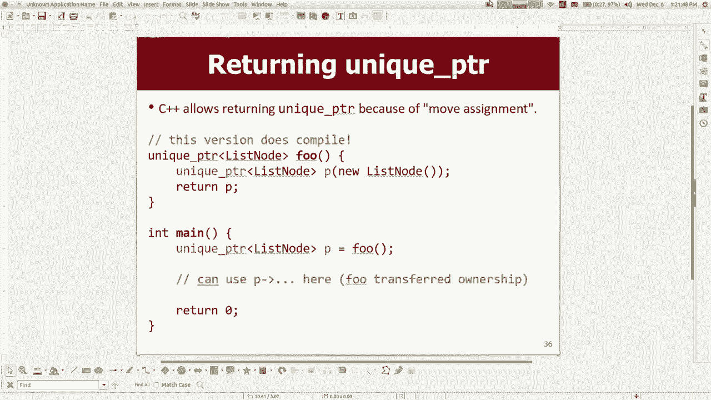

# 课程25：模板、STL与智能指针 🧩


在本节课中，我们将学习C++中三个高级但实用的特性：模板、标准模板库（STL）以及智能指针。这些是编写现代、高效且安全的C++代码的关键工具。

---

## 模板：编写通用代码 🔄

上一节我们介绍了课程的整体目标，本节中我们来看看模板。模板允许我们编写不依赖于特定数据类型的通用函数和类。

### 模板函数

模板函数可以接受任意类型的参数。编译器会根据调用时提供的具体类型，自动生成该类型对应的函数版本。

**公式/代码描述：**
```cpp
template <typename T>
T max(T a, T b) {
    return (a < b) ? b : a;
}
```
此函数可以用于比较`int`、`double`、`string`等任何支持`<`运算符的类型。

### 模板类

模板类允许我们定义可以处理多种数据类型的类。例如，`Vector`、`HashMap`等集合类通常都是模板类。

**公式/代码描述：**
```cpp
template <typename T>
class ArrayList {
private:
    T* elements;
    int size;
    int capacity;
public:
    void add(T value);
    T get(int index);
    // ... 其他方法
};
```
使用时，我们通过尖括号指定具体类型：`ArrayList<int>` 或 `ArrayList<string>`。

**注意事项：**
*   模板中使用的类型`T`必须支持代码中调用的所有操作（例如，如果代码中有`a < b`，则`T`必须支持`<`运算符）。
*   在模板类中，只有与类型`T`相关的成员（如存储的值）才需要替换为`T`，而像`size`、`index`这类与类型无关的成员应保持不变。

---

## 标准模板库（STL）📚

了解了模板的基本概念后，我们来看看C++标准库中基于模板构建的强大工具集——STL。

STL包含容器（如`vector`、`map`、`set`）、算法（如`sort`、`find`）以及其他实用组件。它与我们在课程中使用的斯坦福库功能类似，但接口和设计哲学有所不同。

### STL vs. 斯坦福库

以下是两者的一些主要区别：

*   **命名风格**：STL类名通常为小写（如`vector`、`map`），而斯坦福库使用大写驼峰式（如`Vector`、`Map`）。
*   **方法名称**：部分方法名称不同。例如，在末尾添加元素，STL使用`push_back`，斯坦福库使用`add`。
*   **核心抽象：迭代器**：STL大量使用“迭代器”来遍历和操作容器，而斯坦福库更倾向于直接使用索引（对于支持索引的容器）。

### 迭代器

迭代器是一个对象，它抽象了在容器中移动和访问元素的过程。它为所有STL容器提供了一种统一的遍历方式。

**公式/代码描述：**
```cpp
std::vector<int> vec = {1, 2, 3, 4, 5};
for (std::vector<int>::iterator it = vec.begin(); it != vec.end(); ++it) {
    std::cout << *it << std::endl; // 使用 * 操作符解引用迭代器
}
```
`begin()`返回指向第一个元素的迭代器，`end()`返回指向“末尾后一位”的迭代器。`++it`将迭代器移动到下一个元素，`*it`访问当前元素。

**为什么使用迭代器？**
虽然对于`vector`，使用索引循环可能更直观，但迭代器的优势在于它能以相同的方式遍历所有容器（包括`set`、`map`这类没有索引的容器）。此外，它也是STL算法的基础。

### STL算法

STL提供了一系列强大的通用算法，它们通过迭代器与容器协作。

以下是部分常用算法：

*   `std::sort(first, last)`：对指定范围内的元素排序。
*   `std::find(first, last, value)`：在范围内查找特定值。
*   `std::count(first, last, value)`：计算范围内特定值出现的次数。
*   `std::reverse(first, last)`：反转范围内的元素顺序。
*   `std::copy(source_first, source_last, dest_first)`：复制一个范围内的元素到另一个位置。

**示例：**
```cpp
std::sort(vec.begin(), vec.end()); // 对整个vector排序
std::sort(vec.begin() + vec.size()/2, vec.end()); // 仅对后半部分排序
int numFives = std::count(vec.begin(), vec.end(), 5); // 计算5的个数
```

**为何课程未首选STL？**
尽管STL功能强大，但其错误信息对初学者不友好，且需要较早理解指针和迭代器概念。斯坦福库在设计上更注重教学性和易用性。

---

## 智能指针：自动化内存管理 🤖

最后，我们来探讨如何用智能指针简化C++中最棘手的问题之一——手动内存管理。

手动`new`和`delete`容易导致内存泄漏、重复释放或访问已释放内存等问题。智能指针是包装了原始指针的类，利用对象的析构函数自动管理所指向内存的生命周期。

### `unique_ptr`

`std::unique_ptr`是一种独占所有权的智能指针。同一时间只能有一个`unique_ptr`指向某个对象。当`unique_ptr`被销毁（例如离开作用域）时，它会自动删除其指向的对象。

**公式/代码描述：**
```cpp
#include <memory>

void myFunction() {
    // 创建一个unique_ptr，管理一个新分配的ListNode
    std::unique_ptr<ListNode> p(new ListNode);
    p->data = 42; // 使用 -> 操作符，就像使用普通指针一样
    p->next = nullptr;

    // 重置指针，指向新对象，旧对象被自动释放
    p.reset(new ListNode);

    // 函数结束时，p离开作用域，其管理的最后一个ListNode被自动释放
    // 无需手动调用 delete
}
```

**关键特性：**
*   **独占所有权**：不能直接复制`unique_ptr`（避免多个指针试图释放同一内存）。
*   **移动语义**：可以通过`std::move`转移所有权。
*   **获取原始指针**：在需要时，可以使用`p.get()`获取其管理的原始指针（但不建议轻易这样做）。

**参数传递与返回：**
*   通常以值传递`unique_ptr`参数意味着所有权的转移，需谨慎使用。
*   函数可以返回`unique_ptr`，编译器会优化以避免不必要的拷贝和释放。

---

## 总结 🎯

本节课中我们一起学习了C++的三个核心高级特性：
1.  **模板**：使我们能够编写独立于数据类型的通用函数和类，是构建可复用代码库的基石。
2.  **标准模板库（STL）**：C++内置的、基于模板的强大库，提供了丰富的容器、算法和迭代器，但需要适应其特定的设计模式和语法。
3.  **智能指针（以`unique_ptr`为例）**：通过自动化内存的释放，极大地减少了手动内存管理带来的错误和负担，是现代C++编程中推荐的内存管理方式。




掌握这些概念将帮助你从“课程C++”平滑过渡到“工业级C++”编程。