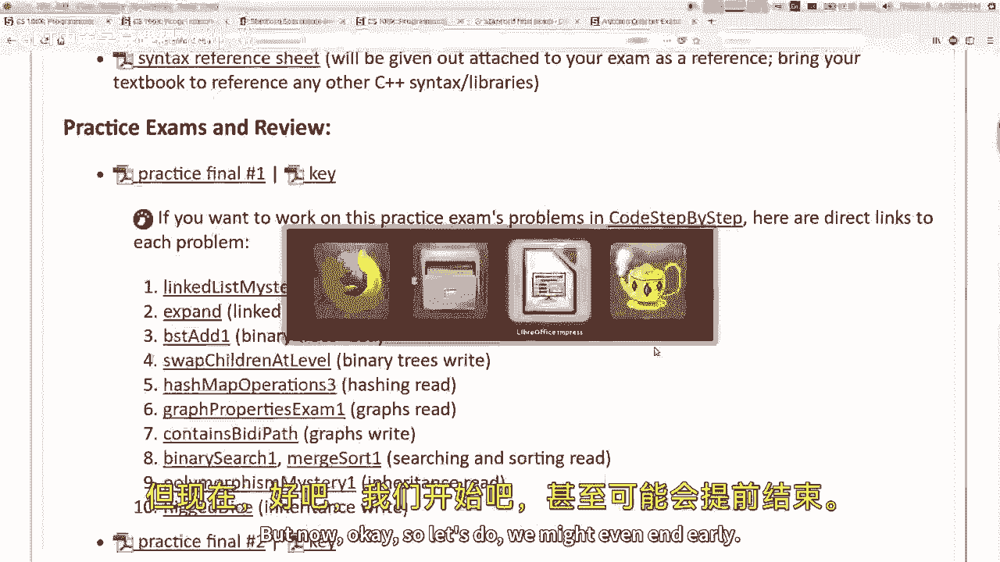
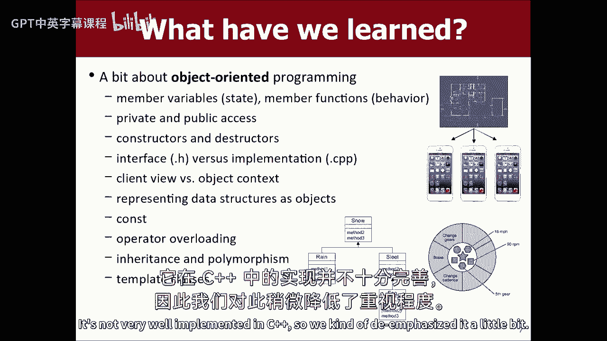
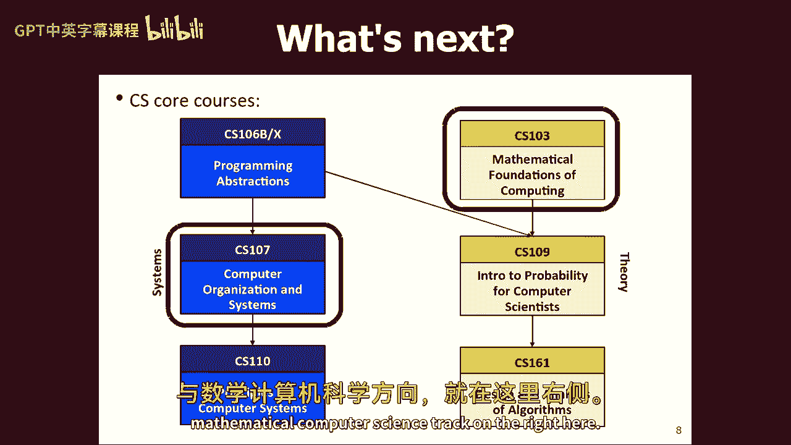
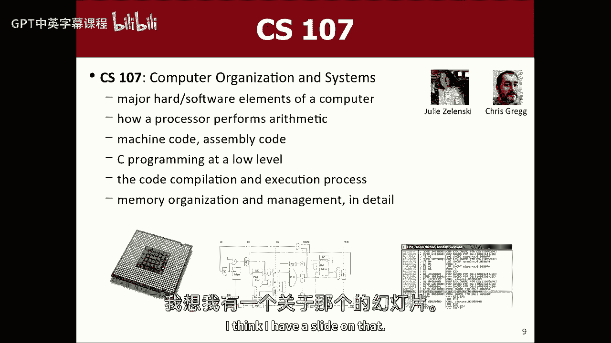
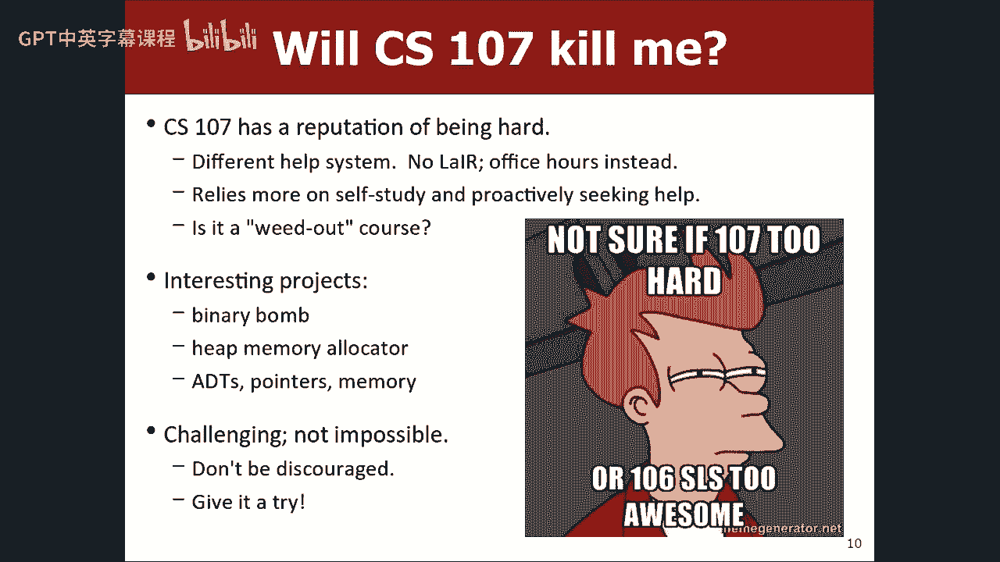
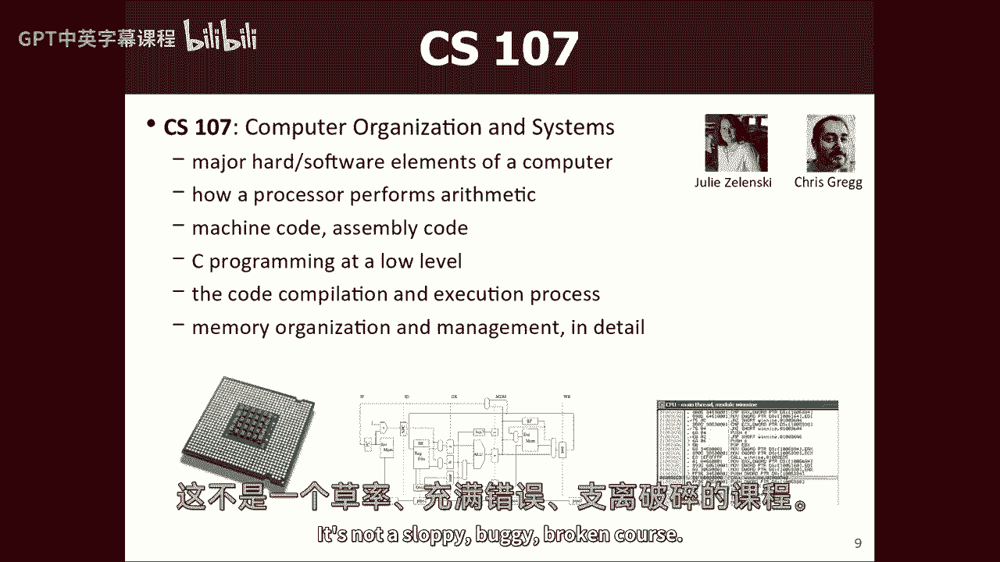
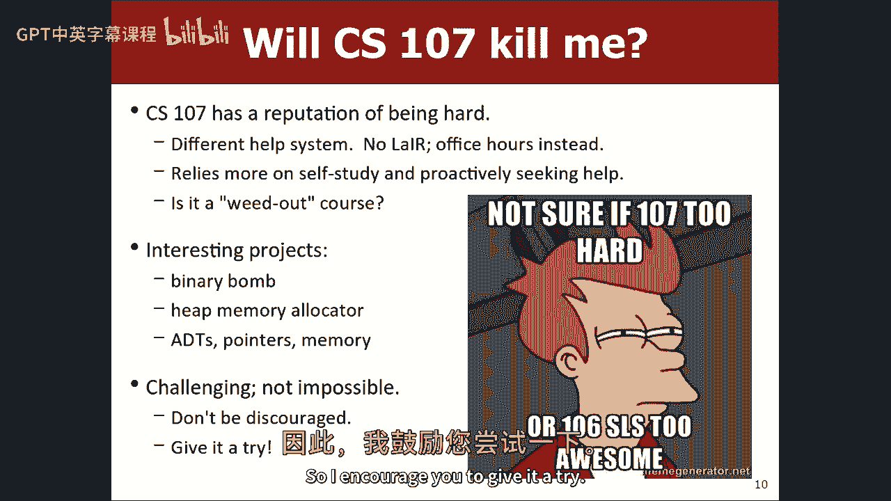
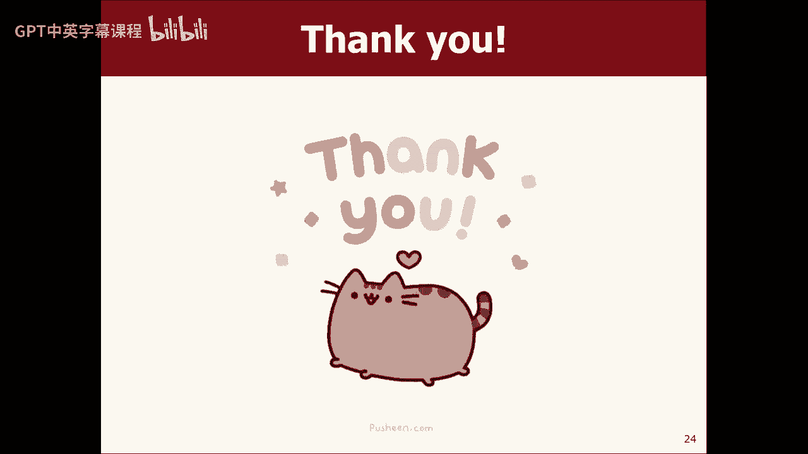
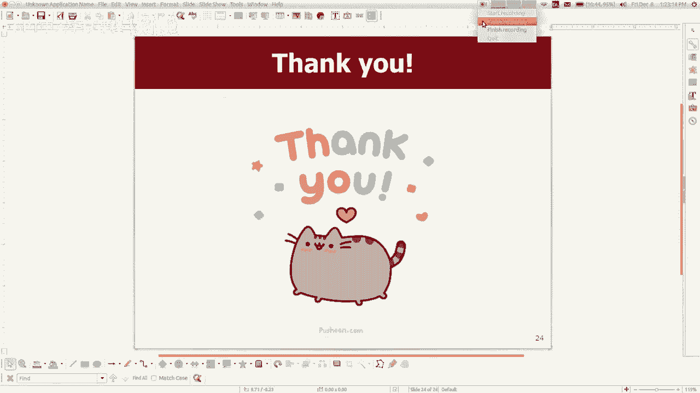

# 课程26：下一步是什么？ 🚀

在本节课中，我们将回顾本季度的学习内容，并探讨完成CS106X课程后可以继续探索的计算机科学领域。我们将讨论期末考试的相关信息，并介绍斯坦福大学后续的计算机科学课程、可能的专业方向以及一些自学和实习资源。

---

## 期末考试安排与准备 📝

上一节我们介绍了本课程的整体回顾，本节中我们来看看期末考试的具体安排和如何有效准备。

期末考试将于周一上午举行。考试资源已发布在课程考试页面上，包括语法参考表和三次模拟考试。模拟考试包含问题、答案和分步代码解析，可用于练习。

以下是期末考试可能涉及的核心主题列表：
*   **链表**：可能需要编写方法，接收头指针并操作一系列节点。
*   **递归与回溯**
*   **二叉树**：操作以根指针表示的树结构。
*   **数据结构实现**：例如实现栈、队列或列表等类。
*   **图论问题**：包括路径搜索算法（如Dijkstra、A*）和最小生成树算法（如Kruskal）。
*   **后期材料**：如搜索排序算法和继承的使用。

以下是一些明确不会考查的主题：
*   绘制分形图。
*   操作符重载。
*   STL（标准模板库）的具体实现。
*   高级二叉树算法（如自平衡、旋转树、红黑树）。

考试时，关于实现数据结构的问题通常会提供头文件（.h），说明公共方法和私有数据成员，以提供足够的上下文。考试主要考察概念理解和算法应用，而非死记硬背语法细节。评分重点在于解决问题的思路，而非代码风格（如变量命名、缩进）。除非特别说明，通常不限制使用辅助数据结构，但若要求“不使用辅助结构”或必须在特定时间复杂度（如O(n²)）内解决，则是为了考察对特定概念（如链表操作）的掌握，并避免低效的暴力解法。

---

## 后续计算机科学课程路径 🗺️

在完成了CS106X这门基础课程后，你可以选择多条路径深入学习计算机科学。本节我们将介绍斯坦福大学提供的核心后续课程。

CS106X教授了编程基础（如循环、变量、数组）以及本课程重点——数据与算法（如如何存储和处理大量数据）。接下来，主要的两条进阶路径是**CS107（计算机系统导论）**和**CS103（计算机科学数学基础）**。

### CS107：计算机组织与系统

这门课程让你更接近硬件，深入理解计算机如何工作。核心学习内容包括：
*   **低级编程**：学习处理器使用的原始机器指令和汇编语言。
*   **C语言**：学习比C++更简洁、更底层的C语言编程，理解在高级语言中看似简单的任务（如字符串数组排序）在C语言中如何实现。
*   **程序执行原理**：了解代码如何被编译、链接成可执行程序，以及程序运行时内存的布局（如堆栈、堆）。

这门课以富有挑战性著称，需要投入大量时间。它的挑战部分源于减少了像CS106X中“The Layer”那样密集的助教支持，更需要学生自主学习、查阅文档和调试。然而，课程材料组织良好，师资优秀（如Julian Shun和Chris Gregg），能帮助学生顺利掌握内容。

### CS107E：嵌入式系统导论

这是CS107的一个变体，专注于在**树莓派**（Raspberry Pi）这样的嵌入式设备上编程。与在普通电脑上编程不同，你的程序将直接运行在硬件上，控制LED、蜂鸣器等。你会遇到更独特的硬件相关调试问题。这门课较新，可能探索性内容更多，由Julian Shun教授，适合对嵌入式系统感兴趣的学生。

### CS103：计算机科学数学基础

这门课属于理论计算机科学轨道，侧重于**数学和证明**，而非编码。课程内容至关重要，探讨计算的根本问题：
*   **计算基础**：学习集合、逻辑、证明技巧。
*   **算法与计算极限**：研究哪些问题可以被计算，以及计算的速度极限。
*   **前沿问题**：例如著名的 **P vs NP问题**，即判定哪些问题可以在合理时间内被解决。

这门课由Keith Schwarz和Cynthia Lee等优秀教师授课，虽然涉及少量代码用于演示概念，但核心是数学推理。

---

## 更广泛的课程与专业选择 🌟

在完成CS107和CS103之后，更多的课程选择将向你开放。本节我们来看看其他一些有趣的课程和专业方向。

以下是一些后续的高阶课程示例：
*   **CS108：面向对象系统设计**：使用Java构建更大型的应用程序，涉及更多文件和类，有时包括安卓开发。
*   **CS109：概率论与计算机科学**：由Chris Piech教授，提供概率统计的直观理解。
*   **CS142：Web应用**：学习Web开发，建议先修CS107。
*   **CS147：人机交互导论**：学习设计并原型化大型应用程序的用户界面，通常以团队项目形式进行。
*   **CS193系列**：专题课程，如**CS193P（iPhone应用开发）**非常受欢迎。
*   **CS9系列**：由学生讲授的课程，涵盖JavaScript、Python、Web编程等实用技能，是学习新工具的好地方。
*   **CS50：计算机科学与公益**：探索如何利用技术帮助社会。

斯坦福大学的计算机科学系不仅研究实力雄厚，教学也备受重视，师资力量强大。除了主修计算机科学，你还可以考虑：
*   **辅修CS**：需完成CS103、CS107及另外两门课程。
*   **联合专业**：如**符号系统**，融合计算机科学、语言学、哲学、心理学，研究语言、智能与交互。
*   **其他跨学科专业**：如数学与计算机科学、管理科学与工程等。

---

## 自学资源与职业机会 💼

学习计算机科学的一大优势是可以通过大量资源进行自学。本节将介绍一些保持技能、探索兴趣和寻找实践机会的途径。

如果你想在课外继续提升：
*   **在线课程**：利用Coursera、edX或YouTube上的讲座。
*   **编程练习平台**：如**HackerRank**，通过解决代码挑战和参与竞赛来保持编程技能。
*   **自学项目**：尝试用HTML创建网页，或用Python重写你的课程作业，这些都是不错的起步项目。

对于实习机会，特别是低年级学生：
*   **Stanford CFC**：访问计算机论坛，注册邮件列表以获取行业招聘信息。
*   **新生实习计划**：许多公司提供针对只修读过少量CS课程学生的实习岗位。可以在线搜索“freshman internship CS”或“sophomore internship CS”寻找机会。

---

## 总结与祝福 ✨

本节课中，我们一起回顾了期末考试的范围与准备策略，了解了CS106X之后的核心课程路径——深入系统的CS107/CS107E和侧重理论的CS103。我们还浏览了更广泛的高阶课程选择、跨学科专业可能性，并介绍了一些自学平台和实习资源。

计算机科学领域广阔且充满活力，现在正是探索的绝佳时机。感谢大家本季度的努力，祝大家在期末考试中取得好成绩，并在未来的计算机科学之旅中继续前行！

**祝你好运，星期一考试见！**