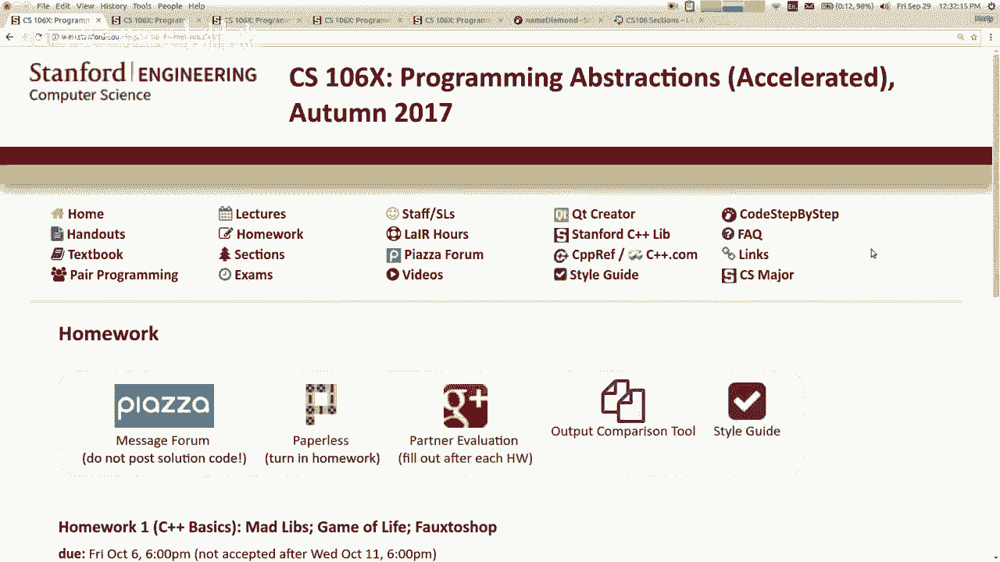
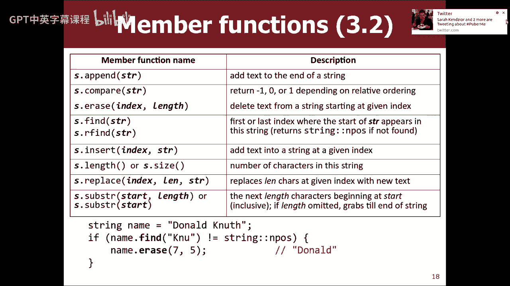
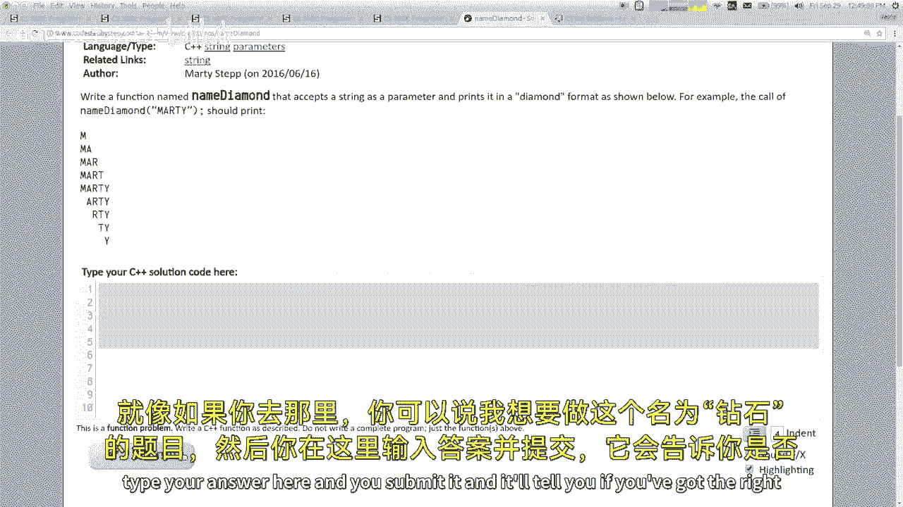
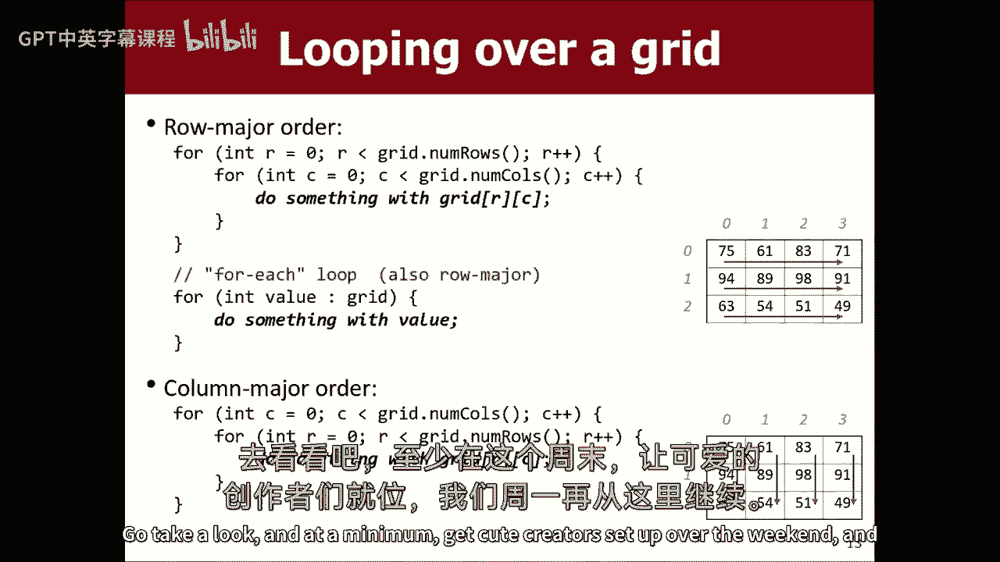

# 【编程抽象方法 cs106x 2017】斯坦福—中英字幕 - P3：Lecture 03 - Strings, Streams, Grids - 加加zero - BV1By411h75g

好啦，所以说，我们何不现在就开始呢？好啦，嘿嘿，欢迎回来，这是我们的第三堂课，今天是星期五，希望你们一切都好，在我开始之前有几个简短的声明，一件事是在这个周末，我希望你们都去我们的网站填写你的偏好。

你什么时候可以去一个部分，下周初我们会把你分配到一个部门，现在呢，通常在我的网站上，在班级网站的首页上已经有一个链接可以做到这一点，但它有一些问题，所以我会在课后发布一个链接，的。

部分注册是通过这个其他网站完成的，叫做CS一九十八斯坦福EDU，他们告诉我链接在那里，但我看不出来，我不知道，也许我没看到，因为我是老师，也许它没有显示链接给我，但他们告诉我。

如果你去CS一九十八斯坦福大学，你会看到一个链接来注册你的部分，但又一次，就像我找不到我版本的链接一样，所以不要看，好啦，上面写着适用于，如果你想当组长的话，所以无论如何，好啦，误导，哎呦，所以在这里。

如果你是个学生，你可以报名，好啦，凉凉的凉凉的，所以我会发布一个直接链接到那个，下课后，你可以一直做到周末，这不是先到先得，所以你不必比赛，也不必做对，这一秒钟他们等到星期一，然后他们抓住所有的名字。

他们运行一个算法，他们指派你，所以你会，你周末再去，我会发邮件提醒你的，我们的第一个家庭作业结束了，我以后再谈，但它使用了今天讲座结束时的材料。

它有三个部分。

你得做一个疯狂的Libs节目，一个生活游戏程序和一个Photoshop程序，你还记得我说过，你呆在这个班就是个白痴对吧，仅供参考，这部分是一零六乙的家庭作业，所以你必须这么做，再加上另外两个节目，嗯。

这又是因为我不是个好人，但是是的，无论如何，第一个作业已经完成了，它将使用第一周的材料，下星期五到期，所以好吧。

说了这么多，我想我现在要开始上课材料了，所以我们一直在讨论如何做弦，或者对不起，如何在C++中做函数，下一个主题是字符串，你们已经知道另一种语言的字符串了。

像Java、Python或JavaScript，所以我不想把所有的时间都花在重新学习上，字符串从一开始就是什么，但是让我们来谈谈字符串的C++问题，对呀，所以如果你想用字符串。

您必须包含一个名为String的库，我在这里用方括号，这是引号，这说明了字符串库的什么，这是一个，是啊，是啊，这是一个，这是一个系统库，那不是斯坦福，本地项目库，它只是C++语言的一部分。

所以如果你想使用字符串，您必须包含这个字符串文件，所以一旦你这么做了，可以创建字符串变量，作为这样的问候，小琐事，我想再次回答关于这些空间的一百个问题，但是类字符串来自std名称空间。

所以如果你不说使用命名空间，STd，你必须写STD冒号冒号字符串，但不管怎样，这就是创建字符串对象的方法，你们知道弦是什么，它们是一系列的人物，让我们来谈谈C加的区别。

就像在Java和大多数其他语言中一样，字符串有索引，其中字符索引为零，一个，二三以此类推，嗯，字符串用引号表示，就像在Java中一样，大多数其他语言都使用前面有反斜杠的序列。

比如用斜杠t表示制表符或斜杠，引号的引号，很多东西都是一样的，但也有一些不同，就像一些方法的名称，对字符串调用的函数，你们的名字不一样，它们的行为略有不同，所以我会给你看那些，还有。

有一些结构上的差异很有趣，最令人惊讶的是，实际上有两种不同类型的字符串，C加加，我一会儿会更多地讨论这个问题，但这就像是学习C++语言的乐趣之一，基本上又是这样，字符串的字符具有从零开始的索引。

每个单独的字符都作为类型care的值存储在其中，您可以使用方括号访问单个字符，这实际上是一些语言做不到的，比如Java做不到，您必须调用一个方法才能在Java中取出字符，你可以用这些括号。

就像你用数组或类似的东西，所以如果我说括号3，这意味着索引3的字符，它是一个大写的T，还有一种方法叫ACT，就像Java Care Act方法，完全一样，你通过一个索引，它会返回存储在那里的字符。

但大多数人只是用方括号，如果你学过整数和字符，大多数语言在两者之间都有某种映射，字符实际上存储在计算机中的地方，带着数字代码，就像ASCII码或Unicode，或者类似的东西，实际上等价于整数，七十二。

你可以在这两个东西之间键入强制转换，在这门课上，我们不会做很多这样的事情，但这个概念是，你知道在很多编程语言中很常见，好的，好的，所以这是一种基本的东西，下面是一些你可以用C++用字符串做的事情。

你可以用加号把它们连接起来，比如m a r加a 2，我觉得马蒂，这在Java中是很正常的，对吧，在C++中可以做的一件事，在很多语言中都做不到，你可以使用大于或小于这样的运算符来比较。

订购是根据ASCII值完成的，基本上意味着区分大小写的字母顺序，与，我觉得大写比小写少是有原因的，但是嗯，也可以使用等于运算符和不等于运算符，问两个字符串是否相同，如果你是一个Java人，你还记得吗。

或者你真的不能在Java中做到这一点，对吧，你如何比较它在Java中是否相同，是啊，是啊，再次感谢，如果你不懂Java，那也没关系，但是你写了一个叫做dot equals的方法，情商，如果你不这么做。

它的行为不太正常，你不需要这么做，C++加上运算符将只是工作侧记，原因是，是因为C++有一个Java没有的特性，这就是运算符重载，我稍后会讲到，这意味着您可以定义操作符来处理其他类型。

他们以前没有合作过，所以它在C++中工作，做你想做的事情，是啊，是啊，那么使用加号运算符和，如果你想去中国的溪流，在打印出来之前，就像你用，当您使用计数时，然后你用其他的运算符，所以他的问题在这里。

我在做加号，蓝色的琴弦在一起，但在以前的讲座中，当我想打印，就像一行文字，然后一个变量什么的，我以前喜欢小于小于，我为什么不直接用加号呢，加号在这里我们有加号，为什么我不直接用加号呢。

原因是因为加号只适用于带有其他字符串的字符串，不是绳子，加上一个int而不是字符串，加上一个双不串，加上任何东西，所以你必须在最后调用一个转换函数，所以决定就是，小于小于是一种更好的风格，所以是的。

这是个好问题，虽然是的，当我试图连接，当连接在一起的时候，两根弦，当我不和水力压裂操作员一起出去的时候，他给了我一个，你在连接字符串时出错了，嗯，给大家看一下，我觉得这可能和。

我会在接下来的几张幻灯片上给你看，它是关于这两种不同类型的字符串，我仔细挑选了这些例子，因为与这些例子有轻微的偏差，突然就不起作用了，所以我对你撒了一会儿谎，然后我要让你看看这一切有多糟糕，但我想现在。

我试图建立，你知道我想，我想要一个情感上的转变，就像讲座中间的结局，你知道查一下，我想让你这样想，你知道吗，我打赌你们中的一些人现在很酷，这看起来很酷，就像它和Java或其他什么差不多一样，哦。

我可以做的更少，更大，等于，哎呦，这样比较好，这太棒了，这太酷了，嗯，我给你看，我给你看，但我马上就到，所以C++中字符串的另一个不同之处，在许多其他语言中，如Java，Python。

JavaScript是在C++中，你可以变异，您可以更改字符串，这里我有一根绳子，是存放马蒂的，如果我叫一支笔，它现在改变了一个来储存马蒂的脚步，你可能会说很好，这不就像加等于吗，我是说。

当然你可以把它从马蒂舞改成马蒂舞，但不同的是，在大多数语言中，更改字符串的操作，实际上返回一个新字符串，如果你想把新的字符串存储在旧的字符串中，你可以，但这不是回报，这就像进入现有的字符串并扰乱它。

所以就像一个，我不知道有一个微妙的概念，但我正在修改一个现有的对象，而不是在旧的基础上创造新的，这两件事之间有一个重要的区别，所以有像擦除这样的方法，您可以从字符串中删除字符，他们现在走了。

所以这很有趣，好啦，下面是一些你可以用字符串做的事情，但让我再给你看一些，所以这张幻灯片只是列出了字符串内部的一堆方法，技术上C加+，我们不用方法这个词，你应该叫它成员函数，它是一个对象内部的函数。

它是一个成员函数，但有时我会说方法，但这些函数中的大多数与某些函数几乎相同，你以前用你的语言看到过，像java之类的，就像有一个比较功能，与Java相比，这有点像，有趣的是，就像Java中的索引。

有和Java相同的长度，有替换相同的，有一些骚动，这与Java中的子字符串相同，所以很多这个，我不打算在这张幻灯片上花很多时间，因为大多数情况下，这只是你听说过的名字的映射，到C++使用的名称。

其中一些函数具有轻微的，哦哇哦，哇塞，巴顿·奥斯瓦尔德在推特上谈论他的青春期，那太好了。

我们能不能静音？那怎么样，好啦。

什么对不起，我已经我已经得到了各种各样的东西，我在一次演讲中得到的最喜欢的弹出窗口，我弹出了一个说，我得到了很多东西，我收到我女朋友的消息，现在的妻子，我可能不想出现在屏幕上，我有各种各样的。

我要说的就这些，问题，是啊，是啊，有屏幕尺寸吗，这个不行，他们是一样的，为什么有两个名字，这是因为它们想与某些其他对象兼容，有大小方法或长度方法的，在某些情况下，他们希望同样的方法可用。

在很多不同的班级，是啊，是啊，当你谈论追加和喜欢加等于的区别时，那是不是意味着追加更有效率，或者不知何故，我不太担心这些方法的效率，我是说其中一些有效率方面，就像如果你做了一根全新的弦。

它可能得把它复制到内存中，我想说这些事情更重要，当你在处理一根很长的绳子时，如果字符串短，这真的没什么大不了的，或者如果你在一个循环中做了一百万次这个操作，开始重要了。

我们稍后会讲一大堆关于算法效率的问题，所以有些情况下我们会关心这一点，就像，一个例子是，如果我要在一个字符串中建立一大堆数据，然后把所有这些都转储到一个文件中，数据可能很长。

然后我调用什么方法可能很重要，但实际上我要教你一些技巧，即使在今天的讲座中，有一些方法可以逐渐建立一个结果，作为一个不涉及昂贵计算的字符串，所以我的意思是我不会太关注性能的影响，但我想我要说的是，那个。

这些函数的许多实现是，你可能会猜到，如果你说嘿，我想找到这根绳子，它必须喜欢，在字母中循环找到它，所以如果有更多的信，需要更长的时间，所以很多时候，你对什么需要更多时间或更少时间的直觉。

就像问绳子的长度，它只是把它作为一个int存储在里面，所以这是非常快的，即使你叫了很多次，但我们会更多地讨论性能，当我们走得更远，是啊，是啊，应用程序中没有真实，嗯，有，但是他们有偏好吗，A加等于针脚。

嗯，我在可能的时候使用操作员，一支笔就像，你知道的，修改到位，所以你可以用加号而不用加号，如果你明白我的意思，所以我喜欢加和加等于，因为我在学C++之前学过Java，但我不认为他们中有一个是对的。

另一个是错的，你可以用任何你想要的东西在你的家庭作业和塞在后面，这样的处理怎么样，哦哦耶，我对记忆还没怎么做，我不打算多谈，基本上，所有这些方法都做了合理的事情，就像你在想的那样。

它有足够的内存来存储字符串中的这些字符吗，一切都会水落石出的，它会，会处理好的，你现在还不用担心记忆之类的问题，是的，是的，所以我们你用，Plus等于上一张幻灯片中的字符串，但是加等于。

在角色上不起作用，加上这里的流示例的相等工作，但还有其他类型的它不起作用，就像你说的，是啊，是啊，我一会儿再谈这个，但这适用于连接其他字符串的字符串，还有很多其他的事情是行不通的，所以它在这方面不像。

Java、Python或JavaScript将是，这些方法中我想强调的唯一一个，这些方法中的大多数都是明智的，简单的事情，我要提到的一件事是发现和我们的发现，就像，从后面开始，找到大多数搜索东西的方法。

你知道他们就像索引的结尾一样回报你，它在哪里找到了那东西，所以你可以想象，如果它找不到那根弦，也许它会像负数一样返回，无效索引，它实际上不会返回负1，它返回一个常量，称为流，冒号，停顿中的冒号。

这意味着它不是位置，我不知道所以喜欢，这是当我回到C++时的一件事，我开始用字符串编码，那是我经常忘记的一个功能，哦耶，如果你检查它是否等于负1，它实际上从来不等于负1，所以这是错误的测试。

所以我确实写了一些东西，比如用这三个字符串，那么我们应该写字符串冒号冒号和，哦，这个极端，嗯是的，看起来需要空间语法，但我想你导入了性病的命名空间，但这类似于访问类的静态成员的语法，在Java中。

你用C++说类名点成员，你说类名冒号冒号，记住，所以我认为即使使用和进口之类的东西，你还是要说，你不能只是写和停顿，我想你得写字符串和输入，好啦，还有一些其他的方法可以处理字符串。

我们斯坦福项目的本地产品，我们给你的，如果包含我们称为字符串库的本地库，或者你现在得到一些这些，它们的语法有一点是它们不是，流内部的方法，像s点法，取而代之的是，它是一个全局函数。

我们将字符串作为参数传递，这些不同的原因，因为我们在斯坦福，没有能力修改流和类的内容，你知道我的意思，我们不能向现有类添加方法，我们有一些方法将字符串作为参数。

这些方法大多是为了复制java特性而设计的，就像没有结束和开始，你可以打电话，找到并检查它是不是零，看看它是不是以什么开始的，但这更容易，我们还有转换功能，这些都很有帮助，你问的是。

有人问普林在离职声明上的事，如果你说整数加字符串，您可以用这种方式将字符串与提示连接起来，但当然瓦卡瓦卡可能比那干净一点，但这些是在类型之间转换的有用工具，你不会相信在C++中很难做到。

所以只有很少的功能来做到这一点，很不错，以及其他一些，一些其他的东西，是啊，是啊，所以序列没有像，类似于默认强制转换函数，哦好吧，铅字铸造有几种方法，但你不能在你的绳子上投下一个末端。

字体铸造在那种情况下不能正常工作，如果你想让它成为一条小溪，你真的想写出这些看起来像结尾数字的字符，这就有点复杂了，所以基本上这样做有点烦人，没有帮手，所以我们提供这些，所以当你用字符串来整型时。

你有一个由字母表组成的字符串，那是什么，哦如果你，如果你试图把这些和非法移民联系起来，像你一样，你说直线整数，如果你通过一二三四，然后回到最后，一二三四，但如果你像马蒂·斯德普一样，它不是。

我想他们抛出了一个错误异常，类似的事情，崩溃被动非法数据，还有其他方法我没有在这里列出，就像有一个叫字符串是整数，它是一个布尔值，所以你可以说，如果字符串是整数，然后将字符串转换为整数。

图书馆里还有其他东西，我鼓励你看看文件，所以让我提一下我们已经讨论过的几件事，在阅读中看到和看到，你知道用户的输入和输出，我以前教过你，你可能不想直接使用cn，相反，您希望调用这些帮助器函数。

比如得到整数，获取线路，这种东西，所以如果你试着阅读流，用z可以做到这一点，但它读一个字，然后你剩下的输入，它会读其余的，如果你再叫一次，如果你再读一次c in，有时你不想要一个字，你想要一整条线。

我们斯坦福图书馆要做到这一点的方法是调用get line，不管他们打什么，整条输出线将是，输入将被读取，有一个标准的功能，那不是斯坦福，那叫得到线，但这需要两个参数，它带你去你想读的地方。

您想将其存储在哪个字符串中，嗯，这个get行命令，我没有使用任何返回值，那么你认为我是如何从get line函数中得到答案的呢，输出橙色，你在后面看到了什么，是啊，是啊，你到这里来，你要说什么，是啊。

是啊，是啊，是啊，它是一个参考参数，它作为输出参数存储在其中，如果我是说你在幻灯片上看不到，很抱歉，但不管怎样，主要是如果我想从用户那里读取行，我把这个叫做，用大写获取线函数，我呃，这里有个练习。

但我落后了，所以说，我不会做的，不过，我告诉你，如果你想用溪流练习，这只是一个循环的东西，打印单词的子字符串，将其作为参数发送，我还没说呢，我有一个工具，我想你可能想试试，它是一个练习工具。

这叫做一步一步的代码，我把我的名字放进它的名字里，无耻阴谋，但不管怎样，这是一个只有一个小文本框的网站。

您可以键入代码并运行它，它会帮你测试的，所以如果你去那里。

你可以说我想做这个名字，钻石的事，你在这里打你的答案，你提交它，它会告诉你。

如果你答对了什么的，所以你知道有些幻灯片有一个小标志。

这意味着该练习可以在该网站上获得，然后如果你去班级网页，它与其中一些问题有直接联系，您可以尝试。

所以我相信实践，不管你用不喜欢我的哑巴网站，我觉得练习很好，我认为这就是学生学习的方式，只是通过去尝试一些东西，听我说话，你可能不会学到很多，但去试试吧，你会做得更好的，不管怎样，这是一个练习。

你可以看看，这里有一些代码，如果你，如果你想偷看它的解决方案，在这里的幻灯片里，但是嗯，我提到过C++中有两种类型的流，所以现在一切都分崩离析了，到目前为止还好，但现在情况变糟了。

C++是建立在另一种叫做C的语言上的，他们试图让它不相容，使用C语言，C有自己类型的字符串，C++加上了我刚才给你们看的所有幻灯片，我之前给你看过，这些是c加上字符串，那些是那些是好的溪流。

我们喜欢那些，他们大多以明智的方式行事，古老的语言有它自己的弦，那些也还在那里，它们都存在于语言中，你必须主要，你不必处理C类型的字符串，但有时你会，因此，我必须稍微谈谈他们，所以如果你写字符串引号。

从技术上讲，这是一个C字符串到旧的类型，但是，如果你说字符串s等于引号中的东西，它会把它转换成一个很好的c+，所以我的大部分代码，这就是我要做的，但是，我以前给你看的东西都没用，你不能对它们调用方法。

比如长度、查找或子字符串，这些方法都不存在，C字符串根本没有任何方法，你不能把它们和，加等于，可能是你的窃听器，你有我给你看的所有东西，对C弦不起作用，他们基本上什么都不做，我想获得有效字符的括号。

但几乎没有别的，为什么它不支持任何东西，因为C语言是一种非常小的语言，它只是没有提供很多东西，C++流提供了更多的东西，所以好吧，如果不想使用这些C字符串，一般来说我想说的是，让我们尽可能地避免这些。

如果你不想用它们，确保将字符串存储在C++字符串变量中，如果您确实需要将C加号字符串转换回C字符串，有一个函数叫C，但我们不会经常用那个，所以好吧听着，让我试着告诉你在哪里你可能会遇到C字符串。

以及它会如何扰乱您的代码，所以如果你打个招呼，加上那里看起来很无辜，这在Java中很好用，但技术上是行不通的，因为那是个c弦那是个c弦，我试着把它们加在一起，也许你会说等等，我早就想好了。

我以为你告诉过我，如果我把它储存成那样的溪流，它会很好地转化它，但是请记住代码是如何运行的，它先从右边跑，然后它储存它在左边出售，所以它不做转换，直到它完成大惊小怪和东西，所以这实际上是糟糕的，事实上。

这不仅不好，但它甚至不会导致编译器错误，它让你写，然后当它运行的时候，它只是做疯狂的事情，程序中断和崩溃，现在呢，它实际上做得好的是什么，从技术上讲，它所做的与一个叫做指针的特性有关，我今天真的不想谈。

它正在获取这个脚本的内存地址，并将其添加到屏幕的内存地址中，不管那个内存地址，它把它变成了那个，这可能是一些垃圾或出界什么的，程序要么崩溃要么崩溃，只是这样很傻，但这是语言的一部分。

这是一件非常常见的事情，学生们这样做在C++中是行不通的，是啊，是啊，你说过我们有很多强项，除非我的草原从种子，但对类似的人来说，我不能涂得像条带子，嗯，您可以写出这样的东西，而不包括流库。

因为这些是c弦，但是如果要声明这样的变量，你现在需要包括那个屏幕，如果您有一个不包含字符串头的文件，你可以宣布这些，这可能是因为项目中的其他文件确实包含了流，他们也在每一个。

所以如果项目中的其他文件包括，然后通常它也会传播到您的文件中，但总得有人把它包括在内，否则就没用了，是啊，是啊，所以那不起作用，断了，嗯，那不管用，那是那是相似的，是一根弦加上一份牵挂。

像猴子一样用内存地址，所以那也不好，一个字符串加上一个整型数对于内存地址也有同样的作用，它转到字符串high的内存地址，并向前移动4-1字节，哦天啊，所以实际上真正有趣的是，如果你有一根很长的绳子。

然后你说那根很长的绳子，加十，它会给你第10个字母的直，因为那是10字节前的东西，反正，什么都不能用，Plus不适用于C字符串，它产生垃圾，所以这里有另一个案例，这个看起来可能更好。

所以我实际上把它存储为一个C++字符串，然后我加了四个一个赞，我想说五个换一个，但它却飞得很高，括号，4-1碰巧是括号字符的讨厌数值，所以它认为我在添加一个字符，不是整数，所以它没有做正确的事情，是啊。

是啊，有人问我，你能把字符串传递给int吗，这就是我在这里做的，我有一个三，四，二，我把它转换成一个int，一分钟前我说不，你不可能做得那么好，比那更糟，你能做到的，当你试图这么做的时候。

它会做一堆废话，所以它把这根弦，不管内存地址是什么，流恰好存储在那里，将内存地址转换为int并将其存储为inde，所以就像你认为你在储存四，二，四，二，但实际上是八百万，二十七万六千，随便啦。

只是一些恰好存储在里面的内存地址，就像这个十六进制的位置，哦，天哪，所以这些最糟糕的不是，它们是错误的，编译器不会告诉你任何事情，它很乐意编译，这些示例中的大多数取决于您拥有的编译器的哪个版本。

但大多数都编译得很好，当你运行它的时候，你的程序会做疯狂的事情，很容易意外地做这些事情，是啊，是啊，在前面的幻灯片中，代码是1加上引号，差不多吧，是啊，是啊，是啊，是啊，这是可行的，因为我把它转换为。

一个c+的字符串，但是t y是c没错，所以这仍然是一个c字符串，但是c加上字符串加上c字符串，它做了正确的事情，所以只要他们中的一个或另一个是，你知道增强的，一切都会好起来的，所以是的，很微妙。

但是如果你把这个加T移到这里，它在转换前做加法，但这强制转换为这里的好字符串，然后这个就会被那个拯救，但是是的，你要担心这些事情是不是很疯狂，所以嗯，这只是不幸，只是我们在这里必须忍受的事情。

所以这些是你可能会遇到的bug，哦耶，问题是的，所以在你说控制h之前已经包括了引流库，所以如果你放两次，不错嘛，如果两次包含同一个库，还不错，不会弄坏任何东西的，他们有警卫检查那些东西，一切都会好的。

所以这里有一些方法可以修复上一张幻灯片上的这些bug，所以哎呀，对不起，嗯，如果显式地将字符串括号写高，它基本上调用屏幕C加加字符串构造函数，并传递一个现在已经转换的C字符串参数，再加上那个管用。

或者我们回去的那个很高，加上一个工作良好的C流，那些很酷，这个实际上工作于一个被转换的字符串，再加上有效的护理，因为当你添加一些东西，它假设它是一个角色，所以没关系，嗯，如果你真的想转换字符串四。

两个什么的，您可以使用这些转换函数，如字符串到整数整数区，所以所有这些事情都有解决办法，但你必须意识到他们，对射线进行操作的函数，也在相同的，问题是字符数组和c字符串，是啊，是啊，我的意思是。

我想主要是在这个问题上下注，我是说在C弦的老风格中，它们实际上是一个存储护理值的数组，那都是c弦，真的是，它是一个字符数组的内存地址，所以C++函数，要求字符串参数，有可能给他们传递C字符串。

或者C加上字符串，甚至是字符数组，它会以某种方式处理所有这些，但总的来说，我会尽量避免显式地使用c字符串，所以我不会在课堂上遇到这种情况，但是有一些微妙的语法问题。

当您尝试将两种类型的字符串混合在一起时，只是一个例子，这样可以让你有你的，是啊，是啊，如果它是高的加上那里加上马蒂加步骤，那就没问题了，如果只有第一个被转换，因为每一个加法都是按顺序进行的。

这个加号表示c加号是直的，嗨，在那里，加上马蒂做了一个C加上它就像消耗了整个，是啊，是啊，其中一个第一个是，是啊，是啊，但如果你有高加那里加字符串边距，那么第一个广告就是非，是啊，是啊，所以你可以。

有这么多不同的方法，你可以打破这东西，你所做的工作，在本例中，圆周率加上弦，高加弦也行，只要你在做二进制加法，其中一个很好，那么整体效果会很好，他们喜欢四个我们被塞进其中一个弦里，但不是第一个。

我应该用绳子，它是什么，我是说，我想有些东西你可以自己去试试，但基本上如果你，如果你前两个不是，他们中的任何一个，C加加字符串，你会有麻烦的，但只要你在做加加加，只要前两个中的一个是C。

加号加号应该没问题，我说看，我很难记住一些微妙的地方，我尽量避免代码，我想可能会和这些东西发生冲突，所以最重要的是要小心，你要知道，如果你看到一些奇怪的东西，你可能会遇到这种事情。

我只是想让你意识到这一点，所以没关系，都说了，我想跳到另一个滑梯上，我想谈谈流和网格，我可能得加速一点以确保，我今天做的够多了，所以溪流是用来阅读和写作的，文件和网格是一个二维数组，像数据结构。

我们两个都要用，和所有其他的东西，我们一直在谈论我们的第一次家庭作业，所以让我试着在这里开始，如果要读取文件，有一个图书馆，您可以包括它称为F流文件流，那是一个系统库，从括号里可以看出，F流是一个库。

其中包括名为if流输入文件流的类，和两个F流输出文件流，这些是您可以用来读取输入或将输出正确地输出到文件的东西，好消息是它们的行为几乎完全相同，c out和c n see out是一个对象的例子。

这很像它去，f流和cn是一个很像i f流的对象，它们如此相似的原因是因为它们使用了一种叫做继承的东西，它们彼此共享代码和特性，所以这很酷，因为一旦我们学会了怎么做。

您实际上可以用非常相似的语法写入文件和从文件中读取，那太好了，今天我不打算教你们太多关于物品和继承的知识，但这是在这一切的背景下发生的，如果创建一个文件对象和一个输入文件对象，如果街道。

以下是它的不同成员，你可以打开一个文件，把某个文件传给它，现在你正在从地图文件中读取数据，您可以使用，获取行或此箭头运算符，然后当你做完，你可以把文件附上，那是我变成蓝色的时候。

我认为你在这里真正需要的，还有很多其他的方法，但主要是这样，我是说，如果您必须在以前的课程中读取文件或数据，使用缓冲阅读器或扫描仪，或者某种文件对象，这和那没什么不同，是啊，是啊，如果文件不存在。

那么打开是否返回负值，或者是的，如果你试图打开一个文件，我很确定，这样做的结果是，它将文件置于所谓的失败状态，所以你可以说打开，然后检查，如果文件失败，基本上，好啦，这里有一个简短的例子。

如果要打开文件，循环读取每一行，对线条做点什么，然后关闭文件，你是这样做的，声明文件流，您打开文件并编写一个循环，如下所示，你做一个弹簧叫做线，虽然有一个混合线，我可以得到，我把这条线打印出来。

然后我会关闭文件，我想大部分都没问题，但是这中间有点奇怪，向右看，就像我说的，直线，野生盖特林，那么像这样的事情是什么呢，当循环，我想把注意力集中在那句狂野的台词上，输入逗号行。

那么我对这个参数了解多少，这是一条参考得到线，看这里，从这里阅读，将结果存储在这里，它是通过引用出来的，这是一个参考参数，我们上次就知道了，然后我说，而这，那么我怎么能在一段时间内调用函数呢，像这样。

这个函数是什么意思，它返回一个布尔值，是呀，它返回true，如果它能读懂一行，如果它不是这样，它是假的，这看起来很奇怪，但是一旦你习惯了，你就是这么做的，还有一行要读，用线条做点什么。

有几个东西看起来与Java之类的东西不同，就像在Java中一样，你会说喜欢，如果输入等于新，如果流，或者类似的东西，那是Java语法，那不是c加+的方法，是吗？C加加使一个对象，你只要写它的类型和名字。

这相当于说新的，无论您创建了什么，现在都打开一个新对象，现在初始化它以从后面的某个地方读取数据，如果你把一个表情放在一段时间内，条件或，又不是说，会尝试，C++在其他布尔类型之间确实有一些转换。

所以如果你有一个整数，您可以在if语句中使用它，如果整数值为零，这被认为是假的，任何其他值都被认为是真的，所以有一些c加2布尔值的转换，不是每个类型都这么做的，规则可能有点棘手。

你可以从那里得到一些虫子，比如，例如，有些语言有字符串，如果字符串为空，那是假的，如果它不是空的，那就是真的，在C++中不完全是这样工作的，所以我以后会教你一些规则，但是是的，有专门针对数字整数类型的。

您可以使用布尔转换，是啊，是啊，你说过，如果你输入了，或者如果您确实喜欢打开一个名称不存在的文件，它失败了，有没有一个函数可以让你创建，是的，是的，制作新文件。

我们将使用一种叫做O F流输出文件流的东西，我马上就给你看，但是这张幻灯片还没有涵盖这一点，是啊，是啊，所以你宣布，I，什么事？我会记住的，是啊，是啊，我是说，你可以想到这个，如果你是一个Java人。

以为我写的等于新流，我去创建了新的对象，已经初始化了，它不是空的，如果你知道，空是，这东西不是空的，这是一个真实存在的物体，它已经被分配到内存中，我可以调用它的方法，这只是C++和Java的区别。

如果创建对象，它在那里，是呀，为什么输入，啊，那倒是真的，所以实际上这条线，这两个参数都是通过引用传递的，我把注意力集中在引用中的字符串上，但是输入文件流是一个引用也是正确的，这是真的。

因为我不想复制文件，或复制文件的读取器，我想从您正在使用的对象中读取，以便读者随后进入下一行，所以我想把那个对象共享到那个函数中，所以实际上在这张幻灯片中，很难写一点关于它的东西，我写了f和s。

并引用了一个文件，引用了一个字符串，我就是这个意思，是啊，是啊，所以在这张桌子上，上面说就像，我认为只有开放的方法，c c样式字符串除外，却看不到我们这些人，所以这个开放，你应该能在这里传递一根绳子。

这恰好是一个C字符串，但通常你也可以有一个c++字符串，我们以前在老麦克斯身上发现，有一个奇怪的旧编译器，你不能通过一个C+加字符串，您传递了一个C字符串，所以如果你有一个c+的字符串。

你得在上面写点c r，但我很确定苹果已经更新了他们的编译器，这样就不需要再打字了，但我不知道你们中的一些人还在像雪一样奔跑，豹和OS什么的，得到一个新的，OS将是，所以如果输入不是作为引用给出的。

但如果不是，它会创造出一个完整的副本吗，如果它是按值而不是按引用传递的，它会试图复制，实际上它会导致编译器错误，因为文件流对象没有提供复制功能，所以它不知道如何复制它，所以它会出错，所以是的。

我们会教更多关于这一点的，当我们上课的时候，但是，嗯，是啊，是啊，还有一件事我想继续前进，是啊，是啊，这是可能的，就像直接流一样，哎呦，你喜欢从输入文件到输出文件的管道吗，不是一行。

但是做一个O流很容易，然后从if流中读取并写入off流，而且是的，我们能做到的，我们一定会做那样的事，常见的错误方式，人们又这样做了，对不起，滑梯上很低，是人们说好，当输入文件没有失败时，我会读一行。

然后我将打印出与幻灯片上的代码非常相似的一行，你看到了吗，你知不知道，也许为什么红色的不那么正确，是啊，是啊，因为第一次它会失败，你得打个电话，要失败了，但你还是要处理这条线，即使这是不对的。

所以如果你打电话，也没有更多的线了，它将把文件设置为故障模式，但我还是要把它打印出来，然后我绕过去，看到它处于故障模式，所以我实际上要打印一行太多了，实际上它会把最后一行打印两次，基本上是这样。

我经常看到，很多学生都这么写，然后他们在广场网站上发布的bug说，为什么最后一行要打印两次，你知道我应该告诉他们，是啊，是啊，是啊，是啊，也许像循环一样使用，它在事后检查，您可以使用不同的循环。

你可以做一会儿或者休息一会儿什么的，但我只是觉得这太简洁了，我想这就是我会做的，好啦，还有一个大于它的箭头运算符，从流中读取某种输入标记，就像一个词或一个数字，被空格隔开的东西，所以如果我有这个文件。

马蒂十二岁了，如果你把这个字符串单词，然后你就这样读，你要读，马蒂，所以说，它只是寻找空格或换行符，现在只需要空格字符来划分，它把它读成字符串，但是你可以把它读成一个int，就像年龄一样。

然后输入有效的箭头年龄，因为零运算符理解如何转换类型，那样挺酷的，或者你可以把它读成一串，然后将字符串调用为整数，那也行，所以这很可爱嗯，很多时候你想做一些混合的事情，比如，读几行。

然后看看每行上的单词，我将向你展示如何在一个，但这是一种，啊，另一件事是，如果尝试执行此运算符，没有更多的数据，然后运算符的总体结果将变成一种假值，你可以，如果否则打开或同时循环打开，所以你可以说。

当输入时，箭头词，打印字，把文件里的每个字都打印出来，这就是台词，那是读字，代币，随便啦，如果你想混在你读一行的地方，然后你想把它切开，只是那一行的字母或单词，你能做的就是。

您可以创建一个名为i流流的对象，这就像另一个流阅读器用同样的方法，像开合箭，所有这些东西，但它从一串数据中读取，不是从文件中，就像，如果这是我的溪流，C加加或C字符串，然后我可以从中读出令牌。

把名字念给我听，然后姓，你的电话号码，它会读出这三件事，所以这有点酷，有时将if字符串与i字符串流混合，从if流中读取一行，然后用字符串流把单词分开，下面是另一个例子，我说生存还是毁灭。

然后我做了一个一会儿循环，当我能读单词的时候，接受这些话，所以它打印出生存还是毁灭，所以在这些例子中，在最后几张幻灯片上，你应该可以切片和切丁，你将要看到的大多数类型的输入，是的，是的。

您能使用流流从文件中获取输入吗，好吧，好吧，你能把这些混合起来吗，你能从文件里读出来吗，使用i流流，嗯，不直接，但你要做的是让如果流，你读了台词，那你就做吧，我溪流溪流，你过了线，现在你读了那行的令牌。

所以你把两者混合在一起，不能用这个替换if字符串，但你可以把它们当作音乐会，还有一个o字符串流，它将输出写入字符串，我要告诉你的是，它基本上是这样工作的，那很管用，如果你做一个O屏屏幕。

你可以少于少于向它发送信息，你基本上是在建立一根弦，我们谈过，嗯，很慢的方法，这将是一种积累的方式，构建一个高效的字符串，然后当你做完，你说，好啦，把屏风拿出来，所以佐伊伯格的年龄是4岁2岁。

他的智商是95左右，你为什么要这么做，我是说为什么不把这个打印出来，也许我想把这根绳子，然后把它展示在一个粘稠的东西上，在按钮上，或者我想把这个弦，然后我想把它打印出来。

你知道可能有一些原因你想建立一个字符串，但你不想直接把它送出去，就像你在建造一样，所以哦，字符串屏幕更快，什么是耶，如果创建字符串对象，然后你移动，你做加号，加号，加号，它所要做的有点像。

调整缓冲区大小，复制类似的东西，所以这是一种更直接的，我想很多语言都有这样的东西，就像Java有一个叫做字符串构建器的东西，它允许您随着时间的推移高效地增量构建字符串，所以实际上在你的家庭作业上。

我想让你做的一个问题叫做疯狂的libs，所以你读了一个文件，里面有一些空白，像名词和形容词之类的，然后你翻看文件，找到所有的空白，然后你让用户告诉我一个名词，告诉我一个形容词，告诉我一个人的名字。

在你读了所有这些话之后，你填好空白处就把故事倒出来，所以为了做到这一点，你要做的就是读取，如果流，然后在你前进的过程中建立你的填充故事，使用o字符串流，最后，一旦你完全做完了，全部打印出来看看。

但你不想边走边打印，因为有了疯狂的libs，如果你以前做过你别说，给我一个名字，他们告诉你一个名字，然后你告诉他们故事的台词，否，你等着他们把一切都告诉你，因为那很有趣。

因为所有的词放在一起没有任何意义，所以你会在你的家庭作业上做这种事情，一个，到上一张幻灯片，上一张幻灯片，这就对了，这是标准，有时对于初始，是啊，是啊，所以构造对象的语法是写类型，然后写名称。

然后一个分号，有些对象基本上将参数带到它们的构造函数中，这就是传递参数传递给对象构造的语法，在变量的名称和分号之间，我是说，基本上这就像工作一样，除了这里，你会说等于新的冰淇淋流，就像那部分是不存在的。

只是为了说明双箭头和截止日期的作用，当有，他们读，你知道当你不能做某事，那就会返回一个假的返回，是啊，是啊，当这些箭头或得到线失败时，当没有什么可读的，表达式的结果将是一个假布尔值。

或者一些c加+会理解为等价于false的布尔值的东西，因此，您的代码将知道停止while循环，否则if语句将不会输入，或者别的什么，好的，好的，所以溪流，有一些用于流的斯坦福方法。

如果您包括我们的文件库，我们只是有些东西你可以查一下，如果存在文件，你可以，呃，你知道的，删除文件，这些都是你在常规C+中可以做的事情，但它有点不同，无论你是在Mac、UNIX还是Windows上。

或者一些废话，它是如此，我们试着为你从等式中剔除一些，我们还有这个方法可以读取整个文件，那有点酷，所以你甚至不用做循环，您可以将整个文件读取为一个大字符串，有时这很有帮助，你做作业不需要那个。

但有时这是一件有用的事情，重命名文件，我不打算在这张幻灯片上花很多时间，但这些都是使用函数的有用方法，好啦，所以我想在这里继续前进，因为我没多少时间了，我要和你谈谈一个叫网格的集合。

我不需要太多时间来谈论这件事，因为它不是太复杂，不过，你要用它做作业，所以当然你总是在最后五分钟做最重要的事情，对呀，这来自下周书的第五章，我将谈论一大堆关于数据收集的问题，那是下一个大单位。

让我们看看我们要涵盖的下一个材料单位，但这只是让我们开始，所以我想你可能知道什么是收藏，它只是把数据存储在里面，有时称为数据结构，你放入集合中的数据片段，我们称它们为元素c+，附带一套可爱的标准系列。

它被称为STL，标准模板库，大多数cplus程序员都会学习如何使用stl，你就是这么做的，在斯坦福大学创建课程的人，觉得这些集合和stl对学生来说很难使用和学习，例如，如果你的索引出界了，它不会崩溃。

它只是进入垃圾内存，给你垃圾数据，这对那些试图找到错误的学生来说是令人沮丧的，在许多类似的奇怪故障中，这些收藏真的很好用，如果你知道如何使用它们，但它们很难学，所以我们为斯坦福大学写了一套自己的收藏。

所以我们打电话给我们的，斯坦福收藏图书馆让名字真的很相似，天啊，嗯，所以我们有自己的收藏，我要教你如何使用我们这里的藏品，在本季度的课程中，它们更容易学，当我刚到这里开始教书的时候，我就像，哎呦。

那是个瘸子，我们应该做真正的收藏来吧，尤其是一零六x，我们都是硬汉，对嗯，但别担心，因为我们的实际上真的真的很相似，只是我们的检查出界了，检查记忆错误之类的，所以一旦你学会了我们的，切换到这些超级容易。

你很好，在十二月下课之前，我告诉你够多了，你可以用这些，如果你想的话，别担心，你得到了像一堆假收藏品在这里，就像没事一样，就像给我几个月时间和这些骗子在一起，我们会切换到真正的东西，嗯，但不管怎样。

只是让你知道你的家庭作业，如果你真的想，你可以用这些，但我建议用这些，调试更简单，嗯，我要告诉你们的第一个集合是一个网格，它是一种二维数组类型的结构，你可能会说很好，为什么我不直接用一个二维数组。

那么C++确实有二维数组，但是C++中的数组有点糟糕，如果你出界了，你会得到垃圾数据之类的东西，所以这个东西在二维数组的版本中更容易学习，所以你在每个上面都包括网格，你做一个网格，当你创造它的时候。

你告诉我什么尺寸，多少行多少列，你还告诉我你要存储什么类型的数据，在网格的每个单元格中，如果您使用Java或其他方法，您可能会看到元素类型括号，Java在C中调用这些泛型。

加上我们调用这些类型参数或模板，所以它是一个存储其，你得把字体写在这里，你没有，因为它编译，这意味着三行四列的ins，现在如果你想访问单个元素，您编写网格的名称，后跟行，后面是列。

然后设置一个值存储在那里，还有一个更短的语法，在那里你用卷曲的神秘大括号告诉它元素是什么，它会初始化所有的，如果你提前知道元素是什么，你可以利用这一秒钟，这个英国人初始化矩阵中的值。

或者只是没有人能告诉你矩阵是什么，你得自己去找，你真的会鼓掌，如果你走了，喔喔，那就太好了，嗯，我知道，但是呃，它确实回答了你的问题，它确实将所有值设置为零或某个等价值，MD，如果是替身，是零点零。

如果是嘘声，全都是假的，大多数语言，C++的大部分部分，不要那样做，但我们的收藏是这样做的，为了让它更容易，你必须具体说明你要回什么年级吗，当你试图，当您返回网格时，是啊，是啊，作为回报。

我会给你看参数，我想等一下，但是是的，你，你总是要写这些括号，类型是斯坦福的东西，这是斯坦福的事，是啊，是啊，引号大学，你看出来了，它是我们的，所以是的，下面是成员函数，你可以在网格上调用的方法和东西。

您可以访问元素，您可以以相同的值填充每个元素，您可以询问给定的索引是保持界限还是超出界限，零到你知道，减去1，您可以询问行数和列数，你可以调整你可以，你知道的，将内容打印到输出流中，并查看其中的数据。

所以总的来说，这是一种标准的东西，就像你们可能学到了一些东西，比如射线表或矢量，或者一些你添加的东西，然后随着时间的推移而增长，这东西不长了，除非你告诉它成长，你说吧，我要五排四列，就是这么大。

如果你用完了，不会给你增加更多了，除非你说，我想调整到新的尺寸，它做到了你可以，我觉得，当你阅读的时候，如果你想去看文档，你可以，有一些这样的方法，您可以传递参数，比如调整大小。

我是想保留现有的一天还是抹去它，你可以做所有其他的事情，所以大部分都是很简单的东西，二维数组状结构，用那些括号到达里面的元素，OTR是什么意思，哦耶，什么是Ostin输出流，所以就像看，一个文件。

或者一个o字符串流，所有这些你都可以写一个网格，它会以合理的方式打印出来，这是关于内置STL集合的另一件事，它们没有任何打印功能，所以你不能打印出来，里面有什么，来吧伙计们，他们在想什么，哦好吧。

所以我快没时间了，所以让我们看看我想告诉你什么，所以我想说的一件事是，当你按参数传递网格时，作为参数，您想使用与号通过引用传递它，因为如果你不，它会完全复制整个网格，所以很多时候你在网格中通过。

因为你想修改它，或者填上数据之类的东西，所以你总是想通过引用来传递它，如果您知道您的函数不会修改网格，你也可以在它的前面写这个单词常量，意思是不变的，我不会改变网格的内容，我没时间了。

所以我不想留你过夜，真希望我还有五分钟，但我星期一会继续，但是嘿，如果你想早点开始做家庭作业，网站上有，去看看，至少变得可爱，创作者周末成立。

我们星期一从这里开始，非常感谢。

