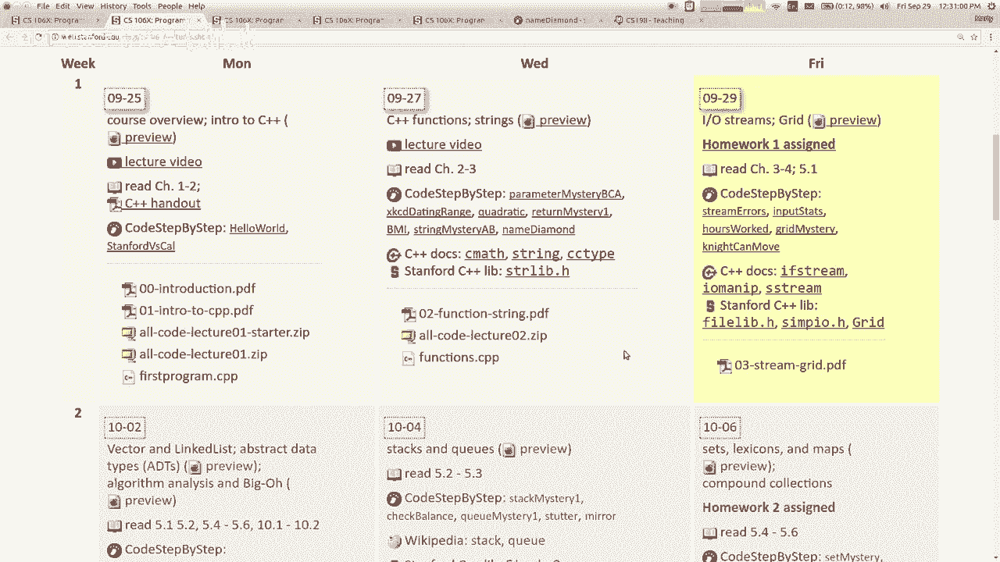

# 课程03：字符串、流与网格 🧵📁

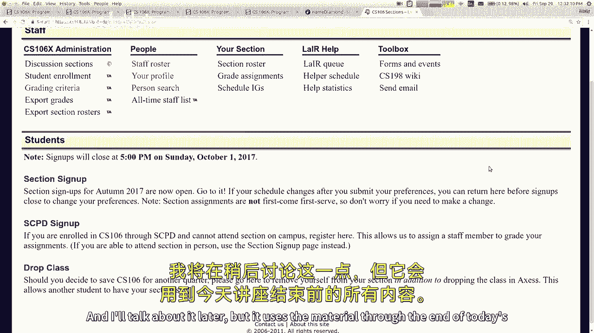

在本节课中，我们将学习C++中的字符串（String）、文件流（Stream）以及网格（Grid）数据结构。这些是构建程序、处理数据和存储信息的基础工具。我们将从字符串的基本操作开始，接着学习如何读写文件，最后介绍二维网格的使用方法。

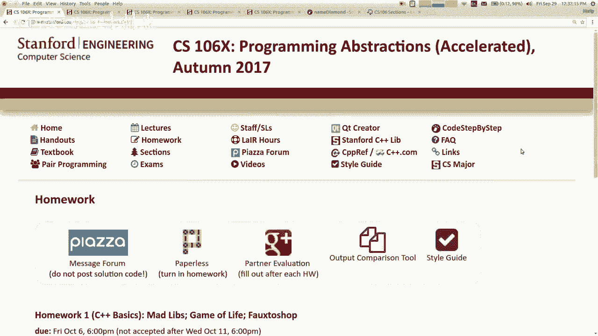

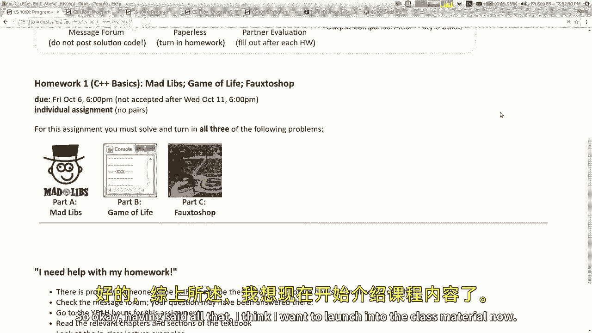

---

## 字符串基础

上一节我们概述了本课内容，本节中我们来看看C++中字符串的基本概念和操作。

在C++中使用字符串，必须包含名为 `<string>` 的系统库。字符串本质上是一系列字符（`char`），索引从0开始。

```cpp
#include <string>
using namespace std;
string greeting = "Hello";
```

字符串中的单个字符可以通过方括号 `[]` 访问，这与许多语言中的数组访问类似。

```cpp
char thirdChar = greeting[2]; // 获取索引为2的字符，即 'l'
```

以下是字符串的一些基本操作：

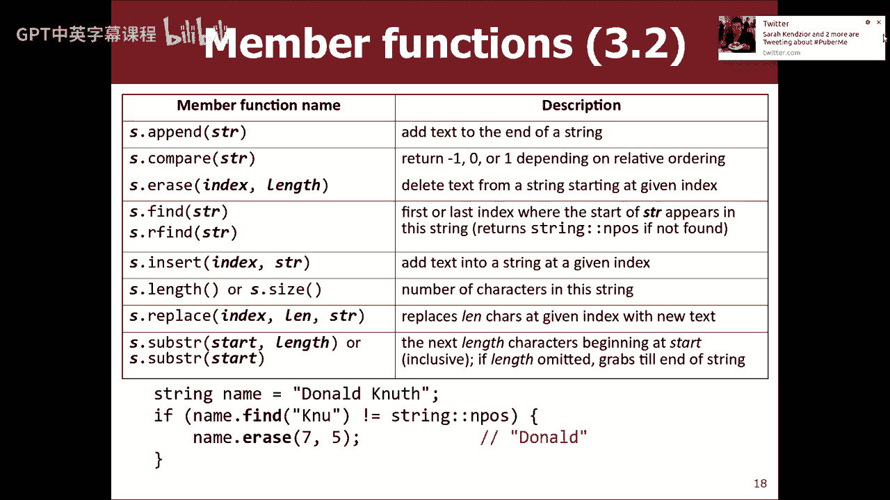


*   **连接**：使用 `+` 运算符可以将两个字符串连接起来。
*   **比较**：可以使用 `==`, `!=`, `<`, `>` 等运算符直接比较字符串，顺序基于字符的ASCII值。
*   **修改**：C++字符串是可变的（mutable），可以直接修改其内容，例如使用 `append` 方法或 `+=` 运算符。

与Java等语言不同，C++的 `+` 运算符主要用于连接两个字符串对象。若要将其他类型（如整数）与字符串连接，更常见的做法是使用输出流运算符 `<<`。

---

## C++字符串与C风格字符串

上一节我们介绍了C++字符串的基本操作，本节中我们来看看一个需要特别注意的地方：C++中两种字符串类型的区别。

C++语言兼容其前身C语言。因此，存在两种字符串：
1.  **C++字符串**：即 `std::string` 类型，功能丰富，是我们推荐使用的。
2.  **C风格字符串**：本质是字符数组（`char[]`），功能非常有限。

声明一个用引号包裹的字符串字面量（如 `"Hello"`）时，其类型是C风格字符串。但通常我们将其赋值给 `std::string` 变量，从而自动转换为好用的C++字符串。

**核心问题**：当混合使用两种字符串时，尤其是使用 `+` 运算符，可能导致意外错误或程序崩溃，因为编译器可能不会报错，但运行时行为是未定义的。

```cpp
// 可能出错的例子
// string s1 = "Hello" + "World"; // 错误：两个C风格字符串不能直接相加
// string s2 = "Hello" + 42;      // 错误：C风格字符串与整数相加无意义

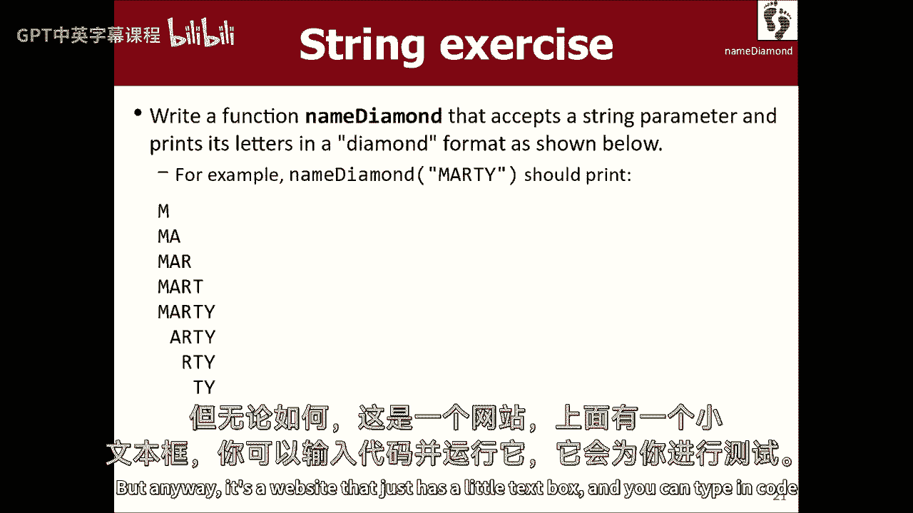

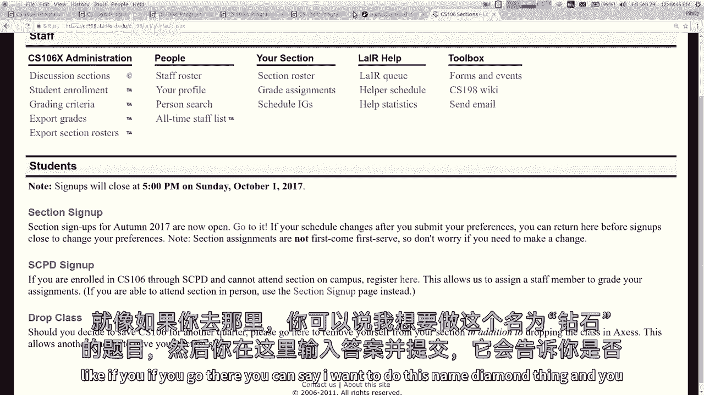

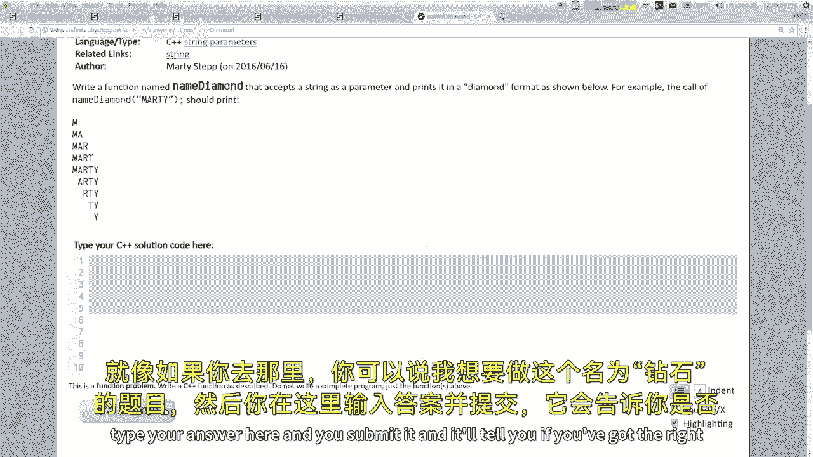

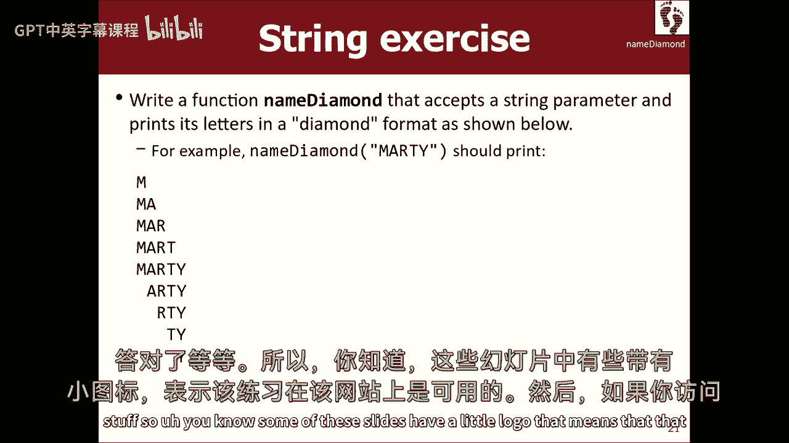

// 正确的做法
string s3 = string("Hello") + "World"; // 显式转换其中一个
string s4 = "Hello"s + "World";        // C++14后可使用字面量后缀 s
string s5 = "Hello" + string("World");
```

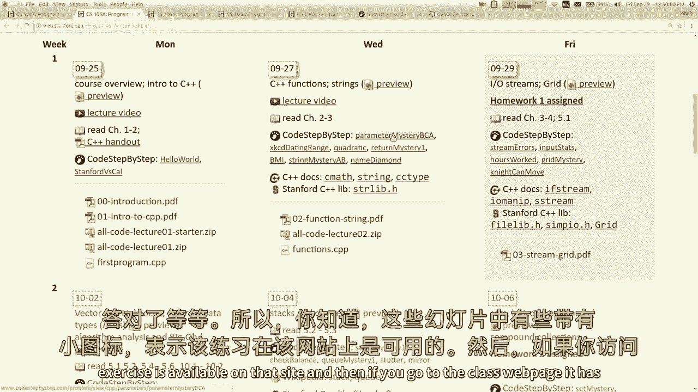

**重要建议**：尽可能始终使用 `std::string` 类型，并避免直接操作C风格字符串，以减少错误。

---

## 文件输入输出流

上一节我们了解了字符串的注意事项，本节中我们来看看如何使用流（Stream）来读写文件，这是处理外部数据的关键。

C++使用 `fstream` 库处理文件。主要类包括：
*   `ifstream`：用于从文件读取输入（Input File Stream）。
*   `ofstream`：用于向文件写入输出（Output File Stream）。

它们的用法与标准输入输出流 `cin` 和 `cout` 非常相似。

以下是读取文件每一行的标准模式：

```cpp
#include <fstream>
#include <string>
using namespace std;

ifstream inputFile;
inputFile.open("myfile.txt");
string line;
while (getline(inputFile, line)) { // 当成功读取一行时循环
    // 处理这一行数据
    cout << line << endl;
}
inputFile.close();
```

**代码解释**：
*   `getline(inputFile, line)` 函数尝试从 `inputFile` 中读取一行，并存储到字符串 `line` 中。
*   该函数同时返回一个布尔值，指示读取是否成功。因此可以直接作为 `while` 循环的条件。
*   使用 `>>` 运算符可以从流中读取被空格分隔的“令牌”（token），例如单词或数字。

有时我们需要先读取整行，再对该行进行细致解析。这时可以结合 `istringstream`（输入字符串流）：

```cpp
#include <sstream>
string data = "John Doe 25";
istringstream iss(data);
string firstName, lastName;
int age;
iss >> firstName >> lastName >> age; // 从字符串中提取数据
```

类似地，`ostringstream` 可以用于高效地构建字符串。

---

## 网格数据结构

上一节我们学习了如何通过流处理文件数据，本节中我们来看看最后一个核心概念：网格（Grid），它是一种二维数据结构。

网格类似于二维数组，但更安全、易用。它来自斯坦福的库，使用时需要包含头文件并指定网格中存储的元素类型。

创建一个网格需要指定行数和列数：

```cpp
#include "grid.h"
using namespace std;

Grid<int> matrix(3, 4); // 创建一个3行4列的网格，用于存储整数
```

访问或设置网格中的元素使用 `grid[row][col]` 的语法：

```cpp
matrix[0][0] = 42; // 设置第0行第0列的元素为42
int value = matrix[1][2]; // 获取第1行第2列的元素
```

以下是网格对象的一些常用成员函数：

*   `grid.numRows()`：返回网格的行数。
*   `grid.numCols()`：返回网格的列数。
*   `grid.inBounds(row, col)`：检查给定的行列索引是否在网格有效范围内。
*   `grid.fill(value)`：将网格中的所有元素设置为指定值。
*   `grid.resize(rows, cols)`：调整网格的尺寸。

**重要提示**：将网格作为参数传递给函数时，通常应使用**引用传递**（在参数类型前加 `&`），以避免复制整个网格带来的性能开销。如果函数不会修改网格，最好同时使用 `const` 修饰。

```cpp
void processGrid(const Grid<int>& grid) { // 通过常量引用传递，避免复制且保护数据
    // 可以读取 grid 的内容，但不能修改
}
```

---

## 总结

本节课中我们一起学习了C++编程中的三个重要组成部分：
1.  **字符串**：我们了解了 `std::string` 的用法，并重点区分了C++字符串与C风格字符串，以避免常见的陷阱。
2.  **流**：我们掌握了使用 `ifstream` 和 `ofstream` 读写文件的方法，以及使用 `istringstream` 和 `ostringstream` 在内存中处理字符串数据。
3.  **网格**：我们介绍了 `Grid` 这一二维数据结构，学习了如何创建、访问和操作网格，并理解了在函数间传递网格时使用引用的重要性。

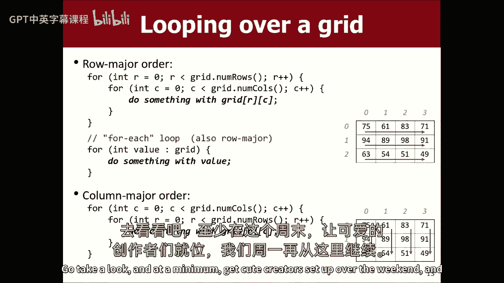

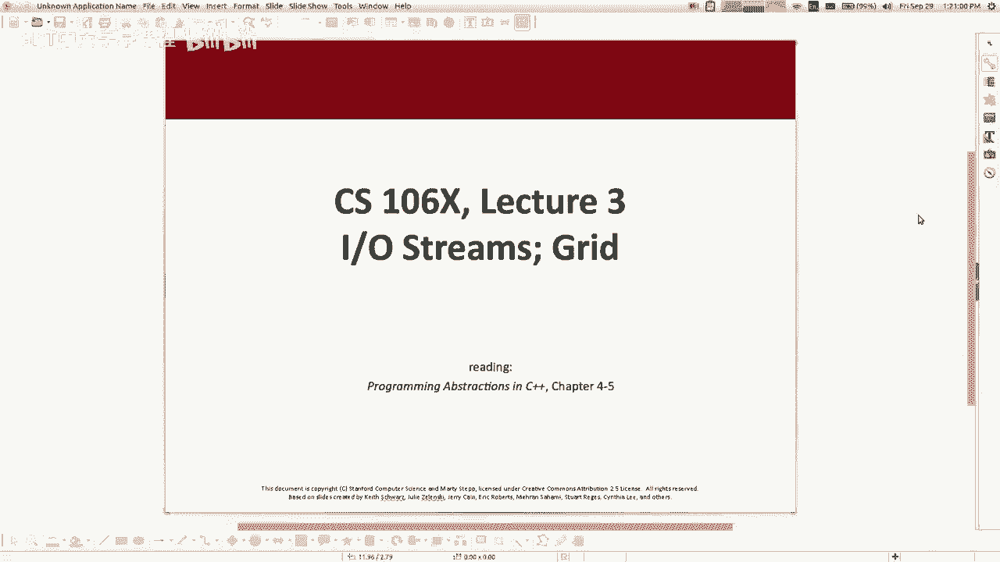

这些工具是完成数据输入、处理和存储的基础，将在接下来的作业和项目中反复使用。