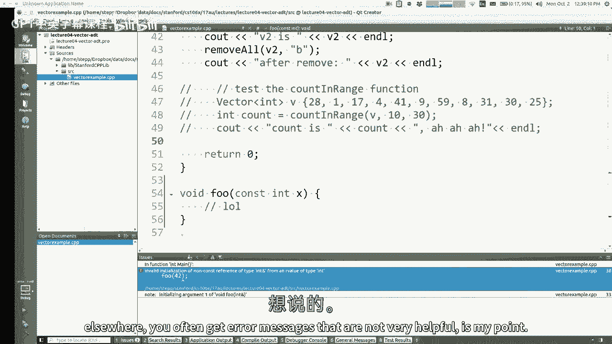
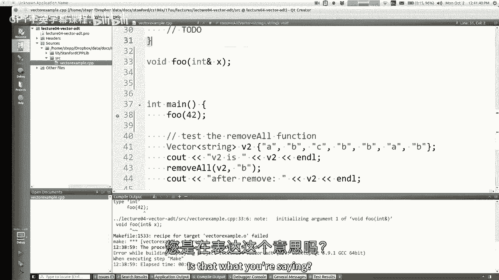
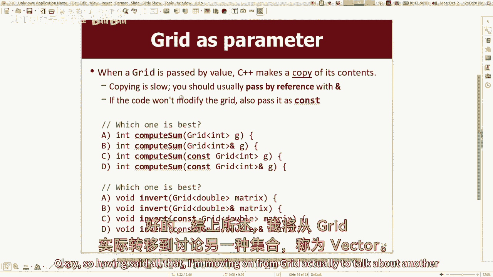
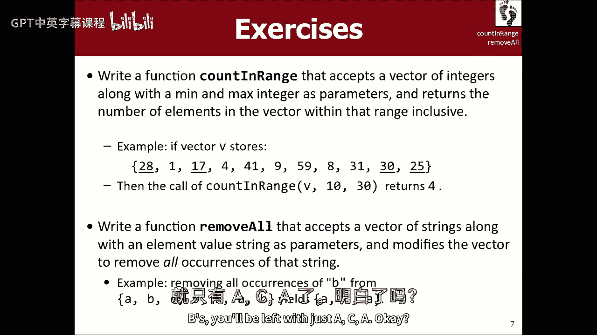
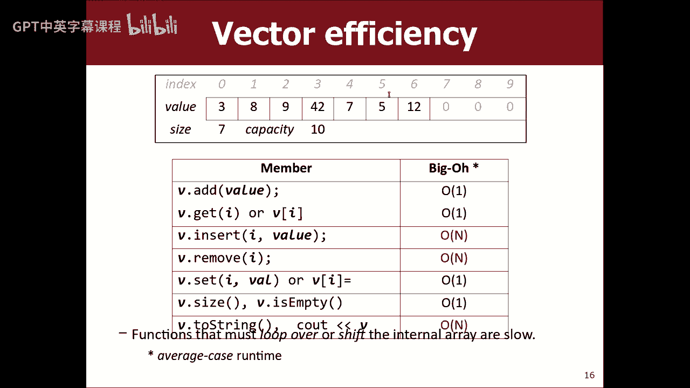

# 编程抽象方法 CS106X 2017 - 课程04：Vector与Big-Oh 📚

在本节课中，我们将要学习C++中的`Vector`集合以及用于分析算法效率的`Big-Oh`表示法。我们会先回顾上节课的`Grid`，然后深入探讨`Vector`的用法和内部原理，最后学习如何用`Big-Oh`来思考和描述代码的运行时间。

---

## 回顾：Grid的传递与常量引用 🔙


上一节我们介绍了`Grid`集合。本节中，我们来看看如何将`Grid`作为参数传递给函数。

当传递`Grid`或`FileStream`这类大型对象时，应始终通过**引用**来传递，以避免不必要的内存复制，提高效率。语法是使用`&`符号。

```cpp
void processGrid(Grid<int>& grid) {
    // 函数可以修改传入的grid
}
```

如果希望函数**不修改**传入的`Grid`，可以传递**常量引用**，使用`const`关键字。这既能保证效率，又能保证数据安全。


```cpp
void readGrid(const Grid<int>& grid) {
    // 函数不能修改传入的grid
}
```




**需要注意**：函数原型和函数定义中的引用(`&`)和常量(`const`)声明必须完全一致，否则会导致编译错误。

---

## 引入：Vector集合 📦



现在，让我们来看看另一个重要的集合：`Vector`。它在其他语言中可能被称为`ArrayList`（Java）或`list`（Python），是一个可以动态增长和缩小的元素序列。


要使用斯坦福库中的`Vector`，需要包含头文件：
```cpp
#include "vector.h"
```




以下是创建和初始化`Vector`的几种方式：
```cpp
Vector<int> vec; // 创建一个空的int类型Vector
Vector<int> vec = {1, 2, 3, 4, 5}; // 创建并初始化一个包含5个元素的Vector
vec.add(6); // 在末尾添加元素
```

与原生数组相比，`Vector`的优势在于：
*   知道自己的大小（`vec.size()`）。
*   能进行边界检查，访问越界会报错。
*   提供了丰富的操作方法（如`add`, `insert`, `remove`）。

---

## Vector的常用操作与遍历 🔄

以下是`Vector`最常用的一些操作。

**访问与修改元素**：
```cpp
vec[0] = 10; // 使用下标操作符
vec.set(0, 10); // 使用set方法
int value = vec.get(0); // 使用get方法
```

**遍历Vector**有三种常见方式：

1.  **标准for循环**（可以获取索引）：
    ```cpp
    for (int i = 0; i < vec.size(); i++) {
        cout << vec[i] << endl;
    }
    ```

2.  **基于范围的for循环（只读）**：
    ```cpp
    for (int value : vec) {
        cout << value << endl;
    }
    ```

3.  **基于范围的for循环（可修改）**：
    ```cpp
    for (int& value : vec) {
        value *= 2; // 可以修改Vector中的元素
    }
    ```

**注意**：在遍历过程中，如果使用`insert`或`remove`等方法改变了`Vector`的大小，可能会引发错误或导致意外行为。

---



## 实战：从Vector中移除所有特定元素 🧹

让我们通过一个例子来巩固对`Vector`操作的理解。我们将编写一个函数，移除`Vector`中所有等于特定值的元素。

一个常见的陷阱是正向遍历时进行删除。因为删除元素后，后续元素的索引会前移，可能导致漏删或越界。**更安全的方法是反向遍历**。

```cpp
void removeAll(Vector<string>& v, string s) {
    for (int i = v.size() - 1; i >= 0; i--) {
        if (v[i] == s) {
            v.remove(i); // 从后往前删，索引稳定
        }
    }
}
```

---


## 深入：Vector的内部机制与效率 ⚙️

`Vector`内部使用一个原生数组来存储数据，并维护两个整数：
*   `size`：当前存储的元素数量。
*   `capacity`：内部数组的总容量。

当添加元素导致`size`即将超过`capacity`时，`Vector`会执行以下操作：
1.  分配一个更大的新数组（例如，容量翻倍）。
2.  将旧数组的所有元素复制到新数组。
3.  使用新数组，并更新`capacity`。

这种策略类似于“预先购买更大的房子”，虽然会暂时浪费一些空间，但避免了每次添加元素都要“搬家”（复制全部数据），从而提高了平均效率。

---

## 核心：算法效率与Big-Oh表示法 📈

本节中我们来看看如何分析算法的效率。我们主要关心**运行时间**如何随着输入数据规模（记为`n`，如`Vector`的元素数量）的增长而增长。

我们使用一个简化的计算模型：每条简单语句执行耗时一个单位时间。循环的耗时是`循环次数 × 循环体内的语句数`。

基于此模型分析代码，我们可能会得到一个像 `3n² + 10n + 5` 这样的表达式。为了抓住本质，我们采用 **Big-Oh** 表示法：
1.  忽略表达式中的常数项和系数（如`3`, `10`, `5`）。
2.  只保留增长最快的项（这里是 `n²`）。

于是我们说，该算法的时间复杂度是 **O(n²)**。它的含义是：当输入规模`n`很大时，运行时间的增长趋势与 `n²` 成正比。

---

## Vector操作的Big-Oh分析 ⏱️

以下是`Vector`各种操作的**时间复杂度**分析：

*   **`add(value)`** 在末尾添加：通常为 **O(1)**。仅在需要扩容时是 **O(n)**，但平均分摊下来仍是 **O(1)**。
*   **`[index]` 或 `get(index)`** 按索引访问：**O(1)**。
*   **`insert(index, value)`** 在指定位置插入：**O(n)**。因为可能需要移动其后所有元素。
*   **`remove(index)`** 删除指定位置元素：**O(n)**。因为可能需要移动其后所有元素。

这里的 `O(n)` 指的是**最坏情况**或**平均情况**。例如，在末尾插入或删除就是 `O(1)`。

---

## 总结 ✨

本节课中我们一起学习了：
1.  **Grid的传递**：应通过引用传递，若不想被修改则使用常量引用。
2.  **Vector集合**：一个动态数组，提供了丰富且安全的方法来操作元素序列。
3.  **Vector遍历**：可以使用标准for循环或基于范围的for循环，注意在遍历中修改结构可能带来的风险。
4.  **Vector内部原理**：基于数组实现，通过维护`size`和`capacity`来高效管理内存。
5.  **算法效率与Big-Oh**：一种描述算法运行时间随输入规模增长趋势的表示法，帮助我们理解和比较不同算法的效率。
6.  **Vector操作的效率**：访问和尾部添加很快（O(1)），而在中间插入或删除则较慢（O(n)）。



理解这些概念有助于你编写出更高效、更可靠的程序，并为学习更复杂的数据结构和算法打下基础。