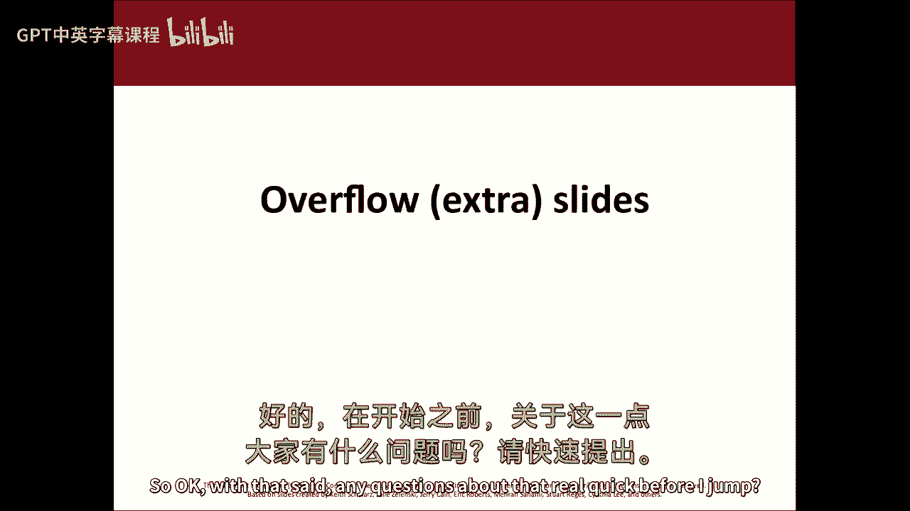
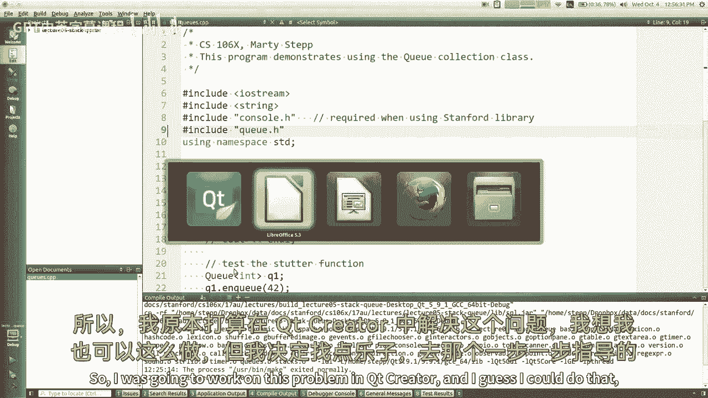
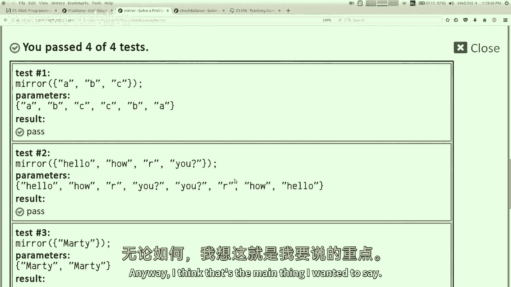

# 【编程抽象方法 cs106x 2017】斯坦福—中英字幕 - P5：Lecture 05 - Stacks and Queues - 加加zero - BV1By411h75g

我也很伟大哈哈哈哈，我妻子今早告诉我，她觉得我长得像史蒂夫·乔布斯，或者黑衬衫，我就像女孩的工作，不会成功的，否，但在出去的路上，我就像，哦，还有一件事我爱你，是啊，是啊，是啊，是啊，很俗气，然后也是。

反正，然后艾米告诉我她觉得我也像史蒂夫·乔布斯，所以我想，好啦，我要买件新衬衫，今天是星期三，现在是第二周，我们在研究收藏，上次，我们讨论了向量，我和你谈过这个大O符号，呃，大o符号是用来做什么的。

效率代表什么，你要说，是啊，是啊，一个人很好地举手，然后其他人都喊了出来，这两种都可以接受，通信形式，它是用来提高效率的，有一个特定的，你可以说得更具体一点，虽然就像，如果我说n的大o对n的平方。

我到底想说什么，那个短语到底是什么意思，当我们提供给它的输入增长时，算法的运行时间是如何扩展的，重要的是增长率，这就是大课的真正含义，是呀，好的评论，你可以说时间复杂度或时间效率，运行时效率。

这些都是人们可以互换使用的术语，是啊，是啊，是啊，是啊，当然，所以我们今天和周五会更多地讨论这个问题，我还会教你一些其他的收藏，我们可以从本周开始使用你的部分，你们有没有收到邮件告诉你们在哪个区，是呀。

如果你不知道你在哪个区，今天找个时间去你的手机或电脑，去CS一98斯坦福EDU网站，如果你在这里登录，它应该告诉你你在哪个区，你可能想在课间或课后检查一下，因为有些部分是在今天的课后。

所以你不想错过第一节课，如果你忘了报名，你可以去同一个网站做一个延迟注册，我们可以把你安排到这周的一个部门，好啦，所以不要忘了切分，我们开始那些，我不想说太多关于部门的事，因为我们时间有限，但是区段。

我们提前一两天寄出讲义，如果你想看看问题，我们将讨论，问题也在我们的小在线工具代码中，一步一个脚印，你不必提前解决这些问题，你们进入课堂，一起讨论这些问题，并解决其中的一些问题，如果你不把它们都吃完。

没关系，好像有十个问题，你不会把它们都吃完的，你没做完的不是作业，那些就在那里，如果你以后想看的话，你应该在最后得到一个解决方案密钥，如果你想看答案，所以这些只是你在你的部门里看到的问题，除此之外。

就看你了，它是可选的。

好的，好的，所以我想回到我们说过的关于大O和增长率，所以我们讨论了如何，如果您有一个表示算法运行时的复杂表达式，真正重要的是最重要的术语，我们把前面的常数扔掉，我们只说n立方体是这个算法的阶数，当然。

这种力量越高。

你的程序越慢，或者你的增长率在给定的投入增长下更快，所以我们讨论了这些向量运算，其中一些是一个恒定的时间，其中一些是线性的时间，它们与向量的大小成正比，n当您从向量中的任意位置添加和移除元素时。

所有从左到右在元素上的移动和移动，这导致了n运行时的大O，好啦，我把它涂成红色，只是不要说这些是糟糕的操作，或者你不应该打电话给他们，那不是我的意思，我的意思是，你应该知道他们的成本略高。

所以如果有一种方法可以编写相同的代码，不太使用这些操作的，你可能想用那个，你只想知道代价，你就是，你在这里引起的，对呀，好啦，所以就像一个快速的，一种测量这些东西的方法，以下是算法运行时的一些主要类别。

我是说这些数字是焦点焦点，但就像给你一个例子，一个算法可能需要多长时间，如果它有这些不同的增长率，很快，如果你开始上升到这些增长率，就像在立方体变成第四个，不管它变得真的真的很糟糕。

对于一个在较低的增长率下几乎立即运行的算法来说，特别是，有一些算法，就像它们是成比例的，可以调整它，哪种方式，如果在向量中再添加一个数据元素，算法的运行时间翻倍，你可能会说。

我想不出有什么事情会花这么长时间，但是好吧，你们中的一些人会在编程中发现，但是呃，你们中的一些人会很好，以后再说吧，这些不同类中的一些算法，我想大多数人都能理解恒定时间和线性时间，我们看到了。

你知道你可以在n的平方中得到n的平方，如果你有一个矢量，你必须检查每一对元素，n种类型成对或两种准备的平方，这个对数类有点像用来解决问题的，一遍又一遍地把输入分成两半，就像你在做所谓的二分搜索。

我们以后再谈，你不断地从考虑中削减一半的元素，所以这与输入大小的对数有关，反正，这些都是运行时类，你会在不同的算法中看到，好啦，所以我想谈谈，还有一种叫做链表的集合类型。

您可能在以前的编程中看到过这一点，我不会假设你已经看过了，我今天要在一个非常高的水平上谈论它，在本课程的后面，几个星期后，我会回来的，我们将在内部实现其中的一些集合，但不是今天，斯坦福收藏中有一个类。

称为链表的库，链表的奇怪之处在于，它不会做任何矢量做不到的有趣的事情，它有完全一样的，它有同样的东西，你可以创建一个，你得进口，我没穿滑梯，你必须包括一个链表，但你，您用这里元素类型的相同语法声明一个。

然后我在之前的幻灯片上给你们看的所有关于向量的操作，这里也有，然后插入，移除到字符串大小为空，都一样，完全是同一套方法，所以这很奇怪，当你第一次遇到这个，为什么建造这个图书馆的人。

做完全相同事情的两种集合，好像是多余的，你可能知道计算机科学家描绘的三件事高于一切，冗余、低效率和冗余，是的，所以这违反了这三件事中的两件，所以冗余和冗余，对呀，所以我们不明白为什么我们会有那么好。

为什么会在这里，除了这里的矢量之外，它们是以非常不同的方式建造的，在里面，使用数组构建向量，它是一块大块内存，将每个元素存储到链表中，是由这些叫做节点的小盒子组成的，每个框中存储一个元素值。

然后节点连接或链接在一起，使用一种叫做指针的机制，我今天不想太多谈论，但可以说，你几乎没有，我说的是像，你知道它几乎就像小火车车厢，你知道在哪里，如果你想，如果你有一辆又大又长的火车。

你可以把车拆开重新排列重新组装，每辆小车都有一些货物，这有点像链表的作用，好啦，为什么它与矢量不同或更好或更差，嗯，你知道我们以后再谈，但我想我现在要说的是，其中一些操作在链表上更快或更慢。

因为不同的内部结构，例如，如果这是您拥有的链接列表，你说我想在索引3处插入4-2的值，链表的作用，而不是把钱转移到上面，只是告诉这家伙一个非常盒子，之后，你将是一个新的盒子，里面有一个42。

下一个盒子是有七个的，因为种种原因，电脑不需要把内存移到它上面，它就能工作了，因此，由于这个原因，插入现在有了不同的运行时，当然你知道当你有一个合适的链表，你必须在列表中找到做这个操作的地方。

所以我的意思是这有一些利弊，但我的观点是用不同的方式建造东西，内部可能会导致一个不同的大O，或者同一组操作的不同运行时，有趣的是，所以你说这可能会更快，因为你不必改变事情，但同时你刚刚提到你必须迭代。

直到你到达你想放在右边的元素，所以问题是，这是一个不同的大O，是不是更快，是不是慢了，嗯，好啦，我是说，我想描述一下如何添加到链表中的一般概念，我还没有真正回答，实际上是快还是慢，如果你用计时器测量。

哪一个会更快，我觉得像这样的作品，与矢量相比，这有一些利弊，但在某些情况下，链表显然比向量更好，例如嗯，如果要向链接列表的开头添加某些内容，真快啊，你只要做一个新的方框点，旧盒子上的新盒子，你就完蛋了。

对于向量，你必须用链表移动每个元素，你不必把任何元素运过来，所以前面的插入操作，对于链表来说，这有什么大不了的，它是一个或恒定时间的大o，与对向量来说是n的大o相反，就像我没有说很多细节一样。

我们会更详细地讨论这个问题，我想和你一起勾勒出大致的概念，相同操作的两个内部实现可能有不同的内容，哦，如果你看看这张图表，哦对不起，我的滑梯好像断了，但如果你看看这张图表，看起来链表更糟。

但这些是平均运行时，我想这些星号我想强调的是，就像，如果你在前面插入，链表实际上是一个大O，即使平均值是n的大o，所以我不是想说，你看，链表是坏是好，或者别的什么，我只是说，如果你要列出一个元素列表。

然后呢，你知道你将要做的，列表前面的一大堆插入和删除，您可能会特意选择链接列表而不是向量，因为这样会更快，所以你去那里，你有多种方法来实现相同的操作，我们称之为抽象数据类型或添加抽象数据类型的概念。

这是你想要的一套操作吗，这与你如何实现，保佑你，所以这里的a t可能被称为列表，我想要一份数据清单，列表操作的具体实现可能是一个向量，也可能是链表，所以名单A T，在字典或地图上设置。

这些是更普遍的事情，可以有多种不同的实现，是啊，是啊，我在搬家，为什么要加上间隔，我是零一，哦哦哦，为什么，如果添加到链表的末尾，为什么那快井，因为大多数链表维护标记以到达两端的末尾。

所以如果你加上前面，它可以很快地直接跳到那里，如果你加上最后，你可以直接跳过去，但如果你想走路去别的地方，你必须沿着这些链接走，找到中间，所以中间通常是不好的地方，是啊，是啊，但这取决于你如何实现它。

好啦，所以无论如何，这是一个有趣的想法，EDT的这个例子，当我们学习如何实现集合时，我们会考虑这个主意，很多，事实上，大多数语言在java中有多种adt实现，有一个数组列表类，你可能用了。

如果你来自6A或Java中的一个，P课程之类的，除了射线列表，还有一个类叫做链表，我不知道你有没有用，但它在Java中，有一种东西叫做哈希图，就像一本配对词典，还有一张树状图。

它是一本略有不同的配对词典，有一个哈希集和一个树集，在Java中，它们通常有两个或三个相同操作的实现，在许多其他语言中，所以这个概念在编程中很常见，所以没关系。

有什么问题吗，真实，在我跳之前快点，我想在这里跳转到另一组幻灯片，是啊，是啊，哦耶，所以对于链表，如果我继续搜索列表中的元素，程序是否，从第一个跳到一个一个跳，然后定位五个元素中的这个元素。

让它像在for循环中，我多次搜索某个元素，在搜索中它要做什么，嗯，我是说，我认为在这两个结构中的任何一个中搜索都是一种线性遍历，如果要在向量中搜索元素，你得在每只眼睛上打圈，查看每个框中的元素。

想搜索链表，它必须通过沿着这些链接跳跃并查看每个盒子来循环，所以我认为每一个都有一个线性的运行时，如果你做了多次搜索，您可以注意到链表上的减速，因为它要在列表中遍历很多次才能找到，但是是的。

他们都不适合搜索，说实话，如果要搜索元素的成员资格，有一个更好的结构，我们将在本周学习，例如，如果我想添加一个元素，哦，增加每个元素，是啊，是啊，有一种方法可以把这四个循环起来，每个循环都是通过引用。

在那里你可以做，加加将是和大正方形，这将是一个很大的o n，如果对每个循环使用，通过引用循环每个元素，加上这个值或者改变这个值，那很好，从比基尼上搜索，嗯。

no for a for each循环使用更高效的内部迭代结构，为了那个，所以你是对的，如果你用一个列表，错误的链表，您可能会产生很高的运行时成本，你得小心点，我们会回来的，更坦率地说。

我不会让你使用链表，在这周的家庭作业中，所以这就是为什么我要强调它，就我们花在这上面的时间而言，我想在向量上花更多的时间，因为这是典型的，我们想用于该类中大多数问题的一维结构，但这个对某些问题更好。

尤其是那些大部分的添加和删除都在开始的地方，如果是在最后，矢量就可以了，如果它在中间，他们两个都不好，所以主要是，如果你在前线做事，一遍又一遍，链接列表对此有好处。

反正，好啦，这是一个链表，这就是ADT的简称，我们会经常重温这个想法，所以我认为今天这堂课的两大主题是，我之前说的话，也就是说，通常有不止一种方法来实现相同的操作，每种方式都可能有利弊。

今天的第二个大想法是，如果你建造一个简单的结构，没有很多支持的操作，它可能能够更好地、更有效地或更简单地执行这些行动，这就是为什么我想和你们谈谈两个结构，称为堆栈和队列，这个内容来自教材的第五章。

就像其他的收藏品一样，所以堆栈和队列，它们是我所说的专业收藏，我想这对我来说很难，为了让你相信这些很酷，因为他们所做的一切你都可以用矢量，矢量可以做得更多，所以这些东西比矢量更糟糕。

但我不知道该怎么跟你说，就像你有能力利用这些强大的矢量，我想卖给你更坏的东西，但就像你们拿着电锯，我想卖给你一把牛排刀，你知道有时候我不想要电锯，因为我可能会把胳膊切下来，什么的，你知道的。

我不知道更多的权力并不总是更好，你为什么有一辆自行车，如果你有车，有时，由于种种原因，一些不那么强大的东西仍然有用，所以stat是一个以给定顺序存储元素的结构，您只能从该顺序的顶部添加和删除元素。

所以你可以把东西添加到顶部，它们就会堆积起来，或者你可以把上面的东西去掉，也就是说你最后加的东西会出来，那都是一堆，有吗，就是这样，嗯，还有一个叫Q的东西，就像一排元素在等待，其实呢，如果你来自。

如果你是英国人，你会，你会打电话给排队等餐馆的人，或者你称之为暗示的东西，所以它是添加在行后面的一行元素，从前线撤下，那都是暗示，又这样做了，这些不是很强大的结构，你可以用矢量来做所有这些事情。

但也许我们还是想了解这些，所以让我们先弄清楚为什么我们要做堆栈，所以再一次，你把事情堆积起来，你加上，他们以一定的顺序被记住，你说最早添加的元素在底部，最后添加的元素在顶部，如果要求堆栈移除元素。

出来的那个是在上面的那个，你上次加的那个，所以这就是为什么他们说，一些谈论堆栈的人说它有最后一个，是第一个出去点菜还是老，现在你必须考虑的一件事是，当你，当您使用堆栈时，你不太谈论索引。

就像int i等于零，我们用那些括号和索引，很多向量和网格，所以你们真的习惯了索引，作为喜欢的方式，伸手去收集东西，但有一堆，你不是真的那样做的，你得放弃这个想法，访问元素的唯一方法是说嘿堆栈。

请给我上面的元素，其余的元素是你无法到达的，你拿不到的，他们在下面，就像一个真正的堆栈，你去自助餐厅，那里有一堆盘子，你抓住上面的盘子，你知道顶板上有时会有粘液，你不要最上面的盘子，但他们就像。

有一大摞很重的东西，你不能伸手进去把底板拿出来，因为它们堆积如山，所以有点像，你只能到最上面的那个，所以放弃索引的概念，你只能访问这个，堆栈支持的核心操作是向顶部添加一些东西，我们通常称之为推到堆栈上。

从顶部移除元素，我们称之为从堆栈中弹出一个元素，通常您支持一些操作来查看位于顶部的元素，在不移除它的情况下，我们称之为堆栈峰值，你为什么想要这种东西，嗯，在cs中有很多问题都有类似堆栈的结构。

当您构建编译器或编程语言时，您经常管理像堆栈一样的数据，例如，当函数main调用函数a时，它调用函数b，它调用函数c，这些函数中的每一个都堆叠了一组关于函数和参数的内存，局部变量调用堆栈。

如果编写编译器并计算表达式，你知道a等于b乘以c加d，您通常会将要计算的表达式和参数堆叠在一起，堆栈对于匹配各种任务非常有用，事实上，如果你上了理论课，你就会学到，你知道的，基于堆栈的计算模型很有趣。

推下自动机和这种性质的东西，例如，如果你想知道一个字符串是否是回文，你可以把字母推到一堆上，然后把它们弹出来，看看它们是否以同样的方式出来，堆栈的一个有趣的副作用是，如果你向它添加五个东西，你知道一二。

三个，四五，如果你移除它们，他们出来五四，三个，二一，所以你最终看到他们以相反的顺序，你把它们放进去是有用的，如果任何形式的反转任务，如果堆栈对此有好处，以此类推，有很多算法。

我最喜欢的堆栈应用程序之一是，您可以用它来帮助您编写迷宫求解器，你把你想搜索的地方堆叠起来，你把东西拿出来搜查，它帮助你跟踪要看的东西的顺序，您还可以使用它来实现撤消功能。

就像你在写文字处理器或Photoshop程序，您可以保存用户执行的每个操作，你把它们放在某种收藏中，假设你把它们堆成一堆，然后如果用户单击撤消，他们想撤销最近的行动，就是在堆栈顶部的那个。

所以很多这样的任务对他们来说都有这种性质，在这种情况下，堆栈是一个很好的结构，这就是什么是堆栈的概念，对此有什么问题吗，到目前为止，哇塞，这个小组没有问题，我惊呆了，哦一个，是呀。

其中运算符在操作数之间，你可能会说，还能是什么，但有一些手术你说像加AB，意思是加上a和b，就像，如果你有一个坏的计算器，你得这样打，有时还是要感谢惠普，是啊，是啊，仅仅计算数学表达式，基本上。

如果您想实际编写使用堆栈的代码，我们在斯坦福收藏图书馆有一个书库，我们包括堆栈H，下面是你得到的几乎所有的函数，还有一些其他的，但这些是其中的大部分，您还可以打印堆栈以查看输出流，所以你可以偷看。

这意味着在不移除堆栈的情况下查看堆栈的顶部，你可以弹出，这意味着从堆栈顶部移除，或者您可以将一个值推送到堆栈的顶部，所以当你想声明一个集合时，您只需获得要存储的数据类型，你推，推，推，然后你推42。

负3和负17，如果你把东西弄掉，你会得到17负，三四十二，事情很简单，所以我不会把这个，是啊，是啊，你必须存储一种类型的数据，就像int到堆栈上，和其他收藏一样，是啊，是啊，很简单的事情对吧。

只是这里没有太多的行为，你会注意到没有索引，没有方括号，没有get元素，东西不见了，它不在那里，你做不到的，只是不是堆栈，不是什么，这是为了，是啊，是啊，假设你想把一堆物体，然后有一堂课。

如果您想使对象堆栈，是啊，是啊，你得你得用指针，基本上是为了那个，我们几个星期后再做指点，是啊，是啊，如果你想，您希望将对象堆叠在一起，你要么，把一堆东西，在这种情况下，它们会被复制到上面。

或者你做一堆指针，它不能很好地复制它们，我们会了解的，嗯好吧，所以这里有一些你不能用堆栈做的事情，我是想说服你，多酷啊，这是所有你不能做的事情，孩子，我是今天的不史蒂夫滴，对不对，他就是这么做的。

他只是把东西拿走，他拿着耳机，千斤顶走了，他把所有的功能键都拿走了，在键盘右上方，所以我有点蒸汽Chompsy，我把你的航向，但是现在我得到了i向量，它不再有索引了，它是如此的溪流右，现在是九十九。

九十九，嗯，是啊，是啊，我不是苹果的超级粉丝，但那是，反正，对不起，因此不能通过索引访问元素对堆栈进行循环，我只是不让你，它不编译，它不工作，你所做的通常是写一个循环，当堆栈不为空时。

我会从堆栈中弹出一个元素，我会用，事实上，我很确定即使是for每个循环在这里也不起作用，所以没有办法在元素上循环，你得做一个循环，把东西拿出来处理，当然这个循环有一个有趣的地方，如果你运行一个循环。

当堆栈不为空时，弹出一个元素并在循环的末尾打印它或其他什么，堆栈的状态如何，是空的，所以关于斯塔克斯的一个有趣的事情是，你不能在不把它们清空的情况下处理它们，你知道，因为有时你想在矢量上循环什么的。

然后当你做完，你希望矢量内容仍然存在，堆栈使您清除内容以处理内容，但又一次，如果这不是你想要的，也许您不应该在这个特定的问题上使用堆栈，大多数这类问题，如果要访问堆栈或使用堆栈，这就是你想要的。

所以效果很好，我想和你们做一个快速的例子，我想写一个名为支票余额的函数，这是我想看的一个字符串，它表示像C++代码这样的代码，我想要的是，我想找括号，我想找卷花括号，我想看看他们在绳子上是否平衡。

所以换句话说，如果你在这里打开一个括号，你最终必须像这样关闭括号，或者如果你在这里打开一个花括号，你得把这里的花括号合上，但这些东西可以嵌套在正确的地方，里面有圆括号的卷曲。

所以你不仅要关上你打开的东西，但你也必须有正确的相对顺序，所以如果我打开这些括号，然后我关闭一个花括号，这是不正确的理解，就像如果我打开什么东西，我得先把他关起来，我把他以外的人都关了，好的好的。

这是堆栈讲座，那么堆栈如何帮助我解决这个问题呢，你觉得怎么样，是啊，是啊，我的第一个猜测是，每次你看到一个打开的括号，堆栈的索引，然后每次你看到一个删除一个索引，然后每次你试图删除你首先检查它是否为空。

所以你知道，如果有像，如果你想删除太多，它就会指向索引，是啊，是啊，我想你有正确的算法种子，你说过，当我看到开括号和花括号时，我把东西推到堆栈上，当我看到关闭的东西，我会从堆栈里弹出来，我会比较一下。

看看我是否喜欢我所看到的，看看事情是否吻合，你刚才提到，我可以把索引推到堆栈上，我觉得只要把角色自己推就行了，我不太关心索引，我的意思是我最终必须返回索引，但我想我可以用不同的方式做到这一点，基本上。

如果我看到这些开放的卷发和王子，我可以推他们，如果我看到关闭卷曲，我可以把它弹出来，我想这是这里想法的核心，如果我们没发现绳子有什么问题，我们会说不平衡在指数负1，但如果我看到不平衡或有什么问题。

我将像这样返回发生这种不平衡的索引，我看到一个卷曲，但它应该是一个结尾插入语，我会退回14号索引。

所以我要在《可爱的创造者》中解决这个问题，我想我能做到，但我想玩得开心，去网站。

逐步网站，在这里有个练习，所以我可以在这里键入我的代码，嗯，那么函数的标题是什么呢？是一串代码什么的，对对你说，如果有人说堆叠得很好，我是说，我想用一个堆栈，但我想函数的标题不会让我通过一堆。

我想在这里用一个，嗯，你们看到了吗，把那里弄大一点，好啦，那么现在我在这里要做什么，是啊，是啊，这个东西已经包含了，我会包括堆栈点h，所以它已经知道了，所以我可以开始写这个代码，所以你想让我做一堆。

我们可以把括号，就像一堆被称为括号分号的忧虑，现在怎么办，好啦，循环字符串的字符，当然，对于每一个int，我从零到代码，点长度，我加加酷，所以现在你说，如果我看到牙套，我可以推到堆栈上。

所以我为什么不现在就实施呢，所以如果代码i是括号，或者代码I是，然后我会做括号，点推码，我把那个字符推到堆栈上，好啦，我想是从，如果是闭合支架，是呀，所以我想你会有这样的感觉，所以如果你按照这个算法。

推圆括号和圆括号，然后我可以看到一个结尾括号，所以堆栈会有像这两个东西，我看到了这个，所以我得确保这个和，上演什么？在堆栈的顶部，对呀，那么其他的呢，如果事情是一个结束，嗯，括号或卷曲，所以这个或那个。

你可能想要，你想让我做两个，好啦，当然可以，如果那样的话，当然好的，所以如果是闭合支架，我有一个，我有一堆字符，我可以说焦顶等于点，如何从堆栈弹出窗口中删除，这是正确的，所以说，对不起，那是什么？

你为什么要把你怎么知道的，当你把这些结合起来，你想让我把它们重新组合起来吗，不要这样做，好啦，我们会写的，然后我们可以决定我这里有300个编译器，帮助我，嗯，所以等等，就像如果上面的字符不是开头的括号。

那很糟糕，对呀，是啊，是啊，所以这意味着我会返回，这里有一件坏事，我们返回这个索引是坏的，这意味着索引，我是坏人，你明白的，好啦，所以你会看到一段类似的代码，如果这是个结案陈词，我会说我希望它是那样的。

否，开场，闭幕，我们需要检查，哦对不起，开场的那个，对不起，是呀，是呀，你最后也需要，好啦，我想有几件事我们还需要解决，我在这里听到了很多非常有用的不和谐的建议，突然告诉我一件事。

你想让我用眼镜在后面贴上地址或固定一下吗？是啊，是啊，等等，是不是有，不要，因为，如果你喜欢，像两个，像个普通的公主，然后就像一个的两个流，你不觉得这很有道理吗，是啊，是啊，这是个好问题，怎么样。

如果括号太多，相对于开头括号的数量，否，我遇到了不同的种类或太多不同的种类，是啊，是啊，我想一切都会好的，只要前面的堆积如山，然后我们把它们弹下来，当我们看到与他们匹配的东西，我想我们会没事的。

所以我认为这个代码会推，推，推，推，然后当我们看到他们的闭门造车者，我们会砰砰砰砰，我们会比较每一个，所以我想只要代码是有效的，这一定行，但可能有一些情况它没有妥善处理，比如哪种情况，可能处理不好。

它可能会被用在这些结尾的事情上，因为书库，如果堆栈为空，就像堆栈上什么都没有，就像如果我说打开，然后关闭关闭那一秒钟，关闭，纸堆上不会有任何东西，如果您试图从空堆栈中弹出。

它以一个坏的异常使您的程序崩溃，所以实际上我可以离开它，我你知道，我不知道，这件事你不必相信我的话，我来帮你解决，你说的对，那是个窃听器，在我修好它之前让我先修好它，如果我们一路，我实际上试图提交代码。

它说我的控制已经到了我功能的尽头，意思是我最后没有还东西，如果我一直走到for循环的尽头，那就是说绳子没有问题，我应该回一个负的，如果弦没有问题，弦是好的，好啦，所以我提交了这个，上面说我有个例外。

试图从空堆栈中弹出，我相信这在这次测试中发生了，这就是这些平衡的地方，但现在我有一个没有开瓶器的更近的东西，所以我想就在那里我有一个空的，原来你是这么说的，好啦，酷，“那么你想让我在这里做什么。

就像在我弹出它之前，我可以说如果是空的，那很糟糕，好吧，所以返回i，这意味着没有平衡的井，你们很聪明把这两段代码分开，爸爸：那完全不一样，我只是在为难你，好啦，所以现在我通过了那个案子，我通过这三个。

但现在这个失败了，这里的情况有什么问题堆栈在堆栈处是空的，最后不是空的，就像当我看到这个，它与此相平衡，但当我看到这个，对他来说没有平衡，我相信规格，我没有把问题的详细说明留在屏幕上很长时间。

但我相信我们应该做的是，有一些开瓶器没有关闭，我想我们应该把绳子的长度，作为错误可以接受的地方，那么现在我如何将它合并到这个算法中，在最后，是啊，是啊，当我完成我的for循环时，如果呃。

如果Paren堆栈为空，那很好，所以我会返回负的另一个，我将返回代码字符串长度，那怎么样，好啦，我们做到了，所以我曾经有像达斯·维德的声音和东西，但后来我想我可能会因此被起诉。

所以我把它改成了像模糊的电子游戏噪音，那口井不是晦涩而是像，我想他们不会知道的，任天堂从不起诉任何人，作为一家公司，他们不喜欢打官司，好啦，反正，别管把那部分从视频里删掉了，所以我们很好，我们做到了。

我是说，2。你看这问题的症结所在，我觉得我们应该，也许试图巩固这一点，不过没关系，我把这个留下，如果你想去解决，你可以，我只是想玩堆栈，做一个例子，我们推和弹出，我想我的论点是我们完全可以用矢量。

本来可以的，但我们不需要任何矢量的东西，这堆东西很好，我认为把东西推上去和把东西弹出来的想法，我们对这个问题有点直觉，所以有这样的问题，在那里堆叠就可以了，你可能还是不相信，因为你说看矢量很好。

我只想学会用矢量，我不在乎史塔克，我想我要说的是关于堆栈的另一件事是，因为它只需要提供一些操作，这可能意味着实现堆栈的人，以一种非常有效的方式建造它，一种非常轻量级的方法不使用那么多内存。

也许跑得更快一点。

其实呢，我想我有一个幻灯片来这里，我说的地方，等一下等一下，坚持住，我没有那种等待吗，我去找找，它在哪里，对不起，对不起，对不起，我这里没有大O吗，啊，我做它就在那里，好啦，所以我没提这件事。

我没有强调这一点，当我展示这些操作时，但看看你，堆栈执行的每一个操作都是高效的，我们进行一次恒定时间操作，所以我的意思是，如果你不提供那么多的操作，也许你可以确保你提供的，或者以聪明高效的方式实施。

那很酷，所以几乎不可能打错电话，让堆栈花很长时间才能完成调用，你明白我的意思吗，所以这是一种整洁，好啦，关于堆栈的其他问题吗，或者支票余额，或者我们写的源代码，后面，是啊，是啊。

我曾经在同样的时刻做同样的事情，这里也可以用矢量，是呀，如果我们以正确的方式小心地使用它，如果我们总是从向量的远端添加和删除，它的效率就和这个一样高，是呀，所以在这个地方使用矢量是绝对可能的，所以是的。

我是说，我不是想说斯塔克斯，做好这件事的唯一方法，我只是说这件事几乎迫使你以一种有效的方式去做，因为它什么也做不了，你知道这是牛排刀，不是电锯，好啦，如果您真的想知道堆栈是如何在内部实现的。

我不想在这上面花很多时间，但它通常使用向量或数组来实现，当您想向堆栈添加内容时，底部为零指数，顶部为最高指数，你觉得我们为什么要把它们按那样的顺序储存，而不是相反，是呀，恒定时间的去除操作。

我们不想移动东西当我们，是啊，是啊，就像如果我从这里跳出来，我得把这些家伙滑过去，那不好，我想把你做加法的地方推来推去，移除是顶部，所以这应该是数组的末尾，因为这就是从数组中添加和删除最有效的地方。

是呀，您可以使用链表，但更常见的是使用数组，一个问题，是的，是的，能力，我们上周讨论过，上课，在这种情况下基本上是自动的吗，还是有手册，哦对了，就像这个空间用完了，它会调整大小吗？它有点像矢量。

从某种意义上说，它可能有一些额外空间的数组，当空间耗尽时，它会自动生长，而你作为它的使用者，不用担心，如果您要从头开始实现自己的堆栈，如果没有堆栈这种东西，你想建立一个，你得考虑一下这个问题。

又是那个问题，那为什么，就像，哎呦，为什么插入一个大O，我们称之为摊销运行时，几乎所有的广告都是一个大O，偶尔也有一个不是，但如果你能把他的成本分摊到其他人身上，如果你仔细想想，你有N个快速的广告。

一个N加的第一个广告很慢，所以如果你把他的成本分摊，这几乎就像所有其他的成本是两个而不是一个，仍然是一个固定的摊销金额，所以总的来说加法是不变的，虽然是的，在最坏的情况下，它可能不得不调整大小，好啦。

所以说，让我们谈谈排队，另一个没什么作用的结构，但它是否以一种有效的方式，排队，这有点像一个等待名单上的人或类似的东西，你在后面加东西，名单的后面，你把清单前面的东西去掉，而我们，所以我们说。

第一个进来的是，第一个出来的人，这就像一个，不准作弊，没有削减，你不能站在队伍中间，我是那种喜欢追人的人，因为他们插队了，然后他们就走了，这是我妻子，我很抱歉，你跟你太太到后面去，头上的先生。

但提示是收藏版的我，它不允许任何人从中间切入，它确实以给定的顺序存储元素，好像它知道谁先插进去谁最后插进去，所以他们有一个命令，但我们并不真的认为它们有像零这样的括号索引，一二，你只在后面加。

你只从前面移开，队列支持的三个核心操作在队列中调用，有时候你叫它加法，排队，你也可以称之为移除和峰值，你可以从这里来，这个前面的元素，对呀，你为什么要排队，在计算机科学中有很多例子，如果您有一台打印机。

并且不同的计算机都可以打印到同一台打印机，打印机需要一分钟才能把页面打印出来，你得有一份工作清单，打印即将出来的工作，他们将按什么顺序出来，所以打印作业队列就像一个经典的地方。

您可以在其中使用这种类型的集合，有各种各样的东西，比如你有一个网络连接，像BitTorrent或下载什么的，它必须发送或接收一组数据包，它必须按一定的顺序做，所以它让他们排队。

但它会把他们从队列中发送出去，当连接准备好时，在编程中有各种各样的例子，你想排列的东西，然后按顺序做，事实上，很多情况下，你使用矢量，你可以用一个Q，完全取决于你在做什么，所以是的，好了。

现实世界的例子和东西，如果要在C Plus代码中使用队列，您可以包括库，这些是它支持的主要操作，就像堆栈一样，他们都是一个大O，他们都很有效率，你可以添加到后面，你可以从前面移开，你可以在前面达到顶峰。

你可以问它是不是空的，或者里面有多少元素，这里有一个快速的例子，三个元素的I队列，四十二人先排队，所以当我离开的时候，四十二先出来，不会是什么，DQ一号怎么，如果你必须从前面移开试着把整个东西移过来。

是啊，是啊，问得好，如果退队是一个大O是怎么回事，你的问题，我认为这是一个数组实现，因为它会改变，但答案是，这通常不使用数组来实现，我想我有一张幻灯片，我想前面有一个跳跃滑梯，但通常将队列实现为链表。

哪里，如果这是前面，我想让他离开，我只是抓住他，我总是把他从那里抓出来，然后我就把这个删掉了，现在我让他站在前面，如果你想结束，你通常有办法很快到达终点，一种快速到达前线的方法，可以使用数组实现队列。

你用一个叫做圆形数组的东西来跟踪，而不仅仅是零到大小类型的东西，当你离开时，你认为前面是向前移动索引一两个，这样你就不用转移你，您可以将队列想象为从索引1、2或3开始，但后来就变得混乱了。

因为你走到了最后，你喜欢绕着，你知道时间漩涡打开了，诸如此类的东西，所以不管怎样，但好消息是，它通常没有任何效率问题，它通常是在恒定的时间内实现所有这些操作，是的，所以实际上是一个向量。

如果你想做同样的事，要确保你有效地做这件事就有点难了，你经常会，如果你加到向量的末尾，从向量的前面移除，除非你很聪明，否则这些前面的移除往往会很大，所以你知道，这有时确实会让你得到比矢量更有效的结果。

到目前为止还有其他问题吗？我只是给你看基本的，就像用一堆，你不做从零到大小的for循环，通常你不会每一个循环都这样做，通常你会有一个这样的狼吞虎咽的循环，当队列不是空的时候。

您出列一个元素并对其执行一些操作，把一个元素取下来，如果是打印工作，把那份文件打印出来，或者扯下一包，如果那是个网络，它通过网络发送，随便啦，可以在队列上循环，有点像每个循环的a，但你得把它弄黑一点。

你要做的是如果队列的大小是10，你绕十圈，你所做的就是把前面，你看着它，然后你在队伍的后面再排队，所以如果每个人都离开队伍回到队伍后面，每个人都这样做了N次，那你做完之后，如果你想一下。

你有和你一开始一样的人，因此，您可以查看队列的内容，而不会以这种方式丢失它们，如果你想用一堆，你明白吗，你把一个拿出来，看一下放回去，如果你有一堆十样东西，你这样做十次，会发生什么。

就像你把最上面的拿下来打印十遍，你从来不看他下面的九行，所以这是一个稍微不同的问题，其实呢，如果要打印堆栈的元素而不丢失它们，你觉得你应该怎么做，只是在后面再说一遍概念，你会怎么做。

我可能得把它们存储在一个单独的向量中，我认为这是个好主意，是啊，是啊，也许保存一份副本，把它们备份到某个地方，把它们拿出来，打印出来，我不能把它们放回原处，我可以把它们放在别的地方，也许再做一叠。

把它们放在另一叠里，然后它们会在另一个地方堆积起来，然后当我打印完第一叠，我把它们从第二堆里拿出来，放回第一堆里，或者是的，差不多吧，你得把它们保存到备份或其他地方，如果你仔细想想。

就像记住事情是如何以相反的顺序出现的，你加一二三四五，他们出来了五四三二一，所以如果你把这些拿出来，把它们推到另一堆，它们是颠倒着进去的，到另一个堆栈，五个在下面，一个在上面，但如果你把它们拉出来。

他们翻回原版，当你把它们放回原版，所以你把它们反转两次，你明白我的意思吗？就像你说的，把它们放入辅助向量中，辅助堆栈，差不多吧，如果你把它们放在矢量中，然后把它们放回去，你得小心不要把顺序倒过来什么的。

反正，所以有一些可爱的循环来处理线索，最常见的是这个虽然不是空循环，但你可以做这个，如果你出于某种原因想保留里面的东西，好啦，您经常一起使用成堆的队列，他们就像最好的朋友，所以你可能会做一个提示。

然后你说，哎呦，我想颠倒立方体元素的顺序，所以你做了一堆，当队列不是空的时候，你把东西取出来，把它们推到堆栈里，所以现在队列是空的，但是这堆有一二三，上面有三个，现在，当书库空着的时候，你把它弹出来。

把它放回队列里，所以基本上把所有的东西都放回队列中，但顺序正好相反，在最后，这是个可爱的小把戏，对呀，好啦，所以让我们试着写一些代码，嗯，我想我想做这个这里叫镜子，所以给我一排绳子，然后改变队列的状态。

这样当你完成时，它就会以原始的顺序存储原始的元素，但它也以相反的顺序存储这些相同的元素，这有道理吗，这是什么，哦耶，对不起，我想我的写作有点模棱两可，前面是左边，后面是右边。

我想我们可以做这个，我们是X，我们什么都能做对，它在哪里镜子在这里，好啦，帮我做航向，Mirror和我要了一串叫做cue的字符串，我想它们碰巧是一个字母，但我想有双引号，所以我认为有弦，它返回什么无效。

因为它会修改队列，你发过来，意思是出了别的问题，权利必须是一个参考，是呀，好啦，凉快好，好啦，我该怎么做，那么现在我在做什么，如果我，如果我将队列清空到堆栈中，然后再把它放回队列中，我会把元素颠倒过来。

所以这将把我从CB ABC变成CBA，但我两个都想要，哦酷，好啦，所以我可以两样都做，我可以把它们拿出来，同时把它们堆起来，并重新添加它们，就像那样，好啦，不如就像，当队列为空时，是呀，你看穿我了，哼。

那么字符串s等于，Q dq，我以前学排队的时候，我不记得有多少，有多少这样的，或者像很多人那样写，就像我要离开我的Q不不，反正，管他呢嗯，叠起来推S，然后也把它放回队列中，q n q字符串。

这个代码有什么问题，是啊，是啊，我认为这是正确的想法，但这只有在队列最终为空的情况下才有效，但我要去掉一个，再加一个，我连一半都没赚到，但我很确定这意味着它的大小保持不变，每次我们经过。

那永远不会变得空虚，所以这可能不是正确的循环，你还有别的建议吗？哎呦，你就能知道，是啊，是啊，我想这是个好主意，所以也许像等于q点大小的东西，然后对于int i等于零，我小于尺寸，我加加或之前不加。

而像这样的事情，你们和我妻子会相处得很好，你们两个都是后座司机，从视频中删除那部分，嗯好吧，优秀的聪明人，我忘了什么，有什么问题，或者是的，是啊，是啊，所以我在这段代码的末尾是，队列恢复到原始状态。

我在堆栈中也有相同的元素，我得把这堆里的拿出来，把它们放在立方体的末端，对那又怎样，当堆栈为空时，我不必在这里使用for循环来调整大小，我可以清空堆栈，所以说，啊，那很有趣，那是什么哇，欧元符号。

未申报好，我想它堆积起来了，哼，好啦，我们做到了，我们真聪明，我们不为自己感到骄傲吗？是啊，是啊，只要九百九十九元九毛九，C加Q结构，我们不是这样说话的，对不起，我做不到，我不能做他的退出反正。

嗯，我想这是我想说的主要事情，我基本上没时间了，我唯一想说的是有一种结构叫做甲板，它是一个双端队列，让您高效地从正面和背面添加和删除，它结合了堆栈和队列的优点，它通常使用链表来实现，我们不经常用它。

但它就在那里，这三个都在我们的图书馆里，还有一个甲板点H，所以这些是堆栈和线索，我要就此打住，请检查您的班次时间，一定要去你的部门，祝你有美好的一天，别忘了，家庭作业一。

星期五见。