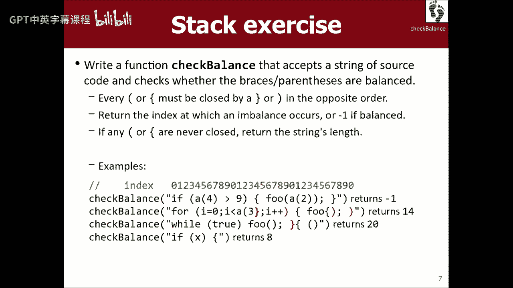
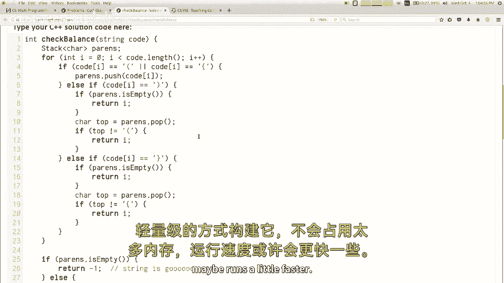

# 课程05：栈与队列 🧱➡️📚

在本节课中，我们将学习两种重要的数据结构：栈（Stack）和队列（Queue）。我们将探讨它们的基本概念、核心操作、应用场景，并通过代码示例来理解如何使用它们。同时，我们会回顾大O表示法，并理解不同数据结构实现同一操作时可能带来的效率差异。


---

## 回顾：大O表示法与效率 📈

上一节我们介绍了向量（Vector）及其操作的大O复杂度。本节中，我们来看看大O表示法的核心意义。

大O表示法用于描述算法的运行时间如何随输入规模的增长而扩展。它关注的是增长率的趋势，而非精确的运行时间。例如，O(n)表示线性增长，O(n²)表示平方级增长。

以下是算法运行时的一些主要类别：
*   **O(1)**：常数时间，运行时间不随输入规模变化。
*   **O(log n)**：对数时间，运行时间随输入规模对数增长。
*   **O(n)**：线性时间，运行时间与输入规模成正比。
*   **O(n²)**：平方时间，运行时间与输入规模的平方成正比。

对于向量，在任意位置（非末尾）添加或删除元素是O(n)操作，因为可能需要移动大量元素。

---

## 抽象数据类型（ADT）与不同实现 🔄


相同的一组操作（抽象数据类型，ADT）可以通过不同的内部结构来实现，这会导致效率上的差异。

例如，“列表”这个ADT，既可以用向量（基于数组）实现，也可以用链表实现。向量在中间插入/删除元素成本高（O(n)），但支持快速随机访问。链表在开头插入/删除元素很快（O(1)），但按索引访问元素慢（O(n)）。


**核心概念**：`List ADT` = `Vector Implementation` | `Linked List Implementation`

选择哪种实现，取决于你的程序最常执行哪些操作。

---

## 栈（Stack）：后进先出（LIFO） 🥞

栈是一种受限的线性数据结构，只允许在一端（称为栈顶）进行添加和删除操作。这遵循“后进先出”（LIFO）的原则。

### 栈的核心操作
栈支持以下三个核心操作：
*   **`push(value)`**：将元素`value`压入栈顶。
*   **`pop()`**：从栈顶移除并返回元素。
*   **`peek()`**：查看栈顶元素但不移除它。

### 栈的应用场景
栈在计算机科学中应用广泛：
*   **函数调用栈**：管理函数调用和返回。
*   **表达式求值**：编译器处理算术表达式。
*   **撤销操作**：文字处理器中保存操作历史。
*   **深度优先搜索**：如迷宫求解。

### 在C++中使用栈
在Stanford C++库中，使用栈需要包含头文件，并声明栈的类型。

```cpp
#include "stack.h"
Stack<int> myStack;
myStack.push(42);
myStack.push(-3);
int top = myStack.pop(); // top = -3
```

**注意**：栈不支持通过索引访问元素，也不支持`for-each`循环。通常使用`while`循环来清空并处理栈中元素。




```cpp
while (!myStack.isEmpty()) {
    int value = myStack.pop();
    // 处理 value
}
```

---

## 队列（Queue）：先进先出（FIFO） 🚶‍♂️➡️🚶‍♀️

队列是另一种受限的线性数据结构，它允许在一端（队尾）添加元素，在另一端（队首）移除元素。这遵循“先进先出”（FIFO）的原则，就像现实生活中的排队一样。

### 队列的核心操作
队列也支持三个核心操作：
*   **`enqueue(value)`** 或 **`add(value)`**：将元素`value`加入队尾。
*   **`dequeue()`** 或 **`remove()`**：从队首移除并返回元素。
*   **`peek()`**：查看队首元素但不移除它。

### 队列的应用场景
队列同样有丰富的应用：
*   **任务调度**：如打印机作业队列。
*   **数据缓冲**：网络数据包收发。
*   **广度优先搜索**：按层次遍历树或图。

### 在C++中使用队列
使用队列需要包含相应的头文件。



```cpp
#include "queue.h"
Queue<string> printerQueue;
printerQueue.enqueue("Document1.pdf");
printerQueue.enqueue("Document2.pdf");
string nextJob = printerQueue.dequeue(); // nextJob = "Document1.pdf"
```

遍历队列而不清空它需要一点技巧：可以记录初始大小，进行固定次数的出队、处理、再入队操作。

```cpp
int originalSize = myQueue.size();
for (int i = 0; i < originalSize; i++) {
    string elem = myQueue.dequeue();
    // 处理 elem
    myQueue.enqueue(elem); // 将其加回队尾以保持队列内容
}
```

---

## 栈与队列的联合应用实例 🧩

栈和队列经常携手解决问题。例如，我们可以利用栈来反转队列中元素的顺序。

**目标**：编写一个函数`mirror`，使一个字符串队列在操作后，既包含原始顺序的元素，也包含反向顺序的元素。

**思路**：
1.  遍历原始队列，将每个元素出队后，同时压入一个辅助栈，并重新入队回原队列。此步骤结束后，队列恢复原状，栈中保存了逆序的元素。
2.  将栈中所有元素弹出，并依次加入队列尾部。

```cpp
void mirror(Queue<string>& q) {
    Stack<string> s;
    int size = q.size();
    for (int i = 0; i < size; i++) {
        string elem = q.dequeue();
        s.push(elem);  // 压栈以获得逆序
        q.enqueue(elem); // 重新入队以保持原队列
    }
    while (!s.isEmpty()) {
        q.enqueue(s.pop()); // 将逆序元素加入队尾
    }
}
// 操作前队列：["a", "b", "c"]
// 操作后队列：["a", "b", "c", "c", "b", "a"]
```


---

## 总结 📝

本节课中我们一起学习了：
1.  **大O表示法**的核心是描述算法运行时间的增长率。
2.  **抽象数据类型（ADT）** 的概念，以及同一ADT（如列表）可以有不同实现（向量、链表），从而影响操作效率。
3.  **栈（Stack）** 是一种LIFO（后进先出）结构，核心操作是`push`、`pop`和`peek`，适用于需要“反转”或“回溯”的场景。
4.  **队列（Queue）** 是一种FIFO（先进先出）结构，核心操作是`enqueue`、`dequeue`和`peek`，适用于需要“公平排队”或“按序处理”的场景。
5.  栈和队列因其操作受限，通常能保证所有操作都是高效（O(1)）的。
6.  通过`mirror`函数的例子，我们看到了如何结合使用栈和队列来解决实际问题。


记住，选择合适的数据结构是写出高效程序的关键。当你只需要在一端添加和删除时，考虑栈或队列，它们可能是比功能更强大的向量更简洁、更高效的选择。